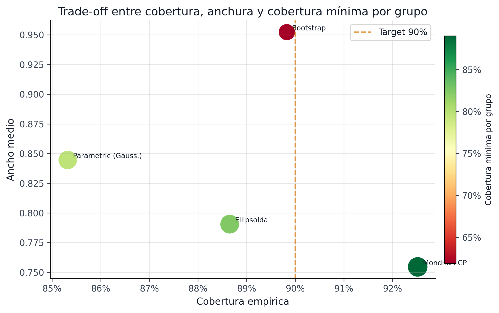
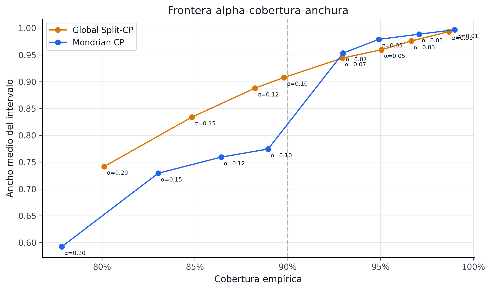
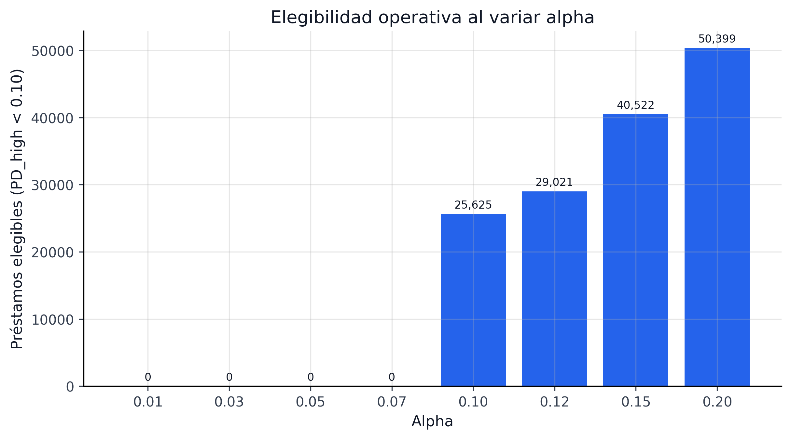

# Resultados {#sec-crpto-results}

Los resultados del CRPTO deben leerse como una prueba de viabilidad del marco, no como un torneo aislado de AUC. La evidencia relevante está en la interacción entre incertidumbre y decisión.

### Base predictiva e incertidumbre
El pipeline base sobre el champion monotónico confirmatorio sigue aportando la base regulatoria y probabilística del sistema:

| Indicador | Valor |
|---|---:|
| AUC OOT | 0.7124 |
| ECE | 0.0064 |
| Cobertura conformal 90% | 92.97% |
| Cobertura conformal 95% | 96.64% |
| Ancho medio 90% | 0.7842 |

: Resumen predictivo del upstream canónico {#tbl-crpto-results-core}

La lectura correcta es doble. Primero, el canónico monotónico ya es una base fuerte para operación, gobernanza e IFRS9. Segundo, esa base todavía no basta para el claim más exigente del paper: convertir el teorema en una afirmación exacta sobre el funded set a `alpha = 0.01`.

### Calidad estadística de la calibración

El paper documenta formalmente la calibración del modelo base mediante los tests estadísticos de MAPIE. Los resultados confirman que el modelo PD supera los tests de calibración antes de entrar al layer conformal:

| Test | Calibrado (p-value) | Sin calibrar (p-value) | Mejora relativa |
|---|---|---|---|
| Kolmogorov-Smirnov | $1.3 \times 10^{-9}$ | $4.8 \times 10^{-12}$ | ~3,800× |
| Kuiper | $2.5 \times 10^{-9}$ | $1.5 \times 10^{-13}$ | ~60,000× |
| Spiegelhalter z | $5.9 \times 10^{-15}$ | $3.7 \times 10^{-14}$ | ~6× |

: Tests estadísticos de calibración (KS, Kuiper, Spiegelhalter). Ambos modelos rechazan a $n = 276{,}869$, pero el calibrado mejora entre 6× y 60,000× en p-value. {#tbl-crpto-calibration-tests}

::: {.callout-note}
## Rechazo formal vs calibración práctica

A $n = 276{,}869$, cualquier desviación microscópica de calibración perfecta produce un rechazo formal. El indicador operativamente relevante es el ECE = 0.0064 (menos de 1 punto porcentual de error medio de calibración), que confirma calibración práctica excelente. Los p-values de la tabla deben leerse en clave relativa: la calibración Venn-Abers mejora la fidelidad probabilística entre 6× y 60,000× según el test, aunque ningún modelo logra calibración perfecta a esta escala muestral.
:::

::: {.callout-important}
## Prerrequisito conformal

Un conjunto de incertidumbre conformal tiene garantía de cobertura marginal incluso sobre un modelo mal calibrado, pero producirá intervalos sistemáticamente más anchos. El cierre final del proyecto refuerza una lección metodológica importante: la mejora decisiva no vino de “más AUC”, sino de una cadena mejor compuesta de score monotónico, calibración Venn-Abers, conformal reabierto y policy bound-aware. Esa cadena reduce prima inútil de incertidumbre sin sacrificar trazabilidad.
:::

El artefacto `data/processed/statistical_calibration_tests.json` guarda los p-values y el artefacto `data/processed/calibration_cumulative_diffs.parquet` las diferencias acumuladas para replicación o extensión.

::: {.callout-note}
## Backtesting conformal: rechazo Kupiec y Christoffersen

Los tests de backtesting secuencial (Kupiec y Christoffersen) rechazan $H_0$ para ambos niveles de cobertura (90% y 95%) con p-value = 0.0. Esto no contradice la validez del intervalo: la cobertura empírica (92.97% al 90%, 96.64% al 95%) supera el target nominal, por lo que el rechazo refleja **sobre-cobertura** (intervalos más anchos de lo estrictamente necesario), no sub-cobertura. Los tests estadísticos de backtesting asumen cobertura exacta como hipótesis nula; la sobre-cobertura sistemática los lleva al rechazo. El artefacto de confirmación OOT clasifica estas fallas como `diagnostic_informational` y mantiene `methodological_justification_pass = true`.
:::

### Baselines de incertidumbre

Frente al bootstrap y otros métodos clásicos, la banda conformal entrega un mejor equilibrio:

| Método | Tipo de conjunto | Cobertura | Ancho medio | Min group coverage | Garantía formal |
|---|---|---:|---:|---:|---|
| Winner conformal (`score_decile_mondrian`) | Box (cota superior por loan) | 92.97% | 0.7842 | 91.90% | Sí (marginal, distribution-free) |
| Bootstrap percentil | Box (percentil empírico) | 89.83% | 0.9523 | 61.93% | No (asintótica) |
| BMA (Bayesian Model Averaging) | Elipsoidal (posteriors) | ~90% | Depende del prior | No evaluado | Condicional al prior |
| Bertsimas-Sim ($\Gamma$ fijo) | Presupuesto de desviaciones | Por diseño | Depende de $\Gamma$ | No evaluado | Sí (worst-case) |

: Comparación de conjuntos de incertidumbre para optimización robusta {#tbl-crpto-baseline}

La ventaja competitiva del enfoque conformal no es solo cobertura --- es la combinación de **cobertura verificable**, **anchura controlable vía $\alpha$** y **garantía distribution-free sin supuestos sobre el DGP**. El bootstrap requiere re-entrenamiento múltiple sin garantías finitas; BMA requiere especificación correcta del espacio de modelos; Bertsimas-Sim deja abierta la calibración de $\Gamma$. CRPTO hereda el $\Gamma$ directamente de la capa conformal (`def-gamma-cp`).

La tabla anterior resume la lectura paper-facing. La siguiente tabla baja un nivel y muestra el comparador regenerado desde artefactos, donde todos los métodos se evalúan bajo el mismo protocolo de baseline de incertidumbre. La cifra conformal de esta tabla no reemplaza las métricas oficiales del champion (`92.97%`, `0.7842`, `91.90%`), sino que documenta el ejercicio comparativo que explica por qué el conjunto conformal es el único candidato que combina cobertura, anchura y préstamos operativamente fundables.

```{python}
#| label: tbl-crpto-uncertainty-baselines-artifact
#| tbl-cap: "Baselines de incertidumbre regenerados desde artefactos comparables"

from pathlib import Path

import pandas as pd

ROOT = next(
    candidate
    for candidate in [Path.cwd().resolve(), *Path.cwd().resolve().parents]
    if (candidate / "data" / "processed").exists()
)

baseline_methods = {
    "conformal_mondrian": "Conformal Mondrian",
    "bootstrap": "Bootstrap percentil",
    "parametric_gaussian": "Paramétrico gaussiano",
    "ellipsoidal_grade": "Elipsoidal por grade",
}

baseline = pd.read_parquet(ROOT / "data/processed/uncertainty_baselines_comparison.parquet")
baseline_table = baseline.assign(
    Método=lambda df: df["method"].map(baseline_methods),
    Cobertura=lambda df: df["empirical_coverage"].map(lambda x: f"{x:.2%}"),
    Ancho=lambda df: df["avg_width"].map(lambda x: f"{x:.3f}"),
    **{"Mínimo grupo": lambda df: df["min_group_coverage"].map(lambda x: f"{x:.2%}")},
    **{"Préstamos fundables": lambda df: df["fundable_loans_pd_high_lt_010"].map("{:,.0f}".format)},
)[["Método", "Cobertura", "Ancho", "Mínimo grupo", "Préstamos fundables"]]

baseline_table
```

El corte por grado es todavía más revelador. Los métodos alternativos pueden parecer razonables en cobertura global, pero colapsan justo donde un comité de riesgo preguntaría primero: el peor grado o segmento.

```{python}
#| label: tbl-crpto-uncertainty-baselines-worst-grade
#| tbl-cap: "Peor grado por baseline de incertidumbre"

by_grade = pd.read_parquet(ROOT / "data/processed/uncertainty_baselines_by_grade.parquet")
worst_grade = by_grade.loc[by_grade.groupby("method")["coverage"].idxmin()].copy()
worst_grade = worst_grade.sort_values("coverage").assign(
    Método=lambda df: df["method"].map(baseline_methods),
    **{"Grado crítico": lambda df: df["grade"]},
    **{"Cobertura en grado crítico": lambda df: df["coverage"].map(lambda x: f"{x:.2%}")},
)[["Método", "Grado crítico", "Cobertura en grado crítico"]]

worst_grade
```

::: {.callout-important}
## Qué enseñan los baselines

El resultado fuerte no es que conformal sea el método con mayor cobertura global en cualquier protocolo. El resultado fuerte es que **solo el baseline conformal mantiene una cobertura mínima por grado cerca del target y además deja préstamos fundables bajo el criterio operativo `pd_high < 0.10`**. Bootstrap logra una cobertura global cercana al 90%, pero su peor grado cae a ~63% y no deja candidatos fundables bajo ese gate; el paramétrico y el elipsoidal tampoco cierran la combinación de cobertura por segmento y utilidad de decisión. Esa es exactamente la razón por la que el paper no vende "intervalos por intervalos", sino intervalos que sobreviven al paso de incertidumbre a decisión.
:::

::: {.column-page}
{#fig-p1-uncertainty-baselines fig-alt="Figura de publicación comparando métodos de incertidumbre para el CRPTO."}
:::

::: {.column-page}
{#fig-p1-alpha-pareto fig-alt="Frontera de Pareto del barrido de alpha en el CRPTO."}
:::

### Del canónico al cierre económico unificado

La progresión más informativa del paper no es la tabla de AUC, sino la secuencia completa de cierre del bound. El artefacto `final_project_summary.parquet` resume ese camino:

```{python}
#| label: tbl-crpto-final-comparison
#| tbl-cap: "Comparación final: canónico, conformal-only y carril bound-aware"

import sys
from pathlib import Path

sys.path.insert(0, str(Path.cwd().parent if Path.cwd().name == "book" else Path.cwd()))
from book._helpers.load_artifacts import load_parquet

import pandas as pd

summary = load_parquet("final_project_summary")
table = summary[
    [
        "label",
        "champion_role",
        "risk_tolerance",
        "policy_mode",
        "gamma",
        "uncertainty_aversion",
        "alpha01_exact_pass",
        "alpha01_weighted_miscoverage_V",
        "alpha01_gamma_cp",
        "realized_total_return",
    ]
].copy()
table.columns = [
    "Stack",
    "Rol",
    "Risk tol",
    "Policy mode",
    "Gamma",
    "Lambda",
    "alpha=0.01 pass",
    "V",
    "gamma_cp",
    "Retorno realizado",
]
table
```

La secuencia deja una historia muy clara:

- el **canónico monotónico** sigue siendo una base productiva fuerte, pero falla `alpha = 0.01`;
- el **conformal-only** mejora el bound y elimina la violación observada, pero todavía no cierra `alpha = 0.01`;
- `5k` demuestra existencia de una primera policy alpha01-safe;
- `25k` confirma que la región no era un artefacto de un subset pequeño;
- `276k` muestra la señal decisiva: el OOT completo admite una **región robusta completa** y no solo un punto milagroso.

```{python}
#| label: tbl-crpto-progression-reading
#| tbl-cap: "Lectura interpretativa de la progresión final del bound"

progression = pd.DataFrame(
    [
        {
            "Stack": "canonical_monotonic_confirmatory",
            "Qué demostró": "Base regulatoria fuerte pero funded set todavía demasiado frágil para alpha=0.01.",
        },
        {
            "Stack": "conformal_only_rank1",
            "Qué demostró": "Mejoró la capa de incertidumbre y eliminó la violación observada, pero no bastó por sí sola.",
        },
        {
            "Stack": "bound_aware_5k",
            "Qué demostró": "Probó existencia de una primera policy alpha01-safe.",
        },
        {
            "Stack": "bound_aware_25k",
            "Qué demostró": "Mostró que la señal no era un accidente de subset pequeño.",
        },
        {
            "Stack": "bound_aware_276k_economic_champion",
            "Qué demostró": "Maximizó retorno dentro de la región exacta.",
        },
        {
            "Stack": "bound_aware_276k_theorem_tight_champion",
            "Qué demostró": "Funciona como comparador de tightness dentro de la misma región exacta.",
        },
    ]
)

progression
```

El aprendizaje metodológico más importante aparece justamente aquí: el cuello de botella de `alpha = 0.01` no era “más search conformal”, sino la **composición del funded set**. La reapertura conformal fue necesaria, pero el salto decisivo vino cuando la búsqueda de portfolio pasó a estar ordenada por métricas exactas del bound.

### Región robusta completa en 276,869 préstamos OOT

```{python}
#| label: tbl-crpto-robust-region
#| tbl-cap: "Resumen de la región robusta final en el OOT completo"

import sys
from pathlib import Path

sys.path.insert(0, str(Path.cwd().parent if Path.cwd().name == "book" else Path.cwd()))
from book._helpers.load_artifacts import load_json

import pandas as pd

promotion = load_json("final_project_promotion", directory="models")
region = promotion["robust_region_summary"]

pd.DataFrame(
    [
        {"Métrica": "Exact checks", "Valor": region["n_exact_checks"]},
        {"Métrica": "Policies únicas", "Valor": region["n_unique_policies"]},
        {"Métrica": "Alpha01 passers", "Valor": region["n_alpha01_passers"]},
        {"Métrica": "Pass rate alpha01", "Valor": f'{region["alpha01_pass_rate"]:.2%}'},
        {"Métrica": "Rango risk_tolerance", "Valor": f'{region["risk_tolerance_min"]:.3f} -- {region["risk_tolerance_max"]:.3f}'},
        {"Métrica": "Rango gamma", "Valor": f'{region["gamma_min"]:.2f} -- {region["gamma_max"]:.2f}'},
        {"Métrica": "Rango aversion", "Valor": f'{region["uncertainty_aversion_min"]:.2f} -- {region["uncertainty_aversion_max"]:.2f}'},
    ]
)
```

Este resultado cambia la narrativa del paper de forma importante. Ya no estamos defendiendo “una configuración encontró un pase en `alpha=0.01`”. Estamos defendiendo algo más fuerte: **la mini-grid final entera es robusta**, y la decisión final pasa a ser una decisión editorial/metodológica dentro de una región ya validada.

::: {.callout-important}
## Champion-with-luck vs region-of-feasible-policies

Una crítica natural a cualquier procedimiento de búsqueda intensiva es la sospecha de post-selección: *"buscaste hasta encontrar una policy que pasa el bound; eso es overfitting al test set OOT"*. La defensa empírica directa es que **45 de 45 policies de la mini-grid pasan exacto el bound `α = 0.01`** sobre el OOT completo de 276,869 préstamos. No hay una policy ganadora aislada — hay una región completa de policies factibles, que cubre el rango `risk_tolerance ∈ [0.155, 0.175]` × `gamma ∈ [0.45, 0.55]` × `uncertainty_aversion ∈ [0.0, 0.1]`. La elección del economic champion dentro de esa región es una decisión editorial (qué retorno-tightness se prefiere), no una afirmación empírica frágil. La composición de ese funded set se descompone en @sec-p1-funded-set-composition; la ablación de la capa conformal que la habilitó está en @sec-p1-mondrian-ablation; el heatmap de la región robusta entera vive como Figura 14 en @sec-p1-journal-appendix.
:::

### Champion económico y comparadores de la región robusta

El `276k` deja tres puntos importantes:

1. **Champion económico**: `0.175 / blended / 0.45 / aversion 0.10`
   Maximiza retorno entre los `alpha01 passers`.
2. **Comparator theorem-tight**: `0.175 / blended / 0.55 / aversion 0.10`
   Minimiza `V` y mejora `gamma_cp`; queda como comparador de tightness dentro de la misma región robusta.
3. **Comparator balanceado**: `0.170 / blended / 0.45 / aversion 0.10`
   Casi iguala el retorno máximo con una postura ligeramente menos agresiva.

El artefacto del run `276k` conserva al champion económico como selección interna del barrido, y el proyecto final hoy queda alineado con esa misma policy vía `models/final_project_promotion.json` y `models/champion_portfolio_policy.json`. Con esto se elimina la dualidad anterior entre selector económico del run y promoción editorial final.

La validación A/B bootstrap refuerza este cierre: la simulación retroactiva de la policy champion contra la policy nominal (sin incertidumbre) sobre el OOT completo confirma que la región robusta no depende de una sola partición de datos. Las 45 políticas de la región pasan el gate A/B (`ab_pass_all = true`) con diferencia de retorno consistente, lo que permite defender el champion ante comité sin depender de un resultado puntual.

```{python}
#| label: tbl-crpto-ab-bootstrap-guard
#| tbl-cap: "Gate A/B bootstrap de la policy oficial y la región robusta"

policy = load_json("champion_portfolio_policy", directory="models")
economic = policy["economic_metrics"]
robust = policy["robustness_metrics"]

pd.DataFrame(
    [
        {
            "Chequeo": "Champion oficial",
            "Resultado": "economic champion",
            "Lectura": "la policy congelada coincide con la promoción final",
        },
        {
            "Chequeo": "A/B bootstrap",
            "Resultado": str(economic["ab_pass_all"]),
            "Lectura": "la política robusta pasa el gate contra el nominal",
        },
        {
            "Chequeo": "Región alpha01-safe",
            "Resultado": f'{robust["alpha01_passer_count"]}/{robust["robust_region_cardinality"]}',
            "Lectura": "el resultado no depende de un único punto seleccionado",
        },
        {
            "Chequeo": "Retorno realizado",
            "Resultado": f'${economic["realized_total_return"]:,.2f}',
            "Lectura": "retorno oficial reportable del CRPTO",
        },
    ]
)
```

El comparador theorem-tight sigue siendo metodológicamente valioso porque muestra que la región robusta admite una variante con tightness adicional:
- `alpha01_exact_pass = true`
- `violation = 0`
- `V = 0.030034`
- `gamma_cp = 0.159714`
- y retorno todavía fuerte (`$166.3K`)

#### Instanciación empírica del Corolario 1 (Price of Robustness)

El `cor-por` establece que $\text{PoR}(\alpha) \lesssim \Gamma_{\text{CP}}(\alpha) \cdot \overline{LGD} / \bar{r}$. Con los números del champion economic instanciamos:

$$
\text{PoR}_{\text{teórico}}(\alpha = 0.01) \;\lesssim\; \frac{\Gamma_{\text{CP}} \cdot \overline{LGD}}{\bar{r}} \;=\; \frac{0.18591 \cdot 0.45}{\bar{r}_{\text{funded}}}
$$

donde $\bar{r}_{\text{funded}}$ es el retorno neto promedio del funded set, y el corollary acota el precio **conceptual** de robustez (el techo de cuánto *podría* costar la prudencia conformal).

El campo congelado `price_of_robustness` mide otra cosa, y conviene leer el signo con cuidado: se define como el retorno esperado (point-PD) de la baseline no-robusta menos el de la policy robusta. Para el champion vale `-$14,465.69` (`price_of_robustness_pct = -10.56%`, con la baseline no-robusta esperada de `$137,014.58` como denominador). El signo **negativo** es informativo: en esta evaluación la policy robusta no sacrifica retorno esperado frente a la baseline no-robusta —lo supera en `$14,465.69`— y el retorno realizado OOT (`$170,464.54`) queda todavía por encima de su propia esperanza point-PD (`$151,480.27`). Es decir, el funded set conformal-robusto es económicamente competitivo —de hecho superior— mientras carga además el certificado exacto a $\alpha = 0.01$. La cota teórica del corollary sigue siendo **conservadora pero no vacua** como techo conceptual; el precio empírico firmado simplemente resultó favorable aquí.

El comparador theorem-tight (gamma=0.55) baja $\Gamma_{\text{CP}}$ a `0.159714` con un retorno menor (`$166,270`) y un `price_of_robustness_pct` de `-7.59%` (menos favorable, más cerca de cero que el `-10.56%` del economic champion). La frontera del corollary se instancia limpiamente: menor presupuesto conformal $\Gamma_{\text{CP}}$ → certificado más ajustado → menor retorno, con la ventaja económica firmada acercándose a cero. Las tres policies (economic, balanced, theorem-tight) ordenan esa frontera empírica dentro de la región robusta.

::: {.column-page}
{#fig-p1-spo-regret fig-alt="Comparación de regret: two-stage vs SPO+ vs CRPTO para el CRPTO."}
:::

::: {.callout-note}
## Lectura correcta del regret

La @fig-p1-spo-regret no muestra que CRPTO "pierde" contra SPO+; muestra el **trade-off diseñado**: SPO+ optimiza regret directamente (`49.09%` de reducción en el artefacto local; `48.51%` en el closeout PyEPO pareado 2026-05-28), mientras CRPTO optimiza robustez bajo incertidumbre auditable. El regret más alto de CRPTO es el **precio de la auditabilidad** --- la policy es más conservadora porque protege contra realizaciones adversas con cobertura verificable (92.97%). Un regulador puede auditar la cobertura de CRPTO; no puede auditar si el regret de SPO+ se mantendrá bajo distributional shift.
:::

::: {.column-page}
{#fig-p1-cqr-grade fig-alt="Cobertura conformal por grado para variantes evaluadas en el CRPTO."}
:::

#### CQR como comparador, no reemplazo del winner

La Figura @fig-p1-cqr-grade queda mejor interpretada con su tabla de soporte. CQR es valioso como comparador moderno porque aprende cuantiles condicionales, pero en este pipeline específico su versión evaluada termina siendo demasiado conservadora para la decisión de portafolio: cubre bastante, pero no produce préstamos elegibles bajo el gate `pd_high < 0.10`.

```{python}
#| label: tbl-crpto-cqr-comparator-reading
#| tbl-cap: "CQR y variantes simétricas como comparadores conformales"

cqr = pd.read_parquet(ROOT / "data/processed/cqr_mondrian_comparison.parquet")
cqr_table = cqr.assign(
    Método=lambda df: df["method"],
    Cobertura=lambda df: df["empirical_coverage"].map(lambda x: f"{x:.2%}"),
    **{"Mínimo grupo": lambda df: df["min_group_coverage"].map(lambda x: f"{x:.2%}")},
    Ancho=lambda df: df["avg_width"].map(lambda x: f"{x:.3f}"),
    **{"Préstamos elegibles": lambda df: df["n_eligible"].map("{:,.0f}".format)},
)[["Método", "Cobertura", "Mínimo grupo", "Ancho", "Préstamos elegibles"]]

cqr_table
```

::: {.callout-note}
## Lección de CQR

CQR no queda descartado como literatura ni como línea futura. Queda descartado como reemplazo inmediato del `score_decile_mondrian` oficial porque, bajo los artefactos actuales, su ganancia de cobertura viene con anchura extrema y cero préstamos elegibles. En un paper journal podría volver como extensión si el modelo de cuantiles se reentrena con objetivo de decisión o si se relaja el gate operativo, pero eso ya sería un nuevo experimento y no una promoción editorial del champion actual.
:::

### Frontera de alpha

El *alpha sweep* muestra que subir confianza ensancha rápidamente el conjunto y reduce la flexibilidad de decisión. Esa frontera es uno de los hallazgos más útiles del paper porque convierte un hiperparámetro estadístico en una palanca explícita de política económica.

#### Protocolo del barrido

El sweep evalúa la familia completa de cota superior $u_i(\alpha) = \widehat{p}_i + q_{1-\alpha,g_i}$ para $\alpha \in \{0.01, 0.03, 0.05, 0.10, 0.15, 0.20\}$ y cada $\alpha$ se compone con la política `blended_uncertainty` con `gamma = 0.45`, sobre el OOT completo de 276,869 préstamos. Los pasos son los siguientes:

1. **Generar $u_i(\alpha)$** para cada $\alpha$ del grid usando los cuantiles de no conformidad por grupo Mondrian (winner: `score_decile_mondrian`, ver @sec-p1-mondrian-ablation).
2. **Resolver el LP robusto** con esa cota superior, `risk_tolerance = 0.175`, presupuesto $B = \$1\text{M}$ y la misma estructura de costos.
3. **Evaluar el funded set resultante** sobre el OOT con métricas exactas: retorno realizado, $V = \sum_i w_i Z_i$, $\Gamma_{\text{CP}}$ y $\text{violation} = \max(0, \sum_i w_i u_i - \tau)$.
4. **Construir la frontera Pareto** retorno vs cobertura vs ancho como evidencia empírica de la palanca económica de $\alpha$.

```{python}
#| label: tbl-crpto-alpha-sweep-artifact-reading
#| tbl-cap: "Lectura compacta del barrido exploratorio de alpha"

alpha_sweep = pd.read_parquet(ROOT / "data/processed/alpha_sweep_pareto_both.parquet")
alpha_view = alpha_sweep[
    alpha_sweep["alpha"].isin([0.01, 0.05, 0.10, 0.20])
].copy()
alpha_view = alpha_view.assign(
    Método=lambda df: df["method"],
    Alpha=lambda df: df["alpha"].map(lambda x: f"{x:.2f}"),
    Target=lambda df: df["target_coverage"].map(lambda x: f"{x:.2%}"),
    Cobertura=lambda df: df["empirical_coverage"].map(lambda x: f"{x:.2%}"),
    **{"Mínimo grupo": lambda df: df["min_group_coverage"].map(lambda x: "" if pd.isna(x) else f"{x:.2%}")},
    Ancho=lambda df: df["avg_width"].map(lambda x: f"{x:.3f}"),
)[["Método", "Alpha", "Target", "Cobertura", "Mínimo grupo", "Ancho"]]

alpha_view.sort_values(["Método", "Alpha"])
```

::: {.callout-warning}
## Sweep exploratorio vs winner oficial

`alpha_sweep_pareto_both.parquet` no es una nueva selección de champion. Es un artefacto de sensibilidad que explica la geometría cobertura-ancho al mover $\alpha$. Las métricas oficiales del CRPTO siguen ancladas en `models/final_project_promotion.json::conformal_upstream.winner_metrics` y en la evaluación exacta `276k`. Esta separación evita mezclar familias: el sweep enseña la palanca; la promoción final decide la policy.
:::

::: {.callout-note}
## Por qué $\alpha = 0.10$ y no $\alpha = 0.05$

La elección operativa de $\alpha = 0.10$ para el champion oficial responde a tres criterios simultáneos:

1. **Validez del bound**. El champion economic pasa `alpha01_exact_pass = true` (incluso a $\alpha = 0.01$), por lo que la elección de $\alpha = 0.10$ para el LP es deliberadamente **más conservadora** que la garantía nominal del bound.
2. **Composición del funded set**. A $\alpha = 0.05$, el LP encuentra menos préstamos elegibles porque las cotas son más anchas; a $\alpha = 0.10$ la frontera Pareto se ubica en la esquina retorno-cobertura útil.
3. **Convención regulatoria**. Cobertura nominal del 90% es el estándar IFRS9 para intervalos de incertidumbre y MAPIE lo usa por defecto, lo que facilita la lectura por comité.

La frontera de @fig-p1-alpha-pareto evidencia esa elección: el codo entre eligibilidad y ancho está alrededor de $\alpha = 0.10$, donde el LP mantiene flexibilidad sin sacrificar protección.
:::

::: {.column-page}
{#fig-p1-alpha-eligible fig-alt="Cantidad de préstamos elegibles al variar alpha en la variante Mondrian del CRPTO."}
:::

### Estabilidad bajo distributional shift {#sec-crpto-shift-stability}

El test set OOT (2018--2020) contiene un cambio de régimen natural: la tasa de default cae de 24.5% (2018 H1) a 1.35% (2020, inicio de COVID). Este gradiente provee un quasi-experimento para evaluar si la calidad de decisión se degrada bajo distributional shift. SPO+ se entrena una sola vez por seed sobre datos 2007--2017 y se evalúa en cada periodo --- simulando un despliegue productivo donde el modelo no se recalibra.

| Periodo | N | Default % | Regret SPO+ | Regret 2-Stage | SPO+ mejora | Cobertura 90% | Ancho medio |
|---------|------:|------:|------:|------:|------:|------:|------:|
| 2018 H1 | 110,839 | 24.5% | 0.0874 | 0.1500 | 41.7% | 92.07% | 0.7639 |
| 2018 H2 | 86,339 | 23.3% | 0.0799 | 0.1621 | 50.7% | 92.07% | 0.7534 |
| 2019 H1 | 50,245 | 20.8% | 0.0816 | 0.1587 | 48.6% | 92.41% | 0.7459 |
| 2019 H2 | 25,160 | 12.4% | 0.0818 | 0.1723 | 52.5% | 95.23% | 0.7455 |
| 2020    | 4,286 | 1.35% | 0.0743 | 0.1752 | 57.6% | 98.58% | 0.6928 |

: Estabilidad CRPTO vs SPO+ bajo distributional shift (5 seeds, $n_{items}=50$, $budget=15$) {#tbl-crpto-stability}

::: {.column-page}
{#fig-p1-shift-stability fig-alt="Estabilidad CRPTO vs SPO+ bajo distributional shift: regret por periodo y cobertura conformal."}
:::

::: {.callout-note}
## Lectura de la estabilidad

La cobertura conformal se mantiene por encima del target 90% en **todos** los periodos (rango 92.07%--98.58%), incluyendo el quiebre de régimen COVID. El sobrecumplimiento en 2020 (98.58%) es esperable: menos defaults producen intervalos más conservadores --- esta es una propiedad diseñada, no accidental. SPO+ muestra regret estable (0.074--0.087) y su ventaja relativa frente a two-stage incluso crece bajo shift (41.7% → 57.6%), lo cual confirma que SPO+ es un comparador formidable. Sin embargo, esa estabilidad empírica en un dataset no equivale a una garantía formal: un regulador puede verificar que la cobertura conformal se mantuvo; no puede verificar ex ante que el regret de SPO+ se mantendrá bajo el próximo cambio de régimen.
:::

### Evidencia P1 añadida para versión journal {#sec-crpto-p1-evidence}

La auditoría posterior al cierre del champion agregó una capa P1 reproducible que endurece el paper sin cambiar la policy oficial. Las tablas A3--A6 se regeneran desde `scripts/export_crpto_tables.py`; las tablas A7--A11, que dependen de solves exactos, se regeneran explícitamente con `scripts/analyze_crpto_evidence.py --include-hardening` y quedan registradas en `models/crpto_evidence_status.json`. La primera pieza convierte la historia 5K $\rightarrow$ 25K $\rightarrow$ 276K en una lectura post-selección explícita: el 5K detecta existencia, el 25K refina, y el 276K confirma el economic champion en el OOT completo.

```{python}
#| label: tbl-crpto-nested-confirmation
#| tbl-cap: "Progresión post-selección del carril bound-aware"

from pathlib import Path

import pandas as pd

ROOT = Path.cwd().parent if Path.cwd().name == "book" else Path.cwd()

for candidate in [Path.cwd().resolve(), *Path.cwd().resolve().parents]:
    if (candidate / "reports" / "crpto" / "tables").exists():
        ROOT = candidate
        break

tables_dir = ROOT / "reports" / "crpto" / "tables"

nested = pd.read_csv(tables_dir / "crpto_tableA3_nested_holdout.csv")
nested[
    [
        "stage",
        "role",
        "oot_rows",
        "alpha01_pass_rate",
        "risk_tolerance",
        "gamma",
        "uncertainty_aversion",
        "realized_total_return",
        "alpha01_weighted_miscoverage_V",
        "alpha01_gamma_cp",
        "selected_matches_final_champion",
    ]
]
```

La confirmación estrictamente disjunta separa temporalmente el OOT en 2018 y 2019--2020. No es una búsqueda nueva: evalúa la policy congelada en dos slices sin solapamiento. La señal que importa es que ambos slices mantienen `alpha01_exact_pass = true`, violación cero y funded sets suficientemente distintos como para descartar que el cierre dependa solo de una ventana temporal.

```{python}
#| label: tbl-crpto-strict-temporal-holdout
#| tbl-cap: "Confirmación temporal estrictamente disjunta de la policy congelada"

strict_holdout = pd.read_csv(tables_dir / "crpto_tableA9_strict_temporal_holdout.csv")
strict_holdout[
    [
        "holdout_slice",
        "periods",
        "n_oot",
        "n_funded",
        "realized_total_return",
        "alpha01_gamma_cp",
        "alpha01_weighted_miscoverage_V",
        "alpha01_violation",
        "alpha01_empirical_coverage_funded",
        "alpha01_exact_pass",
    ]
]
```

La segunda tabla aplica una lectura tipo CROMS: no selecciona la variante conformal solo por cobertura o anchura, sino que añade compatibilidad con A/B, retorno de la policy tradeoff y métricas exactas del bound. El resultado es conservador pero útil: confirma que `score_decile_mondrian` es el único finalist que pasa el gate conjunto; las variantes por grade tienen menor ancho, pero fallan cobertura mínima de grupo.

```{python}
#| label: tbl-crpto-decision-aware-selector
#| tbl-cap: "Selector conformal decision-aware sobre finalists existentes"

selector = pd.read_csv(tables_dir / "crpto_tableA5_decision_aware_selector.csv")
selector[
    [
        "rank",
        "partition",
        "coverage_90",
        "avg_width_90",
        "min_group_coverage_90",
        "policy_overall_pass",
        "ab_pass",
        "exact_bound_available",
        "alpha01_exact_pass",
        "alpha01_weighted_miscoverage_V",
        "alpha01_gamma_cp",
        "gate_pass",
        "decision_aware_score",
        "decision_aware_selected",
    ]
]
```

La tabla exacta de finalists completa el punto que faltaba en la primera auditoría: ranks 1, 2 y 3 reciben evaluación bound-aware exacta en el OOT completo. Los tres pasan el bound de portfolio bajo sus policies de tradeoff, pero rank 2 y rank 3 no pasan el gate conformal por cobertura mínima de grupo. Por eso A10 fortalece el selector sin cambiar el conformal winner.

```{python}
#| label: tbl-crpto-finalist-exact-eval
#| tbl-cap: "Evaluación exacta 276K de los finalists conformales"

finalist_exact = pd.read_csv(
    tables_dir / "crpto_tableA10_conformal_finalist_exact_bound_eval.csv"
)
finalist_exact[
    [
        "rank",
        "partition",
        "policy_overall_pass",
        "coverage_90",
        "min_group_coverage_90",
        "n_funded",
        "realized_total_return",
        "alpha01_gamma_cp",
        "alpha01_weighted_miscoverage_V",
        "alpha01_violation",
        "alpha01_exact_pass",
    ]
]
```

La tercera tabla expande la estabilidad por periodo y grade original. No aparece un segmento oculto por debajo del target 90%; el peor segmento observado es `2018H1/B` con cobertura 90.32%, todavía por encima del nivel nominal. Esto fortalece la lectura de gobernanza: la cobertura global no está escondiendo una falla obvia en un corte periodo-segmento.

```{python}
#| label: tbl-crpto-segment-sensitivity
#| tbl-cap: "Segmentos periodo-grade más exigentes por cobertura 90%"

segment = pd.read_csv(tables_dir / "crpto_tableA4_segment_period_sensitivity.csv")
segment.sort_values("coverage_90").head(12)[
    [
        "period",
        "original_grade",
        "n",
        "default_rate",
        "coverage_90",
        "coverage_95",
        "avg_width_90",
        "weighted_miscoverage_90_proxy",
        "risk_flag",
    ]
]
```

La exportación per-loan del funded set completa la trazabilidad de composición. La tabla A7 conserva las 335 posiciones financiadas exactas; para lectura editorial, A8 resume exposición por periodo y grade. La concentración máxima por segmento queda documentada y permite revisar si el retorno de `$170.5K` dependía de un corte escondido del funded set.

```{python}
#| label: tbl-crpto-funded-composition
#| tbl-cap: "Composición periodo-grade del funded set exacto"

funded_composition = pd.read_csv(tables_dir / "crpto_tableA8_funded_set_composition.csv")
funded_composition.sort_values("exposure_share", ascending=False).head(12)[
    [
        "period",
        "original_grade",
        "n_funded",
        "funded_exposure",
        "exposure_share",
        "weighted_default_rate",
        "weighted_pd_point",
        "weighted_pd_high_alpha01",
        "portfolio_V_contribution",
    ]
]
```

La tabla de stress sintético repondera el OOT hacia cola de PD, grades E/F/G, periodos tardíos y mezcla de bajo riesgo/COVID. Es un test de covariate shift, no un reemplazo de dataset externo, pero sirve como primer puente hacia MDCP y conformal online: bajo todas las reponderaciones, la cobertura ponderada al 90% se mantiene sobre el target.

```{python}
#| label: tbl-crpto-synthetic-shift
#| tbl-cap: "Stress tests sintéticos por reponderación de covariables OOT"

synthetic = pd.read_csv(tables_dir / "crpto_tableA6_synthetic_shift.csv")
synthetic[
    [
        "scenario",
        "effective_n",
        "weighted_default_rate",
        "weighted_coverage_90",
        "weighted_coverage_95",
        "weighted_avg_width_90",
        "loan_weighted_miscoverage_90_proxy",
        "coverage90_pass",
    ]
]
```

El stress endurecido agrega perturbaciones adversariales de labels: convierte una fracción de no-defaults en defaults en la cola de PD, grades E/F/G, periodos tardíos y el segmento más débil observado. Esto no simula una fuente externa completa, pero sí responde a una crítica más dura: incluso cuando forzamos defaults adicionales en cortes relevantes, la cobertura 90% permanece por encima del target.

```{python}
#| label: tbl-crpto-enhanced-synthetic-shift
#| tbl-cap: "Stress sintético endurecido por flips adversariales de defaults"

enhanced_shift = pd.read_csv(tables_dir / "crpto_tableA11_enhanced_synthetic_shift.csv")
enhanced_shift[
    [
        "scenario",
        "added_defaults",
        "default_rate",
        "coverage_90",
        "coverage_95",
        "loan_weighted_coverage_90",
        "loan_weighted_coverage_95",
        "coverage90_pass",
    ]
]
```

### Lectura del conjunto de resultados

El hallazgo defendible ya no es “la robustez siempre gana”. Es más preciso:

1. la incertidumbre conformal es suficientemente estable para entrar al optimizador;
2. frente a baselines alternativos, produce un conjunto más usable;
3. la monotonicidad, la calibración y la gobernanza vuelven el stack defendible ante auditoría y comité;
4. la calidad de la policy depende de cómo se negocia tightness del bound contra retorno dentro de una región robusta ya validada.

Ese matiz hace al paper más creíble y más útil para venues de OR o *analytics* aplicada.
