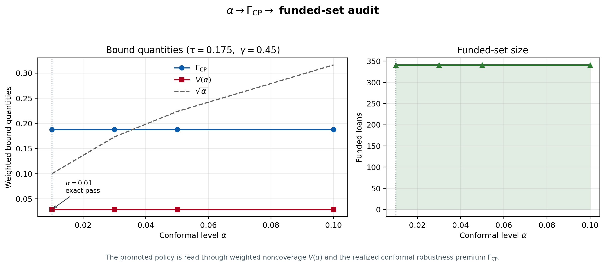
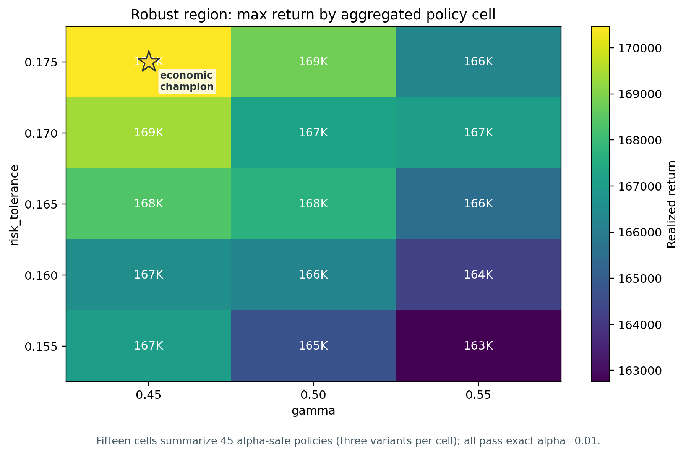
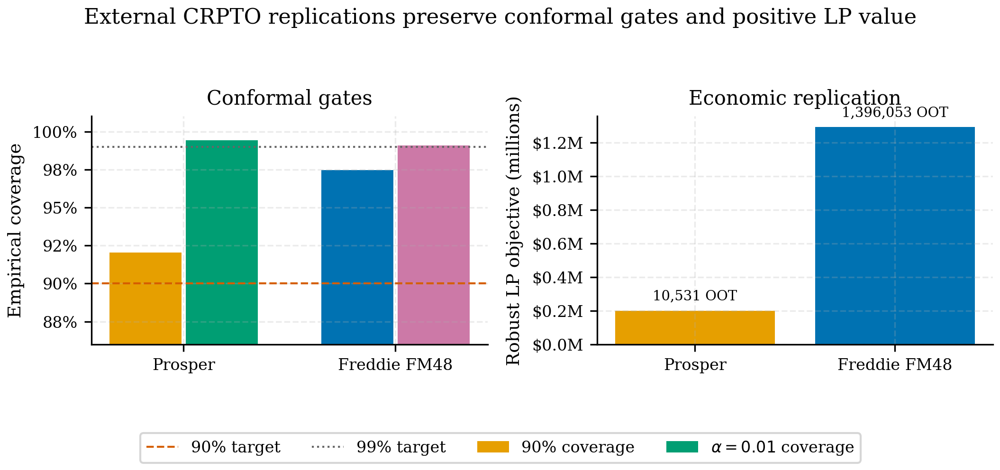
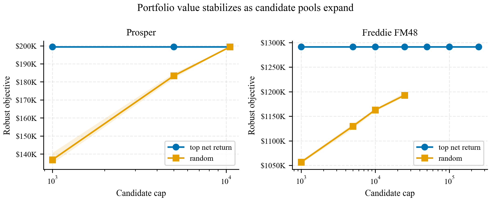

<!-- crpto-companion-status: retired-historical-source -->

::: {.callout-warning title="Fuente histórica retirada"}
Esta página no pertenece al companion activo. Se conserva solo como procedencia,
puede contradecir el estimando y los claims vigentes y no debe citarse como
evidencia del manuscrito activo. La autoridad está en las superficies
registradas por `book/_quarto.yml`.
:::


## Apéndice Journal-Ready de Robustez {#sec-p1-journal-appendix}

Esta página agrupa el material que fortalece el CRPTO sin cambiar su
dirección. La idea es dejar listo el paquete de appendix para una versión
journal: tail risk, satisficing, dependencia, stress temporal, bootstrap,
sensibilidad a presupuesto/LGD/caps, región robusta por familia de policy y
frontera regret-auditabilidad.

Los artefactos se generan con:

```bash
uv run python scripts/build_crpto_journal_package.py
```

El script usa solamente artefactos congelados del CRPTO. No reabre la
búsqueda de champion y no reemplaza el retorno oficial del paper.

```{python}
#| label: p1-journal-setup
#| include: false

from pathlib import Path

import pandas as pd

cwd = Path.cwd().resolve()
root = next(
    candidate
    for candidate in [cwd, *cwd.parents]
    if (candidate / "reports" / "crpto").exists()
    and (candidate / "models").exists()
)
tables_dir = root / "reports" / "crpto" / "tables"
figures_dir = root / "reports" / "crpto" / "figures"
status_path = root / "models" / "crpto_journal_package_status.json"


def read_table(name: str) -> pd.DataFrame:
    return pd.read_csv(tables_dir / name)
```

### Figura conceptual CRPTO

La Figura @fig-p1-crpto-conceptual es la candidata natural para Figura 1 del
paper IJDS: es la versión corta, limpia y en ingles del flujo PD -> CP ->
incertidumbre -> LP -> certificado. El diagrama maestro largo del libro
(@fig-crpto-overview) queda como companion visual y como vista pedagógica de la
tesis.

{#fig-p1-crpto-conceptual fig-alt="Figura de cuatro paneles que conecta PD calibrada congelada, intervalos conformales Mondrian, optimización robusta de portafolio y policy promovida auditable con métricas del champion."}

### Alpha, `Gamma_CP` y funded set

La Figura @fig-p1-alpha-gamma-funded-set conecta el parámetro conformal con las
cantidades que el comité de riesgo si puede leer: prima de robustez, no
cobertura ponderada y número de préstamos financiados.

{#fig-p1-alpha-gamma-funded-set fig-alt="Gráfica de líneas que muestra Gamma_CP, V, raiz de alpha y número de préstamos financiados al variar alpha."}

### Región robusta `45/45`

La Figura @fig-p1-robust-region-heatmap es la evidencia visual de que el
champion no es un punto aislado. Cada celda resume la mejor rentabilidad de una
familia `risk_tolerance` por `gamma`, dentro de la mini-grid final exacta.

{#fig-p1-robust-region-heatmap fig-alt="Heatmap de retornos por risk tolerance y gamma; todas las familias pasan alpha01 en la región robusta final."}

### A12. Tail risk OCE/CVaR

Esta tabla responde una pregunta natural de journal: si el funded set tiene buen
retorno y buen bound, ¿que pasa con la cola de pérdida realizada? La respuesta
se reporta como diagnóstico sobre el funded set exacto, no como una nueva
optimización.

```{python}
#| label: tbl-crpto-journal-tail-risk
#| tbl-cap: "A12. Tail risk del funded set exacto bajo LGD alternativos"

tail = read_table("crpto_tableA12_tail_risk_oce_cvar.csv")
tail.round(4)
```

Lectura: `mean_loss_rate` negativo equivale a retorno medio positivo. Los
campos `cvar_90_loss_rate`, `cvar_95_loss_rate` y `cvar_99_loss_rate` muestran
la severidad de cola bajo pesos del funded set. La columna
`funded_set_repriced_return` es una repricing diagnostic loan-level; el retorno
oficial del champion sigue siendo `$170,464.54` desde
`models/final_project_promotion.json`.

### A13. Satisficing margins

Satisficing traduce el resultado a lenguaje OR: no solo maximizamos retorno,
sino que pasamos umbrales mínimos de seguridad y holgura.

```{python}
#| label: tbl-crpto-journal-satisficing
#| tbl-cap: "A13. Margenes satisficing de la policy oficial"

satisficing = read_table("crpto_tableA13_satisficing_margins.csv")
satisficing.round(4)
```

Esta tabla es útil para la introducción y la discusión. Permite decir que el
champion económico supera al comparador theorem-tight en retorno, mantiene
`V <= sqrt(alpha)` y conserva `Gamma_CP` bajo un techo editorial de 20 puntos
porcentuales.

### A14. Diagnósticos de dependencia por cluster

El tightening Hoeffding/Bernstein necesita independencia adicional. No la
podemos asumir gratis; por eso documentamos estructura de dependencia y
concentracion por periodo, grade y periodo-grade.

```{python}
#| label: tbl-crpto-journal-dependency
#| tbl-cap: "A14. Clusters con mayor exposición y contribución al bound"

dependency = read_table("crpto_tableA14_dependency_cluster_diagnostics.csv")
dependency.sort_values(["exposure_share", "V_contribution"], ascending=False).head(15).round(4)
```

Esta tabla no prueba independencia. Su función es más honesta: mostrar dónde
está concentrada la exposición y que clusters cargan la no-cobertura ponderada.
Eso fortalece el appendix teórico porque evita vender el tightening condicional
como si ya estuviera demostrado distribution-free.

### A15. Leave-one-period-out y stress temporal

La crítica de post-selección suele preguntar si el resultado depende de un solo
periodo OOT. Esta tabla mantiene el funded set exportado, remueve o sobrepondera
periodos y re-normaliza pesos para medir sensibilidad.

```{python}
#| label: tbl-crpto-journal-period-stress
#| tbl-cap: "A15. Stress leave-one-period-out y overweight 2x sobre el funded set"

period_stress = read_table("crpto_tableA15_leave_one_period_stress.csv")
period_stress.round(4)
```

De nuevo, esto es diagnóstico, no re-optimización. Sirve para revisar si `V`,
`Gamma_CP`, default ponderado o concentracion máxima se vuelven inestables al
mover masa temporal.

### A16. Bootstrap del funded set

El bootstrap no reemplaza el bound conformal. Sirve para dar intervalos
empiricos sobre métricas realizadas del funded set y preparar respuestas a
reviewers que pidan incertidumbre de segundo orden.

```{python}
#| label: tbl-crpto-journal-bootstrap
#| tbl-cap: "A16. Bootstrap empírico del funded set exacto"

bootstrap = read_table("crpto_tableA16_bootstrap_funded_set_metrics.csv")
bootstrap.round(4)
```

La fila de retorno bootstrap también usa `funded_set_repriced_return_lgd45`;
por eso no debe citarse como retorno oficial del champion. El paper final debe
citar retorno oficial desde `final_project_promotion.json` y usar esta tabla
como sensibilidad.

### A17. Presupuesto, LGD y caps de concentracion

La tabla A17 agrupa tres preguntas aplicadas:

- ¿que pasa si el mismo funded set se escala a otro presupuesto?
- ¿cómo cambia el retorno loan-level si LGD pasa de 35% a 60%?
- ¿el funded set viola caps simples de concentracion por segmento?

```{python}
#| label: tbl-crpto-journal-budget-lgd-cap
#| tbl-cap: "A17. Sensibilidad diagnostica a presupuesto, LGD y caps de concentracion"

budget_cap_lgd = read_table("crpto_tableA17_budget_cap_lgd_sensitivity.csv")
budget_cap_lgd[
    [
        "sensitivity_type",
        "scenario",
        "value",
        "funded_set_repriced_return_lgd45",
        "weighted_default_rate",
        "weighted_miscoverage_V",
        "diagnostic_pass",
    ]
].round(4)
```

La columna `diagnostic_pass` en los caps no dice que el optimizador resolvió un
problema con esa restricción. Dice si el funded set exportado ya satisface ese
cap simple. Si un reviewer pide caps reales como constraint, eso sería un nuevo
experimento P2, no una correccion al champion actual.

### A18. Región robusta por familia de policy

Esta tabla es el par tabular del heatmap. Resume todas las familias finales
`risk_tolerance x gamma` y confirma que todas las celdas tienen pass rate
`alpha01 = 1.0`.

```{python}
#| label: tbl-crpto-journal-robust-region-family
#| tbl-cap: "A18. Región robusta final por familia risk_tolerance x gamma"

robust_region = read_table("crpto_tableA18_robust_region_policy_family.csv")
robust_region[
    [
        "risk_tolerance",
        "gamma",
        "n_policies",
        "alpha01_pass_rate",
        "best_return",
        "min_V",
        "median_gamma_cp",
        "all_alpha01_pass",
    ]
].round(4)
```

Esta es una de las mejores defensas del paper: el resultado de abril no es
"un champion con suerte", sino una región final donde todas las policies
evaluadas pasan el gate exacto.

### A19. Frontera regret-auditabilidad

Esta tabla vuelve explícita la comparación editorial con SPO+: SPO+ gana el
juego de regret, mientras CRPTO ocupa la esquina donde hay cobertura temporal,
bound exacto y región robusta verificable. No es un nuevo selector ni una
promoción alternativa del champion.

```{python}
#| label: tbl-crpto-journal-regret-auditability
#| tbl-cap: "A19. Frontera regret-auditability entre two-stage, SPO+ y CRPTO"

frontier = read_table("crpto_tableA19_regret_auditability_frontier.csv")
frontier[
    [
        "method",
        "mean_regret",
        "regret_delta_vs_two_stage_pct",
        "coverage_90_range",
        "exact_funded_set_bound",
        "robust_region_pass",
        "auditability_evidence_count",
    ]
].round(4)
```

{#fig-p1-regret-auditability fig-alt="Scatter plot con regret medio en el eje x y controles verificables de riesgo en el eje y para two-stage, SPO+ y CRPTO robust."}

Lectura para el paper: CRPTO no promete dominar a SPO+ en regret puro. Su
contribución es hacer visible el precio de comprar cobertura, bound exacto y
auditabilidad del funded set.

### A20. Auditoría tail-risk de la región robusta

Esta tabla resuelve de nuevo las 45 policies de la región robusta con HiGHS y las
ordena por CVaR 95%, OCE entrópico, retorno y estado de *satisficing*. Como
todas las políticas pasan la pantalla de *satisficing*, A20 ya no debe leerse
como una promoción de challenger sino como una frontera de cola dentro de la
región robusta. Sirve para responder la pregunta de reviewer: "¿cuánta cola se
puede reducir sin salir del conjunto alpha-safe?".

```{python}
#| label: tbl-crpto-journal-tail-risk-robust-region
#| tbl-cap: "A20. Auditoría tail-risk de las 45 policies alpha-safe"

tail_challenger = read_table("crpto_tableA20_tail_satisficing_challenger_audit.csv")
_a20_cols = {
    "tail_satisficing_rank": "rank",
    "paper_role": "rol",
    "realized_total_return": "retorno",
    "return_delta_vs_champion_pct": "delta_ret_pct",
    "cvar_95_loss_rate": "CVaR95",
    "entropic_oce_theta5": "OCE",
    "satisficing_pass": "pass",
}
tail_challenger[list(_a20_cols)].rename(columns=_a20_cols).head(12).round(4)
```

Lectura: la política de menor CVaR realizado reduce la cola frente al economic
champion con una pérdida de retorno cercana a 2%. Es evidencia de trade-off, no
una corrección de la policy promovida.

{#fig-p1-tail-risk-frontier fig-alt="Scatter de retorno realizado (eje x) contra CVaR 95% (eje y) para las 45 políticas de la región robusta; todas pasan satisficing y el champion económico aparece como estrella naranja en la zona de mayor retorno."}

### A21. Bound cluster-aware

Esta tabla convierte el caveat de dependencia en números. Bajo independencia
condicional entre agregados de cluster, la cota Hoeffding usa
`sum_g W_g^2`. En este funded set, la concentracion de exposición hace que esa
cota sea más laxa que `sqrt(alpha)`, así que Markov sigue siendo el bound
principal del paper.

```{python}
#| label: tbl-crpto-journal-cluster-bound-tightening
#| tbl-cap: "A21. Cotas cluster-aware bajo supuestos adicionales de independencia"

cluster_bounds = read_table("crpto_tableA21_cluster_bound_tightening.csv")
cluster_bounds[
    [
        "cluster_type",
        "n_clusters",
        "max_cluster_exposure_share",
        "delta",
        "markov_sqrt_alpha_threshold",
        "cluster_hoeffding_threshold",
        "cluster_bound_tighter_than_markov",
    ]
].round(4)
```

### A22. re-optimización con restricción de cola (CVaR/OCE)

Esta tabla cierra el item P2 "OCE/CVaR como restricción re-optimizada":
convierte el diagnóstico de cola A12 en una **restricción activa de selección**.
Re-resuelve las 45 políticas de la región robusta con HiGHS, mide para cada
funded set la CVaR 95% y el OCE entrópico del peor caso *decision-time* ---
basado en la cota conformal `pd_high` ($u_i$), no en defaults observados --- y
barre un techo de CVaR como constraint: en cada nivel selecciona la política
`alpha01`-safe de mayor retorno que respeta el techo. El resultado es la frontera
retorno-vs-cola y una política *tail-constrained challenger*. La decisión se toma
solo con intervalos conformales; los labels entran únicamente en el retorno
realizado congelado. No reabre la búsqueda del champion ni reemplaza la policy
oficial: el economic champion sigue siendo el champion promovido.

```{python}
#| label: tbl-crpto-journal-tail-constrained-reopt
#| tbl-cap: "A22. Frontera retorno-vs-CVaR con techo de cola como restricción de selección (columnas clave; CSV completo en reports/crpto/tables/)"

tail_reopt = read_table("crpto_tableA22_tail_constrained_reoptimization.csv")
_a22_cols = {
    "cvar95_cap": "CVaR95 cap",
    "selected_paper_role": "Rol",
    "selected_realized_total_return": "Retorno",
    "return_delta_vs_champion_pct": "Delta% vs champ",
    "selected_decision_time_cvar95": "CVaR95 dt",
    "selected_alpha01_weighted_miscoverage_V": "V",
    "selected_n_funded": "n fin.",
}
tail_reopt[list(_a22_cols)].rename(columns=_a22_cols).round(4)
```

{#fig-p1-tail-constrained-frontier fig-alt="Línea ascendente de retorno realizado (eje y, miles USD) contra techo de CVaR95 decision-time (eje x); el economic champion es una estrella en la esquina superior derecha y el cap más estricto un diamante abajo a la izquierda."}

Lectura: la frontera muestra cuánto retorno se conserva al endurecer el techo de
CVaR. Coherente con A20, el economic champion no es la esquina de menor cola: en
el cierre `276k` ocupa el extremo de mayor retorno y mayor CVaR de la frontera, y
sigue siendo la policy oficial. Al imponer un techo más estricto aparece un
*tail-constrained challenger*: la esquina más estricta sacrifica más retorno
(`-5.57%` en A22), mientras A20 muestra que, bajo CVaR realizado, hay una
reducción de cola de `22.58%` con costo cercano a `-2%`. No son el mismo
criterio: A22 usa
`pd_high` (peor caso conformal) y por eso es más conservadora que la CVaR
realizada de A20. La lectura común es que el champion maximiza retorno dentro de
la región alpha-safe, no que minimiza cola. El
soporte teórico para tratar CVaR/OCE como objetivo de control conformal viene de
[@angelopoulos2026nonmonotonic] (pérdidas no monotonas), [@rockafellar2000cvar]
(CVaR) y [@bental2007oce] (OCE). El estado reproducible queda en
`models/crpto_tail_constrained_reopt_status.json`.

### A23. Robustez multi-distribución (cobertura por grupo y celda)

Esta tabla responde el item P2 "robustez multi-distribución / grupos
desconocidos" en el espiritu de [@yang2026multidistribution] y
[@bhattacharyya2026groupweighted]. Sobre los intervalos conformales congelados
mide la cobertura 90% marginal, por `grade` y por la celda `grade x vintage` más
adversa con soporte mínimo, para ver si la garantía sobrevive cuando una
distribución de grupo desconocida domina el conjunto de test.

```{python}
#| label: tbl-crpto-journal-multidistribution
#| tbl-cap: "A23. Cobertura 90% por grupo y peor celda grade x vintage"

multidist = read_table("crpto_tableA23_multidistribution_robustness.csv")
multidist.round(4)
```

Lectura: la cobertura marginal y la de cada `grade` se mantienen sobre el target
90% --- grade E es el más ajustado, coherente con la debilidad conformal
documentada en el registro de negativos --- pero la peor celda `grade x vintage`
cae por debajo del 90%. Es decir: la cobertura es robusta a nivel de grupo
conocido, mientras que la celda fina más adversa exhibe un gap. Ese es
exactamente el riesgo que la cobertura multi-distribución (MDCP /
group-weighted) atacaría; aquí queda documentado como caveat honesto, no como
fallo del champion. El estado reproducible queda en
`models/crpto_distribution_robustness_status.json`.

### A24. Estabilidad conformal online sobre la secuencia OOT

Esta tabla aterriza el item P2 "conformal online" como diagnóstico sobre la
secuencia de vintages OOT, en el espiritu de ACI [@gibbs2021aci], gradient
equilibrium [@angelopoulos2025gradient] y online CP vía universal portfolios
[@liu2026portfolio]. Reporta la cobertura por periodo, la cobertura acumulada
("streaming") y la trayectoria del target `alpha_t` que seguiria un controlador
ACI de Gibbs-Candès. Como el dataset es estático (Lending Club cerró originación
en 2020), esto es un diagnóstico de cuanto trabajaria un controlador online, no
una validación de streaming.

```{python}
#| label: tbl-crpto-journal-online-stability
#| tbl-cap: "A24. Cobertura por vintage, cobertura acumulada y target ACI alpha_t"

online_stab = read_table("crpto_tableA24_online_conformal_stability.csv")
online_stab.round(4)
```

{#fig-p1-online-coverage-aci fig-alt="Cobertura conformal online por trimestre OOT y trayectoria del controlador ACI."}

Lectura: la cobertura se mantiene sobre el target en los 11 vintages y la
cobertura acumulada converge cerca del 93%. La tasa de default cae fuertemente a
lo largo de la secuencia, pero la cobertura no se degrada; en consecuencia, el
target `alpha_t` del controlador ACI apenas se desplaza (deriva pequena, porque
el sistema sobre-cubre). La lectura honesta es que la recalibración online no es
necesaria sobre este OOT estático, y la tabla deja la receta para un despliegue
en streaming real.

### A25--A34. Réplica económica externa

La capa multidataset usa resúmenes curados locales y no toca el champion Lending
Club. Prosper y Freddie/Mendeley se promueven porque tienen outcome, exposición,
tasa o retorno y OOT económico; Home Credit queda archivado como scoring-only.
A28 cierra el caveat de candidatos Freddie resolviendo el universo OOT completo;
A29--A33 documentan grupos escasos, intervalos, subperiodos, sensibilidad de
default Prosper y segmentos red/green Freddie.

```{python}
#| label: tbl-crpto-journal-external-replication
#| tbl-cap: "A25. Gate externo principal en Prosper y Freddie/Mendeley"

external_gate = read_table("crpto_tableA25_external_replication_gate.csv")
external_gate[
    [
        "dataset",
        "credit_product",
        "n_rows",
        "default_rate",
        "auc_roc",
        "coverage_90",
        "alpha01_coverage",
        "oot_candidates",
        "robust_objective",
        "gate",
    ]
].round(4)
```

{#fig-p1-external-replication fig-alt="Gráfico de barras que compara coverage 90%, alpha 0.01 coverage, AUC y objetivo LP robusto para Prosper y Freddie FM48."}

```{python}
#| label: tbl-crpto-journal-external-candidate-sensitivity
#| tbl-cap: "A26. Sensibilidad externa por tamaño y pantalla de candidatos"

external_candidates = read_table("crpto_tableA26_external_candidate_sensitivity.csv")
external_candidates[
    [
        "dataset",
        "screen",
        "candidate_cap",
        "runs",
        "robust_objective_mean",
        "nonrobust_objective_mean",
        "robust_n_funded_mean",
    ]
].round(4)
```

{#fig-p1-external-candidate-sensitivity fig-alt="Gráfico de líneas de objetivo LP robusto por candidate cap y estrategia de pantalla para Prosper y Freddie FM48."}

```{python}
#| label: tbl-crpto-journal-freddie-horizon-sensitivity
#| tbl-cap: "A27. Sensibilidad Freddie/Mendeley por ventana de default"

freddie_horizon = read_table("crpto_tableA27_freddie_horizon_sensitivity.csv")
freddie_horizon[
    [
        "variant",
        "window_months",
        "default_rate",
        "auc_roc",
        "coverage_90",
        "alpha01_coverage",
        "coverage90_pass",
        "alpha01_pass",
        "recommendation",
    ]
].round(4)
```

Lectura: A25--A34 son evidencia de transferencia de receta, no de una garantía
universal. El certificado exacto alpha-safe del paper sigue siendo el funded set
Lending Club; Prosper y Freddie fortalecen la defensa empírica contra la crítica
de "un solo dataset".

```{python}
#| label: tbl-crpto-journal-external-lp-exhaustiveness
#| tbl-cap: "A28. Exhaustividad LP externa y certificado all-candidate"

external_lp = read_table("crpto_tableA28_external_lp_exhaustiveness.csv")
external_lp[
    [
        "dataset",
        "candidate_cap",
        "n_candidates",
        "robust_objective",
        "nonrobust_objective",
        "robust_n_funded",
        "robust_max_funded_rank",
        "solver_success",
    ]
].round(4)
```

{#fig-p1-freddie-all-candidate fig-alt="Figura con objetivo robusto y nonrobust invariante por cap Freddie y peor rank financiado en el solve all-candidate."}

```{python}
#| label: tbl-crpto-journal-freddie-mondrian-sparse
#| tbl-cap: "A29. Auditoría Freddie de grupos Mondrian escasos"

freddie_sparse = read_table("crpto_tableA29_freddie_mondrian_sparse_group_audit.csv")
freddie_sparse.round(4)
```

```{python}
#| label: tbl-crpto-journal-external-metric-intervals
#| tbl-cap: "A30. Intervalos de métricas externas"

external_intervals = read_table("crpto_tableA30_external_metric_intervals.csv")
external_intervals.round(4)
```

```{python}
#| label: tbl-crpto-journal-external-subperiods
#| tbl-cap: "A31. Métricas externas por subperiodo OOT"

external_subperiods = read_table("crpto_tableA31_external_subperiod_metrics.csv")
external_subperiods.round(4)
```

```{python}
#| label: tbl-crpto-journal-prosper-default-sensitivity
#| tbl-cap: "A32. Sensibilidad Prosper por definición de default"

prosper_defaults = read_table("crpto_tableA32_prosper_default_definition_sensitivity.csv")
prosper_defaults.round(4)
```

```{python}
#| label: tbl-crpto-journal-freddie-segment-sensitivity
#| tbl-cap: "A33. Sensibilidad Freddie FM48 por segmento red/green"

freddie_segments = read_table("crpto_tableA33_freddie_segment_sensitivity.csv")
freddie_segments.round(4)
```

### Appendix A3--A36 recomendado

::: {#tbl-crpto-appendix-map}

| Tabla | Rol | Body o appendix |
|---|---|---|
| A3 | Nested holdout 5k -> 25k -> 276k | Appendix principal |
| A4 | Sensibilidad periodo-grade | Appendix principal |
| A5 | Decision-aware conformal selector | Appendix principal |
| A6 | Synthetic shift basico | Appendix principal |
| A7 | Funded-set loan export | Appendix online |
| A8 | Funded-set composition | Appendix online |
| A9 | Strict temporal holdout | Appendix principal |
| A10 | Exact eval ranks 1/2/3 | Appendix principal |
| A11 | Enhanced synthetic shift | Appendix principal |
| A12 | OCE/CVaR tail risk | Appendix journal |
| A13 | Satisficing margins | Cuerpo corto o appendix |
| A14 | Dependencia por clusters | Appendix teórico |
| A15 | Leave-one-period-out stress | Appendix journal |
| A16 | Bootstrap funded-set metrics | Appendix journal |
| A17 | Presupuesto, LGD y caps | Appendix journal |
| A18 | Robust region by policy family | Cuerpo corto o appendix |
| A19 | Regret-auditability frontier | Cuerpo corto y appendix |
| A20 | Tail-risk robust-region audit | Appendix journal |
| A21 | Cluster-bound tightening | Appendix teórico |
| A22 | CVaR/OCE tail-constrained re-optimization | Appendix journal |
| A23 | Robustez multi-distribución (grupo/celda) | Appendix journal |
| A24 | Estabilidad conformal online (ACI) | Appendix journal |
| A25 | Gate externo Prosper/Freddie | Cuerpo corto y appendix |
| A26 | Sensibilidad externa por candidatos | Appendix journal |
| A27 | Sensibilidad Freddie por horizonte | Appendix journal |
| A28 | Exhaustividad LP all-candidate | Appendix journal |
| A29 | Auditoría Freddie Mondrian sparse | Appendix journal |
| A30 | Intervalos de métricas externas | Appendix journal |
| A31 | Subperiodos OOT externos | Appendix journal |
| A32 | Sensibilidad Prosper por definición de default | Appendix journal |
| A33 | Sensibilidad Freddie red/green | Appendix journal |

Mapa recomendado del appendix del CRPTO.
:::

### Registro de resultados negativos

El appendix de robustez se complementa con un **registro de resultados
negativos**: challengers PD evaluados y descartados, la debilidad conformal de
grade E y los frentes de bound que no cambiaron el teorema principal. Tratados
como límites metodológicos defendibles (no como fracasos), fortalecen el paper
porque demuestran que el champion sobrevivió a búsquedas serias. El registro
completo y sus condiciones de reapertura viven en
[`23-apendices-regulatorios-y-future-work.qmd`](23-apendices-regulatorios-y-future-work.qmd)
(@sec-crpto-negative-results) y en los dossiers
`docs/research/crpto_regret_auditability_sandbox_closure_2026-05-28.md` y
`docs/research/crpto_bound_improvement_intake_2026-05-21.md`. Todo es
documentación histórica: no reabre el champion congelado.

::: {#tbl-crpto-negative-challenger-summary}

| Señal | Resultado curado | Lectura editorial |
|---|---|---|
| `bureau_behavior_15` | AUC/Brier mejores que el incumbente, pero peor ECE y debilidad conformal en grade E. | Señal predictiva útil; no reemplaza el stack PD+CP+portfolio congelado. |
| `affordability_rate_5` | Exact pass viable en algunas políticas, pero retornos por debajo del champion y cobertura sensible. | Apéndice de sensibilidad, no candidato promovido. |
| `canonical_4_return_aware` | Retorno `+$146.80` vs champion con exact pass, pero `V=0.058675` y `Gamma_CP=0.270366`. | Posible reapertura futura con protocolo sellado; no mejora bajo los gates actuales. |
| `canonical_4__phase1__portfolio` | Retorno alto en búsqueda temprana, pero `V=0.07055`, `Gamma_CP=0.517574` y cobertura débil. | Evidencia negativa fuerte contra perseguir retorno sin control robusto. |

Síntesis de challengers importada como evidencia estática en `reports/crpto/appendix/`.
:::

### Checklist reproducible

Para regenerar el paquete completo de esta página:

```bash
uv run python scripts/export_crpto_tables.py
uv run python scripts/analyze_crpto_evidence.py
uv run python scripts/build_crpto_journal_package.py
uv run python scripts/build_tail_satisficing_challenger_audit.py
uv run python scripts/build_tail_constrained_reoptimization.py
uv run python scripts/build_distribution_robustness_diagnostics.py
uv run python scripts/build_multidataset_external_replication.py
uv run pytest tests/test_crpto_final_sync.py
```

Para renderizar solo esta parte del libro:

```powershell
uv run -- quarto render book/chapters/06-blueprint-manuscrito.qmd --to html --no-execute
uv run -- quarto render book/chapters/07-apendice-robustez.qmd --to html --no-execute
```

::: {.callout-important}
## Regla de sincronizacion

Si alguna tabla A12--A34 contradice `models/final_project_promotion.json`, gana
`final_project_promotion.json`. Las tablas nuevas son evidencia de robustez,
sensibilidad y empaque journal; no son una promoción nueva del champion. En
particular, A22 reporta una política *tail-constrained challenger*, no un nuevo
champion, y A25--A34 reportan réplica externa y auditorías de exhaustividad, no
un reemplazo del certificado Lending Club: la policy oficial sigue siendo el
economic champion.
:::

El estado reproducible queda registrado en
`models/crpto_journal_package_status.json`,
`models/crpto_tail_constrained_reopt_status.json` y
`models/crpto_distribution_robustness_status.json`; la réplica externa queda en
`models/crpto_multidataset_external_status.json`; el dossier asociado queda en
`docs/research/crpto_journal_package_2026-05-04.md`.
