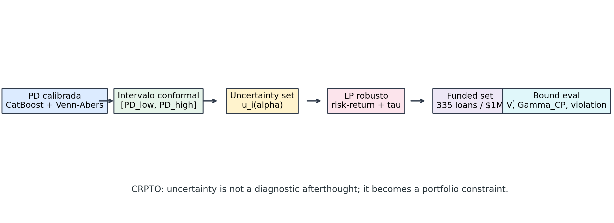

## Apéndice Journal-Ready de Robustez {#sec-p1-journal-appendix}

Esta pagina agrupa el material que fortalece el CRPTO sin cambiar su
direccion. La idea es dejar listo el paquete de appendix para una version
journal: tail risk, satisficing, dependencia, stress temporal, bootstrap,
sensibilidad a presupuesto/LGD/caps, region robusta por familia de policy y
frontera regret-auditabilidad.

Los artefactos se generan con:

```bash
uv run python scripts/build_crpto_journal_package.py
```

El script usa solamente artefactos congelados del CRPTO. No reabre la
busqueda de champion y no reemplaza el retorno oficial del paper.

```{python}
#| label: p1-journal-setup
#| include: false

from pathlib import Path

import pandas as pd

cwd = Path.cwd().resolve()
root = next(
    candidate
    for candidate in [cwd, *cwd.parents]
    if (candidate / "reports" / "crpto").exists()
    and (candidate / "models").exists()
)
tables_dir = root / "reports" / "crpto" / "tables"
figures_dir = root / "reports" / "crpto" / "figures"
status_path = root / "models" / "crpto_journal_package_status.json"


def read_table(name: str) -> pd.DataFrame:
    return pd.read_csv(tables_dir / name)
```

### Figura conceptual CRPTO

La Figura @fig-p1-crpto-conceptual es la candidata natural para Figura 1 del
paper. Su valor es editorial: muestra que la incertidumbre no es un diagnostico
posterior, sino una restriccion que viaja hasta la decision.

{#fig-p1-crpto-conceptual fig-alt="Diagrama horizontal de seis bloques que conecta PD calibrada, intervalo conformal, uncertainty set, LP robusto, funded set y bound eval."}

### Alpha, `Gamma_CP` y funded set

La Figura @fig-p1-alpha-gamma-funded-set conecta el parametro conformal con las
cantidades que el comite de riesgo si puede leer: prima de robustez, no
cobertura ponderada y numero de prestamos financiados.

{#fig-p1-alpha-gamma-funded-set fig-alt="Grafica de lineas que muestra Gamma_CP, V, raiz de alpha y numero de prestamos financiados al variar alpha."}

### Region robusta `45/45`

La Figura @fig-p1-robust-region-heatmap es la evidencia visual de que el
champion no es un punto aislado. Cada celda resume la mejor rentabilidad de una
familia `risk_tolerance` por `gamma`, dentro de la mini-grid final exacta.

{#fig-p1-robust-region-heatmap fig-alt="Heatmap de retornos por risk tolerance y gamma; todas las familias pasan alpha01 en la region robusta final."}

### A12. Tail risk OCE/CVaR

Esta tabla responde una pregunta natural de journal: si el funded set tiene buen
retorno y buen bound, ¿que pasa con la cola de perdida realizada? La respuesta
se reporta como diagnostico sobre el funded set exacto, no como una nueva
optimizacion.

```{python}
#| label: tbl-crpto-journal-tail-risk
#| tbl-cap: "A12. Tail risk del funded set exacto bajo LGD alternativos"

tail = read_table("crpto_tableA12_tail_risk_oce_cvar.csv")
tail
```

Lectura: `mean_loss_rate` negativo equivale a retorno medio positivo. Los
campos `cvar_90_loss_rate`, `cvar_95_loss_rate` y `cvar_99_loss_rate` muestran
la severidad de cola bajo pesos del funded set. La columna
`funded_set_repriced_return` es una repricing diagnostic loan-level; el retorno
oficial del champion sigue siendo `$170,464.54` desde
`models/final_project_promotion.json`.

### A13. Satisficing margins

Satisficing traduce el resultado a lenguaje OR: no solo maximizamos retorno,
sino que pasamos umbrales minimos de seguridad y holgura.

```{python}
#| label: tbl-crpto-journal-satisficing
#| tbl-cap: "A13. Margenes satisficing de la policy oficial"

satisficing = read_table("crpto_tableA13_satisficing_margins.csv")
satisficing
```

Esta tabla es util para la introduccion y la discusion. Permite decir que el
champion economico supera al comparador theorem-tight en retorno, mantiene
`V <= sqrt(alpha)` y conserva `Gamma_CP` bajo un techo editorial de 20 puntos
porcentuales.

### A14. Diagnosticos de dependencia por cluster

El tightening Hoeffding/Bernstein necesita independencia adicional. No la
podemos asumir gratis; por eso documentamos estructura de dependencia y
concentracion por periodo, grade y periodo-grade.

```{python}
#| label: tbl-crpto-journal-dependency
#| tbl-cap: "A14. Clusters con mayor exposicion y contribucion al bound"

dependency = read_table("crpto_tableA14_dependency_cluster_diagnostics.csv")
dependency.sort_values(["exposure_share", "V_contribution"], ascending=False).head(15)
```

Esta tabla no prueba independencia. Su funcion es mas honesta: mostrar donde
esta concentrada la exposicion y que clusters cargan la no-cobertura ponderada.
Eso fortalece el appendix teorico porque evita vender el tightening condicional
como si ya estuviera demostrado distribution-free.

### A15. Leave-one-period-out y stress temporal

La critica de post-seleccion suele preguntar si el resultado depende de un solo
periodo OOT. Esta tabla mantiene el funded set exportado, remueve o sobrepondera
periodos y re-normaliza pesos para medir sensibilidad.

```{python}
#| label: tbl-crpto-journal-period-stress
#| tbl-cap: "A15. Stress leave-one-period-out y overweight 2x sobre el funded set"

period_stress = read_table("crpto_tableA15_leave_one_period_stress.csv")
period_stress
```

De nuevo, esto es diagnostico, no re-optimizacion. Sirve para revisar si `V`,
`Gamma_CP`, default ponderado o concentracion maxima se vuelven inestables al
mover masa temporal.

### A16. Bootstrap del funded set

El bootstrap no reemplaza el bound conformal. Sirve para dar intervalos
empiricos sobre metricas realizadas del funded set y preparar respuestas a
reviewers que pidan incertidumbre de segundo orden.

```{python}
#| label: tbl-crpto-journal-bootstrap
#| tbl-cap: "A16. Bootstrap empirico del funded set exacto"

bootstrap = read_table("crpto_tableA16_bootstrap_funded_set_metrics.csv")
bootstrap
```

La fila de retorno bootstrap tambien usa `funded_set_repriced_return_lgd45`;
por eso no debe citarse como retorno oficial del champion. El paper final debe
citar retorno oficial desde `final_project_promotion.json` y usar esta tabla
como sensibilidad.

### A17. Presupuesto, LGD y caps de concentracion

La tabla A17 agrupa tres preguntas aplicadas:

- ¿que pasa si el mismo funded set se escala a otro presupuesto?
- ¿como cambia el retorno loan-level si LGD pasa de 35% a 60%?
- ¿el funded set viola caps simples de concentracion por segmento?

```{python}
#| label: tbl-crpto-journal-budget-lgd-cap
#| tbl-cap: "A17. Sensibilidad diagnostica a presupuesto, LGD y caps de concentracion"

budget_cap_lgd = read_table("crpto_tableA17_budget_cap_lgd_sensitivity.csv")
budget_cap_lgd
```

La columna `diagnostic_pass` en los caps no dice que el optimizador resolvio un
problema con esa restriccion. Dice si el funded set exportado ya satisface ese
cap simple. Si un reviewer pide caps reales como constraint, eso seria un nuevo
experimento P2, no una correccion al champion actual.

### A18. Region robusta por familia de policy

Esta tabla es el par tabular del heatmap. Resume todas las familias finales
`risk_tolerance x gamma` y confirma que todas las celdas tienen pass rate
`alpha01 = 1.0`.

```{python}
#| label: tbl-crpto-journal-robust-region-family
#| tbl-cap: "A18. Region robusta final por familia risk_tolerance x gamma"

robust_region = read_table("crpto_tableA18_robust_region_policy_family.csv")
robust_region
```

Esta es una de las mejores defensas del paper: el resultado de abril no es
"un champion con suerte", sino una region final donde todas las policies
evaluadas pasan el gate exacto.

### A19. Frontera regret-auditabilidad

Esta tabla vuelve explicita la comparacion editorial con SPO+: SPO+ gana el
juego de regret, mientras CRPTO ocupa la esquina donde hay cobertura temporal,
bound exacto y region robusta verificable. No es un nuevo selector ni una
promocion alternativa del champion.

```{python}
#| label: tbl-crpto-journal-regret-auditability
#| tbl-cap: "A19. Frontera regret-auditability entre two-stage, SPO+ y CRPTO"

frontier = read_table("crpto_tableA19_regret_auditability_frontier.csv")
frontier
```

{#fig-p1-regret-auditability fig-alt="Scatter plot con regret medio en el eje x y controles verificables de riesgo en el eje y para two-stage, SPO+ y CRPTO robust."}

Lectura para el paper: CRPTO no promete dominar a SPO+ en regret puro. Su
contribucion es hacer visible el precio de comprar cobertura, bound exacto y
auditabilidad del funded set.

### A20. Challenger tail-satisficing

Esta tabla re-suelve las 45 policies de la region robusta con HiGHS y las
ordena por una regla journal-only: satisficing pass, menor CVaR 95%, menor OCE
entropico y mayor retorno. No promueve un nuevo champion. Sirve para responder
la pregunta de reviewer: "si optimizaran por cola/satisficing, que policy
apareceria?".

```{python}
#| label: tbl-crpto-journal-tail-satisficing-challenger
#| tbl-cap: "A20. Auditoria tail-satisficing de las 45 policies alpha-safe"

tail_challenger = read_table("crpto_tableA20_tail_satisficing_challenger_audit.csv")
tail_challenger.head(12)
```

Lectura: el challenger rank 1 reduce el CVaR 95% frente al economic champion con
una perdida de retorno cercana a 2%. Es evidencia de trade-off, no una
correccion de la policy promovida.

{#fig-p1-tail-risk-frontier fig-alt="Scatter de retorno realizado (eje x) contra CVaR 95% (eje y) para las 45 políticas de la región robusta; las que pasan satisficing en azul lleno, las que fallan en círculos grises huecos, y el champion económico como estrella naranja en la zona de mayor retorno."}

### A21. Bound cluster-aware

Esta tabla convierte el caveat de dependencia en numeros. Bajo independencia
condicional entre agregados de cluster, la cota Hoeffding usa
`sum_g W_g^2`. En este funded set, la concentracion de exposicion hace que esa
cota sea mas laxa que `sqrt(alpha)`, asi que Markov sigue siendo el bound
principal del paper.

```{python}
#| label: tbl-crpto-journal-cluster-bound-tightening
#| tbl-cap: "A21. Cotas cluster-aware bajo supuestos adicionales de independencia"

cluster_bounds = read_table("crpto_tableA21_cluster_bound_tightening.csv")
cluster_bounds
```

### A22. Re-optimizacion con restriccion de cola (CVaR/OCE)

Esta tabla cierra el item P2 "OCE/CVaR como restriccion re-optimizada":
convierte el diagnostico de cola A12 en una **restriccion activa de seleccion**.
Re-resuelve las 45 politicas de la region robusta con HiGHS, mide para cada
funded set la CVaR 95% y el OCE entropico del peor caso *decision-time* ---
basado en la cota conformal `pd_high` ($u_i$), no en defaults observados --- y
barre un techo de CVaR como constraint: en cada nivel selecciona la politica
`alpha01`-safe de mayor retorno que respeta el techo. El resultado es la frontera
retorno-vs-cola y una politica *tail-constrained challenger*. La decision se toma
solo con intervalos conformales; los labels entran unicamente en el retorno
realizado congelado. No reabre la busqueda del champion ni reemplaza la policy
oficial: el economic champion sigue siendo el champion promovido.

```{python}
#| label: tbl-crpto-journal-tail-constrained-reopt
#| tbl-cap: "A22. Frontera retorno-vs-CVaR con techo de cola como restriccion de seleccion"

tail_reopt = read_table("crpto_tableA22_tail_constrained_reoptimization.csv")
tail_reopt
```

Lectura: la frontera muestra cuanto retorno se conserva al endurecer el techo de
CVaR. Coherente con A20, el economic champion no es la esquina de menor cola: en
el cierre `276k` ocupa el extremo de mayor retorno y mayor CVaR de la frontera, y
sigue siendo la policy oficial. Al imponer un techo mas estricto aparece un
*tail-constrained challenger* que reduce la CVaR *decision-time* a cambio de un
costo de retorno acotado (cercano al `-2%`); ese challenger coincide con el rank 1
de satisficing de A20, lo que refuerza que la lectura de trade-off es estable
entre criterios. Como la cota usa
`pd_high` (peor caso conformal), es mas conservadora que la CVaR realizada de
A20, y es justamente la cantidad que un comite puede restringir *ex-ante*. El
soporte teorico para tratar CVaR/OCE como objetivo de control conformal viene de
[@angelopoulos2026nonmonotonic] (perdidas no monotonas), [@rockafellar2000cvar]
(CVaR) y [@bental2007oce] (OCE). El estado reproducible queda en
`models/crpto_tail_constrained_reopt_status.json`.

### A23. Robustez multi-distribucion (cobertura por grupo y celda)

Esta tabla responde el item P2 "robustez multi-distribucion / grupos
desconocidos" en el espiritu de [@yang2026multidistribution] y
[@bhattacharyya2026groupweighted]. Sobre los intervalos conformales congelados
mide la cobertura 90% marginal, por `grade` y por la celda `grade x vintage` mas
adversa con soporte minimo, para ver si la garantia sobrevive cuando una
distribucion de grupo desconocida domina el conjunto de test.

```{python}
#| label: tbl-crpto-journal-multidistribution
#| tbl-cap: "A23. Cobertura 90% por grupo y peor celda grade x vintage"

multidist = read_table("crpto_tableA23_multidistribution_robustness.csv")
multidist
```

Lectura: la cobertura marginal y la de cada `grade` se mantienen sobre el target
90% --- grade E es el mas ajustado, coherente con la debilidad conformal
documentada en el registro de negativos --- pero la peor celda `grade x vintage`
cae por debajo del 90%. Es decir: la cobertura es robusta a nivel de grupo
conocido, mientras que la celda fina mas adversa exhibe un gap. Ese es
exactamente el riesgo que la cobertura multi-distribucion (MDCP /
group-weighted) atacaria; aqui queda documentado como caveat honesto, no como
fallo del champion. El estado reproducible queda en
`models/crpto_distribution_robustness_status.json`.

### A24. Estabilidad conformal online sobre la secuencia OOT

Esta tabla aterriza el item P2 "conformal online" como diagnostico sobre la
secuencia de vintages OOT, en el espiritu de ACI [@gibbs2021aci], gradient
equilibrium [@angelopoulos2025gradient] y online CP via universal portfolios
[@liu2026portfolio]. Reporta la cobertura por periodo, la cobertura acumulada
("streaming") y la trayectoria del target `alpha_t` que seguiria un controlador
ACI de Gibbs-Candes. Como el dataset es estatico (Lending Club cerro originacion
en 2020), esto es un diagnostico de cuanto trabajaria un controlador online, no
una validacion de streaming.

```{python}
#| label: tbl-crpto-journal-online-stability
#| tbl-cap: "A24. Cobertura por vintage, cobertura acumulada y target ACI alpha_t"

online_stab = read_table("crpto_tableA24_online_conformal_stability.csv")
online_stab
```

Lectura: la cobertura se mantiene sobre el target en los 11 vintages y la
cobertura acumulada converge cerca del 93%. La tasa de default cae fuertemente a
lo largo de la secuencia, pero la cobertura no se degrada; en consecuencia, el
target `alpha_t` del controlador ACI apenas se desplaza (deriva pequena, porque
el sistema sobre-cubre). La lectura honesta es que la recalibracion online no es
necesaria sobre este OOT estatico, y la tabla deja la receta para un despliegue
en streaming real.

### Appendix A3--A24 recomendado

::: {#tbl-crpto-appendix-map}

| Tabla | Rol | Body o appendix |
|---|---|---|
| A3 | Nested holdout 5k -> 25k -> 276k | Appendix principal |
| A4 | Sensibilidad periodo-grade | Appendix principal |
| A5 | Decision-aware conformal selector | Appendix principal |
| A6 | Synthetic shift basico | Appendix principal |
| A7 | Funded-set loan export | Appendix online |
| A8 | Funded-set composition | Appendix online |
| A9 | Strict temporal holdout | Appendix principal |
| A10 | Exact eval ranks 1/2/3 | Appendix principal |
| A11 | Enhanced synthetic shift | Appendix principal |
| A12 | OCE/CVaR tail risk | Appendix journal |
| A13 | Satisficing margins | Cuerpo corto o appendix |
| A14 | Dependencia por clusters | Appendix teorico |
| A15 | Leave-one-period-out stress | Appendix journal |
| A16 | Bootstrap funded-set metrics | Appendix journal |
| A17 | Presupuesto, LGD y caps | Appendix journal |
| A18 | Robust region by policy family | Cuerpo corto o appendix |
| A19 | Regret-auditability frontier | Cuerpo corto y appendix |
| A20 | Tail-satisficing challenger audit | Appendix journal |
| A21 | Cluster-bound tightening | Appendix teorico |
| A22 | CVaR/OCE tail-constrained re-optimization | Appendix journal |
| A23 | Robustez multi-distribucion (grupo/celda) | Appendix journal |
| A24 | Estabilidad conformal online (ACI) | Appendix journal |

Mapa recomendado del appendix del CRPTO.
:::

### Registro de resultados negativos

El appendix de robustez se complementa con un **registro de resultados
negativos**: challengers PD evaluados y descartados, la debilidad conformal de
grade E y los frentes de bound que no cambiaron el teorema principal. Tratados
como límites metodológicos defendibles (no como fracasos), fortalecen el paper
porque demuestran que el champion sobrevivió a búsquedas serias. El registro
completo y sus condiciones de reapertura viven en
[`23-apendices-regulatorios-y-future-work.qmd`](23-apendices-regulatorios-y-future-work.qmd)
(@sec-crpto-negative-results) y en los dossiers
`docs/research/crpto_regret_auditability_sandbox_closure_2026-05-28.md` y
`docs/research/crpto_bound_improvement_intake_2026-05-21.md`. Todo es
documentación histórica: no reabre el champion congelado.

::: {#tbl-crpto-negative-challenger-summary}

| Señal | Resultado curado | Lectura editorial |
|---|---|---|
| `bureau_behavior_15` | AUC/Brier mejores que el incumbente, pero peor ECE y debilidad conformal en grade E. | Señal predictiva útil; no reemplaza el stack PD+CP+portfolio congelado. |
| `affordability_rate_5` | Exact pass viable en algunas políticas, pero retornos por debajo del champion y cobertura sensible. | Apéndice de sensibilidad, no candidato promovido. |
| `canonical_4_return_aware` | Retorno `+$146.80` vs champion con exact pass, pero `V=0.058675` y `Gamma_CP=0.270366`. | Posible reapertura futura con protocolo sellado; no mejora bajo los gates actuales. |
| `canonical_4__phase1__portfolio` | Retorno alto en búsqueda temprana, pero `V=0.07055`, `Gamma_CP=0.517574` y cobertura débil. | Evidencia negativa fuerte contra perseguir retorno sin control robusto. |

Síntesis de challengers importada como evidencia estática en `reports/crpto/appendix/`.
:::

### Checklist reproducible

Para regenerar el paquete completo de esta pagina:

```bash
uv run python scripts/export_crpto_tables.py
uv run python scripts/analyze_crpto_evidence.py
uv run python scripts/build_crpto_journal_package.py
uv run python scripts/build_tail_satisficing_challenger_audit.py
uv run python scripts/build_tail_constrained_reoptimization.py
uv run python scripts/build_distribution_robustness_diagnostics.py
uv run pytest tests/test_crpto_final_sync.py
```

Para renderizar solo esta parte del libro:

```powershell
uv run -- quarto render book/chapters/06-blueprint-manuscrito.qmd --to html --no-execute
uv run -- quarto render book/chapters/07-apendice-robustez.qmd --to html --no-execute
```

::: {.callout-important}
## Regla de sincronizacion

Si alguna tabla A12--A24 contradice `models/final_project_promotion.json`, gana
`final_project_promotion.json`. Las tablas nuevas son evidencia de robustez,
sensibilidad y empaque journal; no son una promocion nueva del champion. En
particular, A22 reporta una politica *tail-constrained challenger*, no un nuevo
champion: la policy oficial sigue siendo el economic champion.
:::

El estado reproducible queda registrado en
`models/crpto_journal_package_status.json`,
`models/crpto_tail_constrained_reopt_status.json` y
`models/crpto_distribution_robustness_status.json`; el dossier asociado queda en
`docs/research/crpto_journal_package_2026-05-04.md`.
