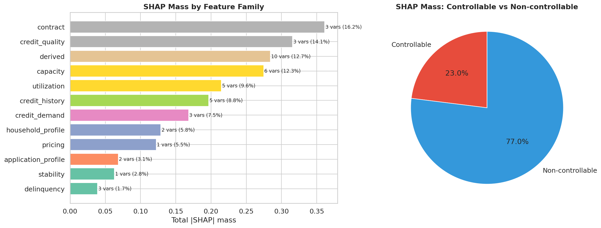

<!-- crpto-companion-status: retired-historical-source -->

::: {.callout-warning title="Fuente histórica retirada"}
Esta página no pertenece al companion activo. Se conserva solo como procedencia,
puede contradecir el estimando y los claims vigentes y no debe citarse como
evidencia del manuscrito activo. La autoridad está en las superficies
registradas por `book/_quarto.yml`.
:::

# Pipeline, Datos y Features

Material de método y reproducibilidad previo al CRPTO: origen de datos, split temporal, leakage, WOE/IV y contrato de features.

::: {.callout-note}
Nota editorial: este capítulo conserva material técnico de soporte para tesis, supplement y revisión. Los bloques de código quedan acotados visualmente por defecto; la lectura principal está en el texto, las tablas y las figuras.
:::

::: {.use-grid}
::: {.use-card}
**Uso IJDS**

Resumen de datos, split temporal, prevención de leakage y contrato reproducible de features.
:::

::: {.use-card}
**Uso tesis**

Arquitectura completa de datos, herramientas, versionado y decisiones de ingeniería del proyecto.
:::

::: {.use-card}
**Uso supplement**

Linaje de features y trazabilidad para justificar que las salidas paper-ready vienen de artefactos congelados.
:::
:::

::: {.source-note}
**Procedencia:** `book/chapters/03-tech-stack.qmd`
:::

Este capítulo documenta las librerías y herramientas utilizadas en el proyecto, junto con la **justificación** de por qué cada una fue seleccionada sobre sus alternativas. El stack completo se gestiona con `uv` (no pip) y las versiones están fijadas en `pyproject.toml`.

## Principio de selección

Las herramientas se eligieron con tres criterios:

1. **Calidad y madurez**: Librerías con publicaciones académicas asociadas, mantenimiento activo y adopción en la comunidad.
2. **Código abierto**: Ninguna dependencia de licencias comerciales. Esto es especialmente relevante para el solver de optimización (HiGHS vs Gurobi/CPLEX).
3. **Interoperabilidad**: Todas las herramientas trabajan sobre el ecosistema pandas/numpy estándar y se integran sin adaptadores custom.

| Principio de ingeniería | Cómo se materializa en este proyecto |
|---|---|
| Una sola fuente de verdad | Lógica reusable en `src/`, no duplicada entre scripts, notebooks y Streamlit |
| Contratos explícitos | Schemas Pandera, configs YAML y artefactos versionados |
| Baseline abierto | CatBoost, MAPIE, Pyomo, HiGHS, DVC y Quarto sin dependencia de licencias cerradas |
| Separación de carriles | Baseline operativo CPU vs insight factory / research en GPU |

: Prácticas de ingeniería que sostienen el stack, más allá de la lista de librerías

## Machine Learning y Modelado

```python

import pandas as pd

ml_stack = [
    {"Librería": "CatBoost 1.2.10", "Rol": "Modelo PD (gradient boosting)",
     "Alternativas": "XGBoost, LightGBM",
     "Justificación": "Manejo nativo de categorías y NaN, ordered boosting reduce overfitting, mejor calibración out-of-the-box para credit scoring"},
    {"Librería": "scikit-learn 1.9.0", "Rol": "Baseline LR, calibración, métricas",
     "Alternativas": "—",
     "Justificación": "Estándar de facto para ML en Python. Provee CalibratedClassifierCV, IsotonicRegression, y todas las métricas de evaluación"},
    {"Librería": "Optuna 4.9.0", "Rol": "HPO histórico (no se relanza para el paper activo)",
     "Alternativas": "Hyperopt, Ray Tune, Optuna",
     "Justificación": "TPE sampler es state-of-the-art para HPO con presupuesto limitado, pruning vía MedianPruner, integración nativa con CatBoost"},
    {"Librería": "OptBinning 0.21.0", "Rol": "Controles WOE/IV IJDS aislados",
     "Alternativas": "scorecardpy, binning manual",
     "Justificación": "Binning óptimo basado en programación matemática, soporta constraints regulatorios (monotonía, máximo de bins)"},
    {"Librería": "SHAP 0.48", "Rol": "Explicabilidad (TreeExplainer)",
     "Alternativas": "LIME, ELI5",
     "Justificación": "SHAP values tienen fundamento teórico en teoría de juegos (Shapley values), TreeExplainer es exacto para tree ensembles"},
]

pd.DataFrame(ml_stack)
```

## Predicción Conformal

```python

conformal_stack = [
    {"Librería": "MAPIE 1.3.0", "Rol": "Split Conformal, Mondrian, CQR",
     "Alternativas": "crepes, nonconformist, conformal_tights",
     "Justificación": "API moderna (SplitConformalRegressor), soporte Mondrian nativo, mantenida por Quantmetry con publicación asociada [@taquet2025mapie]"},
    {"Librería": "crepes", "Rol": "Referencia cruzada conformal",
     "Alternativas": "—",
     "Justificación": "Alternativa ligera para validación cruzada de resultados MAPIE"},
]

pd.DataFrame(conformal_stack)
```

::: {.callout-warning}
## MAPIE 1.3.0 — Cambio de API
MAPIE 1.3.0 introdujo una API completamente nueva. La clase principal es `SplitConformalRegressor` (no `MapieRegressor`). El workflow es: `fit()` → `conformalize()` → `predict_interval()`. El parámetro `confidence_level` se define en `__init__`, no `alpha` en `predict`. Usamos `prefit=True` para integrar con modelos CatBoost pre-entrenados.
:::

## Series de Tiempo y Supervivencia

```python

ts_stack = [
    {"Librería": "statsforecast 2.0+", "Rol": "AutoARIMA, ETS, point forecasts",
     "Alternativas": "prophet, darts, sktime",
     "Justificación": "Implementaciones rápidas en C/Numba de modelos clásicos, API Nixtla consistente, jerárquica y panel-ready"},
    {"Librería": "mlforecast 0.13+", "Rol": "ML-based forecasting",
     "Alternativas": "sktime, tsfresh",
     "Justificación": "Integración nativa con statsforecast, permite features de lag/rolling con CatBoost/LightGBM como base learner"},
    {"Librería": "hierarchicalforecast 1.0+", "Rol": "Reconciliación jerárquica",
     "Alternativas": "—",
     "Justificación": "Reconciliación coherente top-down/bottom-up/MinTrace para forecasts por grade y agregado"},
    {"Librería": "lifelines 0.30+", "Rol": "Cox PH, Kaplan-Meier",
     "Alternativas": "pycox, scikit-survival",
     "Justificación": "API limpia para análisis de supervivencia paramétrica y semi-paramétrica, hazard ratios interpretables"},
    {"Librería": "scikit-survival 0.24+", "Rol": "Random Survival Forest",
     "Alternativas": "pycox, aalen-johansen",
     "Justificación": "RSF implementado sobre scikit-learn API, compatible con SHAP para explicabilidad de supervivencia"},
]

pd.DataFrame(ts_stack)
```

## Inferencia Causal

```python

causal_stack = [
    {"Librería": "DoWhy 0.12+", "Rol": "Identificación causal y refutaciones",
     "Alternativas": "CausalNex, causalml",
     "Justificación": "Framework de 4 pasos (model → identify → estimate → refute) con grafos causales explícitos, desarrollado por Microsoft Research"},
    {"Librería": "EconML 0.16+", "Rol": "CausalForestDML, efectos heterogéneos",
     "Alternativas": "causalml (Uber), grf (R)",
     "Justificación": "Implementación de Double/Debiased ML con CausalForestDML para CATE, integración nativa con DoWhy"},
]

pd.DataFrame(causal_stack)
```

## Optimización

```python

optim_stack = [
    {"Librería": "Pyomo 6.8+", "Rol": "Formulación de modelos de optimización",
     "Alternativas": "PuLP, OR-Tools, cvxpy",
     "Justificación": "Lenguaje de modelado algebraico completo, soporta LP/MILP/NLP, robust counterpart nativo, amplia comunidad académica"},
    {"Librería": "HiGHS 1.10+", "Rol": "Solver LP/MILP",
     "Alternativas": "Gurobi, CPLEX, GLPK",
     "Justificación": "Solver open-source state-of-the-art para LP/MILP. Performance comparable a solvers comerciales para problemas de tamaño medio. Sin restricción de licencia académica"},
    {"Librería": "PyEPO (torch)", "Rol": "SPO+ loss para predict-then-optimize",
     "Alternativas": "Implementación custom",
     "Justificación": "Implementación oficial de SPO+ [@elmachtoub2022] con autograd para PyTorch, optDataset para pre-resolver instancias LP"},
]

pd.DataFrame(optim_stack)
```

::: {.callout-tip}
## ¿Por qué HiGHS y no Gurobi?
Gurobi y CPLEX son más rápidos para problemas grandes (>100K variables), pero requieren licencias comerciales costosas o licencias académicas con restricciones de uso. HiGHS logra performance comparable para nuestro tamaño de problema (~5,000 candidatos de portafolio) y es completamente open-source. Esto asegura reproducibilidad sin barreras de acceso.
:::

## MLOps y Trazabilidad Operativa

```python

mlops_stack = [
    {"Librería": "DVC 3.56+", "Rol": "Versionado de datos y artefactos",
     "Alternativas": "git-lfs, lakefs",
     "Justificación": "Linaje claro de artefactos parquet/pkl/cbm, integración con Git y control explícito de qué dato alimenta cada etapa del pipeline"},
    {"Librería": "MLflow 3.9+", "Rol": "Tracking de experimentos",
     "Alternativas": "Weights & Biases, Neptune",
     "Justificación": "Open-source, logging local sin servidor externo, compatible con CatBoost y Optuna, integración DagsHub para tracking remoto"},
    {"Librería": "Pandera 0.22+", "Rol": "Validación de schemas de datos",
     "Alternativas": "great_expectations, pydantic",
     "Justificación": "Validación de DataFrames con decoradores, schemas tipados que documentan el contrato de datos en cada etapa del pipeline"},
    {"Librería": "Feast 0.59", "Rol": "Feature store",
     "Alternativas": "Hopsworks, Tecton",
     "Justificación": "Feature store open-source con DuckDB backend para serving local, Field API + feast.types para definición de features"},
    {"Librería": "dbt-duckdb 1.10", "Rol": "Transformaciones SQL sobre parquet",
     "Alternativas": "pandas puro, polars",
     "Justificación": "SQL semántico sobre parquet vía read_parquet(), staging/marts/tests, linaje documentable para auditoría"},
]

pd.DataFrame(mlops_stack)
```

## Desarrollo y Calidad

```python

dev_stack = [
    {"Librería": "uv", "Rol": "Package manager y virtual envs",
     "Alternativas": "pip, poetry, conda",
     "Justificación": "10-100x más rápido que pip, resolución determinística, lockfile, compatible con pyproject.toml estándar"},
    {"Librería": "ruff", "Rol": "Linter + formatter",
     "Alternativas": "flake8 + black + isort",
     "Justificación": "Un solo tool reemplaza tres. Reglas: E, F, W, I, UP, B, SIM, C4. 10-100x más rápido que flake8"},
    {"Librería": "pytest", "Rol": "Testing framework",
     "Alternativas": "unittest, nose2",
     "Justificación": "681 tests con --strict-markers --strict-config, fixtures para artefactos, markers para tests lentos"},
    {"Librería": "pre-commit", "Rol": "Hooks de calidad pre-commit",
     "Alternativas": "husky, lefthook",
     "Justificación": "ruff lint+format, nbstripout (limpia notebooks), trailing-whitespace, check-yaml/toml, large file guard"},
    {"Librería": "nbstripout", "Rol": "Limpieza de outputs de notebooks",
     "Alternativas": "nbconvert --clear-output",
     "Justificación": "Hook automático que evita commits con outputs de notebooks, reduce tamaño del repo"},
    {"Librería": "loguru", "Rol": "Logging estructurado",
     "Alternativas": "stdlib logging",
     "Justificación": "Configuración mínima, formato coloreado, rotación de archivos, mejor DX que logging estándar"},
]

pd.DataFrame(dev_stack)
```

## Entrega y Visualización

```python

delivery_stack = [
    {"Librería": "Streamlit 1.42+", "Rol": "Dashboard interactivo (companion)",
     "Alternativas": "Dash, Panel, Gradio",
     "Justificación": "Companion local reducido para exploración interactiva (5 labs), con showcase público histórico congelado y sin desplazar a Quarto como superficie oficial."},
    {"Librería": "Quarto 1.9.35", "Rol": "Libro técnico (este documento)",
     "Alternativas": "Jupyter Book, Sphinx, bookdown",
     "Justificación": "Soporte nativo para Python+Mermaid+LaTeX, output HTML/PDF dual, cross-references, bibliografía, code folding"},
    {"Librería": "FastAPI 0.115+", "Rol": "API REST (servicio opcional)",
     "Alternativas": "Flask, Django REST",
     "Justificación": "Async, tipado con Pydantic, OpenAPI automático, integración con modelos CatBoost+MAPIE para serving de predicciones"},
    {"Librería": "matplotlib + seaborn", "Rol": "Figuras publication-quality",
     "Alternativas": "plotly (para HTML interactivo)",
     "Justificación": "Vector graphics para PDF/LaTeX, estilo APA/IEEE, reproducibles desde artefactos congelados"},
]

pd.DataFrame(delivery_stack)
```

## GPU / Aceleración (Opcional)

```python

gpu_stack = [
    {"Librería": "RAPIDS (cuDF, cuML, cuPy)", "Rol": "Aceleración GPU para ETL, ML, Monte Carlo",
     "Alternativas": "pandas, scikit-learn, numpy",
     "Justificación": "Speedup selectivo: Monte Carlo IFRS9 (16K scenarios), HPO masivo, benchmark comparativo. No reemplaza CPU baseline canónico"},
    {"Librería": "NVIDIA cuOpt", "Rol": "Optimización combinatoria GPU",
     "Alternativas": "OR-Tools, Pyomo+HiGHS",
     "Justificación": "Exploración de formulaciones alternativas en GPU para portafolio. Resultado: HiGHS CPU sigue siendo óptimo para nuestro tamaño"},
]

pd.DataFrame(gpu_stack)
```

::: {.callout-warning}
## GPU no es el baseline
Las herramientas GPU son parte del *insights factory* --- un carril de investigación complementario. El baseline operativo corre enteramente en CPU. Los benchmarks GPU se documentan en el Apéndice B.
:::

## Arquitectura end-to-end y riesgos metodológicos

| Bloque | Riesgo metodológico dominante | Mitigación en el stack |
|---|---|---|
| Datos | Leakage, mezcla de cortes temporales, drift silencioso | DVC, dbt, Pandera, splits OOT |
| Modelado PD | Sobreajuste, mala calibración, métricas engañosas | Optuna, calibration layer, tests y benchmarks |
| Conformal | Buena cobertura global pero mala utilidad por grupo o en el tiempo | Mondrian, policy status, backtesting, Winkler |
| Optimización | Maximizar retorno ignorando ambigüedad | Uncertainty sets + policy champion |
| IFRS9 / governance | Provisiones sensibles a supuestos y artefactos opacos | Escenarios, MRM, registry, fairness, explainability |

: Riesgos metodológicos y la parte del stack que los contiene

## Resumen de versiones clave

| Componente | Versión | Verificable en |
|------------|---------|----------------|
| Python | 3.12.12 | `python --version` |
| CatBoost | 1.2.8 | `pyproject.toml` |
| MAPIE | 1.3.0 | `pyproject.toml` |
| Pyomo | 6.8+ | `pyproject.toml` |
| HiGHS | 1.10+ | `pyproject.toml` |
| Quarto | 1.9.35 | `quarto --version` |
| Uv | Latest | `uv --version` |

: Versiones clave del stack

> Nota curatorial: el cierre editorial compartido del libro original se omitió aquí para mantener este dossier independiente y centrado en CRPTO.

::: {.source-note}
**Procedencia:** `book/chapters/04-pipeline-overview/04a-data-ingestion-lineage.qmd`
:::

## Ingesta de Datos y Linaje

### El Dataset de Lending Club

El proyecto utiliza el dataset **Lending Club Loan Data 2007--2020Q3**, disponible públicamente en Kaggle. Lending Club fue la plataforma de préstamos peer-to-peer más grande de Estados Unidos hasta su transición a banca comercial en 2020; estudios de la Reserva Federal documentan su rol como originador fintech y el papel de los datos alternativos y el ML en su suscripción [@jagtiani2019altdata]. El dataset contiene información de todos los préstamos originados en la plataforma durante 13 años, incluyendo características del solicitante, condiciones del préstamo y resultado final (pagado vs. default).

```python

import pandas as pd

dataset_info = [
    {"Atributo": "Fuente", "Valor": "Kaggle (ethon0426/lending-club-20072020q1)"},
    {"Atributo": "Período", "Valor": "Junio 2007 — Septiembre 2020"},
    {"Atributo": "Filas (raw)", "Valor": "~2,930,000"},
    {"Atributo": "Columnas (raw)", "Valor": "142"},
    {"Atributo": "Tipo de préstamo", "Valor": "Personal, no garantizado (unsecured)"},
    {"Atributo": "Montos", "Valor": "\\$1,000 — \\$40,000"},
    {"Atributo": "Plazos", "Valor": "36 o 60 meses"},
    {"Atributo": "Grados de riesgo", "Valor": "A (bajo) a G (alto), con sub-grados (A1–G5)"},
]

pd.DataFrame(dataset_info)
```

::: {.callout-tip}
## ¿Por qué Lending Club?
El dataset de Lending Club es el estándar de facto en la investigación de credit scoring con ML. Más de 200 papers publicados lo utilizan como benchmark, lo que permite comparar directamente nuestras métricas contra la literatura. Además, su tamaño (millones de préstamos) y riqueza de variables (142 columnas) lo hacen ideal para técnicas avanzadas como predicción conformal Mondrian, que requiere subgrupos suficientemente grandes para calibración por grado.
:::

| Capa | Qué representa | Por qué sí importa para el libro |
|---|---|---|
| Dataset público Kaggle | La materia prima original, descargable y ampliamente usada en papers | Permite comparar el proyecto contra la literatura y explicar de dónde sale la señal |
| Dataset limpio interno | La versión sin leakage y con outcome resuelto | Ahí empieza realmente el pipeline defendible |
| Datasets analíticos derivados | Versiones especializadas para PD, forecasting y EAD | Evitan forzar un único archivo a resolver todos los problemas del libro |

: Del dataset público a los datasets analíticos del proyecto

### Pipeline de Limpieza

La ingesta de datos sigue un proceso de tres pasos implementado en `src/data/make_dataset.py`:

**Paso 1 --- Carga del CSV crudo**: El archivo `Loan_status_2007-2020Q3.csv` se carga con `pandas.read_csv()`. Las columnas con formatos mixtos (`int_rate` como string con `%`, `term` como `" 36 months"`) se parsean a tipos numéricos.

**Paso 2 --- Filtrado a préstamos resueltos**: Solo se retienen préstamos con outcome definitivo:

- **Fully Paid**: El prestatario pagó la totalidad del principal e intereses.
- **Charged Off** / **Default**: El prestatario dejó de pagar y Lending Club declaró la pérdida.

Se excluyen préstamos en estados intermedios (*Current*, *Late*, *In Grace Period*) porque no tienen un outcome binario definido. Esto reduce el dataset de ~2.93M a ~1.86M filas.

**Paso 3 --- Creación de la variable objetivo**: Se crea `default_flag` como variable binaria sencilla. Si el préstamo terminó en `Charged Off` o `Default`, el registro se marca como `1`; si terminó en `Fully Paid`, se marca como `0`. Esta es la etiqueta que luego aprenden los modelos PD.

### Remoción de Data Leakage

El data leakage es el error metodológico más grave en credit scoring: usar información del futuro para predecir el pasado. En Lending Club, múltiples variables contienen información que **solo está disponible después de que el préstamo se ha resuelto** --- usarlas como features produciría un modelo aparentemente excelente (AUC > 0.95) pero completamente inútil en producción.

Para dimensionar el impacto: durante el desarrollo temprano del pipeline, un modelo que incluía `total_pymnt` (total de pagos recibidos) alcanzó AUC > 0.95 en validación --- un rendimiento aparentemente espectacular. Sin embargo, `total_pymnt` es una variable que solo existe después de que el préstamo se ha resuelto: si un prestatario pagó poco, el modelo "aprende" que eso predice default, pero esa información no está disponible al momento de originación. En producción, esa feature valdría cero o sería desconocida para todos los préstamos, destruyendo completamente la capacidad predictiva del modelo. Este ejemplo ilustra por qué la remoción de leakage debe ser implacable, no quirúrgica.

El pipeline remueve **35 columnas** con leakage confirmado, organizadas en cinco categorías:

```python

leakage = [
    {"Categoría": "Pagos recibidos", "Variables": "total_pymnt, total_pymnt_inv, total_rec_prncp, total_rec_int, total_rec_late_fee",
     "Razón": "Solo se conocen después de recibir pagos"},
    {"Categoría": "Recuperaciones", "Variables": "recoveries, collection_recovery_fee",
     "Razón": "Solo existen post-default"},
    {"Categoría": "Saldo pendiente", "Variables": "out_prncp, out_prncp_inv, funded_amnt, funded_amnt_inv",
     "Razón": "Reflejan estado del préstamo en el futuro"},
    {"Categoría": "Último pago", "Variables": "last_pymnt_d, last_pymnt_amnt, last_credit_pull_d",
     "Razón": "Información temporal futura"},
    {"Categoría": "Hardship/Settlement", "Variables": "hardship_flag/type/reason/status/amount/dates (12 cols), settlement_status/date/amount/pct/term (6 cols), debt_settlement_flag, payment_plan_start_date",
     "Razón": "Programas post-originación aplicados a préstamos en dificultad"},
    {"Categoría": "Crédito agregado", "Variables": "total_bal_il, il_util, max_bal_bc, all_util, total_rev_hi_lim",
     "Razón": "Snapshots de buró post-originación que reflejan comportamiento futuro"},
]

pd.DataFrame(leakage)
```

::: {.callout-warning}
## La trampa del leakage sutil
Algunas variables parecen disponibles al momento de originación pero en realidad son snapshots actualizados periódicamente. Por ejemplo, `revol_util` (utilización revolving) se actualiza mensualmente por el buró de crédito. La versión en el dataset podría ser la del momento de descarga (2020), no la del momento de originación. En este proyecto usamos `revol_util` como feature porque refleja el estado crediticio cercano a la originación en la mayoría de los registros, pero esta limitación debe tenerse en cuenta al interpretar los resultados.
:::

### Construcción de LGD

Antes de eliminar las columnas de leakage, el pipeline calcula la **Loss Given Default** (LGD) observada para los préstamos que sí incumplieron. La idea es simple: medir qué proporción de la exposición original realmente se perdió después de descontar capital recuperado y procesos de recuperación. El valor final se recorta entre 0 y 1 para mantener una interpretación financiera clara, y se asigna LGD = 0 a los préstamos que nunca cayeron en default.

En términos de negocio, esto evita tratar todos los defaults como si fueran iguales. En Lending Club no es lo mismo un préstamo que entra en default y luego recupera una parte relevante del saldo, que uno que termina casi totalmente perdido. Esa diferencia es la que luego alimenta el modelado de severidad.

### Tres Datasets Analíticos

A partir del dataset limpio, la cadena de preparación temporal y catálogo semántico materializa tres datasets analíticos especializados:

```python

datasets = [
    {"Dataset": "loan_master.parquet", "Granularidad": "Un registro por préstamo",
     "Uso": "Modelos PD, LGD, supervivencia, conformal, portafolio",
     "Columnas clave": "42 features + default_flag + lgd + issue_d + grade"},
    {"Dataset": "time_series.parquet", "Granularidad": "Un registro por mes (118 meses)",
     "Uso": "Forecasting con StatsForecast/MLForecast, intervalos TS→ECL",
     "Columnas clave": "unique_id, ds, y (default_rate), loan_count, volume"},
    {"Dataset": "ead_dataset.parquet", "Granularidad": "Solo préstamos en default",
     "Uso": "Modelado de EAD (Exposure at Default)",
     "Columnas clave": "Features de originación + saldo al momento del default"},
]

pd.DataFrame(datasets)
```

El dataset `loan_master` es el input principal del pipeline. El `time_series` alimenta los modelos de forecasting jerárquico (AutoARIMA, ETS, ML-based). El `ead_dataset` es un subconjunto de préstamos defaulteados para estimar la exposición al momento del default.

| Dataset / artefacto | Consumidores principales | Qué evita |
|---|---|---|
| `lending_club_cleaned.parquet` | Preparación temporal, QA, EDA | Repetir limpieza en notebooks y scripts |
| `Train`, `Calibration`, `Test OOT` | PD, conformal, monitoreo | Mezclar ajuste, calibración y evaluación final |
| `loan_master.parquet` | PD, survival, causal, explainability, portafolio | Mantener varias copias divergentes de features base |
| `time_series.parquet` | Forecasting, escenarios IFRS9, stress temporal | Derivar series cada vez desde cero |
| `ead_dataset.parquet` | Severidad / exposición al default | Contaminar EAD con préstamos irrelevantes para ese objetivo |

: Por qué existen varios datasets y quién los consume

### Linaje de Datos

El linaje completo desde el CSV crudo hasta los artefactos finales se gestiona con **DVC** (Data Version Control). Más que pensar en un DAG técnico, conviene leerlo como una cadena operativa de transformación:

```{mermaid}
flowchart LR
    raw[CSV crudo\nLoan_status_2007-2020Q3.csv] --> clean[Limpieza inicial\nmake_dataset.py]
    clean --> cleaned[lending_club_cleaned.parquet]
    cleaned --> split[Splits operativos\nprepare_dataset.py]
    split --> train[Train.parquet]
    split --> cal[Calibration.parquet]
    split --> test[Test OOT.parquet]
    cleaned --> master[loan_master.parquet]
    master --> pd[PD / conformal / causal / survival / portfolio]
    master --> ts[time_series.parquet]
    master --> ead[ead_dataset.parquet]
    raw -. tracked by .-> dvc[(DVC lock + artifacts)]
    clean -. tracked by .-> dvc
    split -. tracked by .-> dvc
    master -. tracked by .-> dvc
```

La lectura correcta no es “muchos archivos”, sino “cada transformación deja un artefacto intermedio claro y reutilizable por el siguiente módulo”.

Cada transición deja inputs y outputs explícitos. Eso ayuda a auditar qué produjo cada artefacto importante y evita que la historia del pipeline quede escondida dentro de notebooks o scripts sueltos.

| Stage DVC / contrato | Script o capa | Output visible | Pregunta que responde |
|---|---|---|---|
| `make_dataset` | `src/data/make_dataset.py` | `lending_club_cleaned.parquet` | ¿Ya tenemos una versión limpia y defendible del dataset crudo? |
| `prepare_dataset` | `src/data/prepare_dataset.py` | `train/calibration/test` | ¿La evaluación respeta el tiempo y separa calibración del test? |
| `semantic data products` | `src/data/prepare_dataset.py`, dbt y artefactos DVC | `loan_master`, `time_series`, `ead_dataset` | ¿Cada módulo downstream recibe el insumo correcto sin depender de scripts huérfanos? |
| `dbt + Feast` | Staging semántico y catálogo de features | Vistas y features declaradas | ¿Dónde vive la definición estable de una feature? |
| `DVC lock + artifacts` | Repositorio y storage remoto | Huellas de versión | ¿Qué run produjo exactamente el artefacto citado en el libro? |

: Resumen operativo de DuckDB, dbt, Feast y DVC en la cadena de datos

::: {.callout-note}
## Versionado de artefactos
Los artefactos binarios (parquet, pkl, cbm) se almacenan fuera de Git y se versionan con DVC. Los archivos `.dvc` del repositorio actúan como punteros a esos artefactos. En la práctica, esto permite mantener el código liviano mientras los datos y modelos pesados conservan una procedencia clara.
:::

::: {.source-note}
**Procedencia:** `book/chapters/04-pipeline-overview/04b-temporal-splitting.qmd`
:::

## Estrategia de Splitting Temporal

### ¿Por qué Out-of-Time y no Random Split?

En la práctica bancaria, un modelo de PD se entrena con datos históricos y se aplica a solicitantes futuros. La evaluación relevante es: **¿qué tan bien predice el modelo sobre datos de un período que no vio durante el entrenamiento?** Un split aleatorio mezcla préstamos de todos los períodos en train y test, permitiendo que el modelo "vea" el futuro --- por ejemplo, patrones de 2019 que informan predicciones sobre préstamos de 2018.

El **split Out-of-Time (OOT)** replica el escenario de producción: el modelo se entrena con el pasado y se evalúa exclusivamente con el futuro.

::: {.callout-warning}
## Random split infla el AUC
Experimentos internos muestran que un random split produce AUC ~0.04 puntos más alto que el split OOT equivalente para el mismo modelo CatBoost. Esta inflación no se traduce en rendimiento real y da una falsa sensación de seguridad. El split OOT es la única evaluación metodológicamente válida para un modelo de credit scoring que será desplegado en producción.
:::

### Diseño del Split Temporal

El split se implementa en `src/data/prepare_dataset.py` con una fecha de corte en **enero 2018**:

```python

import pandas as pd

splits = [
    {"Split": "Train", "Período": "Jun 2007 — Mar 2017", "Préstamos": "1,346,311",
     "Default Rate": "18.52%", "Rol": "Entrenamiento del modelo PD (CatBoost + LR)"},
    {"Split": "Calibración", "Período": "Mar 2017 — Dic 2017", "Préstamos": "237,584",
     "Default Rate": "22.20%", "Rol": "Scores conformales (MAPIE), calibración de probabilidades"},
    {"Split": "Test (OOT)", "Período": "Ene 2018 — Sep 2020", "Préstamos": "276,869",
     "Default Rate": "21.98%", "Rol": "Evaluación final, backtesting, portafolio, IFRS9"},
]

pd.DataFrame(splits)
```

### Justificación de las Fechas de Corte

La elección de enero 2018 como fecha de corte no es arbitraria --- responde a tres criterios:

**1. Representatividad del período de test**: El período 2018--2020 incluye condiciones económicas diversas: expansión económica (2018--2019) y el inicio de la crisis COVID-19 (2020Q1--Q3). Esto evalúa la robustez del modelo bajo cambio de régimen (*concept drift*).

**2. Tamaño suficiente para calibración conformal**: El set de calibración (237,584 préstamos) es grande comparado con el requisito mínimo para predicción conformal. El error de muestra finita es $\frac{1}{n+1} \approx 4.2 \times 10^{-6}$, haciendo la garantía de cobertura prácticamente exacta (ver `sec-coverage-guarantee`).

**3. Consistencia con la práctica bancaria**: Los modelos de PD se recalibran típicamente cada 12--24 meses. Tener un test set de ~33 meses simula un ciclo de vida realista del modelo antes de su revisión.

### El Rol Dual del Set de Calibración

El set de calibración cumple **dos funciones** independientes en el pipeline:

| Función | Método | Input | Output |
|---------|--------|-------|--------|
| **Calibración de probabilidades** | Venn-Abers / Platt / Isotonic | Scores CatBoost + labels | Calibrador persistido (`.pkl`) |
| **Conformización** | MAPIE SplitConformalRegressor | PDs calibradas + labels | Cuantiles conformales por grupo |

: Funciones del set de calibración

Estas dos funciones se ejecutan secuencialmente --- primero se ajusta el calibrador sobre el set de calibración, y luego se calculan los scores conformales usando las predicciones calibradas sobre el **mismo** set de calibración.

::: {.callout-note}
## ¿Reutilizar el set de calibración para ambas funciones?
Usar el mismo set para calibración de probabilidades y para conformización introduce una dependencia que, en teoría, podría afectar la garantía de cobertura conformal. En la práctica, con $n = 237{,}584$ observaciones, el efecto es negligible y la cobertura empírica (92.57% al nivel 90%) confirma que la garantía se mantiene holgadamente. La alternativa --- dividir el set de calibración en dos --- reduciría el tamaño de ambos subsets sin beneficio práctico medible.
:::

### Extracción Temporal del Set de Calibración

A diferencia de una extracción aleatoria, el set de calibración se extrae del **final** del período de entrenamiento (los últimos meses antes del corte OOT):

```{=html}
<div class="book-band">
  <div class="book-band__row">
    <div class="book-band__segment book-band__segment--train">
      <strong>Train</strong>
      <span>Jun 2007 — Mar 2017</span>
      <span>Aprende patrones históricos y estructura base del score.</span>
    </div>
    <div class="book-band__segment book-band__segment--cal">
      <strong>Calibración</strong>
      <span>Mar 2017 — Dic 2017</span>
      <span>Sirve para calibrar probabilidades y medir el error típico que usará conformal.</span>
    </div>
    <div class="book-band__segment book-band__segment--test">
      <strong>Test OOT</strong>
      <span>Ene 2018 — Sep 2020</span>
      <span>Evalúa rendimiento real sobre el futuro, incluyendo cambio de régimen.</span>
    </div>
  </div>
  <p class="book-band__note">La calibración se toma del tramo final del entrenamiento para parecerse más al mundo que luego verá el test OOT.</p>
</div>
```

Esta estrategia temporal tiene dos ventajas:

1. **Distribución más cercana al test**: Los préstamos de calibración (2017) son más recientes que los de train (2007--2017), por lo que su distribución de features está más cercana a la del test (2018--2020). Esto mejora la relevancia de los cuantiles conformales.
2. **Preserva el orden temporal en train**: El set de train retiene los préstamos más antiguos íntegramente, evitando "huecos" temporales que podrían afectar modelos de supervivencia o series de tiempo.

### Distribución del Default Rate por Período

Un aspecto notable del dataset es el **incremento de la tasa de default** en los períodos más recientes:

| Período | Default Rate | Interpretación |
|---------|-------------|---------------|
| 2007--2012 | ~15--18% | Préstamos maduros, criterios originación variables |
| 2013--2016 | ~17--20% | Expansión de Lending Club, base más amplia |
| 2017 (calibración) | 22.20% | Relajación de estándares pre-crisis |
| 2018--2020 (test) | 21.98% | Incluye impacto COVID-19 en 2020 |

: Default rate por período temporal

El incremento de ~18.5% a ~22% entre train y test representa un **concept drift moderado** --- suficiente para estresar el modelo pero no para invalidarlo. La cobertura conformal de 92.57% (superior al target del 90%) confirma que el pipeline es robusto a este nivel de drift.

### Validación de la Estrategia

Para validar que el split temporal no introduce sesgos sistemáticos, verificamos:

1. **No overlap temporal**: Ningún préstamo del set de test tiene `issue_d` anterior a enero 2018. Esta garantía se implementa en `prepare_dataset.py` con un filtro estricto por fecha.
2. **Consistencia de features**: Las distribuciones de features clave (DTI, FICO, loan_amount) entre train y test son similares, con PSI (Population Stability Index) < 0.10 para la mayoría de variables. El monitoreo continuo de PSI por feature a lo largo del período OOT, y su rol en la gobernanza del modelo, se profundiza en `sec-mrm`.
3. **Reproducibilidad**: La misma semilla aleatoria (`random_state=42`) y fecha de corte (`2018-01-01`) producen splits idénticos en cada ejecución.

::: {.callout-tip}
## Implicación para el lector
Todas las métricas reportadas en este libro --- AUC, Brier, cobertura conformal, ECL, retorno de portafolio --- se calculan **exclusivamente** sobre el set de test OOT (2018--2020). Ninguna métrica se reporta sobre datos de entrenamiento o validación. Esto garantiza que los números reflejan rendimiento genuino en un escenario prospectivo, no sobreajuste al pasado.
:::

::: {.source-note}
**Procedencia:** `book/chapters/05-feature-engineering/05a-woe-iv-optbinning.qmd`
:::

## WOE, IV y OptBinning

WOE convierte cada nivel o intervalo en una razón de evidencia entre buenos y
malos; IV resume la separación aportada por la variable. La transformación es
supervisada, por lo que sus bins, conteos y valores deben ajustarse únicamente
con el bloque de entrenamiento y persistirse para los bloques posteriores.
Monotonía no viene garantizada por cualquier WOE: depende del algoritmo de
binning y de las restricciones declaradas.

### Dos implementaciones con roles distintos

El repositorio conserva dos carriles que no deben confundirse:

1. **Pipeline canónico histórico.** `src/features/feature_engineering.py` ajusta
   encoders WOE train-only. Para variables numéricas usa hasta seis bins por
   cuantiles con `pandas.qcut`; para categóricas conserva niveles observados;
   aplica suavizado de 0.5 y persiste `woe_encoders.pkl` junto con los IV. Este
   carril no usa OptBinning y no promete bins monotónicos óptimos.
2. **Controles IJDS aislados.** `src/ijds_audit/credit_controls.py` usa
   `optbinning.BinningProcess` con tendencia monotónica automática, dos a ocho
   bins y participación mínima de 5%. Ajusta un scorecard de 26 señales de
   prestatario/plataforma y otro de 19 señales borrower-only. Sus modelos,
   tablas de bins, coeficientes, IV y PSI viven en rutas experimentales DVC y
   no reemplazan el champion histórico.

Esta separación es intencional. Refactorizar el carril histórico para usar
OptBinning cambiaría features y artefactos protegidos sin mejorar el estimando
del paper activo. El control IJDS permite estudiar auditabilidad y dependencia
de señales de pricing con una ruta nueva, predeclarada y reproducible.

### Evidencia activa

Los 45 problemas de binning IJDS alcanzan estado `OPTIMAL`. En el scorecard de
plataforma lideran la interacción tasa-grado (IV 0.337569), `sub_grade`
(0.319325), `grade` (0.299544) e `int_rate` (0.278429). En borrower-only lideran
FICO (0.213574), consultas recientes (0.170864), propósito (0.088878), uso
revolving (0.073903) y recencia de mora (0.049288).

Estas cifras son diagnóstico, no un selector. El scorecard borrower-only tiene
AUC OOT 0.612712 y el de plataforma 0.633023; ambos fallan el objetivo de
cobertura conformal en las ocho ventanas. Por eso WOE/IV fortalece la auditoría
de dependencia de especificación, pero no se presenta como novedad central ni
como modelo promovido.

::: {.source-note}
**Procedencia:** `book/chapters/05-feature-engineering/05b-derived-features-ratios.qmd`
:::

## Features Derivadas: Ratios, Flags e Interacciones

### Filosofía de Diseño

Las variables crudas del dataset de Lending Club capturan valores absolutos (monto del préstamo, ingreso anual, saldo revolving), pero las decisiones de crédito se basan en **proporciones relativas**. Un préstamo de \$20,000 tiene riesgo muy diferente para un prestatario con \$50,000 de ingreso anual (ratio 0.40) que para uno con \$200,000 (ratio 0.10). Las features derivadas capturan estas relaciones relativas que son más informativas para el modelado.

El pipeline de derivación en `src/features/feature_engineering.py` crea cuatro tipos de features:

### Ratios Financieros

```python

import pandas as pd

ratios = [
    {"Feature": "loan_to_income", "Fórmula": "loan_amnt / annual_inc",
     "Interpretación": "Carga del préstamo relativa al ingreso. Valores > 0.50 indican alto apalancamiento"},
    {"Feature": "installment_burden", "Fórmula": "installment / (annual_inc / 12)",
     "Interpretación": "Cuota mensual como fracción del ingreso mensual"},
    {"Feature": "rev_utilization", "Fórmula": "revol_util / 100",
     "Interpretación": "Utilización de líneas revolving (0–1). Valores > 0.80 son señal de estrés"},
    {"Feature": "revol_bal_to_income", "Fórmula": "revol_bal / annual_inc",
     "Interpretación": "Deuda revolving relativa al ingreso"},
    {"Feature": "open_acc_ratio", "Fórmula": "open_acc / total_acc",
     "Interpretación": "Proporción de cuentas activas. Valores altos indican búsqueda activa de crédito"},
    {"Feature": "il_ratio", "Fórmula": "Ratio de deuda installment sobre total",
     "Interpretación": "Concentración en deuda de cuotas fijas vs. revolving"},
    {"Feature": "high_util_pct", "Fórmula": "Porcentaje de líneas con utilización > 80%",
     "Interpretación": "Diversificación del estrés crediticio entre líneas"},
]

pd.DataFrame(ratios)
```

### Transformaciones Logarítmicas

Las variables financieras tienen distribuciones fuertemente sesgadas a la derecha (muchos prestatarios con ingresos modestos, pocos con ingresos muy altos). Las transformaciones logarítmicas estabilizan la varianza y reducen la influencia de valores extremos:

| Feature | Fórmula | Justificación |
|---------|---------|---------------|
| `log_annual_inc` | $\log(1 + \text{annual\_inc})$ | Ingreso tiene cola derecha pesada |
| `log_revol_bal` | $\log(1 + \text{revol\_bal})$ | Saldo revolving varía de \$0 a > \$100K |

: Transformaciones logarítmicas

El $+1$ evita el $\log(0)$ para prestatarios sin saldo revolving.

### Flags Binarias

Las flags capturan la presencia o ausencia de señales de riesgo discretas:

```python

flags = [
    {"Feature": "has_delinq_2yrs", "Condición": "delinq_2yrs > 0",
     "Señal": "Morosidad reciente en los últimos 2 años"},
    {"Feature": "has_pub_rec", "Condición": "pub_rec > 0",
     "Señal": "Registro público derogatorio (quiebra, juicio)"},
    {"Feature": "has_bankruptcy", "Condición": "pub_rec_bankruptcies > 0",
     "Señal": "Quiebra personal previa"},
    {"Feature": "has_recent_inq", "Condición": "inq_last_6mths > 0",
     "Señal": "Consulta de crédito en últimos 6 meses (búsqueda activa)"},
    {"Feature": "has_mortgage", "Condición": "mort_acc > 0",
     "Señal": "Tiene hipoteca (indicador de estabilidad financiera)"},
    {"Feature": "many_recent_opens", "Condición": "open_acc > umbral",
     "Señal": "Muchas cuentas abiertas recientemente"},
    {"Feature": "recent_chargeoff", "Condición": "chargeoff_within_12_mths > 0",
     "Señal": "Pérdida crediticia reciente (12 meses)"},
    {"Feature": "early_delinq", "Condición": "delinq_2yrs > 0",
     "Señal": "Historial temprano de morosidad"},
]

pd.DataFrame(flags)
```

::: {.callout-note}
## Flags vs. variables continuas
Las flags pueden parecer redundantes con las variables continuas subyacentes (por ejemplo, `has_delinq_2yrs` vs. `delinq_2yrs`). Sin embargo, para modelos lineales como la regresión logística, la flag captura el *salto discreto* en riesgo entre "cero delinquencias" y "al menos una", que es la discontinuidad más informativa. CatBoost puede descubrir esta discontinuidad automáticamente, pero incluir la flag explícitamente facilita la interpretabilidad y la consistencia entre modelos.
:::

### Features Temporales

```python

temporal = [
    {"Feature": "credit_history_months", "Fórmula": "(issue_d - earliest_cr_line).days / 30",
     "Interpretación": "Antigüedad del historial crediticio en meses"},
    {"Feature": "credit_age_years", "Fórmula": "credit_history_months / 12",
     "Interpretación": "Versión en años para interpretabilidad"},
    {"Feature": "fico_score", "Fórmula": "(fico_range_low + fico_range_high) / 2",
     "Interpretación": "Punto medio del rango FICO reportado"},
    {"Feature": "delinq_severity", "Fórmula": "Combinación de morosidades por tipo",
     "Interpretación": "Índice compuesto de severidad de morosidad"},
    {"Feature": "delinq_recency", "Fórmula": "Inverso de meses desde última morosidad",
     "Interpretación": "Más alto = morosidad más reciente"},
]

pd.DataFrame(temporal)
```

### Buckets e Interacciones

Las variables de **bucket** discretizan continuas en categorías interpretables:

- `int_rate_bucket`: very_low (0--8%), low (8--12%), medium (12--16%), high (16--20%), very_high (>20%)
- `dti_bucket`: low (0--10), moderate (10--20), high (20--30), very_high (30--40), extreme (>40)
- `fico_bucket`: Discretización del score FICO en bandas

Las **interacciones** capturan efectos multiplicativos:

| Feature | Componentes | Intuición |
|---------|------------|-----------|
| `int_rate_bucket__grade` | int_rate_bucket × grade | Captura si la tasa es alta *para su grado* |
| `loan_to_income_sq` | loan_to_income² | Efecto no lineal convexo del apalancamiento |
| `fico_x_dti` | fico_score × dti | Interacción entre calidad crediticia y carga de deuda |

: Features de interacción

::: {.callout-tip}
## ¿Son necesarias las interacciones para CatBoost?
CatBoost y otros modelos de ensemble basados en árboles descubren interacciones automáticamente durante el entrenamiento. Sin embargo, proporcionar interacciones explícitas tiene dos beneficios: (1) facilita la interpretabilidad vía SHAP (la importancia de `fico_x_dti` se lee directamente), y (2) beneficia al modelo de regresión logística baseline que no captura interacciones automáticamente.
:::

### Composición del Feature Set Final

En conjunto, los ratios, flags, transformaciones logarítmicas e interacciones capturan tres dimensiones complementarias del riesgo crediticio de un prestatario. La primera dimensión es **carga financiera**: ratios como `loan_to_income`, `installment_burden` y `revol_bal_to_income` miden cuánto del ingreso disponible está comprometido con deuda --- a mayor carga, menor capacidad de absorber shocks. La segunda dimensión es **estabilidad crediticia**: features como `credit_history_months`, `has_delinq_2yrs` y `has_bankruptcy` capturan la profundidad y calidad del historial --- un historial largo sin incidentes es la señal más fuerte de bajo riesgo. La tercera dimensión es **comportamiento reciente de búsqueda de crédito**: `has_recent_inq`, `open_acc_ratio` y `many_recent_opens` detectan patrones de solicitud activa que, en la literatura de credit scoring, se asocian con estrés financiero incipiente. Estas tres dimensiones cubren la mayor parte de la señal de creditworthiness disponible en datos de buró, y su combinación permite que el modelo capture perfiles de riesgo que una sola variable no podría representar.

La `fig-feature-family-decomposition` muestra la distribución de las 42 features del contrato canónico por familia de origen. La mezcla resultante combina señales crudas del buró con ratios derivados, flags binarios y codificaciones WOE, lo que le da al modelo múltiples vistas complementarias del mismo prestatario.

{fig-alt="Gráfico de composición que muestra la cantidad relativa de features canónicos por familia: ratios, flags, categorías, WOE y variables crudas."}

### Qué cambió en el rerun V2

El rerun V2 reabrió esta capa de feature engineering con una decisión importante: distinguir entre **feature universe** y **contrato champion**. Antes, parte de la narrativa del proyecto mezclaba ambos niveles; después de la refactorización quedaron separados:

- `44` features core CatBoost en el manifest V2, de las cuales `42` quedan en el contrato champion final tras el filtro `stable_core`;
- `47` para el baseline logístico;
- `49` features challenger-only;
- `164` columnas en el manifest total, incluyendo metadata, targets, WOE, candidatos bureau y señales auxiliares.

Además del set derivado clásico, el universo candidato absorbió una familia nueva de variables de buró de alta cobertura (`bc_util`, `bc_open_to_buy`, `percent_bc_gt_75`, `acc_open_past_24mths`, `tot_cur_bal`, `total_bc_limit`, `avg_cur_bal`, `mths_since_recent_bc`, entre otras). No todas entraron al champion final, pero sí quedaron auditadas y disponibles para challengers y análisis research.

```python

import sys
from pathlib import Path

sys.path.insert(0, str(Path.cwd().parent if Path.cwd().name == "book" else Path.cwd()))
from book._helpers.load_artifacts import try_load_parquet

import pandas as pd

manifest = try_load_parquet("feature_manifest_v2")
if not manifest.empty:
    fam = (
        manifest["family"]
        .value_counts(dropna=False)
        .rename_axis("Familia")
        .reset_index(name="Conteo")
    )
else:
    fam = pd.DataFrame()
fam
```

El aprendizaje importante no es que “más variables siempre mejoran”. Es que el proyecto ahora puede demostrar qué quedó en el champion, qué quedó como challenger y qué quedó fuera por sparsity o por bajo valor editorial. Esa trazabilidad era una de las metas centrales del rerun.

::: {.source-note}
**Procedencia:** `book/chapters/05-feature-engineering/05c-feature-contract.qmd`
:::

## Contrato de Features y Validación

### El Concepto de Contrato Canónico

En un pipeline de ML con múltiples etapas (features → modelo → calibración → conformal → optimización), la consistencia de features entre etapas es crítica. Si el modelo se entrena con 42 features en cierto orden y la inferencia recibe 41 en orden diferente, los resultados son silenciosamente incorrectos --- no hay error de runtime, solo predicciones degradadas que solo se detectan cuando se monitorean métricas en producción.

El **contrato canónico de features** (`models/pd_model_contract.json`) resuelve este problema documentando la interfaz exacta del modelo:

```python

import sys
from pathlib import Path

sys.path.insert(0, str(Path.cwd().parent if Path.cwd().name == "book" else Path.cwd()))
from book._helpers.load_artifacts import try_load_json

import pandas as pd

contract = try_load_json("pd_model_contract", directory="models", default={})

contract_summary = [
    {"Atributo": "Features totales", "Valor": str(contract.get("n_features", "N/A"))},
    {"Atributo": "Features categóricas", "Valor": str(len(contract.get("categorical_features", [])))},
    {"Atributo": "Features numéricas", "Valor": str(contract.get("n_features", 0) - len(contract.get("categorical_features", [])))},
    {"Atributo": "Modelo canónico", "Valor": contract.get("model_path", "N/A")},
    {"Atributo": "Calibrador", "Valor": contract.get("calibrator_path", "N/A")},
]

pd.DataFrame(contract_summary)
```

### Producer canónico de features en el rerun V2

El rerun V2 cerró una deuda técnica importante del proyecto: antes, varias partes del pipeline dependían de artefactos históricos (`train_fe`, `feature_config.pkl`, `woe_encoders.pkl`) cuyo proceso de reconstrucción no estaba expresado como stage canónico del pipeline. Eso ya no es cierto. El stage `scripts/materialize_feature_artifacts.py` ahora materializa de forma explícita:

- `train_fe.parquet`, `calibration_fe.parquet`, `test_fe.parquet`
- `feature_config.pkl`
- `woe_encoders.pkl`
- `feature_manifest_v2.parquet`

El punto metodológico importante no es solo la comodidad operativa. Es gobernanza: el proyecto ahora puede reconstruir desde splits temporales hasta contrato de features y artefactos downstream sin depender de notebooks viejos o de pickles manualmente heredados.

```python

import sys
from pathlib import Path

sys.path.insert(0, str(Path.cwd().parent if Path.cwd().name == "book" else Path.cwd()))
from book._helpers.load_artifacts import try_load_parquet, try_load_json

import pandas as pd

manifest = try_load_parquet("feature_manifest_v2")
contract = try_load_json("pd_model_contract", directory="models", default={})

rows = [
    {"Atributo": "Columnas en splits FE", "Valor": str(int(len(manifest))) if not manifest.empty else "N/D"},
    {"Atributo": "Features core CatBoost", "Valor": str(int(manifest["is_core_catboost"].sum())) if not manifest.empty else "N/D"},
    {"Atributo": "Features core LR", "Valor": str(int(manifest["is_core_logreg"].sum())) if not manifest.empty else "N/D"},
    {"Atributo": "Features challenger-only", "Valor": str(int(manifest["is_challenger_only"].sum())) if not manifest.empty else "N/D"},
    {"Atributo": "Features del contrato champion", "Valor": str(contract.get("n_features", "N/D"))},
]

pd.DataFrame(rows)
```

### Estructura del Contrato

El contrato JSON contiene cuatro secciones:

**1. Lista ordenada de features** (`feature_names`): Las 42 features exactas que el modelo espera, en el orden exacto en que fueron presentadas durante el entrenamiento. Cualquier discrepancia en nombres o en orden invalida las predicciones.

**2. Features categóricas** (`categorical_features`): Las 9 features que CatBoost trata como categorías nativas:

```python

cat_features = contract.get("categorical_features", [])
cat_df = pd.DataFrame({"Feature categórica": cat_features, "#": range(1, len(cat_features) + 1)})
cat_df
```

CatBoost aplica target encoding con ordered boosting a estas features internamente. No requieren one-hot encoding ni WOE --- el modelo las consume en su formato original (strings o categorías pandas).

**3. Shapes de los splits** (`split_shapes`): Dimensiones de train, calibración y test al momento del entrenamiento, para verificar que los datasets no han cambiado.

**4. Features faltantes por split** (`split_missing_features`): Listas vacías si todos los splits contienen todas las features del contrato. Si algún split tiene features faltantes, esta sección lo documenta explícitamente.

En el rerun V2 conviene distinguir dos niveles que antes se mezclaban:

- el **split FE canónico** contiene 164 columnas, incluyendo metadata, targets, families WOE, candidatos challenger y columnas auxiliares;
- el **contrato champion** selecciona solo las 42 features que el modelo CatBoost canónico realmente consume.

Esa separación es sana. El split FE no es “el input del champion” sino el universo auditable desde el cual se congelan subsets distintos para champion, challengers, survival y análisis research.

### Pandera: Validación de Schemas en Runtime

El contrato JSON es una especificación estática. Para validación dinámica en tiempo de ejecución, el pipeline usa **Pandera** (`src/features/schemas.py`) con schemas tipados para cada dataset analítico:

```python

schemas = [
    {"Schema": "loan_master_schema", "Dataset": "loan_master.parquet",
     "Validaciones clave": "loan_amnt > 0, default_flag ∈ {0,1}, int_rate ∈ [0,100], dti ∈ [0,999]"},
    {"Schema": "time_series_schema", "Dataset": "time_series.parquet",
     "Validaciones clave": "ds es datetime, y ∈ [0,1] (default_rate), loan_count > 0"},
    {"Schema": "ead_schema", "Dataset": "ead_dataset.parquet",
     "Validaciones clave": "default_flag = 1 (solo defaults), loan_amnt > 0"},
    {"Schema": "prediction_schema", "Dataset": "Predicciones PD",
     "Validaciones clave": "pd_low ≤ pd_point ≤ pd_high, todos en [0,1]"},
    {"Schema": "conformal_output_schema", "Dataset": "Intervalos conformales",
     "Validaciones clave": "y_pred, pd_low_90, pd_high_90 ∈ [0,1], width_90 ≥ 0, low ≤ high"},
]

pd.DataFrame(schemas)
```

El `prediction_schema` incluye una validación crítica para predicción conformal: la relación de orden `pd_low ≤ pd_point ≤ pd_high` se verifica con checks de DataFrame que cruzan columnas. Si un intervalo conformal tiene el límite inferior por encima del punto estimado, el schema falla y detiene el pipeline.

### Estabilidad estructural de encoding y binning

Después de la promoción del champion monotónico, el proyecto añadió una capa diagnóstica inspirada en ADSFCR para responder una objeción frecuente de gobernanza: que el contrato parezca estable por nombres y orden, pero esconda fragilidad en los encodings o discretizaciones. El artefacto `models/encoding_stability_status.json` resume esa lectura estructural.

```python

encoding = try_load_json("encoding_stability_status", directory="models", default={})
summary = encoding.get("summary", {})

rows = [
    {"Chequeo": "Estado global", "Valor": "PASS" if encoding.get("overall_pass") else "FAIL", "Lectura": "El contrato transformado sigue siendo estructuralmente estable."},
    {"Chequeo": "WOE features auditadas", "Valor": summary.get("n_woe_features"), "Lectura": "Cantidad de variables WOE revisadas con PSI y consistencia de signo."},
    {"Chequeo": "Bucket features auditadas", "Valor": summary.get("n_bucket_features"), "Lectura": "Cantidad de discretizaciones bucket revisadas."},
    {"Chequeo": "Fallas WOE", "Valor": summary.get("woe_failures"), "Lectura": "El snapshot vigente no activa reescritura del encoding."},
    {"Chequeo": "Fallas bucket", "Valor": summary.get("bucket_failures"), "Lectura": "No hay buckets con ruptura material en la auditoría actual."},
    {"Chequeo": "Máximo WOE PSI", "Valor": f"{summary.get('max_woe_psi', 0):.4f}", "Lectura": "El peor PSI WOE sigue en zona monitoreable, no crítica."},
    {"Chequeo": "Máximo bucket PSI", "Valor": f"{summary.get('max_bucket_category_psi', 0):.4f}", "Lectura": "La distribución bucket más exigente sigue dentro de límites razonables."},
]

pd.DataFrame(rows)
```

La lectura importante es que el contrato no solo llega íntegro; también llega **estable en semántica transformada**. Eso fortalece tres historias a la vez:

- la defensa del champion monotónico;
- la consistencia del contrato a través de train/calibration/test;
- la decisión de **no** reabrir todavía el espacio de bins o encodings como workstream principal.

::: {.callout-note}
## Validación estricta vs. tolerante
Los schemas usan `strict=False`, lo que permite columnas adicionales no especificadas en el schema. Esto es deliberado: a medida que el pipeline evoluciona, nuevas features pueden agregarse sin romper las validaciones existentes. Solo las columnas críticas se validan estrictamente; el resto se ignora. Si se requiriera validación estricta (no permitir columnas extra), se cambiaría a `strict=True`.
:::

### Flujo de Validación

La validación se integra en el pipeline como un *gate* entre etapas:

```{=html}
<div class="book-flow">
  <div class="book-flow__row">
    <div class="book-flow__card">
      <strong>Feature Engineering</strong>
      <span>Genera el dataset maestro con variables ya transformadas y listas para modelar.</span>
    </div>
    <div class="book-flow__arrow">→</div>
    <div class="book-flow__card">
      <strong>Schema Pandera</strong>
      <span>Valida tipos, rangos y columnas críticas antes de entrenar o predecir.</span>
    </div>
    <div class="book-flow__arrow">→</div>
    <div class="book-flow__card">
      <strong>Train PD Model</strong>
      <span>Entrena el champion sobre una interfaz de features ya estable y validada.</span>
    </div>
  </div>
  <div class="book-flow__row" style="margin-top:0.8rem;">
    <div class="book-flow__card">
      <strong>Contrato JSON</strong>
      <span>Congela nombres, orden y metadatos de las features que el modelo espera recibir.</span>
    </div>
    <div class="book-flow__arrow">→</div>
    <div class="book-flow__card">
      <strong>Predicción Conformal</strong>
      <span>Produce intervalos con la misma semántica y el mismo orden de columnas del champion.</span>
    </div>
    <div class="book-flow__arrow">→</div>
    <div class="book-flow__card">
      <strong>Portfolio Optimizer</strong>
      <span>Consume salidas validadas; si algo no cuadra, el pipeline falla antes de tomar decisiones.</span>
    </div>
  </div>
  <p class="book-flow__note">La idea central es simple: validar temprano para no descubrir inconsistencias recién cuando ya estamos optimizando portafolio o calculando IFRS9.</p>
</div>
```

Si una validación falla, el pipeline se detiene con un error descriptivo que indica qué columna, qué regla y qué valores violaron el schema. Esto es preferible a dejar que un error de datos se propague silenciosamente hasta producir predicciones incorrectas o portafolios subóptimos.

::: {.callout-warning}
## Manejo de NaN
El contrato permite NaN en la mayoría de features numéricas (`nullable=True`) porque CatBoost trata los valores faltantes como un valor informativo adicional, asignándolos a la rama óptima de cada split. Sin embargo, `loan_amnt` y `default_flag` son no-nullable --- un valor faltante en estas columnas indica un error de datos que debe corregirse antes de proceder.

Para la regresión logística baseline, los NaN se reemplazan con `fillna(0)` como estrategia simple. Esta asimetría en el tratamiento de NaN es una de las ventajas de CatBoost sobre modelos lineales para datos financieros con missing values informativos.
:::
