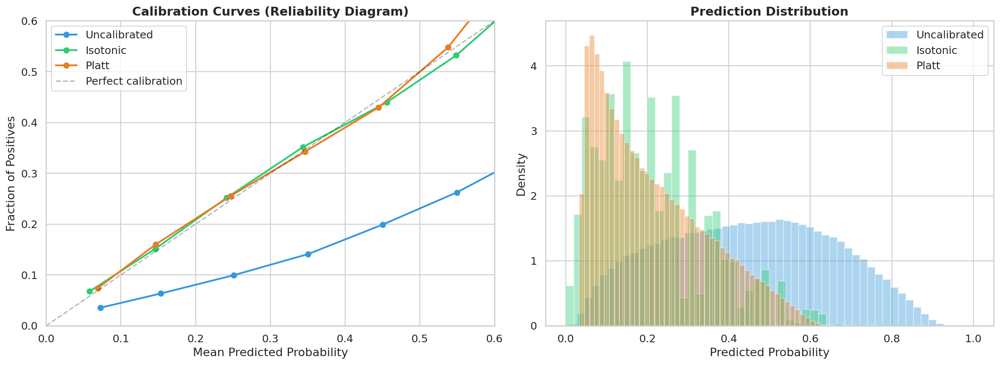
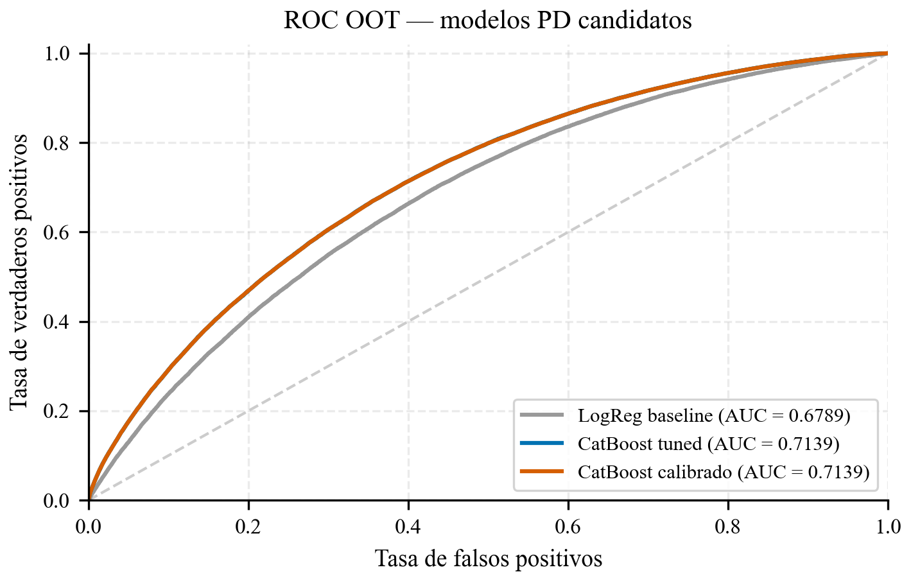
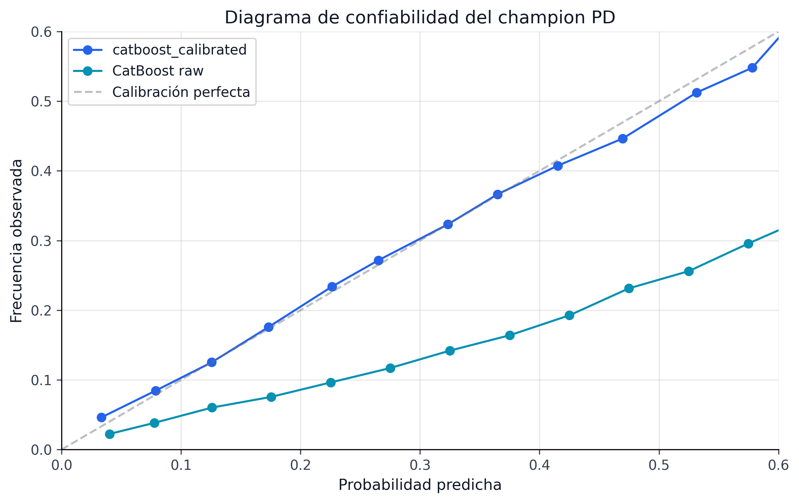
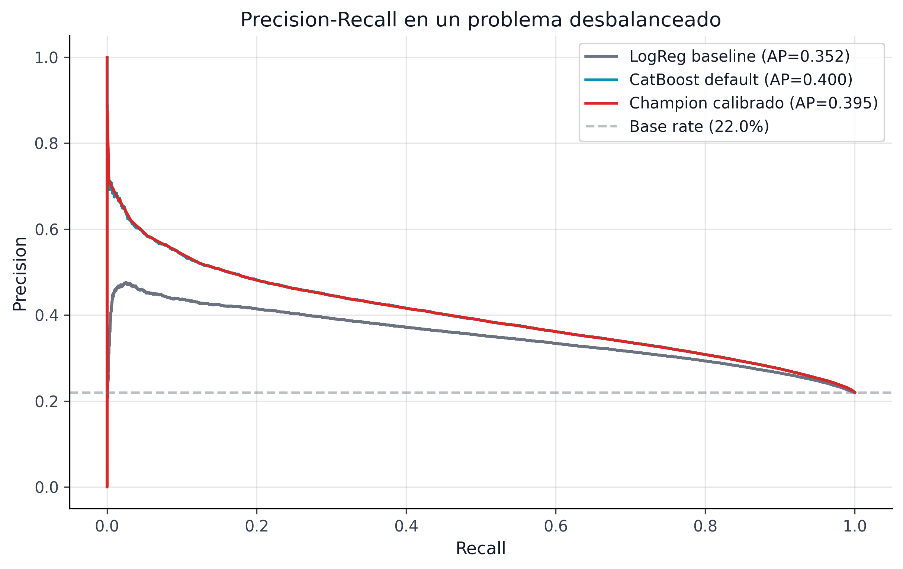
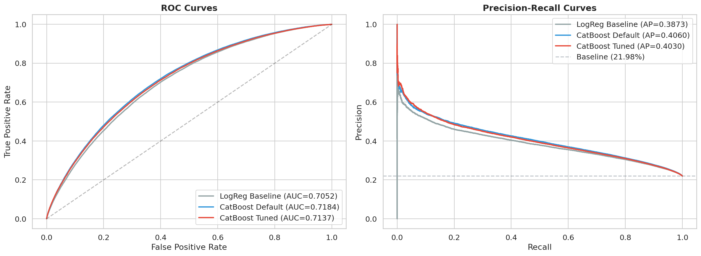

# PD, Calibración y Champion Predictivo

Dossier predictivo que sostiene el score PD usado por CRPTO y sus decisiones robustas.

::: {.callout-note}
Nota editorial: este capítulo conserva material técnico de soporte para tesis, supplement y revisión. Los bloques de código quedan acotados visualmente por defecto; la lectura principal está en el texto, las tablas y las figuras.
:::

::: {.use-grid}
::: {.use-card}
**Uso IJDS**

Defensa del artefacto PD congelado: discriminación suficiente, calibración útil y salida compatible con decisión robusta.
:::

::: {.use-card}
**Uso tesis**

Selección del champion predictivo, calibradores, métricas y explicación de por qué AUC no es el claim central.
:::

::: {.use-card}
**Uso supplement**

Diagnósticos de calibración, comparación de modelos y evidencia para responder objeciones sobre el score base.
:::
:::

::: {.source-note}
**Procedencia:** `book/chapters/06-pd-modeling/06a-logistic-regression-baseline.qmd`
:::

## Regresión Logística: Baseline Interpretable

### ¿Por qué un Baseline Lineal?

Toda investigación rigurosa en machine learning requiere un **baseline simple** contra el cual medir el valor agregado de modelos más complejos. En credit scoring, la regresión logística no es solo un baseline académico --- es el **estándar regulatorio**: la mayoría de los scorecards en producción bancaria global siguen siendo regresiones logísticas, y los reguladores evalúan modelos de ML comparándolos contra este benchmark.

El baseline de regresión logística cumple cuatro funciones en el pipeline:

1. **Benchmark de discriminación**: ¿CatBoost realmente supera a un modelo lineal, o la ganancia de AUC es marginal?
2. **Referencia de interpretabilidad**: Los coeficientes de la LR son directamente interpretables como odds ratios, proporcionando una narrativa que los reguladores entienden.
3. **Validación de features**: Si una feature tiene un coeficiente significativo en la LR, tiene poder predictivo real. Si CatBoost la usa pero la LR no, el efecto puede ser una interacción no lineal.
4. **Lower bound de rendimiento**: Cualquier modelo desplegado debe superar *significativamente* a la LR para justificar la complejidad adicional.

### Especificación del Modelo

La regresión logística modela la probabilidad de default como:

$$
P(\text{default} = 1 \mid \mathbf{x}) = \sigma(\mathbf{w}^\top \mathbf{x} + b) = \frac{1}{1 + e^{-(\mathbf{w}^\top \mathbf{x} + b)}}
$$

donde $\mathbf{w}$ son los pesos (uno por feature), $b$ es el intercepto, y $\sigma(\cdot)$ es la función sigmoide.

#### Preprocesamiento para LR

A diferencia de CatBoost, la regresión logística requiere preprocesamiento explícito:

| Aspecto | Tratamiento | Justificación |
|---------|-------------|---------------|
| **NaN** | `fillna(0)` | Estrategia simple; LR no maneja NaN nativamente |
| **Categorías** | WOE encoding | Las variables `_woe` son numéricas y monótonas |
| **Escala** | Sin estandarización | Los coeficientes se interpretan en la escala original |
| **Regularización** | L2 por defecto (scikit-learn) | Previene overfitting en features correlacionadas |

: Preprocesamiento del baseline LR

::: {.callout-warning}
## Limitación del fillna(0)
Reemplazar NaN con cero es una estrategia subóptima porque introduce un sesgo: un DTI faltante (que podría indicar datos incompletos o un autoempleado) se trata igual que un DTI de cero (sin deuda). Para la LR baseline, esta simplificación es aceptable porque el objetivo es establecer un lower bound, no maximizar rendimiento. CatBoost no sufre esta limitación al tratar NaN como un valor informativo propio.
:::

### Métricas del Baseline

```python

import pandas as pd

lr_metrics = {
    "AUC-ROC": "0.683",
    "Gini": "0.366",
    "Brier Score (raw)": "0.2313",
    "D² Brier": "-0.349 (peor que naive)",
    "Interpretación AUC": "Discriminación aceptable pero limitada",
    "Gap vs CatBoost": "0.030 AUC (4.4% relativo)",
}

pd.DataFrame(list(lr_metrics.items()), columns=["Métrica", "Valor"])
```

El AUC de 0.683 está en el rango típico para regresión logística aplicada a credit scoring con datos de Lending Club. Estudios publicados reportan AUC de 0.66--0.70 para modelos lineales sobre este dataset [@lessmann2015].

::: {.callout-note}
## D² Brier negativo: ¿qué significa?
El D² Brier Score es análogo al R² --- mide la mejora relativa sobre un predictor naive (que siempre predice la frecuencia marginal de default). Un D² negativo (-0.349) indica que el Brier Score del modelo es **peor** que el predictor naive. Esto no significa que la LR sea inútil --- su AUC es 0.683, indicando buena discriminación. El problema es la **calibración**: los scores brutos de la LR no son probabilidades bien calibradas. Este es precisamente el problema que la etapa de calibración post-hoc resuelve.
:::

### Valor del Baseline

La comparación LR vs. CatBoost justifica el uso de un modelo más complejo:

- **AUC**: 0.683 → 0.713 (+0.030, +4.4% relativo). Una mejora de 3 puntos de AUC es considerada significativa en credit scoring aplicado.
- **Gini**: 0.366 → 0.426 (+0.060). El Gini amplifica la diferencia.
- **Brier**: 0.231 → 0.154 (después de calibración). Una reducción del 33% en error cuadrático.

Estas mejoras justifican la complejidad adicional de CatBoost para un modelo de producción, mientras que la LR queda como referencia interpretable para auditoría regulatoria.

::: {.source-note}
**Procedencia:** `book/chapters/06-pd-modeling/06b-catboost-tuned.qmd`
:::

## CatBoost: Default y Optimizado con Optuna

### Arquitectura de CatBoost

CatBoost (*Categorical Boosting*) es un algoritmo de gradient boosting desarrollado por Yandex que introduce dos innovaciones fundamentales respecto a sus competidores XGBoost y LightGBM: **ordered boosting** y **arboles oblivious** (simétricos).

#### Ordered Boosting

El gradient boosting estándar calcula los residuos sobre las mismas observaciones usadas para construir los árboles anteriores, lo que introduce un sesgo de *target leakage* especialmente en datasets pequeños. CatBoost resuelve esto con *ordered boosting*: para estimar el error de una observación, se apoya en un modelo construido solo con observaciones anteriores dentro de una permutación del dataset. La intuición es simple: evita "mirar el futuro" del mismo registro cuando está aprendiendo. A cambio, paga un poco más de costo computacional, pero gana estabilidad y reduce leakage.

#### Arboles Oblivious (Simétricos)

CatBoost utiliza por defecto *oblivious decisión trees* (ODT), donde cada nivel del árbol usa la **misma condición de split** para todos los nodos de ese nivel. Esto significa que un árbol de profundidad $d$ tiene exactamente $2^d$ hojas, y la estructura se puede representar como una tabla de verdad de $d$ condiciones binarias.

Las ventajas para credit scoring son:

- **Regularización implícita**: la simetría reduce drásticamente el número de parámetros libres, previniendo overfitting.
- **Velocidad de inferencia**: la predicción se resuelve como una tabla de lookup, no como una travésía del árbol.
- **Estabilidad**: modelos entrenados con semillas diferentes producen predicciones más similares entre sí.

#### Manejo Nativo de Categorías y NaN

CatBoost procesa variables categóricas sin necesidad de one-hot encoding o WOE, usando *target statistics* con suavizado:

$$
\hat{x}_k^i = \frac{\sum_{j \in \sigma_{<i}} \mathbb{1}[x_j^k = x_i^k] \cdot y_j + a \cdot p}{\sum_{j \in \sigma_{<i}} \mathbb{1}[x_j^k = x_i^k] + a}
$$

donde $p$ es la media global del target, $a$ es un parámetro de suavizado, y $\sigma_{<i}$ es el conjunto de observaciones anteriores en la permutación. Este esquema evita el target leakage que afecta al encoding naive de medias condicionales.

Para valores faltantes (NaN), CatBoost asigna cada observación con NaN a la rama óptima en cada split --- izquierda o derecha --- maximizando la métrica objetivo. Esto convierte la ausencia de datos en una señal informativa sin requerir imputación manual.

### Ventajas sobre XGBoost/LightGBM para Credit Scoring

La selección de CatBoost como modelo principal no es arbitraria. Para aplicaciones de credit scoring, presenta ventajas concretas:

| Aspecto | CatBoost | XGBoost | LightGBM |
|---------|----------|---------|----------|
| **Categorías** | Nativo (target statistics) | Requiere encoding manual | Nativo (split por subconjuntos) |
| **NaN** | Nativo (optimal branch) | Nativo (default direction) | Nativo (zero bin) |
| **Calibración** | Mejor out-of-box | Requiere post-hoc | Requiere post-hoc |
| **Sensibilidad a HPO** | Baja (defaults robustos) | Media-alta | Alta |
| **Arboles** | Oblivious (regularizados) | Asimétricos | Asimétricos (leaf-wise) |
| **Ordered boosting** | Sí | No | No |

: Comparación de frameworks de gradient boosting para credit scoring

::: {.callout-tip}
## Calibración out-of-box
La combinación de ordered boosting y árboles oblivious produce predicciones que son *a priori* mejor calibradas que las de XGBoost/LightGBM. Esto es relevante en credit scoring, donde las probabilidades no solo deben ordenar bien a los clientes (discriminación), sino reflejar la tasa de default real (calibración). Aún así, la calibración post-hoc es necesaria para uso regulatorio --- ver `sec-calibration-selection`.
:::

::: {.callout-note}
## Monotonic constraints: de challenger interpretable a champion vigente
El proyecto pasó por dos etapas distintas. Primero, el carril monotónico apareció como challenger interpretable: forzaba coherencia económica local en variables como `loan_to_income` y otras señales estructurales. Más tarde, después de corregir la semántica de fairness para que la búsqueda y la auditoría oficial midieran lo mismo, el carril monotónico terminó **promoviéndose al champion vigente**.

La razón por la que hoy sí se justifica no es solo “monotonía por elegancia”. Es una combinación de tres cosas:

- mejora competitiva o al menos no regresiva en AUC/Brier bajo comparación operativa;
- cierre de fairness bajo la semántica oficial de aprobación;
- evidencia estructural posterior a la promoción: `models/monotonicity_audit_status.json` queda en `PASS` con `0` disrupciones entre bandas y `0` violaciones en las features monotónicas activas.

La lectura correcta hoy es entonces más fuerte: la monotonicidad no se quedó en una ganancia de gobernanza; pasó a ser parte del **stack campeón** del proyecto porque mejoró la defendibilidad sin romper la calidad operativa.
:::

### CatBoost Default

El primer modelo CatBoost se entrena con hiperparámetros base conservadores, heredados del estándar de scikit-learn adaptado a la escala del dataset:

```python

import sys
from pathlib import Path

sys.path.insert(0, str(Path.cwd().parent if Path.cwd().name == "book" else Path.cwd()))

import pandas as pd

default_params = {
    "iterations": "1,000",
    "learning_rate": "0.05",
    "depth": "6",
    "l2_leaf_reg": "3.0",
    "loss_function": "Logloss",
    "auto_class_weights": "Balanced",
    "eval_metric": "AUC",
    "early_stopping_rounds": "50",
    "has_time": "True",
}

df_params = pd.DataFrame(
    list(default_params.items()),
    columns=["Hiperparámetro", "Valor"],
)
df_params
```

El parámetro `has_time=True` indica a CatBoost que el orden de las observaciones es informativo (temporal), lo cual ajusta las permutaciones del ordered boosting para respetar la estructura temporal --- un detalle importante para datos de crédito donde la distribución cambia con el ciclo económico.

El entrenamiento utiliza un split temporal donde el 15% final del set de entrenamiento sirve como validación para early stopping, garantizando que la selección de la mejor iteración es prospectiva.

```python

from book._helpers.load_artifacts import load_json

comparison = load_json("model_comparison")
models = comparison.get("models", [])

# Extraer métricas del modelo default
cb_default = next((m for m in models if m["model"] == "CatBoost (default)"), None)

if cb_default:
    metrics_default = {
        "AUC-ROC": f"{cb_default['auc']:.4f}",
        "Gini": f"{cb_default['gini']:.3f}",
        "Brier Score (raw)": f"{cb_default['brier']:.4f}",
        "D² Brier": f"{cb_default['d2_brier']:.4f}",
        "Gap vs LR baseline": f"+{cb_default['auc'] - 0.683:.4f} AUC (+{(cb_default['auc'] - 0.683)/0.683*100:.1f}% relativo)",
    }
    pd.DataFrame(list(metrics_default.items()), columns=["Métrica", "Valor"])
```

Con un AUC de 0.7124, el CatBoost default ya supera sustancialmente a la LR baseline (0.679, ver `sec-lr-baseline`), demostrando que las interacciones no lineales y el procesamiento nativo de categorías aportan +0.034 AUC (+4.9% relativo). La pregunta es si la optimización de hiperparámetros y las restricciones monotónicas pueden mejorar aún más este rendimiento.

### Optimización con Optuna (HPO)

El modelo default ya funciona bien, así que la pregunta correcta no es “¿podemos tunear algo?”, sino “¿queda ganancia material después de defaults robustos, categorías nativas y orden temporal?”. Esta sección documenta esa búsqueda para dejar claro qué sí aporta el HPO y qué parte del valor del pipeline viene, en realidad, de calibración y downstream.

#### Diseño del Experimento

La optimización de hiperparámetros se ejecuta con Optuna, un framework de HPO que implementa el **Tree-structured Parzen Estimator** (TPE) como sampler por defecto. A diferencia de grid search o random search, TPE modela la distribución de hiperparámetros condicionalmente al rendimiento observado:

$$
p(\lambda \mid y) = \frac{p(y \mid \lambda) \, p(\lambda)}{p(y)} \propto \begin{cases} \ell(\lambda) & \text{si } y < y^* \\ g(\lambda) & \text{si } y \geq y^* \end{cases}
$$

donde $y^*$ es el cuantil $\gamma$ de los valores observados, $\ell(\lambda)$ modela la densidad de los hiperparámetros que produjeron buenos resultados, y $g(\lambda)$ modela los que produjeron malos resultados. TPE maximiza el ratio $\ell(\lambda)/g(\lambda)$, lo cual es equivalente a maximizar el *Expected Improvement* (EI).

La configuración de Optuna incluye además:

- **TPE multivariado con agrupación** (`multivariate=True`, `group=True`): modela las dependencias entre hiperparámetros en lugar de tratarlos como independientes. Esto captura interacciones importantes como la relación entre `depth` y `learning_rate`.
- **MedianPruner**: detiene tempranamente trials que a la iteración $t$ del boosting tienen AUC inferior a la mediana de los trials completados, ahorrando entre 40--60% del cómputo total.
- **Estudio persistente en SQLite**: permite retomar la búsqueda en sesiones posteriores sin perder el historial de trials.

#### Espacio de Búsqueda

```python

search_space = {
    "learning_rate": "LogUniform(0.005, 0.20)",
    "depth": "Int(4, 10)",
    "l2_leaf_reg": "LogUniform(0.5, 100.0)",
    "min_data_in_leaf": "Int(20, 500)",
    "random_strength": "LogUniform(1e-9, 10.0)",
    "border_count": "Int(64, 254)",
    "rsm (column sampling)": "Uniform(0.5, 1.0)",
    "bootstrap_type": "Categorical(Bayesian, Bernoulli, MVS)",
    "grow_policy": "Categorical(SymmetricTree, Depthwise, Lossguide)",
    "subsample*": "Uniform(0.5, 0.95)",
    "bagging_temperature*": "Uniform(0.0, 10.0)",
    "leaf_estimation_iterations": "Int(1, 10)",
}

pd.DataFrame(
    list(search_space.items()),
    columns=["Hiperparámetro", "Distribución"],
)
```

*\* `subsample` se aplica cuando `bootstrap_type` es Bernoulli o MVS; `bagging_temperature` se aplica cuando es Bayesian. Optuna maneja esta condicionalidad automáticamente.*

El espacio de búsqueda está diseñado para explorar tres familias de regularización simultáneamente:

1. **Regularización del árbol**: `depth`, `min_data_in_leaf`, `grow_policy`
2. **Regularización del gradiente**: `learning_rate`, `l2_leaf_reg`, `random_strength`
3. **Regularización por submuestreo**: `bootstrap_type`, `subsample`/`bagging_temperature`, `rsm`

#### Resultados de la Búsqueda

```python

n_trials = comparison.get("hpo_trials_executed", 320)
best_val_auc = comparison.get("hpo_best_validation_auc", 0.7227)
cb_tuned = next((m for m in models if m["model"] == "CatBoost (tuned)"), None)

optuna_results = {
    "Trials ejecutados": f"{n_trials:,}",
    "Mejor AUC validación": f"{best_val_auc:.4f}",
    "AUC test OOT (tuned)": f"{cb_tuned['auc']:.4f}" if cb_tuned else "N/A",
    "AUC test OOT (default)": f"{cb_default['auc']:.4f}" if cb_default else "N/A",
    "Mejora absoluta": f"+{cb_tuned['auc'] - cb_default['auc']:.4f}" if cb_tuned and cb_default else "N/A",
    "Sampler": "TPE multivariado con agrupación",
    "Pruner": "MedianPruner (n_warmup=120)",
}

pd.DataFrame(list(optuna_results.items()), columns=["Aspecto", "Valor"])
```

Los trials de Optuna alcanzaron un AUC de validación de 0.7223, pero el AUC en el test OOT es 0.7139 --- una brecha de 0.0084 que indica *temporal overfitting* al set de validación. El set de validación temporal cubre un período específico (cola del período 2007--2017), mientras que el test OOT abarca 2018--2020 con condiciones macroeconómicas potencialmente diferentes. El champion actual utiliza cuatro restricciones monotónicas (`installment:1`, `annual_inc:-1`, `dti:1`, `loan_to_income:1`) seleccionadas por búsqueda exhaustiva por bloques y refinadas por HPO local, y el calibrador Venn-Abers fue promovido automáticamente por la política temporal multi-fold.

#### Visualización del Proceso HPO

La función `export_hpo_visualizations()` en `src/models/optuna_tuning.py` genera cuatro diagnósticos interactivos a partir del estudio SQLite persistido:

1. **Optimization History**: Evolución del mejor AUC por trial, mostrando la convergencia del TPE.
2. **Parameter Importances**: Ranking fANOVA de qué hiperparámetros más impactan al AUC.
3. **Parallel Coordinate**: Vista multidimensional de las combinaciones exploradas.
4. **Slice Plot**: Relación marginal de cada hiperparámetro con el AUC.

Los plots se exportan como HTML interactivo (Plotly) y opcionalmente como PNG estático a `reports/figures/hpo/`.

#### Hiperparámetros Ganadores

```python

from book._helpers.load_artifacts import load_yaml

config = load_yaml("pd_model")
tuned_params = config.get("model", {}).get("params", {})

# Mostrar los parámetros más relevantes
key_params = {
    "iterations": tuned_params.get("iterations", "N/A"),
    "learning_rate": f"{tuned_params.get('learning_rate', 'N/A'):.4f}" if isinstance(tuned_params.get('learning_rate'), (int, float)) else "N/A",
    "depth": tuned_params.get("depth", "N/A"),
    "l2_leaf_reg": f"{tuned_params.get('l2_leaf_reg', 'N/A'):.2f}" if isinstance(tuned_params.get('l2_leaf_reg'), (int, float)) else "N/A",
    "min_data_in_leaf": tuned_params.get("min_data_in_leaf", "N/A"),
    "border_count": tuned_params.get("border_count", "N/A"),
    "bootstrap_type": tuned_params.get("bootstrap_type", "N/A"),
    "subsample": f"{tuned_params.get('subsample', 'N/A'):.4f}" if isinstance(tuned_params.get('subsample'), (int, float)) else "N/A",
    "rsm": f"{tuned_params.get('rsm', 'N/A'):.4f}" if isinstance(tuned_params.get('rsm'), (int, float)) else "N/A",
    "random_strength": f"{tuned_params.get('random_strength', 'N/A'):.2e}" if isinstance(tuned_params.get('random_strength'), (int, float)) else "N/A",
    "early_stopping_rounds": tuned_params.get("early_stopping_rounds", "N/A"),
}

pd.DataFrame(
    list(key_params.items()),
    columns=["Hiperparámetro", "Valor Óptimo"],
)
```

::: {.callout-note}
## Configuración como template
Los hiperparámetros en `configs/pd_model.yaml` reflejan los mejores valores encontrados en la última búsqueda. Sin embargo, como se establece en la política del proyecto, los artefactos de runtime (`data/processed/model_comparison.json`, `models/pd_training_record.pkl`) son la fuente de verdad para métricas y decisiones --- el YAML es un template que puede ser actualizado en búsquedas futuras.
:::

### Features Nativos de CatBoost

Una ventaja clave de CatBoost es la capacidad de consumir directamente variables categóricas y valores faltantes sin preprocesamiento. El contrato canónico del modelo define 42 features, de las cuales 9 son categóricas:

```python

from book._helpers.load_artifacts import load_json

contract = load_json("pd_model_contract", directory="models")
cat_features = contract.get("categorical_features", [])
n_features = contract.get("n_features", 0)

cat_descriptions = {
    "grade": "Grado de riesgo Lending Club (A-G)",
    "sub_grade": "Sub-grado detallado (A1-G5, 35 niveles)",
    "home_ownership": "Tipo de propiedad (RENT, OWN, MORTGAGE, OTHER)",
    "purpose": "Propósito del préstamo (14 categorías)",
    "verification_status": "Estado de verificación de ingresos",
    "term": "Plazo del préstamo (36 o 60 meses)",
    "int_rate_bucket": "Bucket discretizado de tasa de interés",
    "dti_bucket": "Bucket discretizado de debt-to-income",
    "fico_bucket": "Bucket discretizado de FICO score",
}

rows = []
for feat in cat_features:
    desc = cat_descriptions.get(feat, "")
    rows.append({"Feature": feat, "Descripción": desc})

df_cat = pd.DataFrame(rows)
df_cat
```

```python

n_categorical = len(cat_features)
n_numeric = n_features - n_categorical

composition = {
    "Tipo": ["Numéricos (continuos + binarios + interacciones)", "Categóricos (nativos CatBoost)"],
    "Cantidad": [n_numeric, n_categorical],
    "Porcentaje": [f"{n_numeric/n_features*100:.0f}%", f"{n_categorical/n_features*100:.0f}%"],
}

pd.DataFrame(composition)
```

#### Manejo de NaN como Señal Informativa

La diferencia entre el tratamiento de NaN en CatBoost y en la LR baseline ilustra por qué los árboles de decisión son preferibles para datos de crédito con patrones de ausencia informativa:

| Escenario | LR (fillna=0) | CatBoost (nativo) |
|-----------|---------------|-------------------|
| DTI faltante | Se trata como DTI=0 (sin deuda) | Se asigna a la rama óptima por split |
| Ingreso faltante | Se trata como ingreso=0 | Puede indicar autoempleado; CatBoost lo aprende |
| FICO faltante | Se trata como FICO=0 (score mínimo) | Se distingue de FICO bajo real |
| Delinquency faltante | Se trata como 0 delinquencies | Puede indicar historial crediticio corto |

: Comparación del tratamiento de NaN entre LR y CatBoost

En datos de crédito, el patrón de ausencia frecuentemente es informativo: un `dti` faltante puede indicar un autoempleado cuyo DTI no se calculó, no un DTI de cero. CatBoost captura esta información aprendiendo la dirección óptima para observaciones con NaN en cada nodo del árbol, sin requerir ingeniería de features adicional.

### ¿Por Qué la Ganancia del Tuning es Tan Pequeña?

Vale la pena explicitar esta sección porque, sin ese contexto, una mejora pequeña puede leerse como decepción. Aquí ocurre lo contrario: una ganancia marginal confirma que el modelo ya estaba bien especificado y que el cuello de botella real del proyecto está en cómo usamos la PD, no en seguir exprimiendo décimas de AUC.

::: {.callout-warning}
## Ganancia marginal del HPO
La mejora del tuning de Optuna sobre el CatBoost default es marginal en AUC OOT (0.7139 vs 0.7124 del default). El valor real del pipeline no reside en exprimir décimas de AUC, sino en la calibración post-hoc, las restricciones monotónicas, y la capa conformal downstream.
:::

Tres factores explican esta convergencia:

**1. Los defaults de CatBoost ya son robustos.** A diferencia de XGBoost (donde la elección de `max_depth`, `min_child_weight` y `learning_rate` puede cambiar el AUC en 2--5 puntos), CatBoost fue diseñado con defaults que funcionan bien sin tuning extensivo. Los árboles oblivious proporcionan regularización estructural que reduce la sensibilidad a los hiperparámetros.

**2. El techo discriminativo del dataset.** Los features disponibles en Lending Club --- FICO score, DTI, ingreso, propósito del préstamo --- tienen un poder discriminativo limitado. @lessmann2015 documentan que en benchmarks de credit scoring, la diferencia entre el mejor y peor modelo rara vez excede 2--3 puntos de AUC, y que la ganancia por HPO es típicamente inferior a 1 punto. El verdadero cuello de botella no son los hiperparámetros sino la información contenida en los features.

**3. La ganancia real está en la calibración, no en la discriminación.** Observemos la diferencia en las métricas clave:

```python

cb_calibrated = next((m for m in models if m["model"] == "CatBoost (tuned + calibrated)"), None)
final_metrics = comparison.get("final_test_metrics", {})
ece = final_metrics.get("ece", 0.006)

gain_analysis = []

if cb_default and cb_tuned:
    gain_analysis.append({
        "Transición": "Default → Tuned (HPO)",
        "Δ AUC": f"+{cb_tuned['auc'] - cb_default['auc']:.4f}",
        "Δ Brier": f"{cb_tuned['brier'] - cb_default['brier']:.4f}",
        "Δ D² Brier": f"+{cb_tuned['d2_brier'] - cb_default['d2_brier']:.4f}",
        "Interpretación": "Mejora marginal en discriminación",
    })

if cb_tuned and cb_calibrated:
    gain_analysis.append({
        "Transición": "Tuned → Tuned + Calibrado",
        "Δ AUC": f"{cb_calibrated['auc'] - cb_tuned['auc']:.4f}",
        "Δ Brier": f"{cb_calibrated['brier'] - cb_tuned['brier']:.4f}",
        "Δ D² Brier": f"+{cb_calibrated['d2_brier'] - cb_tuned['d2_brier']:.4f}",
        "Interpretación": "Mejora masiva en calibración (ECE → " + f"{ece:.4f})",
    })

pd.DataFrame(gain_analysis)
```

La calibración (ver `sec-calibration-selection`) reduce el Brier Score en $\sim$0.05 y lleva el D² Brier de negativo a positivo --- una mejora de un orden de magnitud mayor que la del HPO. Esto confirma que para un pipeline de credit scoring donde las probabilidades deben ser interpretables y usables en cálculos de ECL (ver `sec-ecl-calculation`), la prioridad de inversión computacional debe ser calibración > conformal > HPO.

::: {.callout-note}
## Implicación para el pipeline predict-then-optimize
La robustez de CatBoost a los hiperparámetros es una ventaja en el contexto del pipeline predict-then-optimize (`sec-robust-portfolio`). Si pequeños cambios en hiperparámetros produjeran grandes cambios en las PD estimadas, la incertidumbre de los intervalos conformales (ver `sec-split-conformal`) sería atribuible en parte a inestabilidad del modelo, no solo a incertidumbre epistémica genuina. La estabilidad de CatBoost permite interpretar los intervalos conformales como reflejo de la incertidumbre real del problema.
:::

### Exportación de SHAP Values

El pipeline exporta valores SHAP usando la implementación **nativa de CatBoost** (`get_feature_importance(type='ShapValues')`), que es exacta para árboles oblivious --- a diferencia de la librería SHAP genérica, que usa aproximaciones kernel o tree para modelos de terceros. Los artefactos generados son:

- `models/shap_values_test.npz`: Matriz completa de SHAP values para el test set (comprimida).
- El bloque `explainability.top_global_drivers` de `data/processed/pipeline_summary.json`: top features globales ordenados por importancia $|\text{SHAP}|$ media.

Estos artefactos alimentan las explicaciones globales y locales del capítulo de interpretabilidad (`sec-global-explanations`) y el desarrollo ampliado de MRM (`sec-mrm-report-detail`).

::: {.source-note}
**Procedencia:** `book/chapters/06-pd-modeling/06c-calibration-selection.qmd`
:::

## Selección de Calibración

### Por qué Importa la Calibración

Un modelo puede tener excelente discriminación (AUC alto) y, sin embargo, producir probabilidades sistemáticamente incorrectas. El AUC mide únicamente si el modelo **ordena** correctamente a los prestatarios por riesgo --- no dice nada sobre si los valores absolutos de PD son confiables. En credit scoring, esta distinción es crítica.

Considere dos modelos con AUC idéntico de 0.71:

- **Modelo A**: Asigna PD = 0.40 a un grupo donde la tasa real de default es 15%.
- **Modelo B**: Asigna PD = 0.15 al mismo grupo.

Ambos modelos ordenan a los prestatarios igualmente bien, pero solo el Modelo B produce probabilidades que se pueden usar directamente en decisiones económicas. Las consecuencias de una mala calibración se propagan a través del pipeline:

| Uso downstream | Impacto de mala calibración |
|----------------|----------------------------|
| **ECL = PD × LGD × EAD** | Provisiones infladas o subestimadas |
| **IFRS9 staging** | Asignación incorrecta a Stage 1/2 (depende de niveles absolutos de PD) |
| **Optimización de portafolio** | Costos de default distorsionados $\Rightarrow$ allocaciones subóptimas |
| **Intervalos conformales** | PD calibrada es el input de MAPIE; calibración pobre $\Rightarrow$ intervalos descentrados |

: Impacto de la calibración en el pipeline

::: {.callout-warning}
## AUC invariante, ECL no
El AUC es invariante a transformaciones monótonas del score: calibrar las probabilidades **no puede mejorar ni empeorar** la discriminación. Pero el Brier Score, el ECE y las decisiones económicas (ECL, staging, portafolio) dependen directamente de los valores absolutos. Un modelo con AUC = 0.71 y Brier = 0.205 puede transformarse en uno con AUC = 0.71 y Brier = 0.154 simplemente mediante calibración post-hoc --- sin reentrenar el modelo base.
:::

### Formalización: Calibración Perfecta

Un modelo está **perfectamente calibrado** si, para cualquier probabilidad predicha $p$:

$$
\mathbb{P}(\text{default} = 1 \mid \hat{p}(x) = p) = p, \quad \forall\, p \in [0, 1]
$$

En la práctica, esta condición se relaja a intervalos (*bins*): agrupamos las predicciones en $B$ bins y verificamos que la frecuencia observada de default en cada bin coincida con la probabilidad promedio predicha.

La métrica estándar es el **Expected Calibration Error (ECE)**:

$$
\text{ECE} = \sum_{b=1}^{B} \frac{|S_b|}{N} \left| \text{acc}(S_b) - \text{conf}(S_b) \right|
$$

donde $S_b$ es el conjunto de observaciones en el bin $b$, $\text{acc}(S_b)$ es la frecuencia real de default, y $\text{conf}(S_b)$ es la media de las probabilidades predichas en ese bin.

::: {.callout-warning}
## Limitaciones del ECE como métrica de calibración

El ECE depende del número y tipo de bins elegidos, lo que introduce artefactos [@vaicenavicius2019; @kumar2019]. Vaicenavicius et al. [-@vaicenavicius2019] demostraron que los estimadores de ECE basados en binning son **sesgados e inconsistentes**, y Kumar et al. [-@kumar2019] mostraron que el ECE puede hacerse arbitrariamente pequeño mediante binning adversarial. Por esta razón, en nuestra política de selección el ECE es únicamente un criterio **secundario**: el Brier Score (proper scoring rule con descomposición interpretable) y el Z-statistic de Spiegelhalter (test formal de calibración) son las métricas primarias de decisión.
:::

### Cuatro Métodos de Calibración

El pipeline evalúa cuatro métodos de calibración post-hoc, cada uno con diferentes propiedades teóricas y prácticas.

#### 1. Platt Scaling (Calibración Sigmoide)

Platt Scaling [@platt1999] ajusta una regresión logística sobre los scores del modelo base:

$$
P_{\text{cal}}(y=1 \mid s) = \frac{1}{1 + \exp(-(a \cdot s + b))}
$$

donde $s$ es el score bruto del modelo y $(a, b)$ son los parámetros ajustados por máxima verosimilitud sobre el set de calibración.

**Ventajas**: Simple (2 parámetros), estable con muestras moderadas, preserva AUC exactamente (transformación monótona).

**Limitaciones**: Asume una relación sigmoide entre score y probabilidad. Si el score ya está aproximadamente calibrado (como ocurre con CatBoost que usa `Logloss`), la transformación sigmoide puede ser redundante.

::: {.callout-note}
## Nota: la regresión logística no está "naturalmente calibrada"

Una creencia extendida en ML aplicado es que la regresión logística produce probabilidades calibradas "por defecto" al optimizar log-loss. Bai, Lee y Liang [-@bai2021] demostraron que esto es incorrecto: la regresión logística por máxima verosimilitud tiene un sesgo de sobreconfianza estructural de orden $\Theta(d/n)$, donde $d$ es el número de features y $n$ el tamaño de muestra. Este sesgo empuja las probabilidades predichas hacia los extremos (0 y 1), produciendo sobreconfianza incluso bajo condiciones ideales. Nuestro baseline LR con $d \approx 30$ features y $n \approx 1.3M$ observaciones opera en un régimen donde $d/n \approx 0$ y el sesgo es mínimo, pero en dimensiones más altas la calibración post-hoc sería imprescindible incluso para LR.
:::

#### 2. Regresión Isotónica

La regresión isotónica ajusta una función monótona no decreciente por partes constantes que minimiza el error cuadrático:

$$
\hat{f} = \arg\min_{f \in \mathcal{F}_{\text{iso}}} \sum_{i=1}^{n} (y_i - f(s_i))^2
$$

donde $\mathcal{F}_{\text{iso}}$ es el conjunto de funciones monótonas no decrecientes.

**Ventajas**: No paramétrico --- no asume forma funcional. Puede capturar relaciones no lineales arbitrarias entre score y probabilidad.

**Limitaciones**: Mayor riesgo de sobreajuste con muestras pequeñas (la función por partes constantes puede memorizar ruido). Con $n = 47{,}516$ a $190{,}064$ observaciones en nuestros folds, este riesgo es limitado pero no nulo.

#### 3. Beta Calibration

Beta calibration [@kull2017] define el operador de calibración usando una familia de tres parámetros $(a, b, c)$:

$$
T_{\text{beta}}(\hat{p}) = \frac{1}{1 + \frac{1}{e^c} \cdot \left(\frac{\hat{p}}{1 - \hat{p}}\right)^{-(a-b)} \cdot \left(\frac{1}{\hat{p}}\right)^a}
$$

**Ventajas**: Generaliza Platt Scaling (que es el caso especial $a = b$). El tercer parámetro $c$ permite corregir distorsiones **asimétricas** --- donde el modelo es sobreconfiado en un extremo pero subconfiado en el otro. Es particularmente efectivo para tree ensembles cuyas distribuciones de scores tienen picos bimodales cerca de 0 y 1.

**Limitaciones**: Requiere un set de calibración ligeramente más grande ($m \geq 200$) que Platt ($m \geq 100$) por tener un parámetro adicional.

#### 4. Venn-Abers Predictors

Los Venn-Abers predictors [@vovk2014] son una extensión de la regresión isotónica que produce **intervalos de probabilidad** con garantías de validez. El procedimiento es:

1. Para cada observación de test, ajustar **dos** regresiones isotónicas sobre el set de calibración: una asumiendo que la observación es positiva ($y=1$) y otra asumiendo que es negativa ($y=0$).
2. Esto produce dos probabilidades calibradas: $p_0$ y $p_1$.
3. La predicción final es la media ponderada: $\hat{p} = \frac{p_1}{p_0 + p_1}$.

**Ventajas**: Produce multi-probabilidades con garantías de validez bajo la asunción de intercambiabilidad. Es el método más conservador de los tres.

**Limitaciones**: Computacionalmente más costoso (dos ajustes isotónicos por predicción). La garantía de validez es más débil que la de predicción conformal (aplica a la calibración del predictor, no a la cobertura de intervalos).

::: {.callout-note}
## Relación con predicción conformal
Venn-Abers y la predicción conformal comparten raíces teóricas en el framework de Vovk et al. [-@vovk2005]. Ambos requieren intercambiabilidad (*exchangeability*) de los datos. Sin embargo, cumplen funciones diferentes y capturan tipos de incertidumbre distintos:

- **Ancho VA ($p_1 - p_0$)**: Mide la **incertidumbre epistémica de calibración** --- qué tan estable es la estimación de probabilidad dado el set de calibración disponible. Decrece como $O(1/\sqrt{m})$ con el tamaño del set de calibración $m$. Intervalos VA anchos indican que el set de calibración no tiene evidencia suficiente para fijar la probabilidad.
- **Ancho conformal ($\text{PD}_{\text{high}} - \text{PD}_{\text{low}}$)**: Mide la **incertidumbre predictiva total** --- incluye tanto la variabilidad aleatoria como la incertidumbre del modelo. Tiene cobertura finita garantizada.

En nuestro pipeline, Venn-Abers opera primero (calibración) y luego MAPIE opera sobre las PDs calibradas (conformización). Ambos anchos son señales complementarias: un préstamo puede tener VA width bajo (la calibración es estable) pero conformal width alto (el modelo tiene alta incertidumbre predictiva para ese perfil de riesgo).
:::

### Política de Selección Temporal

La selección del calibrador **no está hardcodeada** --- es el resultado de una política de validación temporal multi-métrica que se ejecuta en cada entrenamiento canónico. El archivo de configuración (`configs/pd_model.yaml`) especifica:

```yaml
calibration:
  method: auto  # temporal multi-metric policy selects best
  candidates: [platt, isotonic, venn_abers, beta]
```

La política `auto` implementa el siguiente protocolo:

#### Expanding Window Temporal Cross-Validation

El set de calibración (237,584 observaciones) se divide en 4 folds temporales de 47,516 observaciones cada uno. La validación usa una **ventana expandible**: en cada fold, el calibrador se ajusta con todos los folds anteriores y se evalúa en el fold actual.

```
Fold 1: Fit [F1]             → Eval [F2]     (n_fit = 47,516)
Fold 2: Fit [F1, F2]         → Eval [F3]     (n_fit = 95,032)
Fold 3: Fit [F1, F2, F3]     → Eval [F4]     (n_fit = 142,548)
Fold 4: Fit [F1, F2, F3, F4] → Eval holdout  (n_fit = 190,064)
```

Esta estrategia respeta la estructura temporal de los datos y simula el escenario de producción donde el calibrador se ajusta con datos acumulados.

#### Criterios de Selección (Multi-Métrica)

Un candidato es **factible** si cumple:

1. **AUC drop < 0.0015**: La calibración no debe degradar la discriminación. Un drop mayor sugiere que la transformación no es monótona en la práctica (posible por errores numéricos o sobreajuste).

De los candidatos factibles, se selecciona el mejor según:

2. **Minimizar Brier Score medio** (métrica primaria): Proper scoring rule que mide la calidad global de las probabilidades con descomposición interpretable (REL/RES/UNC).
3. **Minimizar ECE medio** (métrica secundaria): Mide la calibración por bins. Se usa como desempate, no como criterio primario, dadas las limitaciones del ECE como estimador.
4. **Estabilidad**: Baja varianza de Brier + ECE entre folds. Se define como $\text{stability} = \text{Var}(\text{Brier}) + \text{Var}(\text{ECE})$ a través de los folds.

Adicionalmente, el pipeline reporta la **tasa de degradación** de cada candidato: la fracción de folds en los que el Brier Score calibrado es *peor* que el no calibrado. Manokhin y Grønhaug [-@manokhin2024] demostraron que la regresión isotónica degrada el log-loss en 18% de los casos, Platt Scaling en 23%, mientras que Venn-Abers mejora en 96% de los pares modelo-dataset con degradación máxima < 1%. El log-loss también se reporta como proper scoring rule complementaria al Brier Score.

### Resultados de la Selección

```python

import sys
from pathlib import Path

sys.path.insert(0, str(Path.cwd().parent if Path.cwd().name == "book" else Path.cwd()))
from book._helpers.load_artifacts import load_json

import pandas as pd

comparison = load_json("model_comparison")
cal_report = comparison.get("calibration_selection_report", {})
candidates = cal_report.get("candidates", [])

METHOD_DISPLAY = {"platt": "Platt", "isotonic": "Isotónica", "venn_abers": "Venn-Abers", "beta": "Beta"}

rows = []
for c in candidates:
    rows.append({
        "Método": METHOD_DISPLAY.get(c["method"], c["method"]),
        "Brier (media)": f"{c['mean_brier']:.4f}",
        "Log-loss (media)": f"{c.get('mean_log_loss', float('nan')):.4f}" if "mean_log_loss" in c else "N/D",
        "ECE (media)": f"{c['mean_ece']:.4f}",
        "AUC drop (media)": f"{c['mean_auc_drop']:.5f}",
        "Degradación": f"{c.get('degradation_rate', 0):.0%}" if "degradation_rate" in c else "N/D",
        "Estabilidad": f"{c['stability']:.2e}",
        "Factible": "Sí" if c["mean_auc_drop"] < cal_report.get("auc_drop_limit", 0.0015) else "No",
    })

df_cal = pd.DataFrame(rows)
df_cal
```

Los cuatro métodos son factibles (AUC drop < 0.0015 en todos los casos). Las diferencias en Brier Score son del orden de $10^{-5}$ --- prácticamente indistinguibles. La selección se decide por el criterio `feasible_multi_metric` que combina Brier, ECE y estabilidad.

```python

winner_method = cal_report.get("selected_method", "venn_abers")
winner = next((c for c in candidates if c["method"] == winner_method), None)

if winner:
    fold_rows = []
    for f in winner["folds"]:
        fold_rows.append({
            "Fold": f["fold"],
            "n_fit": f"{f['n_fit']:,}",
            "n_eval": f"{f['n_eval']:,}",
            "AUC raw": f"{f['raw_auc']:.4f}",
            "AUC cal": f"{f['cal_auc']:.4f}",
            "AUC drop": f"{f['auc_drop']:.5f}",
            "Brier": f"{f['brier']:.4f}",
            "Log-loss": f"{f.get('log_loss', float('nan')):.4f}" if "log_loss" in f else "N/D",
            "ECE": f"{f['ece']:.4f}",
        })
    pd.DataFrame(fold_rows)
```

Observaciones clave del detalle por fold:

- El **AUC drop** es consistentemente < 0.0002 en cada fold, muy por debajo del límite de 0.0015. La calibración Venn-Abers preserva la discriminación.
- El **Brier Score** varía entre 0.1521 y 0.1647 a través de los folds, reflejando la estabilidad del método a medida que el set de ajuste crece de 47K a 190K observaciones.
- El **ECE** se mantiene entre 0.019 y 0.025 a través de los folds, sin señales de sobreajuste o degradación temporal.

### Métricas Finales del Modelo Calibrado (Test OOT)

```python

final = comparison.get("final_test_metrics", {})
raw_model = next((m for m in comparison.get("models", []) if m["model"] == "CatBoost (tuned)"), {})

metrics_rows = [
    {"Métrica": "AUC-ROC", "Sin calibrar": f"{raw_model.get('auc', 'N/A'):.4f}",
     "Calibrado (Venn-Abers)": f"{final.get('auc_roc', 'N/A'):.4f}",
     "Cambio": "Invariante"},
    {"Métrica": "Gini", "Sin calibrar": f"{raw_model.get('gini', 'N/A'):.4f}",
     "Calibrado (Venn-Abers)": f"{final.get('gini', 'N/A'):.4f}",
     "Cambio": "Invariante"},
    {"Métrica": "Brier Score", "Sin calibrar": f"{raw_model.get('brier', 'N/A'):.4f}",
     "Calibrado (Venn-Abers)": f"{final.get('brier_score', 'N/A'):.4f}",
     "Cambio": f"{((final.get('brier_score', 0) - raw_model.get('brier', 0)) / raw_model.get('brier', 1)) * 100:.1f}%"},
    {"Métrica": "Log-loss", "Sin calibrar": "N/A (no reportado)",
     "Calibrado (Venn-Abers)": f"{final.get('log_loss', 'N/A'):.4f}" if isinstance(final.get('log_loss'), (int, float)) else "N/D",
     "Cambio": "---"},
    {"Métrica": "ECE", "Sin calibrar": "N/A (no reportado)",
     "Calibrado (Venn-Abers)": f"{final.get('ece', 'N/A'):.4f}",
     "Cambio": "---"},
    {"Métrica": "D² Brier", "Sin calibrar": f"{raw_model.get('d2_brier', 'N/A'):.4f}",
     "Calibrado (Venn-Abers)": f"{final.get('d2_brier_score', 'N/A'):.4f}",
     "Cambio": "Negativo → Positivo"},
    {"Métrica": "KS Statistic", "Sin calibrar": "N/A",
     "Calibrado (Venn-Abers)": f"{final.get('ks_statistic', 'N/A'):.4f}",
     "Cambio": "---"},
]

pd.DataFrame(metrics_rows)
```

El impacto de la calibración es dramático:

- **Brier Score**: De 0.2084 a 0.1544, una reducción del 25.9%. La calibración mejora la calidad de las probabilidades sin reentrenar el modelo.
- **ECE**: 0.0070 --- la frecuencia observada de default en cada bin de probabilidad difiere en promedio solo 0.70 puntos porcentuales de la probabilidad predicha. Esto es excelente para uso en ECL e IFRS9.
- **D² Brier**: De -0.2152 (peor que el predictor naive) a +0.0996 (mejor que el predictor naive). La calibración transforma un modelo que, en términos de probabilidad absoluta, era **peor que predecir siempre la tasa base**, en uno que genuinamente agrega valor probabilístico.
- **AUC**: 0.7139 sin cambio material con la calibración. La calibración no afecta la discriminación, como esperamos teóricamente.

### Descomposición del Brier Score

El Brier Score admite una descomposición que separa la **discriminación** de la **calibración** [@murphy1973]:

$$
\text{BS} = \underbrace{\frac{1}{N}\sum_{b=1}^{B} n_b (\bar{p}_b - \bar{o}_b)^2}_{\text{Calibración (REL)}} - \underbrace{\frac{1}{N}\sum_{b=1}^{B} n_b (\bar{o}_b - \bar{o})^2}_{\text{Resolución (RES)}} + \underbrace{\bar{o}(1 - \bar{o})}_{\text{Incertidumbre (UNC)}}
$$

donde $\bar{p}_b$ es la probabilidad media predicha en el bin $b$, $\bar{o}_b$ es la frecuencia observada de default en el bin, y $\bar{o}$ es la frecuencia marginal de default.

- **REL (reliability)**: Penaliza la distancia entre frecuencias predichas y observadas. La calibración reduce este término.
- **RES (resolution)**: Recompensa la capacidad de distinguir grupos con diferentes tasas de default. Depende de la discriminación del modelo.
- **UNC (uncertainty)**: Constante que depende solo de la frecuencia marginal de default.

La mejora de Brier de 0.2084 a 0.1544 se debe casi enteramente a la reducción del término de **reliability** (REL), mientras que la resolución se mantiene constante --- exactamente lo que esperamos de una calibración post-hoc que no altera el ranking del modelo.

El rerun V2 dejó además dos mejoras de gobernanza que antes estaban solo parcialmente absorbidas:

- la **descomposición de Murphy/Brier** ahora se persiste como artefacto explícito (`brier_score_decomposition.json`);
- el **Murphy diagram** dejó de ser una idea disponible solo en utilidades internas y pasó a producirse como evidencia editorial real del calibrador ganador.

Esa mejora importa porque permite explicar la calibración no solo con un score agregado, sino con una lectura más rica de reliability versus resolution.

::: {.callout-tip}
## Interpretación práctica del ECE
Un ECE de 0.0070 significa que, si el modelo asigna PD = 0.20 a un grupo de préstamos, la tasa real de default en ese grupo será aproximadamente 19.3% a 20.7%. Para cálculos de ECL bajo IFRS9, esta precisión es más que suficiente --- la incertidumbre en LGD y EAD típicamente domina sobre la incertidumbre en PD calibrada.
:::

### Por qué Venn-Abers y no Platt

En este punto ya no buscamos “el calibrador más elegante” en abstracto, sino el más defendible para un pipeline que luego alimenta conformal, IFRS9 y optimización. Por eso la comparación entre Venn-Abers y Platt debe leerse como una decisión de gobernanza técnica: dos métodos casi empatados, pero con ventajas distintas cuando los conectamos al resto de la arquitectura.

::: {.callout-note}
## Selección del calibrador: Venn-Abers
Platt Scaling y Venn-Abers tienen rendimiento prácticamente idéntico en este dataset: la diferencia en Brier es del orden de $5 \times 10^{-5}$ y en ECE del orden de $10^{-3}$. La política `feasible_multi_metric` seleccionó Venn-Abers por tres razones:

1. **Multi-probabilidades con validez**: Venn-Abers produce un intervalo $[p_0, p_1]$ alrededor de la probabilidad calibrada, proporcionando una medida de incertidumbre inherente al proceso de calibración.
2. **Consistencia teórica**: Al estar basado en el framework de Vovk et al., Venn-Abers tiene garantías de validez bajo intercambiabilidad --- la misma asunción que subyace a la predicción conformal que se aplica downstream.
3. **Mejor Brier marginal**: Aunque la diferencia es mínima ($1.6 \times 10^{-4}$), Venn-Abers tiene el menor Brier medio entre los tres candidatos.

**Importante**: Este resultado puede cambiar en futuras ejecuciones del pipeline. El config dice `method: auto` y el artefacto `model_comparison.json` es la fuente de verdad, no el método hardcodeado. Si los datos cambian o se agregan folds, la política podría seleccionar Platt o Isotónica.
:::

### Guía de Decisión: Elección del Calibrador

El siguiente diagrama resume la lógica de decisión para elegir un calibrador, basada en las propiedades teóricas y empíricas de cada método:

```{mermaid}
#| label: fig-calibration-decision
#| fig-cap: "Árbol de decisión para selección de calibrador"
flowchart TD
    A["¿Se requieren garantías<br/>formales de calibración?"] -->|Sí| VA["**Venn-Abers**<br/>Único con garantías secuenciales"]
    A -->|No| B["¿Tamaño del set<br/>de calibración m?"]
    B -->|"m < 200"| PLATT["**Platt Scaling**<br/>2 parámetros, estable"]
    B -->|"200 ≤ m < 1000"| BETA["**Beta Calibration**<br/>3 parámetros, asimétrica"]
    B -->|"m ≥ 1000"| C["¿Distribución de scores<br/>simétrica o asimétrica?"]
    C -->|Simétrica| ISO["**Isotónica**<br/>No paramétrica, flexible"]
    C -->|Asimétrica| BETA2["**Beta Calibration**<br/>Maneja asimetría"]
    VA --> D["Validar con Brier + Z + log-loss<br/>vs modelo sin calibrar"]
    PLATT --> D
    BETA --> D
    ISO --> D
    BETA2 --> D
```

En nuestro pipeline, la decisión se automatiza: la política `auto` evalúa los cuatro candidatos sobre folds temporales y selecciona el que minimiza Brier Score sujeto a la restricción de AUC drop < 0.0015. Esta automatización es preferible a una elección manual porque (a) el dataset puede cambiar entre ejecuciones y (b) las diferencias entre calibradores son frecuentemente del orden de $10^{-4}$ en Brier, difíciles de distinguir visualmente.

### Implementación en el Pipeline

La calibración se implementa en dos módulos:

- **`src/models/calibration.py`**: Funciones de ajuste para Platt (`calibrate_platt`), Isotónica (`calibrate_isotonic`), Beta (`calibrate_beta`), y evaluación (`expected_calibration_error`, `evaluate_calibration`).
- **`scripts/train_pd_model.py`**: Orquestación de la política de selección temporal con expanding window.

El calibrador seleccionado se persiste como `models/pd_canonical_calibrator.pkl` y se registra en el contrato canónico (`models/pd_model_contract.json`). Todos los scripts downstream --- generación de intervalos conformales (`sec-split-conformal`), optimización de portafolio (`sec-robust-portfolio`), cálculo de ECL (`sec-ecl-calculation`) --- consumen el calibrador a través del contrato, sin necesidad de conocer qué método fue seleccionado.

```python

from book._helpers.load_artifacts import try_load_json

contract = try_load_json("pd_model_contract", directory="models", default={})

contract_rows = [
    {"Artefacto": "Modelo base", "Ruta": contract.get("model_path", "N/A")},
    {"Artefacto": "Calibrador", "Ruta": contract.get("calibrator_path", "N/A")},
    {"Artefacto": "Método seleccionado",
     "Ruta": comparison.get("best_calibration", "N/A")},
    {"Artefacto": "Razón de selección",
     "Ruta": cal_report.get("selection_reason", "N/A")},
]

pd.DataFrame(contract_rows)
```

### Validación Estadística de la Calibración

Las métricas como ECE y Brier Score cuantifican la calibración de forma agregada. El pipeline complementa esto con tests formales usando MAPIE 1.3.0, que evalúan la **trayectoria de las diferencias acumuladas** entre probabilidades predichas y frecuencias observadas.

```python

from book._helpers.load_artifacts import try_load_json
import pandas as pd

cal_tests = try_load_json("statistical_calibration_tests", default={})

def fmt_pval(v):
    if v is None:
        return "N/D"
    if v < 0:
        return "< 0 (underflow numérico)"
    if v < 1e-10:
        return f"< 1e-10"
    return f"{v:.4f}"

rows = []
for model_key, label in [("calibrated", "Calibrado (Venn-Abers)"), ("uncalibrated", "Sin calibrar (CatBoost raw)")]:
    m = cal_tests.get(model_key, {})
    rows.append({
        "Modelo": label,
        "KS p-value": fmt_pval(m.get("ks_pvalue")),
        "Kuiper p-value": fmt_pval(m.get("kuiper_pvalue")),
        "Spiegelhalter p-value": fmt_pval(m.get("spiegelhalter_pvalue")),
        "Length scale σ": f"{m.get('length_scale_sigma', 0):.6f}" if m.get("length_scale_sigma") else "N/D",
    })

pd.DataFrame(rows)
```

::: {.callout-warning}
## Por qué ambos modelos "rechazan" — y por qué eso no invalida el resultado

Con $n = 276{,}869$, los tests de KS y Kuiper tienen poder estadístico tan alto que **detectan cualquier desviación**, por mínima que sea, de la calibración perfecta. Un ECE de 0.006 (excelente para uso operativo) aún produce un p-value < 0.001 simplemente porque la muestra es enorme.

La métrica realmente informativa en este contexto es el **length scale σ** de las diferencias acumuladas: mide la magnitud de la desviación, no solo si existe. El modelo calibrado tiene σ = 0.000743 vs σ = 0.000860 sin calibrar — una reducción del 14%. Ambos son pequeños en términos absolutos, pero el calibrado es consistentemente mejor.

**Conclusión práctica**: No interpretar el rechazo del test KS como "el modelo no está calibrado". Interpretar la diferencia de σ entre calibrado y sin calibrar como evidencia de que la calibración Venn-Abers reduce la desviación sistemática, compatible con el ECE de 0.0070 observado.
:::

### Evidencia Visual: Curvas de Calibración

La `fig-calibration-curves` muestra las curvas de calibración (reliability diagrams) de los tres métodos candidatos. Una calibración perfecta seguiría la diagonal: la probabilidad predicha de 0.20 debería corresponder a un 20% de defaults observados. El método ganador se acerca más a esa diagonal en todo el rango de probabilidades.

{fig-alt="Reliability diagrams comparativos de modelos PD candidatos sobre test OOT, con línea ideal de calibración y curvas por método."}

::: {.callout-warning}
## El calibrador es un artefacto crítico
El calibrador se aplica a **todas** las predicciones downstream del modelo. Si el archivo `.pkl` se corrompe o se pierde, las predicciones del modelo revertirán a los scores brutos sin calibrar --- con Brier de 0.205 en lugar de 0.154. El pipeline verifica la existencia del calibrador al inicio de cada script y falla con un error explícito si no lo encuentra. DVC rastrea este artefacto junto con el modelo base.
:::

::: {.source-note}
**Procedencia:** `book/chapters/06-pd-modeling/06d-model-comparison-champion.qmd`
:::

## Comparación de Modelos y Selección del Champion

### Framework de Comparación

La selección del modelo champion no se basa en una sola métrica --- utiliza un framework multi-dimensional que evalúa discriminación, calibración, estabilidad temporal y operabilidad.

```python

import sys
from pathlib import Path

sys.path.insert(0, str(Path.cwd().parent if Path.cwd().name == "book" else Path.cwd()))
from book._helpers.load_artifacts import load_json

import pandas as pd

comparison = load_json("model_comparison")
final = comparison.get("final_test_metrics", {})
pipeline_summary = load_json("pipeline_summary")
fairness = load_json("fairness_audit_status", directory="models")
monotonicity = load_json("monotonicity_audit_status", directory="models")
registry = load_json("champion_registry", directory="models")

models_data = [
    {"Modelo": "Logistic Regression", "AUC": 0.6789, "Gini": 0.3579,
     "Brier": 0.2325, "ECE": "N/A", "D² Brier": -0.356,
     "Calibrado": "No", "Status": "Baseline"},
    {"Modelo": "CatBoost (default)", "AUC": 0.7124, "Gini": 0.4248,
     "Brier": 0.2115, "ECE": "N/A", "D² Brier": -0.233,
     "Calibrado": "No", "Status": "Candidato"},
    {"Modelo": "CatBoost (monotónico, tuned)", "AUC": 0.7139, "Gini": 0.4278,
     "Brier": 0.2084, "ECE": "N/A", "D² Brier": -0.215,
     "Calibrado": "No", "Status": "Candidato"},
    {"Modelo": "CatBoost monotónico + Venn-Abers", "AUC": round(pipeline_summary.get("pd_auc", 0), 4),
     "Gini": round(pipeline_summary.get("pd_gini", 0), 4),
     "Brier": round(pipeline_summary.get("pd_brier", 0), 4),
     "ECE": round(pipeline_summary.get("pd_ece", 0), 4),
     "D² Brier": round(pipeline_summary.get("pd_d2_brier", 0), 4),
     "Calibrado": "Sí (Venn-Abers)", "Status": "Champion vigente"},
]

pd.DataFrame(models_data)
```

### Criterios de Selección

El modelo champion ya no se define solo por “máximo AUC”. La selección vigente evalúa al menos seis dimensiones:

**1. Discriminación (AUC, Gini, KS)**

El AUC mide la capacidad del modelo para separar defaults de no-defaults. Los cuatro modelos muestran una progresión clara:

- LR → CatBoost default: **+0.034 AUC** (salto principal, justifica la complejidad)
- CatBoost default → monotónico tuned: **+0.0015 AUC** (las restricciones monotónicas no degradan discriminación)
- Tuned → calibrado: **-0.00004 AUC** (la calibración Venn-Abers preserva ranking)

El KS (Kolmogorov-Smirnov) del modelo champion es **0.314**, indicando buena separación entre las distribuciones de scores de defaults y no-defaults.

**2. Calibración (Brier, ECE, D² Brier)**

La calibración es donde la diferencia entre modelos raw y calibrados es más dramática:

| Métrica | CatBoost raw | CatBoost calibrado | Mejora |
|---------|-------------|-------------------|--------|
| Brier | 0.2084 | 0.1544 | -25.9% |
| ECE | N/A (no medido) | 0.0070 | Excelente |
| D² Brier | -0.215 | +0.100 | De peor a mejor que naive |

: Impacto de la calibración sobre métricas de Brier

Un ECE de 0.0062 significa que las probabilidades predichas están, en promedio, muy cerca de las frecuencias de default observadas. Para IFRS9, fairness, staging y policy de portafolio, esta calidad probabilística importa más que una mejora marginal de ranking aislada.

::: {.column-page}
{fig-alt="Curvas ROC comparativas de los modelos PD principales, usadas para contrastar discriminación en el conjunto OOT."}
:::

::: {.column-page}
{fig-alt="Diagrama de confiabilidad que compara probabilidades predichas y tasas observadas para el champion calibrado y sus comparadores."}
:::

Las figuras `fig-pd-roc` y `fig-pd-calibration` muestran por qué el champion no se define solo por ranking. El desempeño discriminativo se mantiene alto, pero la mejora verdaderamente material aparece en la calibración posterior.

**3. Monotonicidad y defendibilidad estructural**

La promoción actual añade una dimensión que en la versión clásica del libro todavía no aparecía como criterio formal: el champion vigente también debe ser **económicamente coherente y auditable en estructura**. Eso se ve en dos artefactos nuevos:

- `models/monotonicity_audit_status.json`
- `models/fairness_audit_status.json`

```python

structural_rows = [
    {"Guardrail": "Run tag campeón", "Valor": registry.get("run_tag"), "Lectura": "La promoción quedó congelada con trazabilidad explícita."},
    {"Guardrail": "Fairness overall_pass", "Valor": fairness.get("overall_pass"), "Lectura": "La auditoría oficial de fairness no bloquea la política vigente."},
    {"Guardrail": "Fairness outcome_mode", "Valor": fairness.get("outcome_mode"), "Lectura": "La equidad se lee sobre decisiones de aprobación, no sobre un corte PD interno."},
    {"Guardrail": "Atributos auditados", "Valor": fairness.get("n_attributes"), "Lectura": "La vista oficial ya incluye atributos base e interseccionales."},
    {"Guardrail": "Threshold operativo", "Valor": fairness.get("prediction_threshold"), "Lectura": "El threshold oficial vive en la política de decisión y fairness."},
    {"Guardrail": "Monotonicidad overall_pass", "Valor": monotonicity.get("overall_pass"), "Lectura": "La auditoría monotónica confirma que la promoción no dejó incoherencia estructural."},
    {"Guardrail": "Disrupciones entre bandas", "Valor": monotonicity.get("summary", {}).get("n_disruptions"), "Lectura": "El snapshot vigente no detecta saltos adversos entre bandas."},
    {"Guardrail": "Violación monotónica máxima", "Valor": monotonicity.get("summary", {}).get("max_feature_violation_rate"), "Lectura": "Las features monotónicas activas se mantienen consistentes."},
]

pd.DataFrame(structural_rows)
```

**4. Métricas complementarias**

```python

metrics = {
    "AUC-ROC": f"{pipeline_summary.get('pd_auc', 0):.4f}",
    "Gini": f"{pipeline_summary.get('pd_gini', 0):.4f}",
    "Brier Score": f"{pipeline_summary.get('pd_brier', 0):.4f}",
    "ECE": f"{pipeline_summary.get('pd_ece', 0):.4f}",
    "KS Statistic": f"{final.get('ks_statistic', 0):.4f}",
    "D² Brier": f"{pipeline_summary.get('pd_d2_brier', 0):.4f}",
    "PR-AUC": f"{final.get('pr_auc', 0):.4f}",
    "Recall @ 0.35": f"{final.get('recall_at_0p35', 0):.4f}",
    "F1 @ 0.35": f"{final.get('f1_at_0p35', 0):.4f}",
}

pd.DataFrame(list(metrics.items()), columns=["Métrica", "Valor"])
```

::: {.column-page}
{fig-alt="Curvas Precision-Recall del champion PD y modelos comparadores, enfocadas en rendimiento bajo desbalance de default."}
:::

La figura `fig-pd-pr` complementa el AUC-ROC con una lectura más exigente para clases desbalanceadas. El champion no solo separa mejor que el baseline; también conserva una frontera precision-recall competitiva cuando la tasa de default observada es baja.

### Diagnóstico fino del champion

El Streamlit local añadía una capa diagnóstica que vale la pena fijar en el libro porque responde una objeción frecuente: un champion puede verse sólido en promedio y aún así esconder problemas en eventos raros, slices de cartera o corridas de replay. El snapshot oficial deja tres conclusiones claras:

1. la calibración global sigue siendo fuerte (`ECE = 0.0057`);
2. los puntos más exigentes aparecen en slices específicos, no en el promedio;
3. el replay de HPO ya no mueve la decisión del champion, porque el carril de búsqueda quedó deshabilitado en el run oficial y la calibración seleccionada fue `Venn-Abers`.

```python

import sys
from pathlib import Path

sys.path.insert(0, str(Path.cwd().parent if Path.cwd().name == "book" else Path.cwd()))
from book._helpers.load_artifacts import try_load_json

import pandas as pd

rare = try_load_json("pd_rare_event_calibration_status", directory="models", default={})
hpo = try_load_json("pd_hpo_seed_replay_status", directory="models", default={})
slice_status = try_load_json("pd_slice_performance", directory="models", default={})
bootstrap_validation = try_load_json("bootstrap_validation_status", directory="models", default={})
calibration_mapping = try_load_json("calibration_mapping_status", directory="models", default={})

rows = [
    {"Diagnóstico": "ECE global", "Valor": f"{rare.get('global', {}).get('ece', 0):.4f}", "Lectura": "Error de calibración promedio muy bajo."},
    {"Diagnóstico": "Worst protected-group ECE", "Valor": f"{rare.get('worst_protected_group_ece', 0):.4f}", "Lectura": "El peor corte protegido sigue lejos de una ruptura material."},
    {"Diagnóstico": "Worst grade Brier", "Valor": f"{rare.get('worst_grade_brier', 0):.4f}", "Lectura": "El grade más exigente concentra la mayor pérdida probabilística."},
    {"Diagnóstico": "Max decile gap", "Valor": f"{rare.get('max_decile_gap', 0):.4f}", "Lectura": "Brecha máxima entre prevalencia observada y score medio por decil."},
    {"Diagnóstico": "Bootstrap severity", "Valor": str(bootstrap_validation.get('severity', 'N/D')).upper(), "Lectura": "El gap global es chico, pero bootstrap sigue viendo slices materialmente alejados de cero."},
    {"Diagnóstico": "Calibration mapping best candidate", "Valor": str(calibration_mapping.get('best_candidate', {}).get('candidate_id', 'N/D')), "Lectura": "El calibrador vigente sigue siendo el mejor candidato observable en la lane sidecar."},
    {"Diagnóstico": "Selected calibration method", "Valor": str(hpo.get('selected_calibration_method', 'N/D')), "Lectura": "Método promovido en el carril oficial."},
    {"Diagnóstico": "HPO replay enabled", "Valor": str(hpo.get('replay', {}).get('enabled', False)), "Lectura": "La búsqueda pesada no decide el champion en este snapshot oficial."},
    {"Diagnóstico": "OOT AUC (replay status)", "Valor": f"{hpo.get('oot_auc', 0):.4f}", "Lectura": "Consistencia del champion bajo replay del estado HPO."},
    {"Diagnóstico": "Slices evaluados", "Valor": str(len(slice_status.get('slice_performance', []))), "Lectura": "Cortes operativos revisados más allá del promedio global."},
]

pd.DataFrame(rows)
```

```python

import sys
from pathlib import Path

sys.path.insert(0, str(Path.cwd().parent if Path.cwd().name == "book" else Path.cwd()))
from book._helpers.load_artifacts import try_load_json

import pandas as pd

slice_status = try_load_json("pd_slice_performance", directory="models", default={})
slice_df = pd.DataFrame(slice_status.get("slice_performance", []))
if not slice_df.empty:
    slice_df = slice_df.loc[~slice_df["skipped"].astype(bool), ["slice", "count", "default_rate", "auc_roc", "pr_auc", "brier_score"]]
    slice_df = slice_df.sort_values("brier_score", ascending=False).head(6)
slice_df
```

La tabla de slices operativos muestra por qué el companion reducido sigue teniendo sentido: no para repetir el capítulo, sino para navegar estos cortes en vivo. El libro fija la lectura oficial; el laboratorio conserva la exploración interactiva por segmento.

Un matiz importante del champion actual es que la siguiente mejora ya no parece salir de “otro calibrador mágico”. Como prueba específica, el proyecto ejecutó una lane `shadow` de recalibración post-hoc sobre la ventana OOT, comparando el calibrador canónico contra dos sidecars ligeros: `logit_intercept_shift` e `isotonic_sidecar`. El resultado fue negativo, pero metodológicamente valioso: `current_identity` siguió siendo el mejor candidato observable y la validación consolidada cerró con `keep_current_calibrator`, porque ninguno de los remapeos redujo la persistencia por cohortes sin empeorar simultáneamente gap absoluto, breaches temporales, peor quarter o ECE. Esta evidencia importa porque descarta una explicación demasiado cómoda del problema restante. La lectura correcta no es que “falta probar otro calibrador”, sino que la desviación residual debe entenderse mejor a nivel de cohortes, slices y dinámica temporal antes de justificar una nueva intervención sobre la función de calibración [@zadrozny2002].

**5. Estabilidad temporal**

El modelo se evalúa no solo en métricas agregadas sino en su **estabilidad mensual** a lo largo del período de test (33 meses). Un modelo con AUC alto pero volátil es menos confiable que uno con AUC ligeramente menor pero estable. El backtesting conformal mensual (ver `sec-backtest-monitoring`) complementa esta evaluación verificando que la cobertura se mantiene mes a mes.

**6. Operabilidad**

- **Tiempo de inferencia**: CatBoost predice 276,869 scores en < 1 segundo (batch).
- **Tamaño del modelo**: El archivo `pd_canonical.cbm` pesa < 10 MB.
- **Dependencias**: Solo requiere `catboost` (no TensorFlow, no ONNX runtime).
- **Contrato estable**: Las 42 features del contrato (`sec-feature-contract`) están documentadas y validadas.

### Artefactos del Champion

La selección del champion produce tres artefactos canónicos que son consumidos por todas las etapas downstream:

| Artefacto | Path | Consumidores |
|-----------|------|-------------|
| **Modelo CatBoost** | `models/pd_canonical.cbm` | Conformal, SHAP, portfolio, IFRS9 |
| **Calibrador** | `models/pd_canonical_calibrator.pkl` | Conformal (PD calibrada como input) |
| **Contrato** | `models/pd_model_contract.json` | Todos (validación de features) |

: Artefactos canónicos del modelo champion

::: {.callout-important}
## Principio de inmutabilidad
Una vez designado como champion, el modelo y su calibrador se **congelan**. Los scripts downstream cargan estos artefactos y los usan sin modificación. Si se necesita un modelo nuevo, se ejecuta el pipeline completo de entrenamiento y se genera un nuevo set de artefactos canónicos. Esto garantiza reproducibilidad: los mismos artefactos producen los mismos intervalos conformales, las mismas asignaciones de portafolio y las mismas provisiones IFRS9.
:::

### Por qué el champion actual merece contarse distinto en el libro

La versión original del libro presentaba el carril monotónico como un challenger útil pero no promovido. Ese estado ya no es correcto. El champion actual merece una narrativa distinta por tres razones:

1. el proyecto ya demostró que puede sostener **mejora o no regresión operativa** con monotonicidad activa;
2. la equidad quedó cerrada bajo la **semántica oficial de aprobación**;
3. el post-promotion hardening añadió evidencia que antes no existía: auditoría monotónica, C2ST con drivers, PD backtesting e interpretación por cohortes.

Eso cambia el tono de esta sección. Ya no se trata solo de “qué modelo tuvo mejor AUC”, sino de por qué la versión promovida del champion es la que mejor equilibra ranking, calibración, equidad y defendibilidad estructural.

### Posicionamiento en la Literatura

El AUC del champion (`0.7127`) se sitúa en el rango competitivo para modelos de ML sobre el dataset de Lending Club:

| Estudio | Mejor modelo | AUC reportado |
|---------|-------------|--------------|
| @lessmann2015 | Random Forest | 0.69--0.71 |
| @ayari2026 | CatBoost | 0.71--0.73 |
| @xia2017 | XGBoost + stacking | 0.72--0.74 |
| **Este proyecto** | CatBoost + Venn-Abers | **0.7127** |

: Comparación con literatura publicada sobre Lending Club

Nuestro AUC está en el centro del rango publicado. Estudios que reportan AUC > 0.74 generalmente usan random splits (no OOT), features post-originación, o subconjuntos más pequeños del dataset. Con split temporal estricto y contrato champion de 42 features anti-leakage sobre un universo FE mucho más amplio, `0.7127` es un resultado competitivo y honesto.

### Evidencia Visual: Curvas ROC

La `fig-roc-curves-comparison` muestra las curvas ROC de todos los modelos evaluados (Logistic Regression, CatBoost default, CatBoost tuned) sobre el test set OOT. La separación entre LR y CatBoost es visible, pero la diferencia entre CatBoost default y tuned es marginal --- consistente con la discusión en `sec-tuning-gain` sobre la robustez de los hiperparámetros por defecto.

{fig-alt="Panel de curvas ROC para modelos evaluados en 276869 préstamos OOT, con áreas bajo la curva por candidato."}

::: {.callout-tip}
## Más allá del AUC
La contribución de este proyecto no es obtener el AUC más alto posible --- es construir un pipeline end-to-end que transforma el AUC `0.7127` en **decisiones óptimas** de portafolio con **protección contra incertidumbre garantizada**. El modelo PD es un componente, no el producto final. Un modelo con AUC 0.75 pero sin intervalos conformales ni optimización robusta produce peores decisiones que un modelo con AUC 0.71 integrado en el pipeline completo.
:::
