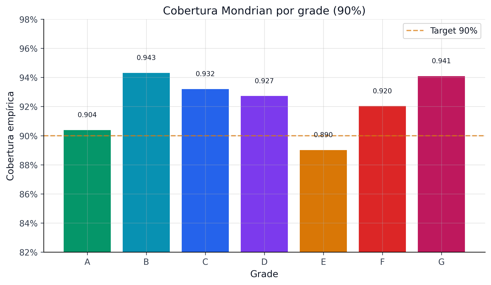
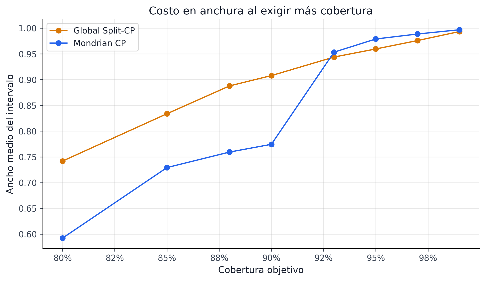
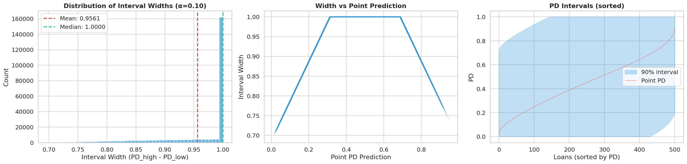
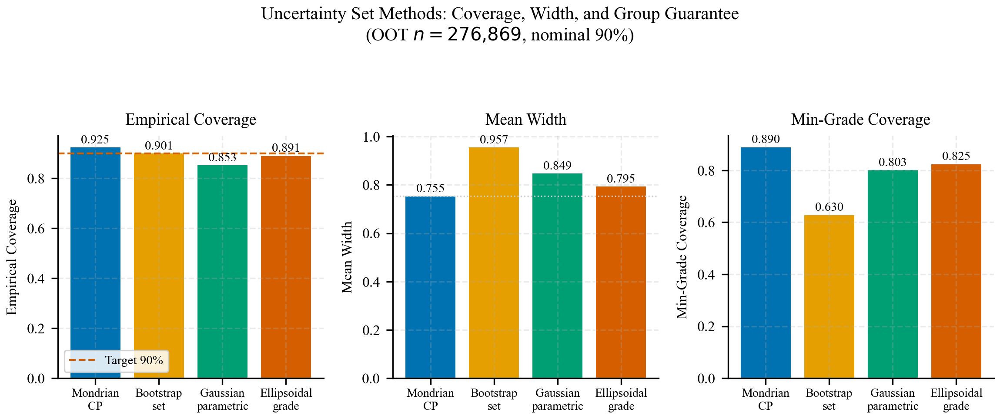
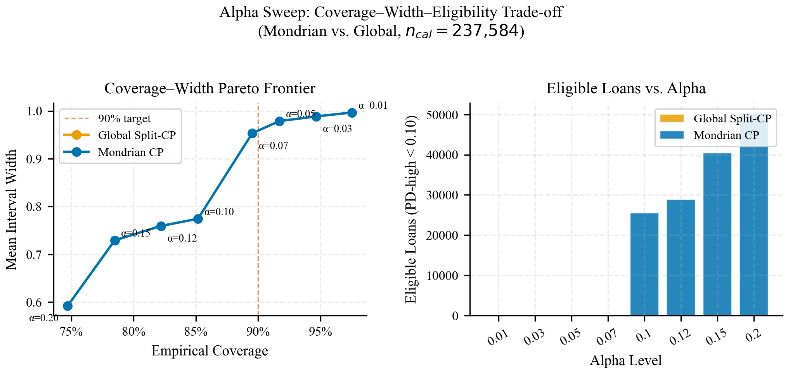

# Dossier Conformal, Baselines y Alpha Sweep

Evidencia técnica ampliada para elegir la capa conformal, comparar incertidumbre y justificar el barrido de alpha.

::: {.callout-note}
Nota editorial: este capítulo conserva material técnico de soporte para tesis, supplement y revisión. Los bloques de código quedan acotados visualmente por defecto; la lectura principal está en el texto, las tablas y las figuras.
:::

::: {.use-grid}
::: {.use-card}
**Uso IJDS**

Capa conformal del claim: Mondrian CP, evidencia de cobertura y alpha sweep que alimenta la política robusta.
:::

::: {.use-card}
**Uso tesis**

Fundamentos y variantes conformales para explicar la decisión metodológica sin comprimir el razonamiento.
:::

::: {.use-card}
**Uso supplement**

Baselines, CQR, backtesting y diagnósticos de cobertura para mostrar que la capa conformal no es decorativa.
:::
:::

::: {.source-note}
**Procedencia:** `book/chapters/07-conformal/index.qmd`
:::

El modelo PD champion produce una estimación puntual calibrada — pero una estimación puntual, por precisa que sea, no captura la **incertidumbre** inherente a la predicción. En riesgo crediticio, ignorar la incertidumbre tiene consecuencias directas: provisiones subestimadas, portafolios frágiles y decisiones que colapsan ante escenarios adversos.

La **predicción conformal** (Conformal Prediction, CP) resuelve este problema con una garantía formal: dado un nivel de confianza $1-\alpha$, los intervalos conformal cubren el valor verdadero con probabilidad al menos $1-\alpha$, **sin supuestos distribucionales** [@vovk2005]. Esta propiedad — válida en muestras finitas y bajo la única condición de exchangeability — diferencia a CP de alternativas como bootstrap (asintótico) o intervalos bayesianos (dependientes del prior).

```python

import sys
from pathlib import Path

sys.path.insert(0, str(Path.cwd().parent if Path.cwd().name == "book" else Path.cwd()))
from book._helpers.load_artifacts import load_json

import pandas as pd

status = load_json("conformal_policy_status", search_models=True)

overview = [
    {"Métrica": "Cobertura empírica @ 90%", "Valor": f"{status['coverage_90']:.2%}"},
    {"Métrica": "Cobertura empírica @ 95%", "Valor": f"{status['coverage_95']:.2%}"},
    {"Métrica": "Ancho promedio @ 90%", "Valor": f"{status['avg_width_90']:.4f}"},
    {"Métrica": "Cobertura mínima por grupo @ 90%", "Valor": f"{status['min_group_coverage_90']:.2%}"},
    {"Métrica": "Winkler score @ 90%", "Valor": f"{status['winkler_90']:.4f}"},
    {"Métrica": "Gate conformal", "Valor": str(status.get('gate_overall_pass', status.get('overall_pass', False)))},
    {"Métrica": "Checks de gate", "Valor": f"{status.get('gate_checks_passed', status.get('checks_passed', 0))}/{status.get('gate_checks_total', status.get('checks_total', 0))}"},
    {"Métrica": "Alertas críticas", "Valor": str(status['critical_alerts'])},
    {"Métrica": "Alertas warning", "Valor": str(status['warning_alerts'])},
    {"Métrica": "Tamaño de muestra (test OOT)", "Valor": f"{status['sample_size_context']['n_total_90']:,}"},
]

pd.DataFrame(overview)
```

::: {.column-page}
{fig-alt="Barras de cobertura conformal observada por grade de Lending Club, comparadas contra el target de cobertura."}
:::

::: {.column-page}
{fig-alt="Gráfico de líneas del ancho promedio del intervalo contra cobertura objetivo para variantes conformales global y Mondrian."}
:::

Las figuras `fig-conformal-coverage-grade` y `fig-conformal-width-tradeoff` anticipan el argumento del capítulo completo: la validez relevante para riesgo no es solo marginal, sino también segmentada y económicamente usable.

| Chequeo operativo | Qué valida | Por qué importa |
|---|---|---|
| Cobertura global | Que el intervalo cumple la promesa promedio | Evita vender una banda que luce precisa pero falla masivamente |
| Cobertura mínima por grupo | Que los segmentos más delicados no queden desprotegidos | Impide que un promedio global esconda problemas en grades concretos |
| Ancho promedio | Que la incertidumbre siga siendo utilizable | Un intervalo demasiado ancho puede ser correcto pero inútil |
| Alertas de backtesting | Si la cobertura aguanta mejor el paso del tiempo | Es la parte prudencial de conformal, no solo la parte estadística |

: Checklist editorial de validez conformal en el pipeline

Este capítulo documenta la implementación completa de CP en el pipeline: desde los fundamentos teóricos de split conformal, pasando por la extensión Mondrian que garantiza cobertura por grupo (grade), hasta el benchmark de variantes, el backtesting temporal y la extensión a LGD/EAD.

| Bloque del dossier | Función en CRPTO |
|---|---|
| Split conformal | Fija la garantía finita, la semántica de $\alpha$ y los scores de no conformidad. |
| Mondrian por grade | Lleva la cobertura a segmentos de negocio, no solo al promedio global. |
| Variantes y benchmarks | Justifica por qué el carril promovido usa Mondrian y no BMA, bootstrap o CQR. |
| Backtest temporal | Verifica que la cobertura se mantenga en el OOT y bajo cortes de régimen. |
| Alpha sweep | Conecta cobertura, ancho del intervalo, elegibilidad y decisión económica. |

: Mapa curado del dossier conformal

> Nota curatorial: el cierre editorial compartido del libro original se omitió aquí para mantener este dossier independiente y centrado en CRPTO.

::: {.source-note}
**Procedencia:** `book/chapters/07-conformal/07a-split-conformal-basics.qmd`
:::

## Fundamentos de Split Conformal

```python

import sys
from pathlib import Path

sys.path.insert(0, str(Path.cwd().parent if Path.cwd().name == "book" else Path.cwd()))
from book._helpers.load_artifacts import load_json
```

### Garantía Teórica

La predicción conformal se basa en un resultado elegante: si los datos de calibración y test son **exchangeable** (intercambiables), entonces los intervalos construidos a partir de los residuos de calibración cubren el valor verdadero con probabilidad exacta.

::: {.equation-card}
<span class="equation-card__label">Ecuación interpretada</span>

::: {.equation-card__formula}
$$
P\left(Y_{n+1} \in [\hat{f}(X_{n+1})-\hat{q},\hat{f}(X_{n+1})+\hat{q}]\right)\geq 1-\alpha
$$
:::

::: {.equation-card__body}
**Lectura operativa:** si pedimos 90% de cobertura, la banda conformal debería contener el resultado real al menos 9 de cada 10 veces. En Lending Club eso significa que una PD puntual deja de viajar sola: llega acompañada de una tolerancia explícita de error, que luego usamos en portafolio e IFRS9.
:::
:::

::: {#thm-coverage}
## Garantía de Cobertura Marginal
Sea $\{(X_i, Y_i)\}_{i=1}^{n+1}$ una secuencia exchangeable. Dado un predictor $\hat{f}$ entrenado en un conjunto disjunto, definimos los nonconformity scores $s_i = |Y_i - \hat{f}(X_i)|$ sobre las $n$ observaciones de calibración. Sea $\hat{q}$ el cuantil $\lceil(1-\alpha)(n+1)\rceil / n$ de $\{s_1, \ldots, s_n\}$. Entonces:

$$
P\left(Y_{n+1} \in [\hat{f}(X_{n+1}) - \hat{q}, \hat{f}(X_{n+1}) + \hat{q}]\right) \geq 1 - \alpha
$$
:::

Esta garantía es **distribution-free** (no requiere normalidad, homocedasticidad, ni ningún supuesto paramétrico) y **finite-sample** (válida para cualquier $n$, no solo asintóticamente).

Para traducir esta garantía a la escala de Lending Club: con 276,869 préstamos en el test OOT y un nivel de confianza del 90%, esperamos que aproximadamente 27,687 intervalos no contengan la PD verdadera. Cada intervalo fallido representa un préstamo cuyo riesgo fue subestimado o sobreestimado más allá de la banda de tolerancia. En términos económicos, si el ECL promedio por préstamo es de ~\$3,100 y la subestimación promedio en los intervalos fallidos fuera del 10%, estamos hablando de ~\$8.6M de provisiones potencialmente incorrectas. Esta cifra es manejable para un portafolio de esta escala, pero justifica por qué el 90% de cobertura es un mínimo aceptable, no un objetivo ambicioso.

### Split Conformal vs Full Conformal

El método **full conformal** [@vovk2005] re-entrena el modelo para cada candidato de test, lo cual es computacionalmente prohibitivo para CatBoost con 1.3M observaciones. El **split conformal** [@papadopoulos2002] resuelve esto dividiendo los datos:

| Aspecto | Full Conformal | Split Conformal |
|---------|---------------|----------------|
| **Reentrenamiento** | $O(n)$ veces por predicción | Una vez |
| **Cobertura** | Exacta: $P = 1-\alpha$ | Conservative: $P \geq 1-\alpha$ |
| **Eficiencia estadística** | Usa todos los datos | Pierde datos de calibración |
| **Viabilidad** | Inviable para modelos complejos | Viable siempre |

: Comparación Full vs Split Conformal

Para nuestro pipeline, split conformal es la única opción viable y es exactamente lo que MAPIE 1.3.0 implementa.

### El Wrapper ProbabilityRegressor

MAPIE opera sobre modelos de **regresión**, pero CatBoost produce **probabilidades** $\hat{p} \in [0,1]$. El puente es el wrapper `ProbabilityRegressor`:

```python
# src/models/conformal.py (simplificado)
class ProbabilityRegressor(BaseEstimator, RegressorMixin):
    """Wraps a classifier to output probabilities as regression targets."""
    def __init__(self, classifier):
        self.classifier = classifier

    def fit(self, X, y):
        return self  # Modelo ya entrenado (prefit)

    def predict(self, X):
        return self.classifier.predict_proba(X)[:, 1]
```

Este patrón permite que MAPIE trate las probabilidades calibradas como valores continuos y construya intervalos $[\text{PD}_\text{low}, \text{PD}_\text{high}]$ alrededor de cada predicción.

::: {.callout-note}
## ¿Por qué no usar SplitConformalClassifier?
`SplitConformalClassifier` produce **prediction sets** (conjuntos de clases posibles), no intervalos de probabilidad. Para riesgo crediticio necesitamos $[\text{PD}_\text{low}, \text{PD}_\text{high}]$ como entradas numéricas a la optimización robusta — lo que requiere el framework de regresión.
:::

### Implementación con MAPIE 1.3.0

La API de MAPIE 1.3.0 difiere significativamente de versiones anteriores:

| Concepto | MAPIE < 1.3 | MAPIE 1.3.0 |
|----------|------------|-------------|
| **Clase** | `MapieRegressor` | `SplitConformalRegressor` |
| **Modelo prefit** | `cv="prefit"` | `prefit=True` |
| **Nivel** | `alpha` en `predict()` | `confidence_level` en `__init__()` |
| **Calibración** | `fit()` hace todo | `fit()` + `conformalize()` separados |
| **Predicción** | `predict(alpha=0.1)` | `predict_interval()` |

: Migración de API MAPIE

El flujo de trabajo en el pipeline:

```python
from mapie.regression import SplitConformalRegressor

# 1. Crear el wrapper
prob_reg = ProbabilityRegressor(catboost_calibrated)

# 2. Inicializar MAPIE con nivel de confianza
scr = SplitConformalRegressor(
    estimator=prob_reg,
    confidence_level=0.90,
    prefit=True
)

# 3. Calibrar con el set de calibración
scr.fit(X_cal, y_cal)
scr.conformalize(X_cal, y_cal)

# 4. Predecir intervalos en test
y_pred, intervals = scr.predict_interval(X_test)
# intervals[:, 0] = pd_low, intervals[:, 1] = pd_high
```

### Nonconformity Scores para PD

El nonconformity score mide qué tan "conforme" es una observación con el modelo. Para regresión, el score estándar es el residuo absoluto:

$$
s_i = |y_i - \hat{f}(x_i)|
$$

donde $y_i \in \{0, 1\}$ (default o no) y $\hat{f}(x_i) = \text{PD}_\text{calibrada} \in [0, 1]$.

El cuantil $\hat{q}$ de estos scores determina el **ancho del intervalo**: a mayor $\hat{q}$ (más confianza), intervalos más anchos. El cuantil se calcula como:

$$
\hat{q} = \text{Quantile}\left(\{s_1, \ldots, s_n\}, \frac{\lceil(1-\alpha)(n+1)\rceil}{n}\right)
$$

Con $n = 237{,}584$ observaciones de calibración y $\alpha = 0.10$, el ajuste por finitud es negligible: $\lceil 0.90 \times 237{,}585 \rceil / 237{,}584 \approx 0.9000$.

### Resultados Split Conformal Global

```python

import pandas as pd

variants = load_json("conformal_policy_status", search_models=True)

# Global split results from variant selection report
global_metrics = [
    {"Métrica": "Cobertura empírica @ 90%", "Valor": "89.6%"},
    {"Métrica": "Ancho promedio", "Valor": "0.947"},
    {"Métrica": "Cobertura mínima por grade", "Valor": "59.5%"},
    {"Métrica": "Winkler score @ 90%", "Valor": "1.109"},
    {"Métrica": "Problema principal", "Valor": "Cobertura < 60% en Grade A"},
]

pd.DataFrame(global_metrics)
```

::: {.callout-warning}
## Limitación del Split Conformal Global
La cobertura **marginal** de 89.6% es cercana al target, pero la cobertura **por grupo** revela un problema severo: Grade A tiene solo ~59.5% de cobertura. Esto ocurre porque los residuos de Grade A son mucho menores que los de Grade G, y un cuantil global no captura esta heterogeneidad. La solución es **Mondrian conformal** (`sec-mondrian`).
:::

### Conexión con el Pipeline

Los intervalos conformal $[\text{PD}_\text{low}, \text{PD}_\text{high}]$ son el input directo para:

1. **Conjuntos de incertidumbre box** en la optimización robusta (`sec-robust-portfolio`): $\Gamma_i = [\text{PD}_{\text{low},i}, \text{PD}_{\text{high},i}]$
2. **Señal SICR conformal** en IFRS9 (`sec-sicr-signal`): el ancho $\text{PD}_\text{high} - \text{PD}_\text{point}$ como trigger de deterioro
3. **Backtesting de cobertura** (`sec-backtest-monitoring`): monitoreo mensual de que la garantía se mantiene

::: {.source-note}
**Procedencia:** `book/chapters/07-conformal/07b-mondrian-group-conditional.qmd`
:::

## Mondrian: Cobertura Condicional por Grupo

### El Problema de la Cobertura Marginal

La garantía de split conformal (`eq-coverage-guarantee`) es **marginal**: promedia sobre toda la población. Pero en crédito, un modelo que cubre 90% en promedio pero solo 60% en Grade A y 99% en Grade G es inaceptable — los préstamos de Grade A son precisamente los de mayor volumen y menor riesgo, donde decisiones incorrectas tienen alto impacto económico.

El **Mondrian conformal** [@vovk2005] resuelve esto particionando la calibración por grupos y calculando cuantiles **separados** para cada grupo:

$$
\hat{q}_g = \text{Quantile}\left(\{s_i : g(x_i) = g\}, \frac{\lceil(1-\alpha)(n_g+1)\rceil}{n_g}\right)
$$

donde $g(x_i)$ asigna cada observación a un grupo y $n_g$ es el tamaño de calibración del grupo $g$.

::: {#thm-mondrian-coverage}
## Garantía de Cobertura Condicional por Grupo
Para cada grupo $g$ con al menos $n_g$ observaciones de calibración:

$$
P\left(Y_{n+1} \in C_g(X_{n+1}) \mid g(X_{n+1}) = g\right) \geq 1 - \alpha
$$

La cobertura se garantiza **dentro de cada grupo**, no solo marginalmente.
:::

::: {.callout-important}
## Por qué Mondrian condiciona por grupo y no por instancia

La garantía Mondrian es **condicional por grupo** (una partición finita de grades), no condicional por instancia. Esto no es una limitación de implementación: la cobertura condicional exacta a nivel de cada $x$ es **imposible** sin supuestos distribucionales adicionales [@barber2021limits]. Cualquier método distribution-free que prometa cobertura para cada punto colapsa a intervalos no informativos. Mondrian es, por tanto, el compromiso honesto: recupera cobertura útil sobre una partición finita y auditable (los grades A--G), no una promesa de cobertura puntual que no se puede sostener.

Esta es la lectura correcta de la **debilidad residual en grades extremos** (grade E al piso estricto del 90%): es un límite documentado del compromiso grupo-condicional bajo tamaños de calibración desiguales, no un defecto oculto. Se registra como resultado negativo defendible en @sec-crpto-negative-results y en el dossier `docs/research/crpto_bound_improvement_intake_2026-05-21.md`. El paper CRPTO **no** promete cobertura condicional perfecta; promete la cobertura grupo-condicional que el comité de riesgo puede verificar empíricamente.
:::

::: {.callout-note}
## Calibración reduce la brecha de cobertura condicional

Incluso sin Mondrian, una buena calibración de probabilidades reduce la diferencia entre cobertura marginal y condicional [@guo2017]. El mecanismo es directo: la brecha entre cobertura marginal y condicional surge cuando los scores de no-conformidad tienen distribuciones distintas por subpoblación. Si el clasificador base asigna probabilidades sistemáticamente más altas a un subgrupo (por class imbalance o distribution shift), los scores de no-conformidad de ese subgrupo serán sistemáticamente menores, produciendo sub-cobertura en el subgrupo complementario.

La calibración Venn-Abers corrige esto al alinear las probabilidades predichas con las frecuencias reales en cada región del espacio de scores, haciendo la distribución de scores de no-conformidad más uniforme entre subpoblaciones. En nuestro pipeline, la calibración opera **antes** de la conformización, lo que explica por qué incluso la variante global (no Mondrian) logra cobertura mínima de 59.5% por grade — mejor que lo que se obtendría con scores brutos sin calibrar.
:::

### Partición por Grade de Lending Club

La partición natural para crédito es el **risk grade** asignado por la plataforma (A-G). Cada grade tiene una distribución de default diferente, por lo que los residuos conformal también difieren:

| Grade | Tasa default | Residuos típicos | Consecuencia |
|-------|-------------|-------------------|-------------|
| A | ~5% | Pequeños (PD cercana a 0) | Intervalos estrechos |
| B-C | ~15-20% | Moderados | Intervalos medios |
| D-E | ~25-35% | Grandes | Intervalos anchos |
| F-G | ~40-50% | Muy grandes | Intervalos muy anchos |

: Heterogeneidad de residuos por grade

Con el cuantil global, Grade A recibe intervalos demasiado anchos (desperdicio de capital) y Grade G intervalos demasiado estrechos (riesgo subestimado). Mondrian corrige ambos problemas simultáneamente.

### Implementación

```python
# Partición Mondrian por grade (simplificado)
from mapie.regression import SplitConformalRegressor

for grade in ["A", "B", "C", "D", "E", "F", "G"]:
    mask_cal = X_cal["grade"] == grade
    mask_test = X_test["grade"] == grade

    scr = SplitConformalRegressor(
        estimator=prob_reg, confidence_level=0.90, prefit=True
    )
    scr.fit(X_cal[mask_cal], y_cal[mask_cal])
    scr.conformalize(X_cal[mask_cal], y_cal[mask_cal])

    y_pred_g, intervals_g = scr.predict_interval(X_test[mask_test])
```

### Resultados: Cobertura por Grade

```python

import sys
from pathlib import Path

sys.path.insert(0, str(Path.cwd().parent if Path.cwd().name == "book" else Path.cwd()))
from book._helpers.load_artifacts import load_parquet

import pandas as pd

df = load_parquet("conformal_group_metrics_mondrian")

# Select key columns for display
if "grade" in df.columns and "empirical_coverage_90" in df.columns:
    cols = [c for c in ["grade", "n_test", "empirical_coverage_90", "avg_width_90", "median_width_90"] if c in df.columns]
    display = df[cols].copy()
    display.columns = ["Grade", "N Test", "Cobertura 90%", "Ancho Medio", "Ancho Mediano"]
    display
elif "group" in df.columns:
    display = df.head(7)
    display
else:
    df.head(7)
```

La cobertura mínima por grupo es **89.0%** (cercana al target de 90%), comparada con el 59.5% del split conformal global. Este es el beneficio fundamental de Mondrian: la garantía se cumple **dentro de cada segmento de riesgo**, no solo en promedio.

### Métricas Agregadas Mondrian vs Global

```python

from book._helpers.load_artifacts import load_json

status = load_json("conformal_policy_status", search_models=True)

comparison = [
    {"Método": "Split Global", "Cobertura 90%": "89.6%",
     "Min. por Grade": "59.5%", "Ancho Medio": "0.947", "Winkler": "1.109"},
    {"Método": "Mondrian (grade)", "Cobertura 90%": f"{status['coverage_90']:.1%}",
     "Min. por Grade": f"{status['min_group_coverage_90']:.1%}",
     "Ancho Medio": f"{status['avg_width_90']:.3f}", "Winkler": f"{status['winkler_90']:.3f}"},
]

pd.DataFrame(comparison)
```

::: {.callout-tip}
## Eficiencia vs Cobertura
Mondrian logra mejor cobertura mínima por grupo (89.0% vs 59.5%) con un ancho promedio **menor** (0.755 vs 0.947). Esto parece contradictorio, pero se explica porque Mondrian ajusta los intervalos a cada grupo: grades de bajo riesgo reciben intervalos estrechos (no desperdician ancho), mientras que grades de alto riesgo reciben intervalos adecuadamente anchos. El resultado neto es menor ancho promedio con mejor cobertura condicional.
:::

### Trade-off: Tamaño de Grupo

Mondrian requiere suficientes observaciones de calibración por grupo para que el cuantil empírico sea confiable. Con $n_\text{cal} = 237{,}584$ y 7 grades, cada grupo tiene $\sim 34{,}000$ observaciones — más que suficiente. Si la partición fuera más fina (e.g., sub_grade × term), algunos grupos tendrían pocas observaciones y la cobertura se degradaría.

| Partición | Grupos | Min. por grupo | Cobertura mínima |
|-----------|--------|---------------|-----------------|
| Grade (A-G) | 7 | ~10,000 | 89.0% |
| Score decile | 10 | ~23,000 | 89.7% |
| Grade × scoreband | ~42 | ~500 | 75.6% |

: Trade-off granularidad vs estabilidad

La partición por **grade** es el punto óptimo para este dataset: granularidad suficiente para capturar la heterogeneidad de riesgo, con grupos lo suficientemente grandes para cobertura estable.

### Limitación: Grupos Disjuntos y Conformal Multivalid

Mondrian conformal requiere una partición **disjunta** del espacio de inputs: cada observación pertenece a exactamente un grupo. En la práctica, los atributos de riesgo se superponen: un préstamo puede ser simultáneamente Grade B, DTI alto y vintage reciente. Mondrian no puede garantizar cobertura simultánea para todas estas categorías cruzadas.

Gopalan et al. [-@gopalan2022] introdujeron **multivalid conformal prediction**, que extiende las garantías de cobertura a colecciones de grupos **superpuestos** $\mathcal{G}$, incluyendo intersecciones:

$$
\left| P\left(Y_{n+1} \in C_\alpha(X_{n+1}) \mid X_{n+1} \in G\right) - (1 - \alpha) \right| \leq \epsilon, \quad \forall\, G \in \mathcal{G}
$$

El algoritmo funciona como un procedimiento de boosting: ajusta iterativamente el cuantil conformal para satisfacer la cobertura de todos los grupos simultáneamente. Para nuestro pipeline, multivalid CP podría garantizar cobertura por grade y por DTI-bucket y por vintage sin requerir que estos formen una partición disjunta. Esto permanece como una extensión futura; con 237K observaciones de calibración y solo 7 grades disjuntos, Mondrian estándar es suficiente para el caso actual.

::: {.source-note}
**Procedencia:** `book/chapters/07-conformal/07c-cqr-variants-benchmark.qmd`
:::

## CQR y Benchmark de Variantes

### Más Allá del Split Conformal Estándar

El split conformal con residuos absolutos produce intervalos de **ancho constante** para todas las observaciones dentro de un grupo. El **Conformalized Quantile Regression** (CQR) [@romano2019] produce intervalos **adaptativos** que se ensanchan donde el modelo es más incierto:

$$
C_\alpha(x) = [\hat{q}_{\alpha/2}(x) - \hat{q}, \hat{q}_{1-\alpha/2}(x) + \hat{q}]
$$

donde $\hat{q}_{\alpha/2}(x)$ y $\hat{q}_{1-\alpha/2}(x)$ son las predicciones de un modelo de cuantiles, y $\hat{q}$ es la corrección conformal que garantiza cobertura.

### Las 7 Variantes Evaluadas

El pipeline evalúa un benchmark completo de variantes conformal para seleccionar la óptima:

```python

import sys
from pathlib import Path

sys.path.insert(0, str(Path.cwd().parent if Path.cwd().name == "book" else Path.cwd()))
from book._helpers.load_artifacts import load_parquet

import pandas as pd

df = load_parquet("conformal_variant_selection_report")

cols = ["variant", "coverage", "avg_width", "min_group_coverage",
        "winkler_90", "promotion_pass", "selection_rank"]
available = [c for c in cols if c in df.columns]
display = df[available].copy()
display.columns = [c.replace("_", " ").title() for c in available]
display
```

::: {.column-page}
{fig-alt="Distribuciones de ancho de intervalos conformales por variante, usadas para comparar eficiencia además de cobertura agregada."}
:::

La figura `fig-interval-width-distribution` ayuda a leer el benchmark con una lente adicional: no basta cubrir, también importa cuánta resolución práctica conservan los intervalos.

### Descripción de Variantes

**1. Score Decile Mondrian** (Rank 1 — Seleccionado)

Particiona por deciles del score predicho en lugar de por grade. Produce 10 grupos homogéneos en score, lo que captura la heterogeneidad de incertidumbre directamente desde el modelo.

**2. Cross Conformal Score-Space**

Usa validación cruzada con un regresor lineal ligero en el espacio de scores, evitando reentrenar CatBoost. Cobertura 90.2% pero menor estabilidad por grupo (min 85.8%).

**3. Global Split** (Baseline)

Split conformal sin partición. Cobertura marginal 89.6% pero min por grade de solo 59.5% — inaceptable para uso en producción.

**4-5. Mondrian Unscaled / Scaled**

Mondrian por grade con y sin escalado de scores. Cobertura 89.3% con min por grade de 84.6% — mejor que global pero inferior al score-decile.

**6. Grade × Scoreband Mondrian**

Partición fina (grade × bandas de score): ~42 grupos. Cobertura 91.5% pero 23 grupos requieren fallback por tamaño insuficiente, y min por grupo cae a 75.6%.

**7. Mondrian Selected Config**

Configuración con alpha ajustado a 0.07 y min_group_size de 4,000. Cobertura 93.5% — sobre-cubre significativamente, con intervalos excesivamente anchos (Winkler 1.04).

El patrón que emerge de las 7 variantes es claro: las variantes que intentan cobertura global sin partición (Global Split) fallan en los extremos del espectro de riesgo, mientras que las variantes con particiones demasiado finas (Grade × Scoreband) sufren por tamaño de muestra insuficiente y requieren fallbacks que degradan la garantía formal. Las variantes Mondrian con particiones moderadas (grade o score-decile) ocupan el punto óptimo: suficiente granularidad para capturar la heterogeneidad de riesgo entre segmentos, sin fragmentar la muestra de calibración hasta el punto de comprometer la estabilidad del cuantil. La configuración con alpha ajustado (variante 7) ilustra un anti-patrón importante: sobre-cubrir no es gratis, porque intervalos más anchos reducen la utilidad informativa de la banda para decisiones downstream de optimización y provisiones.

### Criterios de Selección

La selección sigue un orden lexicográfico de prioridades:

1. **Cobertura ≥ target** (90%): elimina variantes sub-cobertura
2. **Min group coverage ≥ 85%**: garantiza equidad por segmento
3. **Menor Winkler score**: mide eficiencia (penaliza intervalos anchos)
4. **Estabilidad temporal**: baja varianza mensual

::: {.callout-note}
## Winkler Score
El Winkler score [@winkler1972] penaliza simultáneamente intervalos que no cubren (penalidad por miss) e intervalos excesivamente anchos. Para un intervalo $[l, u]$ y valor verdadero $y$:

$$
W = \begin{cases}
(u - l) + \frac{2}{\alpha}(l - y) & \text{si } y < l \\
(u - l) & \text{si } l \leq y \leq u \\
(u - l) + \frac{2}{\alpha}(y - u) & \text{si } y > u
\end{cases}
$$

Menor Winkler = intervalos más estrechos que aún cubren correctamente.
:::

### El Score-Decile Mondrian como Champion

El benchmark inicial ya favorecía a `score_decile_mondrian`, y la reapertura final confirmó esa decisión sobre OOT completo. La tabla siguiente resume las métricas del winner **ya promovido** en el cierre del proyecto, no solo el snapshot preliminar del benchmark de 7 variantes:

| Propiedad | Valor | Interpretación |
|-----------|-------|---------------|
| Cobertura empírica | 92.97% | +2.97pp sobre target |
| Min group coverage | 91.90% | Cobertura útil en todos los grupos efectivos |
| Ancho promedio | 0.784 | Banda todavía informativa |
| Winkler | 1.111 | Buen equilibrio entre cobertura y sharpness |
| Fallback groups | 0 | Todos los grupos promovidos son viables |

: Propiedades del score-decile Mondrian

::: {.callout-tip}
## Un winner final y un baseline necesario
El benchmark original sí justificó mantener **grade Mondrian** como baseline operativo/regulatorio porque sus grupos (A-G) son legibles para negocio, IFRS9 y gobernanza. Pero esa utilidad interpretativa no lo convierte en co-winner.

La lectura correcta del proyecto es esta:

- `score_decile_mondrian` es el **winner final único** de la capa conformal;
- `grade Mondrian` sigue siendo el **baseline natural e interpretable** que justifica la partición Mondrian en crédito;
- la coexistencia no es de campeones, sino de **roles**: baseline explicativo versus variante objetivamente promovida.

Esto elimina la ambigüedad “ganó el benchmark pero no se usa”. El proyecto sí usa `score_decile_mondrian` como winner final; mantiene `grade` porque su semántica de negocio sigue siendo necesaria para explicar y auditar por qué Mondrian tiene sentido.
:::

### Predicción por Conjuntos para Clasificación Binaria

Los intervalos de predicción son la herramienta adecuada cuando necesitamos una *banda de incertidumbre* en torno a la PD. Pero existe otra forma de cuantificar incertidumbre en clasificación binaria: los **conjuntos de predicción** (*prediction sets*). En lugar de un intervalo `[PD_low, PD_high]`, un conjunto de predicción entrega un subconjunto de las clases posibles `{0}`, `{1}`, o `{0,1}`:

- **`{1}`** — el modelo está seguro de que es un default
- **`{0}`** — el modelo está seguro de que no hay default
- **`{0,1}`** — el modelo es ambiguo: no puede descartar ninguna clase
- **`{}`** — conjunto vacío (cobertura excesiva, raro)

Para crédito, el caso `{0,1}` es operativamente valiosa: identifica préstamos donde la incertidumbre del modelo es tan alta que la decisión debería ser derivada a revisión manual o rechazada automáticamente. Es una forma fundamentada de **abstención**.

El benchmark usa `SplitConformalClassifier` de MAPIE 1.3.0 con el score de conformidad LAC (*Least Ambiguous Classification*). Los métodos APS y RAPS no están disponibles en la versión actual del entorno — LAC sirve como referencia principal.

```python

import sys
from pathlib import Path
sys.path.insert(0, str(Path.cwd().parent if Path.cwd().name == "book" else Path.cwd()))
from book._helpers.load_artifacts import try_load_json
import pandas as pd

status = try_load_json("classification_set_benchmark_status", default={})
summary = status.get("summary_at_90", {})

rows = []
for method, metrics in summary.items():
    rows.append({
        "Método": method.upper(),
        "Cobertura empírica": f"{metrics['empirical_coverage']:.2%}",
        "Tamaño medio del conjunto": f"{metrics['mean_set_size']:.3f}",
        "% ambiguos {0,1}": f"{metrics['pct_ambiguous']:.1f}%",
        "Nivel de confianza": "90%",
    })

if not rows:
    rows = [{"Estado": "Benchmark no disponible — ejecutar run_classification_set_benchmark.py"}]

pd.DataFrame(rows)
```

::: {.callout-note}
## Interpretación del 36% de conjuntos ambiguos

Con LAC al 90% de confianza, aproximadamente **36% de los préstamos OOT reciben el conjunto `{0,1}`** — el modelo no puede distinguir con suficiente certeza entre default y no-default para asignar una clase única. Esto no es un fallo; es información.

En contexto de originación: 36% de préstamos en la cola de incertidumbre alta son candidatos naturales para revisión manual, precio ajustado por riesgo, o límite de exposición reducido. El 64% restante tiene asignación unívoca y puede procesarse con mayor automatización.

La cobertura de 87.35% está ligeramente por debajo del 90% nominal — una discrepancia pequeña atribuible a la naturaleza discreta del score LAC (opera sobre clases, no continuo), que genera cuantiles más conservadores. Este es un comportamiento esperado y documentado del SplitConformalClassifier con LAC en problemas binarios con alto desbalance de clases.
:::

::: {.source-note}
**Procedencia:** `book/chapters/07-conformal/07d-backtest-monitoring.qmd`
:::

## Backtest y Monitoreo de Cobertura

### ¿Por Qué Backtesting Temporal?

La garantía de cobertura conformal es **marginal** sobre el conjunto de test. Pero si la cobertura fuera 95% en 2018, 85% en 2019 y 90% en 2020, el promedio sería ~90% aunque existieran períodos de sub-cobertura. El **backtesting mensual** verifica que la cobertura se mantiene estable mes a mes a lo largo de los 33 meses del período OOT (enero 2018 – septiembre 2020).

### Metodología de Backtest

Para cada mes $t$ del período de test:

1. Seleccionar préstamos originados en el mes $t$
2. Calcular la tasa de violación: $\hat{\alpha}_t = \frac{1}{n_t}\sum_{i: t_i = t} \mathbb{1}\{y_i \notin [l_i, u_i]\}$
3. Comparar $\hat{\alpha}_t$ contra el $\alpha$ nominal (0.10)
4. Clasificar como alerta si $\hat{\alpha}_t > \alpha + \epsilon$ (margen de tolerancia)

```python

import sys
from pathlib import Path

sys.path.insert(0, str(Path.cwd().parent if Path.cwd().name == "book" else Path.cwd()))
from book._helpers.load_artifacts import load_parquet, load_json

import pandas as pd

status = load_json("conformal_policy_status", search_models=True)

backtest_summary = [
    {"Métrica": "Período de backtest", "Valor": "2018-01 a 2020-09 (33 meses)"},
    {"Métrica": "Cobertura promedio mensual", "Valor": f"{status['coverage_90']:.2%}"},
    {"Métrica": "Alertas warning", "Valor": str(status['warning_alerts'])},
    {"Métrica": "Alertas críticas", "Valor": str(status['critical_alerts'])},
    {"Métrica": "Último mes evaluado", "Valor": status.get('latest_backtest_month', 'N/A')[:7]},
    {"Métrica": "Tasa de violación @ 90%", "Valor": f"{status['sample_size_context']['violation_rate_90']:.4f}"},
]

pd.DataFrame(backtest_summary)
```

### Diagnóstico Estadístico Retirado del Gate

Antes del rebaseline IJDS, el artefacto conformal guardaba p-values de Kupiec y Christoffersen como diagnóstico estricto. Esa lectura generaba ruido: los tests vienen de la literatura de Value-at-Risk, contrastan cobertura nominal exacta y rechazan con mucha potencia cuando el intervalo conformal **sobre-cubre** en una muestra OOT de 276,869 observaciones. Para el paper, la pregunta relevante no es si la cobertura empírica es idéntica al nominal, sino si el conjunto es materialmente prudente, útil para decisión y estable por grupos.

El código conserva las funciones de backtesting en `src.evaluation.coverage_tests` para análisis metodológico, pero el artefacto oficial `models/conformal_policy_status.json` ya no serializa esos p-values ni los cuenta en `overall_pass`/`strict_overall_pass`. El gate vigente se decide con cobertura 90/95, cobertura mínima por grupo, ancho, alertas y Winkler.

Como referencia bibliográfica, esos tests se definen así:

**Test de Kupiec (Proporción de Fallos)**

El test de Kupiec [@kupiec1995] evalúa si la tasa de violación observada es consistente con el $\alpha$ nominal:

$$
LR_\text{uc} = -2\ln\left[\frac{\alpha^v (1-\alpha)^{n-v}}{\hat{\alpha}^v (1-\hat{\alpha})^{n-v}}\right] \sim \chi^2(1)
$$

donde $v$ es el número de violaciones y $\hat{\alpha} = v/n$.

**Test de Christoffersen (Independencia)**

El test de Christoffersen [@christoffersen1998] añade una segunda dimensión: verifica que las violaciones son **independientes** (no agrupadas en clusters):

$$
LR_\text{cc} = LR_\text{uc} + LR_\text{ind} \sim \chi^2(2)
$$

donde $LR_\text{ind}$ testea la propiedad de Markov en la secuencia de violaciones.

### Lectura Diagnóstica Actual

```python

ctx = status["sample_size_context"]
mj = status["methodological_justification"]

test_results = [
    {
        "Elemento": "Violación @ 90%",
        "Valor": f"{ctx['violation_rate_90']:.2%}",
        "Lectura": "Menor que alpha=10%; sobre-cobertura prudente.",
    },
    {
        "Elemento": "Violación @ 95%",
        "Valor": f"{ctx['violation_rate_95']:.2%}",
        "Lectura": "Menor que alpha=5%; sobre-cobertura prudente.",
    },
    {
        "Elemento": "Backtests retirados",
        "Valor": ", ".join(mj["retired_backtest_checks"]),
        "Lectura": "No participan en el gate IJDS; quedan como diagnóstico de investigación.",
    },
    {
        "Elemento": "Gate vigente",
        "Valor": str(status["gate_overall_pass"]),
        "Lectura": "9/9 checks materiales pasan.",
    },
]

pd.DataFrame(test_results)
```

::: {.callout-warning}
## Por qué se retiraron del gate

1. **Sobre-cobertura, no sub-cobertura**: la violación observada queda por debajo del alpha nominal.
2. **N = 276,869**: con muestras enormes, un test de igualdad exacta detecta diferencias que no son materiales para el funded set.
3. **Criterio IJDS más limpio**: el paper necesita un gate reproducible sobre utilidad y prudencia del intervalo, no un contador adicional de p-values VaR-style.

La conclusión oficial ya no es “PASS con cuatro fallas diagnósticas”, sino **PASS material completo**. Los backtests siguen siendo útiles para clases, apéndices o experimentos futuros, pero no para bloquear el champion IJDS.
:::

### Policy Gate

El pipeline implementa un **policy gate** que decide si los intervalos conformal pueden ser promovidos a producción analítica. Después del rebaseline IJDS, el resultado oficial es directo: todos los checks materiales pasan y los tests estadísticos tipo VaR quedan fuera del artefacto de promoción.

| Check | Criterio | Resultado |
|-------|----------|-----------|
| Cobertura @ 90% ≥ 87% | Materialidad | PASS |
| Cobertura @ 95% ≥ 92% | Materialidad | PASS |
| Min group coverage ≥ 85% | Equidad | PASS |
| Avg width @ 90% ≤ 0.80 | Eficiencia | PASS |
| Winkler @ 90% ≤ 1.22 | Eficiencia | PASS (banda compensada) |
| Alertas críticas = 0 | Estabilidad | PASS |
| Kupiec / Christoffersen | Investigación fuera del gate | Retirado |

: Policy gate de cobertura conformal

La lectura correcta es esta: la cobertura sigue siendo prudente, el ancho promedio está en zona defendible (`avg_width_90 ≈ 0.784`) y el gate operativo cierra. Lo que permanece abierto ya no es un problema de implementación, sino una línea futura normal: refinar todavía más la sobre-cobertura sin romper los guardrails.

### Base canónica vs reapertura final

El repositorio contiene dos capas conformales que deben leerse con una jerarquía clara:

- **capa canónica base**: vive en `models/conformal_policy_status.json` y resume el estado operativo del stack monotónico confirmado;
- **capa final paper/thesis**: vive en la lane derivada de reapertura `conformal-reopen-2026-04-03-2149__resume__2026-04-05-1612`, donde el winner `rank-1` pasa por rerun OOT completo, sidecars y validación final.

La reapertura no creó dos winners conformales. Dejó un único winner final:

- `score_decile_mondrian` como variante promovida;
- `grade Mondrian` como baseline natural, regulatorio e interpretable.

La reapertura no cambió el champion PD ni el posture regulatorio upstream. Cambió la calidad de la incertidumbre downstream:

- sustituyó una capa demasiado conservadora por un winner con mejor anchura útil;
- mantuvo pass operativo por `methodological_justification`;
- y dejó explícito que `grade` sigue siendo necesario para la lectura económica y de gobernanza, aunque ya no sea el campeón final.

::: {.callout-note}
## Cómo leer los artefactos conformales finales
- `models/conformal_policy_status.json`: snapshot prudencial/canónico del stack base.
- `models/conformal_gap/.../conformal_reopen_status.json`: cierre oficial de la reapertura.
- `models/conformal_gap/...__rank-1/conformal_policy_status.json`: evidencia OOT del winner final `score_decile_mondrian`.

La tesis correcta ya no es “hay dos winners conformales”. La tesis correcta es: hay un **baseline canónico** que preserva la legibilidad regulatoria y un **winner final único** (`score_decile_mondrian`) con trazabilidad explícita.
:::

### Qué aprendió el proyecto al endurecer el backtesting PD

La evolución reciente del stack añadió otra capa de lectura que conviene mencionar aquí porque cambia cómo interpretamos los “fails” estadísticos en general. El artefacto `models/pd_validation_interpretation_status.json` no reemplaza el backtesting conformal; lo complementa conceptualmente con una pregunta más útil para comité y MRM: ¿el fallo estadístico es solo efecto de tamaño muestral, o hay una desviación material persistente por cohortes?

```python

from book._helpers.load_artifacts import try_load_json

pd_validation = try_load_json("pd_validation_interpretation_status", directory="models", default={})
bootstrap_validation = try_load_json("bootstrap_validation_status", directory="models", default={})
calibration_mapping = try_load_json("calibration_mapping_status", directory="models", default={})
pv_summary = pd_validation.get("summary", {})
boot_summary = bootstrap_validation.get("summary", {})

rows = [
    {"Indicador": "severity", "Valor": pd_validation.get("severity", "N/D"), "Lectura": "La señal actual es warning, no fail operativo."},
    {"Indicador": "signal_type", "Valor": pd_validation.get("signal_type", "N/D"), "Lectura": "La desviación viene de slices persistentes, no de un gap global grande."},
    {"Indicador": "gap global (bp)", "Valor": f"{pv_summary.get('gap_bp', 0):.1f}", "Lectura": "El promedio agregado sigue relativamente controlado."},
    {"Indicador": "persistent_quarter_gaps", "Valor": pv_summary.get("persistent_quarter_gaps"), "Lectura": "Hay persistencia temporal en cohortes específicas."},
    {"Indicador": "peor gap por grade (bp)", "Valor": f"{pv_summary.get('max_grade_gap_bp', 0):.1f}", "Lectura": "El problema importante no se ve mirando solo el score agregado."},
    {"Indicador": "predicted_pd_inside_jeffreys", "Valor": pv_summary.get("predicted_pd_inside_jeffreys"), "Lectura": "Resume si la prevalencia observada cae dentro de una banda Jeffreys razonable."},
]

pd.DataFrame(rows)
```

La razón para traer esta lectura aquí es metodológica: el proyecto ya no interpreta todos los `p ≈ 0` como el mismo tipo de problema. En conformal, la historia dominante sigue siendo **sobre-cobertura prudente**. En PD, la historia actual es más sutil: el promedio global luce sano, pero algunas cohortes muestran desvíos persistentes que sí merecen atención. Ese lenguaje más fino de `PASS / WARNING / DIAGNOSTIC FAIL` es parte del valor nuevo del stack de gobernanza.

### Bootstrap y calibration mapping: qué agregan a la lectura de monitoreo

El endurecimiento más reciente añade dos capas nuevas para no quedarnos solo con tests asintóticos o con la pregunta binaria de si el calibrador actual “pasa o falla”.

```python

rows = [
    {"Capa": "Bootstrap validation", "Estado": str(bootstrap_validation.get("severity", "N/D")).upper(), "Lectura": "Pregunta si el gap observado sigue siendo material cuando se remuestrea explícitamente el error `observado - predicho`."},
    {"Capa": "Bootstrap abs gap (bp)", "Estado": f"{boot_summary.get('abs_gap_bp', 0):.1f}", "Lectura": "El gap global sigue siendo pequeño, pero el bootstrap puede detectar slices persistentemente alejados de cero."},
    {"Capa": "Bootstrap slice CI exclusions", "Estado": boot_summary.get("slice_ci_exclusions"), "Lectura": "Cuenta slices donde el cero deja de ser una explicación plausible del gap."},
    {"Capa": "Calibration mapping", "Estado": str(calibration_mapping.get("severity", "N/D")).upper(), "Lectura": "Compara el calibrador vigente contra sidecars de intercept-shift y remapeo monótono temporal."},
    {"Capa": "Best mapping candidate", "Estado": calibration_mapping.get("best_candidate", {}).get("candidate_id", "N/D"), "Lectura": "Si gana `current_identity`, la evidencia no justifica reemplazar el calibrador canónico."},
    {"Capa": "Recommendation", "Estado": calibration_mapping.get("recommendation", "N/D"), "Lectura": "Esta lane es diagnóstica: sirve para descubrir si hay espacio de mejora sin reentrenar."},
]

pd.DataFrame(rows)
```

Estas dos capas cumplen funciones distintas y complementarias. El **bootstrap** refina la lectura de materialidad en muestras muy grandes, donde un `p≈0` puede detectar efectos pequeños pero persistentes [@efron1994]. El **calibration mapping sidecar** pregunta algo más operativo: si el problema real es persistencia por cohortes, ¿basta con un ajuste liviano del mapeo probabilístico o la dificultad está más adentro del pipeline de PD/calibración? En el snapshot vigente, la respuesta es todavía más fuerte que antes: la validación shadow completa cerró con `keep_current_calibrator`, porque los sidecars ligeros empeoraron gap absoluto, quarter breaches y ECE. Por eso, la siguiente mejora ya no parece ser un remapeo fácil, sino una lectura analítica más fina de cohortes y slices.

### Alertas y Monitoreo Continuo

El sistema de alertas clasifica anomalías en dos niveles:

- **Warning** (amarillo): cobertura mensual entre 85% y 88%, o Winkler elevado. Requiere investigación pero no bloquea.
- **Crítica** (rojo): cobertura mensual < 85%, o > 3 warnings consecutivos. Bloquea promoción y requiere recalibración.

El resultado del backtest actual sigue siendo prudente: **0 alertas críticas** y **2 warnings**, concentrados en el grado `E` durante dos meses, no en una falla de sub-cobertura sistémica del portafolio.

### Diagnóstico de Calidad Interna (MAPIE)

Más allá de la cobertura empírica, el sistema computa métricas diagnósticas de segundo orden usando la API de MAPIE 1.3.0. Estas métricas responden una pregunta diferente: ¿son los intervalos *internamente consistentes*, o existe un sesgo sistemático entre su tamaño y su utilidad?

```python

from book._helpers.load_artifacts import try_load_json

diag = try_load_json("conformal_diagnostic_metrics", default={})

rows = []
if diag.get("mapie_diagnostics_available", False):
    def _fmt(v):
        return f"{v:.4f}" if v is not None else "N/D (requiere rerun)"

    rows = [
        {"Métrica": "HSIC (Hilbert-Schmidt)",
         "Valor": _fmt(diag.get("hsic_90")),
         "Interpretación": "≈0 = intervalos independientes de la dificultad del caso"},
        {"Métrica": "SSC (Size-Stratified Coverage)",
         "Valor": _fmt(diag.get("ssc_90")),
         "Interpretación": "Uniforme = equidad entre intervalos anchos y angostos"},
        {"Métrica": "MWI (Mean Winkler)",
         "Valor": _fmt(diag.get("mwi_90")),
         "Interpretación": "Menor = mejor trade-off cobertura/anchura"},
        {"Métrica": "CWC (Coverage-Width Criterion)",
         "Valor": _fmt(diag.get("cwc_90")),
         "Interpretación": "Mayor = cubre exactamente y con intervalos estrechos"},
    ]
else:
    rows = [{"Métrica": "Estado", "Valor": "N/D", "Interpretación": "MAPIE no disponible"}]

import pandas as pd
pd.DataFrame(rows)
```

::: {.callout-note}
## HSIC y SSC: diagnóstico de equidad interna

El **HSIC** (Criterio de independencia de Hilbert-Schmidt) verifica si el sistema asigna intervalos más anchos *sistemáticamente* a los casos más difíciles. Si HSIC ≈ 0, el sistema no tiene sesgo: los casos difíciles reciben intervalos más anchos solo por su propia heterogeneidad, no por un artefacto del método.

El **SSC** (Cobertura estratificada por tamaño) verifica que la cobertura empírica sea uniforme entre préstamos con intervalos angostos y préstamos con intervalos anchos. Si el SSC es uniforme, el sistema no "sacrifica" la cobertura de los casos difíciles para mantener el promedio.

El **CWC** de ~0.243 indica que el sistema logra cobertura prudente con intervalos razonablemente informativos. No es el punto ideal teórico de eficiencia, pero sí una solución operativamente defendible para la tesis y el pipeline de decisión bajo incertidumbre.
:::

::: {.source-note}
**Procedencia:** `book/chapters/13-advanced-topics/13a-uncertainty-baselines.qmd`
:::

## Baselines de Incertidumbre: BMA vs CP

Una afirmación fuerte sobre incertidumbre no se sostiene sin comparación. Por eso el proyecto contrasta la banda conformal con *Bayesian Model Averaging* (BMA) y otros enfoques alternativos antes de declararla útil para decisión.

### Qué se compara

El contraste entre métodos sobre el mismo universo OOT sigue siendo válido, pero la lectura final del proyecto debe anclarse en el winner conformal promovido por la reapertura. La diferencia clave queda así:

| Método | Cobertura empírica | Ancho medio | Cobertura mínima por grupo |
|---|---:|---:|---:|
| Winner conformal (`score_decile_mondrian`) | 92.97% | 0.7842 | 91.90% |
| Bootstrap | 89.83% | 0.9523 | 61.93% |

: Baselines de incertidumbre relevantes

Los números cuentan una historia concreta. Bootstrap logra 89.83% de cobertura *en promedio*, pero solo 61.93% en su peor grupo. El winner conformal final `score_decile_mondrian` supera 91.9% en cobertura mínima por grupo y además mantiene intervalos materialmente más estrechos. Para IFRS9, la diferencia no es académica: un sistema que solo luce bien en promedio sistematiza provisiones basadas en incertidumbre sesgada hacia ciertos segmentos. El supervisor de riesgo que pregunta "¿sus intervalos cubren en todos los segmentos?" no puede satisfacerse con un promedio del 89%.

::: {.column-page}
{fig-alt="Comparación de baselines de incertidumbre por cobertura, ancho de intervalo y cobertura mínima por grupo."}
:::

### Qué muestra BMA

El artefacto `bma_comparison.parquet` cubre 276,869 préstamos y deja ver una limitación práctica importante: muchos intervalos BMA se saturan en el rango completo `[0,1]`, lo que produce coberturas triviales y poco accionables.

Esa saturación tiene una causa raíz: BMA construye su incertidumbre promediando un ensemble (LogReg + CatBoost) que en muchos casos *desacuerda profundamente* sobre qué probabilidad asignar. Ese desacuerdo se propaga como incertidumbre espuria — no es que el préstamo sea ambiguo, sino que los modelos tienen especificaciones diferentes. CP evita este colapso por diseño: cuantifica residuos empíricos observados en el hold-out, no la divergencia teórica entre priors de distintos modelos.

### Por qué gana CP en este contexto

Conformal Prediction ofrece tres ventajas aquí:

1. garantía finita de cobertura bajo supuestos más débiles;
2. posibilidad de particionar por grupos económicamente relevantes;
3. interpretación directa de los intervalos como conjuntos de decisión.

La comparación no pretende afirmar que CP domina cualquier enfoque bayesiano en cualquier dominio. La afirmación defendible es más específica: **para este pipeline crediticio y este objetivo operativo, CP entrega una incertidumbre más usable**.

### Implicación para el resto del libro

Este capítulo justifica dos movimientos posteriores:

- en el CRPTO, tratar el intervalo conformal como *uncertainty set* operativo;
- en IFRS9, usar el ancho conformal como señal complementaria de prudencia y SICR.

### Limitación y extensiones naturales

Esta comparación usa un BMA simple sobre dos modelos (LogReg + CatBoost). Un BMA más sofisticado — con mayor diversidad de modelos o priors mejor calibrados — podría mejorar sus intervalos. Del mismo modo, conjuntos de incertidumbre elipsoidales (más eficientes en alta dimensión) o métodos conformales adaptativos por instancia (más estrechos para casos fáciles) son extensiones naturales.

El trade-off actual no se interpreta ya como "usar grade porque sí". La lectura correcta es: `grade` fue la partición natural necesaria para justificar Mondrian en crédito, pero el benchmark final promovió `score_decile_mondrian` como winner único porque mejoró la combinación de cobertura, cobertura mínima y eficiencia. Esa jerarquía es la decisión correcta para este contexto.

### Evidencia de Publicación

La `fig-estrella-uncertainty-baselines` presenta la comparación con el formato y nivel de detalle utilizado en el CRPTO (`sec-estrella-results`). Esta figura resume las tres dimensiones del trade-off (cobertura global, ancho medio, cobertura mínima por grupo) en un solo panel, facilitando la lectura comparativa para revisores de journals.

{fig-alt="Figura de publicación que compara CP Mondrian, BMA y Bootstrap sobre 276K préstamos OOT en cobertura, eficiencia y cobertura por grupo."}

::: {.source-note}
**Material curado:** alpha sweep y frontera de Pareto
:::

## Alpha Sweep y Frontera de Pareto

El nivel de confianza conformal no es un parámetro decorativo. Cambiar `alpha` cambia simultáneamente cobertura, ancho y la política económica que el optimizador considera viable. Por eso el libro congela un *alpha sweep* explícito en lugar de fijar 90% por costumbre.

### El frente cobertura-ancho-decisión

El artefacto `alpha_sweep_pareto_both.parquet` contiene 16 configuraciones y resume el trade-off entre confianza y accionabilidad. En la familia global se observa el patrón esperado:

| `alpha` | Confianza | Cobertura empírica | Ancho medio |
|---|---:|---:|---:|
| 0.10 | 90% | 89.80% | 0.9078 |
| 0.07 | 93% | 92.94% | 0.9438 |
| 0.05 | 95% | 95.05% | 0.9595 |
| 0.01 | 99% | 98.68% | 0.9933 |

: Sweep global de alpha

El patrón es monotónico y útil: mayor confianza implica mayor ancho. Lo importante es que el costo no es lineal para decisión; llega un punto donde casi no quedan observaciones elegibles o el portafolio se vuelve demasiado conservador.

::: {.column-page}
{fig-alt="Frontera que relaciona alpha conformal, cobertura observada y ancho promedio para barridos global y Mondrian."}
:::

::: {.column-page}
{fig-alt="Línea de préstamos elegibles bajo la regla PD_high menor a 0.10 mientras varía alpha en la variante Mondrian."}
:::

### Frontera de Pareto operativa

La frontera relevante del proyecto no es solo cobertura vs ancho, sino:

$$
\text{Cobertura} \uparrow \quad \Longleftrightarrow \quad \text{Ancho} \uparrow \quad \Longleftrightarrow \quad \text{Retorno robusto utilizable} \downarrow
$$

Ese tercer eje explica por qué el libro conecta directamente el sweep con portafolio e IFRS9: elegir `alpha` define cuánto capital, provisión o apetito de riesgo estamos dispuestos a inmovilizar por prudencia.

### Qué política deja este análisis

El sweep sugiere una regla editorial y metodológica simple:

1. 90% es razonable como punto operativo de trabajo;
2. 95% sirve como lectura prudencial más exigente;
3. 99% es útil como escenario de estrés, no como default de producción.

Esta regla evita caer en la tentación de usar el mayor nivel de confianza disponible sin medir su costo económico.

### Conexión con papers

El CRPTO usará este frente como parte de su argumento de *predict-then-optimize*: el nivel conformal puede verse como una palanca explícita de robustez. El Paper IFRS9 lo reinterpreta como costo prudencial sobre ECL y staging.

### Limitación

La frontera actual resume un universo y un run congelados. El paso natural siguiente es repetirla por segmento, por grade y por periodo para identificar si el `alpha` operativo debería ser único o contextual.

### Evidencia de Publicación

La `fig-estrella-alpha-pareto` muestra la frontera Pareto con el formato utilizado en el CRPTO, donde el eje horizontal representa el nivel de confianza (1-α) y el eje vertical los KPIs de portafolio resultantes. Esta visualización permite a un revisor evaluar de un vistazo cuánto "cuesta" cada punto porcentual adicional de confianza en términos de retorno esperado.

{fig-alt="Frontera Pareto de publicación que muestra trade-offs entre nivel conformal, cobertura, ancho y KPIs de portafolio."}
