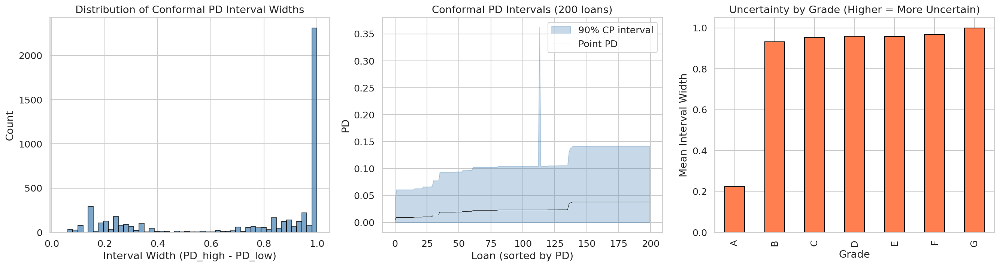

# Portafolio Robusto Y Selección De Política

Puente entre predict-then-optimize, política económica y frontera de robustez que alimenta el claim central de CRPTO.

::: {.callout-note}
Este capítulo es un dossier curado desde secciones previas del libro original que CRPTO reutilizaba implícitamente. Los bloques de código se conservan como referencia estática para evitar que el render del libro dependa de ejecuciones exploratorias no necesarias.
:::

## Fuente curada: `book/chapters/09-portfolio/index.qmd`

Este capitulo transforma las predicciones calibradas de PD y los intervalos de incertidumbre conformal en decisiones concretas de asignacion de capital. El pipeline completo sigue una arquitectura *predict-then-optimize* donde cada componente alimenta al siguiente:

La `tbl-portfolio-capítulo-overview` resume las secciones y su contribucion al pipeline.

| Seccion | Contenido | Artefacto principal |
|---------|-----------|---------------------|
| `sec-deterministic-portfolio` | Formulacion LP, Pyomo + HiGHS | `portfolio_allocations.parquet` |
| `sec-robust-portfolio` | Conjuntos de incertidumbre box, contraparte robusta | `portfolio_robustness_frontier.parquet` |
| `sec-policy-selection` | Selector económico, bound-aware closure y promoción final | `champion_portfolio_policy.json` |
| `sec-cate-portfolio` | Ajuste causal (CATE) al retorno esperado | `cate_portfolio_comparison.parquet` |
| `sec-efficient-frontier` | Frontera de Pareto: riesgo vs robustez vs retorno | `portfolio_robustness_summary.parquet` |

: Resumen del capitulo de optimizacion de portafolio.

::: {.callout-note}
## Solver abierto
Toda la optimizacion usa **HiGHS** como solver LP/MILP open-source [@huangfu_parallelizing_2018], modelado con Pyomo. No se requiere licencia comercial (Gurobi/CPLEX).
:::

::: {.column-page}

:::

La figura `fig-uncertainty-sets` conecta estadística con OR: cada intervalo conformal deja de ser una salida descriptiva y se convierte en una región factible de decisión.

| Capa de entrada | Qué aporta a la optimización | Qué error evita |
|---|---|---|
| `pd_point` | ranking base y retorno esperado | decidir como si el score fuera exacto |
| intervalo conformal | rango plausible de riesgo por préstamo | sobreasignar capital a candidatos con alta ambigüedad |
| policy champion | umbrales y perfil económico promovido | dejar la selección final en tuning implícito o subjetivo |
| evaluación A/B y regret | evidencia económica posterior | confundir elegancia metodológica con valor real |

: Cómo se traduce la estadística en decisión de portafolio

```html
<div class="capítulo-landing-grid">
  <div class="capítulo-card"><h4><a href="09a-deterministic-portfolio.html">35. Determinístico</a></h4><p>Formulación base LP y restricciones canónicas.</p></div>
  <div class="capítulo-card"><h4><a href="09b-robust-portfolio.html">36. Robusto</a></h4><p>Uncertainty sets conformales y peor caso plausible.</p></div>
  <div class="capítulo-card"><h4><a href="09c-policy-selection.html">37. Política Champion</a></h4><p>Selector económico, A/B y promoción final.</p></div>
  <div class="capítulo-card"><h4><a href="09d-cate-adjusted-portfolio.html">38. CATE-Adjusted</a></h4><p>Bridge entre inferencia causal y asignación.</p></div>
  <div class="capítulo-card"><h4><a href="09e-efficient-frontier.html">39. Frontera</a></h4><p>Trade-off retorno/robustez y price of robustness.</p></div>
</div>
```

> Nota curatorial: el cierre editorial compartido del libro original se omitió aquí para mantener este dossier independiente y centrado en CRPTO.

## Fuente curada: `book/chapters/09-portfolio/09a-deterministic-portfolio.qmd`

## Portafolio Determinístico

El punto de partida de la optimizacion de portafolio es un programa lineal (LP) que maximiza el retorno esperado neto de perdida, sujeto a restricciones de presupuesto, riesgo y diversificacion. Esta formulacion deterministica usa unicamente la PD puntual ---sin incorporar incertidumbre--- y sirve como **baseline** contra el cual se mide el costo de la robustez.

### Formulacion matematica

Sea $\mathcal{I} = \{1, \dots, n\}$ el conjunto de prestamos candidatos. Para cada prestamo $i$ definimos:

- $x_i \in [0, 1]$: fraccion del prestamo $i$ a financiar (variable de decision),
- $a_i$: monto del prestamo,
- $r_i$: tasa de interes (retorno esperado),
- $\widehat{PD}_i$: probabilidad de default estimada (puntual),
- $LGD_i$: perdida dado el default (fija en 0.45 para este dataset).

El programa lineal determinístico es:

$$
\max_{x} \sum_{i \in \mathcal{I}} x_i \cdot a_i \cdot \left( r_i - \widehat{PD}_i \cdot LGD_i \right)
$$

sujeto a:

$$
\sum_{i \in \mathcal{I}} x_i \cdot a_i \leq B
$$

$$
\frac{\sum_{i \in \mathcal{I}} x_i \cdot a_i \cdot \widehat{PD}_i}{\sum_{i \in \mathcal{I}} x_i \cdot a_i} \leq \bar{PD}
$$

$$
\frac{\sum_{i \in \mathcal{S}_p} x_i \cdot a_i}{\sum_{i \in \mathcal{I}} x_i \cdot a_i} \leq c_{\max}, \quad \forall p \in \mathcal{P}
$$

donde $B$ es el presupuesto total, $\bar{PD}$ es el techo de PD ponderada del portafolio (tolerancia al riesgo), $\mathcal{S}_p$ son los prestamos del segmento $p$ (por proposito de credito), y $c_{\max}$ es la concentracion maxima permitida por segmento.

### Parametros de configuracion

Los valores por defecto se definen en `configs/optimization.yaml`:

| Parametro | Valor | Descripcion |
|-----------|-------|-------------|
| `total_budget` | \$1,000,000 | Capital total disponible |
| `max_concentration` | 25% | Concentracion maxima por segmento de proposito |
| `max_portfolio_pd` | 10% | Techo de PD ponderada del portafolio |
| `solver` | HiGHS | Solver LP open-source |
| `time_limit` | 300 s | Limite de tiempo del solver |

: Configuracion del modelo de portafolio determinístico.

Los valores de la tabla no son arbitrarios. El presupuesto de \$1M es deliberadamente modesto: a la escala del dataset (préstamos con montos medianos de \$10--15K), \$1M permite financiar entre 60 y 100 préstamos, lo suficiente para que las restricciones de concentración y riesgo sean activas sin que el solver trivialice el problema. Un presupuesto más grande (por ejemplo, \$100M) financiaría casi todo el portafolio, convirtiendo la optimización en un ejercicio vacío. La concentración máxima del 25% por segmento de propósito evita que el optimizador concentre todo el capital en un solo tipo de préstamo (por ejemplo, consolidación de deuda, que domina el dataset), lo cual sería óptimo en expectativa pero frágil ante shocks sectoriales. El techo de PD ponderada al 10% refleja un apetito de riesgo moderado: dado que la tasa de default promedio del set OOT es ~22%, un cap de 10% obliga al portafolio a ser selectivo, descartando la mayoría del universo candidato. Este umbral es suficientemente estricto para que la restricción sea binding (y por tanto para que el precio de la robustez sea medible, ver `sec-robust-portfolio`), pero no tan agresivo como para que el LP sea infactible.

### Implementacion en Pyomo

El modelo se construye con `build_portfolio_model()` en `src/optimization/portfolio_model.py`. Las decisiones son variables continuas $x_i \in [0, 1]$ (relajacion LP del problema de aprobacion binario), lo que permite asignaciones parciales y garantiza solucion en tiempo polinomial.

```
model.x = pyo.Var(model.I, domain=pyo.NonNegativeReals, bounds=(0, 1))
```

La funcion objetivo (`eq-deterministic-objective`) calcula el retorno neto como la diferencia entre el ingreso por intereses y la perdida esperada:

$$
\text{Retorno neto}_i = r_i - \widehat{PD}_i \cdot LGD_i
$$

::: {.callout-tip}
## Variables continuas vs binarias
La relajacion continua $x_i \in [0, 1]$ produce una cota superior del problema binario (aprobar/rechazar) y se resuelve ordenes de magnitud mas rapido. Para 5,000 candidatos, HiGHS resuelve el LP en menos de 2 segundos. El modelo MILP binario (`build_binary_model`) esta disponible pero no se usa en el pipeline principal.
:::

### Resolucion y artefactos

El script `scripts/optimize_portfolio.py` ejecuta el pipeline completo:

1. Carga candidatos de `data/processed/test_fe.parquet` (hasta 5,000 por defecto),
2. Alinea intervalos conformal por `id` del prestamo,
3. Construye y resuelve el modelo Pyomo con HiGHS,
4. Persiste `portfolio_allocations.parquet` con la asignacion optima.

El artefacto de salida contiene para cada prestamo: la fraccion asignada, el monto, la PD puntual, los limites conformal y la tasa de interes. Este resultado alimenta directamente el analisis de escenarios (mejor caso, esperado, peor caso) implementado en `scenario_analysis()` de `src/optimization/robust_opt.py`.

::: {.callout-warning}
## Fragilidad del baseline determinístico
El portafolio determinístico ignora completamente la incertidumbre de estimacion. Si la PD real es mayor que la estimada, el portafolio puede violar su techo de riesgo. Esta fragilidad motiva la formulacion robusta de `sec-robust-portfolio`.
:::

## Fuente curada: `book/chapters/09-portfolio/09b-robust-portfolio.qmd`

## Portafolio Robusto con Conjuntos de Incertidumbre

La formulacion determinística de `sec-deterministic-portfolio` asume que $\widehat{PD}_i$ es conocida con certeza. En la practica, la PD estimada tiene un error de estimacion que los intervalos conformal cuantifican con garantias finitas de cobertura (`sec-split-conformal`). Esta seccion formaliza como convertir esos intervalos en **conjuntos de incertidumbre** para optimizacion robusta, siguiendo el marco de Bertsimas y Sim [-@bertsimas2004].

### Conjuntos de incertidumbre box

Para cada prestamo $i$, la prediccion conformal Mondrian (`sec-mondrian`) produce un intervalo $[\underline{PD}_i, \overline{PD}_i]$ con cobertura garantizada al nivel $1 - \alpha$ (90% en nuestra configuracion). El **conjunto de incertidumbre box** se define como:

$$
\mathcal{U}_i = \left\{ PD_i \in \mathbb{R} : \underline{PD}_i \leq PD_i \leq \overline{PD}_i \right\}
$$

La funcion `build_box_uncertainty_set()` en `src/optimization/robust_opt.py` construye estos conjuntos y calcula el centro y radio de cada intervalo:

$$
\hat{c}_i = \frac{\underline{PD}_i + \overline{PD}_i}{2}, \qquad \hat{r}_i = \frac{\overline{PD}_i - \underline{PD}_i}{2}
$$

::: {.callout-note}
## Cobertura conformal como garantia de robustez
La cobertura conformal al 90% implica que la PD real de al menos el 90% de los prestamos cae dentro de $\mathcal{U}_i$. Este es un resultado **distribution-free** que no depende de supuestos distribucionales --- a diferencia de intervalos bootstrap o bayesianos.
:::

### Contraparte robusta

El portafolio robusto reemplaza la PD puntual en la restriccion de riesgo (`eq-pd-cap-constraint`) por una **PD efectiva** que incorpora la incertidumbre. La implementacion soporta multiples politicas de conservadurismo a traves de `compute_effective_pd()`:

$$
PD_i^{\text{eff}} = \widehat{PD}_i + \gamma \cdot \Delta_i
$$

donde $\Delta_i = \overline{PD}_i - \widehat{PD}_i$ es el ancho hacia el peor caso y $\gamma \in [0, 1]$ controla el nivel de robustez:

| $\gamma$ | Interpretacion |
|-----------|---------------|
| 0.0 | Sin robustez (equivalente a determinístico) |
| 0.10 | Conservadurismo leve |
| 0.50 | Proteccion intermedia |
| 1.0 | Peor caso total ($PD_i^{\text{eff}} = \overline{PD}_i$) |

: Interpretacion del parametro de robustez $\gamma$.

### Politicas de PD efectiva

El sistema implementa siete modos de calculo para $PD_i^{\text{eff}}$, organizados por sofisticacion creciente:

1. **`point_estimate`**: $PD_i^{\text{eff}} = \widehat{PD}_i$ (baseline).
2. **`hard_worst_case`**: $PD_i^{\text{eff}} = \overline{PD}_i$ (maximo conservadurismo).
3. **`blended_uncertainty`**: interpolacion lineal (`eq-effective-pd`).
4. **`capped_blended_uncertainty`**: $\Delta_i$ acotado por un cuantil del portafolio.
5. **`tail_blended_uncertainty`**: solo aplica $\Delta_i$ a prestamos en la cola de incertidumbre (cuantil $q$).
6. **`segment_tail_blended_uncertainty`**: cola por segmento (grado + plazo + verificacion).
7. **`segment_relative_tail_blended_uncertainty`**: cola relativa $\Delta_i / \max(\widehat{PD}_i, 10^{-4})$, por segmento.

La progresión de estas siete políticas refleja un diseño deliberado de sofisticación creciente. Las dos primeras (`point_estimate` y `hard_worst_case`) son los extremos: la primera ignora completamente la incertidumbre, mientras la segunda asume que todos los préstamos están en su peor escenario simultáneamente --- una posición tan conservadora que en la práctica no financia ningún préstamo. Las políticas 3--4 (`blended` y `capped_blended`) introducen la interpolación con $\gamma$, pero la aplican a todos los préstamos por igual, lo cual penaliza innecesariamente a préstamos con intervalos estrechos (alta confianza). Las políticas 5--6 (`tail_blended` y `segment_tail`) resuelven esto aplicando el ajuste solo a la cola de incertidumbre, pero la cola se define en términos absolutos del ancho, lo cual no distingue entre un préstamo Grade A con ancho 0.10 (relativamente enorme para ese segmento) y un préstamo Grade G con ancho 0.10 (relativamente estrecho). La política 7 (`segment_relative_tail_blended`) cierra esa brecha: define la cola en términos del ancho *relativo* a la PD puntual, y lo hace por segmento. Un préstamo Grade A con ancho/PD = 2.0 recibe ajuste de robustez porque su incertidumbre es desproporcionada; un préstamo Grade G con ancho/PD = 0.3 no, porque su incertidumbre es proporcional a su riesgo.

La historia final del proyecto matiza esa progresión. El champion operativo previo efectivamente favoreció políticas `segment_*` porque ofrecían una lectura económica muy buena en el carril monotónico. Sin embargo, el cierre final del proyecto terminó promoviendo **`blended_uncertainty`** con `risk_tolerance = 0.175`, `gamma = 0.45` y `uncertainty_aversion = 0.10`, porque ese punto maximiza retorno dentro de la región exacta completa ya validada sobre el funded set completo. El punto `gamma = 0.55` se conserva como comparador theorem-tight dentro de la misma región.

### Penalizacion de incertidumbre en el objetivo

Ademas de la restriccion de PD, el modelo permite penalizar la incertidumbre directamente en la funcion objetivo:

$$
\max_{x} \sum_{i} x_i \cdot a_i \cdot \left( r_i - \widehat{PD}_i \cdot LGD_i - \lambda \cdot \Delta_i \cdot LGD_i \right)
$$

donde $\lambda \geq 0$ es la **aversion a la incertidumbre** (`uncertainty_aversion`). Valores tipicos explorados: $\lambda \in \{0.0, 0.1, 0.5, 1.0, 2.0, 3.0\}$.

### Resultados de la contraparte robusta

El champion final presenta los siguientes indicadores, cargados del artefacto `models/champion_portfolio_policy.json`:

```python

import sys
from pathlib import Path
sys.path.insert(0, str(Path.cwd().parent if Path.cwd().name == "book" else Path.cwd()))
from book._helpers.load_artifacts import try_load_json
import pandas as pd

champ = try_load_json("champion_portfolio_policy", directory="models", default={})
econ = champ.get("economic_metrics", {})
rob = champ.get("robustness_metrics", {})

rows = [
    {"Métrica": "Retorno realizado", "Valor": f"${econ.get('realized_total_return', 0):,.0f}"},
    {"Métrica": "Price of Robustness (%)", "Valor": f"{econ.get('price_of_robustness_pct', 0):.2f}%"},
    {"Métrica": "alpha=0.01 exact pass", "Valor": str(econ.get('alpha01_exact_pass'))},
    {"Métrica": "Weighted miscoverage V", "Valor": f"{rob.get('alpha01_weighted_miscoverage_V', 0):.6f}"},
    {"Métrica": "Gamma CP", "Valor": f"{rob.get('alpha01_gamma_cp', 0):.6f}"},
    {"Métrica": "Robust region cardinality", "Valor": int(rob.get('robust_region_cardinality', 0))},
]

pd.DataFrame(rows)
```

::: {.callout-tip}
## Precio de la robustez como prima de defendibilidad
En el cierre final del proyecto el *Price of Robustness* ya no debe leerse solo como sacrificio de retorno, sino como prima pagada por una policy que pasa `alpha = 0.01` exacto y mantiene un bound empírico fuerte sin renunciar al mayor retorno dentro de la región robusta validada. El champion económico oficial maximiza valor realizado bajo esa restricción exacta; el comparator theorem-tight sigue disponible para mostrar el extremo más conservador del trade-off.

La lectura práctica cambia: la robustez deja de ser un “costo opcional” y pasa a ser el mecanismo que sincroniza score, incertidumbre y funded set con el claim teórico del CRPTO.
:::

### Analisis de escenarios

La funcion `scenario_analysis()` evalua el portafolio bajo tres realizaciones de PD:

$$
L_{\text{scenario}} = \sum_i x_i \cdot a_i \cdot PD_i^{\text{scenario}} \cdot LGD_i
$$

donde $PD_i^{\text{scenario}} \in \{\underline{PD}_i, \widehat{PD}_i, \overline{PD}_i\}$ corresponde al mejor caso, esperado y peor caso respectivamente. La diferencia entre peor y mejor caso cuantifica la **exposicion residual a incertidumbre** del portafolio seleccionado.

### Visualización de los Conjuntos de Incertidumbre

La `fig-uncertainty-sets-portfolio` ilustra cómo los intervalos conformales por préstamo se traducen geométricamente en el conjunto de incertidumbre tipo caja que el optimizador robusto debe satisfacer. Cada préstamo aporta un rango $[\underline{PD}_i, \overline{PD}_i]$; el producto cartesiano de estos rangos define la "caja" dentro de la cual el portafolio debe permanecer factible.


## Fuente curada: `book/chapters/09-portfolio/09c-policy-selection.qmd`

## Selección de Política Económica

Con multiples combinaciones de tolerancia al riesgo ($\bar{PD}$), modo de politica, parametro de robustez ($\gamma$) y aversion a la incertidumbre ($\lambda$), el espacio de politicas viables es enorme. El proyecto hoy tiene dos capas distintas y complementarias:

1. el **selector economico** del carril monotónico, que promovió la policy operativa base;
2. el **cierre `bound-aware`**, que reranqueó políticas contra el bound exacto, reveló una región robusta completa y dejó comparadores claros dentro de esa región.

### Proceso de seleccion

El script `scripts/optimize_portfolio_tradeoff.py` ejecuta una busqueda exhaustiva sobre la grilla de configuraciones. Para cada nivel de tolerancia al riesgo:

1. **Baseline no robusto**: se resuelve el LP determinístico (PD puntual, $\gamma = 0$, $\lambda = 0$).
2. **Candidatos robustos**: se resuelven todas las combinaciones de `(policy_mode, gamma, delta_cap_quantile, tail_focus_quantile)` $\times$ `aversion_grid`.
3. **Price of Robustness**: se calcula como la diferencia de retorno neto entre baseline y candidato robusto.
4. **Retorno realizado**: se computa el retorno *ex-post* usando las etiquetas reales de default del set OOT.

### Test A/B de no-regresion

El test A/B no es un A/B test experimental online, sino una evaluacion retroactiva: dado que conocemos los defaults reales del periodo OOT (2018--2020), se compara el retorno realizado del portafolio robusto contra el baseline no robusto.

La condicion de no-regresion es:

$$
R_{\text{robusto}}^{\text{realizado}} \geq R_{\text{baseline}}^{\text{realizado}} - 0.05 \cdot |R_{\text{baseline}}^{\text{realizado}}|
$$

Es decir, el portafolio robusto puede perder hasta un 5% del retorno realizado del baseline sin ser descartado. Este margen reconoce que la robustez tiene un costo, pero limita cuanto puede costar.

### Política champion seleccionada

El cierre final paper/thesis promueve la siguiente política económica unificada:

| Parametro | Valor |
|-----------|-------|
| `risk_tolerance` | 0.175 |
| `uncertainty_aversion` ($\lambda$) | 0.10 |
| `policy_mode` | `blended_uncertainty` |
| `gamma` | 0.45 |
| `tail_focus_quantile` | 1.0 |
| `delta_cap_quantile` | 1.0 |
| `alpha=0.01` exact | PASS |

: Politica champion económica unificada del cierre final.

```python

import sys
from pathlib import Path

sys.path.insert(0, str(Path.cwd().parent if Path.cwd().name == "book" else Path.cwd()))
from book._helpers.load_artifacts import load_json

import pandas as pd

policy = load_json("champion_portfolio_policy", directory="models")
econ = policy.get("economic_metrics", {})
rob = policy.get("robustness_metrics", {})

rows = [
    {"Métrica": "A/B pass all", "Valor": str(econ.get("ab_pass_all"))},
    {"Métrica": "alpha=0.01 exact pass", "Valor": str(econ.get("alpha01_exact_pass"))},
    {"Métrica": "alpha=0.03 exact pass", "Valor": str(econ.get("alpha03_exact_pass"))},
    {"Métrica": "alpha=0.10 exact pass", "Valor": str(econ.get("alpha10_exact_pass"))},
    {"Métrica": "Retorno realizado", "Valor": f"${econ.get('realized_total_return', 0):,.0f}"},
    {"Métrica": "Price of robustness (%)", "Valor": f"{econ.get('price_of_robustness_pct', 0):.2f}%"},
    {"Métrica": "Weighted miscoverage V", "Valor": f"{rob.get('alpha01_weighted_miscoverage_V', 0):.6f}"},
    {"Métrica": "Gamma CP", "Valor": f"{rob.get('alpha01_gamma_cp', 0):.6f}"},
    {"Métrica": "Violación alpha01", "Valor": f"{rob.get('alpha01_violation', 0):.6f}"},
]

pd.DataFrame(rows)
```

::: {.callout-note}
## Interpretacion de la politica champion
La política final `blended_uncertainty` con $\gamma = 0.45$ y `risk_tolerance = 0.175` es ahora el champion oficial del proyecto porque elimina la ambigüedad entre “selector económico del run” y “promoción editorial final”. Sigue pasando `alpha=0.01` exacto con `violation = 0`, maximiza retorno dentro de la región robusta validada y mantiene métricas de tightness ya defendibles. El punto theorem-tight `0.175 / 0.55 / 0.10` se conserva como comparador metodológico importante, no como champion oficial separado.
:::

::: {.callout-warning}
## Unificacion del selector y la promoción final
El cierre actualizado del proyecto elimina esa bifurcación. El artefacto del run `276k` ya dejaba al **ganador económico del grid** como selección natural del barrido, y el proyecto final adopta ahora ese mismo punto como champion oficial en `models/final_project_promotion.json` y `models/champion_portfolio_policy.json`.

La decisión final queda así unificada:

- el **run selector** responde “qué punto maximizó retorno dentro de los passers”;
- la **promoción final** adopta ese mismo punto como champion oficial del proyecto;
- el **comparador theorem-tight** queda documentado para explicar el trade-off retorno-vs-tightness dentro de la región robusta.
:::

### Alternativas de investigacion

El cierre final deja tres alternativas importantes para comparación académica y editorial:

| Selector | Criterio principal | Risk tolerance | Policy mode |
|----------|-------------------|----------------|-------------|
| **economic champion** | Maximiza retorno dentro de la región alpha01-safe | 0.175 | `blended_uncertainty` |
| **theorem-tight** | Minimiza `V` y mejora `gamma_cp` | 0.175 | `blended_uncertainty` |
| **balanced comparator** | Casi mismo retorno con postura un poco menos agresiva | 0.170 | `blended_uncertainty` |

: Alternativas finales dentro de la región robusta.

La lectura nueva ya no es “qué selector histórico ganó”, sino “qué punto de la región robusta conviene promover”. El proyecto final promueve el economic champion y conserva el theorem-tight como comparador metodológico para documentar el trade-off exacto entre retorno y tightness.

```python

import sys
from pathlib import Path

sys.path.insert(0, str(Path.cwd().parent if Path.cwd().name == "book" else Path.cwd()))
from book._helpers.load_artifacts import REPO_ROOT

import pandas as pd

region_path = REPO_ROOT / "data" / "processed" / "portfolio_bound_aware" / "rank1_alpha01_bound_aware_276k_full_2026-04-05-1734" / "portfolio_bound_aware_bound_eval.parquet"
region = pd.read_parquet(region_path)
alpha01 = region[(region["alpha"] == 0.01) & (region["all_bounds_hold"])].copy()
editorial_points = alpha01[
    (
        (alpha01["risk_tolerance"] == 0.175)
        & (alpha01["gamma"] == 0.45)
        & (alpha01["uncertainty_aversion"] == 0.10)
    )
    | (
        (alpha01["risk_tolerance"] == 0.175)
        & (alpha01["gamma"] == 0.55)
        & (alpha01["uncertainty_aversion"] == 0.10)
    )
    | (
        (alpha01["risk_tolerance"] == 0.170)
        & (alpha01["gamma"] == 0.45)
        & (alpha01["uncertainty_aversion"] == 0.10)
    )
]
top_returns = alpha01.nlargest(5, "realized_total_return")
alpha01 = (
    pd.concat([editorial_points, top_returns], ignore_index=True)
    .drop_duplicates(
        subset=[
            "risk_tolerance",
            "policy_mode",
            "gamma",
            "uncertainty_aversion",
            "delta_cap_quantile",
            "tail_focus_quantile",
            "min_budget_utilization",
            "pd_cap_slack_penalty",
        ]
    )
    .sort_values(["realized_total_return", "weighted_miscoverage_V"], ascending=[False, True])
    .head(8)
    .copy()
)

alpha01["Rol editorial"] = ""
alpha01.loc[
    (alpha01["risk_tolerance"] == 0.175)
    & (alpha01["gamma"] == 0.45)
    & (alpha01["uncertainty_aversion"] == 0.10),
    "Rol editorial",
] = "economic champion"
alpha01.loc[
    (alpha01["risk_tolerance"] == 0.175)
    & (alpha01["gamma"] == 0.55)
    & (alpha01["uncertainty_aversion"] == 0.10),
    "Rol editorial",
] = "theorem-tight"
alpha01.loc[
    (alpha01["risk_tolerance"] == 0.170)
    & (alpha01["gamma"] == 0.45)
    & (alpha01["uncertainty_aversion"] == 0.10),
    "Rol editorial",
] = "balanced comparator"

alpha01 = alpha01[
    [
        "risk_tolerance",
        "gamma",
        "uncertainty_aversion",
        "weighted_miscoverage_V",
        "gamma_cp",
        "realized_total_return",
        "price_of_robustness_pct",
        "Rol editorial",
    ]
]
alpha01.columns = [
    "Risk tol",
    "Gamma",
    "Lambda",
    "V",
    "gamma_cp",
    "Retorno realizado",
    "PoR (%)",
    "Rol editorial",
]
alpha01
```

### Breadth score

En la versión previa, el capítulo usaba un **breadth score** compuesto para verificar que la política robusta no colapsara el portafolio a un subconjunto degenerado. Esa intuición sigue siendo útil, pero el cierre final del proyecto aporta una señal más fuerte: no hay un único punto viable, sino una región robusta completa de `45/45` políticas alpha01-safe sobre el OOT completo. Esa evidencia reduce el riesgo de depender de una solución frágil o sobreajustada.

::: {.callout-warning}
## Configuracion como template
Los archivos YAML en `configs/` son **templates** con valores por defecto. La política efectiva promovida en el cierre final vive en `models/champion_portfolio_policy.json`, y la narrativa consolidada para paper/tesis se apoya además en `models/final_project_promotion.json`.
:::

## Fuente curada: `book/chapters/09-portfolio/09e-efficient-frontier.qmd`

## Frontera Eficiente de Robustez

Las secciones anteriores presentan la formulacion del portafolio robusto y la seleccion de la politica champion. Esta seccion analiza la **frontera de Pareto** que emerge al explorar exhaustivamente el espacio de configuraciones, cuantificando el trade-off entre retorno esperado, proteccion ante el peor caso y costo de la robustez.

### Espacio de busqueda

El script `scripts/optimize_portfolio_tradeoff.py` evalua una grilla tridimensional de configuraciones:

- **Tolerancia al riesgo** ($\bar{PD}$): 9 niveles de 0.05 a 0.20.
- **Aversion a la incertidumbre** ($\lambda$): 7 niveles de 0.0 a 3.0.
- **Modos de politica**: 7 modos $\times$ multiples combinaciones de $\gamma$, `delta_cap_quantile` y `tail_focus_quantile`.

En total, el barrido exhaustivo evalua hasta **6,941 configuraciones de politica** (dependiendo del perfil de grilla seleccionado). Para cada configuracion, se resuelve el LP completo con HiGHS y se computan las metricas de robustez.

### Curva de Price of Robustness

El Price of Robustness (PoR) mide la fraccion de retorno que el portafolio sacrifica por proteccion:

$$
\text{PoR}(\%) = \frac{R_{\text{baseline}} - R_{\text{robusto}}}{|R_{\text{baseline}}|} \times 100
$$

La curva de PoR en funcion de $\gamma$ tiene forma convexa: robustez marginal es barata (primeros puntos base de proteccion cuestan poco retorno), pero la proteccion total ($\gamma = 1.0$) es desproporcionadamente costosa. El cierre final del proyecto refina esta lectura: dentro de una región robusta completa, el champion económico se ubica en una zona de retorno máximo todavía exacta en `alpha=0.01`, mientras el comparator theorem-tight representa el costo adicional de apretar más el bound.

### Frontera de Pareto

La frontera de Pareto se define como el conjunto de politicas donde no es posible mejorar una metrica sin empeorar otra. En nuestro contexto, las metricas son:

1. **Retorno realizado** (maximizar): retorno *ex-post* con defaults reales del OOT.
2. **Reduccion de PD en peor caso** (maximizar): diferencia en PD ponderada bajo el escenario $\overline{PD}_i$.
3. **Breadth score** (maximizar): diversificacion del portafolio respecto al baseline.

La `tbl-frontier-example` muestra las politicas Pareto-dominantes a lo largo de la frontera:

| Zona de la frontera | PoR (%) | Reduccion worst-PD (bps) | Breadth | Perfil |
|---------------------|---------|--------------------------|---------|--------|
| Agresiva | 0 -- -1% | 0 -- 200 | $> 0.98$ | Casi identico al baseline |
| Balanceada | -1% -- -5% | 200 -- 900 | 0.93 -- 0.98 | Trade-off optimo |
| Conservadora | -5% -- -15% | 900 -- 2,000 | 0.85 -- 0.93 | Proteccion fuerte |
| Extrema | $< -15\%$ | $> 2,000$ | $< 0.85$ | Portafolio colapsado |

: Zonas de la frontera de robustez.

El champion económico (`risk_tolerance = 0.175`, `gamma = 0.45`, `lambda = 0.10`) se ubica en la transición entre la zona agresiva y la balanceada: conserva exactitud en `alpha=0.01` y maximiza retorno dentro de la región robusta. El comparator theorem-tight (`gamma = 0.55`) se mueve hacia una postura más conservadora y gana tightness adicional al costo de algunos miles de dólares de retorno realizado.

### Dimensiones del trade-off

El analisis de la frontera revela tres dimensiones del trade-off:

1. **Retorno vs proteccion**: la curva clasica de PoR. Mayor $\gamma$ protege mas pero cuesta mas retorno.
2. **Volumen vs conservadurismo**: tolerancias al riesgo mas bajas ($\bar{PD} = 0.06$) rechazan mas prestamos, reduciendo el volumen financiado. El piso de utilizacion de presupuesto (`min_budget_utilization = 0.05`) evita soluciones degeneradas a niveles estrictos de riesgo.
3. **Composición del funded set**: el proyecto terminó mostrando que el cuello de botella real no era solo el modo de política, sino qué funded set exacto inducía cada combinación de `(risk_tolerance, gamma, lambda)`. Una policy más simple (`blended_uncertainty`) puede dominar a una más sofisticada si deja una región exacta completa y, dentro de ella, un champion económico superior.

::: {.callout-note}
## Frontera como herramienta de gobernanza
La frontera de robustez no solo es un resultado analitico --- es una herramienta de decision para el comite de riesgo. Permite comunicar explicitamente: "por cada punto adicional de tightness teórica, el portafolio sacrifica cierto retorno". Esto transforma la comparación entre el champion económico oficial y el comparator theorem-tight en una elección económicamente cuantificable, no en una preferencia subjetiva.
:::

### Conexion con el pipeline completo

Los artefactos generados por la frontera alimentan multiples componentes downstream:

- **`portfolio_robustness_frontier.parquet`**: todas las configuraciones evaluadas con sus metricas.
- **`portfolio_robustness_summary.parquet`**: resumen por nivel de tolerancia al riesgo (mejor robusto vs baseline).
- **`champion_portfolio_policy.json`**: la politica promovida tras pasar el test A/B (`sec-ab-no-regression`).
- **`portfolio_research_policy.json`**: las cuatro alternativas de investigacion (`tbl-research-alternatives`).

Estos artefactos son consumidos por el dashboard Streamlit para visualizacion interactiva, por el reporte MRM para validacion regulatoria, y por la simulacion A/B retroactiva (`scripts/simulate_ab_test.py`) para evaluar robustez en condiciones mas realistas.
