# Gobernanza, Explicabilidad y Dataset 360

Material para appendix journal, defensa MRM, interpretabilidad y descripción profunda del universo Lending Club.

::: {.callout-note}
Este capítulo es un dossier curado desde secciones previas del libro original que CRPTO reutilizaba implícitamente. Los bloques de código se conservan como referencia estática para evitar que el render del libro dependa de ejecuciones exploratorias no necesarias.
:::

## Fuente curada: `book/chapters/10-ifrs9-governance/10e-model-risk-management.qmd`

## Gestión de Riesgo de Modelo

El cierre prudencial del pipeline ya no ocurre cuando el score PD “se ve bien” en AUC. Hoy el sistema se defiende porque puede mostrar, con artefactos vivos, qué parte del stack está en `PASS`, qué parte está en `warning`, y qué parte sigue como `diagnostic_only`. Esa es la diferencia entre un pipeline clásico de scoring y un pipeline moderno de riesgo crediticio bajo gobernanza.

La lógica sigue el espíritu de SR 11-7 [@sr117]: distinguir desarrollo, validación, monitoreo y uso, sin fingir que todo resultado verde significa ausencia de riesgo metodológico. En el estado vigente del proyecto, la conversación correcta es esta:

- el champion monotónico sí quedó promovido y congelado en registro;
- fairness y conformal ya cierran operativamente;
- la capa MRM es más rica porque ahora incorpora C2ST, monotonicity audit, PD backtesting, bootstrap gap diagnostics, interpretación por cohortes, calibration mapping sidecars, model-shift semantics, IFRS9 diagnostics y encoding stability;
- algunos diagnósticos siguen abiertos, pero ya están formulados en lenguaje de materialidad y no solo en p-values.

### Marco de control actual

```python

import sys
from pathlib import Path

sys.path.insert(0, str(Path.cwd().parent if Path.cwd().name == "book" else Path.cwd()))
from book._helpers.load_artifacts import try_load_json

import pandas as pd

registry = try_load_json("champion_registry", directory="models", default={})
fairness = try_load_json("fairness_audit_status", directory="models", default={})
conformal = try_load_json("conformal_policy_status", directory="models", default={})
governance = try_load_json("governance_status", directory="models", default={})
monotonicity = try_load_json("monotonicity_audit_status", directory="models", default={})
pd_backtesting = try_load_json("pd_backtesting_status", directory="models", default={})
bootstrap_validation = try_load_json("bootstrap_validation_status", directory="models", default={})
pd_validation = try_load_json("pd_validation_interpretation_status", directory="models", default={})
calibration_mapping = try_load_json("calibration_mapping_status", directory="models", default={})
ifrs9_diag = try_load_json("ifrs9_diagnostics_status", directory="models", default={})
encoding = try_load_json("encoding_stability_status", directory="models", default={})
model_shift = try_load_json("model_shift_status", directory="models", default={})

rows = [
    {"Componente": "Champion registry", "Estado": registry.get("run_tag", "N/D"), "Lectura": "El champion monotónico vigente quedó congelado con lineage y thresholds."},
    {"Componente": "Fairness oficial", "Estado": "PASS" if fairness.get("overall_pass") else "FAIL", "Lectura": "La auditoría ya se lee sobre decisiones de aprobación."},
    {"Componente": "Conformal policy", "Estado": "PASS" if conformal.get("overall_pass") else "FAIL", "Lectura": "La cobertura operativa cierra; los tests estadísticos siguen diagnósticos."},
    {"Componente": "Governance / drift", "Estado": "PASS" if governance.get("overall_pass") else "FAIL", "Lectura": "El stack de drift y explicabilidad sigue operativo."},
    {"Componente": "Monotonicity audit", "Estado": "PASS" if monotonicity.get("overall_pass") else "FAIL", "Lectura": "La promoción monotónica está respaldada por auditoría estructural."},
    {"Componente": "PD backtesting suite", "Estado": "PASS" if pd_backtesting.get("overall_pass") else "DIAGNOSTIC FAIL", "Lectura": "La suite estadística es exigente; no reabre la promoción pero sí informa trabajo futuro."},
    {"Componente": "Bootstrap validation", "Estado": str(bootstrap_validation.get("severity", "N/D")).upper(), "Lectura": "Añade una capa bootstrap para distinguir materialidad de slice frente a p-values demasiado sensibles."},
    {"Componente": "PD validation interpretation", "Estado": str(pd_validation.get("severity", "N/D")).upper(), "Lectura": "El promedio global no alarma; la persistencia por cohortes sí merece atención."},
    {"Componente": "Calibration mapping", "Estado": str(calibration_mapping.get("severity", "N/D")).upper(), "Lectura": "Prueba sidecars de remapeo sin reemplazar el calibrador canónico; el cierre actual es keep-current-calibrator."},
    {"Componente": "IFRS9 diagnostics", "Estado": "PASS" if ifrs9_diag.get("overall_pass") else "DIAGNOSTIC FAIL", "Lectura": "La escalera de estrés es coherente, pero la estabilidad temporal sigue abierta."},
    {"Componente": "Encoding stability", "Estado": "PASS" if encoding.get("overall_pass") else "FAIL", "Lectura": "No hay evidencia de fragilidad estructural que fuerce reabrir el contrato."},
    {"Componente": "Model shift semantics", "Estado": str(model_shift.get("summary", {}).get("shift_type", "N/D")), "Lectura": "Distingue shift estructural de degradación predictiva en el lenguaje de gobernanza."},
]

pd.DataFrame(rows)
```

### Fairness como guardrail de uso real

La capa de fairness cambió de forma importante. El proyecto ya no cuenta la equidad sobre una semántica técnica de “PD por encima de threshold”, sino sobre **decisiones de aprobación**. Esa corrección importa porque alinea búsqueda, auditoría y política de negocio en el mismo espacio. En lenguaje de fairness de decisiones [@hardt2016], el objeto auditado ahora está más cerca de la acción real.

```python

thresholds = fairness.get("thresholds", {})
decision_policy = fairness.get("decision_policy", {})

rows = [
    {"Indicador": "overall_pass", "Valor": fairness.get("overall_pass"), "Lectura": "La política oficial no activa alertas materiales."},
    {"Indicador": "outcome_mode", "Valor": fairness.get("outcome_mode"), "Lectura": "La equidad se audita sobre aprobación."},
    {"Indicador": "atributos auditados", "Valor": fairness.get("n_attributes"), "Lectura": "Incluye atributos base e interseccionales."},
    {"Indicador": "threshold operativo", "Valor": fairness.get("prediction_threshold"), "Lectura": "Threshold oficial de fairness y decisión."},
    {"Indicador": "threshold source", "Valor": fairness.get("prediction_threshold_source"), "Lectura": "Se resuelve desde la policy oficial, no desde un corte interno PD."},
    {"Indicador": "global threshold", "Valor": decision_policy.get("global_threshold"), "Lectura": "No hay overrides por grupo en la policy actual."},
    {"Indicador": "dpd limit", "Valor": thresholds.get("dpd"), "Lectura": "Límite de demographic parity difference."},
    {"Indicador": "eo gap limit", "Valor": thresholds.get("eo_gap"), "Lectura": "Límite de equalized odds gap."},
    {"Indicador": "dir floor", "Valor": thresholds.get("dir"), "Lectura": "Piso de disparate impact ratio."},
]

pd.DataFrame(rows)
```

La lectura prudente no es “el modelo es justo” en sentido absoluto. La lectura correcta es más concreta: **la política vigente no muestra disparidades materiales bajo los atributos y umbrales auditados hoy**.

### Proxies, ruido y frontera de datos protegidos

La bibliografia nueva ayuda a afinar el lenguaje de gobernanza. La ausencia de
atributos protegidos directos no significa ausencia de riesgo de equidad; solo
limita el tipo de afirmacion que puede hacerse. En credito, los proxies de
raza, geografia, historia crediticia y comportamiento financiero pueden cargar
informacion sensible o incompleta. Por eso la auditoria de CRPTO debe
presentarse como control sobre atributos disponibles y proxies razonables, no
como certificacion legal de fair lending.

| Riesgo | Evidencia externa | Uso en CRPTO |
|---|---|---|
| Credit invisibility | Muchas personas no tienen historia suficiente para scoring tradicional [@brevoort2016creditinvisibles]. | Limite de cobertura del dataset Lending Club. |
| Ruido de medicion | El ruido en reportes crediticios puede afectar asignacion y pricing [@blattner2021noise]. | Motivo para exigir calibracion, intervalos y segment checks. |
| Modelos predictivos y asignacion | ML puede mejorar prediccion y aun asi cambiar quien recibe credito [@fuster2022predictably]. | Separar performance de consecuencias decisionales. |
| Proxies protegidos | BISG y aproximaciones similares son utiles, pero imperfectas [@cfpb2014bisg; @finreglab2023fairness]. | Fairness proxy como diagnostico, no certificacion. |
| Gobernanza de provision | ECL y overlays requieren trazabilidad de supuestos [@basel2015ecl]. | Mantener IFRS9 como extension documentada, no dependencia IJDS. |

Esta frontera no debilita el proyecto. Al contrario: hace que la tesis sea mas
creible, porque distingue con claridad entre evidencia estadistica disponible,
decisiones auditables y claims regulatorios que exigirian datos protegidos o un
proceso legal externo.

### C2ST y representatividad: qué agrega realmente

El proyecto añadió una capa de representatividad basada en **Classifier Two-Sample Test** (C2ST), un enfoque útil cuando PSI por sí solo se queda corto [@lopezpaz2018c2st]. El punto no es sustituir PSI, sino enriquecer la lectura de drift con una pregunta más exigente: ¿qué tan fácil es distinguir train y test con un clasificador, y qué señales explican esa separación?

```python

g_summary = governance.get("summary", {})
g_checks = governance.get("checks", {})

rows = [
    {"Chequeo": "overall governance", "Valor": governance.get("overall_pass"), "Lectura": "El veredicto global de gobernanza sigue en PASS."},
    {"Chequeo": "PSI máximo", "Valor": f"{g_summary.get('max_psi', 0):.4f}", "Lectura": "Las distribuciones marginales no activan trigger duro de retraining."},
    {"Chequeo": "score PSI", "Valor": f"{g_summary.get('score_psi', 0):.4f}", "Lectura": "El shift de score agregado sigue controlado."},
    {"Chequeo": "C2ST AUC", "Valor": f"{g_summary.get('c2st_auc', 0):.4f}", "Lectura": "El clasificador distingue train/test con mucha facilidad."},
    {"Chequeo": "pass_c2st", "Valor": g_checks.get("pass_c2st"), "Lectura": "C2ST se interpreta como warning severo, no como rollback automático."},
    {"Chequeo": "shift_type", "Valor": model_shift.get("summary", {}).get("shift_type"), "Lectura": "Resume si la señal dominante es estructural, predictiva o mixta."},
    {"Chequeo": "governance_posture", "Valor": model_shift.get("summary", {}).get("governance_posture"), "Lectura": "Hace explícito cuándo la postura es monitoreo, warning o candidata a gate."},
    {"Chequeo": "delta AUC train-test", "Valor": f"{g_summary.get('auc_delta_train_to_test', 0):.4f}", "Lectura": "La separabilidad temporal no se traduce en degradación crítica del champion."},
    {"Chequeo": "incremento Brier", "Valor": f"{g_summary.get('brier_increase_train_to_test', 0):.4f}", "Lectura": "La pérdida probabilística adicional sigue dentro de política."},
]

pd.DataFrame(rows)
```

La interpretación importante es que C2ST **no** está diciendo “el modelo ya no sirve”. Está diciendo algo más matizado y más útil: el split temporal es claramente distinguible, y por eso la representatividad no debe describirse ingenuamente como si train y test fueran intercambiables. Esa señal refuerza la honestidad metodológica del libro.

La capa `model_shift_status.json` vuelve esa lectura todavía más útil. Ya no basta con ver `C2ST AUC = 0.985` y declarar “drift”. El proyecto ahora distingue **shift estructural**, **degradación predictiva** y **casos mixtos**. En el snapshot vigente la lectura es `mixed_shift`: hay separabilidad temporal severa y degradación predictiva moderada, pero el champion sigue cerrando dentro de política operativa. Ese lenguaje es mucho mejor para comité y tesis que la dicotomía cruda `pass/fail`.

### La nueva capa ADSFCR ya integrada al MRM

El mayor cambio metodológico reciente es que varias ideas inspiradas en el repositorio `adsfcr` dejaron de ser notas de research y pasaron a ser artefactos ejecutados. En otras palabras: el proyecto ahora monitoriza más cosas, con lenguaje más fino.

```python

rows = [
    {
        "Capa": "Monotonicity audit",
        "Problema que resuelve": "Confirmar que el champion monotónico no degrada coherencia estructural tras la promoción",
        "Estado actual": "PASS" if monotonicity.get("overall_pass") else "FAIL",
        "Artefacto": "monotonicity_audit_status.json",
    },
    {
        "Capa": "PD backtesting suite",
        "Problema que resuelve": "No depender de una sola métrica global para validar calibración",
        "Estado actual": "PASS" if pd_backtesting.get("overall_pass") else "DIAGNOSTIC FAIL",
        "Artefacto": "pd_backtesting_status.json",
    },
    {
        "Capa": "Bootstrap validation",
        "Problema que resuelve": "Separar materialidad de slice de efectos asintóticos en muestras muy grandes",
        "Estado actual": str(bootstrap_validation.get("severity", "N/D")).upper(),
        "Artefacto": "bootstrap_validation_status.json",
    },
    {
        "Capa": "PD validation interpretation",
        "Problema que resuelve": "Separar significancia estadística de materialidad por cohortes",
        "Estado actual": str(pd_validation.get("severity", "N/D")).upper(),
        "Artefacto": "pd_validation_interpretation_status.json",
    },
    {
        "Capa": "Calibration mapping",
        "Problema que resuelve": "Ver si un remapeo ligero puede reducir persistencia sin cambiar el calibrador oficial",
        "Estado actual": str(calibration_mapping.get("severity", "N/D")).upper(),
        "Artefacto": "calibration_mapping_status.json",
    },
    {
        "Capa": "IFRS9 diagnostics",
        "Problema que resuelve": "Hacer explícitas estabilidad temporal, potencia ADF y anchura de incertidumbre macro",
        "Estado actual": "PASS" if ifrs9_diag.get("overall_pass") else "DIAGNOSTIC FAIL",
        "Artefacto": "ifrs9_diagnostics_status.json",
    },
    {
        "Capa": "Encoding stability",
        "Problema que resuelve": "Detectar fragilidad de bins/WOE antes de culpar al modelo final",
        "Estado actual": "PASS" if encoding.get("overall_pass") else "FAIL",
        "Artefacto": "encoding_stability_status.json",
    },
]

pd.DataFrame(rows)
```

Estas capas no deben leerse como adornos. Son exactamente el tipo de evidencia que convierte una historia de “modelo de scoring” en una historia de **plataforma de riesgo defendible**.

La secuencia importa. `PD backtesting` dice que la capa estadística es exigente; `bootstrap_validation` muestra que la materialidad por slices sigue viva incluso cuando el gap agregado es pequeño [@efron1994]; `pd_validation_interpretation` traduce esa señal a lenguaje de cohortes; y `calibration_mapping`, ya ejecutado también en su wrapper shadow, cerró con `keep_current_calibrator` después de mostrar que los sidecars ligeros empeoraban el balance entre gap, persistencia temporal y ECE. Esa cadena de evidencia es más fuerte que reportar un único `p≈0`, porque convierte una hipótesis abierta en un control efectivamente ejecutado y documentado.

### Qué dicen hoy los diagnósticos más exigentes

```python

pdv = pd_validation.get("summary", {})
boot = bootstrap_validation.get("summary", {})
ifrs9_summary = ifrs9_diag.get("summary", {})
enc_summary = encoding.get("summary", {})

rows = [
    {"Tema": "PD validation", "Señal": pd_validation.get("signal_type"), "Lectura": "El problema actual es persistencia por cohortes, no un colapso global de calibración."},
    {"Tema": "PD gap global", "Señal": f"{pdv.get('gap_bp', 0):.1f} bp", "Lectura": "La desviación agregada es baja frente a la escala del portafolio."},
    {"Tema": "Bootstrap slice CI exclusions", "Señal": boot.get("slice_ci_exclusions"), "Lectura": "Varios slices quedan persistentemente lejos de cero bajo remuestreo explícito."},
    {"Tema": "Calibration mapping winner", "Señal": calibration_mapping.get("best_candidate", {}).get("candidate_id"), "Lectura": "El calibrador vigente sigue siendo el mejor observable en la lane sidecar."},
    {"Tema": "Calibration mapping decision", "Señal": calibration_mapping.get("recommendation"), "Lectura": "La lane shadow cerró con `keep_current_calibrator`; el valor restante es interpretativo, no un remapeo fácil."},
    {"Tema": "Peor grade gap", "Señal": f"{pdv.get('max_grade_gap_bp', 0):.1f} bp", "Lectura": "Los slices siguen importando más que la media global."},
    {"Tema": "IFRS9 dominant driver", "Señal": ifrs9_summary.get("dominant_ifrs9_driver"), "Lectura": "La sensibilidad actual del ECL parece más dominada por LGD que por PD."},
    {"Tema": "ADF near-unit-root power", "Señal": f"{ifrs9_summary.get('near_unit_root_power', 0):.3f}", "Lectura": "La potencia cerca de raíz unitaria sigue siendo baja."},
    {"Tema": "Recursive sign stability", "Señal": f"{ifrs9_summary.get('recursive_min_sign_match_share', 0):.3f}", "Lectura": "Las relaciones macro no son estables de forma plena en el tiempo."},
    {"Tema": "Encoding max WOE PSI", "Señal": f"{enc_summary.get('max_woe_psi', 0):.4f}", "Lectura": "No hay una crisis estructural de encoding que explique por sí sola los warnings aguas abajo."},
]

pd.DataFrame(rows)
```

Aquí conviene hacer una distinción que el libro debe conservar:

- `PASS` operativo significa que la arquitectura actual puede sostenerse y defenderse.
- `warning` significa que el sistema merece atención focalizada, pero no rollback.
- `diagnostic fail` significa que la capa diagnóstica encontró una debilidad real y valiosa, aunque todavía no sea un gate de promoción.

Esa taxonomía es parte del valor del proyecto. Evita dos errores simétricos:

1. vender como “todo verde” algo que todavía tiene trabajo pendiente;
2. convertir cualquier test exigente en un bloqueo ficticio de toda la plataforma.

### Registro, thresholds y separación entre champion y research lanes

El registro `models/champion_registry.json` y el artefacto `models/threshold_semantics.json` cierran otra confusión frecuente: el threshold interno de screening PD no es el mismo threshold que gobierna fairness y aprobación. Esa separación es una decisión de gobernanza, no un detalle técnico menor.

```python

semantics = try_load_json("threshold_semantics", directory="models", default={})
meaning = semantics.get("business_meaning", {})

rows = [
    {"Threshold": "pd_internal_selected_threshold", "Valor": semantics.get("pd_internal_selected_threshold"), "Rol": meaning.get("pd_internal_selected_threshold", "")},
    {"Threshold": "pd_internal_fallback_threshold", "Valor": semantics.get("pd_internal_fallback_threshold"), "Rol": meaning.get("pd_internal_fallback_threshold", "")},
    {"Threshold": "fairness_primary_threshold", "Valor": semantics.get("fairness_primary_threshold"), "Rol": meaning.get("fairness_primary_threshold", "")},
    {"Threshold": "decision_policy_global_threshold", "Valor": semantics.get("decision_policy_global_threshold"), "Rol": meaning.get("decision_policy_global_threshold", "")},
    {"Threshold": "outcome_mode", "Valor": semantics.get("outcome_mode"), "Rol": "Define el objeto de decisión que se audita en fairness."},
]

pd.DataFrame(rows)
```

Esta semántica importa porque evita dos errores narrativos muy comunes:

- confundir un threshold técnico de búsqueda con una política de negocio;
- leer fairness y decisión como si dependieran del mismo parámetro interno que usa el modelado.

### Overlay final paper/thesis sobre la base regulatoria

El libro debe distinguir dos capas de gobernanza que coexisten sin contradecirse:

- **base regulatoria/operativa**: el champion monotónico confirmatorio sigue siendo el upstream canónico del proyecto;
- **overlay final paper/thesis**: la combinación `conformal reopen winner + portfolio economic champion`, promovida para cerrar el argumento exacto del CRPTO sin mantener dos cierres oficiales.

```python

promotion = try_load_json("final_project_promotion", directory="models", default={})
final_champion = promotion.get("final_champion", {})
conformal_upstream = promotion.get("conformal_upstream", {})
base_upstream = promotion.get("upstream_canonical_base", {})

rows = [
    {
        "Capa": "Base canónica",
        "Artefacto rector": base_upstream.get("run_tag"),
        "Lectura": "Champion monotónico, fairness, governance y MRM base.",
    },
    {
        "Capa": "Conformal upstream final",
        "Artefacto rector": conformal_upstream.get("winner_family"),
        "Lectura": "Reapertura conformal que mejora la calidad downstream de la incertidumbre.",
    },
    {
        "Capa": "Portfolio champion final",
        "Artefacto rector": final_champion.get("label"),
        "Lectura": "Policy económica promovida como champion único dentro de la región robusta exacta; theorem-tight queda como comparador.",
    },
]

pd.DataFrame(rows)
```

Esta capa final no reemplaza el champion PD. Lo que hace es endurecer la parte que antes estaba metodológicamente más débil: la traducción desde intervalos conformales hacia un funded set exacto y defendible. Por eso el cierre final debe narrarse como una **superposición prudencial** sobre la base vigente, no como una ruptura del stack regulatorio.

### Cierre prudencial honesto

El sistema actual puede presentarse como defendible porque:

- el champion monotónico está promovido y auditado;
- fairness, conformal y governance cierran operativamente;
- el libro ya no necesita esconder warnings o diagnosticar todo como “verde”;
- las capas nuevas inspiradas en ADSFCR mejoran el lenguaje de monitoreo y validación.

Las oportunidades de mejora siguen siendo concretas:

1. afinar la interpretación y lectura por cohortes en PD usando la nueva evidencia slice-aware, no perseguir otro remapeo ligero del calibrador;
2. fortalecer la lane IFRS9 en estabilidad temporal y tratamiento de incertidumbre;
3. mantener C2ST, conformal y backtesting como señales vivas de vigilancia, no como anexos decorativos.

Con esto, MRM deja de ser un apéndice regulatorio y pasa a ser parte central del valor metodológico del proyecto.

## Fuente curada: `book/chapters/10-ifrs9-governance/10f-mrm-deep-dive.qmd`

## Gestión de Riesgo de Modelo

Este capitulo es un complemento dedicado a la seccion resumen de MRM (`sec-mrm`). Mientras esa seccion presenta las conclusiones operativas compactas, aqui desarrollamos en profundidad que es Model Risk Management, por que existe, como se implementa en la practica regulatoria, y como nuestro pipeline traduce esos principios en controles concretos y verificables.

El objetivo es que este capitulo pueda leerse de forma autonoma: alguien que no haya pasado por los capitulos anteriores deberia poder entender tanto la teoria general de MRM como la implementacion especifica de este proyecto.

### Que es Model Risk Management?

**Model Risk Management** (MRM) es la disciplina que identifica, mide, monitorea y controla el riesgo que surge del uso de modelos cuantitativos en decisiones financieras. Un "modelo" en este contexto es cualquier metodo cuantitativo, sistema o enfoque que aplica teoria estadistica, economica o matematica para procesar datos de entrada y producir estimaciones cuantitativas [@sr117].

La definicion tiene tres implicaciones criticas:

1. **Los modelos son simplificaciones de la realidad.** Por construccion, omiten factores, asumen distribuciones, y extrapolan relaciones historicas hacia el futuro.
2. **Las simplificaciones pueden estar equivocadas.** Un modelo puede producir estimaciones incorrectas por errores de implementacion, datos inapropiados, o supuestos que dejan de ser validos.
3. **Los modelos equivocados cuestan dinero.** En credito, un modelo de PD sobreoptimista subprovisiona y expone al banco a perdidas inesperadas; uno excesivamente conservador desperdicia capital y reduce la competitividad.

::: {.callout-note}
## Por que no basta con "el modelo tiene buen AUC"
Un modelo puede tener excelente poder discriminante (AUC alto) y sin embargo ser peligroso: si esta mal calibrado, si sus intervalos de confianza son invalidos, si discrimina por atributos protegidos, o si sus predicciones ya no corresponden a la distribucion actual de datos. MRM existe precisamente para evaluar todas estas dimensiones de forma sistematica.
:::

#### Los Tres Pilares de MRM

Toda la disciplina se organiza alrededor de tres pilares fundamentales:

| Pilar | Descripcion | Responsable tipico |
|-------|------------|-------------------|
| **Desarrollo** | Construccion del modelo: seleccion de datos, features, algoritmo, calibracion, documentacion | Equipo de modelado |
| **Validacion** | Revision independiente: replicacion de resultados, evaluacion de supuestos, benchmarks, tests de estres | Equipo de validacion (independiente) |
| **Uso y Monitoreo** | Implementacion en produccion, monitoreo continuo, triggers de re-entrenamiento, gobernanza de decisiones | Usuarios del modelo + equipo de monitoreo |

: Los tres pilares de Model Risk Management

La separacion entre desarrollo y validacion es **no negociable** en regulacion bancaria: quien construye el modelo no puede ser quien lo valida. En nuestro contexto academico, simulamos esta separacion a traves de controles automatizados que evaluan los artefactos del pipeline de forma programatica e independiente del proceso de entrenamiento.

#### Quien Usa MRM en la Organizacion

MRM no es solo un tema tecnico --- es un lenguaje compartido entre multiples actores:

- **Comite de Riesgos**: revisa los resultados MRM para decidir si un modelo puede seguir en produccion o necesita restricciones.
- **Auditoria Interna**: verifica que los controles MRM existen, se ejecutan, y producen documentacion trazable.
- **Reguladores** (Fed, OCC, PRA, CNBV): inspeccionan el inventario de modelos, la frecuencia de validacion, y la calidad de la documentacion.
- **Validadores de modelo**: ejecutan la revision independiente, producen hallazgos, y asignan calificaciones de riesgo al modelo.
- **Usuarios del modelo** (originadores, provisionadores): necesitan entender las limitaciones del modelo que usan para tomar decisiones.

### Marco Regulatorio

Los dos marcos regulatorios de referencia global para MRM son:

#### SR 11-7 (Fed/OCC, 2011)

La *Supervisory Guidance on Model Risk Management* (SR 11-7) del Board of Governors de la Federal Reserve y la OCC es el documento fundacional. Sus requisitos principales son:

1. **Inventario de modelos**: todo modelo en uso debe estar registrado, con metadatos de version, propietario, fecha de ultima validacion y calificacion de riesgo.
2. **Validacion independiente**: revisiones periodicas por personal que no participo en el desarrollo, con alcance suficiente para evaluar solidez conceptual, verificacion de resultados, y analisis de outcomes.
3. **Monitoreo continuo**: seguimiento de performance en produccion, deteccion de drift, y triggers automaticos de re-validacion.
4. **Documentacion**: suficiente para que un tercero pueda entender, replicar y evaluar el modelo.
5. **Gobernanza**: roles y responsabilidades claros, escalamiento de hallazgos, y proceso formal de aprobacion.

#### SS1/23 (PRA/BoE, 2023)

El Supervisory Statement SS1/23 del Prudential Regulation Authority (Bank of England) actualiza y extiende estos principios con enfasis en:

- **Tiering de modelos** por materialidad: no todos los modelos requieren el mismo nivel de gobernanza.
- **Model risk appetite**: las instituciones deben articular cuanto riesgo de modelo estan dispuestas a aceptar.
- **Vendor model risk**: los modelos de terceros (incluyendo librerias open-source como CatBoost o MAPIE) tambien estan en scope.

#### Conexion con IFRS9

Los modelos de ECL (Expected Credit Loss) estan explicitamente en el scope de MRM porque:

- **Impacto material**: las provisiones ECL afectan directamente el estado de resultados y los ratios de capital.
- **Complejidad**: la formula ECL = PD x LGD x EAD x DF involucra multiples modelos interconectados.
- **Juicio de gestion**: los escenarios macroeconomicos y la ponderacion de probabilidades involucran juicio experto que debe ser auditable.

En nuestro pipeline, esto se traduce en que el modelo de PD, el sistema conformal, la logica de staging SICR, y la optimizacion de portafolio --- todos los componentes que alimentan el calculo ECL (`sec-ecl-calculation`) --- estan sujetos a controles MRM.

### Nuestro Reporte MRM: Interpretacion Detallada

El artefacto central de gobernanza es `reports/mrm/mrm_validation_report.json`, generado por `scripts/generate_mrm_report.py`. Este reporte consolida cuatro subsistemas de control en un unico veredicto auditable.

```python

import sys
import json
from pathlib import Path
sys.path.insert(0, str(Path.cwd().parent if Path.cwd().name == "book" else Path.cwd()))

from IPython.display import Markdown
import pandas as pd

REPO_ROOT = Path(__file__).resolve().parents[4] if "__file__" in dir() else Path.cwd().parents[1] if Path.cwd().name in ("book", "capítulos") else Path.cwd()

# Intentar cargar desde helpers del libro
try:
    from book._helpers.load_artifacts import REPORTS_DIR
    mrm_path = REPORTS_DIR / "mrm" / "mrm_validation_report.json"
except Exception:
    mrm_path = Path("reports/mrm/mrm_validation_report.json")
    candidates = [
        Path.cwd() / mrm_path,
        Path.cwd().parent / mrm_path,
        Path.cwd().parents[1] / mrm_path,
        Path.cwd().parents[2] / mrm_path,
    ]
    mrm_path = next((p for p in candidates if p.exists()), mrm_path)

try:
    mrm = json.loads(mrm_path.read_text(encoding="utf-8"))
except FileNotFoundError:
    mrm = None

if mrm:
    cs = mrm["compliance_summary"]
    rows = []
    label_map = {
        "pipeline": "Pipeline Predictivo",
        "conformal": "Sistema Conformal",
        "governance": "Gobernanza y Drift",
        "fairness": "Fairness",
    }
    for sub, status in cs["subsystems"].items():
        rows.append({
            "Subsistema": label_map.get(sub, sub),
            "Estado": "PASS" if status else "FAIL",
            "Icono": "+" if status else "x",
        })
    rows.append({
        "Subsistema": "**Veredicto Global**",
        "Estado": f"**{'PASS' if cs['overall_pass'] else 'FAIL'}** ({cs['n_passing']}/{cs['n_subsystems']})",
        "Icono": "+" if cs["overall_pass"] else "x",
    })
    df = pd.DataFrame(rows)[["Subsistema", "Estado"]]
    Markdown(df.astype(str).to_markdown(index=False, disable_numparse=True))
else:
    Markdown("*Artefacto `mrm_validation_report.json` no disponible.*")
```

A continuacion desglosamos cada subsistema.

#### Subsistema 1: Pipeline Predictivo

El primer subsistema evalua la calidad del modelo de PD como motor predictivo. Los controles verifican que el modelo mantiene poder discriminante, esta bien calibrado, y no muestra degradacion material respecto al entrenamiento.

```python

from IPython.display import Markdown
import pandas as pd

if mrm:
    ps = mrm["pipeline_summary"]
    rows = [
        {"Metrica": "AUC-ROC (test OOT)", "Valor": f"{ps['pd_auc']:.4f}", "Umbral": "> 0.65", "Estado": "PASS"},
        {"Metrica": "Indice de Gini", "Valor": f"{ps['pd_gini']:.4f}", "Umbral": "> 0.30", "Estado": "PASS"},
        {"Metrica": "Brier Score", "Valor": f"{ps['pd_brier']:.4f}", "Umbral": "< 0.20", "Estado": "PASS"},
        {"Metrica": "ECE (calibracion)", "Valor": f"{ps['pd_ece']:.4f}", "Umbral": "< 0.02", "Estado": "PASS"},
        {"Metrica": "Metodo de calibracion", "Valor": str(ps['calibration_method']), "Umbral": "Auto-seleccion", "Estado": "INFO"},
        {"Metrica": "Concordancia RSF", "Valor": f"{ps.get('survival_rsf_concordance', 0):.4f}", "Umbral": "> 0.60", "Estado": "PASS"},
    ]
    Markdown(pd.DataFrame(rows).astype(str).to_markdown(index=False, disable_numparse=True))
else:
    Markdown("*No disponible.*")
```

**Interpretacion**: El AUC de 0.7124 indica poder discriminante moderado-bueno, consistente con la dificultad inherente del problema (predecir default en prestamos personales no asegurados con informacion de originacion solamente). El Brier score de 0.1546 y el ECE de 0.0064 confirman buena calibracion --- el modelo no solo ordena bien los riesgos, sino que las probabilidades asignadas son confiables.

El metodo de calibracion (Venn-Abers) fue seleccionado automaticamente por la politica temporal de validacion, no fijado a priori. Esto es un ejemplo de como la configuracion (`configs/pd_model.yaml`) define `method: auto` y el artefacto runtime (`data/processed/model_comparison.json`) registra la seleccion efectiva.

#### Subsistema 2: Sistema Conformal

El subsistema conformal es el mas complejo de interpretar porque combina controles operacionales (que deben pasar) con tests estadisticos (que operan como diagnosticos).

```python

from IPython.display import Markdown
import pandas as pd

if mrm:
    cs = mrm["conformal_status"]
    rows = [
        {"Control": "Cobertura empirica 90%", "Valor": f"{cs['coverage_90']:.2%}", "Umbral": ">= 90%", "Estado": "PASS"},
        {"Control": "Cobertura empirica 95%", "Valor": f"{cs['coverage_95']:.2%}", "Umbral": ">= 95%", "Estado": "PASS"},
        {"Control": "Cobertura minima por grupo (90%)", "Valor": f"{cs['min_group_coverage_90']:.2%}", "Umbral": ">= 85%", "Estado": "PASS"},
        {"Control": "Ancho promedio 90%", "Valor": f"{cs['avg_width_90']:.4f}", "Umbral": "< 0.80", "Estado": "FAIL" if "avg_width_90" in cs.get("failing_non_statistical_checks", []) else "PASS"},
        {"Control": "Winkler score 90% (compensado)", "Valor": f"{cs['winkler_90']:.4f}", "Umbral": f"< {cs.get('winkler_90_compensated_threshold', 1.22)}", "Estado": "PASS" if cs.get("winkler_90_policy_pass") else "FAIL"},
        {"Control": "Alertas criticas", "Valor": str(cs['critical_alerts']), "Umbral": "= 0", "Estado": "PASS"},
        {"Control": "Alertas warning", "Valor": str(cs['warning_alerts']), "Umbral": "Informativo", "Estado": "INFO"},
        {"Control": "Checks no-estadisticos", "Valor": f"{9 - len(cs.get('failing_non_statistical_checks', []))}/9", "Umbral": "Todos PASS", "Estado": "PASS" if cs.get("non_statistical_checks_pass") else "FAIL"},
        {"Control": "overall_pass", "Valor": str(cs['overall_pass']), "Umbral": "True", "Estado": "PASS" if cs.get("overall_pass") else "FAIL"},
        {"Control": "strict_overall_pass", "Valor": str(cs['strict_overall_pass']), "Umbral": "Diagnostico", "Estado": "INFO"},
    ]
    Markdown(pd.DataFrame(rows).astype(str).to_markdown(index=False, disable_numparse=True))
else:
    Markdown("*No disponible.*")
```

```python

from IPython.display import Markdown
import pandas as pd

if mrm:
    cs = mrm["conformal_status"]
    st = cs.get("statistical_tests", {})

    kupiec_90 = st.get("kupiec_90", {})
    kupiec_95 = st.get("kupiec_95", {})
    christ_90 = st.get("christoffersen_90", {})
    christ_95 = st.get("christoffersen_95", {})

    rows = [
        {
            "Test": "Kupiec 90%",
            "Estadistico": f"LR = {kupiec_90.get('lr_statistic', 0):.1f}",
            "p-valor": f"{kupiec_90.get('p_value', 0):.4f}",
            "Rechaza H0": "Si",
            "Interpretacion": f"Tasa violacion {kupiec_90.get('violation_rate', 0):.2%} vs nominal 10%",
        },
        {
            "Test": "Kupiec 95%",
            "Estadistico": f"LR = {kupiec_95.get('lr_statistic', 0):.1f}",
            "p-valor": f"{kupiec_95.get('p_value', 0):.4f}",
            "Rechaza H0": "Si",
            "Interpretacion": f"Tasa violacion {kupiec_95.get('violation_rate', 0):.2%} vs nominal 5%",
        },
        {
            "Test": "Christoffersen Ind. 90%",
            "Estadistico": f"LR_ind = {christ_90.get('lr_ind', 0):.2f}",
            "p-valor": f"{christ_90.get('p_ind', 0):.4f}",
            "Rechaza H0": "No",
            "Interpretacion": "Violaciones NO agrupadas temporalmente",
        },
        {
            "Test": "Christoffersen Ind. 95%",
            "Estadistico": f"LR_ind = {christ_95.get('lr_ind', 0):.2f}",
            "p-valor": f"{christ_95.get('p_ind', 0):.4f}",
            "Rechaza H0": "Si",
            "Interpretacion": "Agrupamiento marginal en 95%",
        },
    ]
    Markdown(pd.DataFrame(rows).astype(str).to_markdown(index=False, disable_numparse=True))
else:
    Markdown("*No disponible.*")
```

::: {.callout-warning}
## Por que el sistema conformal hoy pasa aunque los tests estadisticos sigan rechazando

Las pruebas de Kupiec y Christoffersen siguen rechazando $H_0$ (cobertura nominal = cobertura empirica) con $p \approx 0$. Esto ocurre porque con $N = 276{,}869$ observaciones, la potencia estadistica detecta cualquier desviacion persistente, incluso cuando esa desviacion es operativamente aceptable. La recuperacion conformal V3 redujo el ancho promedio (`avg_width_90 ≈ 0.756`), elimino el fallo no estadistico y dejo el gate operativo en PASS.

1. **La desviacion de cobertura queda dentro de materialidad**: +2.02pp al 90% y +1.54pp al 95%, ambas por debajo del umbral de 3%.
2. **Sigue siendo conservadora**: sobre-cobertura significa que los intervalos protegen mas de lo nominal, no menos.
3. **No rompe estabilidad operativa**: `critical_alerts = 0`, `warning_alerts = 2`, y la independencia al 90% sigue siendo aceptable.

La conclusion oficial ya no es "FAIL metodologico acotado al lane conformal", sino **PASS operacional con diagnosticos estadisticos informativos**.
:::

##### Justificacion Metodologica Formal

El sistema implementa un mecanismo de justificacion metodologica (`methodological_justification`) para exactamente este caso: cuando las unicas fallas que permanecen son estadisticas y el resto de la policy operativa ya paso. En el estado actual, esa justificacion **si aplica** y por eso `overall_pass = True` mientras `strict_overall_pass = False`.

```python

from IPython.display import Markdown
import pandas as pd

if mrm:
    mj = mrm["conformal_status"].get("methodological_justification", {})
    rows = [
        {
            "Condicion": "Solo fallan tests estadisticos",
            "Requerido": "True",
            "Observado": str(mj.get("only_statistical_failures", "N/A")),
            "Estado": "PASS" if mj.get("only_statistical_failures") else "FAIL",
        },
        {
            "Condicion": f"Desviacion cobertura 90% < {mj.get('max_coverage_deviation_for_statistical_warning_90', 0.03):.0%}",
            "Requerido": "True",
            "Observado": f"{mj.get('coverage_deviation_90', 0):.2%}",
            "Estado": "PASS" if mj.get("coverage_materiality_ok") else "FAIL",
        },
        {
            "Condicion": f"Desviacion cobertura 95% < {mj.get('max_coverage_deviation_for_statistical_warning_95', 0.03):.0%}",
            "Requerido": "True",
            "Observado": f"{mj.get('coverage_deviation_95', 0):.2%}",
            "Estado": "PASS" if mj.get("coverage_materiality_ok") else "FAIL",
        },
        {
            "Condicion": "Independencia de violaciones (Christoffersen) 90%",
            "Requerido": "True",
            "Observado": f"p = {mj.get('min_christoffersen_independence_pvalue_90', 0):.2f} threshold",
            "Estado": "PASS" if mj.get("independence_ok_90") else "FAIL",
        },
        {
            "Condicion": "Winkler 90% en banda compensada",
            "Requerido": "True",
            "Observado": f"{mj.get('winkler_90_policy_mode', 'N/A')}",
            "Estado": "PASS" if mj.get("winkler_90_compensated_pass") else "FAIL",
        },
    ]
    Markdown(pd.DataFrame(rows).astype(str).to_markdown(index=False, disable_numparse=True))
else:
    Markdown("*No disponible.*")
```

#### Subsistema 3: Gobernanza y Drift

Este subsistema evalua si el modelo mantiene estabilidad en el tiempo, si las distribuciones de features no han cambiado materialmente, y si la explicabilidad permanece coherente.

```python

from IPython.display import Markdown
import pandas as pd

if mrm:
    gs = mrm["governance_status"]
    checks = gs["checks"]
    summary = gs["summary"]

    rows = [
        {"Control": "PSI maximo de features", "Valor": f"{summary['max_psi']:.4f}", "Umbral": f"< {gs['thresholds']['psi_threshold']}", "Estado": "PASS" if checks["pass_psi"] else "FAIL"},
        {"Control": "PSI de score", "Valor": f"{summary['score_psi']:.4f}", "Umbral": f"< {gs['thresholds']['score_psi_max']}", "Estado": "PASS" if checks["pass_score_psi"] else "FAIL"},
        {"Control": "Delta AUC (train vs test)", "Valor": f"{summary['auc_delta_train_to_test']:.4f}", "Umbral": f"< {gs['thresholds']['auc_delta_max']}", "Estado": "PASS" if checks["pass_auc_delta"] else "FAIL"},
        {"Control": "Incremento Brier", "Valor": f"{summary['brier_increase_train_to_test']:.4f}", "Umbral": f"< {gs['thresholds']['brier_increase_max']}", "Estado": "PASS" if checks["pass_brier_increase"] else "FAIL"},
        {"Control": "Delta gap calibracion", "Valor": f"{summary['calibration_gap_delta']:.4f}", "Umbral": f"< {gs['thresholds']['calibration_gap_delta_max']}", "Estado": "PASS" if checks["pass_calibration_gap_delta"] else "FAIL"},
        {"Control": "Rank overlap SHAP top-10", "Valor": f"{summary['min_rank_overlap_top10']:.2f}", "Umbral": f">= {gs['thresholds']['explanation_rank_overlap_top10_min']}", "Estado": "PASS" if checks["pass_explainability"] else "FAIL"},
        {"Control": "Estabilidad reason codes", "Valor": f"{summary['min_reason_code_stability']:.2f}", "Umbral": f">= {gs['thresholds']['reason_code_stability_min']}", "Estado": "PASS" if checks["pass_reason_code_stability"] else "FAIL"},
        {"Control": "Fairness global", "Valor": str(summary['fairness_overall_pass']), "Umbral": "True", "Estado": "PASS" if checks["pass_fairness"] else "FAIL"},
        {"Control": "C2ST (drift clasificador)", "Valor": f"{summary['c2st_auc']:.4f}", "Umbral": f"< {gs['thresholds']['c2st_auc_max']}", "Estado": "FAIL" if not checks["pass_c2st"] else "PASS"},
        {"Control": "Shift type", "Valor": gs.get("model_shift", {}).get("shift_type", "N/D"), "Umbral": "Lectura MRM", "Estado": "INFO"},
        {"Control": "Governance posture", "Valor": gs.get("model_shift", {}).get("governance_posture", "N/D"), "Umbral": "Lectura MRM", "Estado": "INFO"},
    ]
    Markdown(pd.DataFrame(rows).astype(str).to_markdown(index=False, disable_numparse=True))
else:
    Markdown("*No disponible.*")
```

::: {.callout-tip}
## El caso especial del C2ST
El test Classifier Two-Sample Test (C2ST) entrena un clasificador para distinguir entre train y test [@lopezpaz2018c2st]. En este proyecto la señal es deliberadamente fuerte porque el split es temporal y el período OOT sí representa un régimen distinto. La pregunta importante ya no es “¿el C2ST pasa o falla?”, sino **qué tan material es esa separabilidad para el uso del champion**.

En el snapshot vigente:

- el `C2ST` sigue siendo severo y no debe maquillarse;
- pero PSI, score PSI y degradación predictiva siguen dentro de política;
- además, la gobernanza ahora ya expone *drivers* del shift, con `int_rate` dominando la separación train-vs-test.

Por eso el C2ST se interpreta como **warning severo con valor explicativo**, no como trigger automático de rollback. Esa lectura es más honesta y más útil que la dicotomía clásica “pass/fail”.

La capa nueva `model_shift_status.json` formaliza esa intuición. En vez de colapsar toda la señal en el p-valor o en `pass_c2st`, ahora el sistema distingue si el problema es de **representatividad estructural**, de **degradación predictiva**, o de **mezcla de ambas**. En el snapshot vigente la conclusión es `mixed_shift`: suficiente para endurecer el lenguaje de gobernanza, pero no para despromover automáticamente al champion.
:::

##### Top Features con Mayor Drift

```python

from IPython.display import Markdown
import pandas as pd

if mrm:
    drift_feats = mrm["governance_status"].get("top_drift_features", [])[:5]
    if drift_feats:
        rows = []
        for f in drift_feats:
            rows.append({
                "Feature": f["feature"],
                "PSI": f"{f['psi']:.4f}",
                "KS stat": f"{f['ks_statistic']:.4f}",
                "PSI PASS": "Si" if f["pass_psi"] else "No",
                "KS PASS": "Si" if f["pass_ks"] else "No",
            })
        Markdown(pd.DataFrame(rows).astype(str).to_markdown(index=False, disable_numparse=True))
    else:
        Markdown("*Datos de drift no disponibles.*")
else:
    Markdown("*No disponible.*")
```

Los features con mayor drift (`fico_score`, `int_rate`, `revol_bal_to_income`) son exactamente los que esperariamos en un periodo que incluye 2018-2020: cambios en politica monetaria, tightening crediticio pre-COVID, y comportamiento de consumo alterado. El punto importante es que **ninguno cruza el umbral de PSI = 0.25** que activaria el trigger de re-entrenamiento.

#### Subsistema 4: Fairness

El subsistema de fairness evalua si la politica de decision (threshold de aprobacion) produce disparidades inaceptables entre grupos demograficos.

```python

from IPython.display import Markdown
import pandas as pd

if mrm:
    fs = mrm["fairness_status"]
    rows = []
    for attr in fs["attributes"]:
        tipo = "Base" if attr["attribute_type"] == "base" else "Interseccional"
        rows.append({
            "Atributo": attr["attribute"].replace("__x__", " x "),
            "Tipo": tipo,
            "DPD": f"{attr['dpd']:.4f}",
            "EO Gap": f"{attr['eo_gap']:.4f}",
            "DIR": f"{attr['dir']:.4f}",
            "Estado": "PASS" if attr["passed_all"] else "FAIL",
        })
    df = pd.DataFrame(rows)
    Markdown(df.astype(str).to_markdown(index=False, disable_numparse=True))
else:
    Markdown("*No disponible.*")
```

```python

from IPython.display import Markdown
import pandas as pd

if mrm:
    fs = mrm["fairness_status"]
    thr = fs["thresholds"]
    attrs = fs["attributes"]

    max_dpd = max(a["dpd"] for a in attrs)
    max_eo = max(a["eo_gap"] for a in attrs)
    min_dir = min(a["dir"] for a in attrs)

    rows = [
        {"Metrica": "Demographic Parity Difference (DPD)", "Umbral": f"< {thr['dpd']}", "Peor observado": f"{max_dpd:.4f}", "Margen": f"{thr['dpd'] - max_dpd:.4f}"},
        {"Metrica": "Equalized Odds Gap (EO)", "Umbral": f"< {thr['eo_gap']}", "Peor observado": f"{max_eo:.4f}", "Margen": f"{thr['eo_gap'] - max_eo:.4f}"},
        {"Metrica": "Disparate Impact Ratio (DIR)", "Umbral": f"> {thr['dir']}", "Peor observado": f"{min_dir:.4f}", "Margen": f"{min_dir - thr['dir']:.4f}"},
        {"Metrica": "Threshold de decision", "Umbral": "---", "Peor observado": f"{fs['prediction_threshold']}", "Margen": "---"},
    ]
    Markdown(pd.DataFrame(rows).astype(str).to_markdown(index=False, disable_numparse=True))
else:
    Markdown("*No disponible.*")
```

La conclusion de fairness no es que "el modelo es justo" en sentido absoluto --- esa afirmacion seria epistemologicamente insostenible. Lo que el subsistema documenta es que **bajo los umbrales regulatorios vigentes y el threshold de decision actual (0.35), no se detectan disparidades materiales** en los atributos auditados.

#### Capas diagnósticas adicionales absorbidas por MRM

El reporte MRM ahora arrastra diagnósticos que antes no quedaban bien contados en la narrativa central del libro. No son un quinto “subsistema” de compliance_summary, pero sí son parte de la evidencia que hoy vuelve al proyecto más defendible:

```python

from IPython.display import Markdown
import pandas as pd

if mrm:
    diag = mrm.get("diagnostic_statuses", {})
    rows = []
    label_map = {
        "monotonicity": "Monotonicity audit",
        "pd_backtesting": "PD backtesting suite",
        "bootstrap_validation": "Bootstrap validation",
        "pd_validation_interpretation": "PD validation interpretation",
        "calibration_mapping": "Calibration mapping",
        "ifrs9_diagnostics": "IFRS9 diagnostics",
        "encoding_stability": "Encoding stability",
        "model_shift": "Model-shift semantics",
    }
    for key, payload in diag.items():
        rows.append({
            "Capa": label_map.get(key, key),
            "overall_pass": payload.get("overall_pass"),
            "diagnostic_only": payload.get("diagnostic_only"),
            "run_tag": payload.get("run_tag", "N/D"),
        })
    Markdown(pd.DataFrame(rows).astype(str).to_markdown(index=False, disable_numparse=True))
else:
    Markdown("*No disponible.*")
```

La lectura editorial importante es esta: el proyecto ya no se queda con “4/4 PASS” y se acabó la historia. Ahora también puede decir:

- el champion monotónico pasó su auditoría estructural;
- el bootstrap confirma que la materialidad por slices sigue viva aun con gap agregado pequeño;
- la validación PD global no está rota, pero sí hay desviaciones persistentes por cohortes;
- un remapeo ligero de calibración no resolvió el problema por sí solo;
- IFRS9 tiene una limitación abierta de estabilidad temporal;
- el encoding y binning no parecen ser la fuente del problema;
- el lenguaje de drift ahora distingue separabilidad estructural de degradación predictiva.

### Interpretacion de Resultados

#### Que Significa "4/4 PASS" Operativamente

El veredicto actual `overall_pass = True` con 4/4 subsistemas aprobados significa que el modelo:

1. **Es defendible en el core predictivo**: pipeline, gobernanza, fairness y conformal pasan bajo la policy operativa.
2. **No activa una crisis general del modelo**, porque los triggers duros de drift/pipeline no estan disparados.
3. **Mantiene warnings metodologicos acotados**, sobre todo en la capa estadistica conformal, sin bloquear el uso del sistema.
4. **La documentacion es trazable**: artefactos, configuracion, run tags y versiones estan registrados.

El hecho de quedar en 4/4 PASS **no significa que todo sea perfecto**. El reporte todavía registra:

- 4 fallas estadisticas conformales (Kupiec/Christoffersen) que diagnostican sobre-cobertura.
- C2ST warning severo por alta separabilidad temporal, ahora con drivers identificados.
- `bootstrap_validation = diagnostic fail` por persistencia material en varios slices bajo remuestreo explícito.
- Drift estadisticamente detectable en algunas distribuciones marginales, pero no material por PSI.
- `pd_validation_interpretation = warning` por persistencia de gaps en cohortes específicas.
- `calibration_mapping = diagnostic fail` porque el mejor candidato sigue siendo el calibrador vigente; no apareció una corrección liviana claramente superior.
- `ifrs9_diagnostics = diagnostic fail` por inestabilidad temporal y potencia ADF débil.

Estas observaciones quedan documentadas como items de monitoreo continuo, no como bloqueos.

#### Que Activaria un FAIL y Que Remediacion Existe

```python

from IPython.display import Markdown
import pandas as pd

if mrm:
    rt = mrm.get("retraining_triggers", {})

rows = [
    {
        "Escenario de FAIL": f"PSI de features > {rt.get('psi_threshold', 0.25)}",
        "Subsistema": "Gobernanza",
        "Severidad": "Critica",
        "Remediacion": "Re-entrenamiento inmediato con datos recientes",
    },
    {
        "Escenario de FAIL": f"Degradacion AUC > {rt.get('auc_degradation_threshold', 0.03):.0%}",
        "Subsistema": "Pipeline",
        "Severidad": "Critica",
        "Remediacion": "Re-entrenamiento + revision de features",
    },
    {
        "Escenario de FAIL": f"Degradacion cobertura > {rt.get('coverage_degradation_threshold', 0.02):.0%}",
        "Subsistema": "Conformal",
        "Severidad": "Critica",
        "Remediacion": "Re-calibracion conformal + revision de grupos Mondrian",
    },
    {
        "Escenario de FAIL": "Fairness: DPD > 0.10 en atributo base",
        "Subsistema": "Fairness",
        "Severidad": "Alta",
        "Remediacion": "Ajustar threshold o aplicar overrides por grupo",
    },
    {
        "Escenario de FAIL": "Cobertura minima por grupo < 85%",
        "Subsistema": "Conformal",
        "Severidad": "Alta",
        "Remediacion": "Revisar calibracion Mondrian del grupo afectado",
    },
    {
        "Escenario de FAIL": "Winkler fuera de banda compensada",
        "Subsistema": "Conformal",
        "Severidad": "Media",
        "Remediacion": "Revisar calidad de intervalos, posible ACI",
    },
    {
        "Escenario de FAIL": "Rank overlap SHAP < 0.60",
        "Subsistema": "Gobernanza",
        "Severidad": "Media",
        "Remediacion": "Investigar cambio en drivers, documentar si es economicamente justificado",
    },
]
Markdown(pd.DataFrame(rows).astype(str).to_markdown(index=False, disable_numparse=True))
```

#### La Desviacion de Cobertura Dentro de Materialidad

Un punto que merece enfasis especial es la relacion entre la desviacion de cobertura observada y el umbral de materialidad.

La **cobertura nominal** del sistema conformal es 90%. La **cobertura empirica** observada en el test OOT es 93.07%, una desviacion de +3.07 puntos porcentuales. El umbral de materialidad configurado es 3%.

$$
\text{Desviacion} = |92.02\% - 90\%| = 2.02\% < 3\% = \text{Umbral de materialidad}
$$

Esta sobre-cobertura sigue siendo **conservadora por diseño**, pero ya no bloquea el gate operativo. El sistema conformal produce intervalos prudentes, con anchura ya dentro del umbral definido, lo cual:

- **Reduce el riesgo de sub-provision**: intervalos mas anchos implican ECL conservativo mayor, que es preferible a sub-estimar.
- **Es corregible con ACI**: Adaptive Conformal Inference ajustaria dinamicamente los cuantiles para acercarse al 90% nominal.
- **No afecta decisiones de portafolio materialmente**: la optimizacion robusta ya incorpora el ancho del intervalo como parametro de incertidumbre (`sec-robust-portfolio`).

### El Rol del Comite de Riesgo

En una institucion financiera, el reporte MRM no es un artefacto tecnico que se archiva --- es el insumo principal para decisiones de gobernanza. Esta seccion describe como un comite de riesgo consumiria este reporte.

#### Como se Presenta el Reporte

El comite recibe un resumen ejecutivo con tres elementos:

1. **Semaforo de subsistemas**: la tabla consolidada 4/4 PASS, con observaciones estadísticas localizadas en conformal.
2. **Metricas clave**: AUC, cobertura, PSI maximo, y estado de fairness.
3. **Observaciones pendientes**: items que requieren monitoreo pero no accion inmediata.

El comite **no revisa** el JSON crudo ni los detalles tecnicos de cada test estadistico. Eso es responsabilidad del equipo de validacion.

#### Matriz de Decision

```python

from IPython.display import Markdown
import pandas as pd

rows = [
    {
        "Escenario": "4/4 PASS, sin observaciones",
        "Decision": "Aprobar",
        "Accion": "Continuar monitoreo trimestral",
        "Escalamiento": "Ninguno",
    },
    {
        "Escenario": "4/4 PASS, con observaciones informativas",
        "Decision": "Aprobar con nota",
        "Accion": "Documentar observaciones, plan de monitoreo",
        "Escalamiento": "Ninguno",
    },
    {
        "Escenario": "3/4 PASS (un subsistema en FAIL)",
        "Decision": "Aprobacion condicional",
        "Accion": "Plan de remediacion con fecha limite, monitoreo mensual",
        "Escalamiento": "Director de Riesgos",
    },
    {
        "Escenario": "2/4 o menos PASS",
        "Decision": "Bloquear",
        "Accion": "Suspender uso en decisiones, re-entrenamiento urgente",
        "Escalamiento": "Comite ejecutivo + regulador",
    },
    {
        "Escenario": "Trigger de re-entrenamiento activado",
        "Decision": "Bloquear preventivo",
        "Accion": "Iniciar re-entrenamiento, modelo challenger en paralelo",
        "Escalamiento": "Director de Riesgos",
    },
]
Markdown(pd.DataFrame(rows).astype(str).to_markdown(index=False, disable_numparse=True))
```

**Nuestro caso actual**: estamos en el escenario "4/4 PASS, con observaciones informativas". La decision correspondiente es **aprobacion del stack core con monitoreo continuo**, no una reapertura del pipeline completo. La remediación pendiente en conformal ya no es un bloqueo, sino una oportunidad de mejora incremental si se quiere reducir todavía más la sobre-cobertura.

#### La Diferencia Entre "Pasa" y "Es Bueno"

Esta distincion es sutil pero crucial en MRM:

- **"Pasa"** significa que el modelo cumple los umbrales minimos de gobernanza para permanecer en uso. Es una condicion necesaria pero no suficiente.
- **"Es bueno"** es un juicio mas amplio que incluye: adecuacion al proposito, eficiencia relativa a alternativas, y alineacion con el apetito de riesgo.

Un modelo puede pasar MRM y sin embargo:

- Ser inferior a un challenger que aun no se ha promovido.
- Tener limitaciones conocidas (por ejemplo, no capturar shocks macroeconomicos nuevos).
- Ser adecuado para decisiones de provision pero no para pricing.

El reporte MRM documenta el piso de gobernanza. La decision de si el modelo es "suficientemente bueno" para el proposito especifico corresponde al comite de riesgo con input del area de negocio.

### Pipeline Integrity y Trazabilidad

Un componente frecuentemente subestimado de MRM es la **trazabilidad de artefactos**: poder demostrar que el modelo en produccion es exactamente el que fue validado, y que los datos usados para la validacion son los correctos.

```python

from IPython.display import Markdown
import pandas as pd

if mrm:
    rows = [
        {"Artefacto": "Modelo CatBoost", "Ruta": mrm["model"]["champion_artifact"], "Trazable": "Si (run_tag)"},
        {"Artefacto": "Reporte MRM", "Ruta": "reports/mrm/mrm_validation_report.json", "Trazable": f"Si (v{mrm['schema_version']})"},
        {"Artefacto": "Intervalos conformales", "Ruta": mrm["conformal_status"]["intervals_path"], "Trazable": "Si (run_tag)"},
        {"Artefacto": "Configuracion MRM", "Ruta": mrm["governance_status"]["policy_config"], "Trazable": "Si (YAML versionado)"},
        {"Artefacto": "Fairness audit", "Ruta": mrm["fairness_status"].get("policy_config", "configs/fairness_policy.yaml"), "Trazable": "Si (run_tag)"},
        {"Artefacto": "Run tag principal", "Ruta": "---", "Trazable": mrm.get("run_tag", "N/A")},
    ]
    Markdown(pd.DataFrame(rows).astype(str).to_markdown(index=False, disable_numparse=True))
else:
    Markdown("*No disponible.*")
```

La trazabilidad se implementa a traves de:

1. **Run tags**: cada ejecucion del pipeline genera un tag unico (ejemplo: `paper-grade-2026-03-22`) que se propaga a todos los artefactos.
2. **Schema versions**: cada JSON de estado tiene una version de esquema que permite detectar incompatibilidades.
3. **Timestamps UTC**: todas las marcas temporales usan UTC para evitar ambiguedades de timezone.
4. **Configuracion versionada**: los archivos YAML en `configs/` estan bajo control de versiones (git), y los artefactos runtime registran que configuracion usaron.

::: {.callout-tip}
## Patron de inversion de dependencia
Los archivos de configuracion (`configs/mrm_policy.yaml`, `configs/conformal_policy.yaml`) son **plantillas con defaults**. El artefacto runtime es la fuente de verdad. Esto evita el problema comun donde la configuracion dice una cosa pero el modelo en produccion uso otra.
:::

### Challenger Framework

El proceso de promover un modelo challenger a campeon es uno de los controles mas importantes de MRM. Nuestro framework requiere tres condiciones simultaneas:

```python

from IPython.display import Markdown
import pandas as pd

if mrm:
    cc = mrm.get("challenger_criteria", {})
    criteria = cc.get("criteria", [])
    promotion = cc.get("promotion_requires", [])
    constraints = cc.get("modeling_constraints", {})

    rows = []
    for c in criteria:
        rows.append({
            "Tipo": "Mejora de metrica",
            "Requisito": f"{c['metric']}: mejora minima {c['improvement_min']}",
        })
    for p in promotion:
        for k, v in p.items():
            rows.append({
                "Tipo": "Gate de promocion",
                "Requisito": f"{k} = {v}",
            })
    for k, v in constraints.items():
        rows.append({
            "Tipo": "Restriccion de modelado",
            "Requisito": f"{k} = {v}",
        })
    Markdown(pd.DataFrame(rows).astype(str).to_markdown(index=False, disable_numparse=True))
else:
    Markdown("*No disponible.*")
```

Notar que la promocion no es solo un tema de "mejor AUC": el challenger debe pasar la politica conformal, la auditoria de fairness, y los checks de gobernanza. Un modelo con AUC superior pero que no cumple fairness **no puede ser promovido**.

Las restricciones de modelado (`no_smote`, `monotonic_constraints_required`) reflejan decisiones de politica: SMOTE introduce observaciones sinteticas que no tienen respaldo economico, y las restricciones monotonicas aseguran que la PD se comporte de forma coherente con la teoria crediticia (mas riesgo no puede reducir la PD).

### Limitaciones y Mejoras Futuras

El sistema MRM actual es funcional y auditable, pero tiene limitaciones que deben documentarse honestamente:

#### Limitacion 1: Sobre-cobertura Conformal

La sobre-cobertura de +2.52% indica que los intervalos son mas conservadores de lo necesario. **Adaptive Conformal Inference (ACI)** [@gibbs2021aci] ajustaria dinamicamente los cuantiles conformal en cada timestep:

$$
\alpha_{t+1} = \alpha_t + \gamma \cdot (\alpha - \mathbf{1}\{Y_t \notin \hat{C}_t\})
$$

donde $\gamma$ es la tasa de aprendizaje del ajuste. Esto reduciria la sobre-cobertura sin sacrificar la garantia de validez marginal.

#### Limitacion 2: Ventana de Drift Unica

El monitoreo de drift compara un periodo de referencia (train) contra un periodo de contraste (test OOT) como un unico snapshot. En produccion, se necesita:

- **Ventanas deslizantes**: monitoreo mensual o trimestral, no una comparacion puntual.
- **Alertas progresivas**: warning cuando PSI > 0.10, alerta cuando > 0.15, bloqueo cuando > 0.25.
- **Drift por segmento**: no solo drift global, sino por grade, por vintage, por producto.

#### Limitacion 3: Validacion No-Independiente

En el contexto de esta tesis, el "validador" y el "desarrollador" son la misma persona. La independencia se simula a traves de controles programaticos, pero en una institucion financiera esto no seria aceptable bajo SR 11-7. La siguiente mejora seria:

- Publicar el reporte MRM para revision por un colega o asesor.
- Implementar controles de acceso que impidan modificar artefactos de validacion desde el pipeline de desarrollo.

#### Limitacion 4: Snapshot vs Monitoreo Continuo

El reporte actual es un snapshot en un punto del tiempo. Un sistema MRM completo incluiria:

- Ejecucion programada (cron/Airflow) del reporte.
- Alertas automaticas por correo o Slack cuando un control falla.
- Dashboard de monitoreo en tiempo real (parcialmente cubierto por la aplicacion Streamlit).
- Integracion con el sistema de gestion de incidentes.

::: {.callout-note}
## Conexion con el Backtest Conformal
El monitoreo conformal detallado, incluyendo metricas HSIC, SSC, MWI y CWC, esta cubierto en `sec-backtest-monitoring`. Los resultados de ese backtest alimentan directamente el subsistema conformal del reporte MRM.
:::

### Resumen del Capitulo

| Dimension | Estado | Referencia |
|-----------|--------|-----------|
| Pipeline predictivo | PASS (AUC 0.7124, ECE 0.006) | `sec-mrm-pipeline-subsystem` |
| Sistema conformal | PASS operacional (warnings estadísticos; justificación metodológica activa) | `sec-mrm-conformal-subsystem` |
| Gobernanza y drift | PASS (PSI < 0.25; drift explicable, no material) | `sec-mrm-governance-subsystem` |
| Fairness | PASS (6/6 atributos, threshold 0.35) | `sec-mrm-fairness-subsystem` |
| **Veredicto global** | **4/4 PASS** | `sec-mrm-report-detail` |

: Resumen de resultados MRM por subsistema

El sistema MRM implementado traduce los principios de SR 11-7 en controles concretos, automatizados y trazables. La recuperacion conformal posterior al rerun V2 deja una lectura mas madura que la version anterior: el core predictivo queda fuerte y el lane conformal ya cruza los gates operativos, pero sin esconder que persisten warnings estadisticos por sobre-cobertura. Un sistema de gobernanza maduro no solo detecta desviaciones --- las contextualiza, las documenta, y distingue entre alertas diagnósticas y bloqueos reales.

## Fuente curada: `book/chapters/11-explainability/index.qmd`

::: {.whole-game-intro}
**Pregunta central**: ¿Puede el modelo PD defender sus decisiones ante un comité de riesgo, un regulador, y un prestatario?
:::

La interpretabilidad convierte un modelo de caja negra en una capacidad operativa defendible ante reguladores, auditores y comités de riesgo. En el contexto de SR 11-7 y IFRS9, un modelo de ML que no puede explicar *por qué* asignó determinada PD a un préstamo no es apto para producción, independientemente de su AUC.

Este capítulo triangula tres lentes complementarias:

| Lente | Pregunta que responde | Herramienta principal |
|---|---|---|
| **Global** | ¿Qué señales usa el modelo *en promedio* para asignar riesgo? | SHAP summary, permutation importance, ALE |
| **Local** | ¿Por qué *este* préstamo obtuvo esa PD específica? | SHAP waterfall, force plots, reason codes |
| **Temporal** | ¿Las explicaciones son *estables* a lo largo del tiempo? | Rank overlap, PSI por feature, SHAP drift |

: Tres lentes de explicabilidad del modelo PD

::: {.callout-note}
## Explicabilidad ≠ Interpretabilidad
En este libro usamos "explicabilidad" para referirnos a técnicas post-hoc (SHAP, ALE) que explican un modelo complejo, e "interpretabilidad" para modelos intrínsecamente transparentes (regresión logística). El baseline LR del `sec-lr-baseline` es interpretable; el CatBoost champion requiere explicabilidad.
:::

```html
<div class="capítulo-landing-grid">
  <div class="capítulo-card"><h4><a href="11a-global-explanations.html">47. Globales</a></h4><p>Drivers globales, familias y sensibilidad.</p></div>
  <div class="capítulo-card"><h4><a href="11b-local-explanations.html">48. Locales</a></h4><p>Casos representativos, reason codes y decisiones.</p></div>
  <div class="capítulo-card"><h4><a href="11c-explanation-drift.html">49. Drift</a></h4><p>Estabilidad temporal de SHAP y explicaciones.</p></div>
</div>
```

## Fuente curada: `book/chapters/11-explainability/11a-global-explanations.qmd`

## Explicaciones Globales

Las explicaciones globales responden una pregunta de gobernanza simple y exigente: ¿qué señales usa sistemáticamente el modelo para asignar más o menos riesgo? En este proyecto no se acepta una sola lente. Se triangulan tres vistas: SHAP para atribución, permutation importance para sensibilidad y ALE para forma funcional.

### Qué variables mueven el modelo

El artefacto `shap_summary.parquet` resume 42 variables explicadas globalmente. Los cinco drivers dominantes del run actual son:

| Rank | Variable | Masa media \|SHAP\| | Lectura económica |
|---|---|---:|---|
| 1 | `int_rate` | 0.4066 | Precio del riesgo ya incorporado por originación |
| 2 | `term` | 0.2921 | Mayor horizonte, mayor exposición acumulada |
| 3 | `fico_score` | 0.2262 | Calidad crediticia histórica |
| 4 | `dti` | 0.1276 | Capacidad de pago |
| 5 | `home_ownership` | 0.1155 | Perfil patrimonial / estabilidad del hogar |

: Top drivers globales del modelo PD

La mezcla es saludable desde el punto de vista de negocio: el modelo no se apoya en un único atajo espurio, sino en una combinación de precio, contrato, calidad crediticia y capacidad financiera.

::: {.column-page}
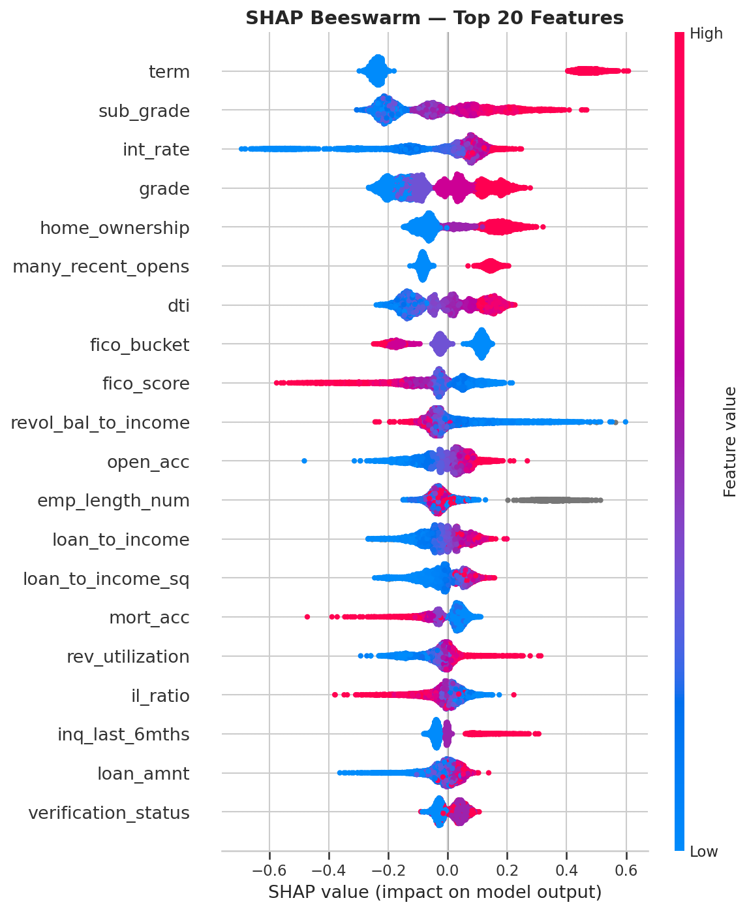
:::

::: {.column-page}
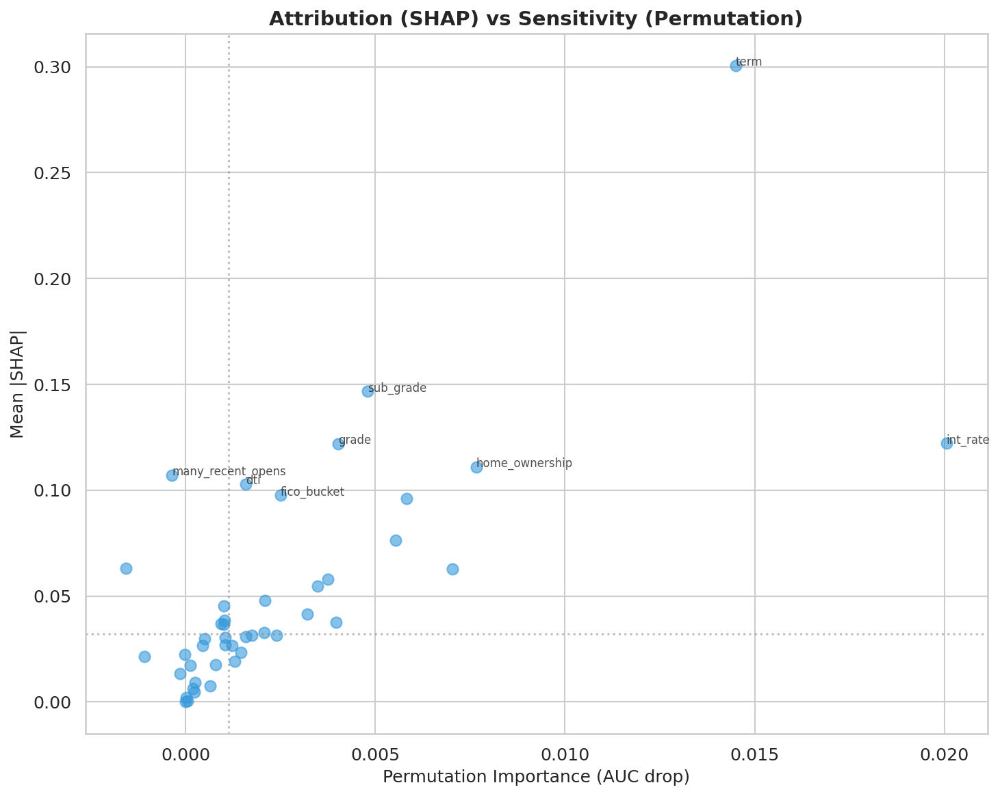
:::

Las figuras `fig-shap-beeswarm` y `fig-shap-vs-permutation` convierten la narrativa global en evidencia visual: no solo sabemos qué variables aparecen arriba, sino cómo se distribuye su efecto y qué tan sensible es el desempeño a perturbarlas.

### Atribución no es lo mismo que sensibilidad

SHAP dice cuánto contribuye una variable al score promedio; permutation importance dice cuánto cae el AUC si la señal se rompe. Esa distinción evita sobreinterpretaciones. Por ejemplo:

| Variable | \|SHAP\| medio | `auc_drop` por permutación |
|---|---:|---:|
| `int_rate` | 0.4066 | 0.0754 |
| `term` | 0.2921 | 0.0144 |
| `home_ownership` | 0.1155 | 0.0096 |
| `fico_score` | 0.2262 | 0.0088 |

: Atribución vs sensibilidad

`int_rate` domina en ambas métricas, lo que la convierte en el driver más robusto del sistema. `term`, en cambio, tiene una atribución alta pero una sensibilidad menor: empuja muchas predicciones, aunque el desempeño agregado no colapsa si se degrada parcialmente.

::: {.callout-note}
## Regla de lectura
Cuando una variable es alta en SHAP y alta en permutación, suele ser una señal estructural. Cuando es alta en SHAP pero moderada en permutación, puede estar capturando contexto frecuente más que dependencia crítica del modelo.
:::

| Cuadrante | Cómo leerlo | Ejemplo típico en el proyecto |
|---|---|---|
| Alta atribución + alta sensibilidad | Driver estructural: explica mucho y romperlo daña el modelo | `int_rate` |
| Alta atribución + sensibilidad moderada | Señal frecuente, importante para muchas predicciones, pero no única | `term` |
| Baja atribución + alta sensibilidad | Feature de apoyo que se vuelve crítica en ciertos segmentos | Algunas señales de historial crediticio |
| Baja atribución + baja sensibilidad | Señal secundaria, útil más por contexto que por dependencia fuerte | Variables auxiliares del perfil del hogar |

: Taxonomía maestra de interpretabilidad: atribución vs sensibilidad

### Forma funcional con ALE

Las curvas ALE (`ale_curves.parquet`) son la verificación de monotonía y estabilidad que complementa SHAP. Para `int_rate`, el efecto local acumulado pasa de negativo a positivo alrededor del rango 11-12%, consistente con una lectura económica razonable: tasas bajas suelen asociarse a prestatarios más seguros y tasas altas a mayor riesgo esperado.

La ventaja de ALE frente a PDP es que reduce la distorsión por correlación entre variables. En un problema crediticio donde `int_rate`, `fico_score` y `grade` están ligados, esa precaución no es opcional.

::: {.column-page}
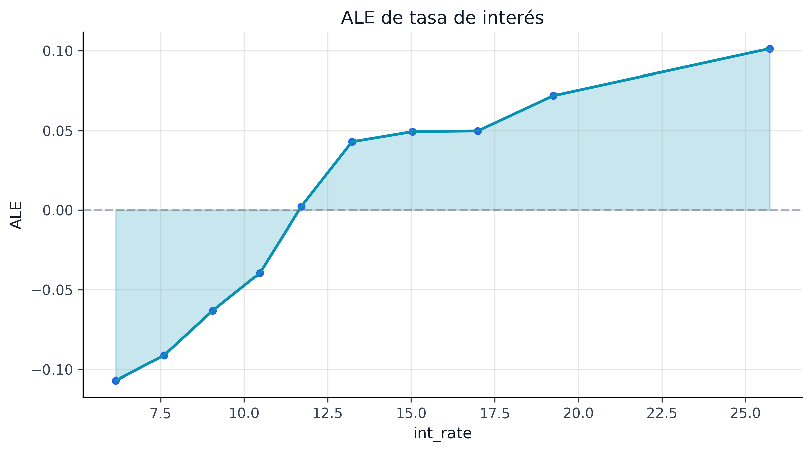
:::

::: {.column-page}
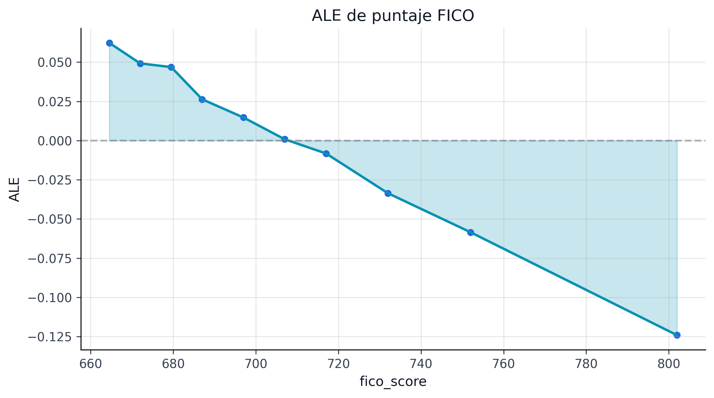
:::

::: {.column-page}
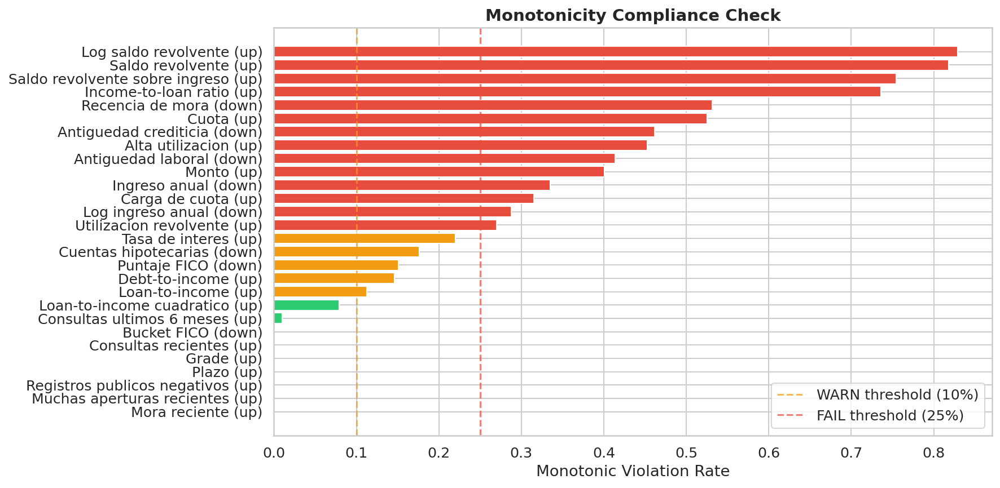
:::

### Familias de variables y controlabilidad

El resumen global también clasifica cada feature por familia y controlabilidad:

- `pricing`: variables de precio y contrato que pueden modificarse por política.
- `credit_quality`: señales históricas del prestatario, no controlables por originación.
- `capacity`: capacidad financiera y carga de deuda.
- `household_profile`: contexto del hogar y estabilidad.

Esta taxonomía permite separar dos conversaciones distintas:

1. qué explica el modelo;
2. qué puede ajustar el negocio para mover el riesgo observado.

::: {.column-page}
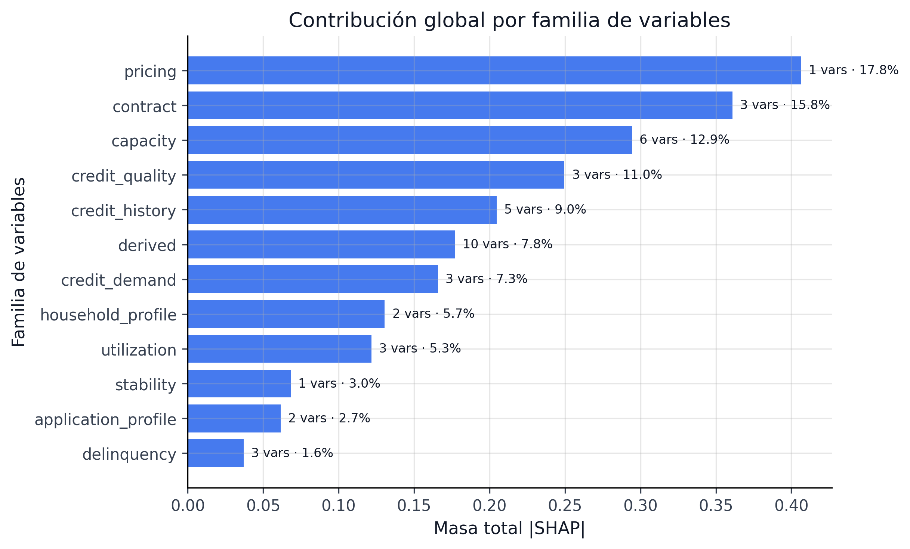
:::

::: {.column-page}
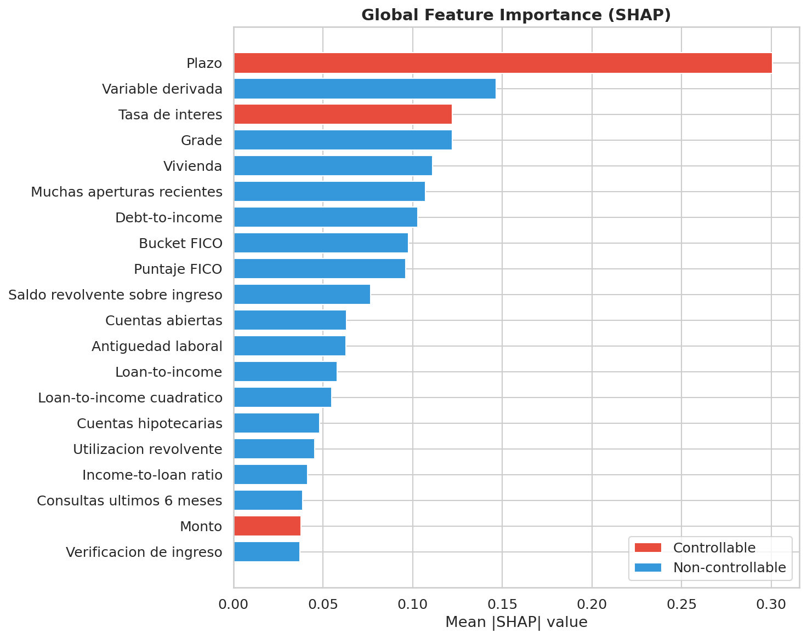
:::

En particular, `int_rate` y `term` aparecen como variables controlables. Eso es útil para pricing y diseño de oferta, pero exige vigilancia para no caer en una retroalimentación circular entre precio, selección y riesgo.

| Familia | Controlabilidad | Uso editorial en el libro |
|---|---|---|
| `pricing` | Alta | Palancas reales de política comercial y simulación causal |
| `credit_quality` | Baja | Contexto estructural del prestatario; no debe venderse como palanca de intervención |
| `capacity` | Media | Puede detonar documentación o filtros de elegibilidad, no siempre cambio de precio |
| `household_profile` | Baja-media | Aporta estabilidad descriptiva y vigilancia, más que acción directa |

: Atribución y grado de controlabilidad para lectura de negocio

### Apertura metodológica defendible

La lección principal de este capítulo es que el modelo sí puede defenderse globalmente:

- usa drivers económicamente plausibles;
- muestra coherencia entre atribución y sensibilidad;
- conserva monotonías esperadas en variables críticas;
- ofrece una base estable para reason codes locales y monitoreo de drift.

### Forma funcional: Curvas ALE

Las curvas ALE (*Accumulated Local Effects*) muestran cómo cambia la predicción promedio del modelo a lo largo del rango de cada variable, aislando su efecto de las correlaciones con otras features. A diferencia de los PDP (*Partial Dependence Plots*), las curvas ALE no sufren de extrapolación en zonas de baja densidad.

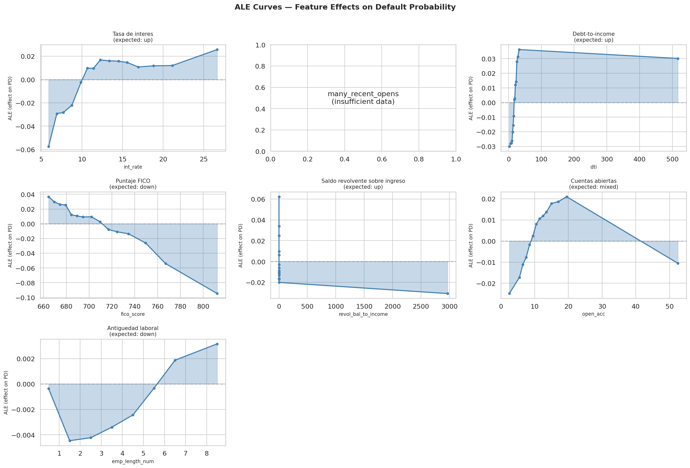

La `fig-ale-curves` complementa los rankings SHAP con información sobre *dirección y forma*: `int_rate` tiene un efecto monotónicamente creciente (como se espera), `fico_score` tiene un efecto decreciente con pendiente más pronunciada debajo de 680, y `dti` muestra un umbral no lineal alrededor de 25% donde el riesgo acelera.

El siguiente paso es bajar de esta vista de portafolio a casos concretos, donde la pregunta deja de ser "qué mueve al modelo en promedio" y pasa a ser "por qué este préstamo quedó donde quedó".

## Fuente curada: `book/chapters/11-explainability/11b-local-explanations.qmd`

## Explicaciones Locales

Las explicaciones locales convierten una predicción en una decisión discutible y trazable. Para originación, challenger review y atención a auditoría, la pregunta no es solo cuánto riesgo tiene un préstamo, sino **qué razones concretas empujaron esa evaluación**.

### Casos representativos disponibles

El artefacto `shap_local_cases.parquet` contiene 60 filas que describen préstamos representativos en distintos segmentos. Cada registro incluye:

- `grade` e `issue_quarter` para contexto temporal;
- PD puntual y bandas conformales al 90% y 95%;
- razones positivas y negativas a nivel de feature;
- familia de feature y marca de controlabilidad.

Un caso de bajo riesgo del cuarto trimestre de 2019 ilustra bien el enfoque:

| Campo | Valor |
|---|---|
| Segmento | `bajo_riesgo` |
| Grade | `A` |
| PD calibrada | 5.64% |
| Intervalo 90% | [0.00%, 18.14%] |
| Principales razones a favor | FICO alto, tasa baja, plazo 36 meses |

: Ejemplo de explicación local defendible

En este préstamo, el FICO de 767 y la tasa de 8.19% empujan fuertemente el score hacia abajo. El resultado es intuitivo para negocio y consistente con la lectura global del capítulo anterior.

| Caso | Contexto | PD calibrada | Intervalo 90% | Drivers dominantes | Lectura operativa |
|---|---|---:|---|---|---|
| Aprobable con confianza | Grade A, plazo 36m, tasa baja | 5.64% | [0.00%, 18.14%] | FICO alto, tasa baja, menor presión financiera | Decisión relativamente estable; el intervalo es amplio pero sigue lejos de zona crítica |
| Zona gris | Grade C, plazo 60m, DTI alto | ≈ 18% | Banda moderada-alta | Tasa, plazo y capacidad se contrapesan | Conviene revisión manual o política más prudente |
| Riesgo alto con explicación consistente | Grade F/G, precio alto y estrés financiero | > 35% | Banda alta y desplazada | Precio, plazo largo, historial débil | Rechazo o pricing muy defensivo; no hace falta “explicar de más” para ver el problema |

: Tres minicasos que resumen cómo leer SHAP + PD + intervalo conformal

### Del SHAP a reason codes operativos

Una explicación local útil debe poder traducirse a reason codes. En este proyecto, la lógica narrativa se apoya en cuatro familias recurrentes:

| Familia | Cómo se comunica |
|---|---|
| `credit_quality` | Historial y calidad crediticia del solicitante |
| `capacity` | Presión financiera o capacidad de pago |
| `pricing` | Condiciones del contrato ofrecido |
| `household_profile` | Estabilidad del hogar y contexto del solicitante |

: Familias de reason codes

La ventaja de esta capa es doble. Primero, evita exponer al usuario final una lista cruda de variables. Segundo, mantiene consistencia entre la narrativa de comité y la evidencia técnica subyacente.

### Qué hace que una explicación local sea utilizable

En el contexto de riesgo crediticio, una explicación local útil debe cumplir al menos tres criterios:

1. ser coherente con la explicación global;
2. distinguir señales controlables de señales meramente descriptivas;
3. convivir con la banda de incertidumbre, no solo con la predicción puntual.

Ese tercer punto es central. Dos préstamos con la misma PD puntual pueden requerir tratamientos distintos si uno tiene un intervalo mucho más ancho que el otro. La explicación local no debe ocultar esa diferencia.

### Uso en revisión de casos

Las explicaciones locales sirven para tres momentos operativos:

| Momento | Pregunta de negocio | Uso de la explicación |
|---|---|---|
| Originación | ¿por qué este préstamo quedó en zona gris? | Identificar palancas de precio, plazo o documentación |
| Validación | ¿la razón local coincide con la teoría del modelo? | Detectar atajos o señales no plausibles |
| Auditoría | ¿puedo reconstruir la decisión? | Asociar score, intervalo y drivers a un caso concreto |

: Usos operativos de explicaciones locales

### Limitaciones

Las explicaciones locales no prueban causalidad. Describen cómo el modelo usó la información disponible, no qué cambiaría realmente el outcome del prestatario en el mundo real. Por eso este libro mantiene separadas las capas de interpretabilidad y la capa de inferencia causal.

También hay que evitar una falsa sensación de precisión: un *reason code* es más convincente cuando aparece junto a su contexto de incertidumbre. En este proyecto, la práctica recomendada es presentar siempre el trío:

1. PD calibrada,
2. intervalo conformal,
3. top drivers locales.

Con esa convención, la explicación deja de ser una nota anecdótica y se convierte en un artefacto formal de decisión.

## Fuente curada: `book/chapters/11-explainability/11c-explanation-drift.qmd`

## Drift de Explicaciones

La estabilidad de un modelo no se evalúa solo por AUC o cobertura. Un sistema puede conservar desempeño aceptable mientras cambia silenciosamente la narrativa de por qué decide. Ese riesgo es especialmente sensible en crédito, donde comités y validadores esperan continuidad económica en los drivers.

### Qué se monitorea

El artefacto `explanation_drift.parquet` compara un periodo de referencia amplio (`2018Q1`-`2019Q3`) con un periodo de contraste (`2019Q4`-`2020Q3`). La evaluación resume tres preguntas:

1. ¿se conservan los top drivers globales?
2. ¿cambió materialmente la distribución SHAP de los drivers críticos?
3. ¿los reason codes dominantes siguen contando la misma historia?

### Resultado del snapshot actual

| Indicador | Valor | Lectura |
|---|---:|---|
| `rank_overlap_top10` | 1.00 | Mismo top 10 global |
| `avg_shap_psi_top5` | 0.0491 | Cambio pequeño en masa SHAP |
| `max_shap_psi_top5` | 0.0757 | Sin desplazamiento severo |
| `reason_code_match_rate` | 1.00 | Reason codes líderes estables |
| `passed_all` | `True` | Snapshot en verde |

: Resumen de drift explicativo

Los detalles internos muestran que `int_rate`, `term`, `fico_score`, `dti` y `home_ownership` siguen siendo el corazón del modelo. Ese resultado es valioso porque el periodo de comparación incluye un entorno de mercado más exigente.

### Por qué esto importa para gobernanza

Si el ranking de drivers cambia abruptamente, aparecen dos hipótesis incómodas:

- el modelo empezó a explotar una señal espuria;
- el proceso de datos cambió y ya no estamos midiendo el mismo fenómeno.

El drift explicativo funciona entonces como una alarma temprana entre el monitoreo de datos y el monitoreo de performance. No sustituye PSI, KS o cobertura conformal, pero complementa esos controles con una capa semántica.

::: {.callout-tip}
## Señal de confianza
Un `rank_overlap_top10 = 1.00` no significa “inmutabilidad total”; significa que la narrativa económica principal del modelo sobrevivió al cambio de periodo. Eso aumenta la defendibilidad del sistema frente a revisores humanos.
:::

### Relación con drift de datos

El capítulo de monitoreo de datos ya mostró que varias variables experimentan desplazamientos detectables por KS o CvM. El punto interesante es que esos movimientos no se tradujeron, por ahora, en una ruptura del mapa explicativo central. La lectura útil es simple: **puede haber drift de datos sin que todavía haya drift explicativo severo**.

Esta separación permite respuestas más finas. No toda alerta de datos requiere reentrenamiento inmediato; algunas pueden manejarse con observación reforzada si la lógica explicativa y la cobertura siguen siendo estables.

| Si observamos... | Entonces conviene... |
|---|---|
| Drift de datos sin drift explicativo ni pérdida de cobertura | Reforzar monitoreo, no necesariamente reentrenar |
| Drift explicativo con performance estable | Abrir challenger review: el modelo puede seguir “acertando” por razones peores |
| Drift explicativo + caída de cobertura/performance | Activar escalamiento MRM y revisión de datos/artefactos |

: Caja de decisión para drift explicativo y challenger review

La tabla anterior merece una lectura operativa más detallada, porque la tentación natural de un equipo de riesgo es tratar toda alerta de drift como señal de reentrenamiento. La primera fila (drift de datos sin consecuencia explicativa ni de performance) es el caso más frecuente y el más mal gestionado: en un portafolio vivo, variables como `int_rate` se mueven constantemente con el ciclo de tasas, y `fico_score` experimenta desplazamientos estacionales. Si el modelo sigue explicando con los mismos drivers y cubriendo con la misma fidelidad, ese movimiento es ruido de entorno, no degradación del modelo. La respuesta correcta es documentar la alerta en el log de monitoreo y programar revisión en el próximo ciclo trimestral — no interrumpir la producción. La segunda fila es la más insidiosa: el modelo sigue "acertando" (AUC estable, cobertura estable) pero cambió *por qué* acierta. Esto puede significar que una variable proxy reemplazó a un driver legítimo, lo cual es un riesgo regulatorio aunque no estadístico. La respuesta correcta aquí es abrir un challenger review formal: comparar las waterfall SHAP del período actual contra el de referencia, verificar si los nuevos drivers tienen sentido económico, y decidir si el modelo necesita reentrenamiento o si el cambio es una adaptación legítima. La tercera fila es la única que justifica escalamiento inmediato al comité MRM, porque la combinación de drift explicativo con caída de performance indica que el modelo ya no funciona *y* que dejó de funcionar por razones distintas a las que lo hicieron funcionar originalmente.

### Limitaciones

El snapshot actual es corto y agregado. Todavía falta:

1. ampliar la comparación por segmento y por grade;
2. medir estabilidad trimestral continua, no solo dos ventanas agregadas;
3. vincular alertas explicativas con reglas automáticas de escalamiento en MRM.

Pese a ello, el estado actual ya mejora mucho la práctica usual: el proyecto no solo reporta qué tan bien predice el modelo, sino si sigue contando la misma historia económica a lo largo del tiempo.

## Fuente curada: `book/chapters/12-dataset-360/index.qmd`

::: {.whole-game-intro}
<span class="whole-game-question">Pregunta central</span>

¿Qué significa realmente “Dataset 360°” en este proyecto? No significa “más gráficos exploratorios”. Significa que el mismo Lending Club puede leerse como problema de segmentación, serie temporal, laboratorio de interpretabilidad, objeto causal, plataforma de provisión IFRS9 y benchmark frente a literatura.

Ejemplo concreto: una misma cohorte de préstamos aparece como estructura de `grade × term` en EDA, como trayectoria de default en forecasting, como driver SHAP en interpretabilidad y como exposición a stage en IFRS9. Esta landing existe para unir esas caras en una historia única.
:::

| Lente sobre el dataset | Pregunta que responde | Dónde se profundiza |
|---|---|---|
| Estructura básica | Qué tan grande, heterogéneo y desbalanceado es el problema | 51 |
| Geografía y tiempo | Cómo cambia el riesgo por estado, cohorte y régimen | 52 |
| Benchmark externo | Qué tan competitivos son nuestros resultados frente a Lending Club en la literatura | 53 |
| Modelado / incertidumbre / causalidad | Qué otras caras del mismo dataset aparecen en el resto del libro | Capítulos 5 al 13 |

: Dataset 360° como puente entre pipeline e insights factory

## Qué aporta esta parte

- ofrece una lectura sintética del dataset antes de los análisis avanzados;
- recoge hallazgos que luego reaparecen en modelado, conformal, IFRS9 y causalidad;
- conecta nuestros resultados con lo que ya se ha publicado sobre Lending Club.

## Navegación curada

```html
<div class="capítulo-landing-grid">
  <div class="capítulo-card"><h4><a href="12a-eda-highlights.html">51. EDA</a></h4><p>Magnitud, composición y gradientes de riesgo.</p></div>
  <div class="capítulo-card"><h4><a href="12b-geographic-temporal.html">52. Geo-Temporal</a></h4><p>Estados, cohortes y dinámica por periodo.</p></div>
  <div class="capítulo-card"><h4><a href="12c-literature-benchmark.html">53. Benchmark</a></h4><p>Métricas frente a estudios publicados con Lending Club.</p></div>
</div>
```

> Nota curatorial: el cierre editorial compartido del libro original se omitió aquí para mantener este dossier independiente y centrado en CRPTO.

## Fuente curada: `book/chapters/12-dataset-360/12a-eda-highlights.qmd`

## Hallazgos Clave del EDA

El EDA del proyecto no es una introducción decorativa; fija el contrato de realidad sobre el que descansan todos los capítulos posteriores. Antes de modelar, conviene dejar congelados tres hechos: el tamaño del universo, la tasa de default y el gradiente económico del riesgo.

### Universo analítico

En el split de entrenamiento usado para construcción de features y modelado principal, el artefacto `eda_summary.json` reporta:

| Indicador | Valor |
|---|---:|
| Préstamos analizados | 1,346,311 |
| Tasa global de default | 18.52% |
| Registros con plazo 36m | 1,005,656 |
| Registros con plazo 60m | 340,655 |

: Radiografía del dataset de entrenamiento

La mezcla de plazos confirma que el problema no es homogéneo: una porción material del portafolio está expuesta a horizontes contractuales largos, lo que justifica el uso posterior de supervivencia, IFRS9 lifetime y escenarios temporales.

::: {.column-page}
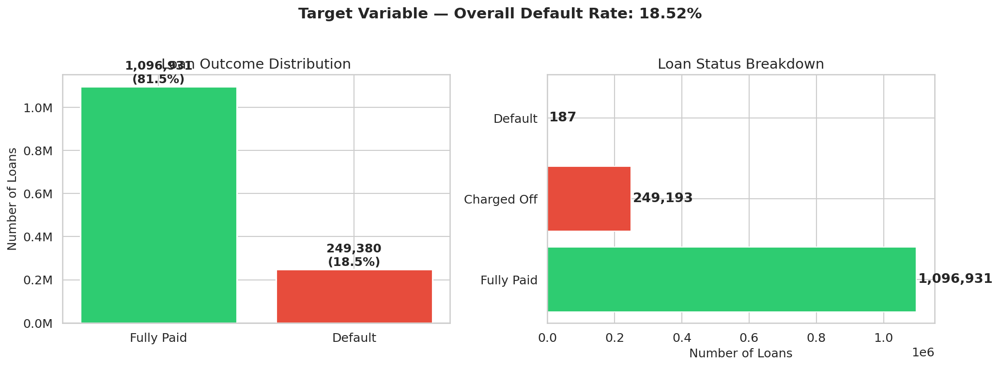
:::

La figura `fig-target-distribution` cumple una función de onboarding: antes de discutir modelos sofisticados, deja claro que estamos frente a un problema desbalanceado pero no extremo, donde el default es lo bastante frecuente como para exigir calibración y lo bastante costoso como para no tratarlo como ruido.

### Gradiente de riesgo por grade

La señal más importante del EDA es el orden económico del default por grade:

| Grade | Default rate |
|---|---:|
| A | 5.63% |
| B | 12.29% |
| C | 20.64% |
| D | 28.31% |
| E | 36.47% |
| F | 43.44% |
| G | 47.71% |

: Gradiente de riesgo por grade

Este patrón valida dos decisiones estructurales del libro:

1. usar `grade` como partición natural para análisis conformales y lectura prudencial;
2. tratar la tasa de interés y el precio de originación como variables centrales de interpretación.

La diferencia de 42pp entre Grade A (5.63%) y Grade G (47.71%) es la razón empírica directa por la que el sistema conformal usa **partición Mondrian por grade** en lugar de un cuantil global (`sec-mondrian`): los scores de no-conformidad tienen distribuciones estructuralmente distintas por grade, y un cuantil global inevitablemente sub-cubre en los grades de alto riesgo o sobre-cubre en los de bajo riesgo.

::: {.column-page}
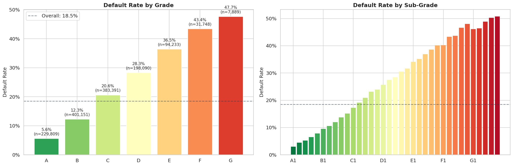
:::

::: {.column-page}
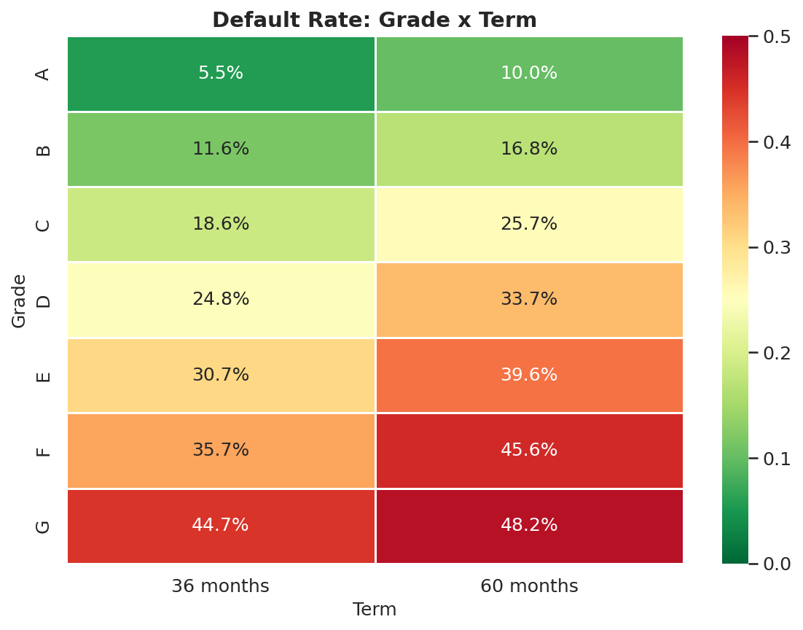
:::

Las figuras `fig-default-rate-grade` y `fig-grade-term-default` hacen visible el orden económico que luego reaparece en conformal, IFRS9 y optimización: el dataset sí tiene una estructura de riesgo interpretable y consistente. También muestran algo importante para negocio: el plazo de 60 meses no es solo “más largo”, sino un régimen claramente más exigente para varios grades.

### Lecturas que sí importan

El EDA deja tres mensajes prácticos:

- el riesgo no está uniformemente distribuido;
- existe una mezcla fuerte de segmentos, no un “prestatario promedio” representativo;
- cualquier validación aleatoria sería demasiado optimista frente a la dinámica temporal real.

Por eso el pipeline se apoya en *out-of-time validation* y no en validación IID ingenua.

### Variables con contenido económico

Aunque el dataset es amplio, el proyecto organiza la historia en torno a unas pocas familias con interpretación clara:

| Familia | Variables emblemáticas | Papel en la narrativa |
|---|---|---|
| Precio / contrato | `int_rate`, `term` | Resumen del riesgo percibido en originación |
| Calidad crediticia | `fico_score`, historial | Solvencia previa del cliente |
| Capacidad | `dti`, ingreso | Presión financiera |
| Perfil del hogar | `home_ownership`, verificación | Estabilidad y contexto |

: Familias con valor narrativo y operativo

| Señal observada en el EDA | Ejemplo en Lending Club | Qué capítulo la retoma |
|---|---|---|
| Riesgo creciente por `grade` | `A` ≈ 5.6% vs `G` ≈ 47.7% de default | Conformal, IFRS9, fairness |
| Riesgo creciente por `term` | 60m empeora el perfil dentro de varios grades | Survival, pricing, portafolio |
| Mezcla de producto heterogénea | No todos los propósitos tienen el mismo riesgo ni el mismo monto | Dataset 360, causalidad, optimización |
| Desbalance moderado | 18.5% de default, no un evento ultra-raro | Calibración, métricas, A/B |

: Cómo el EDA se convierte en decisiones metodológicas posteriores

### Qué habilita este capítulo

Con este diagnóstico, el resto del libro deja de depender de intuiciones blandas. El EDA justifica:

- la ingeniería de variables posterior;
- la partición temporal train/cal/test;
- la elección de métricas y grupos para fairness, drift y cobertura;
- la lectura prudencial de los resultados IFRS9.

El objetivo no es “mostrar gráficos bonitos”, sino fijar el terreno sobre el cual una decisión de riesgo puede ser defendida.

## Fuente curada: `book/chapters/12-dataset-360/12b-geographic-temporal.qmd`

## Análisis Geográfico y Temporal

La heterogeneidad geográfica y temporal es una de las razones por las que este problema no puede tratarse como una tabla tabular estática. El mismo score puede significar cosas distintas cuando cambia el estado, el ciclo crediticio o el régimen macroeconómico.

### Cobertura geográfica

El artefacto `state_aggregates.parquet` resume 51 jurisdicciones. La dispersión es amplia tanto en volumen como en default:

| Estado | N préstamos | Default rate | Volumen total |
|---|---:|---:|---:|
| CA | 264,525 | 19.47% | \$3.94B |
| AZ | 45,521 | 19.03% | \$0.64B |
| AL | 22,802 | 22.72% | \$0.32B |
| AR | 14,087 | 23.62% | \$0.19B |
| AK | 4,343 | 18.97% | \$0.07B |

: Muestra del agregado geográfico

La presencia de estados con mucho menor soporte muestral también es una advertencia metodológica: no toda heterogeneidad observable amerita una partición operacional. En varios capítulos posteriores se privilegia `grade` como grupo Mondrian precisamente porque tiene mejor estabilidad y sentido regulatorio.

| Lo que muestra la geografía | Lo que no conviene sobrerreaccionar | Lectura útil para el libro |
|---|---|---|
| Algunos estados combinan más volumen y más default | No toda diferencia estatal justifica una política separada | Usar geografía como contexto, no como partición principal del pipeline |
| Hay jurisdicciones con soporte muestral bajo | Un grupo pequeño puede inducir falsas señales | Preferir grupos con estabilidad y semántica de negocio como `grade` |

: Cómo leer la geografía sin sobreprometer segmentación

La tentación de segmentar por estado es comprensible: la diferencia entre Alabama (22.72% default rate) y Alaska (18.97%) parece material y accionable. Pero esa tentación esconde un riesgo conocido en la industria bancaria: la sobre-segmentación geográfica produce modelos que capturan idiosincrasias locales (regulación estatal de intereses, composición sectorial) a costa de estabilidad temporal. Un modelo calibrado para California no se comportará igual cuando el mercado inmobiliario de California se mueva — y si la partición conformal también se hace por estado, los grupos con bajo soporte muestral (Alaska con 4,343 préstamos, Arkansas con 14,087) producirán intervalos inestables que oscilarán entre excesiva estrechez y excesiva amplitud según la composición del set de calibración. Los reguladores (OCC, BCE) generalmente aceptan segmentaciones geográficas solo cuando el banco puede demostrar que la señal geográfica es estable en el tiempo y que el soporte muestral por grupo es suficiente para sostener las garantías estadísticas del modelo. En este proyecto, `grade` cumple ambas condiciones mejor que `state`: tiene 7 niveles (no 51), cada nivel tiene soporte muestral robusto, y su semántica de riesgo es directamente interpretable por un comité. La geografía, en cambio, aporta su máximo valor como variable de contexto — útil para entender *por qué* un segmento se comporta de cierta manera, no como eje principal de partición.

### No estacionariedad temporal

El proyecto usa una división temporal explícita, no un *shuffle split*. La narrativa sincronizada con la tesis fija el esquema canónico:

| Split | Filas | Periodo narrativo |
|---|---:|---|
| Train | 1,346,311 | 2007-2017 |
| Calibration | 237,584 | Ventana de ajuste intermedia |
| Test OOT | 276,869 | 2018-2020 |

: Esquema temporal del pipeline

Esta estructura cumple dos objetivos. Primero, evita contaminación entre desarrollo y evaluación. Segundo, reproduce la forma en que un banco realmente desplegaría el modelo: entrenando en historia conocida y enfrentándolo luego a un periodo futuro.

::: {.column-page}
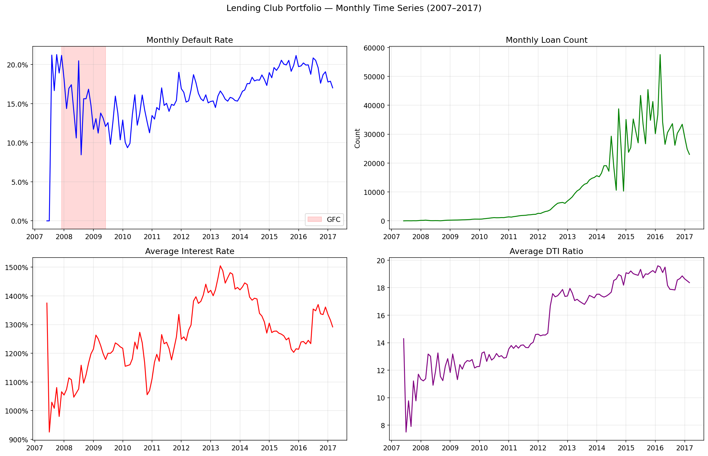
:::

La figura `fig-portfolio-time-overview` ayuda a leer el capítulo con ojos de negocio: el portafolio cambia en volumen, precio promedio y fragilidad financiera. Por eso el test más creíble del libro nunca es aleatorio; siempre es temporal.

### La geografía no es solo un mapa

En crédito, el estado resume mezcla de regulación local, composición sectorial, mercado laboral y comportamiento del prestatario. Sin embargo, este libro evita sobredimensionar esa dimensión. La lectura correcta es:

- la geografía aporta contexto;
- el tiempo aporta el verdadero test de robustez;
- la combinación de ambos obliga a monitoreo continuo.

### Por qué la validación temporal manda

La evidencia de drift en variables como `fico_score` e `int_rate` confirma que el portafolio cambia en el tiempo. Si a eso se suma la heterogeneidad por estado, el costo de ignorar la dimensión temporal sería alto:

$$
\text{validación aleatoria} \;\Rightarrow\; \text{optimismo artificial en desempeño y cobertura}
$$

Por eso los resultados fuertes del libro se reportan siempre en ventanas OOT o con trazabilidad temporal explícita.

### Implicación para capítulos posteriores

Este capítulo habilita tres decisiones de diseño:

1. monitoreo de drift con PSI, KS y CvM;
2. cobertura conformal evaluada por cohorte temporal y por grupo;
3. escenarios IFRS9 y proyecciones ECL como extensiones naturales del análisis temporal.

La conclusión de fondo es sencilla: el dataset no es solo grande; es dinámico y heterogéneo. El pipeline completo fue construido para respetar esa realidad.

## Fuente curada: `book/chapters/12-dataset-360/12c-literature-benchmark.qmd`

## Benchmark contra Literatura

El valor de este libro no depende de superar un leaderboard aislado. Aun así, es importante ubicar el resultado del pipeline frente a referencias publicadas para evitar dos errores opuestos: vender de más lo conseguido o subestimar su relevancia.

### Punto de comparación disponible

El artefacto `lendingclub_literature_benchmark.parquet` registra una referencia explícita revisada por pares sobre Lending Club:

| Fuente | Familia de modelo | AUC reportado |
|---|---|---:|
| Li et al. (2022, benchmark Lending Club) | LightGBM / Gradient Boosting | 0.7492 |
| Survey de explicabilidad P2P | Árboles + SHAP/LIME | n/a |

: Benchmark externo curado para Lending Club

Nuestro pipeline canónico reporta `AUC = 0.7124` para CatBoost calibrado con Venn-Abers sobre evaluación OOT.

### Comparación correcta, no tramposa

La diferencia entre 0.7124 y 0.7492 **no** debe leerse automáticamente como inferioridad metodológica. Hay al menos tres razones:

1. el protocolo de split puede no coincidir;
2. el objetivo del proyecto no es solo maximizar AUC, sino producir probabilidades calibradas y gobernables;
3. el libro optimiza un pipeline completo con incertidumbre, IFRS9, explicabilidad y robustez, no solo clasificación.

En otras palabras, una comparación honesta requiere comparar tanto el contexto experimental como el producto final de decisión.

::: {.callout-note}
## Métrica líder vs sistema líder
Una AUC más alta puede coexistir con peor calibración, peor cobertura y menor capacidad de auditoría. Este libro privilegia el sistema líder, no la métrica líder aislada.
:::

### Dónde sí hay fortaleza comparativa

Aunque el AUC puro no busque romper el techo de la literatura, el proyecto sí aporta en dimensiones poco cubiertas por benchmarks clásicos:

- calibración probabilística explícita con Venn-Abers;
- cuantificación de incertidumbre conformal con cobertura observable;
- conexión operacional a optimización robusta e IFRS9;
- monitoreo de fairness y drift dentro del mismo marco narrativo.

Estas capas son justamente las que suelen faltar en papers de scoring centrados solo en clasificación.

### Lectura académica

La literatura más reciente que el proyecto curó en `docs/research/foundations/crpto_references_state_of_art.md` sugiere que los vacíos están menos en “otro modelo tabular para Lending Club” y más en las combinaciones:

1. conformal + robust optimization;
2. conformal + IFRS9 / SICR;
3. cobertura por subgrupo en crédito real;
4. gobernanza reproducible de punta a punta.

Ese es el espacio donde el libro y los papers derivados son más competitivos.

### Conclusión

El benchmark externo sirve como calibrador de humildad: el pipeline no pretende vender un nuevo récord absoluto de AUC. Su contribución más defendible es distinta: convertir un stack de riesgo crediticio en un sistema calibrado, explicable, incierto-de-forma-medible y gobernable.
