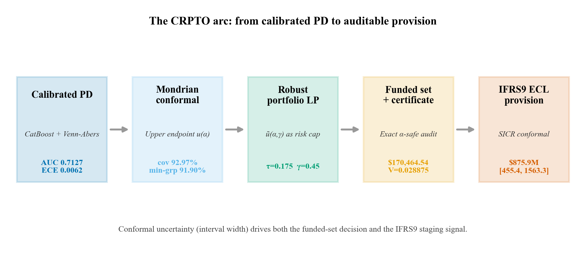

# ECL bajo incertidumbre conformal {#sec-crpto-ecl}

Los capítulos anteriores llevan la incertidumbre conformal desde la PD calibrada
hasta la decisión de portafolio. Este capítulo cierra el arco económico hasta su
destino regulatorio natural: la **provisión por pérdida esperada** (Expected
Credit Loss, ECL) bajo IFRS9. Es el "¿y entonces qué?" del crédito —porque una
PD con intervalos no solo cambia a quién se financia, también cambia cuánto
capital hay que reservar.

Como el resto del [cierre de tesis](28-resultados-auxiliares.qmd), esto es
evidencia auxiliar y diagnóstica: no es la política de provisión contractual del
proyecto, y cada cifra proviene del artefacto congelado
`ifrs9_scenario_summary.parquet`. Su valor es narrativo: muestra que la cadena
PD → conformal → decisión no se detiene en el funded set, sino que tiene una
consecuencia medible en el balance.

{#fig-crpto-arc width="100%" fig-alt="Diagrama de flujo de cinco etapas: PD calibrada (AUC 0.7127), conformal Mondrian (cobertura 92.97%), LP robusto (tau 0.175, gamma 0.45), funded set con certificado ($170,464.54, V=0.028875) y provisión ECL IFRS9 ($875.9M)."}

## De la PD calibrada a la provisión

Bajo IFRS9 cada préstamo aporta a la provisión según

$$
\text{ECL}_i = \text{PD}_i^{\text{eff}} \times \text{LGD}_i \times \text{EAD}_i \times \text{DF},
$$

con LGD base de `0.45`, EAD igual a la exposición, y DF el factor de descuento. La
PD efectiva depende del *stage*: 12 meses en Stage 1, lifetime en Stage 2 (cuando
se detecta un aumento significativo de riesgo, SICR), y ~1 en Stage 3 (default
confirmado).

La conexión con CRPTO es directa y es la razón de incluir este capítulo: **el
ancho del intervalo conformal entra como una señal SICR adicional**. Un préstamo
con intervalo ancho y PD no decreciente migra a Stage 2 aunque su incremento
absoluto de PD no cruce el umbral clásico. La incertidumbre epistémica deja de ser
un diagnóstico tardío y se convierte en un disparador de prudencia contable —el
mismo principio que gobierna el funded set, ahora aplicado a la reserva.

## ECL por escenario macro

El artefacto evalúa cuatro escenarios sobre el mismo OOT de 276 869 préstamos,
escalando la PD por un multiplicador macro. La tabla reporta el ECL puntual y su
**intervalo conformal propagado** (`low`/`high`), además del desplazamiento de
staging.

| Escenario | PD mult | ECL puntual | Intervalo conformal | Stage 1 / 2 / 3 |
|---|---:|---:|---|---:|
| Baseline | `1.02` | `$875.9M` | `[$455.4M, $1,563.3M]` | `29.4% / 48.1% / 22.5%` |
| Mild stress | `1.17` | `$1,033.0M` | `[$483.2M, $1,714.2M]` | `21.8% / 55.7% / 22.5%` |
| Adverse | `1.32` | `$1,220.2M` | `[$525.8M, $1,901.1M]` | `16.4% / 61.2% / 22.5%` |
| Severe | `1.58` | `$1,487.9M` | `[$584.9M, $2,179.2M]` | `9.2% / 68.3% / 22.5%` |

: ECL por escenario macro con intervalos conformales propagados. Del baseline al
severe, el ECL sube **+69.9%**, impulsado por la migración de préstamos de Stage 1
a Stage 2 (lifetime PD) a medida que el estrés aprieta.

Dos lecturas importan para la tesis:

1. **El estrés se transmite por staging, no solo por el multiplicador.** La
   participación de Stage 1 cae de 29.4% a 9.2% mientras Stage 2 sube de 48.1% a
   68.3%; Stage 3 (default confirmado) es estructural y no se mueve. La provisión
   crece porque más préstamos pasan a horizonte lifetime, exactamente el mecanismo
   que el SICR conformal busca anticipar.
2. **El intervalo conformal del ECL es ancho —y eso es honesto.** En el baseline,
   el rango `[$455.4M, $1,563.3M]` equivale a ~97.5% del valor puntual. Lejos de
   ser un defecto, es la cuantificación correcta: a nivel de cartera completa, la
   incertidumbre del PD se amplifica al propagarse a la provisión. Reportar ese
   rango es más defendible ante un comité que un único número puntual que finge
   precisión que el modelo no tiene.

## La dimensión temporal (diagnóstico)

El escenario incorpora una capa temporal —un pronóstico de la tasa de default
agregada (`AutoARIMA` para punto e intervalo)— que alimenta el multiplicador de
PD. En el proyecto esta capa tiene estatus **diagnóstico**, no oficial: documenta
cómo se *propagaría* la incertidumbre temporal al ECL, pero el panel es histórico
y estático, así que no se promueve como pronóstico productivo. Es la frontera
honesta del capítulo: muestra la maquinaria sin sobre-prometer un sistema de
forecasting en vivo.

## Por qué este capítulo pertenece a la tesis y no al paper

El paper IJDS termina en el certificado del funded set; la provisión IFRS9 sería
una segunda contribución que diluiría el claim quirúrgico. En la tesis, en cambio,
cierra el relato: la misma incertidumbre conformal que selecciona préstamos
también dimensiona la reserva, y el SICR conformal conecta ambas decisiones bajo un
único principio de prudencia. Es complemento, no repetición —y deja explícito que
la contribución del proyecto llega hasta donde el riesgo se vuelve capital
reservado.
