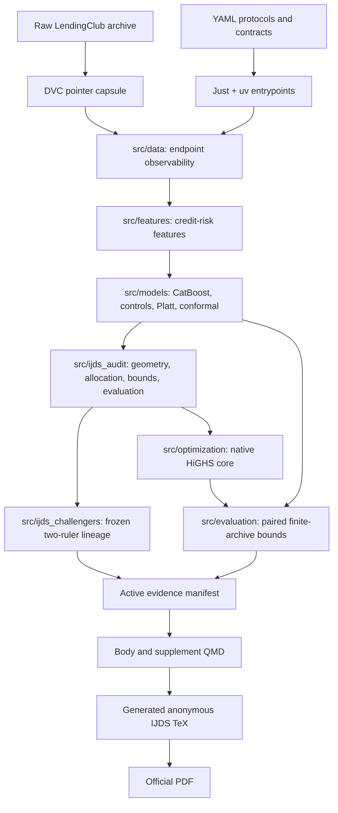

# CRPTO Architecture

CRPTO is one protocol-governed research pipeline and one IJDS manuscript. It is
not a service application. The source registry, claim ledger, and evidence
manifest separate scientific lineage from the current author toolchain.

## Package Responsibilities

| Package | Responsibility | Status |
| --- | --- | --- |
| `src/ijds_audit` | Active protocols, grids, exact geometry, evidence validation, and publication assembly | Active core |
| `src/ijds_challengers` | Outcome-free two-ruler frontier and its evaluated frozen lineage | Active evidence; name retained because protocol tags bind it |
| `src/models` | Maturity-safe CatBoost/Platt and binary conformal recipe | Active core |
| `src/optimization` | Native HiGHS allocation plus compatibility adapters | Native path active; Pyomo/cuOpt compatibility only |
| `src/evaluation` | Standardized payoff and sharp common-outcome contrast bounds | Active core |
| `src/data` and `src/features` | Endpoint reconstruction and origination-time feature contract | Active core plus path-bound compatibility |

Renaming `src/ijds_challengers` or deleting compatibility modules would add
wrappers while breaking protocol paths. The active publication contract, rather
than directory naming, is therefore the executable architecture authority.

## Dependency Layers

| Layer | Contents | Installation |
| --- | --- | --- |
| Scientific runtime | pandas, NumPy, PyArrow, SciPy, scikit-learn, CatBoost, OptBinning, HiGHS, OR-Tools, DuckDB, Matplotlib, PyYAML, Loguru | `uv sync --no-dev` |
| Tests | pytest, pytest-cov, Hypothesis | `uv sync --group test` |
| Quality | Ruff, mypy, pre-commit, pypdf | `uv sync --group quality` |
| Reproducibility | DVC with S3 support | `uv sync --group repro` |
| Compatibility | Pyomo | `uv sync --group compat` |
| Author environment | All four local groups | `uv sync --group dev` |

The active optimizer uses direct `highspy`, including basis reuse, basis
ranging, reduced costs, and deterministic single-thread checks. SciPy HiGHS is
a sparse fallback; OR-Tools GLOP is an independent finite-grid diagnostic;
Pyomo is lazy-loaded only for historical parity tests.

## Direct Library Decisions

Versions below are the resolution in `uv.lock` on 2026-07-20. "Feature use"
means the parts that matter for the active protocol, not an attempt to exercise
every API a package exposes.

| Library | Locked version | Active use and strongest relevant features | Decision |
| --- | ---: | --- | --- |
| pandas | 3.0.3 | Dated cohorts, strict joins, grouped censuses, categorical bins, and Parquet evidence tables | Indispensable; correctly central |
| NumPy | 2.4.6 | Vectorized score geometry, fixed quantiles, binary completion bounds, sparse-model arrays, and numerical reconciliation | Indispensable; correctly central |
| PyArrow | 25.0.0 | Parquet storage plus schema and row-group inspection for checkpoint validation | Indispensable storage layer; narrow use is appropriate |
| DuckDB | 1.5.4 | One-pass SQL profiling of the full raw CSV without materializing it as one pandas frame | Important and right-sized for the raw-data audit |
| SciPy | 1.17.1 | Sparse matrices and `linprog(method="highs")` as an independent fallback | Indispensable fallback; not duplicated as the primary solver |
| scikit-learn | 1.9.0 | Temporal logistic controls, Platt maps, pipelines, imputation, scaling, and discrimination/calibration metrics | Indispensable; uses the relevant compositional APIs |
| CatBoost | 1.2.10 | Native categorical features, time-aware ordering, balanced classes, Bernoulli subsampling, raw margins, and the monotonic control | Indispensable primary learner; deliberately fixed rather than retuned OOT |
| OptBinning | 0.21.0 | Closed WOE/IV `BinningProcess`, automatic monotone binning, exported bin tables, and two declared scorecards | Scientifically useful control; not a novelty or winner claim |
| HiGHS / highspy | 1.15.1 | Native sparse LPs, RHS reoptimization, basis ranging, reduced costs, deterministic threads, and exact frontier diagnostics | Indispensable optimization core; best-used library in the stack |
| OR-Tools | 9.11.4210 | Independent GLOP reconciliation of declared finite-grid allocations; also required by OptBinning | Justified diagnostic, not a second production optimizer |
| Matplotlib | 3.11.0 | Deterministic paper figures generated from registered evidence | Indispensable authoring dependency; upgrade only with visual parity |
| PyYAML | 6.0.3 | Executable protocols, source registry, claim ledger, and publication contracts | Indispensable governance layer |
| Loguru | 0.7.3 | Consistent run, checkpoint, and validation messages | Useful convenience; not scientifically load-bearing |

The author-only tools are deliberately outside the scientific runtime:

| Tool | Locked or installed version | Role | Decision |
| --- | ---: | --- | --- |
| pytest / pytest-cov | 9.1.1 / 7.1.0 | Unit, contract, regression, and branch-coverage gates | Indispensable |
| Hypothesis | 6.157.2 | Property checks for exact binary sharp-bound extrema and width identities | High-value targeted use; broader use is optional |
| Ruff | 0.15.22 | Formatting and linting in one pass | Indispensable; replaces overlapping formatters/linters |
| mypy / ty | 2.3.0 / 0.0.61 | Full strict type gate plus a fast independent active-surface check | Complementary; ty remains pinned and scoped while pre-1.0 |
| pre-commit | 4.6.0 | Hook configuration and local quality entrypoint | Useful; one hook manager is enough, so `prek` was removed |
| pypdf | 6.14.2 | Page size, blank-page, anonymity, abstract, and reference-start audits | Indispensable publication QA |
| DVC | 3.67.1 | Content-addressed scientific capsule and authenticated remote verification | Indispensable reproducibility tool, intentionally not runtime |
| Pyomo | 6.10.1 | Historical model parity and optional backend comparison | Overkill for the active path; retained only as lazy `compat` dependency |
| uv | 0.11.29 | Locked Python resolution, environments, tools, and command execution | Indispensable environment authority |
| Just | 1.56.0 | Small Windows-first command surface over locked commands | Indispensable orchestration; recipes must remain declarative |
| Quarto / TeX Live | 1.9.38 / 2026 | Reviewer previews and generated official INFORMS LaTeX/PDF | Indispensable publication toolchain |

No additional dataframe framework, experiment tracker, dependency injector,
workflow engine, formatter, or solver abstraction is warranted. Those would
duplicate a working boundary without improving an active estimand or gate.

## Publication Boundary

The body and supplement consume only
`reports/crpto/ijds_binary_geometry_frontier_v4_evidence.json`. That manifest
binds registered source artifacts, generated tables, generated figures, and the
executable claim ledger. Historical scripts and DVC stages may remain on disk
for path-bound verification but are absent from active commands and claims.
