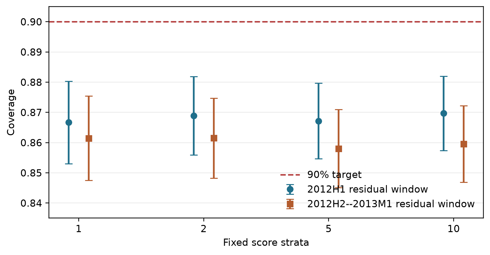
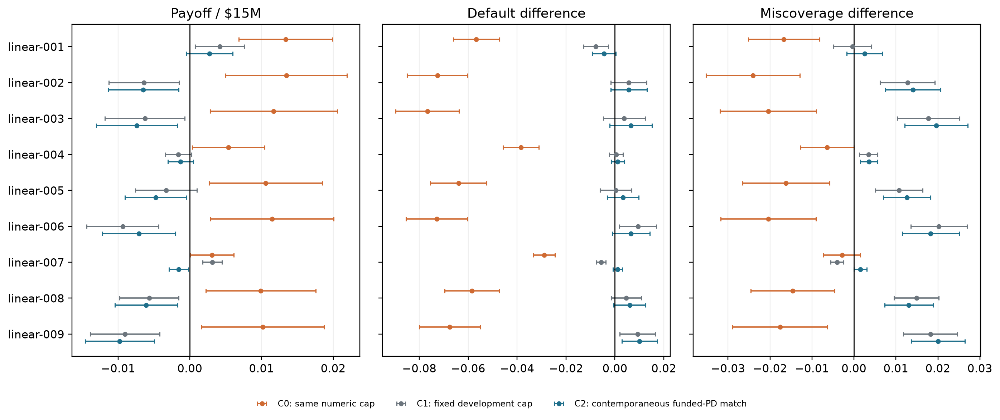
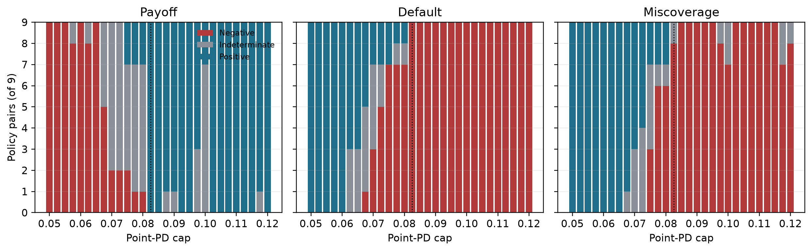

# Introduction {#sec-introduction}

Predictive models create value through decisions, yet a property established
for a predictor need not survive the rule that consumes it. A probability of
default can be calibrated in a population while an optimizer concentrates
capital in a systematically different subset. A conformal prediction set can
attain marginal or groupwise coverage before selection while missing outcomes
among the observations that receive positive exposure. Even if the predictive
object were stable, a comparison can still fail when two scores are assigned
the same numerical threshold: the score and its cap jointly define a feasible
decision problem.

The usual retrospective workflow creates additional hazards. A loan that is
fully paid or charged off at the data snapshot has a label, whereas a current
loan may not. Filtering to labeled outcomes before constructing the candidate
menu uses future information that was unavailable at origination. Pooling
several years of originations into one allocation similarly lets a decision
made today choose from tomorrow's loans. Finally, optimizing one payoff and
evaluating another can make an apparent improvement an accounting artifact.
These are estimand defects rather than presentation details.

CRPTO studies this handoff after making timing, observability, and comparator
contracts explicit. A temporally trained CatBoost model and Platt calibrator
produce point score $p_i$. Score strata are fixed from 2011 predictions. Exact
finite-sample residual ranks are then fitted in two locked, nonselected timing
windows: 2012H1 and July 2012--January 2013. This separation prevents the same
sample from adapting both taxonomy and residual order statistics and tests
whether the audit depends on one convenient calibration cohort. The resulting
clipped residual interval $[\ell_i,u_i]$ covers the observed binary outcome
when that outcome lies between its endpoints. Its upper endpoint is used as a
decision score; it is not a bound on latent individual PD. A guardrail uses

$$
q_i(\gamma)=(1-\gamma)p_i+\gamma u_i,
$$ {#eq-score}

in the portfolio risk constraint. Guardrail and point-score policies maximize the
same model-implied objective over identical monthly menus, budgets, loan
bounds, and purpose constraints. All nine combinations
$\tau\in\{0.15,0.17,0.19\}$ and
$\gamma\in\{0.25,0.50,0.75\}$ are evaluated. All nine policies are co-primary.
No development outcome selects a
champion, and no OOT result promotes a policy.

The comparator is part of the estimand. We retain the common same-cap point
policy, C0, because it exposes the defect: $u_i\ge p_i$ implies $q_i\ge p_i$,
so a shared cap nests the guardrail feasible set inside the point-score set. C1
uses a policy-specific cap fixed from the outcome-free development menus that
follow each residual window. The C2 audit freezes each guardrail allocation, computes its funded
point-score moment, and solves the point score on the same month with that moment as its
cap. C2 aligns one scalar risk moment exactly but does not make non-affine
halfspaces identical, and its menu adaptation makes it an audit comparator
rather than a deployable rule. A point-cap frontier completes the declared
finite multiverse.

The empirical message is more consequential than a winner. Under C0, all nine
guardrails appear to improve realized payoff and lower default in both timing
windows. Under C2, no default direction survives across the family and the
payoff census itself changes with residual timing: seven robust losses in the
early window and five in the late window. All comparator envelopes cross zero
in core, development-supported, and broad-stress scopes. The stable directional
result occurs earlier in the pipeline: all-candidate conformal coverage has
already fallen below target before the optimizer selects a funded set.

The paper makes four contributions.

1. It provides an outcome-observability-safe, monthly protocol whose score
   taxonomy, two residual-timing windows, decision panels, and outcome panels
   have separate information contracts.
2. It treats comparator choice as a first-class design object. Positive affine
   score transformations admit an exact cap translation; non-affine conformal
   scores generally do not. C0, C1, C2, and a cap frontier expose the resulting
   sensitivity envelope instead of privileging one convenient baseline.
3. It combines a coherent optimized/evaluated payoff with sharp
   common-outcome bounds for censored binary endpoints. Allocations are
   persisted before outcomes are joined, so leakage and missing-outcome claims
   are inspectable in artifacts rather than asserted in prose.
4. It documents a negative but operationally useful result: temporal candidate
   coverage failure survives two residual windows, four taxonomies, and four
   label lags, whereas policy signs vary with comparator stringency, residual
   timing, model seed, loss specification, and a binding purpose constraint.

This is a code-locked retrospective audit of a previously inspected archive,
not a prospective trial, preregistration, or causal estimate. The purpose is
to identify which conclusions are properties of the predictive object and
which are artifacts of the decision comparison.

# Related Work {#sec-related}

## From predictive quality to decision quality

IJDS research repeatedly distinguishes estimation quality from the quality of
the action induced by an estimate. Fernandez-Loria and Provost show that a
useful decision ranking and an accurate effect estimate are different objects
[@fernandezloria2022causaldecision], and later make the identifying assumptions
behind observational decision rules explicit [@fernandezloria2025observational].
Cost-aware calibration similarly evaluates probability errors through their
downstream asymmetry rather than through calibration alone [@yang2025costaware].
Credit graph models demonstrate the journal's expectation that methodological
choices, empirical design, and reproducibility be linked [@das2023creditgraph].
More broadly, the AI--OR interface is valuable when prediction, mathematical
optimization, and operational interpretation form one auditable chain
[@wiberg2025ai_or].

Decision-focused learning trains predictors against an optimization loss
[@donti2017; @elmachtoub2022; @mandi2024]. Contextual optimization and
predict-then-optimize methods instead preserve a modular predictor and expose
how forecast errors enter the decision [@bertsimas2020prescriptive;
@sadana2025contextual]. CRPTO takes the modular route because the research
question concerns governance of a frozen score, not a new credit-scoring
leaderboard. The baseline and guardrail therefore share the model, payoff,
budget, concentration limits, solver, and monthly candidate menus. They cannot,
however, share a numeric risk threshold by label alone: once the score changes,
the threshold defines a different feasible set. CRPTO treats comparator
alignment as part of the empirical design rather than an implementation
default.

## What conformal coverage does and does not transport

Split conformal prediction supplies finite-sample marginal coverage under
exchangeability [@vovk2005; @angelopoulos2023]. Exact conditional coverage is
generally unattainable without strong restrictions [@barber2021limits], and
departures from exchangeability require an explicit discrepancy, weighting, or
adaptation mechanism [@tibshirani2019covshift; @gibbs2021aci;
@barber2023beyond; @farinhas2024nonexchangeable_crc]. Selecting among valid
conformal objects can itself invalidate them; recent work constructs stable or
otherwise controlled selection procedures precisely because validity is not
closed under arbitrary data-dependent choice
[@hegazy2025valid_selection_conformal_sets].

Conformal uncertainty sets have also entered robust and contextual
optimization [@johnstone2021; @patel2024]. The current frontier increasingly
calibrates decision loss, operational violations, or the miscoverage--regret
frontier rather than using predictive coverage as a proxy
[@yeh2025training; @zhou2026creme;
@stratigakos2026decision_calibrated_sets]. CRPTO does not compete with those
methods by claiming a new selected-set theorem. It asks a complementary
empirical question: when a simple conformal score is attached to a conventional
credit LP, where does its apparent risk effect come from, and where does
coverage fail to follow?

## Credit maturity and economic evaluation

Credit scoring and profit scoring are related but distinct. High discrimination
does not determine which loan is profitable [@lessmann2015], and Lending Club
studies have long shown that interest rate, default, recoveries, and portfolio
constraints jointly shape the investment decision
[@serrano2016profitscoring; @lyocsa2022profit]. Recent uncertainty-aware profit
models reinforce the need to evaluate the economic target directly
[@xu2024profit_risk_credit; @xu2025profit_uncertainty_credit].

Maturity is equally central. Ignoring random censoring can bias empirical risk
[@ausset2022censoring]. In online lending, default and prepayment are competing
events whose timing changes portfolio profitability [@li2023online_loans], and
dynamic portfolio models track state transitions and cash flows rather than a
single binary reward [@djeundje2025dynamic_loan_portfolio_profitability]. Our
standardized payoff is deliberately simpler. It is useful for isolating the
decision effect of PD and conformal uncertainty, but it is not an internal rate
of return, a discounted cash-flow estimate, or a substitute for survival
analysis.

## Closest-work boundary

CRPTO lies between several mature literatures, so its contribution cannot be
that any one ingredient is new. Classical and data-driven robust optimization
make the price of protection explicit [@bertsimas2004;
@bertsimas2018datadriven; @goldfarb2003robustportfolio]. P2P lending research
already combines credit scores, returns, and portfolio constraints
[@guo2016p2p; @zhao2016p2pportfolio; @chi2019p2p; @babaei2020p2p]. Conformal
robust optimization carries coverage-backed sets into downstream decisions
[@johnstone2021; @patel2024; @hu2026crc], while valid-selection and
decision-calibration methods directly target the inferential break caused by
choosing a set or action [@hegazy2025valid_selection_conformal_sets;
@zhou2026creme; @stratigakos2026decision_calibrated_sets].

The active CRPTO role is narrower: it audits what happens when a conventional,
frozen credit score receives a simple conformal upper-score constraint. It does
not retrain through the optimizer, calibrate a selected-set loss, or claim a
new uncertainty-set theorem. Its additions are a maturity-safe credit decision
protocol, a comparator-stringency diagnostic, coherent economic comparison,
sharp treatment of unresolved outcomes, and a decomposition of how coverage
changes between candidates and funded exposure.

| Literature family | Established contribution | Active CRPTO boundary |
|---|---|---|
| Credit scoring and cost-aware calibration [@lessmann2015; @yang2025costaware; @das2023creditgraph] | Probability quality and richer predictive structure | Treats a Platt-scaled default score as an input; no AUC-leadership claim |
| P2P and robust credit portfolios [@serrano2016profitscoring; @chi2019p2p; @babaei2020p2p] | Economic loan selection under risk and uncertainty | Adds binary conformal geometry, outcome isolation, and funded-set audit |
| Conformal robust/contextual optimization [@johnstone2021; @patel2024; @hu2026crc] | Coverage-backed uncertainty sets in optimization | Studies a frozen credit LP empirically; no inherited selected-set validity |
| Valid selection and decision-risk calibration [@hegazy2025valid_selection_conformal_sets; @yeh2025training; @zhou2026creme] | Procedures that control selection or operational loss | Provides a diagnostic counterexample and transport mechanism, not a substitute theorem |
| Decision-focused learning [@donti2017; @elmachtoub2022; @mandi2024] | Training predictions against downstream loss | Preserves the predictor for governance and audits a post-hoc decision layer |
| Baseline and ablation design | Holding the decision problem fixed while changing one ingredient | Shows that a shared numeric cap does not hold decision stringency fixed |

: Closest-work boundary for the active CRPTO contribution. {#tbl-closest-work}

Fernandez-Loria and Provost motivate the distinction between an intermediate
estimate and the action it induces, Yang and Bi make downstream cost central to
calibration, Das et al. establish the credit-modeling precedent, and Wiberg et
al. frame the AI--OR interface. CRPTO's research object is therefore the audited
allocation and the insight learned from its failure modes, not the conformal
interval in isolation.

# Data and Locked Evaluation Design {#sec-data}

## Decision unit, target, and estimand

The decision unit is an issue month. For month $t$, the candidate set
$\mathcal I_t$ contains only loans observable in that month, and each policy
maps the same menu into dollar exposures with a fresh USD 1 million budget. This
is different from ranking the full archive once: no April 2016 decision can
fund a May 2016 loan, and no capital is carried across months. Equal monthly
budgets make the pooled exposure-weighted metric equivalent to the average of
the 15 monthly dollar-weighted metrics.

The endpoint is terminal default observed by the September 2020 administrative
snapshot. The policy estimands are historical guardrail-minus-point
differences in standardized payoff, exposure-weighted terminal default, and
exposure-weighted interval miscoverage over the same menus. They answer what
fixed allocation rules select in this archive. They are not treatment effects:
funding does not cause the recorded status, rejected-loan outcomes are
unavailable, and no behavioral response to deployment is modeled.

There are therefore three distinct populations in the analysis: the candidate
rows to which predictive coverage refers, the listed loan amounts that define
available exposure, and the optimizer-selected funded dollars that define the
decision result. Treating those populations as interchangeable would erase the
mechanism the paper is designed to measure.

## Status-independent loan universe

The source is the Lending Club 2007--2020Q3 public research snapshot. The raw
file contains 2,925,493 rows; 2,060,077 have a 36-month contractual term. The
early-window design retains 540,121 rows and the late-window design retains
625,576 because its residual and policy-development blocks are longer. Their
common evaluation panel contains 465,117 loans: 376,890 primary candidates and
88,227 extension candidates. Candidate membership depends on issue month,
term, and fields observable at origination. It never depends on whether the
snapshot status later became resolved.

Status strings containing `Charged Off` are positive and strings containing
`Fully Paid` are negative. Exact `Default` and every nonterminal status are
unresolved because the snapshot alone does not establish the protocol's
terminal charged-off label. This is a terminal snapshot classification
outcome, not a lifetime hazard or causal response. Unresolved loans remain
candidates and enter sharp bounds after allocations are frozen.

The chronology has shared PD and probability-calibration blocks, two locked
residual/development pairs, and one common OOT panel. The early residual window
is followed by six development menus; the late window is followed by eleven.
Policy-development outcomes are neither required nor read. The first primary
month is April 2016. Its window ends in June 2017, at least 39 months before the
September 2020 snapshot for a 36-month contract. Contract age nevertheless
does not force administrative resolution, which is why 11,551 primary
candidates remain unresolved. July--September 2017 is retained as a more
heavily censored extension rather than silently discarded.

| Block | Issue months | Rows | Labels available/read | Role |
|---|---:|---:|---:|---|
| PD development | 2007-06--2010-12 | 17,433 | 17,392 | train/validate |
| Probability calibration | 2011-01--2011-12 | 14,101 | 14,077 | Platt fit and taxonomy |
| Early residual fit | 2012-01--2012-06 | 14,967 | 14,948 | reference conformal recipe |
| Early policy development | 2012-07--2012-12 | 28,503 | not read | reference C1 construction |
| Late residual fit | 2012-07--2013-01 | 34,040 | 33,909 | timing sensitivity recipe |
| Late policy development | 2013-02--2013-12 | 94,885 | not read | timing-sensitivity C1 |
| Primary OOT | 2016-04--2017-06 | 376,890 | post-freeze only | locked evaluation |
| Censored extension | 2017-07--2017-09 | 88,227 | post-freeze only | stress only |

: Locked data blocks. Early and late design rows overlap and must not be summed. {#tbl-protocol}

## Information boundary

The implementation materializes two ID-keyed panels. The decision panel
contains issue date, amount, purpose, contractual rate, point score, conformal
endpoints, and the frozen score stratum. It rejects outcome, realized-payoff,
miscoverage, or outcome-derived columns. The outcome panel contains snapshot
status and is joined only after the solver returns an allocation. IDs must align
one-to-one; partial joins fail. This physical separation does not create a new
statistical theorem, but it makes the timing claim testable in code.

Label-dependent fitting is additionally restricted by an information cutoff
of March 31, 2016. A Fully Paid label becomes available at its last payment;
a Charged Off label is conservatively dated six months after its last payment.
The retained shares are 99.765% in PD development, 99.830% in probability
calibration, 99.873% in the early residual window, and 99.615% in the late
residual window. Missing dates and labels that arrive after the cutoff are
excluded from fitting, not from the candidate universe. A closed sensitivity
recomputes the late recipe under 0-, 3-, 6-, and 12-month charged-off reporting
lags without changing the OOT menus.

The outcome-free early-window protocol froze predictions, models, 7,347
policy-month solves, and 718,925 funded rows before any outcome join. Its
row-wise evaluator timed out only after that freeze. A hash-linked evaluator
reused those outcome-free objects and performed one vectorized join; it changed
computation, not scientific inputs or allocations. The late-window protocol
then generated 7,437 solves and 729,789 funded rows under a separate pre-outcome
freeze. Across their common OOT panel, all 465,117 point predictions and all
570 canonical point-policy cells are exactly identical. Only residual timing,
the conformal score, and its dependent comparators change. Online Supplement
Appendix G records the complete lineage.

## Identification safeguards

The design addresses five common retrospective failure modes directly. Each
safeguard removes one source of look-ahead or estimand drift, but the final
column records what still cannot be inferred.

| Design hazard | Active safeguard | Remaining boundary |
|---|---|---|
| Candidate inclusion uses future status | Membership uses issue date, term, and origination fields; unresolved rows remain | Snapshot outcomes are still administratively censored |
| Later labels influence fitting | Explicit cutoff plus separate PD, Platt, and conformal blocks | Temporal exchangeability is not restored |
| One decision pools future originations | Fifteen separate monthly menus and budgets | The exercise is still retrospective |
| Optimized and reported payoffs differ | Expected and realized payoff are one coherent pair | The pair is not cash-flow return or welfare |
| One comparator determines the conclusion | C0, C1, C2, and a fixed point-cap frontier are reported | The finite multiverse is not universal over all baselines |

: Identification safeguards and residual boundaries. {#tbl-safeguards}

# Method {#sec-method}

## Platt-scaled default score

A CatBoost classifier uses 29 numeric and 9 categorical origination-time
features. Hyperparameters are fixed in the executable protocol: 500 trees,
depth 6, learning rate 0.04, class balancing, Bernoulli subsampling, and a
time-aware ordering. The last 20% of PD-development months form a temporal
validation tail. A logistic Platt map is then fitted on the 2011 raw margins,
separate from both model training and conformal fitting.

The prediction model is deliberately not tuned against downstream outcomes.
Five seeds, 40--44, form a declared algorithmic sensitivity rather than a
model-selection contest. Every seed obtains its own Platt map, 2011 taxonomy,
and residual recipe. For canonical seed 42, the Platt block has AUC 0.676327,
Brier score 0.090206, and ten-bin ECE 0.003273. ECE remains 0.003330 on the late
policy-development block but rises to 0.048323 in primary OOT and 0.091447 in
the extension, alongside default-rate drift from 0.104781 to 0.157380 and
0.199287. These diagnostics motivate the transport audit; they are not a
predictive leaderboard.

## Exact binary-outcome Mondrian intervals

Let $Y_i\in\{0,1\}$ denote terminal default and $p_i$ the Platt-scaled score.
Five groups are defined by quantiles of all 2011 Platt-scaled scores, without
using residual-window labels. The frozen edges for seed 42 are
$0.008219$, $0.050265$, $0.080369$, $0.111894$, $0.153262$, and $0.475854$.
Within fixed group $g$, the conformity score on an availability-safe residual
window is $s_i=|Y_i-p_i|$. The reference recipe uses 2012H1. The timing
sensitivity uses July 2012--January 2013, the latest contiguous window whose
monthly labels exceed 99% observability under the six-month lag. Neither window
is selected by OOT results. For $n_g$ observations and target $\alpha=0.10$,
the finite-sample rank is

$$
k_g=\left\lceil(n_g+1)(1-\alpha)\right\rceil,
$$ {#eq-rank}

and $c_g$ is the $k_g$-th ordered residual. A future score assigned to group
$g(i)$ receives

$$
[\ell_i,u_i]=
\left[\max\{0,p_i-c_{g(i)}\},\min\{1,p_i+c_{g(i)}\}\right].
$$ {#eq-interval}

The interval predicts the observed binary outcome. It is not a confidence
interval for latent individual PD. No holdout-learned widening, floor,
taxonomy adaptation, or post-cutoff label enters either recipe. Taxonomies
with 1, 2, and 10 groups are evaluated only as closed coarsening diagnostics.

For binary $Y$, miscoverage has the useful identity

$$
m_i=\mathbf 1\{Y_i=0,\ell_i>0\}+
    \mathbf 1\{Y_i=1,u_i<1\}.
$$ {#eq-binary-miss}

Thus a default is counted as covered whenever $u_i=1$, even though such an
endpoint offers little discrimination to the optimizer. Conversely, a narrow
low-score interval with $u_i<1$ misses every realized default. This geometry is
central to interpreting funded-set coverage.

## Coherent payoff and monthly allocation

For contractual annual rate $r_i$ and fixed loss given default
$\lambda=0.45$, the standardized per-dollar realized payoff is

$$
\pi_i(Y_i)=(1-Y_i)r_i-Y_i\lambda,
$$ {#eq-realized-payoff}

with model-implied plug-in objective coefficient

$$
\bar\pi_i=(1-p_i)r_i-p_i\lambda.
$$ {#eq-expected-payoff}

This coefficient equals the conditional expected payoff only if $p_i$ equals
the conditional default probability. We use it as a model-implied plug-in
objective and evaluate the corresponding realized payoff, not as proof of
conditional calibration. The pair intentionally omits payment timing,
principal amortization, prepayment, fees, recoveries, and discounting. We
therefore call the endpoint standardized payoff, not cash-flow return or IRR.

In month $t$, let $a_{it}$ be dollar exposure to loan $i$, bounded by its listed
amount $A_i$. For a policy $(\tau,\gamma)$, the LP is

$$
\begin{aligned}
\max_{a_{it}}\quad & \sum_{i\in\mathcal I_t}a_{it}\bar\pi_i \\
\text{s.t.}\quad
& \sum_i a_{it}=B, \\
& \sum_i a_{it}q_i(\gamma)\le \tau B, \\
& \sum_{i:\,purpose_i=k}a_{it}\le 0.25B \quad\forall k,\\
& 0\le a_{it}\le A_i,
\end{aligned}
$$ {#eq-lp}

where $B=\$1$ million in every month. The point-score baseline sets $\gamma=0$.
The objective is identical across policies, so differences arise from the risk
score and the loans made feasible by it.

## Closed policy family and comparator multiverse

All nine combinations of $\tau\in\{0.15,0.17,0.19\}$ and
$\gamma\in\{0.25,0.50,0.75\}$ are co-primary. July--December 2012 outcomes do
not rank them. Every policy is solved in every OOT month, and its allocation is
persisted before outcomes are available to the evaluator.

The same-numeric-cap comparator C0 sets $\gamma=0$ and copies each
guardrail's $\tau$. C1 uses the guardrail's mean funded point-score moment over
the outcome-free development allocations following the corresponding residual
window: six months in the reference design and eleven in the timing
sensitivity. C1 is available before OOT but can become looser or tighter as the
menu shifts.

The primary C2 comparator is constructed within each policy-month pair. Let
$a^q_{it}$ denote the already frozen guardrail allocation. Its funded point-score
moment is

$$
\tau^{C2}_{pt}=\frac{\sum_i a^q_{it}p_i}{\sum_i a^q_{it}}.
$$ {#eq-c2-match}

Point PD is then solved on the identical menu with cap $\tau^{C2}_{pt}$. The
achieved moments match to at most $4.17\times10^{-17}$. C2 uses no outcome but
adapts to the realized menu and guardrail allocation. It is therefore a
decomposition comparator, not a deployable fixed policy or unique causal
counterfactual.

The comparator audit has three nested scopes. Core rules contain C0, C1, and
C2. The development-supported scope adds point caps 0.0600--0.0825 by 0.0025;
its endpoints round outward from the nine late-development funded-PD targets,
0.060040--0.081499. A broad stress scope extends caps from 0.05 through 0.12.
The canonical result uses seed 42, purpose cap 25%, and $\lambda=0.45$; it is
not a selected winner. Sensitivities cross seeds 40--44 with purpose caps 20%,
25%, 30%, and 100%, reoptimize at $\lambda\in\{0.25,0.45,0.65\}$, and compare
one, two, five, and ten fixed score strata. All cells are reported. No OOT
outcome chooses a window, seed, cap, loss, taxonomy, policy, or comparator.

# Audit Theory and Estimands {#sec-theory}

The audit theory is intentionally algebraic. It diagnoses same-threshold
comparator nesting, records binary interval geometry, derives what can be
learned with unresolved outcomes, and separates population coverage from
optimizer selection. Only the affine equivalence and sharp-bound result need
propositional status; the binary formula is an identity and the comparator
envelope is a declared sensitivity summary. None assumes funded-set conformal
validity or makes development matching uniquely correct.

## Comparator non-invariance

Let $\mathcal F_s(\tau)$ denote the allocations satisfying @eq-lp when the
risk score is $s$. All nonrisk constraints and the objective are held fixed.

**Proposition 1 (positive affine cap equivalence).** Suppose the budget binds,
$\sum_i a_i=B$, and one score is a positive affine transformation of another,
$s_i=ap_i+b$ with $a>0$. Then

$$
\sum_i a_i s_i\le \tau_s B
\quad\Longleftrightarrow\quad
\sum_i a_i p_i\le \frac{\tau_s-b}{a}B.
$$ {#eq-affine-cap}

Thus an affine score has an exact translated point cap. Conversely, absent an
affine relation on the candidate menu, one scalar cap generally cannot make
the two halfspaces identical. The proof substitutes $s_i=ap_i+b$ and uses the
full-budget equality. The pooled-residual placebo in the experiment reproduces
its translated point allocation exactly.

**Corollary 1 (same-threshold nesting).** If $\gamma\in[0,1]$ and $u_i\ge
p_i$ for every candidate, then $q_i(\gamma)\ge p_i$ and

$$
\mathcal F_q(\tau)\subseteq\mathcal F_p(\tau).
$$ {#eq-feasible-nesting}

Consequently, for the common expected-payoff objective,
$V_p(\tau)\ge V_q(\tau)$. The inclusion is strict whenever some allocation
satisfies the point cap but violates the guardrail cap. This corollary explains
why C0 is not neutral. It does not order realized payoff or default, prove C2
unique, or imply that matching one funded moment equates feasible sets.

## Binary interval geometry

**Identity 1 (binary miscoverage).** For $Y\in\{0,1\}$ and any interval
$[\ell,u]\subseteq[0,1]$, miscoverage is exactly the sum of the two disjoint
events in @eq-binary-miss. Thus $u=1$ covers every realized default, whereas
any default with $u<1$ is missed. This is a two-case enumeration, reproduced in
Online Supplement Identity S1.

This result explains why interval coverage and a conservative upper-score
ranking need not move together. Endpoint saturation can improve coverage while
providing little ordering information; a narrow low-risk interval can rank
well but miss its rare defaults.

## Sharp bounds for unresolved outcomes

For an unresolved loan, $Y_i$ may be either 0 or 1. Default therefore lies in
$[0,1]$, payoff in $[-\lambda,r_i]$, and miscoverage in the two attainable
values implied by @eq-binary-miss.

**Proposition 2 (sharp additive bounds).** Let $U$ index unrestricted
unresolved outcomes and write an additive fixed-allocation metric as
$T(Y)=C+\sum_{i\in U}g_i(Y_i)$. Then

$$
T_L=C+\sum_{i\in U}\min_{y\in\{0,1\}}g_i(y),\qquad
T_U=C+\sum_{i\in U}\max_{y\in\{0,1\}}g_i(y)
$$ {#eq-sharp-bounds}

are sharp because each endpoint is attained by a joint assignment of all
unresolved outcomes. This is partial identification under unrestricted binary
completion, not a sampling confidence interval.

Policy contrasts require more care. CRPTO and the point score often fund different
loans, so subtracting two marginal intervals is generally not sharp. We form
the union of funded IDs, retain each loan's signed difference in exposure, and
optimize its common unresolved $Y_i$ once. The resulting contrast interval
respects shared outcomes and is sharp for the observed menus. A directional
claim is made only when the entire primary contrast interval has one sign.

## Declared comparator sensitivity envelope

Let comparator $j$ produce a sharp contrast interval $[L_j,U_j]$ for a fixed
guardrail and metric. For a declared finite set $\mathcal J$, define

$$
\mathcal I_{\mathcal J}=
\left[\min_{j\in\mathcal J}L_j,\max_{j\in\mathcal J}U_j\right].
$$ {#eq-multiverse}

**Definition 1 (declared comparator sensitivity envelope).** The interval
$\mathcal I_{\mathcal J}$ summarizes the most adverse lower and upper endpoints
over a named finite comparator set. A sign survives that set only when the
envelope lies strictly on one side of zero. This is a deterministic design
sensitivity summary, not a confidence interval for an unknown comparator
distribution, an identified set for a latent causal parameter, or universal
quantification over all possible baselines.

These exact statements support a compact audit map.

::: {.keep-together}
| Object | Exact statement | Evidence used | Does not imply |
|---|---|---|---|
| Score-cap geometry | Positive affine scores admit an exact cap translation | Proposition 1 and affine placebo | Equivalence for a non-affine conformal score |
| Same-threshold comparison | At common $\tau$, $q\ge p$ nests the guardrail feasible set inside the point score | Corollary 1 and C0 | A neutral baseline or realized dominance |
| Binary interval | Miscoverage is determined by whether zero or one lies outside $[\ell,u]$ | Identity 1 and endpoint saturation | Confidence interval for latent individual PD |
| Fixed allocation | Unresolved additive metrics attain the bounds in @eq-sharp-bounds | Proposition 2 | Sampling uncertainty or missing-at-random identification |
| Paired policies | A common unresolved outcome is optimized once over the funded union | Sharp contrast implementation | Causal policy effect |
| Comparator scopes | An envelope reports whether a sign survives a declared finite set | Definition 1 and cap frontier | Invariance over all possible comparators |

: Audit map for the paper's exact claims. {#tbl-identification}
:::

# Results {#sec-results}

## Temporal candidate-coverage failure survives declared design checks

The early and late seed-42 residual blocks attain fit coverage 0.900388 and
0.900174. They use the same 2011 score boundaries, identical point predictions,
and the same 2016--2017 candidate panel. Only the observable residual cohort
changes. In the five-group construction, primary resolved coverage is 0.876312
under the early window and 0.867452 under the late window. Their all-candidate
sharp bounds are [0.854714, 0.879647] and [0.845072, 0.870973]. Because both
upper endpoints are below 0.90, unrestricted completion of the 11,551
unresolved labels cannot restore the nominal target. This occurs before
optimization.

The conclusion does not depend on choosing five score strata. Every upper
endpoint is below 0.90 under pooled, two-group, five-group, and ten-group
recipes in both timing windows. The largest is 0.881942 in the early window and
0.875404 in the late window. Under late-window charged-off lags of 0, 3, 6, and
12 months, the upper endpoints range only from 0.861705 to 0.872767. The
12-month lag changes one binary residual order statistic enough to reduce mean
width from about 0.664 to 0.500, so interval geometry is timing-sensitive even
though the below-target conclusion is not.

| Residual window | Fixed taxonomy | Resolved coverage | All-candidate bound | Mean width | $u=1$ |
|---|---:|---:|---:|---:|---:|
| 2012H1 | Pooled | 0.876542 | [0.853029, 0.880326] | 0.924935 | 0.124901 |
| 2012H1 | 2 groups | 0.878403 | [0.855929, 0.881820] | 0.583563 | 0.164961 |
| 2012H1 | 5 groups | 0.876312 | [0.854714, 0.879647] | 0.664992 | 0.187084 |
| 2012H1 | 10 groups | 0.878614 | [0.857404, 0.881942] | 0.666072 | 0.203415 |
| 2012H2--2013M1 | Pooled | 0.871465 | [0.847518, 0.875404] | 0.917102 | 0.104123 |
| 2012H2--2013M1 | 2 groups | 0.871147 | [0.848279, 0.874730] | 0.580530 | 0.141304 |
| 2012H2--2013M1 | 5 groups | 0.867452 | [0.845072, 0.870973] | 0.663749 | 0.152198 |
| 2012H2--2013M1 | 10 groups | 0.868714 | [0.846860, 0.872215] | 0.581416 | 0.170137 |

: Primary OOT binary-outcome coverage under two locked residual windows and taxonomies fixed in 2011. Bounds include all 11,551 unresolved candidates. {#tbl-coverage}

{#fig-coverage width=88%}

The experiment therefore supports a narrow transport finding: finite-sample
coverage in either historical residual cohort does not survive this temporal
shift. It does not show that conformal prediction is invalid in general;
exchangeability is not maintained across the multi-year gap. Nor does
candidate-level failure say which portfolio rule is preferable.

## The copied numeric cap is a non-neutral comparator

The guardrail score can be written
$q_i=p_i+\gamma\min\{c_{g(i)},1-p_i\}$. It is piecewise affine because of
clipping and has different intercepts across strata, so Proposition 1 does not
supply one global translated cap. The simpler ordering $q_i\ge p_i$ is enough
for Corollary 1: C0 has a weakly larger feasible region and a weakly larger
optimized plug-in objective. Separately, the realized empirical result is
uniform in both residual windows: guardrail-minus-C0 payoff is positive and
default is negative for all nine policies. Miscoverage is negative in eight
pairs under the early recipe and seven under the late recipe, with the others
indeterminate. Those realized signs are observations, not consequences of the
nesting corollary.

This distinction is operational rather than semantic. C0 changes the score
without translating the cap, so its risk constraint is generally slack while
the guardrail constraint binds. A favorable same-cap comparison cannot be
interpreted as evidence that the conformal construction dominates the point score.
We retain C0 as a positive control for feasible-set nesting.

## Exact contemporaneous matching removes one source of stringency

C2 solves, for each guardrail-month, for the point-score cap that reproduces the
guardrail portfolio's exposure-weighted point prediction. The largest absolute
matching residual over 135 guardrail-month pairs is
$4.17\times10^{-17}$. Thus C2 aligns the declared risk moment to numerical
precision while preserving the same menu, budget, payoff, purpose cap, and
solver. It does not equate feasible sets or allocations.

Under the canonical seed, 25% purpose cap, and LGD 0.45, the early recipe has
seven guardrails with sign-robustly lower standardized payoff than C2 and two
indeterminate. The late recipe has five lower and four indeterminate. In both
windows, default is higher for one guardrail and indeterminate for eight;
miscoverage is higher for eight and indeterminate for one. Thus the absence of
a universal benefit survives timing, but the frequently quoted 7-of-9 payoff
count does not.

| Comparator | Metric | Early $-$ / $+$ / ? | Late $-$ / $+$ / ? |
|---|---|---:|---:|
| C0 same cap | Payoff | 0 / 9 / 0 | 0 / 9 / 0 |
| C0 same cap | Default | 9 / 0 / 0 | 9 / 0 / 0 |
| C0 same cap | Miscoverage | 8 / 0 / 1 | 7 / 0 / 2 |
| C1 fixed development | Payoff | 5 / 2 / 2 | 5 / 0 / 4 |
| C1 fixed development | Default | 2 / 2 / 5 | 0 / 5 / 4 |
| C1 fixed development | Miscoverage | 1 / 7 / 1 | 0 / 8 / 1 |
| C2 contemporaneous match | Payoff | 7 / 0 / 2 | 5 / 0 / 4 |
| C2 contemporaneous match | Default | 0 / 1 / 8 | 0 / 1 / 8 |
| C2 contemporaneous match | Miscoverage | 0 / 8 / 1 | 0 / 8 / 1 |

: Direction counts over all nine co-primary policies in both residual windows. Each cell is negative / positive / indeterminate for the guardrail-minus-point contrast. {#tbl-comparator-directions}

{#fig-comparators width=100%}

## Declared comparator envelopes do not support a universal winner

C1 fixes a point-score cap from a pre-policy development block; C2 re-matches the
point-score moment contemporaneously without using outcomes. Their direction
counts differ materially from C0, from each other, and across timing windows.
Definition 1 therefore reports envelopes at three scopes: C0--C2 alone; those
rules plus the development-supported cap range 0.0600--0.0825; and a broad
0.05--0.12 stress range.

All 27 policy-metric envelopes contain zero in every scope, for 81 of 81
scope-specific summaries. The ambiguity is therefore not manufactured solely
by extreme point caps: it is already present among the three core rules and
persists over the range supported by outcome-free development allocations.
This does not identify a latent universal effect. It shows that no sign
survives the named, auditable comparator choices.

The point-cap frontier displays where the inversion occurs. At caps through
0.065, guardrail payoff is lower in at least eight of nine pairs, and guardrail
default and miscoverage are higher in six to nine pairs. At cap 0.0825, payoff
is higher for all nine guardrails, default is lower for all nine, and
miscoverage is lower for eight. The transition is not evidence for an optimal
cap; it is evidence that the comparator threshold is part of the estimand.

{#fig-frontier width=92%}

## Operational constraints and seeds preserve heterogeneity

Purpose concentration is not a cosmetic addition. At caps 0.20, 0.25, and
0.30, the purpose constraint binds in all 2,025 guardrail-month cells across
seeds and policies in the reference run; at cap 1.00 it is removed. Across
five seeds, nine policies, and four caps, each window contributes 180 C2
comparisons and both remain heterogeneous.

| Residual window | C2 metric | Negative | Positive | Indeterminate |
|---|---|---:|---:|---:|
| Early | Standardized payoff | 59 | 37 | 84 |
| Early | Weighted default | 50 | 33 | 97 |
| Early | Weighted miscoverage | 33 | 64 | 83 |
| Late | Standardized payoff | 56 | 36 | 88 |
| Late | Weighted default | 51 | 33 | 96 |
| Late | Weighted miscoverage | 27 | 85 | 68 |

: Complete C2 seed and purpose-cap sensitivity in both residual windows. No cell is selected after outcomes are observed. {#tbl-seed-cap}

This sensitivity is scientifically useful. If purpose caps are binding, the
risk score is only one active constraint among several, and small score
changes can be absorbed or amplified by the concentration boundary. Reporting
a single seed and cap would hide that interaction. The full table appears in
the Online Supplement.

Varying LGD also changes signs because the optimization objective and the
realized standardized payoff both weight default losses. We therefore report
LGD as a sensitivity parameter, not a fitted economic constant. A secondary
undiscounted snapshot cash-yield calculation agrees with the canonical C2
payoff direction for six policies but differs for three, reinforcing that the
economic endpoint must be named rather than called generic investor return.

## Mechanism checks

Frozen-score ablations and a controlled simulation appear in Online Supplement
Appendix F. Removing endpoint clipping changes only USD 4,685--46,609 of the
USD 15 million canonical allocation, whereas replacing stratum penalties with
one pooled affine penalty changes USD 9.849--21.352 million. The pooled affine
placebo reproduces its translated point-score allocation exactly, as
Proposition 1 predicts. The material empirical channel is therefore the
interaction of stratum-specific penalties with binding constraints, not the
label *conformal* or clipping alone.

In the controlled experiment, transported coverage falls from 0.901618 at zero
shift to 0.892312 at shift 0.15. Same-cap default differences are large, while
moment-matched differences remain near zero with simulation intervals spanning
both signs. These checks reproduce mechanisms; they are not a structural model
of Lending Club and do not validate an archive-specific direction.

## The decision gate stops superiority and motivates a post-result audit

The protocol required a conclusion to survive the declared policy family,
unresolved-outcome bounds, comparator rules, point-cap scopes, seeds, purpose
caps, and LGD sensitivity before it could be described as universal. It does
not. Every scope-specific envelope is indeterminate, none of the three outcome
directions is uniform over either 180-cell C2 census, and the C2 payoff count
changes across residual windows. No policy or timing window is selected or
promoted.

The literal stop rule said to stop the superiority submission if neither
9-of-9 result survived. It therefore terminates the protocol-declared
superiority claim. The
present negative audit framing was formulated after observing that stop; it is
a retrospective secondary interpretation, not a prespecified fallback or a
confirmatory success. It retains every declared policy and sensitivity rather
than selecting a favorable cell. The later timing protocol was locked before
its outcomes were evaluated, but because it was motivated by the first audit,
it remains a design sensitivity and cannot retrospectively promote either
window.

Within that explicitly post-result scope, temporal candidate coverage remains
below 90% under both residual windows, all four fixed taxonomies, and all four
label lags. Portfolio conclusions are not invariant to residual timing,
comparator stringency, or binding operational constraints. These findings do
not support superiority, causal effects, prospective validity, or selected-set
guarantees.

# Discussion {#sec-discussion}

## What the audit establishes

The guardrail changes a score, a feasible region, and the allocation produced
under other binding constraints. Those objects cannot be separated by copying
the same numeric threshold. C0 proves the mechanical nesting result; C2 removes
one moment of stringency; the cap frontier shows that neither comparator is a
unique counterfactual. The scoped envelopes then ask the more defensible
question: which signs survive the core, development-supported, and broad-stress
choices? Here, none does.

The evidence separates three meanings of conservatism. First, the upper score
is pointwise no smaller than the point score. Second, at a shared cap the guardrail is
mechanically more restrictive. Third, neither fact supplies OOT coverage or
funded-set validity. A strong word such as *robust* must name the quantity and
perturbation it protects
[@morucci2022robust_matching_uncertainty; @falconer2026replication]. In this
paper, robustness applies only to the observed temporal coverage failure across
locked residual windows, label lags, and fixed taxonomies. It does not describe
distributional robustness, causal benefit, selected-set validity, or policy
dominance. For this reason CRPTO uses *risk-aware*, rather than *robust*, in its
expanded name.

## Implications for decision-focused data science

Six audit recommendations may transfer beyond credit, but this single archive
does not establish their external validity.

First, comparator hyperparameters are part of the estimand. Holding a number
fixed while changing a score does not hold decision stringency fixed. A proper
evaluation should characterize feasible-set nesting, report binding
constraints, and show a comparator frontier rather than elevate one convenient
threshold.

Second, candidate construction is part of the policy. Excluding rows because
their outcomes are unavailable creates a retrospective menu. Keeping the rows
and bounding unresolved outcomes is less precise but preserves the decision
problem that was actually available.

Third, predictive and decision validity are distinct. Candidate coverage,
group coverage, and optimizer-selected coverage need not agree. If funded-set
reliability is required, it must be targeted directly or established by a
selection-valid construction; it cannot be inferred from marginal conformal
coverage.

Fourth, operational constraints can dominate score perturbations. The purpose
cap binds throughout the constrained experiments and materially changes
direction counts. Decision-focused evaluations should vary such constraints
jointly with model choices, not treat them as innocuous implementation detail.

Fifth, calibration timing is a design parameter. A second high-observability
residual cohort preserves the below-target coverage conclusion but changes the
payoff direction census. Reporting one convenient split would make a
policy-specific count look more stable than it is.

Sixth, the optimized payoff must be the payoff later reported. We use
$(1-p)r-p\lambda$ because it is exactly the expectation of
$(1-Y)r-Y\lambda$. A richer study should replace both sides together with
cash flows, prepayment, recovery, fees, discounting, and capital costs rather
than relabel this standardized endpoint as investor return.

For a model-risk committee, the practical output is an audit map: information
availability, calibration timing, candidate coverage, constraint activity,
comparator scopes, sharp outcome bounds, policy-family heterogeneity, and
sensitivity to operational choices. That map is more informative than a single
favorable policy contrast.

For a model-risk or credit committee, the audit map gives concise answers:
the menu and outcome isolation are verifiable; 90% coverage does not transport;
the copied cap is not neutral; C2 matches one moment but not a counterfactual;
no sign survives any declared comparator scope; and neither timing nor binding
constraints support a deployable winner. The audit cannot substitute for
selection-valid prediction, nonexchangeable calibration, complete cash-flow
modeling, or live monitoring.

## Ethical and governance implications

In credit allocation, calling one score *safer* can legitimize a tighter
feasible set and redirect capital even when the label comes from a copied cap
rather than better predictive validity. The comparator, calibration window,
binding constraints, and unresolved-outcome treatment should therefore be
disclosed with any policy claim. This archive observes accepted loans only; it
contains neither counterfactual outcomes for rejected applicants nor a design
for disparate-impact estimation. CRPTO is consequently an audit of model-risk
claims, not authorization to deploy, deny credit, or claim fair-lending
compliance. A deployment review would additionally require protected-group
analysis, adverse-action governance, live drift monitoring, and evaluation of
access as well as lender risk.

# Limitations {#sec-limitations}

The study has ten main limitations. First, Lending Club is one historical
platform whose retail originations ended in 2020; the design cannot establish
live performance or external validity. Second, terminal labels collapse
payment paths into a binary endpoint. Sharp bounds retain unresolved loans but
can be wide, especially in the 2017 extension. Third, standardized payoff omits
amortization timing, prepayment, recoveries, fees, discounting, and capital
costs; the snapshot cash metric is only a secondary check. Fourth, the temporal
gap does not restore exchangeability, and no nonexchangeable conformal method
is claimed.

Fifth, candidate-level conformal validity does not control coverage after the
optimizer selects and weights loans. Sixth, C2 matches one funded point-score
moment exactly but does not identify a unique counterfactual or equal feasible
sets. Seventh, continuous allocation, monthly budget, purpose taxonomy, and
concentration caps are modeling choices rather than a reconstruction of a live
credit committee. Eighth, purpose categories and score strata are not
protected classes, so this is not a fair-lending certification. Ninth, changing
the label lag can move a binary residual order statistic discontinuously; the
reported lag grid is a sensitivity, not a resolution-time model. Tenth, the
study is retrospective and the archive had been inspected during earlier
project iterations. The implementation was locked before this complete run,
but the evidence is neither a pristine lockbox nor a preregistered prospective
test.

These boundaries motivate survival or competing-risk outcomes, richer
cash-flow objectives, weighted or nonexchangeable calibration, and
selection-valid prediction. They are future methods, not hidden claims or
additional CRPTO versions in this paper.

# Reproducibility {#sec-reproducibility}

The review package separates the early outcome-free freeze from its hash-linked
outcome evaluation and keeps the late timing run in an independent tagged
directory. The evaluators verify every descriptor before an outcome join.
Online Supplement Appendix G reports phase-specific cardinalities, exact
point-path equivalence, and the frozen receipt distinction.

The evidence builder validates source cardinalities, full-budget allocations,
the HiGHS solver, exact C2 matches, and artifact hashes before generating the
paper tables and figures. Two consecutive builds reproduce all 62 generated
table and figure files byte for byte. Claim-sync tests compare the numerical source, anonymous
body, supplement, and official IJDS TeX. The protected historical champion and
its extraction manifest are neither executed nor overwritten.

Exact run tags, commits, hashes, repository links, and remote coordinates are
intentionally absent from reviewer-facing files because they are searchable
author fingerprints. An editor-only crosswalk preserves them, and a
metadata-sanitized review archive can be supplied through ScholarOne. At
acceptance, the full code, environment lock, evidence manifest, immutable data
pointers, and raw-data reconstruction instructions will be released under the
IJDS data and code policy.

# Conclusion {#sec-conclusion}

CRPTO audits two common but unsafe inferences: that historical marginal
conformal coverage transports to a later decision menu, and that a favorable
portfolio contrast is meaningful without specifying comparator stringency.
The first fails under two locked residual windows, every fixed taxonomy, and
every declared label lag: five-group bounds are [0.854714, 0.879647] and
[0.845072, 0.870973], and the largest upper endpoint is 0.881942. The second
fails in every comparator scope: all 27 policy-metric envelopes contain zero
even over the development-supported cap range.

The contribution is a reproducible decision-audit design, not a winning credit
policy. It fixes information boundaries, retains censored candidates, reports
the complete policy family, matches risk without outcomes, varies calibration
timing and operational constraints, and uses sharp bounds. In this archive the
candidate-coverage failure survives declared design checks; portfolio direction
does not.
