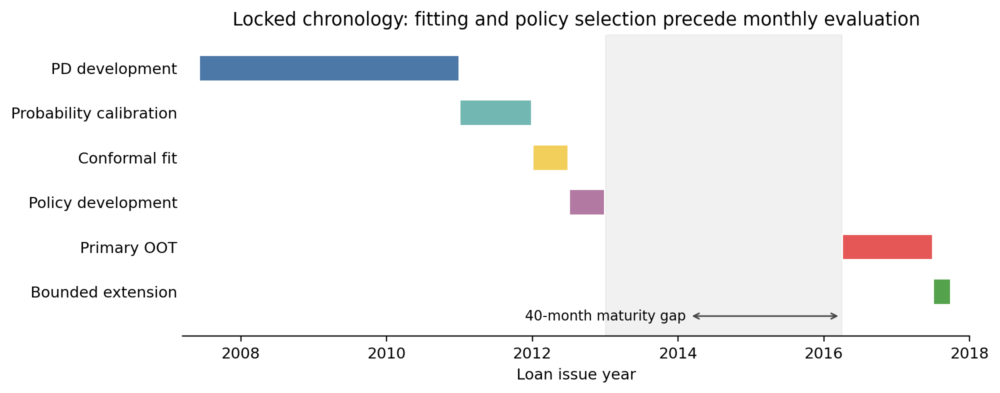
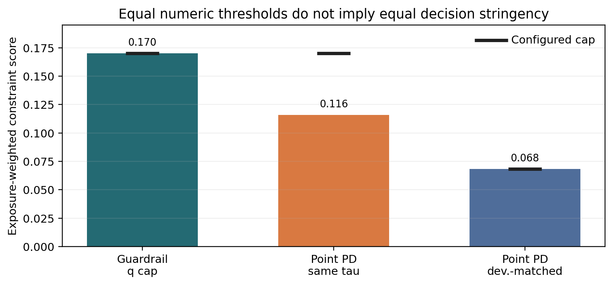
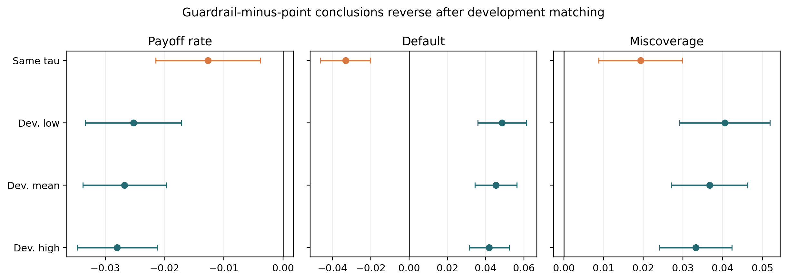

# Abstract {.unnumbered}

Predict-then-optimize studies often compare a transformed uncertainty score
with its point prediction under the same numeric risk cap. We show that this
apparently neutral baseline choice can reverse the empirical conclusion.
Conformal Robust Predict-Then-Optimize (CRPTO) combines calibrated probability
of default (PD), a 90%-target Mondrian split-conformal interval using the exact
finite-sample rank for the binary repayment outcome, and a monthly
credit-allocation linear program. We construct
a status-independent universe of 540,121 36-month Lending Club loans, fit all
statistical components by June 2012, select one guardrail on six mature 2012
cohorts, and freeze it across 15 monthly decisions from April 2016 through June
2017. Unresolved snapshot outcomes remain in every menu and enter sharp binary
bounds. All-candidate coverage falls from 0.900448 at conformal fit to
[0.854923, 0.879692] out of time. At the shared cap $\tau=0.17$, the score
$q_i=0.75p_i+0.25u_i$ appears to reduce default by [0.020093, 0.046275]. But
$q_i\ge p_i$ nests the guardrail feasible set inside the point-PD set, whose cap
is nonbinding. A separately tagged post hoc audit fixes the point-PD cap at the
guardrail's mean development-funded PD, 0.068313. The conclusion reverses: the
guardrail has lower realized standardized payoff by [$295,967, $506,587],
higher default by [0.034431, 0.056287], and higher funded-set miscoverage by
[0.027093, 0.046283]. These signs survive low/mean/high development matches and
15 leave-one-month-out checks, but only seven of nine guardrails show all three
directions. CRPTO therefore identifies a baseline-specification failure, not a
universally superior policy: predictive coverage, score conservatism, and
decision stringency are distinct objects and must be audited separately.

**Keywords:** conformal prediction; predict-then-optimize; baseline design;
credit risk; portfolio selection; temporal validation; partial identification

# Introduction {#sec-introduction}

Predictive models create value only through decisions, yet the property that
makes a predictor attractive need not survive the decision rule that consumes
it. A probability-of-default model can be well calibrated in a population
while an optimizer concentrates capital in a small, systematically different
subset. Likewise, a conformal interval can attain marginal or groupwise
coverage before selection while failing on the observations to which the
optimizer assigns positive weight. This distinction matters in credit because
the decision changes not just average risk but also interest-rate exposure,
portfolio composition, and which outcomes become economically consequential.

The usual retrospective workflow creates additional hazards. A loan that is
fully paid or charged off at the data snapshot has a label, whereas a current
loan may not. Filtering to labeled outcomes before constructing the candidate
menu uses future information that was unavailable at origination. Pooling
several years of originations into one allocation similarly lets a decision
made today choose from tomorrow's loans. Finally, optimizing one payoff and
evaluating another can make an apparent improvement an accounting artifact.
These are estimand defects rather than presentation details.

CRPTO studies the handoff from uncertainty quantification to a portfolio
decision after repairing those defects. A temporally trained CatBoost model and
Platt calibrator produce point PD $p_i$. A split-conformal recipe using the
exact finite-sample rank within five score strata produces a binary-outcome
interval $[\ell_i,u_i]$.
The guardrail uses

$$
q_i(\gamma)=(1-\gamma)p_i+\gamma u_i,
$$ {#eq-score}

in the portfolio risk constraint, while both the guardrail and the point-PD
baseline maximize the same coherent expected payoff. The policy family is
intentionally small: $\tau\in\{0.15,0.17,0.19\}$ crossed with
$\gamma\in\{0.25,0.50,0.75\}$. One policy is selected on six mature 2012
development months and then applied, without refitting or reselection, to each
of 15 later monthly menus.

The comparison initially seems to reveal a default--payoff trade-off. At the
same numeric cap, the guardrail has lower funded default, lower payoff, and
higher funded-set miscoverage than point PD. That baseline is not decision
neutral. Since $u_i\ge p_i$, the score satisfies $q_i\ge p_i$; using the same
$\tau$ nests the guardrail feasible set inside a looser point-PD set. In our
data the point cap is nonbinding in every primary month. The apparent default
benefit therefore mixes two changes: adding conformal uncertainty and imposing
greater effective risk stringency.

We audit that confounding with a point-PD cap fixed to the selected
guardrail's mean funded point PD over development. This diagnostic was designed
after the parent result was known, then committed and tagged before the first
successful persisted execution; it is post hoc falsification rather than
confirmation. Against the aligned comparator, the default conclusion reverses
and the guardrail is worse on realized payoff, default, and miscoverage. The
reversal survives every locked selected-policy diagnostic, but not the
predeclared 9-of-9 family rule. The result is therefore directionally stable
under the locked selected-policy diagnostics and heterogeneous across the
policy family.

The paper makes four contributions.

1. It provides a maturity-safe, monthly, temporally separated protocol for
   evaluating a prediction-to-optimization policy. Candidate membership never
   uses final status, and no 2016--2017 outcome enters fitting or policy
   selection.
2. It turns baseline design into an explicit comparator-stringency audit:
   establish the score ordering, test cap binding and slack, derive alignment
   from development data only, and report closed threshold, month, and family
   diagnostics. Equal numeric caps on ordered scores create nested feasible
   sets, not equal decision stringency; the development-risk match is an
   auditable but nonunique diagnostic.
3. It aligns optimized and evaluated payoff, retains unresolved outcomes with
   sharp common-outcome bounds, and decomposes population-to-funded transport
   into drift, exposure, group composition, and within-group selection.
4. It documents a practically relevant falsification: the selected
   guardrail's apparent default benefit reverses after comparator alignment,
   while marginal Mondrian coverage still fails on the funded set.

@fig-pipeline summarizes the active research object. Candidate construction,
prediction, policy development, allocation, and outcome evaluation are separate
contracts. In particular, labels are unavailable to the optimizer and are
joined only after each monthly allocation is fixed. That separation is more
than software organization: it makes otherwise informal timing and observability
claims inspectable.

{#fig-pipeline width=100%}

This is a code-locked retrospective temporal audit, not a prospective trial or
a causal estimate. The parent policy is frozen; the later comparator audit is
explicitly post hoc. The purpose is to identify what the conformal layer
changes, what the original baseline accidentally changed with it, and which
evidence a decision-focused data-science comparison must expose.

# Related Work {#sec-related}

## From predictive quality to decision quality

IJDS research repeatedly distinguishes estimation quality from the quality of
the action induced by an estimate. Fernandez-Loria and Provost show that a
useful decision ranking and an accurate effect estimate are different objects
[@fernandezloria2022causaldecision], and later make the identifying assumptions
behind observational decision rules explicit [@fernandezloria2025observational].
Cost-aware calibration similarly evaluates probability errors through their
downstream asymmetry rather than through calibration alone [@yang2025costaware].
Credit graph models demonstrate the journal's expectation that methodological
choices, empirical design, and reproducibility be linked [@das2023creditgraph].
More broadly, the AI--OR interface is valuable when prediction, mathematical
optimization, and operational interpretation form one auditable chain
[@wiberg2025ai_or].

Decision-focused learning trains predictors against an optimization loss
[@donti2017; @elmachtoub2022; @mandi2024]. Contextual optimization and
predict-then-optimize methods instead preserve a modular predictor and expose
how forecast errors enter the decision [@bertsimas2020prescriptive;
@sadana2025contextual]. CRPTO takes the modular route because the research
question concerns governance of a frozen score, not a new credit-scoring
leaderboard. The baseline and guardrail therefore share the model, payoff,
budget, concentration limits, solver, and monthly candidate menus. They cannot,
however, share a numeric risk threshold by label alone: once the score changes,
the threshold defines a different feasible set. CRPTO treats comparator
alignment as part of the empirical design rather than an implementation
default.

## What conformal coverage does and does not transport

Split conformal prediction supplies finite-sample marginal coverage under
exchangeability [@vovk2005; @angelopoulos2023]. Exact conditional coverage is
generally unattainable without strong restrictions [@barber2021limits], and
departures from exchangeability require an explicit discrepancy, weighting, or
adaptation mechanism [@tibshirani2019covshift; @gibbs2021aci;
@barber2023beyond; @farinhas2024nonexchangeable_crc]. Selecting among valid
conformal objects can itself invalidate them; recent work constructs stable or
otherwise controlled selection procedures precisely because validity is not
closed under arbitrary data-dependent choice
[@hegazy2025valid_selection_conformal_sets].

Conformal uncertainty sets have also entered robust and contextual
optimization [@johnstone2021; @patel2024]. The current frontier increasingly
calibrates decision loss, operational violations, or the miscoverage--regret
frontier rather than using predictive coverage as a proxy
[@yeh2025training; @zhou2026creme;
@stratigakos2026decision_calibrated_sets]. CRPTO does not compete with those
methods by claiming a new selected-set theorem. It asks a complementary
empirical question: when a simple conformal score is attached to a conventional
credit LP, where does its apparent risk effect come from, and where does
coverage fail to follow?

## Credit maturity and economic evaluation

Credit scoring and profit scoring are related but distinct. High discrimination
does not determine which loan is profitable [@lessmann2015], and Lending Club
studies have long shown that interest rate, default, recoveries, and portfolio
constraints jointly shape the investment decision
[@serrano2016profitscoring; @lyocsa2022profit]. Recent uncertainty-aware profit
models reinforce the need to evaluate the economic target directly
[@xu2024profit_risk_credit; @xu2025profit_uncertainty_credit].

Maturity is equally central. Ignoring random censoring can bias empirical risk
[@ausset2022censoring]. In online lending, default and prepayment are competing
events whose timing changes portfolio profitability [@li2023online_loans], and
dynamic portfolio models track state transitions and cash flows rather than a
single binary reward [@djeundje2025dynamic_loan_portfolio_profitability]. Our
standardized payoff is deliberately simpler. It is useful for isolating the
decision effect of PD and conformal uncertainty, but it is not an internal rate
of return, a discounted cash-flow estimate, or a substitute for survival
analysis.

## Closest-work boundary and IJDS fit

CRPTO lies between several mature literatures, so its contribution cannot be
that any one ingredient is new. Classical and data-driven robust optimization
make the price of protection explicit [@bertsimas2004;
@bertsimas2018datadriven; @goldfarb2003robustportfolio]. P2P lending research
already combines credit scores, returns, and portfolio constraints
[@guo2016p2p; @zhao2016p2pportfolio; @chi2019p2p; @babaei2020p2p]. Conformal
robust optimization carries coverage-backed sets into downstream decisions
[@johnstone2021; @patel2024; @hu2026crc], while valid-selection and
decision-calibration methods directly target the inferential break caused by
choosing a set or action [@hegazy2025valid_selection_conformal_sets;
@zhou2026creme; @stratigakos2026decision_calibrated_sets].

The active CRPTO role is narrower: it audits what happens when a conventional,
frozen credit score receives a simple conformal upper-score constraint. It does
not retrain through the optimizer, calibrate a selected-set loss, or claim a
new uncertainty-set theorem. Its additions are a maturity-safe credit decision
protocol, a comparator-stringency diagnostic, coherent economic comparison,
sharp treatment of unresolved outcomes, and a decomposition of how coverage
changes between candidates and funded exposure.

| Literature family | Established contribution | Active CRPTO boundary |
|---|---|---|
| Credit scoring and cost-aware calibration [@lessmann2015; @yang2025costaware; @das2023creditgraph] | Probability quality and richer predictive structure | Treats calibrated PD as an input; no AUC-leadership claim |
| P2P and robust credit portfolios [@serrano2016profitscoring; @chi2019p2p; @babaei2020p2p] | Economic loan selection under risk and uncertainty | Adds binary conformal geometry, outcome isolation, and funded-set audit |
| Conformal robust/contextual optimization [@johnstone2021; @patel2024; @hu2026crc] | Coverage-backed uncertainty sets in optimization | Studies a frozen credit LP empirically; no inherited selected-set validity |
| Valid selection and decision-risk calibration [@hegazy2025valid_selection_conformal_sets; @yeh2025training; @zhou2026creme] | Procedures that control selection or operational loss | Provides a diagnostic counterexample and transport mechanism, not a substitute theorem |
| Decision-focused learning [@donti2017; @elmachtoub2022; @mandi2024] | Training predictions against downstream loss | Preserves the predictor for governance and audits a post-hoc decision layer |
| Baseline and ablation design | Holding the decision problem fixed while changing one ingredient | Shows that a shared numeric cap does not hold decision stringency fixed |

: Closest-work boundary for the active CRPTO contribution. {#tbl-closest-work}

This positioning also matches IJDS's data-models-decisions-implications
sequence. Fernandez-Loria and Provost motivate the distinction between an
intermediate estimate and the action it induces, Yang and Bi make downstream
cost central to calibration, Das et al. establish the credit-modeling
precedent, and Wiberg et al. frame the AI--OR interface. CRPTO's IJDS-facing
object is therefore the audited allocation and the insight learned from its
failure modes, not the conformal interval in isolation.

# Data and Locked Evaluation Design {#sec-data}

## Decision unit, target, and estimand

The decision unit is an issue month. For month $t$, the candidate set
$\mathcal I_t$ contains only loans observable in that month, and each policy
maps the same menu into dollar exposures with a fresh $1$ million budget. This
is different from ranking the full archive once: no April 2016 decision can
fund a May 2016 loan, and no capital is carried across months. Equal monthly
budgets make the pooled exposure-weighted metric equivalent to the average of
the 15 monthly dollar-weighted metrics.

The observed target is snapshot default at September 2020. The policy
estimands are historical guardrail-minus-point differences in standardized
payoff, exposure-weighted default, and exposure-weighted interval miscoverage
over the same menus. They answer what the two fixed rules would have selected
and experienced in this archive. They are not treatment effects: funding does
not cause the recorded status, rejected-loan outcomes are unavailable, and no
behavioral response to a deployment is modeled.

There are therefore three distinct populations in the analysis: the candidate
rows to which predictive coverage refers, the listed loan amounts that define
available exposure, and the optimizer-selected funded dollars that define the
decision result. Treating those populations as interchangeable would erase the
mechanism the paper is designed to measure.

## Status-independent loan universe

The source is the Lending Club 2007--2020Q3 public research snapshot. The raw
file contains 2,925,493 rows; 2,060,077 have a 36-month contractual term. We
retain 540,121 rows in the declared temporal blocks after deterministic schema,
date, and feature checks. Candidate membership depends on issue month, term,
and fields observable at origination. It never depends on whether the snapshot
status later became resolved.

The binary target is *snapshot default*. `Default` and status strings containing
`Charged Off` are positive; `Fully Paid` is negative. Every other status is
unresolved. This target is a snapshot classification outcome, not a lifetime
hazard or a causal treatment response. Unresolved loans remain candidates and
are bounded after allocations are frozen.

{#fig-timeline width=100%}

The chronology in @fig-timeline separates six roles. The last policy-selection
month is December 2012 and the first primary evaluation month is April 2016, a
40-month calendar separation. The primary window ends in June 2017, at least
39 months before the September 2020 snapshot for a 36-month contract. Contract
age nevertheless does not force administrative resolution, which is why 11,386
primary candidates remain unresolved. July--September 2017 is retained as a
more heavily censored extension rather than silently discarded.

| Block | Issue months | Rows | Resolved defaults | Unresolved | Role |
|---|---:|---:|---:|---:|---|
| PD development | 2007-06--2010-12 | 17,433 | 2,377 | 0 | fit/validate |
| Probability calibration | 2011-01--2011-12 | 14,101 | 1,499 | 0 | fit |
| Conformal fit | 2012-01--2012-06 | 14,967 | 2,063 | 0 | fit |
| Policy development | 2012-07--2012-12 | 28,503 | 3,840 | 0 | select once |
| Primary OOT | 2016-04--2017-06 | 376,890 | 57,662 | 11,386 | locked evaluation |
| Censored extension | 2017-07--2017-09 | 88,227 | 11,867 | 28,716 | stress only |

: Locked data blocks. Nondefaults complete the resolved counts. {#tbl-protocol}

## Information boundary

The implementation materializes two ID-keyed panels. The decision panel
contains issue date, amount, purpose, contractual rate, point PD, conformal
endpoints, and the frozen score stratum. It rejects outcome, realized-payoff,
miscoverage, or outcome-derived columns. The outcome panel contains snapshot
status and is joined only after the solver returns an allocation. IDs must align
one-to-one; partial joins fail. This physical separation does not create a new
statistical theorem, but it makes the timing claim testable in code.

The protocol and missing-outcome amendment were committed and tagged before
the successful primary result was written. A first tagged run stopped when its
predeclared guard found unresolved primary outcomes and persisted only a
protocol freeze. Version 2 changed only the handling of those missing outcomes
to sharp bounds; dates, model, policy grid, payoff, constraints, baselines, and
interpretation remained fixed.

## Identification safeguards

The design addresses five common retrospective failure modes directly. Each
safeguard removes one source of look-ahead or estimand drift, but the final
column records what still cannot be inferred.

| Design hazard | Active safeguard | Remaining boundary |
|---|---|---|
| Candidate inclusion uses future status | Membership uses issue date, term, and origination fields; unresolved rows remain | Snapshot outcomes are still administratively censored |
| Later labels influence fitting or selection | PD, Platt, conformal fit, and policy development occupy separate pre-2013 blocks | Temporal exchangeability is not restored |
| One decision pools future originations | Fifteen separate monthly menus and budgets | The exercise is still retrospective |
| Optimized and reported payoffs differ | Expected and realized payoff are one coherent pair | The pair is not cash-flow return or welfare |
| Marginal coverage is read as decision validity | Candidate, exposure, group-mix, and funded metrics are reported separately | No selected-set conformal guarantee follows |

: Identification safeguards and residual boundaries. {#tbl-safeguards}

# Method {#sec-method}

## Calibrated PD

A CatBoost classifier uses 29 numeric and 9 categorical origination-time
features. Hyperparameters are fixed in the executable protocol: 500 trees,
depth 6, learning rate 0.04, class balancing, Bernoulli subsampling, and a
time-aware ordering. The last 20% of PD-development months form a temporal
validation tail. A logistic Platt map is then fitted on the 2011 raw margins,
separate from both model training and conformal fitting.

On 2011 calibration data, Platt scaling leaves AUC at 0.678214 while reducing
Brier score from 0.132582 to 0.091368 and ten-bin ECE from 0.181293 to
0.000711. On resolved primary OOT rows, AUC is 0.641688, Brier score 0.131126,
log loss 0.432369, and ECE 0.049691. These are diagnostics of substantial
temporal deterioration, not selection criteria.

## Exact binary-outcome Mondrian intervals

Let $Y_i\in\{0,1\}$ denote snapshot default and $p_i$ the calibrated score.
Five groups are defined by calibrated-PD quintiles on 2012H1. Within group $g$,
the conformity score is $s_i=|Y_i-p_i|$. For $n_g$ observations and target
$\alpha=0.10$, the frozen finite-sample rank is

$$
k_g=\left\lceil(n_g+1)(1-\alpha)\right\rceil,
$$ {#eq-rank}

and $c_g$ is the $k_g$-th ordered residual. A future score assigned to group
$g(i)$ receives

$$
[\ell_i,u_i]=
\left[\max\{0,p_i-c_{g(i)}\},\min\{1,p_i+c_{g(i)}\}\right].
$$ {#eq-interval}

The interval predicts the observed binary outcome. It is not a confidence
interval for a latent individual PD. No holdout-learned widening, floor, or
post-2012 label enters the recipe.

For binary $Y$, miscoverage has the useful identity

$$
m_i=\mathbf 1\{Y_i=0,\ell_i>0\}+
    \mathbf 1\{Y_i=1,u_i<1\}.
$$ {#eq-binary-miss}

Thus a default is counted as covered whenever $u_i=1$, even though such an
endpoint offers little discrimination to the optimizer. Conversely, a narrow
low-score interval with $u_i<1$ misses every realized default. This geometry is
central to interpreting funded-set coverage.

## Coherent payoff and monthly allocation

For contractual annual rate $r_i$ and fixed loss given default
$\lambda=0.45$, the standardized per-dollar realized payoff is

$$
\pi_i(Y_i)=(1-Y_i)r_i-Y_i\lambda,
$$ {#eq-realized-payoff}

with conditional expectation

$$
\bar\pi_i=(1-p_i)r_i-p_i\lambda.
$$ {#eq-expected-payoff}

The same expression is optimized and evaluated. It intentionally omits payment
timing, principal amortization, prepayment, fees, recoveries, and discounting.
We therefore call it standardized payoff, not cash-flow return or IRR.

In month $t$, let $a_{it}$ be dollar exposure to loan $i$, bounded by its listed
amount $A_i$. For a policy $(\tau,\gamma)$, the LP is

$$
\begin{aligned}
\max_{a_{it}}\quad & \sum_{i\in\mathcal I_t}a_{it}\bar\pi_i \\
\text{s.t.}\quad
& \sum_i a_{it}=B, \\
& \sum_i a_{it}q_i(\gamma)\le \tau B, \\
& \sum_{i:\,purpose_i=k}a_{it}\le 0.25B \quad\forall k,\\
& 0\le a_{it}\le A_i,
\end{aligned}
$$ {#eq-lp}

where $B=\$1$ million in every month. The point-PD baseline sets $\gamma=0$.
The objective is identical across policies, so differences arise from the risk
score and the loans made feasible by it.

## Development selection and locked baselines

Each of the nine guardrails is solved separately in every month from July
through December 2012. Among policies that invest the full budget in all six
months, the rule chooses the highest summed realized standardized payoff, then
expected payoff and candidate ID as deterministic tie-breakers. It selects
$\tau=0.17$ and $\gamma=0.25$, or
$q_i=0.75p_i+0.25u_i$. Its six-month payoff exceeds the runner-up by only
$1,238.33, and it wins three of six leave-one-development-month-out folds. The
selector is therefore frozen but fragile.

The parent experiment independently selects point PD from
$\tau_p\in\{0.15,0.17,0.19\}$. All three caps yield the same allocation because
the point-risk constraint is nonbinding; the deterministic tie-break chooses
0.15. The parent also labels $\tau_p=0.17$ as a same-threshold comparator. Those
point allocations remain identical OOT. We retain that comparison because it
is historically exact, but @sec-theory shows why it is not stringency matched.

The comparator audit defines one primary point cap using development data
only. Let $a^{q}_{it}$ be the selected guardrail allocation in development
month $t$ and $B$ the monthly budget. We set

$$
\tau_p^{dev}=\frac{1}{6}\sum_{t=1}^{6}
\frac{\sum_i a^{q}_{it}p_i}{B}=0.06831339893217318.
$$ {#eq-development-match}

The fixed threshold aligns the guardrail's mean development-funded point PD;
it does not equate feasible sets or identify a unique causal counterfactual.
The closed sensitivity set is the minimum, mean, and maximum monthly funded PD,
$\{0.065032,0.068313,0.071705\}$. Each of the other eight guardrails receives
its own development-mean point-PD comparator for a complete nine-policy census.
No threshold or policy is selected from OOT results.

The maturity-safe model, Platt map, conformal recipe, selected guardrail, and
dates were frozen before the parent evaluation. The comparator rule was
specified after inspecting that parent result, then committed and tagged before
the first successful persisted execution. Every primary and extension month
receives its own menu and fresh budget. No endpoint cap, future-menu pooling,
refit, or evaluation-period reselection is used.

# Identification and Theory {#sec-theory}

The theoretical contribution is intentionally algebraic. It diagnoses
same-threshold comparator nesting, characterizes the binary interval,
identifies what can be learned with unresolved outcomes, and separates
population coverage from optimizer selection. None of the statements assumes
funded-set conformal validity or makes development matching uniquely correct.

## Comparator non-invariance

Let $\mathcal F_s(\tau)$ denote the allocations satisfying @eq-lp when the
risk score is $s$. All nonrisk constraints and the objective are held fixed.

**Proposition 1 (same-threshold nesting).** If $\gamma\in[0,1]$ and $u_i\ge
p_i$ for every candidate, then $q_i(\gamma)\ge p_i$ and

$$
\mathcal F_q(\tau)\subseteq\mathcal F_p(\tau).
$$ {#eq-feasible-nesting}

Consequently, for the common expected-payoff objective,
$V_p(\tau)\ge V_q(\tau)$. The inclusion is strict whenever some allocation
satisfies the point-PD cap but violates the $q$ cap. The proof follows by
multiplying $q_i\ge p_i$ by nonnegative exposure and summing; Online Supplement
Proposition S4 gives the formal statement.

This proposition makes the old expected-payoff comparison partly mechanical.
It does not order realized payoff or default, and it does not imply that
$\tau_p^{dev}$ is the only valid match. It says only that copying $\tau$ across
the two scores fails to hold the feasible decision problem fixed.

## Binary interval geometry

**Proposition 2 (binary miscoverage).** For $Y\in\{0,1\}$ and any interval
$[\ell,u]\subseteq[0,1]$, miscoverage is exactly the sum of the two disjoint
events in @eq-binary-miss. Thus $u=1$ covers every realized default, whereas
any default with $u<1$ is missed. The proof is a two-case enumeration given in
Online Supplement Proposition S1.

This result explains why interval coverage and a conservative upper-score
ranking need not move together. Endpoint saturation can improve coverage while
providing little ordering information; a narrow low-risk interval can rank
well but miss its rare defaults.

## Sharp bounds for unresolved outcomes

For an unresolved loan, $Y_i$ may be either 0 or 1. Default therefore lies in
$[0,1]$, payoff in $[-\lambda,r_i]$, and miscoverage in the two attainable
values implied by @eq-binary-miss.

**Proposition 3 (sharp additive bounds).** Let $U$ index unrestricted
unresolved outcomes and write an additive fixed-allocation metric as
$T(Y)=C+\sum_{i\in U}g_i(Y_i)$. Then

$$
T_L=C+\sum_{i\in U}\min_{y\in\{0,1\}}g_i(y),\qquad
T_U=C+\sum_{i\in U}\max_{y\in\{0,1\}}g_i(y)
$$ {#eq-sharp-bounds}

are sharp because each endpoint is attained by a joint assignment of all
unresolved outcomes. This is partial identification under unrestricted binary
completion, not a sampling confidence interval.

Policy contrasts require more care. CRPTO and point PD often fund different
loans, so subtracting two marginal intervals is generally not sharp. We form
the union of funded IDs, retain each loan's signed difference in exposure, and
optimize its common unresolved $Y_i$ once. The resulting contrast interval
respects shared outcomes and is sharp for the observed menus. A directional
claim is made only when the entire primary contrast interval has one sign.

## Selection-transport identity

Let $M_{row}$ be the unweighted candidate metric, $M_{exp}$ its loan-amount
weighted value, $M_{mix}$ the value obtained by combining candidate
within-group rates with the funded portfolio's conformal-group shares, and
$M_{fund}$ the actual funded exposure-weighted value. For reference $a$,

**Proposition 4 (selection transport).** The funded departure from $a$
decomposes exactly as

$$
\begin{aligned}
M_{fund}-a ={}& (M_{row}-a) +(M_{exp}-M_{row})\\
& +(M_{mix}-M_{exp}) +(M_{fund}-M_{mix}).
\end{aligned}
$$ {#eq-transport}

The terms are, respectively, population departure from the reference,
exposure weighting, group-composition shift, and within-group optimizer
selection. With unresolved outcomes we evaluate the identity under the lower
and upper extremal completions. The funded endpoints are sharp bounds; the
intermediate terms describe each completion and are not component-wise
confidence intervals.

The four propositions support a compact identification ladder.

::: {.keep-together}
| Object | Exact statement | Evidence used | Does not imply |
|---|---|---|---|
| Comparator | At common $\tau$, $q\ge p$ nests the guardrail feasible set inside point PD | S4 and comparator audit | A unique matching rule or causal effect |
| Binary interval | Miscoverage is determined by whether zero or one lies outside $[\ell,u]$ | S1 and endpoint saturation | Confidence interval for latent individual PD |
| Fixed allocation | Unresolved additive metrics attain the bounds in @eq-sharp-bounds | S2, S3, S6 | Sampling uncertainty or missing-at-random identification |
| Paired policies | A common unresolved outcome is optimized once over the funded union | S7 | Causal policy effect |
| Candidate-to-funded transport | Population, amount weighting, group mix, and within-group selection telescope exactly | S4 and S5 | Selected-set validity or a regularization theorem |

: Identification ladder for the paper's exact claims. {#tbl-identification}
:::

# Results {#sec-results}

## Predictive coverage deteriorates before portfolio selection

The conformal fit block attains coverage 0.900448, as intended by the exact
finite-sample construction. In primary OOT, resolved-row coverage is 0.876313
and all-candidate coverage is bounded by [0.854923, 0.879692]. Mean interval
width is 0.736564; 98.85% of lower endpoints equal zero and 18.08% of upper
endpoints equal one. The decline precedes portfolio optimization and already
rules out a 90% OOT coverage claim.

| Block | Rows | Unresolved | Coverage bound | Mean width | $\ell=0$ | $u=1$ |
|---|---:|---:|---:|---:|---:|---:|
| Conformal fit, 2012H1 | 14,967 | 0 | 0.900448 | 0.813817 | 0.991114 | 0.222757 |
| Primary OOT, 2016-04--2017-06 | 376,890 | 11,386 | [0.854923, 0.879692] | 0.736564 | 0.988458 | 0.180766 |
| Censored extension, 2017-07--2017-09 | 88,227 | 28,716 | [0.626804, 0.892539] | 0.729054 | 0.987986 | 0.179537 |

: Binary-outcome conformal diagnostics. Bounds include every unresolved candidate. {#tbl-coverage}

The shift is also visible in the PD model. Primary default prevalence among
resolved candidates is 0.157760, materially above earlier blocks, while AUC and
calibration deteriorate. The conformal result should therefore be read as
empirical temporal evidence, not as a failed theorem under maintained
exchangeability.

## Equal thresholds are not equal baselines

The original comparison holds $\tau=0.17$ fixed while changing the score from
$p$ to $q$. Proposition 1 predicts a nested feasible set, and the optimization
diagnostics show that the nesting matters. The guardrail's exposure-weighted
$q$ equals its cap in all 15 primary months. The same-threshold point policy has
weighted PD 0.115758, leaving aggregate slack 0.054242; its monthly slack ranges
from 0.039844 to 0.072349. The development-matched point cap is binding in all
15 months.

| Policy | Constraint score | Cap | OOT weighted score | Cap slack | OOT weighted point PD |
|---|---|---:|---:|---:|---:|
| Conformal guardrail | $q$ | 0.170000 | 0.170000 | 0.000000 | 0.074979 |
| Point PD, same numeric cap | $p$ | 0.170000 | 0.115758 | 0.054242 | 0.115758 |
| Point PD, development matched | $p$ | 0.068313 | 0.068313 | 0.000000 | 0.068313 |

: Baseline alignment over the 15 primary decisions. A shared number does not imply a shared feasible set. {#tbl-baseline-alignment}

{#fig-alignment width=92%}

The same-threshold point policy also has model-expected payoff $240,977.78
higher than the guardrail. That direction follows from feasible-set nesting
and cannot, by itself, measure the price of conformal uncertainty. We therefore
retain the comparison as a specification diagnostic, not the primary policy
counterfactual.

## Comparator alignment reverses the conclusion

Across 15 months, the guardrail and development-matched point policy each
allocate $15$ million. Their model-expected payoffs are close: $2,383,112.23
for the guardrail and $2,374,633.05 for point PD. Outcomes tell a different
story. The guardrail realized-payoff bound is [-$2,389.90, $168,250.04], while
the matched point bound is [$398,134.41, $570,279.93]. Default and miscoverage
are also lower for the matched point policy.

| Policy | Expected payoff | Realized payoff bound | Default bound | Miscoverage bound | Unresolved exposure |
|---|---:|---:|---:|---:|---:|
| Conformal guardrail | $2,383,112 | [-$2,390, $168,250] | [0.292775, 0.310322] | [0.294708, 0.309589] | 0.017547 |
| Point PD, development matched | $2,374,633 | [$398,134, $570,280] | [0.247353, 0.265026] | [0.256624, 0.274297] | 0.017673 |
| Point PD, same numeric cap | $2,624,090 | [$177,109, $369,496] | [0.326037, 0.343428] | [0.275360, 0.290265] | 0.017392 |

: Primary policy aggregates. Payoff is the standardized quantity in @eq-realized-payoff. {#tbl-primary}

The paired common-outcome bounds make the inversion explicit. Relative to the
same-threshold baseline, the guardrail appears safer. Relative to the
development-matched baseline, it is worse on all three realized metrics.

| Guardrail minus point PD | Same numeric cap | Development matched |
|---|---:|---:|
| Expected payoff | -$240,977.78 | +$8,479.18 |
| Realized payoff | [-$322,703.79, -$58,040.34] | [-$506,587.03, -$295,967.17] |
| Weighted default | [-0.046275, -0.020093] | [0.034431, 0.056287] |
| Weighted miscoverage | [0.008822, 0.029850] | [0.027093, 0.046283] |

: Baseline-dependent primary contrasts. Every displayed realized interval is sharp for unrestricted unresolved binary outcomes. {#tbl-primary-inversion}

{#fig-inversion width=100%}

This is not a causal policy effect. It is a historical comparison of fixed
rules over identical menus. Nor does the small positive expected difference
rescue the guardrail: the model expectation and realized outcome disagree.
The payoff decomposition attributes +$53,474.88 to expected interest and
-$44,995.70 to expected default loss, but the resolved
default-and-foregone-interest component of realized payoff is -$488,201.64.
For these fixed allocations, expected payoff breaks even at
$\lambda=0.534800$; the sharp realized-payoff upper contrast remains negative
for every $\lambda\in[0,1]$. This LGD diagnostic does not reoptimize either
portfolio.

## Directionally stable for the selected policy, heterogeneous across the family

The selected-policy reversal is not a single-threshold accident. At the low,
mean, and high development matches, the guardrail's payoff, default, and
miscoverage intervals retain the same signs.

| Point-PD match | Realized payoff difference | Default difference | Miscoverage difference |
|---|---:|---:|---:|
| Low, 0.065032 | [-$500,320.92, -$257,011.29] | [0.035901, 0.061313] | [0.029141, 0.051886] |
| Mean, 0.068313 | [-$506,587.03, -$295,967.17] | [0.034431, 0.056287] | [0.027093, 0.046283] |
| High, 0.071705 | [-$521,659.19, -$319,301.84] | [0.031470, 0.052274] | [0.024173, 0.042310] |

: Closed development-threshold sensitivity for the selected guardrail. {#tbl-selected-sensitivity}

Dropping each primary month once also preserves every aggregate direction. The
least favorable matched-comparator margins are -$231,823.93 for the payoff
upper endpoint, 0.029599 for the default lower endpoint, and 0.021984 for the
miscoverage lower endpoint. Month by month, the guardrail has lower payoff in
14 months and one ambiguous month; higher default in 14 and one ambiguous;
and higher miscoverage in 13, lower in one, and ambiguous in one. The full
monthly audit appears in the Online Supplement.

The result does not generalize uniformly across the nine guardrails. Each is
paired with its own development-mean point-PD comparator, with no OOT
reselection. Seven pairs have sign-robustly worse guardrail payoff, seven have
worse default, and all nine have worse miscoverage. `linear-003` and
`linear-006` have ambiguous payoff and default bounds, so the predeclared
9-of-9 family gate fails.

| Closed family result | Count |
|---|---:|
| Guardrail payoff sign-robustly worse | 7/9 |
| Guardrail default sign-robustly worse | 7/9 |
| Guardrail miscoverage sign-robustly worse | 9/9 |
| All three directions jointly | 7/9 |

: Complete family census; no OOT winner is selected. {#tbl-family-census}

The original guardrail selector is itself fragile. `linear-004` wins the full
six-month development grid by $1,238.33 but only three of six
leave-one-development-month-out folds. `linear-001` wins one fold and
`linear-008` wins two. We report that instability and keep the selected policy
frozen rather than promoting an OOT-inspected alternative.

## The mechanism depends on the comparator

Relative to the loose same-threshold point policy, the original composition
story is numerically correct. The guardrail places 0.611338 of capital in the
lowest score stratum, versus 0.101627 for point PD, and has lower default. But
the development-matched point policy also concentrates in low point risk: its
group-0 exposure is 0.499786. It funds 1,556 unique loans versus 1,561 for the
guardrail, shares 1,128 IDs, and overlaps on 69.79% of capital.

| Quantity, lower outcome completion | Guardrail | Development-matched point PD |
|---|---:|---:|
| Weighted point PD | 0.074979 | 0.068313 |
| Weighted contractual rate | 0.210113 | 0.204369 |
| Group-0 exposure share | 0.611338 | 0.499786 |
| Default group-composition term | -0.041210 | -0.043475 |
| Default within-group selection | 0.175652 | 0.132496 |
| Miscoverage within-group selection | 0.171111 | 0.131075 |

: Composition and selection transport after comparator alignment. {#tbl-mechanism}

The aligned baseline therefore changes the mechanism interpretation. Both
policies move capital toward low-risk groups, and point PD has a slightly more
favorable default composition term. Under this ordered decomposition, the
guardrail's larger within-group terms algebraically account for the remaining
higher funded default and miscoverage after composition. The enduring result
is not that conformal scoring uniquely regularizes composition; it is the
descriptive candidate-to-funded coverage departure associated with
within-group optimizer selection for both rules.

## A falsification, not a new policy winner

The evidence invalidates the original default-benefit narrative, but it does
not establish universal point-PD dominance. The matched point policy is better
on bounded realized payoff, default, and miscoverage in this archive; the
guardrail is $8,479.18 better under the model-expected objective. Two of nine
family pairs remain ambiguous on payoff and default. Development matching
aligns one empirical moment, not the feasible set, and was chosen post hoc.

The July--September 2017 extension is retained as a censoring stress. Roughly
one quarter of funded exposure is unresolved, making its bounds too wide for a
directional promotion claim. CRPTO therefore supplies an audit result: baseline
specification can reverse a policy conclusion, and neither marginal coverage
nor score conservatism supplies selected-set validity. It does not use that
result to crown another policy.

# Discussion {#sec-discussion}

## What the conformal guardrail actually does

The guardrail changes both the score and, under a copied threshold, the
effective tightness of the decision. Against the loose same-threshold baseline,
it reallocates capital toward low-score groups and lowers default. Against a
point policy aligned on development-funded risk, point PD makes a similar
composition shift and achieves lower realized default and miscoverage. The
old composition-regularizer description is therefore comparator-specific, not
an intrinsic guarantee of the conformal score.

The result separates three meanings of conservatism. First, the guardrail is
pointwise conservative in score because $q_i\ge p_i$. Second, a shared numeric
cap makes it mechanically more restrictive than point PD. Third, neither fact
implies statistical conservatism on the funded set, where miscoverage is
higher. A strong word such as *robust* must name the quantity and perturbation
it protects
[@morucci2022robust_matching_uncertainty; @falconer2026replication]. Here it
describes a transparent uncertainty-sensitive constraint, not distributional
robustness, selected-set validity, or policy dominance.

## Implications for decision-focused data science

Four design lessons generalize beyond credit.

First, baseline hyperparameters are part of the estimand. Holding a number
fixed while changing the score does not hold the decision fixed. Evaluations
should report whether each constraint binds, characterize feasible-set
relations when possible, and include an alignment rule whose limitations are
explicit. The development match used here is one such diagnostic, not a
universal recipe.

Second, candidate construction is part of the decision rule. Excluding rows
because their outcomes are unavailable creates a menu that could not have
existed at decision time. Keeping the rows and bounding their outcomes is often
more honest than obtaining a sharper answer from a selected sample.

Third, predictive validity and decision validity require different evidence.
Population coverage, group coverage, and selected-set coverage are distinct.
The transport identity makes that distinction measurable by showing whether a
failure arises from temporal drift, unit-size weights, group composition, or
within-group selection. If selected-set reliability is the desired guarantee,
one should calibrate an operational loss or use a selection-valid construction,
not infer it from marginal coverage.

Fourth, the optimized payoff must be the payoff later reported. A minor-looking
algebraic mismatch can reorder the portfolio. We use
$(1-p)r-p\lambda$ because it is exactly the expectation of
$(1-Y)r-Y\lambda$. A richer study should replace both sides together with
cash flows, prepayment, recovery, and discounting rather than relabel this
standardized outcome as investor return.

For a credit committee, the practical output is not a single headline number.
It is a comparison ladder: feasibility and cap slack, expected and realized
payoff, default, funded-set miscoverage, unresolved exposure, selector
stability, and family heterogeneity. Here that ladder rejects the claimed
default benefit of the selected guardrail. It does not establish that the
post hoc matched point policy is deployment optimal.

## Managerial audit card

For a model-risk or credit committee, the paper can be reduced to nine
questions. The answers deliberately combine positive controls with failed
validity claims.

| Committee question | Evidence | Current answer |
|---|---|---|
| Could the candidate menu exist at decision time? | Status-independent inclusion and monthly menus | Yes for the recorded origination fields |
| Were model and guardrail choices made before primary outcomes? | Six pre-2013 blocks and 40-month gap | Yes for the parent policy |
| Was the comparator audit confirmatory? | Protocol timing and disclosure | No; designed after the parent result, tagged before its first successful persisted run |
| Does 90% conformal coverage transport OOT? | Candidate coverage [0.854923, 0.879692] | No |
| Is point PD at the same numeric cap comparable? | Point-cap slack 0.054242 and Proposition 1 | No |
| Does the guardrail lower default after development matching? | Sharp paired bound [0.034431, 0.056287] | No; guardrail default is higher |
| Does it improve realized payoff or coverage? | Payoff [-$506,587.03, -$295,967.17]; miscoverage [0.027093, 0.046283] | No on either outcome |
| Is the direction universal across the family? | Complete 3x3 census | No; all three signs hold in 7/9 pairs |
| Is unchanged deployment supported? | Monthly reversals, drift, censored extension | No; monitoring and a new calibration protocol would be required |

: Decision audit card for the active CRPTO policy. {#tbl-audit-card}

The card clarifies the useful role of a post hoc guardrail study. It can expose
baseline confounding and selected-set failure without replacing a governed
score. It cannot replace selection-valid prediction, nonexchangeable
calibration, cash-flow modeling, or live monitoring.

# Limitations {#sec-limitations}

The study has ten main limitations. First, Lending Club is one historical
platform whose retail originations ended in 2020; the design cannot establish
live performance. Second, snapshot default collapses payment paths into a
binary endpoint and leaves administrative states unresolved. Sharp bounds
avoid outcome-conditioned deletion but may be wide. Third, the standardized
payoff omits amortization, prepayment, recoveries, fees, discounting, and
capital costs. Fourth, the 40-month gap does not restore exchangeability; the
observed deterioration is substantial. Fifth, neither the Mondrian recipe nor
the LP controls coverage after adaptive within-group selection. Sixth, the
comparator audit is post hoc, and its development match aligns one average
funded-PD moment rather than feasible sets. Seventh, the guardrail selector uses
only six months and wins three of six leave-one-month-out folds. Eighth, the
continuous allocation and fixed 25% purpose cap are modeling choices, not
operational constraints calibrated or stress-tested here. Ninth, purpose
concentration and score strata are not protected classes, so the analysis is
not a fair-lending certification. Tenth, this is a retrospective code-locked
audit. Earlier project work inspected overlapping historical periods, so
neither run is a pristine lockbox or preregistered prospective test.

These limitations define sensible next methods, including survival or
competing-risk payoffs, weighted/nonexchangeable conformal calibration,
selection-valid prediction sets, and direct calibration of decision loss. They
are not hidden acceptance criteria for the present paper and are not additional
CRPTO variants.

# Reproducibility {#sec-reproducibility}

The review package separates an immutable maturity-safe parent (P1) from an
immutable comparator audit (C1). Their execution receipts record clean initial
and final trees, and C1 replays the P1 selected and same-threshold allocations
exactly. Separate deterministic builders validate each summary, receipt,
versioned artifact, and publication output. They regenerate 30 parent and 38
comparator outputs; two consecutive comparator builds reproduce all 39 file
hashes including the manifest. Claim-sync tests compare the numerical sources,
anonymous body, supplement, and official IJDS TeX. The protected historical
champion and its extraction manifest were neither executed nor overwritten.

Exact run tags, commits, hashes, repository links, and remote coordinates are
intentionally absent from reviewer-facing files because they are searchable
author fingerprints. An editor-only crosswalk preserves them, and a
metadata-sanitized review archive can be supplied through ScholarOne. At
acceptance, the full code, environment lock, evidence manifests, immutable
pointers, and data-reconstruction instructions will be released under the IJDS
data and code policy.

# Conclusion {#sec-conclusion}

CRPTO tests two common but unsafe inferences: that marginal conformal coverage
protects an optimizer-selected portfolio, and that copying a numeric risk cap
creates a fair point-prediction baseline. Both fail. Candidate coverage falls
to [0.854923, 0.879692] OOT. At the shared cap, the guardrail appears to lower
default by 2.01--4.63 percentage points, but the point-PD constraint is
nonbinding. At the development-matched cap, the guardrail instead has 3.44--5.63
percentage points more default, 2.71--4.63 points more miscoverage, and
$295,967--$506,587 less realized standardized payoff.

The contribution is not a universally superior point policy: the comparator
audit is post hoc, development matching is not unique, and two of nine family
pairs remain ambiguous. It is an auditable demonstration that predictive
validity, score conservatism, and decision stringency are different objects.
That baseline-aware negative result is the claim supported by the data.
