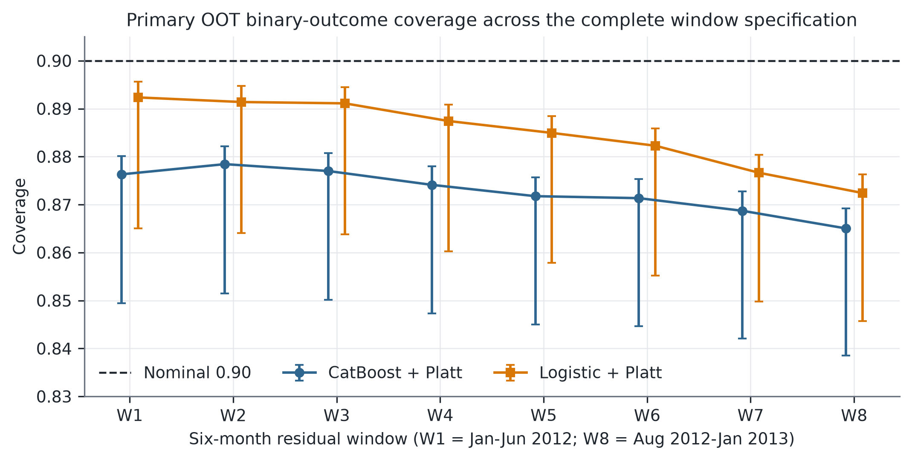
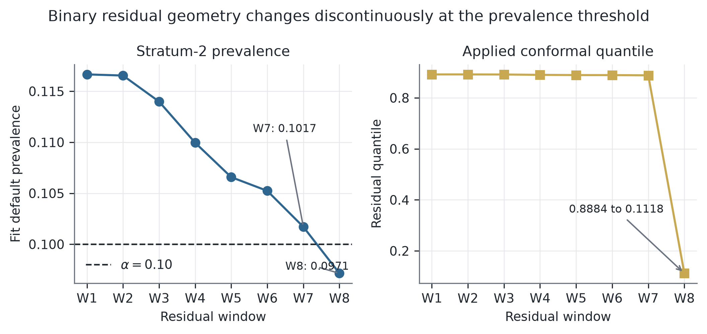

# Introduction {#sec-introduction}

Predictive models create value through decisions, yet a property established
for a predictor need not survive the rule that consumes it. A probability of
default can be calibrated in a population while an optimizer concentrates
capital in a systematically different subset. A conformal prediction set can
attain marginal or groupwise coverage before selection while missing outcomes
among the observations that receive positive exposure. Even if the predictive
object were stable, a comparison can still fail when two scores are assigned
the same numerical threshold: the score and its cap jointly define a feasible
decision problem.

The usual retrospective workflow creates additional hazards. A loan that has
reached an endpoint by an evaluation cutoff has a label, whereas a current or
later-resolved loan may not. Treating a later archive as if it were a verified
historical snapshot, or filtering to resolved outcomes before constructing the
candidate menu, uses information unavailable at the decision date. Pooling
several years of originations into one allocation similarly lets a decision
made today choose from tomorrow's loans. Finally, optimizing one payoff and
evaluating another can make an apparent improvement an accounting artifact.
These are estimand defects rather than presentation details.

CRPTO studies this handoff after making timing, observability, geometry, and
comparator contracts explicit. A temporally trained CatBoost model and Platt
calibrator produce point score $p_i$. Score strata are fixed from all 2011
predictions, independently of outcomes. We then report the complete set of
eight consecutive six-month residual windows beginning in 2012 and ending no
later than January 2013. No result selects, weights, or removes a window. Four
coverage-only controls span a separately fitted numeric logistic model,
domain-constrained monotonic CatBoost, a platform-signal WOE/IV scorecard, and
a pricing-excluded application WOE/IV scorecard. Each has its own Platt map and
2011 taxonomy;
none is selected from OOT outcomes or enters portfolio optimization. The
resulting clipped residual interval $[\ell_i,u_i]$ predicts the observed binary outcome. It is
neither a confidence interval for latent individual PD nor the convex hull of
its intersection with $\{0,1\}$. Its upper endpoint enters a guardrail score

$$
q_i(\gamma)=(1-\gamma)p_i+\gamma u_i,
$$ {#eq-score}

in the portfolio risk constraint. Guardrail and point-score policies maximize the
same model-implied objective over identical monthly menus, budgets, loan
bounds, and purpose constraints. The complete diagnostic score path is
$\gamma\in\{0,0.25,0.50,0.75,1\}$. Its primary empirical contrast is the
full-upper-score endpoint minus the point-score endpoint. No development
outcome selects a score, and no OOT result promotes a gamma.

The comparator is part of the estimand. We therefore use two rulers constructed
without policy-development or OOT evaluation outcomes on the common attainable
frontier. We call a construction *evaluation-outcome-blind* when earlier model
and conformal fitting may use historical labels but policy construction reads
neither development nor OOT evaluation outcomes. The primary ruler imposes the same
model-implied objective floor for every score and hence matches plug-in
opportunity cost. The secondary ruler uses the same relative relaxation from
each score's minimum-risk allocation to the common plug-in optimum; it is
invariant to positive affine score transformations but does not match
opportunity cost. Both rulers are evaluated at coordinates
$\{0.25,0.50,0.75\}$. A supporting audit checks these finite tracks against
same-cap, development-matched, contemporaneous funded-moment, and exact
point-cap comparators. The exact HiGHS basis frontier avoids fixed-grid
interpolation over the declared point-cap support.

The empirical message is an identification result rather than a winner. All
40 model-by-window all-candidate OOT coverage upper bounds are below 0.90. One
CatBoost stratum crosses the nominal miscoverage prevalence threshold between
the seventh and eighth windows, coinciding with an abrupt change in its
conformal quantile and interval geometry. Under every reporting lag that passes
the locked greater-than-99% retention rule, the same W7--W8 crossing remains. In the
portfolio audit, no endpoint ordering survives all rulers and coordinates.
Objective-matched .25 crosses zero for all three metrics in every window; .50
is adverse in all eight; and .75 leaves payoff and default unidentified in
seven. Normalized .25 and .50 are adverse, while normalized .75 leaves payoff
unidentified in one window and does not equalize plug-in opportunity cost.
Independently, every broad-support exact-cap payoff, default, and miscoverage
envelope crosses zero.

The paper makes three contributions.

1. It derives a prevalence-threshold discontinuity for constant-score binary
   absolute-residual intervals, distinguishes that mechanism from the empirical
   varying-score path, and tests its timing sensitivity.
2. It defines two common-frontier rulers and an exact basis-endpoint support
   audit, showing why score, ruler, and coordinate jointly define the portfolio
   estimand.
3. It implements a maturity-restricted retrospective protocol with a reconstructed
   endpoint, fixed taxonomies, five coverage specifications,
   status-independent menus, sharp common-outcome bounds, and allocations
   persisted before outcomes. The resulting negative evidence is the claim:
   coverage does not transport and no universal portfolio direction is
   identified.

This audit was retrospectively protocol-locked and hash-verified after the
archive had been inspected; it is not a prospective trial, preregistration, or
causal estimate. The purpose is
to identify which conclusions are properties of the predictive object and
which are artifacts of the decision comparison.

# Related Work {#sec-related}

## From predictive quality to decision quality

Research on decision quality distinguishes estimation quality from the quality
of the action induced by an estimate. Fernandez-Loria and Provost show that a
useful decision ranking and an accurate effect estimate are different objects
[@fernandezloria2022causaldecision], and later make the identifying assumptions
behind observational decision rules explicit [@fernandezloria2025observational].
Cost-aware calibration similarly evaluates probability errors through their
downstream asymmetry rather than through calibration alone [@yang2025costaware].
Das et al. link credit-modeling choices to empirical design and
reproducibility [@das2023creditgraph].
More broadly, the AI--OR interface is valuable when prediction, mathematical
optimization, and operational interpretation form one auditable chain
[@wiberg2025ai_or].

Decision-focused learning trains predictors against an optimization loss
[@donti2017; @elmachtoub2022; @mandi2024]. Contextual optimization and
predict-then-optimize methods instead preserve a modular predictor and expose
how forecast errors enter the decision [@bertsimas2020prescriptive;
@sadana2025contextual]. CRPTO takes the modular route because the research
question concerns governance of a frozen score, not a new credit-scoring
leaderboard. The baseline and guardrail therefore share the model, payoff,
budget, concentration limits, solver, and monthly candidate menus. They cannot,
however, share a numeric risk threshold by label alone: once the score changes,
the threshold defines a different feasible set. CRPTO treats comparator
alignment as part of the empirical design rather than an implementation
default.

## What conformal coverage does and does not transport

Split conformal prediction supplies finite-sample marginal coverage under
exchangeability [@vovk2005; @angelopoulos2023]. Exact conditional coverage is
generally unattainable without strong restrictions [@barber2021limits], and
departures from exchangeability require an explicit discrepancy, weighting, or
adaptation mechanism [@tibshirani2019covshift; @gibbs2021aci;
@barber2023beyond; @farinhas2024nonexchangeable_crc]. Selecting among valid
conformal objects can itself invalidate them; recent work constructs stable or
otherwise controlled selection procedures precisely because validity is not
closed under arbitrary data-dependent choice
[@hegazy2025valid_selection_conformal_sets].

Conformal uncertainty sets have also entered robust and contextual
optimization [@johnstone2021; @patel2024]. Recent work instead calibrates
decision loss, operational violations, or the miscoverage--regret
frontier rather than using predictive coverage as a proxy
[@yeh2025training; @zhou2026creme;
@stratigakos2026decision_calibrated_sets]. CRPTO does not compete with those
methods by claiming a new selected-set theorem. It asks a complementary
empirical question: when a simple conformal score is attached to a conventional
credit LP, where does its apparent risk effect come from, and where does
coverage fail to follow?

The closest decision-level methods also clarify what this audit cannot borrow.
CROMS selects conformal models using downstream robust-decision risk
[@bao2025croms]; decision-theoretic conformal prediction begins from the
agent's loss [@kiyani2025]; and inverse conformal risk control calibrates a
robustness choice against decision regret [@zhou2026creme]. Those methods
require labeled decision contexts under their stated sampling conditions.
CRPTO instead has eleven common development menus, fifteen later monthly
decisions, and direct evidence against temporal coverage transport. Treating
hundreds of thousands of loans as independent decision contexts would ignore
that each action is one coupled monthly allocation. We therefore use these
methods to define the correct target, not to import a finite-sample guarantee.

## Credit maturity and economic evaluation

Credit scoring and profit scoring are related but distinct. High discrimination
does not determine which loan is profitable [@lessmann2015], and Lending Club
studies have long shown that interest rate, default, recoveries, and portfolio
constraints jointly shape the investment decision
[@serrano2016profitscoring; @lyocsa2022profit]. Recent uncertainty-aware profit
models reinforce the need to evaluate the economic target directly
[@xu2024profit_risk_credit; @xu2025profit_uncertainty_credit].
Credit-risk auditability also motivates transparent scorecards and economically
signed constraints alongside flexible learners. WOE/IV binning provides a
supervised, inspectable representation, while mathematical-programming binning
can enforce bin size and monotonic structure [@navaspalencia2020]. We use these
devices as model-class controls: they test whether the transport result depends
on CatBoost, incumbent grade/pricing signals, or unconstrained nonlinear shape.
They are not a scorecard-superiority claim.

Maturity is equally central. Ignoring random censoring can bias empirical risk
[@ausset2022censoring]. In online lending, default and prepayment are competing
events whose timing changes portfolio profitability [@li2023online_loans], and
dynamic portfolio models track state transitions and cash flows rather than a
single binary reward [@djeundje2025dynamic_loan_portfolio_profitability]. Our
standardized payoff is deliberately simpler. It is useful for isolating the
decision effect of PD and conformal uncertainty, but it is not an internal rate
of return, a discounted cash-flow estimate, or a substitute for survival
analysis.

## Closest-work boundary

CRPTO lies between several mature literatures, so its contribution cannot be
that any one ingredient is new. Classical and data-driven robust optimization
make the price of protection explicit [@bertsimas2004;
@bertsimas2018datadriven; @goldfarb2003robustportfolio]. P2P lending research
already combines credit scores, returns, and portfolio constraints
[@guo2016p2p; @zhao2016p2pportfolio; @chi2019p2p; @babaei2020p2p]. Conformal
robust optimization carries coverage-backed sets into downstream decisions
[@johnstone2021; @patel2024; @hu2026crc], while valid-selection and
decision-calibration methods directly target the inferential break caused by
choosing a set or action [@hegazy2025valid_selection_conformal_sets;
@zhou2026creme; @stratigakos2026decision_calibrated_sets].

The active CRPTO role is narrower: it audits what happens when a conventional,
frozen credit score receives a simple conformal upper-score constraint. It does
not retrain through the optimizer, calibrate a selected-set loss, or claim
selected-set validity. Its theoretical additions concern this specific handoff:
a binary-residual threshold discontinuity and a comparator-feasibility result. Its
empirical additions are a maturity-restricted credit protocol, complete residual-window
reporting, an exact comparator frontier, coherent economic comparison, and sharp
treatment of unresolved outcomes.

Fernandez-Loria and Provost motivate the distinction between an intermediate
estimate and the action it induces, Yang and Bi make downstream cost central to
calibration, Das et al. link credit-modeling choices to empirical design, and
Wiberg et al. frame the AI--OR interface. The unit of analysis is the combined
predictive and decision system: the discrete geometry of the interval, the
allocation it induces, and the comparator support required to interpret that
allocation. Online Supplement Table S13 preserves the detailed closest-work
matrix while keeping the manuscript focused on the active estimands.

# Data and Locked Evaluation Design {#sec-data}

## Decision unit, target, and estimand

<!-- claim:endpoint.not_verified_snapshot -->

The decision unit is an issue month. For month $t$, the candidate set
$\mathcal I_t$ contains only loans observable in that month, and each policy
maps the same menu into dollar exposures with a fresh USD 1 million budget. This
is different from ranking the full archive once: no April 2016 decision can
fund a May 2016 loan, and no capital is carried across months. Equal monthly
budgets make the pooled exposure-weighted metric equivalent to the average of
the 15 monthly dollar-weighted metrics.

The endpoint is terminal default reconstructed as observable by September 30,
2020. A Fully Paid status is available at the month-end of `last_pymnt_d`; a
Charged Off status is available at that month-end plus six calendar months.
The latter is a conservative modeling assumption, not the known operational
charge-off date. The distributed archive is not a verified point-in-time snapshot: its
last-payment field extends through December 2020 and its last-credit-pull field
through October 2020. We therefore date endpoint availability from servicing
fields and keep later terminal statuses unresolved. The policy estimands are
historical guardrail-minus-point differences in standardized payoff,
exposure-weighted terminal default, and exposure-weighted interval miscoverage
over the same menus. They are not treatment effects: funding does not cause the
recorded status, rejected-loan outcomes are unavailable, and no behavioral
response to deployment is modeled.

There are therefore three distinct populations in the analysis: the candidate
rows to which predictive coverage refers, the listed loan amounts that define
available exposure, and the optimizer-selected funded dollars that define the
decision result. Treating those populations as interchangeable would erase the
mechanism the paper is designed to measure.

## Status-independent loan universe

<!-- claim:data.exhaustive_status_independent_population -->

The source is the Lending Club 2007--2020Q3 public research archive. A full
raw-file audit scans 2,925,493 rows, of which 2,925,492 are valid dated loans,
across all 142 columns. There are 2,060,077 36-month and 865,415 60-month
contracts. The single V4 design retains 640,543 rows: every loan eligible under
the declared 36-month horizon, dates, schema, and observability rules, not a
sample or computational row cap. Its evaluation panel contains 465,117 loans:
376,890 primary candidates and 88,227 extension candidates. Candidate
membership depends on issue month, term, and fields observable at origination.
It never depends on whether the reconstructed endpoint is resolved.

Using more raw rows would not merely increase sample size. Sixty-month loans
have a different outcome horizon; 48 fields have negligible early support but
near-complete later coverage; and the intervening cohorts are heavily
duration-censored at the March 2016 information cutoff. Available labels are
59,910/162,570 for 2014, 28,878/283,173 for 2015, and 1,110/96,120 for 2016Q1,
with no observed bads in the last group. Training a terminal-default classifier
on those resolved subsets would condition on maturity. A survival estimand
could use them, but it would change the target, theory, and paper rather than
make this binary protocol more complete.

Status strings containing `Charged Off` are positive and strings containing
`Fully Paid` are negative only when their reconstructed availability is no
later than the cutoff. This reconstruction moves 525 archive-terminal
candidates from the earlier resolved endpoint to unresolved status:
11,551 + 525 = 12,076 unresolved candidates. Exact `Default`, every nonterminal
status, and terminal statuses becoming available later are unresolved. This is a cutoff-specific
terminal classification endpoint, not a lifetime hazard or causal response.
Unresolved loans remain candidates and enter sharp bounds after allocations
are frozen.

The optimizer uses listed loan amount as available exposure. A full primary
OOT reconciliation finds only USD 18,000 of requested-minus-funded difference
over 376,890 loans, a funded ratio of 0.999996. The distinction is empirically
immaterial here while remaining explicit in the estimand.

The chronology has shared PD and probability-calibration blocks, a 13-month
residual pool, one common outcome-free development block, and one common OOT
panel. Every consecutive six-month residual window beginning January--August
2012 is reported; all end by January 2013. February--December 2013 supplies the
same eleven development menus for every window. Policy-development outcomes
are neither required nor read. The first primary month is April 2016. Its
window ends in June 2017, at least 39 months before the September 2020 cutoff
for a 36-month contract. Contract age nevertheless does not force
administrative resolution, which is why 12,076 primary candidates remain
unresolved. July--September 2017 is retained as a more heavily censored
extension rather than silently discarded.

| Block | Issue months | Rows | Labels available/read | Role |
|---|---:|---:|---:|---|
| PD development | 2007-06--2010-12 | 17,433 | 17,392 | train/validate |
| Probability calibration | 2011-01--2011-12 | 14,101 | 14,077 | Platt fit and taxonomy |
| Residual pool | 2012-01--2013-01 | 49,007 | 48,857 | eight overlapping six-month recipes |
| Policy development | 2013-02--2013-12 | 94,885 | not read | common outcome-free frontier construction |
| Primary OOT | 2016-04--2017-06 | 376,890 | post-freeze only | locked evaluation |
| Censored extension | 2017-07--2017-09 | 88,227 | post-freeze only | stress only |

: Locked V4 data blocks. Residual-window rows overlap by construction and are not independent samples. {#tbl-protocol}

## Information boundary

The implementation materializes two ID-keyed panels. The decision panel
contains issue date, amount, purpose, contractual rate, point score, conformal
endpoints, and the frozen score stratum. It rejects outcome, realized-payoff,
miscoverage, or outcome-derived columns. The outcome panel contains the
reconstructed endpoint and is joined only after the solver returns an allocation. IDs must align
one-to-one; partial joins fail. This physical separation does not create a new
statistical theorem, but it makes the timing claim testable in code.

Label-dependent fitting is additionally restricted by an information cutoff
of March 31, 2016. A Fully Paid label becomes available at the month-end of its
last payment; a Charged Off label is conservatively dated six calendar months
after that month-end.
The retained shares are 99.765% in PD development, 99.830% in probability
calibration, and 99.694% over the residual pool. Every residual month exceeds
99%; the minimum is 99.296% in January 2013. Missing dates and labels arriving
after the cutoff are excluded from fitting, not from the candidate universe.

The outcome-free V4 protocol froze two learner score vectors, 64 residual
recipes, 51,117 solve records, and 5,001,617 funded rows before any outcome
join. Its maximum absolute C2 match residual is $8.33\times10^{-17}$. The
endpoint-corrected evaluator verifies that freeze by SHA-256, reconstructs
status availability, and injects window-specific endpoints only after the
shared point allocation is loaded. It changes neither predictions, recipes,
comparators, nor allocations. Online Supplement Appendix G records the full
lineage and stopped attempts.

The two-ruler diagnostic has a separate outcome-free freeze. It contains 6,240
solves and 622,455 funded rows over eight windows, 26 development/OOT months,
five gamma values, three interior coordinates, and two rulers. Reversed-ID
reruns and a separate GLOP implementation check the endpoint allocations.
A hash-locked evaluator then joins the same outcome panel without refitting,
resolving, or selecting a track. Its 48 window cells are six specification
tracks observed through eight overlapping residual recipes, not 48
replications.

## Identification safeguards

The design addresses five retrospective failure modes directly:
status-independent membership retains unresolved candidates; dated and
separate fitting blocks limit later-label use; monthly menus prevent future
originations from entering earlier decisions; optimized and realized payoffs
use one coherent pair; and two rulers are checked against named and exact-cap
comparators. These safeguards remove specific look-ahead and estimand defects,
but they do not restore exchangeability, identify lifetime cash flows, or make
three coordinates universal support. Online Supplement Appendices A and H give
the full audit map and inferential boundaries.

# Method {#sec-method}

## Platt-scaled default score and credit-risk controls

A CatBoost classifier uses 29 numeric and 9 categorical origination-time
features. Hyperparameters are fixed in the executable protocol: 500 trees,
depth 6, learning rate 0.04, class balancing, Bernoulli subsampling, and a
time-aware ordering. The last 20% of PD-development months form a temporal
validation tail. A logistic Platt map is then fitted on the 2011 raw margins,
separate from both model training and conformal fitting.

The prediction model is deliberately not tuned against downstream outcomes.
Canonical seed 42 is inherited from the locked design. Four protocol-locked
coverage-only specifications alter model class or credit-risk information:

1. numeric-feature logistic regression;
2. CatBoost with 20 domain-signed monotonic constraints, such as increasing
   risk in interest rate, debt burden, inquiries, and adverse-history flags and
   decreasing risk in income, FICO, and credit age;
3. a 26-field OptBinning WOE/IV logistic scorecard including borrower,
   contract, grade, subgrade, interest, and derived pricing signals; and
4. a 19-field pricing-excluded application WOE/IV scorecard excluding grade,
   subgrade, interest, installment, and derived platform-pricing signals.

Each WOE process is fit only on PD development, uses two to eight bins, a 5%
minimum bin share, and automatic monotonic trend [@navaspalencia2020]. Every
learner receives its own 2011 Platt map and fixed score taxonomy. On the Platt
block, AUCs in primary/control order are 0.676327, 0.656880, 0.678091,
0.660533, and 0.662401; Brier scores range from 0.090054 to 0.091000. All five
are frozen before the primary OOT outcome join and use every eligible row. The
four controls never enter portfolio optimization, and OOT outcomes select
neither model nor feature. These diagnostics test specification dependence;
they are not a predictive leaderboard or a claim that WOE/IV is novel.

The full-file contract identifies two active-input exceptions to the 95% raw
coverage rule. Missing delinquency recency is structurally meaningful and is
mapped to the frozen no-recent-delinquency convention; bankruptcy count has
92.17% minimum early coverage and missing values map to no recorded bankruptcy.
Observed-value indicators are retained by feature engineering for auditability,
but the frozen model specifications do not add them as post hoc predictors. We
therefore disclose these conventions and make no missingness-robustness claim.

## Exact binary-outcome Mondrian intervals

Let $Y_i\in\{0,1\}$ denote terminal default and $p_i$ the Platt-scaled score.
Five groups are defined by quantiles of all 2011 Platt-scaled scores, without
using residual-window labels. The frozen CatBoost edges are
$0.008219$, $0.050265$, $0.080369$, $0.111894$, $0.153262$, and $0.475854$.
Within fixed group $g$, the conformity score on an availability-safe residual
window is $s_i=|Y_i-p_i|$. The complete specification reports all eight
consecutive six-month windows beginning January--August 2012. Every included
month exceeds 99% label retention under the six-month lag. For $n_g$
observations and target $\alpha=0.10$,
the finite-sample rank is

$$
k_g=\left\lceil(n_g+1)(1-\alpha)\right\rceil,
$$ {#eq-rank}

and $c_g$ is the $k_g$-th ordered residual. A future score assigned to group
$g(i)$ receives

$$
[\ell_i,u_i]=
\left[\max\{0,p_i-c_{g(i)}\},\min\{1,p_i+c_{g(i)}\}\right].
$$ {#eq-interval}

The interval predicts the observed binary outcome. It is not a confidence
interval for latent individual PD. No holdout-learned widening, floor,
taxonomy adaptation, or post-cutoff label enters any recipe. Taxonomies with
1, 2, and 10 groups are closed coverage diagnostics. Each of the four controls
repeats this construction with its own scores and edges.

<!-- claim:boundary.no_selected_set_validity -->

For binary $Y$, miscoverage has the useful identity

$$
m_i=\mathbf 1\{Y_i=0,\ell_i>0\}+
    \mathbf 1\{Y_i=1,u_i<1\}.
$$ {#eq-binary-miss}

Thus a default is counted as covered whenever $u_i=1$, even though such an
endpoint offers little discrimination to the optimizer. Conversely, a narrow
low-score interval with $u_i<1$ misses every realized default. This geometry is
central to interpreting funded-set coverage.

## Coherent payoff and monthly allocation

For contractual annual rate $r_i$ and fixed loss given default
$\lambda=0.45$, the standardized per-dollar realized payoff is

$$
\pi_i(Y_i)=(1-Y_i)r_i-Y_i\lambda,
$$ {#eq-realized-payoff}

with model-implied plug-in objective coefficient

$$
\bar\pi_i=(1-p_i)r_i-p_i\lambda.
$$ {#eq-expected-payoff}

This coefficient equals the conditional expected payoff only if $p_i$ equals
the conditional default probability. We use it as a model-implied plug-in
objective and evaluate the corresponding realized payoff, not as proof of
conditional calibration. The pair intentionally omits payment timing,
principal amortization, prepayment, fees, recoveries, and discounting. We
therefore call the endpoint standardized payoff, not cash-flow return or IRR.

In month $t$, let $a_{it}$ be dollar exposure to loan $i$, bounded by its listed
amount $A_i$. For a policy $(\tau,\gamma)$, the LP is

$$
\begin{aligned}
\max_{a_{it}}\quad & \sum_{i\in\mathcal I_t}a_{it}\bar\pi_i \\
\text{s.t.}\quad
& \sum_i a_{it}=B, \\
& \sum_i a_{it}q_i(\gamma)\le \tau B, \\
& \sum_{i:\,purpose_i=k}a_{it}\le 0.25B \quad\forall k,\\
& 0\le a_{it}\le A_i,
\end{aligned}
$$ {#eq-lp}

where $B=\$1$ million in every month. The point-score baseline sets $\gamma=0$.
The objective is identical across policies, so differences arise from the risk
score and the loans made feasible by it.

## Common-frontier rulers and supporting comparator audit

Let $\mathcal A_t$ contain the budget, loan-bound, and purpose constraints in
@eq-lp, let $v_i=\bar\pi_i$, and let $s_i(\gamma)=q_i(\gamma)$ for
$\gamma\in\{0,0.25,0.50,0.75,1\}$. For every month and score, define the
minimum funded score, the common unconstrained plug-in optimum, and the score
of that optimum as

$$
m_{\gamma t}=B^{-1}\min_{a\in\mathcal A_t}s(\gamma)^\top a,
\quad z_t^*=\max_{a\in\mathcal A_t}v^\top a,
\quad o_{\gamma t}=B^{-1}s(\gamma)^\top a_t^*.
$$ {#eq-ruler-anchors}

The primary **objective-matched ruler** compares scores at a common plug-in
opportunity cost. Let $z^{\min}_{\gamma t}$ be the objective attained by a
minimum-score portfolio and set $z_t^L=\max_\gamma z^{\min}_{\gamma t}$. At
$\rho\in\{0.25,0.50,0.75\}$, every score solves

$$
\min_{a\in\mathcal A_t}s(\gamma)^\top a
\quad\text{s.t.}\quad
v^\top a\ge z_t^L+\rho(z_t^*-z_t^L).
$$ {#eq-objective-ruler}

The shared floor is a model-implied objective, not true expected return. The
secondary **normalized-score ruler** instead sets

$$
c_{\gamma t}(\eta)=m_{\gamma t}
  +\eta(o_{\gamma t}-m_{\gamma t}),\qquad
\eta\in\{0.25,0.50,0.75\},
$$ {#eq-normalized-ruler}

and maximizes $v^\top a$ subject to
$s(\gamma)^\top a\le Bc_{\gamma t}(\eta)$. Equal $\eta$ is invariant to a
positive affine rescaling of a score, but it is not equal default risk,
objective sacrifice, or operational tolerance. At coordinate one both rulers
reach the verified common plug-in optimum, so the endpoint allocation contrast
is structurally null. The empirical diagnostic is therefore the complete
declared three-coordinate interior grid, not a continuous-frontier claim.

For each ruler and coordinate, the frozen contrast is
$\gamma=1$ minus $\gamma=0$. Interior gamma values verify the path but cannot
be selected as winners. Every allocation is outcome-free; unresolved outcomes
enter only through the common-outcome bounds after the freeze.

A supporting audit checks the finite grid against declared point-cap
comparators. C0 copies the numerical cap,
C1 uses the eleven-menu development point-score support, and C2 matches the
frozen guardrail's funded point-score moment on the same menu. C2 is an
outcome-free decomposition, not a deployable policy. HiGHS basis ranging then
enumerates 3,067 exact point caps over development support and [0.05, 0.12]
broad stress. Nine historical $(\tau,\gamma)$ pairs index this audit; they are
not a closed policy family or promotion candidates. Full definitions are in
Online Supplement Appendix C. No OOT outcome chooses any learner, window,
gamma, ruler, coordinate, cap, policy, or comparator.

# Audit Theory and Estimands {#sec-theory}

The audit theory diagnoses binary residual geometry, common-frontier rulers,
same-threshold nesting, supporting C2 feasibility, and what can be learned with
unresolved outcomes. It separates population coverage from optimizer
selection. None assumes funded-set conformal validity or makes one ruler or
development match uniquely correct.

## Comparator non-invariance

Let $\mathcal F_s(\tau)$ denote the allocations satisfying @eq-lp when the
risk score is $s$. All nonrisk constraints and the objective are held fixed.

**Proposition 1 (positive affine cap equivalence).** Suppose the budget binds,
$\sum_i a_i=B$, and one score is a positive affine transformation of another,
$s_i=\kappa p_i+b$ with $\kappa>0$. Then

$$
\sum_i a_i s_i\le \tau_s B
\quad\Longleftrightarrow\quad
\sum_i a_i p_i\le \frac{\tau_s-b}{\kappa}B.
$$ {#eq-affine-cap}

Thus an affine score has an exact translated point cap. Conversely, absent an
affine relation on the candidate menu, one scalar cap generally cannot make
the two halfspaces identical. The proof substitutes $s_i=\kappa p_i+b$ and uses the
full-budget equality. The pooled-residual placebo in the experiment reproduces
its translated point allocation exactly.

**Corollary 1 (same-threshold nesting).** If $\gamma\in[0,1]$ and $u_i\ge
p_i$ for every candidate, then $q_i(\gamma)\ge p_i$ and

$$
\mathcal F_q(\tau)\subseteq\mathcal F_p(\tau).
$$ {#eq-feasible-nesting}

Consequently, for the common expected-payoff objective,
$V_p(\tau)\ge V_q(\tau)$. The inclusion is strict whenever some allocation
satisfies the point cap but violates the guardrail cap. This corollary explains
why C0 is not neutral. It does not order realized payoff or default, prove C2
unique, or imply that matching one funded moment equates feasible sets.

**Proposition 2 (positive-affine invariance of the normalized ruler).** Let
$\widetilde s=\kappa s+b$ with $\kappa>0$. Then
$m_{\widetilde s}=\kappa m_s+b$, $o_{\widetilde s}=\kappa o_s+b$, and
$c_{\widetilde s}(\eta)=\kappa c_s(\eta)+b$. Under the full-budget equality,

$$
\widetilde s^\top a\le Bc_{\widetilde s}(\eta)
\quad\Longleftrightarrow\quad
s^\top a\le Bc_s(\eta).
$$ {#eq-normalized-invariance}

The feasible allocation set is therefore unchanged by positive affine score
units at a common normalized coordinate. This invariance does not make two
non-affine scores equally stringent or equalize plug-in opportunity cost.

**Lemma 1 (C2 plug-in objective dominance).** Let $a^q$ be any full-budget
guardrail allocation and define $c=(p^\top a^q)/B$. Under the same loan bounds,
budget, purpose constraints, and plug-in objective, $a^q$ is feasible for the
point-score LP at cap $c$. Therefore

$$
V_p(c)\ge \bar\pi^\top a^q.
$$ {#eq-c2-dominance}

The proof is immediate: the point-risk row holds with equality by construction,
and all nonrisk constraints are unchanged. This lemma explains why C2
cannot establish plug-in superiority of the guardrail. It does not order
realized payoff, default, or miscoverage; the empirical evaluation of those
outcomes remains necessary.

## Binary interval geometry

<!-- claim:geometry.prevalence_sensitive_mechanism -->

**Proposition 3 (constant-score binary threshold discontinuity).** Fix $0\le p<1/2$
and let $Y\sim\mathrm{Bernoulli}(\pi)$. The absolute residual $|Y-p|$ equals
$p$ with probability $1-\pi$ and $1-p$ with probability $\pi$. Under the lower
population $(1-\alpha)$-quantile convention,

$$
c_{1-\alpha}=
\begin{cases}
p, & \pi\le\alpha,\\
1-p, & \pi>\alpha.
\end{cases}
$$ {#eq-binary-phase}

The clipped interval is consequently $[0,2p]$, whose binary intersection is
$\{0\}$, when $\pi\le\alpha$; it is $[0,1]$, whose intersection is
$\{0,1\}$, when $\pi>\alpha$. Coverage jumps from $1-\pi$ to one while the
upper decision score jumps from $2p$ to one. Empirical score strata contain
varying $p_i$, so this proposition identifies a mechanism rather than proving
the observed discontinuity by itself.

**Identity 1 (binary miscoverage).** For $Y\in\{0,1\}$ and any interval
$[\ell,u]\subseteq[0,1]$, miscoverage is exactly the sum of the two disjoint
events in @eq-binary-miss. Thus $u=1$ covers every realized default, whereas
any default with $u<1$ is missed. This is a two-case enumeration, reproduced in
Online Supplement Identity S1.

This result explains why interval coverage and a conservative upper-score
ranking need not move together. Endpoint saturation can improve coverage while
providing little ordering information; a narrow low-risk interval can rank
well but miss its rare defaults.

## Sharp bounds for unresolved outcomes

<!-- claim:theory.sharp_common_outcome_bounds -->

For an unresolved loan, $Y_i$ may be either 0 or 1. Default therefore lies in
$[0,1]$, payoff in $[-\lambda,r_i]$, and miscoverage in the two attainable
values implied by @eq-binary-miss.

**Proposition 4 (sharp additive bounds).** Let $U$ index unrestricted
unresolved outcomes and write an additive fixed-allocation metric as
$T(Y)=C+\sum_{i\in U}g_i(Y_i)$. Then

$$
T_L=C+\sum_{i\in U}\min_{y\in\{0,1\}}g_i(y),\qquad
T_U=C+\sum_{i\in U}\max_{y\in\{0,1\}}g_i(y)
$$ {#eq-sharp-bounds}

are sharp because each endpoint is attained by a joint assignment of all
unresolved outcomes. This is partial identification under unrestricted binary
completion, not a sampling confidence interval.

For all-candidate coverage, let $m_i(0)$ and $m_i(1)$ be the two attainable
miscoverage values. With $m_i^L=\min_y m_i(y)$ and
$m_i^U=\max_y m_i(y)$, the sharp coverage interval is

$$
\left[1-\frac{1}{n}\sum_i m_i^U,
      1-\frac{1}{n}\sum_i m_i^L\right].
$$ {#eq-sharp-coverage}

This loan-wise expression handles empty, singleton, and $\{0,1\}$ prediction
sets directly. Bounding only a resolved-case coverage rate would not be sharp
for the candidate population.

Policy contrasts require more care. CRPTO and the point score often fund different
loans, so subtracting two marginal intervals is generally not sharp. We form
the union of funded IDs, retain each loan's signed difference in exposure, and
optimize its common unresolved $Y_i$ once. The resulting contrast interval
respects shared outcomes and is sharp for the observed menus. A directional
claim is made only when the entire primary contrast interval has one sign.

## Declared comparator sensitivity envelope

<!-- claim:theory.basis_endpoint_sufficiency -->

Let comparator $j$ produce a sharp contrast interval $[L_j,U_j]$ for a fixed
guardrail and metric. For a declared finite set $\mathcal J$, define

$$
\mathcal I_{\mathcal J}=
\left[\min_{j\in\mathcal J}L_j,\max_{j\in\mathcal J}U_j\right].
$$ {#eq-multiverse}

**Definition 1 (declared comparator sensitivity envelope).** The interval
$\mathcal I_{\mathcal J}$ summarizes the most adverse lower and upper endpoints
over a named finite comparator set. A sign survives that set only when the
envelope lies strictly on one side of zero. This is a deterministic design
sensitivity summary, not a confidence interval for an unknown comparator
distribution, an identified set for a latent causal parameter, or universal
quantification over all possible baselines.

**Proposition 5 (basis-endpoint sufficiency).** Within one optimal LP basis,
the point allocation is affine in cap $c$. Against a fixed guardrail,
observed-outcome contrast contributions are therefore affine. For an unresolved
binary outcome, the sharp lower contribution is the minimum of two affine
functions and the sharp upper contribution is their maximum. The lower bound
is concave and the upper bound convex on that basis range, so their adverse
extrema occur at its endpoints. Evaluating every support endpoint and every
HiGHS basis-ranging endpoint therefore gives the exact sharp sensitivity
envelope over the declared cap interval, up to solver tolerance.

Together these statements separate exact algebra, finite-archive partial
identification, and empirical sensitivity. Online Supplement Appendix D gives
the proof map and Appendix H states the corresponding claim boundaries.

# Results {#sec-results}

## Coverage fails across the complete residual-window specification

<!-- claim:coverage.five_models_all_windows_below_nominal -->

Under the active six-month evaluation endpoint, every five-stratum recipe
attains its finite-sample fit rank, but none transports 90% all-candidate
coverage to the primary OOT panel. CatBoost resolved coverage
ranges from 0.8659 to 0.8792. After retaining all 12,076 unresolved candidates,
its sharp coverage bounds range from [0.8425, 0.8696] to [0.8570, 0.8826]. The
separately calibrated logistic control is closer to nominal: resolved
coverage ranges from 0.8732 to 0.8931 and the largest upper bound is 0.8962.
Nevertheless, all eight logistic upper bounds also remain below 0.90. The
original V4 result is therefore not unique to CatBoost, while its magnitude is
learner-dependent. Four additional credit-risk specifications test that
conclusion more broadly below.

{#fig-coverage width=94%}

Online Supplement Table S6 reports all eight exact window bounds and widths;
the figure retains their complete nonselective pattern in the main text.

All five frozen specifications exclude nominal coverage in all eight windows,
including the monotonic learner and the pricing-excluded application scorecard.
The latter has the largest across-window upper endpoint, 0.8977, so even assigning every
unresolved candidate to coverage does not reach 0.90.

| Score | OOT AUC | Brier | Slope | $U_{\max}$ |
|---|---:|---:|---:|---:|
| CatBoost | 0.6406 | 0.1299 | 0.7954 | 0.8826 |
| Logistic | 0.6420 | 0.1288 | 0.5432 | 0.8962 |
| Monotone CB | 0.6520 | 0.1286 | 0.8351 | 0.8865 |
| Platform WOE | 0.6331 | 0.1295 | 0.9187 | 0.8949 |
| Pricing-excluded WOE | 0.6129 | 0.1302 | 0.7098 | 0.8977 |

: Five-model coverage-specification audit. $U_{\max}$ is the largest all-candidate coverage upper bound across eight windows. Predictive metrics use 364,814 resolved outcomes; coverage retains all 376,890 candidates. Full hulls are in Online Supplement Table S2. No OOT metric selects a model. {#tbl-credit-controls}

All five scores underpredict later default on average: mean calibration error
ranges from -0.0471 to -0.0289, and every calibration slope is below one. The
monotonic CatBoost AUC is descriptively 0.0113 above the active score, but this
OOT difference cannot promote it. All 45 OptBinning problems reach `OPTIMAL`.
Platform grade/pricing signals dominate its IV ranking, led by the
price-grade interaction (0.3376), whereas FICO (0.2136) and recent inquiries
(0.1709) lead the pricing-excluded application scorecard. Development-to-OOT score PSI ranges
from 0.0052 for numeric logistic to 0.1489 for platform WOE. The logistic model
still fails coverage in every window, so marginal score PSI alone cannot
explain or certify transport.

This is a transport result for the declared archive and multi-year gap, not a
claim that conformal prediction fails under exchangeability. It occurs before
the optimizer selects a funded set and therefore cannot identify a preferred
portfolio rule.

## A prevalence crossing coincides with a change in binary interval geometry

<!-- claim:timing.fit_label_crossing_retained -->

The large W8 width change is concentrated in CatBoost stratum 2. Fit prevalence
declines from 0.1167 in W1 to 0.1017 in W7, then to 0.0971 in W8. That final
change crosses $\alpha=0.10$. The fitted residual quantile remains near 0.89
through W7 but falls from 0.8884 to 0.1118 in W8; mean OOT width in the stratum
falls from 0.9843 to 0.2076. Its discrete intersection simultaneously moves
from 0.96% $\{0,1\}$ and 99.04% $\{0\}$ in W7 to 0% $\{0,1\}$, 99.74%
$\{0\}$, and 0.26% empty in W8.

{#fig-phase width=94%}

This empirical pattern matches the mechanism in Proposition 3, but scores vary
within the stratum and the proposition is not used as a finite-sample proof.
The retrospectively protocol-locked fit-label sensitivity gives the same threshold crossing at
0, 3, and 6 months; their minimum monthly retention is 99.71%, 99.67%, and
99.30%, respectively. At 8 and 12 months the W7 quantile also lies near 0.112,
so the crossing disappears, but those specifications retain only 98.68% and
97.45% in their weakest month and fail the strict greater-than-99% rule. The evidence thus
supports stability across lags satisfying the strict retention rule, not a
claim that prevalence causally produced the empirical change.
Nor does the narrower W8 interval repair transport: stratum-2 all-candidate
coverage is only [0.8225, 0.8547]. A narrower interval can simply expose more
rare defaults as misses.

This is the **fit-label timing** axis: it changes which 2012 labels enter
conformal fitting and therefore refits the residual recipes. The
**evaluation-endpoint availability** axis below instead holds scores, recipes,
supports, and allocations fixed while changing which outcomes are observable at
the September 2020 cutoff. The two one-factor sensitivities were not crossed
factorially, so they do not establish joint lag robustness.

## Endpoint direction changes with ruler and coordinate

<!-- claim:timing.endpoint_six_month_reconciles_v3 -->
<!-- claim:timing.fit_and_endpoint_lags_not_factorial -->
<!-- claim:decision.no_selected_policy -->

The two-ruler freeze contains 6,240 portfolios, and the evaluator reports all
720 monthly and 48 complete-window endpoint contrasts. @tbl-two-ruler reports
$\gamma=1$ minus $\gamma=0$; *adverse* means lower payoff and higher
default/miscoverage, while *crossing* means the sharp interval contains zero.
Each row is one
ruler-coordinate track over the same fifteen OOT menus. The eight windows are
overlapping residual specifications, so the table is a six-track census, not
independent replications or votes.

| Ruler | .25 | .50 | .75 |
|---|---|---|---|
| Objective matched | All three cross in 8/8; 4 active months | Adverse in 8/8 | Payoff/default cross in 7/8; miscoverage adverse in 8/8 |
| Normalized score | Adverse in 8/8 | Adverse in 8/8 | Payoff adverse in 7/8 and crossing in 1/8; default/miscoverage adverse in 8/8 |

: Six protocol-locked endpoint tracks. Full sharp hulls are in Online Supplement Table S9. {#tbl-two-ruler}

Under objective matching, coordinate .25 changes only four months. The
allocation contrast is identical across windows to cents: 44 loan-month
positions change and one-way turnover is USD 155,937.27 across USD 15 million.
Under the reconstructed endpoint, however, its standardized-payoff bound is
[-USD 9,134.34, USD 5,603.66], and its default and miscoverage bounds are both
[-0.0068, 0.1265] percentage points. The repeated allocation is therefore one
unidentified contrast, not eight independent confirmations. At .50, every
sharp window bound gives lower payoff and higher default and miscoverage. At
.75, payoff and default cross zero in seven windows; only W8 is adverse for
both, while miscoverage is higher in all eight.

Endpoint reconstruction reclassified 525 archive-terminal candidates whose
conservative availability date followed the cutoff. The census changed from
365,339 resolved and 11,551 unresolved candidates in V2 to 364,814 and 12,076
in active V3. Objective-matched .25 consequently changed from favorable in all
eight windows to crossing zero for all three metrics in all eight; normalized
.75 payoff changed from lower in 8/8 to lower in 7/8 and crossing in 1/8.
Online Supplement Table S9A gives the complete reconciliation. Neither endpoint
version is promoted.

The normalized ruler gives lower payoff and higher default and miscoverage in
all .25 and .50 cells. At .75, default and miscoverage remain higher in all
eight windows, while payoff is lower in seven and crosses zero in one. It also
gives $\gamma=1$ between USD 28,263 and USD 557,294 more optimized plug-in
objective than $\gamma=0$ across the declared coordinates. The ruler therefore
compares the same relative score relaxation, not the same opportunity cost.
Its realized sign cannot be interpreted as a causal effect or combined with
the objective-matched tracks as evidence for a preferred endpoint. Across all
48 cells, payoff is lower in 32 and crosses zero in 16; default is higher in 33
and crosses in 15; miscoverage is higher in 40 and crosses in 8.

The complete retrospective endpoint-availability grid changes the Charged Off
administrative lag to 0, 3, 6, 8, and 12 months without refitting any score,
recipe, support, ruler, or allocation. Resolved/unresolved primary counts are,
respectively, 364,861/12,029, 364,861/12,029, 364,814/12,076,
364,570/12,320, and 363,288/13,602. The numbers of model-window coverage upper
bounds below 0.90 are 40, 40, 40, 40, and 39; their maxima are 0.897641,
0.897641, 0.897726, 0.898151, and 0.900411. The sole exception is the
pricing-excluded WOE/IV scorecard in W2 at 12 months.

Decision counts are equally nonselective. At lags 0, 3, 6, and 8, payoff is lower/crossing
in 32/16 cells, default higher/crossing in 33/15, and miscoverage
higher/crossing in 40/8; at 12 months these are 31/17, 32/16, and 40/8.
Every broad-support exact envelope crosses zero at every lag. On development
support, the lag-12 payoff census weakens from 6 lower/66 crossing to 72
crossing, default remains 72 crossing, and miscoverage changes from 27
higher/45 crossing to 26/46. The six-month row reconciles exactly to active V3
in 120 coverage cells, 48 two-ruler contrasts, and 648 exact-support envelopes.
Online Supplement Tables S9B--S9C report the full grid. These results make the
40/40 coverage statement endpoint-contract-specific; they do not authorize
selecting the six-month endpoint.

## Structural assumptions do not restore a universal direction

<!-- claim:sensitivity.structure_no_universal_direction -->

A separate outcome-free freeze crosses monthly budgets of USD 0.5, 1, and 2
million, maximum purpose shares of 0.20, 0.25, 0.30, and 1.00, and LGD values
of 0.25, 0.45, and 0.65. The evaluation reports the complete 36-scenario
Cartesian product without selecting a scenario. Each scenario retains both
rulers, all three coordinates, and all eight residual windows, giving 48
guardrail-minus-point cells per metric and 1,728 cells over the structural
grid.

Every scenario contains at least 17 cells with higher default and at least 21
with higher miscoverage. No scenario makes all three metrics favorable in all
48 cells, but no scenario makes all three metrics adverse in all 48 cells
either. At least one favorable cell appears in 26 scenarios for payoff and 20
each for default and miscoverage. The baseline scenario reconciles exactly to
the active two-ruler result. Thus budget, concentration, and LGD change the
mix of adverse, favorable, and unidentified cells, but do not supply a
scenario-independent ordering. Online Supplement Tables S9D--S9E report the
complete census and binding diagnostics.

## Exact point-cap support checks the finite diagnostic

<!-- claim:comparator.broad_support_all_cross_zero -->

The supporting C2 exercise reconciles Lemma 1 in all 1,080 cells: its maximum
funded-score residual is $8.33\times10^{-17}$ and point-minus-guardrail plug-in
objective never falls below numerical tolerance. Named C0/C1/C2 realized
directions nevertheless disagree; their full census is reported in the Online
Supplement rather than treated as another policy contest.

The exact point-cap frontier evaluates 3,067 distinct caps. Over [0.05, 0.12]
broad stress, all 216 policy-by-window-by-metric envelopes cross zero. The
development-admissible support is narrower: default still crosses zero in all
72 cells; payoff is lower in 6 and crosses in 66; miscoverage is higher in 27
and crosses in 45. All 27 W8 envelopes cross zero.

The evaluated-cap numerical audit covers 7,297 point-cap rows. Although 2,941
bases are primal-degenerate, none has a near-zero nonbasic reduced cost, and
reversing candidate order changes no allocation beyond $1.45\times10^{-14}$.
This supports deterministic stability at the evaluated caps; it is not a claim
of uniqueness over an unenumerated continuous joint frontier.

The exact frontier is not a seventh track. It checks the finite
two-ruler grid against a continuous point-cap support. Together the analyses
show that realized direction depends on residual recipe, comparator support,
ruler, frontier coordinate, and declared portfolio structure; none identifies
a universally safer or more profitable conformal endpoint.

# Discussion {#sec-discussion}

## What the audit establishes

The guardrail changes a score, feasible region, and allocation; copying a
numeric threshold cannot separate them. Objective matching fixes model-implied
opportunity cost, whereas normalization fixes a scale-invariant relative score
relaxation. Neither is neutral. The objective-matched result changes from
unidentified at .25 to adverse at .50 and mostly unidentified at .75; the
mostly adverse normalized result compares different plug-in objective levels.
Selecting a ruler or coordinate by its sign would recreate the identification
problem.

C0 proves mechanical same-threshold nesting; C2 removes one funded point-score
moment; and the exact cap frontier shows that neither is a unique
counterfactual. None of the 216 broad-stress envelopes has a fixed sign. Some
payoff and miscoverage signs survive the narrower development support, but
default never does and all three metrics become unidentified in W8. This exact
support result is the safeguard against overinterpreting a finite grid, not a
reason to privilege the broadest support after outcomes.

The complete structural grid adds a different safeguard. It shows that the
absence of a universally favorable direction is not an artifact of one budget,
purpose cap, or LGD, while favorable cells under many scenarios prevent the
opposite claim of universal harm. Structural sensitivity therefore sharpens
the identification boundary; it does not identify a preferred scenario.

The upper score is pointwise larger and, at a shared cap, mechanically more
restrictive; neither fact supplies OOT coverage or funded-set validity.
*Robust* must name a protected quantity and perturbation
[@morucci2022robust_matching_uncertainty; @falconer2026replication]. Here it
describes only the observed coverage failure across complete windows and five
learner specifications, not causal benefit, selected-set validity, or policy
dominance. CRPTO therefore uses *risk-aware* in its expanded name.

## Implications for decision-focused data science

Three implications may transfer beyond credit, without establishing external
validity. First, define the decision estimand: name the matched quantity and
binding constraints, and use exact support analysis when LP structure permits.
Second, preserve the decision information set. Status-independent menus, dated
labels, complete eligible windows, and unresolved-outcome bounds prevent later
status from redefining an earlier choice. Third, separate predictive, geometric,
and decision claims: marginal coverage is not funded-set validity, narrower
binary intervals need not improve decisions, controls are not a leaderboard,
and optimized and evaluated payoffs must agree.

## Ethical and governance implications

Calling one credit score *safer* can redirect capital because of a copied cap
rather than better predictive validity. Policy claims should disclose the
comparator, calibration window, binding constraints, and unresolved-outcome
treatment. The accepted-loan archive has neither rejected-applicant
counterfactuals nor a disparate-impact design; CRPTO audits model-risk claims
and does not authorize deployment or fair-lending conclusions.

# Limitations {#sec-limitations}

One discontinued platform cannot establish live or external performance. The
file is not a verified point-in-time snapshot, terminal labels compress payment
paths, and standardized payoff omits timing, prepayment, recoveries, fees,
discounting, and capital costs. Sixty-month contracts, immature cohorts, and 48
late-schema fields are excluded to preserve one target; delinquency recency and
legacy bankruptcy count use disclosed mappings whose alternatives are not
evaluated.

The five learners and overlapping windows share one chronology and are not
independent replications. Temporal separation does not restore exchangeability,
candidate coverage does not control selected-set coverage, and the
constant-score theorem and simulation identify mechanisms rather than the
finite varying-score path. The three-coordinate ruler grid, one-moment C2, and
exact point-cap support do not form a continuous joint frontier. The structural
grid varies three stylized assumptions but does not represent cash-flow timing,
recoveries, prepayment, capital costs, or all possible portfolio constraints.
The inspected archive is not a pristine lockbox or preregistration.

<!-- claim:simulation.portfolio_claim_forbidden -->

# Reproducibility {#sec-reproducibility}

One source registry binds three outcome-free freeze/evaluation pairs, the raw
and timing audits, the complete structural sensitivity, solver checks,
versioned DVC pointers, and the environment lock. The evidence builder verifies
hashes and scientific invariants before producing thirteen tables and three
figures in PNG and PDF byte-identically.
Online Supplement Appendix G and the editor-only crosswalk retain full run
identities and stopped attempts.

# Conclusion {#sec-conclusion}

Under the active six-month endpoint, all 40 learner-window coverage upper bounds
are below 0.90; the complete endpoint sensitivity retains 40/40 at lags 0, 3,
6, and 8 but only 39/40 at 12. Separately, the W7--W8 fit-label crossing survives
all lags passing the retention rule. These axes were not crossed factorially.

Portfolio direction likewise requires a ruler and coordinate. Objective
matching is unidentified at .25, adverse at .50, and mostly unidentified at
.75; normalized matching is adverse at .25 and .50 but changes opportunity
cost, and .75 retains one unidentified payoff cell. All 216 broad-support exact
envelopes include zero. Across the complete 36-scenario structural grid, every
scenario retains adverse default and miscoverage cells, while zero scenarios
are uniformly favorable or uniformly adverse.

CRPTO is therefore an identification audit, not a winning policy. It retains
censored candidates, reports complete residual and gamma paths, and combines
binary geometry, sharp outcome bounds, and exact comparator support. ML,
conformal prediction, and optimization remain connected, but their interface
has a direction only after the decision estimand is specified.
