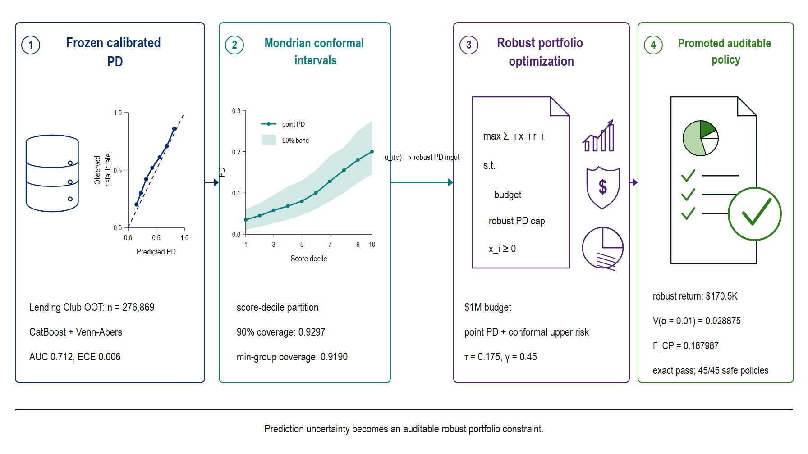

# Abstract

Credit models matter only through the decisions they change. We study how
finite-sample predictive uncertainty can constrain a loan portfolio after a
probability-of-default (PD) model has been frozen. Conformal Robust
Predict-Then-Optimize (CRPTO) recomputes a 90% Mondrian conformal upper endpoint
exactly, forms the transparent decision score $q_i=(p_i+u_i)/2$, and places
$q_i$ in a portfolio-risk constraint while retaining point PD in the economic
objective. Nine round-number policies are ranked on November 2017 without
default, realized-return, miscoverage, or assumption-conditional columns; an
outcome-free December replay selects the same rule before its outcomes are
opened. That audit misses nominal funded-set coverage, making the statistical
boundary observable rather than rhetorical. The policy is then replayed on
276,869 out-of-time Lending Club loans.
It funds 308 loans and earns `$179,327.59` on a `$1M` budget, with weighted
default `0.039375`, weighted miscoverage `0.036875`, and conformal endpoint
budget `0.258051`. A matched point-PD allocation earns `$196,369.14` but has
weighted default `0.118400` and endpoint budget `0.921317`. Thus CRPTO pays
`8.678%` of realized return for a `7.9025` percentage-point default reduction;
the advantage reverses in some temporal slices, so we do not claim universal
dominance. The contribution is a small, auditable prediction-to-decision
guardrail with an exact replay, an inspectable selector, and explicit statistical
boundaries, rather than another credit-scoring leaderboard or a collection of
policy variants.

**Keywords:** conformal prediction; predict-then-optimize; credit risk;
portfolio optimization; calibration; reproducible data science.

# Introduction

Credit allocation is a contextual optimization problem. A lender estimates a
PD and then chooses which loans to fund under capital, concentration, and risk
constraints [@sadana2025contextual]. Credit-scoring research has made the first
step increasingly reliable through discrimination benchmarks, probability
calibration, and cost-aware evaluation [@lessmann2015; @chen2024creditrisk;
@yang2025costaware]. Yet a calibrated probability does not specify how much
model uncertainty a portfolio should bear. A point-PD optimizer can concentrate
capital in loans that look attractive precisely where the predictive model is
least certain.

Conformal prediction offers finite-sample coverage language under explicit
exchangeability conditions [@vovk2005; @angelopoulos2023], while robust
optimization makes uncertainty operational through feasibility sets
[@bertsimas2004; @goldfarb2003robustportfolio]. Joining the two is attractive,
but an applied paper still has to answer three questions. Which conformal level
is informative rather than nearly vacuous? How is a policy selected without
using the outcomes on which it is later reported? And what economic value is
lost when conformal uncertainty actually changes the funded set?

CRPTO answers those questions with one deliberately simple policy. A frozen,
calibrated CatBoost model produces $p_i$. An exactly replayed 90% Mondrian
recipe produces upper endpoint $u_i$. The portfolio uses their midpoint,

$$
q_i = p_i + 0.5(u_i-p_i) = \frac{p_i+u_i}{2},
$$

inside the risk constraint. The economic objective remains point-PD expected
net return. This separation is important: $p_i$ prices expected loss, while
$q_i$ limits the amount of uncertainty the funded portfolio may carry. It also
removes the capped, tail-focused, and uncertainty-penalty branches that made an
earlier research frontier difficult to explain and easy to misread.

The empirical design uses a temporal Lending Club panel. The conformal recipe
is fit inside the calibration period, November 2017 ranks a declared
$3\times3$ grid of round-number risk tolerances and conformal weights, and
December replays the outcome-free selector before auditing the already-fixed
decision. The ranking artifact contains no defaults, realized returns,
miscoverage, or assumption-conditional statistics. The fixed rule is then
evaluated on loans originated from January 2018 through September 2020. Earlier
project development did inspect this static OOT corpus, so we describe the
final run as a transparent retrospective lockbox replay, not as a pristine
prospective or preregistered trial.

The paper makes three contributions. First, it gives an auditable
prediction-to-decision construction in which the economic objective and the
conformal guardrail have separate, inspectable roles. Second, it replaces
approximate cross-alpha scaling with an exact replay, a deterministic endpoint
screen, and a temporally separated selector audit. Third, it reports the price
and limits of that guardrail against matched point-PD and more-conservative
comparators, including a pre-OOT funded-set coverage miss and temporal slices
where CRPTO wins and slices where it does not. The novelty is the closed,
inspectable decision protocol for a frozen credit model, not a claim that
conformal prediction, robust optimization, or credit scoring is individually
new.

{#fig-crpto-pipeline width="92%" fig-alt="Four-stage CRPTO pipeline from calibrated PD to conformal intervals, portfolio allocation, and funded-set audit."}

# Related Work

CRPTO sits at the intersection of conformal prediction, robust optimization,
and decision-focused learning. Split conformal methods provide marginal
coverage without a parametric posterior, while Mondrian variants condition on
declared partitions [@vovk2005; @bostrom2021]. Conditional and weighted
extensions require additional structure, and exact conditional coverage is
generally unavailable without restrictive assumptions [@barber2021limits;
@barber2023beyond; @jonkers2024wcps]. We therefore distinguish population or
partition coverage from coverage after a portfolio has adaptively reweighted
the loans.

Data-driven robust and contextual optimization translate predictive
uncertainty into decisions [@bertsimas2018datadriven;
@bertsimas2020prescriptive; @sadana2025contextual]. Recent work uses conformal
sets directly in robust optimization [@johnstone2021; @patel2024;
@sun2024ptc; @hu2026crc]. CRPTO is an applied complement: it retains a frozen
credit PD model, exposes the exact funded rows and uncertainty premium, and
compares the resulting allocation with a matched point-PD decision.

Decision-calibrated prediction sets and inverse conformal risk control go
further by calibrating downstream violation or regret and, after choosing a
robustness level, using a separate split to restore risk-estimation validity
[@zhou2026creme; @stratigakos2026decision_calibrated_sets]. CRPTO does not
import that guarantee into a batch portfolio where the optimizer chooses the
funded weights. Instead, it separates a deterministic endpoint-budget screen
from an independent post-selection audit and reports when selected-set
miscoverage misses its nominal target.

Decision-focused learning and SPO+ train predictions against downstream regret
[@donti2017; @elmachtoub2022; @mandi2024]. That is a different institutional
choice. CRPTO asks what can be done after a calibrated model already exists and
must remain unchanged for governance. A synthetic SPO+ comparison is retained
in the supplement because it confirms the expected distinction: decision-
focused training improves its own regret objective, whereas CRPTO produces an
auditable uncertainty-constrained funded set.

Credit-allocation research already covers profit scoring, P2P investment
recommendation, robust loan portfolios, rejection, and multiobjective risk
[@guo2016p2p; @zhao2016p2pportfolio; @serrano2016profitscoring; @chi2019p2p;
@babaei2020p2p; @xu2025profit_uncertainty_credit;
@xu2024profit_risk_credit]. Conformal credit scoring also means that the safe
claim is not "first use of conformal prediction in credit"
[@kawasumi2026ordinal]. The remaining gap is a file-backed protocol that shows
exactly how a conformal endpoint changes a budgeted credit decision and what
that change costs.

| Literature family | Existing contribution | CRPTO boundary |
|---|---|---|
| Credit scoring and calibration | Accurate, calibrated PD and cost-aware prediction. | Treats PD as an input contract; does not claim AUC leadership. |
| P2P and robust credit portfolios | Economic loan selection under risk and uncertainty. | Uses an exact conformal endpoint as a simple portfolio guardrail. |
| Conformal robust optimization | Coverage-backed uncertainty sets for downstream decisions. | Adds a frozen credit stack, funded-set audit, and matched economic comparator. |
| Decision-focused learning | Training-time reduction of decision regret. | Keeps the predictive model frozen and emphasizes post-hoc auditability. |
| Decision-risk calibration and valid selection | Calibrates decision losses or corrects validity after choosing among sets [@zhou2026creme; @hegazy2025valid_selection_conformal_sets]. | Uses a deterministic selector plus an independent diagnostic audit; formal selected-set validity is not asserted. |

: Closest-work boundary for the submitted CRPTO claim.

# Data and Evaluation Design

The data are Lending Club retail loans originated from 2007 through 2020. The
feature contract contains only information available at origination. The model
and evaluation pipeline use temporal rather than random splits.

| Split | Period | Loans | Role |
|---|---|---:|---|
| Train | Jun 2007--Mar 2017 | `1,346,311` | Fit the PD model and calibrator. |
| Conformal fit | Mar--Oct 2017 | `142,550` | Estimate the frozen conformal recipe. |
| Policy selection | Nov 2017 | `14,943` | Rank the nine outcome-free policies. |
| Calibration audit | Dec 2017 | `20,695` | Replay the selector, then open outcomes. |
| OOT evaluation | Jan 2018--Sep 2020 | `276,869` | Freeze-then-evaluate portfolio decisions. |

: Temporal Lending Club design.

The frozen conformal recipe uses the most recent 75% of the original
calibration pool (`178,188` rows). Within that subset, `142,550` rows estimate
conformal quantiles, `14,943` November rows select the policy, and `20,695`
December rows form a pre-OOT audit. The conformal recipe uses calibration
labels, as conformal prediction requires. The loader stores holdout outcomes
separately from the 12-column policy frame, which contains identifiers,
origination context, PD endpoints, amounts, and rates. Ranking cannot access
outcomes, realized returns, miscoverage, or the assumption-conditional Markov
quantity. December first reruns that same outcome-free selector and only then
joins outcomes for the decision audit.

The final OOT panel covers several regimes, including the 2020 disruption. We
report the full panel and five temporal slices (`2018H1`, `2018H2`, `2019H1`,
`2019H2`, and `2020+`). Each slice solves the same fixed policy on a fresh `$1M`
budget, so slice returns are comparable stress evaluations rather than
components that sum to the full-panel return.

# Method

## Calibrated PD and Exact Conformal Replay

Let $p_i\in[0,1]$ be the calibrated PD for loan $i$. The predictive layer is a
frozen CatBoost classifier with AUC `0.7139`, Brier score `0.1544`, and expected
calibration error about `0.0070` on the paper-facing evaluation. These values
are not presented as a leaderboard result; probability quality matters because
the downstream objective consumes PD directly.

The conformal recipe partitions calibrated scores into five score-quantile
Mondrian cells. For calibration loan $j$, it computes a scaled residual

$$
s_j = \frac{|Y_j-p_j|}{\sqrt{p_j(1-p_j)}},
$$

with numerical clipping near zero. Each cell uses the finite-sample `higher`
quantile at the frozen conservative level `0.095` for the target
$\alpha=0.10$. Recorded group and temporal widening factors are then applied
without narrowing. The upper endpoint is
$u_i=\min\{1,p_i+\widehat q_{g(i)}\sqrt{p_i(1-p_i)}\}$ after those frozen
adjustments.

The replay implementation reconstructs this recipe from its result payload. At
the reference 90% level, it reproduces the stored point, lower, and upper
vectors with maximum absolute error below `6.67e-16`. This matters because an
earlier exploratory analysis scaled 90% row radii using average widths from a
different conformal family. Those cross-alpha values are retained only as
historical provenance and are not used here.

## One Portfolio Policy

Let $a_i$ be loan amount, $x_i\in[0,1]$ the funded fraction, $r_i$ the coupon,
$L=0.45$ loss given default, $B=1{,}000{,}000$, and $\tau$ the portfolio risk
tolerance. CRPTO solves

$$
\begin{aligned}
\max_x\quad & \sum_i x_i a_i(r_i-p_iL) \\
\text{s.t.}\quad
& \sum_i x_i a_i \le B, \\
& \sum_i x_i a_i q_i \le \tau\sum_i x_i a_i, \\
& 0\le x_i\le \bar x_i,
\end{aligned}
$$

with the existing concentration and eligibility constraints. The selected
policy uses $\tau=0.17$ and $q_i=(p_i+u_i)/2$. The objective is intentionally
based on $p_i$, not $q_i$: expected economics and uncertainty feasibility are
separate contracts. The matched point-PD baseline changes only the risk score
to $q_i=p_i$ while holding candidates, budget, concentration, LGD, solver, and
risk tolerance fixed.

For funded-exposure weights
$w_i=x_ia_i/\sum_jx_ja_j$, define

$$
\begin{aligned}
\Gamma_{\mathrm{CP}} &= \sum_iw_i(u_i-p_i),\\
\Gamma_{\mathrm{int}} &= \sum_iw_i(q_i-p_i),\\
\Gamma_{\mathrm{res}} &= \sum_iw_i(u_i-q_i),\\
B_u &= \sum_iw_i u_i.
\end{aligned}
$$

For the midpoint policy,
$\Gamma_{\mathrm{int}}=\Gamma_{\mathrm{res}}=\Gamma_{\mathrm{CP}}/2$.
This identity is one reason to prefer the midpoint over nonlinear caps or tail
rules: every quantity has a direct interpretation.

## Calibration-Only Final Selector

The candidate set crosses
$\tau\in\{0.15,0.17,0.19\}$ with
$\gamma\in\{0.25,0.50,0.75\}$ in
$q_i=p_i+\gamma(u_i-p_i)$. A candidate is eligible when the solver is optimal,
at least 99.9% of the budget is allocated, the effective-PD cap holds, and

$$
B_u\le 0.28
$$

on the November block. Among eligible candidates, the rule maximizes expected
point-PD objective. Five of nine candidates pass, and the selected candidate is
$\tau=0.17,\gamma=0.50$. The endpoint cap is deterministic; it does not use
the weighted-validity assumption introduced below. The selected row remains
optimal for every cap in $[0.259036,0.290491)$, so the round `0.28` value has
positive margin to both policy-change boundaries. An outcome-free replay on
December independently selects the same candidate.

| Candidate | $\tau$ | $\gamma$ | Nov. expected objective | Nov. $B_u$ | Dec. $B_u$ | Status |
|---|---:|---:|---:|---:|---:|---|
| Higher-return, low guardrail | `0.17` | `0.25` | `$109,885.56` | `0.375105` | `0.396751` | Ineligible |
| Selected midpoint | `0.17` | `0.50` | `$99,387.12` | `0.259036` | `0.262082` | Selected twice |
| More-conservative blend | `0.17` | `0.75` | `$93,760.13` | `0.202259` | `0.203504` | Eligible |
| Higher risk tolerance | `0.19` | `0.50` | `$102,671.87` | `0.290491` | `0.294861` | Ineligible |

: Temporally separated selector examples. A36 reports all nine candidates on
both months.

## Accounting and Statistical Boundary

Let $Z_i=\mathbf 1\{Y_i>u_i\}$ and
$V=\sum_iw_iZ_i$. Because $Y_i\le u_i+Z_i$ for every funded loan,

$$
\sum_iw_iY_i\le B_u+V
$$

holds deterministically. It is an exact funded-set accounting statement, not a
coverage theorem.

If one additionally assumes weighted funded-set validity,
$\mathbb E[V]\le\alpha$, Markov's inequality gives

$$
\Pr\!\left(\sum_iw_iY_i\ge B_u+\sqrt{\alpha}\right)
\le\sqrt{\alpha}.
$$

This assumption does not follow from marginal split conformal because the
optimizer chooses the weights using $p_i$ and $u_i$. We therefore treat the
Markov expression as a secondary, assumption-conditional sensitivity. The
primary evidence is the exact replay, OOT-outcome-column-free policy ranking
conditional on the frozen conformal recipe, and observed funded-set audit.
Full proofs and sharper-assumption diagnostics are in the online supplement.

# Results

## Exact 90% Conformal Evidence

At the active target $\alpha=0.10$, exact OOT coverage is `0.934836`, average
interval width is `0.788879`, minimum score-partition coverage is `0.926310`,
minimum letter-grade coverage is `0.926797`, and `51.7873%` of upper endpoints
equal one. The intervals are conservative and broad, which is expected for a
binary outcome on the probability scale.

The exact alpha sensitivity explains why the paper does not headline a 99%
interval. At target alpha `0.01`, empirical coverage is `0.996720`, but average
width is `0.988215` and `93.5424%` of upper endpoints equal one. Such endpoints
carry almost no ranking information for a portfolio. The selected 90% level is
the frozen recipe's reference level and preserves materially more decision
resolution. A35 reports the complete sensitivity from alpha `0.01` to `0.20`.

## Pre-OOT Selector and Decision Audit

November selects the midpoint policy from five eligible rows. Applying the
same outcome-free rule to December again selects `linear-005`; policy identity
is therefore stable across the two calibration months. Outcomes are opened
only after that replay.

| December policy | Funded | Realized return | Weighted default | Miscoverage | $B_u$ |
|---|---:|---:|---:|---:|---:|
| Selected 50/50 CRPTO | `193` | `$53,313.05` | `0.145650` | `0.124925` | `0.262082` |
| More-conservative 75% blend | `191` | `$38,379.50` | `0.155250` | `0.134525` | `0.203504` |
| Point-PD matched-$\tau$ | `169` | `$89,732.35` | `0.185650` | `0.058300` | `0.888071` |

: Independent December 2017 post-selection decision audit.

The selected policy remains below its operational tolerance
(`0.145650 < 0.17`) but misses nominal funded-set coverage
(`V=0.124925 > 0.10`). Its deterministic accounting right-hand side is
`B_u+V=0.387007`. Thus an outcome-free, month-stable selector does not create
selected-set conformal validity. This negative audit is part of the result: it
motivates the two-layer reporting of deterministic endpoint exposure and
observed miscoverage instead of relabeling marginal coverage as a portfolio
guarantee.

## Full OOT Funded-Set Audit

The fixed midpoint policy allocates the full `$1M` budget across 308 loans. Its
expected point-PD objective is `$168,271.56`; realized return is `$179,327.59`.
The weighted default rate is `0.039375`, and weighted miscoverage is `0.036875`.

| Quantity | OOT value |
|---|---:|
| Weighted point PD | `0.081949` |
| Weighted midpoint score | `0.170000` |
| $\Gamma_{\mathrm{CP}}$ | `0.176102` |
| $\Gamma_{\mathrm{int}}$ | `0.088051` |
| $\Gamma_{\mathrm{res}}$ | `0.088051` |
| Endpoint budget $B_u$ | `0.258051` |
| Observed accounting bound $B_u+V$ | `0.294926` |
| Conditional Markov threshold | `0.574279` |

: Exact full-OOT audit of the selected policy.

The observed weighted outcome `0.039375` is well below the exact accounting
right-hand side `0.294926`. Under the additional weighted-validity assumption,
the `0.574279` event threshold has probability bound
$\sqrt{0.10}=0.316228$. This loose probability statement is not interpreted as
a direct default cap. The operational controls are $\tau=0.17$, the midpoint
score, and the exact funded-set diagnostics.

The primary fixed-allocation bootstrap resamples 31 origination-month clusters
and gives a 95% return interval of `$163,421.14`--`$193,551.65` from 5,000
draws. A loan-level sensitivity gives
`$162,706.17`--`$193,924.74`. Neither scheme resamples the model, conformal
recipe, policy selector, or optimizer; both are contribution-level stability
diagnostics rather than full-pipeline confidence intervals. The month-level
scheme is primary because the temporal results reject a naive independence
story across loans.

## Matched Point-PD and More-Conservative Comparators

| Policy | Funded | Realized return | Weighted default | Miscoverage | $B_u$ | Conditional threshold |
|---|---:|---:|---:|---:|---:|---:|
| Selected 50/50 CRPTO | `308` | `$179,327.59` | `0.039375` | `0.036875` | `0.258051` | `0.574279` |
| More-conservative 75% blend | `312` | `$172,939.50` | `0.035875` | `0.035875` | `0.200396` | `0.516624` |
| Point-PD matched-$\tau$ | `225` | `$196,369.14` | `0.118400` | `0.041900` | `0.921317` | `1.237545` |

: Full-OOT matched decision comparison.

Relative to point PD, selected CRPTO gives up `$17,041.55`, or `8.678%` of
realized return. Weighted default falls by `7.9025` percentage points,
miscoverage falls by `0.5025` percentage points, and the endpoint-plus-Markov
threshold falls by `66.3266` percentage points. The default contrast is much
larger than the miscoverage contrast: conformal robustness changes which loans
are funded, but it does not create a dramatic selected-set coverage gain.

The 75% blend reveals the remaining internal trade-off. It lowers default by
`0.35` percentage points and the threshold by `0.057655` relative to the
selected midpoint, but costs another `$6,388.08` in realized return. The
calibration selector chooses the midpoint because it is the highest expected-
objective candidate under the declared screen, not because it dominates every
risk metric.

## Temporal Heterogeneity

The full-panel average hides substantial regime dependence.

| Period | CRPTO return | Point-PD return | CRPTO default | Point-PD default |
|---|---:|---:|---:|---:|
| 2018H1 | `$92,530.73` | `$118,101.99` | `0.106703` | `0.190825` |
| 2018H2 | `$156,185.51` | `$95,603.58` | `0.026725` | `0.236728` |
| 2019H1 | `$123,590.69` | `$144,281.46` | `0.077325` | `0.170275` |
| 2019H2 | `$110,251.95` | `$256,966.20` | `0.103250` | `0.023775` |
| 2020+ | `$99,689.54` | `$218,629.14` | `0.083775` | `0.016900` |

: Fixed-policy temporal stress evaluation; each row uses a fresh `$1M` budget.

CRPTO is economically and statistically attractive in 2018H2, when the
point-PD portfolio concentrates heavily in realized defaults. In 2019H2 and
2020+, the point-PD policy earns much more and defaults less. The honest result
is therefore a full-period return-risk trade-off with temporal heterogeneity,
not a universal robustness premium. This pattern also cautions against treating
a static conformal guardrail as a substitute for live recalibration.

## Funded-Set Composition

The selected allocation is concentrated in grades C and D: they represent
`31.36%` and `58.68%` of funded exposure. Grade F is only `1.30%` of exposure
but has a high realized default rate (`0.269231`), illustrating why aggregate
metrics should be accompanied by composition. A38 reports every funded grade
and reconciles to the full `$1M` allocation. Because Lending Club does not
provide the protected attributes needed for a legal fair-lending audit, this is
a business-risk composition check, not a fairness certification.

# Robustness, Comparators, and Implications

The online supplement contains the evidence that helps a reviewer challenge
the one active method without turning the paper into several methods: exact
alpha saturation (A35), all nine selector cells (A36), temporal evaluation
(A37), grade composition (A38), fixed-allocation bootstrap (A39), and matched
comparators (A40). Earlier OCE/CVaR, dependence, online-style, SPO+, Prosper,
and Freddie/Mendeley analyses are retained as diagnostics or external context.
They do not select the active policy or create additional claims.

For a credit committee, the useful control is not the Markov threshold by
itself. The committee first chooses a conventional conformal level, a
transparent blend $\gamma$, and a portfolio tolerance $\tau$. It can then read
the economic cost, endpoint exposure, realized default, and temporal behavior
together. In this application the midpoint rule has a clear interpretation:
half of the conformal premium enters the enforceable risk score and half remains
visible as residual endpoint exposure.

The matched baseline turns that interpretation into a decision. A committee
that accepts the full-period evidence pays `8.678%` of realized return for a
`7.9025` percentage-point reduction in weighted default. A more conservative
committee can move to the 75% blend and pay an additional `$6.4K`. A committee
that emphasizes the 2019H2 or 2020 regimes should reject the static CRPTO rule
or require a new temporal recalibration protocol. The method exposes that
choice rather than hiding it behind a single score.

# Reproducibility and Limitations

The research bundle versions code, manuscript sources, configurations, tables,
figures, and governance files together. Heavy data and model artifacts are
stored separately and checked by hashes. The active evidence builder regenerates
A35--A40 from the frozen exact-alpha and policy outputs. Claim-sync tests verify
that the body, supplement, and official IJDS LaTeX manuscript share the same
policy, selector counts, and numeric anchors.

Several limitations bound the contribution. First, Lending Club retail
origination ended in 2020; the panel is historical and cannot establish live
post-2020 performance. Second, the final tagged selector is outcome-free with
respect to OOT ranking, but earlier project development inspected the same
static OOT corpus. The evaluation is therefore retrospective, not a new
prospective holdout. Third, the conformal intervals are broad because the
outcome is binary; at 90%, more than half of OOT upper endpoints equal one.
Fourth, marginal or Mondrian coverage does not imply validity under
optimizer-selected funded weights. The independent December audit makes this
visible: the same policy is reselected without outcomes, yet funded-set
miscoverage is `0.124925`. The Markov result is therefore conditional on an
explicit weighted-validity assumption and is absent from policy selection.
Fifth, temporal slices show that the point-PD comparator can dominate both
return and default. Finally, public data do not support a legal fair-lending
certification or a causal interpretation of policy contrasts.

These limitations suggest a focused next step rather than a larger current
paper: a genuinely prospective or formally selection-valid protocol that
freezes conformal and policy choices before a new evaluation period
[@farinhas2024nonexchangeable_crc; @hegazy2025valid_selection_conformal_sets;
@zhou2026creme].
It is not required to interpret the present retrospective decision audit.

For double-anonymous review, author-identifying repository URLs are omitted
from the manuscript. The code/data companion and artifact-access instructions
can be disclosed under the journal's policy without embedding credentials or
identity in the anonymous PDF.

# Conclusion

CRPTO shows how a frozen credit model can become an auditable portfolio
decision without adding a maze of policy variants. An exact 90% conformal
replay produces $u_i$; the midpoint $q_i=(p_i+u_i)/2$ constrains risk; and a
nine-cell November selector fixes $\tau=0.17$ under the deterministic
$B_u\le0.28$ screen. December independently selects the same rule, then misses
nominal funded-set coverage; this is why CRPTO reports observed miscoverage
rather than claiming that policy stability implies conformal validity.
On the full OOT panel, the policy earns `$179,327.59`, with weighted default
`0.039375`, miscoverage `0.036875`, $\Gamma_{\mathrm{CP}}=0.176102$,
$\Gamma_{\mathrm{res}}=0.088051$, endpoint `0.258051`, observed accounting
bound `0.294926`, and conditional Markov threshold `0.574279`. Against the
matched point-PD allocation, it pays `8.678%` of realized return for a
`7.9025` percentage-point default reduction. Temporal reversals keep the claim
narrow: CRPTO is an inspectable retrospective return-risk guardrail, not a
universal winner, prospective deployment guarantee, or new credit-scoring
leaderboard.
