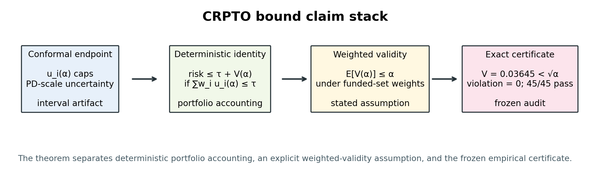

# Abstract

Credit allocation is a data-science-for-decisions problem: calibrated default
probabilities matter only after they shape which loans are funded. We introduce
Conformal Robust Predict-Then-Optimize (CRPTO), a post-hoc bridge that maps a
frozen calibrated probability-of-default artifact through Mondrian conformal
intervals into robust portfolio constraints and an empirical funded-set audit.
On a 276,869-loan out-of-time Lending Club
evaluation, the promoted economic policy earns `$170.5K` on a `$1M` budget while
passing the $\alpha = 0.01$ funded-set audit ($V(\alpha) = 0.028875$,
$\Gamma_{\mathrm{CP}} = 0.187987$, zero violation). The final robust region
contains `45/45` alpha-safe policies across the evaluated risk, uncertainty, and
aversion grid, indicating that the result is not a single-point artifact.
External frozen replications on Prosper marketplace loans and Freddie/Mendeley
single-family mortgages preserve the conformal gates and produce positive robust
LP objectives, so the result is not confined to the Lending Club panel.
Across these external panels the price of robustness is a positive premium that
grows with the panel default rate (from `+1.0%` to `+9.5%`). The contribution is
a conformal-robust credit-portfolio decision certificate with a distribution-free
funded-set risk bound: it connects real credit data, calibrated predictive
models, robust funding decisions, and a drift harness that regenerates the
prediction-to-decision chain bit-exactly from frozen artifacts while keeping the
statistical guarantee boundary explicit.

**Keywords:** conformal prediction; robust optimization; predict-then-optimize;
credit risk; portfolio optimization; reproducible data science.

# Introduction

Credit allocation is a predict-then-decide problem. A lender first estimates a
probability of default (PD), then chooses which loans to fund under a budget and
risk appetite. The modeling literature has become very good at the first step:
calibration, discrimination, and backtesting are now standard ingredients of
credit-risk model validation [@lessmann2015; @chen2024creditrisk]. The second step is
less settled. Once a calibrated PD enters an optimizer, uncertainty is often
treated as a reporting diagnostic rather than as a constraint that can change
the funded set.

That separation is uncomfortable in auditable credit decisions. A portfolio
policy can have a reasonable average PD and still concentrate probability mass
in loans where the model is most uncertain. Conversely, a policy that is too
conservative can pass every risk check while destroying economic value. The
scientific question in this paper is therefore not whether one can build a
slightly better credit classifier. It is whether finite-sample predictive
uncertainty can be carried into a robust portfolio decision in a way that is
transparent enough for a reviewer to audit. This has practical stakes. In a
pre-registered randomized trial, conformal prediction sets
improved human decision making relative to fixed-size sets with the same
coverage [@cresswell2024]. CRPTO takes that committee-facing idea into a credit
portfolio setting, where the uncertainty summary must change a funding decision
or it is just another report.

CRPTO answers this question with a post-hoc, reproducible pipeline. It starts
from a calibrated CatBoost PD model, constructs Mondrian conformal intervals
over PD-scale predictions, and maps the upper conformal endpoint into robust
portfolio constraints. The pipeline is modular by design: the predictive model,
conformal layer, optimization policy, and paper artifacts each have separate
contracts. That separation lets the paper ask whether a frozen prediction
system can be converted into a defendable decision system without reopening
hyperparameter search whenever the manuscript or appendix changes.

The empirical setting is the Lending Club retail-loan panel, with an
out-of-time evaluation set of 276,869 loans. The promoted economic policy earns
`$170,464.54` on a `$1M` budget, passes the exact empirical funded-set audit at
$\alpha = 0.01$, and lies inside a robust region where `45/45` evaluated
policies satisfy the same exact alpha-safe check. The headline result is not a
single lucky allocation. It is a reproducible bridge from calibrated
probabilistic learning to robust, auditable credit portfolio choice. To address
the natural "single dataset" concern without reopening the Lending Club
champion, we also freeze two external economic replications: Prosper final-status
marketplace loans and a Freddie/Mendeley single-family mortgage panel with
out-of-sample and out-of-time splits. These replications are not new champions;
they test whether the same PD-to-conformal-to-LP recipe remains economically
usable on different credit products.

The paper makes five contributions. First, it gives a CRPTO construction for
credit portfolios: frozen calibrated PD, Mondrian conformal uncertainty, and
robust budgeted optimization as a post-hoc decision audit. Second, it proves a
distribution-free funded-set risk bound (Theorem 1) that splits realized
portfolio loss into the conformal upper-endpoint budget
$B_u(\alpha) = \tau + (1-\gamma)\,\Gamma_{\mathrm{CP}}(\alpha)$ and the weighted
miscoverage $V(\alpha)$, with supplement propositions showing that Markov is
optimal under the stated assumption (A.1) and locating the cluster structure
that would tighten it (A.2). Third, it locates that construction relative to
data-driven robust optimization, P2P lending portfolio models, conformal credit
scoring, and decision-focused learning. Fourth, it provides an artifact-backed
empirical study where every table and figure is generated from frozen outputs
rather than manually transcribed summaries. Fifth, it adds external economic
replications on Prosper and Freddie/Mendeley, separating the methodological
claim from one P2P panel. The
key claim is narrow: CRPTO maps frozen calibrated PD artifacts into a robust
funded set, reports the portfolio-level conformal premium
$\Gamma_{\mathrm{CP}}$, and verifies exact alpha-safe weighted miscoverage on the
promoted Lending Club portfolio. The same conformal and LP gates remain viable
on two additional credit datasets, while the paper keeps the governance boundary
between safe paper-facing reruns and protected champion-changing stages visible.

Read as data science for decisions, the paper's four components are explicit.
The data component is a static Lending Club OOT panel, with Prosper and
Freddie/Mendeley replications used only as frozen external stress tests. The
model component is the CRPTO bridge from calibrated PD to Mondrian conformal
uncertainty to robust LP. The decision component is the funded set under a
budget and risk cap. The implication is a reproducible audit surface for model
risk committees: the paper reports not only return, but also the conformal
premium, exact funded-set miscoverage, region stability, and the boundary beyond
which a new protocol would be required.

{#fig-crpto-pipeline width="94%" fig-alt="Four-stage CRPTO pipeline from frozen calibrated PD to Mondrian conformal intervals, robust portfolio optimization, and promoted auditable policy."}

# Related Work

CRPTO builds on conformal prediction, especially split conformal methods and
their risk-control extensions [@vovk2005; @angelopoulos2023;
@angelopoulos2024risk]. The relevant property is not that conformal intervals
are the narrowest possible uncertainty summaries. It is that they provide
distribution-free coverage language under explicit exchangeability assumptions,
and that this language can be audited without trusting a fully parametric
posterior. Mondrian and group-conditional variants are especially natural in
credit because risk grades are already used as business and governance
partitions [@bostrom2021; @gibbs2024]. The paper keeps the stronger localized,
weighted, and conditional claims separate because recent impossibility and
weighted-coverage results show that those guarantees require extra structure
[@barber2021limits; @barber2023beyond; @jonkers2024wcps].

The second foundation is robust optimization. Classical robust optimization
frames uncertainty as a set against which a decision must remain feasible, with
the price of robustness made visible as a design trade-off [@bertsimas2004].
Robust portfolio selection makes that trade-off operational for allocation
under parameter uncertainty [@goldfarb2003robustportfolio], whereas
distributionally robust optimization broadens the uncertainty object toward
moment or ambiguity sets [@delage2010dro]. Data-driven robust and
prescriptive-analytics work then connects predictive models to downstream
decisions while keeping the uncertainty-to-action contract explicit
[@bertsimas2018datadriven; @bertsimas2020prescriptive]. Recent work connects
conformal prediction and robust optimization more directly by using conformal
uncertainty sets in downstream decisions [@johnstone2021; @patel2024;
@hu2026crc]. CRPTO follows this line, but its empirical emphasis is different:
the uncertainty set is not an abstract benchmark instance, but a credit-risk
interval artifact with DVC/MLflow-style lineage, paper tables, and model-risk
documentation.

The third foundation is predict-then-optimize and decision-focused learning.
IJDS work on causal decision making sharpens the same warning: once an estimate
feeds an action, the relevant target can become the assignment rule rather than
only the intermediate effect-size estimate [@fernandezloria2022causaldecision].
SPO+ and modern decision-focused learning
ask models to respect the loss surface induced by the downstream decision
[@elmachtoub2022; @donti2017; @mandi2024]. CRPTO is more
conservative. It does not retrain the PD model end-to-end through the optimizer.
Instead, it asks what can be achieved when a calibrated predictive system is
already frozen and the decision layer must remain explainable to credit-risk
reviewers. Robust losses for decision-focused learning [@schutte2024robust]
share this protective intent, but operate at training time rather than as a
post-hoc auditable constraint.

The fourth foundation is machine learning and optimization for credit
decisions. Credit-scoring benchmarks define the performance frontier on retail
panels [@lessmann2015; @ayari2026; @xia2017]. Recent IJDS credit-risk work
shows how richer data structures such as firm graphs can improve rating
prediction [@das2023creditgraph], and cost-aware calibration work makes explicit
why probability quality matters when predictions feed asymmetric downstream
decisions [@yang2025costaware]. Work on fintech lending and consumer-credit
allocation studies platform structure, credit invisibility, measurement noise,
and scorecard equity [@jagtiani2019altdata; @albanesi2024credit;
@khandani2010consumer; @fuster2022predictably].
In the P2P/Lending Club decision neighborhood, prior work studies
instance-based investment support, P2P portfolio selection, profit scoring,
robust credit portfolio optimization, and multi-objective AI/OR funding
policies [@guo2016p2p; @zhao2016p2pportfolio; @serrano2016profitscoring;
@chi2019p2p; @babaei2020p2p; @aior2025lendingclub]. Recent ordinal conformal
credit-scoring work also means that the safe claim is not "no conformal
prediction in credit" [@kawasumi2026ordinal]. CRPTO does not compete on raw
ranking against this literature; its champion AUC is mid-range.
The contribution is the auditable bridge from a calibrated, frozen PD model to a
conformal robust portfolio decision, not another point on the credit-scoring
leaderboard.

Finally, recent work on conformal model selection for robust optimization,
multi-distribution conformal validity, online conformal portfolio methods,
end-to-end conformal risk training, robust conformal decision certificates, and
conformal satisficing motivates the journal-strengthening package
[@bao2025croms; @yang2026multidistribution; @liu2026portfolio;
@zhou2025credo; @zhou2026creme; @zhao2025robust]. We use those ideas where they
can be evaluated from frozen CRPTO artifacts:
OCE/CVaR [@rockafellar2000cvar; @bental2007oce] appears as a tail-risk
diagnostic, robust satisficing appears as committee-style margin evidence, and
SPO+ motivates the regret-auditability frontier. The external Prosper and
Freddie/Mendeley runs are a separate, frozen replication protocol rather than a
new method-changing search. The remaining method-changing variants--optimized
OCE/CVaR objectives, online protocols, causal layers, and hybrid
decision-focused training--remain future work rather than hidden acceptance
criteria.

## Closest Work Boundary

Table 1 states the novelty boundary directly. CRPTO is not first in any broad
individual family; its claim is the combination of calibrated PD, conformal
uncertainty, robust credit-portfolio optimization, exact funded-set validation,
and reproducible artifact governance. The row labels aggregate the closest
families discussed above: P2P/Lending Club OR [@guo2016p2p;
@zhao2016p2pportfolio; @serrano2016profitscoring; @chi2019p2p; @babaei2020p2p;
@aior2025lendingclub], conformal credit scoring [@kawasumi2026ordinal],
conformal robust optimization [@johnstone2021; @patel2024; @hu2026crc],
decision-focused learning [@elmachtoub2022; @mandi2024; @schutte2024robust],
and conformal finance portfolios [@noguer2024portfolio; @kato2025;
@liu2026portfolio].

| Neighboring literature | What it already contributes | What CRPTO adds | Why not enough for auditable credit decisions |
|---|---|---|---|
| P2P/Lending Club OR | Credit investment recommendation and robust/multi-objective funding models. | Conformal PD uncertainty as the uncertainty set plus exact funded-set validation. | Leaves a gap between prediction uncertainty and a post-allocation certificate that a credit committee can inspect. |
| Conformal credit scoring | Conformal intervals for ordinal credit scores. | A downstream robust portfolio decision, not only score uncertainty. | Stops at score uncertainty; it does not audit a budgeted funded set or economic policy. |
| Conformal robust optimization | Conformal sets used in downstream robust decisions. | A frozen Lending Club credit-risk artifact stack with paper-facing audit trail. | Establishes the decision logic, but not the credit-specific PD governance, model lineage, and funded-set certificate. |
| Decision-focused learning | Training losses aligned with downstream regret. | A post-hoc governance path for institutions with existing calibrated PD models. | Improves training-time regret, but does not certify risk controls after a frozen production-style PD artifact. |
| Conformal finance portfolios | Portfolio use cases for financial markets. | Retail credit payoffs, default risk, funded-set checks, and model-risk documentation. | Market-return portfolios have different payoffs and governance obligations than binary default-driven credit funding. |

: Closest work boundary for CRPTO.

# Method

## Calibrated PD Layer

The predictive layer estimates a one-period default probability for each loan.
The champion model is a CatBoost classifier trained on the frozen feature
contract and calibrated before it is exposed to conformal and optimization
layers. The paper reports discrimination and probability quality together:
the PD layer reaches AUC `0.7139`, Brier score `0.1544`, and expected
calibration error approximately `0.0070` on the paper-facing evaluation
summary. These numbers matter because the optimizer consumes probabilities, not
rankings alone.

Calibration is treated as a contract. The downstream layers do not receive a
free-form classifier; they receive a calibrated PD vector, feature metadata,
and a model contract that fixes feature order and categorical handling. This
prevents a common reproducibility failure in applied predict-then-optimize
studies: a table can change because a preprocessing artifact drifted, even
though the optimization code did not change.

## Mondrian Conformal Layer

For each loan `i`, let `p_hat_i` denote the calibrated PD. The conformal layer
forms prediction intervals on the PD scale and records the upper endpoint
`u_i(alpha)`. Operationally, CRPTO evaluates Mondrian partitions rather than a
single global interval. The promoted uncertainty artifact uses a
score-decile-based Mondrian partition selected by out-of-time interval quality,
while grade-based partitions remain the natural governance baseline. The
score-decile choice keeps each cell well populated even at the tight
$\alpha = 0.01$, where a per-cell $99\%$ upper endpoint needs on the order of
$100$ calibration points; finer grade-period partitions are sparser, and the
supplement flags where small cells weaken coverage (notably the external Freddie
panel).

The resulting conformal summary is more than a scalar coverage
number. The paper-facing metrics include 90% coverage `0.9297`, 95% coverage
`0.9664`, average 90% interval width `0.7842`, minimum group 90% coverage
`0.9190`, and 90% Winkler score `1.1107` for the promoted conformal winner.
Because the outcome is binary and the intervals live on the clipped PD scale,
raw width is not a standalone utility claim. Its decision role is relative:
upper endpoints rank loans by protected downside risk, the funded-set audit
shows mean upper endpoints rising from `0.12529` in A-B to `0.52587` in E-G, and
the promotion gate uses Winkler score, funded-set miscoverage, and
$\Gamma_{\mathrm{CP}}$ rather than treating narrowness as the objective.
The full gate also scores material coverage, group coverage, interval width, and
alert rate, but not exact-nominal-coverage backtests: conformal intervals
over-cover by design, so testing for exact nominal coverage would penalize the
safety margin the method is meant to provide on a large out-of-time sample.

## Robust Portfolio Layer

The decision variable $x_i$ is the allocation fraction for each eligible loan;
$x_i a_i$ is the funded exposure. The optimizer maximizes expected net
economic return under a `$1M` budget and policy constraints that cap portfolio
risk after replacing point PD estimates with conformal upper endpoints. The
promoted policy has
`risk_tolerance = 0.175`, `policy_mode = blended_uncertainty`, policy parameter
`gamma = 0.45`, and `uncertainty_aversion = 0.1`.

Schematically, the robust decision layer solves a budgeted allocation problem
of the form

$$
\begin{aligned}
\max_x\quad & \sum_i x_i a_i \left(c_i - \tilde p_i(\alpha,\gamma)\,L\right) \\
\text{s.t.}\quad & \sum_i x_i a_i \le B,\\
& \sum_i x_i a_i \tilde p_i(\alpha,\gamma)
   \le \tau \sum_i x_i a_i,\\
& 0 \le x_i \le \bar x_i,
\end{aligned}
$$

where `a_i` is exposure, `c_i` is the loan coupon (interest rate), `L` is the
loss-given-default (`L = 0.45` in the frozen evaluation), $\tau$ is the
risk-tolerance cap, and

$$
\tilde p_i(\alpha,\gamma)
= \hat p_i + \gamma\left(u_i(\alpha)-\hat p_i\right)
$$

on the PD scale, clipped to the feasible probability range. The objective is the *expected*
net return `c_i - p_tilde_i * L`; the headline `$170,464.54` is the
*realized* return of the same funded set, scored post hoc on observed defaults
(a funded loan earns `c_i * a_i` if it survives and loses `L * a_i` if it
defaults). Separating the optimized expectation from the realized accounting is
deliberate: the optimizer never sees outcomes, so the realized figure is an
out-of-sample audit of the policy, not the objective it maximized. Additional
operational filters and caps live in the frozen policy configuration; the body
displays the core statistical-to-decision contract because that is the reusable
CRPTO pattern.

Two quantities are kept separate throughout the paper. The lowercase $\gamma$
is a policy parameter controlling how the optimizer blends uncertainty in the
portfolio rule. $\Gamma_{\mathrm{CP}}$, by contrast, is a portfolio-level conformal metric
computed after the funded set is chosen: it is the allocation-weighted gap
between the conformal upper endpoint and calibrated PD, with clipping at one
on the PD scale. In committee language, $\Gamma_{\mathrm{CP}}$ is the realized conformal
robustness premium paid by the funded set. The promoted policy has
$\Gamma_{\mathrm{CP}}(\alpha = 0.01) = 0.187987$, weighted miscoverage
$V(\alpha = 0.01) = 0.028875$, and zero exact violation at $\alpha = 0.01$. This
distinction is small typographically but central for auditability.

# Theory

The theoretical role of conformal prediction in CRPTO is modest and explicit.
For a fixed allocation evaluated on exchangeable calibration/test data,
conformal coverage controls the expected rate at which outcomes fall outside
the constructed uncertainty intervals. When funded-set weights are
non-negative and normalized, this yields a weighted miscoverage quantity
$V(\alpha)$ that can be monitored after the decision. Two statements are kept
separate. The deterministic portfolio identity (Theorem 1(i)) holds for any
allocation and needs no distributional assumption; it is the accounting the
exact certificate verifies. The probabilistic statement (Theorem 1(ii)) is a
Markov argument that requires weighted funded-set validity,
$E[V(\alpha)] \leq \alpha$, stated as Assumption 1. This is a modeling
assumption, not a property the single frozen draw establishes: on the promoted
funded set the realized weighted miscoverage is $V(0.01) = 0.028875$, *above*
the nominal $\alpha = 0.01$, which is the expected price of evaluating an
adaptively selected subportfolio rather than a fresh population. What the paper
certifies is therefore the exact accounting together with the safety level
$V \leq \sqrt{\alpha}$ that Markov delivers, not a claim that the funded set
attains nominal $\alpha$-coverage or that post-selection evaluation creates a
stronger conformal guarantee.

| Claim component | CRPTO evidence | Boundary |
|---|---|---|
| Deterministic portfolio identity | Exact funded-set audit computes $V$, $\Gamma_{\mathrm{CP}}$, and violation after allocation. | Does not require a new statistical guarantee. |
| Split/Mondrian validity | OOT coverage, minimum group coverage, and temporal diagnostics. | Not exact conditional coverage for every borrower profile. |
| Weighted funded-set validity | Exact alpha-safe certificate plus A23 weighted/multi-distribution stress evidence. | Assumption for the theorem; empirical audit after frozen selection. |
| Post-selection robustness | Nested 5K -> 25K -> 276K chain and `45/45` final robust-region pass. | Strong audit evidence, not a prospective live-selection guarantee. |

: Assumption-to-evidence map for the CRPTO bound.

The figure below is the paper's main guardrail against overclaiming: it
separates what is deterministic, what is assumed, and what is empirically
certified after the frozen selection.

{#fig-bound-claim-stack width="94%" fig-alt="Four-block bound claim stack separating conformal endpoint, deterministic identity, weighted validity assumption, and exact frozen certificate."}

Dependence is handled conservatively rather than assumed away. The main bound
does not require loan-level independence. Temporal structure is addressed by
the out-of-time design and backtests; any sharper concentration argument is
kept in the supplement, where the extra independence structure is stated
explicitly.

The compact validity ladder below fixes that boundary. CRPTO uses the first two
levels as evidence, states weighted funded-set validity as the theorem's
portfolio-level assumption, reports multi-distribution checks as diagnostics,
and leaves online/live control for a new protocol.

| Validity level | What it supports | CRPTO status |
|---|---|---|
| Marginal split conformal | Population-level coverage under exchangeability. | Core interval guarantee. |
| Mondrian/group conformal | Coverage within declared partitions. | Used for score-decile and grade audits. |
| Weighted/localized coverage | Coverage under weights, local neighborhoods, or selected groups. | Explicit theorem assumption plus A23 diagnostic evidence. |
| Multi-distribution coverage | Robustness across multiple source distributions. | Read-only stress evidence, not recalibration. |
| Online/adaptive coverage | Sequential alpha updates under live drift. | A24 replay only; not a live deployment claim. |

: Coverage-validity ladder used in the paper claims.

The bound is therefore read as three linked objects: a deterministic
accounting identity, an explicitly stated statistical assumption, and the
frozen empirical certificate that verifies the promoted decision exactly on
the 276,869-loan OOT evaluation. We now state the first two formally.

**Setup.** Fix the promoted allocation $x$, chosen without access to OOT
labels, with exposures $a_i > 0$ and funded-set weights
$w_i = x_i a_i / \sum_j x_j a_j$, so that $w_i \geq 0$ and $\sum_i w_i = 1$.
For each funded loan let $Y_i \in [0, 1]$ be the realized outcome on the PD
scale, $u_i(\alpha) \in [0, 1]$ its upper conformal endpoint, and
$Z_i(\alpha) = \mathbf{1}\{Y_i > u_i(\alpha)\}$ the miscoverage indicator.
The weighted funded-set miscoverage is
$V(\alpha) = \sum_i w_i Z_i(\alpha)$. Probabilities and expectations below are
taken over the exchangeable calibration/test draw, conditional on the frozen
recipe, declared partitions, and allocation rule.

**Assumption 1 (weighted funded-set validity).**
$E[V(\alpha)] \leq \alpha$ under the funded-set weights $w$ for that draw. This
is the explicit price of evaluating a selected portfolio rather than a single
population, and it does not follow from marginal split conformal. The
funded-set weights $w_i \propto x_i a_i$ are chosen by the optimizer and depend
on the conformal endpoints $u_i(\alpha)$, so they are not measurable with
respect to the Mondrian partition and inherit no per-cell coverage guarantee.
The assumption is therefore stated, audited empirically after the frozen
selection, and never silently upgraded to a guarantee — and the audit does not
find it slack: the realized $V(0.01) = 0.028875$ exceeds $\alpha = 0.01$, so the
operative safety level is the weaker $V \leq \sqrt{\alpha}$.

**Theorem 1 (distribution-free funded-set risk bound).**
Let $B_u(\alpha) = \sum_i w_i u_i(\alpha)$ be the weighted conformal
upper-endpoint budget of the funded set. Then:

(i) *(deterministic)* $\;\sum_i w_i Y_i \leq B_u(\alpha) + V(\alpha)$ always;

(ii) *(statistical)* under Assumption 1, for every $t > 0$,
$P(V(\alpha) \geq t) \leq \alpha / t$, and in particular

$$
P\!\left(\sum_i w_i Y_i \;\geq\; B_u(\alpha) + \sqrt{\alpha}\right)
  \;\leq\; \sqrt{\alpha}.
$$

*Proof sketch.* Since $Y_i \leq u_i(\alpha) + Z_i(\alpha)$ for every loan,
part (i) follows by taking the $w$-weighted sum; it is portfolio accounting and
needs no probability. Part (ii) is Markov's inequality applied to the
nonnegative variable $V(\alpha)$ with $E[V(\alpha)] \leq \alpha$ [@ghosh2002],
combined with (i). The full proof is in Online Supplement Appendix A. $\square$

**The optimizer's cap versus the endpoint budget.** The robust layer
does not constrain $B_u(\alpha)$ directly; it caps the $\gamma$-blended PD,
$\sum_i w_i \tilde p_i(\alpha,\gamma) \leq \tau$, with
$\tilde p_i = \hat p_i + \gamma(u_i(\alpha) - \hat p_i)$ and $\gamma \in [0,1]$.
Because $\Gamma_{\mathrm{CP}}(\alpha) = \sum_i w_i(u_i(\alpha) - \hat p_i)$, the
endpoint budget decomposes exactly as
$$
B_u(\alpha) = \sum_i w_i \tilde p_i(\alpha,\gamma) + (1-\gamma)\,\Gamma_{\mathrm{CP}}(\alpha)
  \;\leq\; \tau + (1-\gamma)\,\Gamma_{\mathrm{CP}}(\alpha),
$$
with equality when the risk cap binds. The term
$(1-\gamma)\,\Gamma_{\mathrm{CP}}(\alpha)$ is the conformal robustness premium the
optimizer leaves un-internalized at $\gamma < 1$. For the promoted policy
($\tau = 0.175$, $\gamma = 0.45$, binding cap),
$B_u(0.01) = 0.175 + 0.55\,(0.187987) = 0.278393$, so the deterministic bound is
$\sum_i w_i Y_i \leq 0.278393 + V(0.01) = 0.307268$, well above the realized
weighted default rate $0.032875$.

**Remark 1 (why $t = \sqrt{\alpha}$, and why Markov).**
The choice $t = \sqrt{\alpha}$ is made for interpretability, not optimality:
it gives the clean reading "miscoverage exceeds $\sqrt{\alpha}$ with
probability at most $\sqrt{\alpha}$" (for $\alpha = 0.01$, a $0.10$ excess
with probability at most $0.10$). Markov is deliberately the weakest
defensible argument: it uses only the first moment. Supplement
Propositions A.1--A.2 separate the boundary: under Assumption 1 alone the
best second-moment (Cantelli) threshold is *worse* than Markov, while explicit
cross-cluster structure is the extra condition under which Hoeffding-style
tightening becomes available [@hoeffding1963; @boucheron2013concentration]. We
keep those tightenings in the online supplement (A21) rather than in the
body, because the contribution here is the auditable decision construction,
not the sharpest possible tail bound. The exact certificate in this paper is
the empirical audit of the frozen selected policy, not a stronger
post-selection conformal theorem.

The theorem and the two supplement propositions should be read as one small
triptych. Theorem 1 gives the paper's guarantee once weighted funded-set
validity is accepted. Proposition A.1 shows that, without additional structure,
Markov is not a placeholder for a missing second-moment bound; it is the sharp
first-moment statement. Proposition A.2 then asks what extra structure would
buy a tighter threshold. In this temporal credit panel the defensible version is
cross-period or period-grade independence after the frozen recipe and allocation
are fixed: within a period, grade, or period-grade cell, defaults and interval
misses may remain dependent. The observed funded set is too exposure
concentrated for that cluster argument to tighten the headline bound, which is
why the body keeps Markov and the supplement reports the cluster calculation as
a sensitivity check.

# Experimental Design

The empirical study uses Lending Club retail-loan data covering originations
from 2007 through 2020. The raw panel is cleaned into a static feature store and
split temporally with a January 2018 cutoff, so that calibration and evaluation
use only loans originated after the training window. The calibration block plays
the dual role required by split conformal: it is held out from training and used
exclusively to fit the conformal quantiles. The final evaluation set contains
276,869 loans, large enough to stress both probability calibration and
decision-level robustness.

| Split | Period | Loans | Role |
|---|---|---:|---|
| Train | Jun 2007 -- Mar 2017 | `1,346,311` | Fit PD model and monotonic constraints. |
| Calibration | Mar 2017 -- Dec 2017 | `237,584` | Fit Mondrian conformal quantiles (held out from training). |
| Test (OOT) | Jan 2018 -- Sep 2020 | `276,869` | Evaluate coverage, run the portfolio decision, and audit the exact funded set. |

: Temporal out-of-time split. The January 2018 cutoff keeps the test window
(including the 2020 COVID regime) strictly after training and calibration, so no
future information leaks into the funded-set decision. The displayed periods are
monthly vintage labels; split assignment is row-disjoint in code, so the shared
March 2017 label marks the internal cutoff rather than duplicated loans.

The out-of-time design is adversarial to the method: the test window
spans an expansion (2018--2019) and a regime break (2020 COVID), so coverage and
the funded-set certificate are measured under a documented distribution shift
rather than on a random split that would let the model see the future.

The design distinguishes three kinds of computation. Predictive and conformal
searches choose models, calibration, partitions, and policy families. Those
searches are frozen for this manuscript. Paper-facing reruns regenerate tables,
figures, evidence summaries, and Quarto outputs from those artifacts.
Validation reruns are allowed only when they consume frozen choices and produce
a drift report against the recorded champion. This separation is central to
the paper's reproducibility claim: the manuscript can evolve without quietly
reopening the 276k-policy search that selected the promoted result.

All primary artifacts are represented as files with explicit ownership: model
binaries, calibration objects, conformal intervals, portfolio allocations,
tables, figures, and status reports. The anonymous submission describes the
bundle without revealing author identity. Repository and remote-storage URLs
will be disclosed according to the journal's double-anonymous and
data/code-disclosure policy.

The body-supplement split is fixed before submission. The body keeps the CRPTO
pipeline, the alpha-to-portfolio link, the robust-region evidence, and the core
metrics, plus the compact regret-auditability frontier. The online supplement
carries A3--A34, the conformal finalist ablation, funded-set loan audit,
tail-risk diagnostics, satisficing margins, dependence diagnostics, the CVaR/OCE
tail-constrained re-optimization (A22) and the multi-distribution (A23) and
online ACI-stability (A24) diagnostics, the external economic replication
tables (A25--A34), MRM/fairness material, and reproduction commands. This keeps
the IJDS body focused while preserving the audit trail that reviewers need.

## Multi-Dataset External Replication Protocol

The external-replication layer is narrower than a new benchmark
campaign. We reuse the frozen CRPTO recipe--CatBoost PD, calibration,
train-only WOE/IV feature screening, Mondrian conformal intervals, and the same
bound-aware robust LP--on two credit datasets with economic fields. Prosper
contributes final-status marketplace loans with observed outcome, loan amount,
yield/rate, and a temporal OOT window [@prosperLoanData]. Freddie/Mendeley
contributes processed single-family mortgage panels derived from the Freddie Mac
loan-level ecosystem, including 12--60 month default windows and train/OOS/OOT
splits [@freddieMacSfLoanLevel; @mushava2023classimbalance]. Home Credit was
audited but not promoted because it lacks a clean investment-return and exposure
contract comparable to Lending Club, Prosper, and Freddie.

The replication gate is fixed before inclusion: global 90% coverage must meet
target, the $\alpha=0.01$ conformal coverage must be reportable, and the LP must
return a positive robust objective when economic fields are available. This gate
does not re-promote the Lending Club champion and does not claim a new exact
funded-set theorem for every external portfolio. Its purpose is empirical:
address whether the method survives two materially different credit products.

# Results

The core metric table summarizes the paper-facing metrics. The
calibrated PD layer is not sold as a leaderboard model: AUC
`0.7139` is sufficient only because the downstream decision consumes calibrated
probabilities, not rankings alone. Its Brier score `0.1544` and ECE near
`0.0070` are therefore as important as discrimination. The conformal layer
over-covers marginally at the reported levels (90% coverage `0.9297`, 95%
coverage `0.9664` for the promoted conformal winner). On the funded set at the
tighter $\alpha = 0.01$, by contrast, coverage falls below nominal -- `95.01%`
unweighted and `97.11%` exposure-weighted (weighted miscoverage
$V = 0.028875$ versus the nominal `1%`) -- the adaptive-selection penalty made
explicit in the theory section. The portfolio layer turns this uncertainty into
a robust allocation whose exact certificate is the $V \leq \sqrt{\alpha}$ check.

| Layer | Metric | Value |
|---|---:|---:|
| PD | AUC | `0.7139` |
| PD | Brier score | `0.1544` |
| PD | ECE | `0.0070` |
| Conformal | Coverage 90% | `0.9297` |
| Conformal | Coverage 95% | `0.9664` |
| Conformal | Minimum group coverage 90% | `0.9190` |
| Conformal | Funded-set coverage ($\alpha = 0.01$, nominal `0.99`) | `0.9501` |
| Portfolio | Robust return | `$170,464.54` |
| Portfolio | $V(\alpha = 0.01)$ | `0.028875` |
| Portfolio | $\Gamma_{\mathrm{CP}}(\alpha = 0.01)$ | `0.187987` |
| Portfolio | Exact alpha violation | `0.0` |

: Frozen paper-facing metrics by layer.

The exact certificate is an accounting claim. Here "exact" means the quantities
are computed directly on the frozen OOT funded set rather than approximated by a
surrogate table or visual proxy, and the deterministic part requires no
distributional assumption. The certificate's `pass` is the Markov safety check
$V(\alpha) \leq \sqrt{\alpha}$ together with zero deterministic violation
($\sum_i w_i Y_i \leq B_u(\alpha)$); it is *not* a claim of nominal
$\alpha$-coverage, which the funded set does not attain
($V = 0.028875 > \alpha = 0.01$).

| $\alpha$ | $\Gamma_{\mathrm{CP}}$ | $V(\alpha)$ | $\sqrt{\alpha}$ | violation | pass |
|---:|---:|---:|---:|---:|:---:|
| `0.01` | `0.187987` | `0.028875` | `0.10000` | `0.00000` | yes |

: Exact certificate for the promoted funded set. `pass` denotes
$V \leq \sqrt{\alpha}$ with zero deterministic violation, not nominal
$\alpha$-coverage.

This makes $\Gamma_{\mathrm{CP}}$ more than a diagnostic line item. It is the amount of
conformal robustness the optimizer accepts in order to keep the funded set
inside the $\sqrt{\alpha}$-safe region. A credit reviewer can therefore read
$\Gamma_{\mathrm{CP}} = 0.187987$ as the price of carrying interval uncertainty into the
decision, and $V = 0.028875$ as the realized weighted noncoverage audit on the
same funded loans.

The miscoverage is concentrated rather than diffuse. As Figure @fig-alpha-gamma
shows, $V(\alpha)$ is nearly flat across the conformal level: the loans that miss
at a loose $\alpha$ still miss at the tight $\alpha = 0.01$, so widening the
intervals barely changes coverage. The residual risk sits in a few deep-tail
defaults whose realized outcome exceeds any reasonable conformal endpoint, which
is why $V$ stays above $\alpha$ and the operative safety level is read at
$\sqrt{\alpha}$ rather than $\alpha$.

The under-coverage is also not an artifact of the calibration draw. With
$n_{\mathrm{cal}} = 237{,}584$ calibration loans (and thousands per score-decile
cell), the split-conformal conditional-coverage result makes the marginal
coverage Beta-distributed about $1 - \alpha$ with standard deviation
$\sqrt{\alpha(1-\alpha)/n_{\mathrm{cal}}} \approx 0.0002$ at $\alpha = 0.01$ -- a
$\pm 0.04$ percentage-point band around the nominal $99\%$
[@vovk2005; @angelopoulos2023]. The endpoints $u_i(\alpha)$, and with them
$\Gamma_{\mathrm{CP}}$ and the budget $B_u$, are therefore essentially invariant
to which loans calibrate; the variability that remains in $V$ is test-side -- the
funded loans and their realized outcomes, effective size $\approx 126$ -- which
the bootstrap audit in the supplement (A16) quantifies. The funded-set
under-coverage is a structural selection effect, not a calibration-partition
artifact.

The promoted policy is the economic champion inside the exact-safe
region, not the tightest certificate available. The next table makes that
choice auditable rather than implicit.

| Policy role | $\tau$ | $\gamma$ | Realized return | $V(0.01)$ | $\Gamma_{\mathrm{CP}}$ |
|---|---:|---:|---:|---:|---:|
| Economic champion | `0.175` | `0.45` | `$170,464.54` | `0.028875` | `0.187987` |
| Theorem-tight comparator | `0.175` | `0.55` | `$166,269.82` | `0.026875` | `0.160299` |
| Balanced comparator | `0.170` | `0.45` | `$169,389.58` | `0.027875` | `0.179825` |

: Champion and comparator roles inside the final alpha-safe region.

The economic champion is the highest-return promoted point in the exact-safe
region. The theorem-tight comparator buys a tighter certificate at a return
cost, while the balanced comparator shows that a nearby lower-$\tau$ alternative
has similar economics.

It is worth anchoring the robustness cost in dollars rather than asserting it.
The price of robustness is defined as the non-robust baseline's
expected return minus the robust policy's expected return, both valued under
point PDs on the same `$1M` budget. For the champion it is `-$14,465.69`
(`-10.56%`); the negative sign is meaningful. Under the point-PD
valuation the robust policy is not more conservative on paper than the non-robust
baseline -- it is `$14,465.69` richer -- and the realized out-of-time return then
lands higher still. The committee-facing reading is the three-number ladder
below, all for the same promoted policy ($\tau = 0.175$, $\gamma = 0.45$,
$\alpha = 0.01$).

| Quantity | Value |
|---|---:|
| Non-robust baseline expected return (point PD) | `$137,014.58` |
| CRPTO robust expected return (point PD) | `$151,480.27` |
| CRPTO robust realized return (OOT) | `$170,464.54` |
| Price of robustness | `-$14,465.69` (`-10.56%`) |
| Funded rows / budget | `341` / `$1,000,000` |

: Economic anchor for the promoted champion. The robust policy improves the
point-PD expected return over the non-robust baseline (hence the negative price
of robustness), and the realized OOT return exceeds the robust expectation.

On this evaluation, robustness is not a toll paid in lost return. The conformal
robust funded set is ahead of the non-robust baseline under point-PD valuation
and still carries the exact alpha-safe certificate. The ledger matters because
it shows the direction of the trade-off: baseline expectation, robust
expectation, and realized OOT return are all reported on the same `$1M` budget.

The robust-region analysis asks whether that result depends on one lucky
hyperparameter setting. Across the evaluated final region, `45/45` unique
policies pass the exact $\alpha = 0.01$ check. The 45 policies come from the
cross-product of five risk-tolerance values, three uncertainty-blend ($\gamma$)
values, and three uncertainty-aversion settings within the bound-aware family.
Figure @fig-alpha-gamma traces how the conformal level $\alpha$ drives the
funded-set quantities $V(\alpha)$ and $\Gamma_{\mathrm{CP}}$, and
Figure @fig-robust-region maps realized return over the
risk-tolerance $\times\,\gamma$ grid: the economic champion is the highest-return
cell (top-left, $\tau = 0.175$, $\gamma = 0.45$), and moving right to a larger
$\gamma$ trades return for a tighter endpoint budget
$B_u(\alpha) = \tau + (1-\gamma)\Gamma_{\mathrm{CP}}$ (the $\gamma = 0.55$
theorem-tight comparator above). The selected policy is the economic champion
inside that exact robust region, not the first feasible point or the tightest
bound. The supplement adds the policy-family appendix.

The funded-set audit also matters because the bound is weighted by exposure,
not counted by loan. The promoted portfolio funds 341 positive-exposure loan
rows under the `$1M` budget, and its exact
`V = 0.028875` is concentrated mainly in the C/D exposure buckets rather than
hidden in an unreported tail segment.

| Grade bucket | Funded loans | Exposure share | Weighted default rate | `V` contribution | Mean `u_i(0.01)` |
|---|---:|---:|---:|---:|---:|
| A-B | `13` | `7.35%` | `0.00%` | `0.00000` | `0.12529` |
| C | `144` | `40.88%` | `2.86%` | `0.01168` | `0.17258` |
| D | `141` | `42.35%` | `3.94%` | `0.01370` | `0.35206` |
| E-G | `43` | `9.42%` | `4.78%` | `0.00350` | `0.52587` |

: Compact funded-set audit by grade bucket.

{#fig-alpha-gamma width="88%" fig-alt="Two-panel alpha sweep showing Gamma_CP, weighted miscoverage V, square-root alpha bound, and funded-set size for the promoted policy."}

{#fig-robust-region width="90%" fig-alt="Heatmap of robust-region realized return by risk tolerance and gamma, with the economic champion marked and all 45 policies alpha-safe."}

The compact reviewer checks below summarize the body-level defense. The
supplement expands the same structure into artifact and guardrail references.

| Reviewer concern | Body answer | Primary evidence |
|---|---|---|
| "This is only a classifier." | The claim is decision auditability, not AUC leadership. | Exact funded-set certificate and alpha-gamma figure. |
| "CP + RO already exists." | CRPTO instantiates the idea for frozen credit PD artifacts, funded-set governance, and Lending Club payoffs. | Closest-work boundary and bound claim stack. |
| "Adaptive selection breaks coverage." | The theorem states weighted funded-set validity as an assumption and then audits the frozen selection exactly. | Assumption map, validity ladder, and A23 diagnostics. |
| "The champion is cherry-picked." | The promoted policy is the best-return point inside a final `45/45` alpha-safe robust region. | Robust-region heatmap and protected-stage manifest. |

: Reviewer claim checks in the main manuscript.

## Multi-Dataset External Economic Replication

The natural generalization question after the 276,869-loan Lending Club audit is
whether the recipe still works outside the champion panel. The table below
answers that question without changing the champion: the same frozen recipe is
applied to two external credit products. Prosper is a
marketplace personal-loan panel with final statuses and a full OOT economic
candidate universe. Freddie FM48 is a collateralized mortgage panel, using the
48-month red+green default window with provided train/OOS/OOT structure. Both
pass the conformal gates and both return positive robust LP objectives.

| Dataset | Product | Rows | Default | AUC | Cov. 90% | Cov. alpha01 | OOT cand. | Robust LP |
|---|---|---:|---:|---:|---:|---:|---:|---:|
| Prosper | Marketplace personal loans | `54,807` | `30.92%` | `0.7074` | `0.9205` | `0.9943` | `10,531` | `$199,419` |
| Freddie FM48 | Single-family mortgages | `3,173,355` | `1.45%` | `0.7839` | `0.9745` | `0.9907` | `1,396,053` | `$1,291,228` |

: External economic replications using the frozen CRPTO recipe. The table is
generated from `crpto_tableA25_external_replication_gate.csv`; Home Credit is
archived but not promoted because it lacks a comparable economic
exposure/return contract.

Figure @fig-external-replication summarizes the same result visually. Prosper
uses its full `10,531`-loan OOT economic universe. Freddie is evaluated on
`1,396,053` OOT economic candidates. A sparse all-candidate LP solves the full
Freddie universe and returns the same robust objective as the top screens; the
worst funded loan has rank `551`, with zero funded loans outside the top-250,000
screen. The supplement reports this as an exhaustiveness certificate rather than
as an unverified shortlist caveat.

{#fig-external-replication width="94%" fig-alt="Two-panel external replication figure. The left panel shows 90 percent and alpha 0.01 coverage for Prosper and Freddie FM48 above target lines; the right panel shows positive robust LP objective values and OOT candidate counts."}

The external layer also surfaces a result a single-dataset champion cannot show.
The signed price of robustness--using the same convention as the Lending Club
field, $(\text{nonrobust}-\text{robust})/\text{nonrobust}$--is a *positive*
premium under frozen application, and across the cases we can evaluate it
increases with the panel default rate (Table @tbl-price-of-robustness,
Figure @fig-price-scaling). Within Freddie, the high-default red segment pays
more than green; across datasets, Prosper's `30.92%` default panel pays the
largest premium. This is a pattern across two datasets -- three Freddie
default-window segments plus Prosper -- not a scaling law: it is consistent with
the mechanism (higher default risk widens the conformal intervals, so the robust
worst case discounts more return, and discrimination (AUC) does not order the
premium on its own), but four points cannot establish a general law. On the *selected*
Lending Club champion the signed price is favorable (`-10.56%`), because the
bound-aware search found a robust funded set that also wins expected return. The
measured summary is more modest: in these applications, the conformal
robust layer is economically bounded. Under blind application it costs a
single-digit to low-double-digit premium; under selection it can be favorable.
That closes the external-replication claim at the right level: the recipe
transfers as an economic audit protocol, while the exact funded-set certificate
remains the Lending Club object.

| Application | Panel default | Price of robustness |
|---|---:|---:|
| Freddie FM48 (green) | `0.58%` | `+1.00%` |
| Freddie FM48 (combined) | `1.45%` | `+1.09%` |
| Freddie FM48 (red) | `2.97%` | `+2.37%` |
| Prosper final-status | `30.92%` | `+9.46%` |

: Price of robustness by application, ordered by panel default rate, from
`crpto_tableA34_price_of_robustness_cross_dataset.csv`. The selected Lending Club
champion is `-10.56%` (favorable under selection, not blind application). {#tbl-price-of-robustness}

{#fig-price-scaling width="78%" fig-alt="Line chart on a log-scale default-rate axis: the price of robustness rises from +1.00 percent to +9.46 percent across applications, with Lending Club at -10.56 percent drawn as a reference line below zero."}

# Robustness and Comparators

The first robustness concern is temporal leakage. CRPTO addresses it through
out-of-time splits, temporal backtesting, and a strict distinction between
calibration, test, and paper-facing outputs. The paper does not claim that a
Lending Club static panel substitutes for future originations after the retail
platform closed. It claims that within the available historical panel, the
promoted policy survives the documented temporal validation design. The strict
temporal holdout in supplement A9 reports both temporal slices passing the exact
check, strengthening that validation claim without reopening the champion.

The second concern is whether conformal uncertainty is doing decision work or
only adding conservative decoration. The answer is visible in the portfolio
frontier. Policies are evaluated by return, exact alpha pass/fail, weighted
miscoverage, and $\Gamma_{\mathrm{CP}}$; the promoted point is selected because it earns
the highest robust return inside the exact feasible region. This differs from
a workflow where conformal intervals are plotted after the optimizer has
already chosen a point-PD allocation.

The supplement also carries the reviewer-facing robustness checks: nested
holdout, strict temporal holdout, exact evaluation of conformal finalists,
uncertainty-set baselines, funded-set composition, and the `45/45` robust-region
summary. Those diagnostics strengthen the frozen champion without reopening the
search.

The third concern is whether a decision-focused or SPO+ model would be a
stronger baseline. CRPTO treats SPO+ as an important comparator, but not as the
same governance object. Decision-focused training can reduce regret relative
to an optimization loss, while CRPTO prioritizes calibrated uncertainty,
artifact traceability, and exact funded-set checks. The manuscript therefore
does not claim to dominate SPO+ on every regret metric; it claims a different
auditability/economic trade-off.

## Regret-Auditability Frontier

The SPO+ comparator makes the trade-off sharp. In the committed A19/Fig. 15
artifact, SPO+ reduces mean regret from `0.425896` to `0.216837`, a `49.09%`
improvement over the two-stage baseline (Wilcoxon `p = 1.39e-164`). A later
PyEPO 1.3.7 paired rerun independently reports the same conclusion
under a slightly different protocol (`0.358073` to `0.184366`, `48.51%`;
Wilcoxon `p = 3.80e-163`), so we treat it as a curated closeout note rather
than as the numeric source for A19. The CRPTO robust point has higher decision
regret (`0.947429`) because it is not trained to minimize regret; it is
constructed to expose and control predictive uncertainty before funding. The
frontier is therefore not a single leaderboard. It asks what the method buys
besides regret: temporal coverage above target, an exact funded-set
$\alpha = 0.01$ pass, and a `45/45` robust region. This is the cleanest
comparator story in the paper. SPO+ answers "how much regret can training
remove?" CRPTO answers "what can a reviewer verify after a calibrated PD model
is frozen?" Those are complementary questions, and the frontier makes the
trade-off explicit rather than burying it in a single score.

| Method | Mean regret | Regret delta vs. two-stage | Realized funding value | Verifiable risk controls |
|---|---:|---:|---:|---:|
| Two-stage baseline | `0.425896` | `0.0%` | not certified | `0/3` |
| SPO+ | `0.216837` | `49.09% lower` | not certified | `0/3` |
| CRPTO robust | `0.947429` | `122.46% higher` | `$170,464.54` | `3/3` |

: Regret-auditability frontier by method.

The regret column must be read with its protocol in mind, and the last two
columns prevent a one-dimensional reading. Mean regret comes from a separate
decision-regret experiment (A19/PyEPO) run on small synthetic optimization
instances (50 items, budget 15, five seeds), which scores each method on a
normalized decision-loss scale rather than on the `$1M` funded portfolio. That
experiment is not the same object as the funded-set economics: it
isolates training-time decision quality, so SPO+ is the low-regret method by
construction because it is trained to minimize exactly that loss. The
favorable price of robustness reported above and the higher CRPTO regret here
are therefore not in tension; they are two different measurements (a real
`$1M` funded set versus a synthetic regret benchmark). The right-hand columns
report what the credit decision actually delivers: only CRPTO produces a
budgeted funded set with a certified realized return (`$170,464.54` on the
`$1M` budget) and the three verifiable risk controls (exact $\alpha$-safe pass,
weighted-miscoverage audit, and `45/45` robust region). The two regret-trained
comparators optimize a loss surface but do not emit an auditable funded-set
certificate. The regret comparison is therefore about the synthetic benchmark
task, not the quality of the funded loans in the `$1M` credit portfolio.

{#fig-regret-auditability width="72%" fig-alt="Scatter plot comparing two-stage, SPO+, and CRPTO robust by mean decision regret and number of verifiable risk-control checks passed."}

CRPTO is also close in spirit to a recent line that gives distribution-free,
finite-sample guarantees jointly on miscoverage and decision regret, and that
traces a miscoverage--regret Pareto frontier for robust predict-then-optimize
policies [@zhou2025credo; @zhou2026creme]. That work is the general theory of
the frontier in @fig-regret-auditability: it shows how to calibrate a robustness
level against a cost--risk preference for an abstract optimization family. CRPTO
is the complementary, applied object. It does not propose a new frontier
estimator; it instantiates one corner of that frontier on a frozen,
production-style credit-risk artifact, with a named conformal robustness premium
$\Gamma_{\mathrm{CP}}$, an exact funded-set certificate, grade-level audits, and
model-risk lineage that a credit committee can inspect. A reviewer who knows the
general theory should therefore read CRPTO not as a competing estimator but as
the credit-decision instantiation that connects that theory to an auditable
Lending Club funded set.

## Tail Risk and Distribution Robustness

Two reviewer questions deserve a body-level answer rather than an appendix-only
one: what does the champion give up on the tail, and does its coverage hold once
the evaluation is sliced by grade? Both are addressed by re-solving the frozen
robust region under additional summaries; neither re-promotes the champion.

The first question is a tail-risk frontier. Re-solving the 45 robust-region
policies under a decision-time CVaR$_{95}$ cap (computed from the conformal upper
endpoints, supplement A22) traces an explicit return-versus-tail trade-off. The
tightest admissible tail cap selects a challenger earning `$160,978` (`-5.57%`
versus the champion) at CVaR$_{95}$ `0.406`, while the frozen economic champion
sits at the high-return, high-tail corner. Supplement A20 makes the
same point from the committee side: once all 45 alpha-safe robust-region policies
pass the satisficing screen, the useful contrast is the lowest realized-CVaR
policy. It cuts CVaR$_{95}$ by `22.58%` at a return cost of only `1.99%`. The
champion is therefore a deliberate, auditable choice on a visible frontier, not
the lowest-tail policy and not a hidden corner.

| Policy | Realized return | $\Delta$ return | CVaR$_{95}$ | $\Delta$ CVaR |
|---|---:|---:|---:|---:|
| Economic champion (frozen) | `$170,464.54` | `0.0%` | `0.2542` | `0.0%` |
| Lowest realized-CVaR robust-region policy (A20) | `$167,069.48` | `-1.99%` | `0.1968` | `-22.58%` |
| Tightest CVaR-capped policy (A22) | `$160,978.00` | `-5.57%` | `0.4061` | cap-binding |

: Tail-risk trade-off across the robust region. The champion maximizes return
inside the exact alpha-safe region; tighter tail control is available at a
documented return cost.

The second question is distribution robustness across grades. On the frozen
intervals, the worst per-grade 90% coverage is grade E at `0.9004`, still above
the `0.90` target. Supplement A23 reports marginal coverage `0.9293` on its
multi-distribution evaluation slice, while the promoted artifact summary in
Table 3 reports `0.9297`; these are distinct cuts through the same
interval artifact. No grade falls below target, so the conservative marginal
coverage is not hiding a
failing segment; the thinnest grade$\times$vintage cells are where a future
group-weighted or multi-distribution recalibration would matter, and we mark that
as future work rather than a present guarantee.

## Managerial Implication

For a credit-risk committee, CRPTO turns a modeling artifact into a decision
conversation. The committee can pick a risk cap $\tau$, inspect how a policy
parameter $\gamma$ changes the funded set, read $\Gamma_{\mathrm{CP}}$ as the conformal
robustness premium paid by that funded set, and compare $V(\alpha)$ with the
stated bound tolerance. The method therefore supports a practical question:
whether the realized economic return justifies the signed price of robustness,
which on this evaluation is favorable rather than a cost.
If the committee wants lower regret, the SPO+ corner is visible; if it wants
stronger validity language, the validity ladder states the new calibration
protocol that would be required. That separation is the managerial value of the
paper.

The online supplement contains the robustness package: nested holdout,
segment-period sensitivity, decision-aware conformal selector checks,
synthetic-shift diagnostics, conformal finalist exact evaluation, tail-risk
OCE/CVaR diagnostics, satisficing margins, dependency clusters, bootstrap
funded-set metrics, budget/LGD/cap sensitivity, and robust-region summaries by
policy family, plus the A19 regret-auditability frontier, A20 tail-risk
robust-region audit, A21 cluster-bound tightening audit, A22 CVaR/OCE
tail-constrained re-optimization, and A23--A24 multi-distribution and online
(ACI) conformal-stability diagnostics, plus A25--A34 external economic
replication, exhaustiveness, interval, subperiod, and sensitivity audits on
Prosper and Freddie/Mendeley.

# Reproducibility and Companion

The project is built as an executable research bundle. Source code, Quarto
manuscript files, tests, DVC metadata, the YAML/Parquet feature contract,
tables, figures, and status reports are versioned together; only the model and
calibrator are binary artifacts. Heavy data and model artifacts are stored
outside Git and verified through manifest hashes. The paper-facing
commands regenerate tables,
figures, evidence summaries, and HTML/PDF manuscript surfaces from frozen
inputs; protected champion stages are not rerun without an explicit drift
validation plan. The external-replication summaries are stored locally under
`reports/crpto/multidataset/source/` and regenerated into Tables A25--A34 and
Figures 22--25 by `scripts/build_multidataset_external_replication.py`, so the
submission does not depend on exploratory paths or browser sessions.

The certificate chain itself carries a stronger, verified property: an
opt-in drift harness recomputes the promoted Mondrian conformal intervals
from the frozen PD binaries and the recorded recipe (partition edges,
calibration split seed, score scaling, floor multipliers) and reproduces
every published interval endpoint and per-cell coverage *exactly* (maximum
absolute difference zero under the locked dependency stack), including
re-learning identical group floor multipliers from the calibration holdout.
The boundary is concrete: gradient-boosted
retraining is not bit-reproducible across runs, which is precisely why the
predictive layer is distributed as a frozen binary artifact with manifest
hashes rather than as a "retrain it yourself" recipe, and why the
prediction-to-decision chain — the part the paper's claims rest on — is the
part the harness certifies end to end.

For double-anonymous review, this manuscript omits author-identifying URLs and
uses neutral language around repository ownership. The data/code companion can
be disclosed in the cover letter, supplement, or post-review artifact bundle
according to the venue policy. At acceptance, the reproducibility package is
designed to include public code, Quarto sources, DVC pointers for processed
artifacts and model files, raw Lending Club source instructions rather than
secrets or redistributed credentials, the extraction manifest, and the
commands used to regenerate paper tables, figures, and rendered manuscript
surfaces. The important reproducibility property is that the manuscript does
not depend on hidden spreadsheet edits: the reported numbers come from
versioned artifacts and guardrail tests.

# Discussion

CRPTO is useful precisely because it stays close to the operational reality of
credit-risk analytics. Many institutions already have calibrated PD models and
portfolio policies. Replacing them with an end-to-end decision-focused learner
may be scientifically attractive but organizationally difficult. CRPTO offers a
middle path: keep the predictive model auditable, quantify uncertainty with a
finite-sample conformal layer, and make the optimizer pay attention to the
upper end of plausible default risk.

The external replications also change how to read the price of robustness. The
cross-dataset pattern reported above (it increases with panel default risk
rather than discrimination) matters less as a number than as a reframing: robustness is
not a fixed toll but a panel-specific premium that the method measures rather
than assumes. For a risk committee this turns the governance question from "can
we afford robustness?" into "how large is the coverage premium on this book?",
which CRPTO answers with a bounded figure per panel. It also tempers the
contribution. The favorable Lending Club value reflects champion
selection, so the transferable claim is the bounded, measurable premium under
blind application, not a universal free lunch; the recipe carries its own price
tag wherever it is applied.

The limits are equally important. CRPTO does not prove that any one public
dataset is a universal proxy for modern credit origination, even after the
Prosper and Freddie/Mendeley replications. Those external runs strengthen the
empirical defense across credit products, but they remain static historical
replications, not new exact funded-set certificates and not a prospective
deployment. The paper also does not claim legal
fair-lending certification because the public data lack direct protected
attributes. It does not assert that robust conformal policies dominate all
decision-focused learners on regret, and it does not treat synthetic shift or
external static panels as substitutes for live post-deployment monitoring. Its
conformal guarantee is marginal or partitioned by the chosen Mondrian design,
not exact conditional coverage for every borrower profile. The external panels
make this concrete: on Freddie the all-group minimum coverage is driven by tiny
sparse Mondrian cells, and the high-default red segment misses the strict
$\alpha = 0.01$ gate at `0.9850`; both are reported as sensitivity
evidence rather than promoted as conditional guarantees. Finally, this is not
an online deployment study: there are no new post-2020 Lending Club retail
originations, no live monitoring loop, and no end-to-end utility-directed
conformal learner replacing the frozen PD artifact.

The next research directions are clear and are now separated into two groups.
The current paper includes the safe journal-strengthening package: OCE/CVaR as
a tail-risk audit, satisficing as margin evidence, SPO+ as the low-regret corner
of the regret-auditability frontier, and dependence as a formal caveat. The
future backlog remains larger: optimized OCE/CVaR objectives, online conformal
methods, multi-distribution conformal validity, utility-directed or
decision-theoretic conformal variants [@cortesgomez2025utility;
@lekeufack2023cdt], causal variants, broader asset-class panels, and
prospective multi-period origination studies all require new protocols, data, or
proofs.
Those directions are valuable, but they are not blockers for presenting the
frozen CRPTO result as an auditable post-hoc predict-then-optimize contribution.

# Conclusion

CRPTO shows that finite-sample predictive uncertainty can be carried from a
frozen calibrated PD model into a robust, budget-constrained credit-portfolio
decision that a reviewer can audit end to end. On the Lending Club out-of-time
panel the promoted policy earns `$170,464.54` on a `$1M` budget while passing the
exact empirical $\alpha = 0.01$ funded-set audit, and it lies inside a `45/45`
alpha-safe robust region rather than at a single lucky point. The external
Prosper and Freddie/Mendeley replications show that the recipe travels beyond
the Lending Club panel and expose an economically interpretable regularity: the
price of robustness is a bounded premium that scales with the panel's default
risk. The contribution is scoped as an auditable post-hoc decision certificate,
not a new end-to-end learner or a live-deployment study, and every reported
number is regenerable from frozen artifacts.

# References
