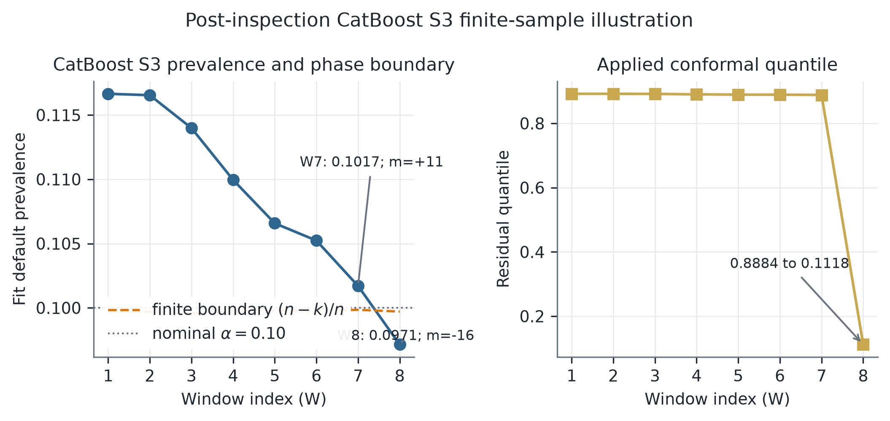

# Introduction {#sec-introduction}

Predictive models create value through decisions, yet a property established
for a predictor need not survive the rule that consumes it. A probability of
default can be calibrated in a population while an optimizer concentrates
capital in a systematically different subset. A conformal prediction set can
attain marginal or groupwise coverage before selection while missing outcomes
among the observations that receive positive exposure. Even if the predictive
object were stable, a comparison can still fail when two scores are assigned
the same numerical threshold: the score and its cap jointly define a feasible
decision problem.

The usual retrospective workflow creates additional hazards. A loan that has
reached an endpoint by an evaluation cutoff has a label, whereas a current or
later-resolved loan may not. Treating a later archive as if it were a verified
historical snapshot, or filtering to resolved outcomes before constructing the
candidate menu, uses information unavailable at the decision date. Pooling
several years of originations into one allocation similarly lets a decision
made today choose from tomorrow's loans. Finally, optimizing one payoff and
evaluating another can make an apparent improvement an accounting artifact.
These are estimand defects rather than presentation details.

CRPTO studies this handoff after making timing, observability, geometry, and
comparator contracts explicit. A temporally trained CatBoost model and Platt
calibrator produce point score $p_i$. Score strata are fixed from all 2011
predictions, without using residual-window or OOT outcomes. We then report the complete set of
eight consecutive six-month residual windows beginning in 2012 and ending no
later than January 2013. No result selects, weights, or removes a window. Four
coverage-only controls span a separately fitted numeric logistic model,
domain-constrained monotonic CatBoost, a platform-signal WOE/IV scorecard, and
a pricing-excluded application WOE/IV scorecard. Each has its own Platt map and
2011 taxonomy;
none is selected from OOT outcomes or enters portfolio optimization.
Coverage of observed binary $Y$, not latent individual PD, is the conformal estimand.
The same residual threshold defines a discrete binary prediction set $S_i$ and
a clipped continuous interval $[\ell_i,u_i]$, with
$S_i=[\ell_i,u_i]\cap\{0,1\}$. Their coverage events coincide for the observed
binary outcome, but the interval is not constructed as the convex hull of
$S_i$ and does not equal that hull in general: it is retained as a design
embedding whose upper endpoint enters a guardrail score. The prediction set is
not a confidence interval for latent individual PD, nor is the continuous
embedding; candidate coverage supplies no selected- or funded-set guarantee.
It also does not
identify ECL, SICR, expected loss, or a selected allocation policy; those
objects require their own estimands, data, and validation.

$$
q_i(\gamma)=(1-\gamma)p_i+\gamma u_i,
$$ {#eq-score}

in the portfolio risk constraint. Guardrail and point-score policies maximize the
same model-implied objective over identical monthly menus, budgets, loan
bounds, and purpose constraints. The complete diagnostic score path is
$\gamma\in\{0,0.25,0.50,0.75,1\}$. Its primary empirical contrast is the
full-upper-score endpoint minus the point-score endpoint. No development
outcome selects a score, and no OOT result promotes a gamma.

The comparator is part of the estimand. We therefore use two rulers constructed
without policy-development or OOT evaluation outcomes on the common attainable
frontier. We call a construction *evaluation-outcome-blind* when earlier model
and conformal fitting may use historical labels but policy construction reads
neither development nor OOT evaluation outcomes. The primary ruler imposes the same
model-implied objective floor for every score and hence matches plug-in
opportunity cost. The secondary ruler uses the same relative relaxation from
each score's minimum-risk allocation to the common plug-in optimum; it is
invariant to positive affine score transformations but does not match
opportunity cost. Both rulers are evaluated at coordinates
$\{0.25,0.50,0.75\}$. A supporting audit checks these finite tracks against
same-cap, development-matched, contemporaneous funded-moment, and registered
point-cap comparators. HiGHS simplex basis ranging
[@huangfu_parallelizing_2018] supplies additional solver-reported support
endpoints. The active lineage does not certify an exhaustive continuous basis
path.

The empirical message is an identification result rather than a winner. Under
the declared six-month availability rule, all 40 model-by-window all-candidate
OOT sharp coverage upper bounds are below 0.90. That uniform statement is a
finite-archive fact over every unresolved binary completion, not by itself a
rejection of the split-conformal theorem. In a separate retrospectively locked
combined-rank analysis, 31 of 40 learner-window joint-block reference tail
areas meet the locked nominal Bonferroni--Holm reporting thresholds. The null requires
the calibration residuals and the entire target block to be jointly
exchangeable, which is stronger than the usual calibration-plus-one-target
condition; pre-lock inspection also precludes a post-selection FWER claim. The primary
CatBoost pattern also recurs under three semantics-preserving missing-value
encodings, at two origins with equalized 39-month administrative age, and under four
declared fit-label scenarios. A complete label-Mondrian sensitivity substantially
raises resolved-panel default coverage but also expands ambiguous sets and does
not uniformly restore nominal finite-archive coverage. One score
stratum crosses the nominal miscoverage prevalence threshold between W7 and W8,
coinciding with an abrupt change in conformal geometry, but the crossing
disappears when every label unavailable at its fitting cutoff is completed as
default. The finite-archive shortfall is therefore more stable than that
particular geometric explanation. In the portfolio audit, no endpoint ordering
survives all rulers and coordinates.
Objective-matched .25 crosses zero for all three metrics in every window; .50
is adverse in all eight; and .75 leaves payoff and default unidentified in
seven. Normalized .25 and .50 are adverse, while normalized .75 leaves payoff
unidentified in one window and does not equalize plug-in opportunity cost.
Independently, every broad registered-cap payoff, default, and miscoverage
envelope crosses zero.

The paper makes three contributions.

1. It gives an executable decision-interface audit: freeze the population,
   information set, predictive object, and allocations; join outcomes only
   afterward; then report complete perturbation families without selecting a
   favorable result.
2. It derives binary prevalence-sensitive geometry and sharp common-outcome
   contrast bounds, including an exact width decomposition, and separates
   deterministic finite-archive identification from joint-block rank-reference
   diagnostics. The completion and label-Mondrian sensitivities distinguish a
   recurrent shortfall from a nonuniversal geometric explanation and from a
   classwise sensitivity that does not restore transport.
3. It defines two common-frontier rulers, proves a conditional within-basis
   endpoint lemma, and audits registered point-cap support, showing why score,
   ruler, coordinate, and comparator support jointly
   define the portfolio estimand. The negative conclusion is constructive:
   the active recipe has uniformly subnominal finite-archive upper endpoints,
   most frozen learner-window joint-block reference tail areas meet the locked
   nominal reporting thresholds, and no universal portfolio direction is identified.

This audit was retrospectively protocol-locked and hash-verified after the
archive had been inspected; it is not a prospective trial, preregistration, or
causal estimate. The purpose is
to identify which conclusions are properties of the predictive object and
which are artifacts of the decision comparison.

# Related Work {#sec-related}

Decision quality is not prediction quality: the same estimate may induce a
different ranking, feasible region, or action once costs and constraints enter
[@fernandezloria2022causaldecision; @yang2025costaware]. Decision-focused
learning trains against an optimization loss, whereas modular
predict-then-optimize methods keep the predictor fixed and expose the handoff
[@donti2017; @elmachtoub2022; @bertsimas2020prescriptive]. CRPTO takes the
modular route because its object is governance of an already frozen credit
score. Model, payoff, menus, budget, concentration limits, and solver are held
constant; score and cap cannot be separated because together they define the
feasible set. This audit-chain perspective also follows work connecting credit
modeling to reproducible empirical design and the AI--OR interface
[@das2023creditgraph; @wiberg2025ai_or].

Split conformal prediction gives marginal finite-sample coverage under
exchangeability [@vovk2005; @angelopoulos2023], while exact conditional
coverage is generally unavailable without restrictions [@barber2021limits].
Classwise calibration changes the category and still requires within-category
exchangeability [@ding2023]. Under nonexchangeability, guarantees need explicit
dependence or discrepancy controls; chronology alone is insufficient
[@barber2023beyond; @oliveira2024split]. Online adaptive calibration addresses
a different sequential-feedback design [@gibbs2024online]. These distinctions
motivate our separation of finite-archive bounds, a stronger joint-block
rank-reference null, and deterministic sensitivities. Joint prediction for an
entire label vector is a distinct simultaneous estimand [@gazin2025batch]: its
iid contract, and its class-conditional contract for the symmetric combining
rules used there, return a vector-valued set for a fixed batch, whereas our retrospective count reference returns no such set or
selected-set validity. Switch-coefficient bounds for stationary beta-mixing
series instead concern marginal coverage of one next point
[@barber2026timeseries]; the issue-month repeated cross-section defines neither
the required sequential unit nor a defensible stationarity or mixing
coefficient.

Selection is a separate inferential problem. JOMI targets coverage conditional
on permutation-invariant black-box selection, informative-selection methods
target false-coverage rate, and selecting among otherwise valid conformal
objects can itself invalidate them [@jin2025focal; @gazin2025informative;
@hegazy2025valid_selection_conformal_sets]. None of those targets follows from
candidate-level coverage, and CRPTO does not implement their reference-set or
randomization contracts. Its budget-coupled monthly allocation therefore has
no selected- or funded-set coverage claim.

Conformal sets have entered robust, portfolio, contextual, and risk-control
optimization
[@johnstone2021; @patel2024; @sun2024ptc]. More recent methods calibrate
decision loss, violations, regret, or the robustness choice itself
[@angelopoulos2024risk; @bao2025croms; @kiyani2025; @zhou2026creme;
@stratigakos2026decision_calibrated_sets]. Those methods require labeled
decision contexts under their own sampling conditions. Here one context is a
coupled monthly allocation, not each loan independently; the accepted-loan
archive also cannot identify counterfactual funding effects. CRPTO thus asks a
narrower empirical question: when a simple conformal upper score constrains a
conventional credit LP, which apparent effects come from interval geometry,
comparator choice, or unresolved outcomes?

Credit discrimination likewise does not determine portfolio value
[@lessmann2015; @serrano2016profitscoring]. Censoring-aware conformal methods
instead target lower bounds on a time-to-event under explicit censoring,
overlap, and nuisance-model contracts [@candes2023survival; @gui2024adaptive].
They do not identify this terminal binary endpoint, and
prepayment may be a competing event whose event-specific cumulative incidence
requires a different calibration design [@li2023online_loans]. Cash-flow timing also matters
[@djeundje2025dynamic_loan_portfolio_profitability], so our binary endpoint and
status-indexed payoff are deliberately not survival or return models. WOE/IV
scorecards and monotonic CatBoost are transparency and model-class controls,
not challenger winners [@navaspalencia2020]. Classical robust optimization and
P2P portfolio studies already establish that protection and portfolio design
have costs [@bertsimas2004; @guo2016p2p]. The contribution here is the audited
interface: complete residual-window reporting, binary-threshold geometry,
common-outcome identification, and comparator-support diagnostics. Online
Supplement Table S13 gives the detailed closest-work matrix and claim boundary.

# Data and Locked Evaluation Design {#sec-data}

## Decision unit, target, and estimand

<!-- claim:endpoint.not_verified_snapshot -->
<!-- claim:endpoint.reason_census_partitions_candidates -->

The decision unit is an issue month. For month $t$, the candidate set
$\mathcal I_t$ contains only loans observable in that month, and each policy
maps the same menu into dollar exposures with a fresh USD 1 million budget. This
is different from ranking the full archive once: no April 2016 decision can
fund a May 2016 loan, and no capital is carried across months. Equal monthly
budgets make the pooled exposure-weighted metric equivalent to the average of
the 15 monthly dollar-weighted metrics.

The endpoint is terminal default reconstructed as observable by September 30,
2020. A Fully Paid status is available at the month-end of `last_pymnt_d`; a
Charged Off status is available at that month-end plus six calendar months.
The latter is a conservative modeling assumption, not the known operational
charge-off date. The distributed archive is not a verified point-in-time snapshot: its
last-payment field extends through December 2020 and its last-credit-pull field
through October 2020. We therefore date endpoint availability from servicing
fields and keep later terminal statuses unresolved. The policy estimands are
historical guardrail-minus-point differences in a status-indexed standardized payoff proxy,
exposure-weighted terminal default, and exposure-weighted interval miscoverage
over the same menus. They are not treatment effects: the audit treats recorded
status as a fixed historical endpoint and does not identify how alternative
funding would change it; rejected-loan outcomes are unavailable and no
behavioral response to deployment is modeled.

There are therefore three distinct populations in the analysis: the candidate
rows to which predictive coverage refers, the listed loan amounts that define
available exposure, and the optimizer-selected funded dollars that define the
decision result. Treating those populations as interchangeable would erase the
mechanism the paper is designed to measure.

## Status-independent loan universe

<!-- claim:data.exhaustive_status_independent_population -->

The Lending Club 2007--2020Q3 archive contains 2,925,493 rows. The status-independent
design retains all 640,543 loans eligible under its 36-month horizon, dates,
schema, and observability rules; its evaluation panel has 376,890 primary and
88,227 extension candidates. Membership never depends on endpoint resolution.
Including 60-month contracts, late-schema fields, or heavily censored intervening
cohorts would change the estimand; training on their resolved subset would
condition on maturity. Appendix B reports the complete population and exclusion
census.

Status strings containing `Charged Off` are positive and strings containing
`Fully Paid` are negative only when their reconstructed availability is no
later than the cutoff. The reason taxonomy partitions all 376,890 candidates:
307,842 are Fully Paid by the cutoff, 56,972 are Charged Off by the cutoff,
11,551 remain nonterminal or unresolved, 47 have reconstructed terminal
availability after the cutoff, and 478 have terminal status but no
reconstructible availability date. Thus 11,551 + 47 + 478 = 12,076 outcomes
remain unrestricted. Exact `Default` and every other nonterminal status are
included in the 11,551-row category. This is a cutoff-specific
terminal classification endpoint, not a lifetime hazard or causal response.
Unresolved loans remain candidates and enter sharp bounds after allocations
are frozen.

Listed amount defines available exposure; requested and funded amounts differ
by only USD 18,000 over the primary panel. The chronology below uses shared PD,
Platt, development, and OOT blocks. It reports every eligible residual window,
never reads policy-development outcomes, bounds the 12,076 unresolved primary
endpoints, and retains July--September 2017 as an explicitly censored extension.

| Block | Issue months | Rows | Information role |
|---|---:|---:|---|
| PD development | 2007-06--2010-12 | 17,433 | train/validate |
| Platt/taxonomy | 2011 | 14,101 | calibration |
| Residual recipes | 2012-01--2013-01 | 49,007 | overlapping fits |
| Policy development | 2013-02--2013-12 | 94,885 | outcomes not read |
| Primary OOT | 2016-04--2017-06 | 376,890 | post-freeze evaluation |
| Extension | 2017-07--2017-09 | 88,227 | stress only |

: Active data blocks; residual windows overlap. {#tbl-protocol}

## Information boundary

Two ID-keyed panels enforce the boundary. The decision panel admits only dated
origination variables, scores, endpoints, and strata; the outcome panel is
joined one-to-one only after allocations are frozen. This separation makes the
timing claim testable but creates no statistical guarantee.

Label-dependent fitting is additionally restricted by an information cutoff
of March 31, 2016. A Fully Paid label becomes available at the month-end of its
last payment; a Charged Off label is conservatively dated six calendar months
after that month-end.
Retained fitting-label shares exceed 99% in every block and residual month;
unavailable labels are excluded from fitting, not candidacy. SHA-256-locked
freezes contain all scores, recipes, allocations, and comparator tracks before
the outcome join. Reversed-ID and independent-solver checks audit endpoint
allocations. The resulting 48 two-ruler cells are six tracks viewed through
eight overlapping recipes, not replications; Appendix F records all counts,
hashes, and replay contracts.

## Identification safeguards

The reusable audit has five stages. First, define status-independent monthly
menus and dated label availability. Second, fit scores, taxonomies, and every
residual recipe without evaluation outcomes. Third, declare comparator rulers,
solve the complete policy grid, and persist allocations. Fourth, join one keyed
outcome panel and compute sharp candidate and paired-policy bounds. Fifth,
report every declared window, model control, ruler, coordinate, support, and
sensitivity; a claim survives only its named perturbation family. This order
prevents outcome filtering, future-menu look-ahead, payoff mismatch, and
result-dependent comparator choice. It does not restore exchangeability,
identify lifetime cash flows, or turn a finite grid into universal support.
Online Supplement Appendices A and G give the full audit map and boundaries.

# Method {#sec-method}

## Platt-scaled default score and credit-risk controls

The primary model is a protocol-fixed CatBoost classifier
[@prokhorenkova2018catboost] on 29 numeric and nine categorical
origination-time features, followed by a separate 2011 logistic Platt map
[@platt2000]. It is not tuned against downstream or OOT outcomes. Four
coverage-only controls change model class or information: numeric logistic
regression, domain-constrained monotonic CatBoost, a platform-signal WOE/IV
scorecard, and a pricing-excluded application WOE/IV scorecard
[@navaspalencia2020]. Each receives its own Platt map and 2011 score taxonomy;
only primary CatBoost enters optimization. These are specification controls,
not a leaderboard.

The raw-data contract predeclares mappings for structurally missing delinquency
recency and sparsely recorded bankruptcy count. A frozen sensitivity compares
that sentinel convention with explicit indicators and native nullable values;
it selects no encoding or missingness mechanism. Appendix B gives features,
hyperparameters, mappings, fit diagnostics, and WOE/IV controls.

## Score-Mondrian binary prediction sets and continuous interval embedding

Let $Y_i\in\{0,1\}$ denote terminal default and $p_i$ the Platt-scaled score.
Write $\widehat p_i(1)=p_i$ and $\widehat p_i(0)=1-p_i$. For either candidate
label $y\in\{0,1\}$, the absolute-residual nonconformity score is exactly the
probability-complement classification nonconformity,

$$
s_i(y)=|y-p_i|=1-\widehat p_i(y).
$$ {#eq-binary-nonconformity}

Five groups are fixed from 2011 score quantiles, without residual-window labels;
extreme strata are open-ended so every later score is retained. The specification
reports all eight consecutive six-month windows beginning January--August 2012.
For $n_g$ observations and target $\alpha=0.10$, the split-conformal rank is

$$
k_g=\left\lceil(n_g+1)(1-\alpha)\right\rceil,
$$ {#eq-rank}

and $c_g$ is the $k_g$-th smallest residual in ascending order. If
$k_g=n_g+1$, the threshold is $+\infty$ rather than a clipped sample maximum.
The taxonomy, group assignment, and score map must remain frozen independently
of the calibration and target outcomes. A future score assigned to group $g(i)$
receives

$$
[\ell_i,u_i]=
\left[\max\{0,p_i-c_{g(i)}\},\min\{1,p_i+c_{g(i)}\}\right].
$$ {#eq-interval}

The same threshold defines the canonical binary classification set

$$
S_i=\left\{y\in\{0,1\}:|y-p_i|\le c_{g(i)}\right\}
   =[\ell_i,u_i]\cap\{0,1\}.
$$ {#eq-binary-set}

If the $n_g$ calibration scores and one future score are exchangeable within
the frozen stratum, the inclusive rule satisfies
$\Pr\{Y_{\mathrm{new}}\in S(X_{\mathrm{new}})\mid G_{\mathrm{new}}=g\}\ge
1-\alpha$, marginally over calibration and that future unit
[@vovk2005; @angelopoulos2023]. CRPTO does not assert that this temporal
exchangeability condition holds.

Thus coverage of $S_i$ and $[\ell_i,u_i]$ coincides for binary $Y_i$, but the
interval is a continuous design embedding, generally not the convex hull of
$S_i$, and $u_i$ is the downstream score input. Two loans can therefore have
the same binary set but different $u_i$; no coverage property gives $u_i$ a
probabilistic magnitude or orders it within that fixed set. Neither object is a confidence
interval for latent PD or a funded-set guarantee. No outcome-dependent
widening or taxonomy adaptation enters a recipe. The closed 1-, 2-, 5-, and
10-group grid is reported for CatBoost and numeric logistic; monotonic CatBoost
and the two WOE controls retain their own five-group recipes. All are coverage
diagnostics, not a selection grid.

The four possible binary sets are $\varnothing$, $\{0\}$, $\{1\}$, and
$\{0,1\}$. If their candidate shares are $e,z,o,b$, respectively, then
$e+z+o+b=1$ and the standard classification-set efficiency summaries are

$$
\operatorname{AvgC}=z+o+2b=1-e+b,
\qquad
\operatorname{OneC}=z+o=1-e-b.
$$ {#eq-set-efficiency}

AvgC is mean set cardinality and OneC is the singleton share. Reporting $e$
and $b$ separately prevents an average cardinality from hiding never-covered
empty sets or uninformative two-label sets; neither metric is a coverage
guarantee.

The baseline above is Mondrian only with respect to the outcome-free score
stratum; it uses one marginal residual threshold within each stratum. A separate
retrospective label-Mondrian sensitivity freezes, before the OOT outcome join,

$$
k_{g,y}=\left\lceil(n_{g,y}+1)(1-\alpha)\right\rceil,
\qquad q_{g,y}=R^{(k_{g,y})}_{g,y},
$$ {#eq-label-rank}

where the order is ascending and $q_{g,y}=+\infty$ when
$k_{g,y}=n_{g,y}+1$. It then constructs the classification set directly as

$$
S_i^{\mathrm{LM}}=
\{0:p_i\le q_{g(i),0}\}\cup
\{1:1-p_i\le q_{g(i),1}\}.
$$ {#eq-label-mondrian}

This set need not be symmetric around $p_i$. For category $(g,y)$, let $N_y$
and $C_y$ be resolved class and covered counts, and let
$U_y^{\mathrm{hit}},U_y^{\mathrm{miss}}$ count unresolved candidates whose set
would contain or omit $y$. Sharp class-specific bounds are

$$
L_y=\frac{C_y}{N_y+U_y^{\mathrm{miss}}},
\qquad
U_y=\frac{C_y+U_y^{\mathrm{hit}}}{N_y+U_y^{\mathrm{hit}}},
$$ {#eq-label-bounds}

when denominators are positive. Bounds on
$\operatorname{Cov}_0-\operatorname{Cov}_1$ instead share each unresolved
assignment across both ratios; subtracting separately optimized intervals is
not sharp. The 400 label-stratum rows are identification diagnostics, not tests.

<!-- claim:boundary.no_selected_set_validity -->

For binary $Y$, miscoverage has the useful identity

$$
m_i=\mathbf 1\{Y_i\notin S_i\}
   =\mathbf 1\{Y_i=0,\ell_i>0\}+
    \mathbf 1\{Y_i=1,u_i<1\}.
$$ {#eq-binary-miss}

Thus a default is counted as covered whenever $u_i=1$, even though such an
endpoint offers little discrimination to the optimizer. Conversely, a narrow
low-score interval with $u_i<1$ misses every realized default. This geometry is
central to interpreting the funded-set miscoverage diagnostic, but it does not
establish funded-set conformal validity.

## Coherent objective and status-indexed payoff proxy

For contractual annual rate $r_i$ and fixed loss given default
$\lambda=0.45$, define the per-dollar status-indexed standardized payoff proxy

$$
\pi_i(Y_i)=(1-Y_i)r_i-Y_i\lambda,
$$ {#eq-status-payoff}

with model-implied plug-in objective coefficient

$$
\bar\pi_i=(1-p_i)r_i-p_i\lambda.
$$ {#eq-expected-payoff}

This coefficient equals the conditional expectation of the proxy only if $p_i$ equals
the conditional default probability. We use it as a model-implied plug-in
objective and evaluate the corresponding status-indexed proxy, not as proof of
conditional calibration. The pair intentionally omits payment timing,
principal amortization, prepayment, fees, recoveries, and discounting. We
therefore do not call the endpoint profit, cash-flow return, NPV, welfare, or IRR.
In particular, the annual rate and the 36-month terminal label do not share a
cash-flow time scale; their relative coefficient is a declared decision-score
normalization, not accumulated contractual interest.

In month $t$, let $a_{it}$ be dollar exposure to loan $i$, bounded by its listed
amount $A_i$. For a policy $(\tau,\gamma)$, the LP is

$$
\begin{aligned}
\max_{a_{it}}\quad & \sum_{i\in\mathcal I_t}a_{it}\bar\pi_i \\
\text{s.t.}\quad
& \sum_i a_{it}=B, \\
& \sum_i a_{it}q_i(\gamma)\le \tau B, \\
& \sum_{i:\,purpose_i=k}a_{it}\le 0.25B \quad\forall k,\\
& 0\le a_{it}\le A_i,
\end{aligned}
$$ {#eq-lp}

where $B=\$1$ million in every month. The point-score baseline sets $\gamma=0$.
The objective is identical across policies, so differences arise from the risk
score and the loans made feasible by it. The LP permits fractional dollar
exposure. A separately frozen implementation diagnostic floors each positive
exposure to a USD 25 lot and holds the residual as cash; it does not reoptimize
or define an integer-policy estimand.

## Common-frontier rulers and supporting comparator audit

Let $\mathcal A_t$ contain the budget, loan-bound, and purpose constraints in
@eq-lp, let $v_i=\bar\pi_i$, and let $s_i(\gamma)=q_i(\gamma)$ for
$\gamma\in\{0,0.25,0.50,0.75,1\}$. For every month and score, define the
minimum funded score, the common unconstrained plug-in optimum, and the score
of that optimum as

$$
m_{\gamma t}=B^{-1}\min_{a\in\mathcal A_t}s(\gamma)^\top a,
\quad z_t^*=\max_{a\in\mathcal A_t}v^\top a,
\quad o_{\gamma t}=B^{-1}s(\gamma)^\top a_t^*.
$$ {#eq-ruler-anchors}

The primary **objective-matched ruler** compares scores at a common plug-in
opportunity cost. Let $z^{\min}_{\gamma t}$ be the objective attained by a
minimum-score portfolio and set $z_t^L=\max_\gamma z^{\min}_{\gamma t}$. At
$\rho\in\{0.25,0.50,0.75\}$, every score solves

$$
\min_{a\in\mathcal A_t}s(\gamma)^\top a
\quad\text{s.t.}\quad
v^\top a\ge z_t^L+\rho(z_t^*-z_t^L).
$$ {#eq-objective-ruler}

The shared floor is a model-implied objective, not true expected return. The
secondary **normalized-score ruler** instead sets

$$
c_{\gamma t}(\eta)=m_{\gamma t}
  +\eta(o_{\gamma t}-m_{\gamma t}),\qquad
\eta\in\{0.25,0.50,0.75\},
$$ {#eq-normalized-ruler}

and maximizes $v^\top a$ subject to
$s(\gamma)^\top a\le Bc_{\gamma t}(\eta)$. Equal $\eta$ is invariant to a
positive affine rescaling of a score, but it is not equal default risk,
objective sacrifice, or operational tolerance. At coordinate one both rulers
reach the verified common plug-in objective value, so only that objective-value
contrast is structurally null unless the common optimizer is unique or reused
by definition. The empirical diagnostic is therefore the complete declared
three-coordinate interior grid, not a continuous-frontier claim.

For each ruler and coordinate, the frozen contrast is
$\gamma=1$ minus $\gamma=0$. Interior gamma values verify the path but cannot
be selected as winners. Every allocation is outcome-free; unresolved outcomes
enter only through the common-outcome bounds after the freeze.

A supporting audit compares the grid with same-cap C0, development-supported
C1, funded-point-moment C2, and 3,067 HiGHS basis-ranging point caps over the
development and [0.05,0.12] supports. C2 is a decomposition, not a deployable
policy; the nine historical index pairs are neither a closed family nor
promotion candidates. Appendix C defines every comparator. No evaluation
outcome chooses a track, although this within-lineage isolation does not imply
that the global analysis family preceded archive inspection.

# Audit Theory and Estimands {#sec-theory}

The theory separates four objects that are often conflated: score units,
comparator stringency, binary interval geometry, and unresolved-outcome
identification. None of the statements assumes funded-set conformal validity or
makes one ruler uniquely correct. Appendix D contains the proofs.

## Comparator non-invariance

Let $\mathcal F_s(\tau)$ denote the allocations satisfying @eq-lp when the
risk score is $s$. All nonrisk constraints and the objective are held fixed.

**Proposition 1 (what comparator matching preserves).** Suppose the budget
binds, $\sum_i a_i=B$.

1. If $s_i=\kappa p_i+b$ with $\kappa>0$, then

$$
\sum_i a_i s_i\le \tau_s B
\quad\Longleftrightarrow\quad
\sum_i a_i p_i\le \frac{\tau_s-b}{\kappa}B.
$$ {#eq-affine-cap}

2. If $u_i\ge p_i$ and the same numerical cap is copied to
   $q_i(\gamma)$, then

$$
\mathcal F_q(\tau)\subseteq\mathcal F_p(\tau).
$$ {#eq-feasible-nesting}

3. For $\widetilde s=\kappa s+b$, the normalized ruler transforms as
   $c_{\widetilde s}(\eta)=\kappa c_s(\eta)+b$, so

$$
\widetilde s^\top a\le Bc_{\widetilde s}(\eta)
\quad\Longleftrightarrow\quad
s^\top a\le Bc_s(\eta).
$$ {#eq-normalized-invariance}

4. If C2 sets $c=(p^\top a^q)/B$ for a guardrail allocation $a^q$, that
   allocation is feasible for the point-score LP and

$$
V_p(c)\ge \bar\pi^\top a^q.
$$ {#eq-c2-dominance}

Parts 1 and 3 are exact invariances. Parts 2 and 4 mechanically order feasible
plug-in objectives, not realized payoff, default, or miscoverage.

## Binary interval geometry

<!-- claim:geometry.prevalence_sensitive_mechanism -->

**Proposition 2 (binary threshold geometry).** Fix $0\le p<1/2$ and let
$Y\sim\mathrm{Bernoulli}(\pi)$. Under the lower population
$(1-\alpha)$-quantile convention,

$$
c_{1-\alpha}=
\begin{cases}
p, & \pi\le\alpha,\\
1-p, & \pi>\alpha.
\end{cases}
$$ {#eq-binary-phase}

Thus the clipped interval changes from $[0,2p]$ to $[0,1]$ as prevalence moves
above $\alpha$; coverage jumps from $1-\pi$ to one and the upper decision score
from $2p$ to one. For any varying-score interval, @eq-binary-miss gives the
exact two-case miscoverage decomposition: $u=1$ covers every default, whereas
every default with $u<1$ is missed. Endpoint saturation can therefore improve
coverage while removing ranking information. The constant-score result is a
mechanism, not a proof for an empirical stratum with varying $p_i$.

## Joint-block combined-rank reference diagnostic

<!-- claim:coverage.joint_block_rank_reference_nominal_flags -->

The finite-archive bounds below answer what coverage is attainable under
unrestricted completion; they do not test exchangeability. We therefore define
a separate rank-reference diagnostic. In frozen stratum $g$, let $n_g$ be the
calibration size, $r_g=\lceil(n_g+1)(1-\alpha)\rceil$, and $m_g$ the target
size. Conditional on the frozen taxonomy and the realized stratum memberships
and counts $(n_g,m_g)$, a strict miss is a target residual $R>c_g$. Under joint continuous
exchangeability of the $n_g+m_g$ calibration and target residual scores as one
block, the number of strict target misses has the exact combined-rank law

$$
M_g\sim\operatorname{BetaBinomial}
\left(m_g,n_g+1-r_g,r_g\right),
\qquad
E(M_g/m_g)=\frac{n_g+1-r_g}{n_g+1}.
$$ {#eq-rank-reference}

Uniform combined ranks give this law without score independence. Its expected
miss rate is the displayed finite-sample fraction, not necessarily 0.10. The
null is stronger than calibration-plus-one-future-point exchangeability, so a
flag may reflect target-block dependence or heterogeneity without refuting the
usual marginal guarantee.

Lexicographic iid auxiliaries make combined ranks continuous while leaving the
reported sets deterministic. Because the strict-miss count cannot exceed its
augmented counterpart, the Beta--Binomial upper tail is conservative. The
observed absence of threshold ties does not prove continuity.

Minimizing attainable strict misses gives the supremum upper-tail p-value over
all unrestricted binary completions. The locked calculation uses Bonferroni
across five strata and Holm across 40 learner-window intersections. Because an
exploratory implementation and pattern were inspected before V1 lock, these are
nominal reporting thresholds, not post-selection FWER control. They do not
cover the 200 strata or any sensitivity. A flag identifies neither theorem
failure nor mechanism; a nonflag establishes neither exchangeability nor
transportability.

## Sharp bounds for unresolved outcomes

<!-- claim:theory.sharp_common_outcome_bounds -->

For an unresolved loan, $Y_i$ may be either 0 or 1. Default therefore lies in
$[0,1]$, payoff in $[-\lambda,r_i]$, and miscoverage in the two attainable
values implied by @eq-binary-miss.

**Proposition 3 (sharp common-outcome bounds and width).** Let $U$ index
unrestricted outcomes and write an additive fixed-allocation metric as
$T(Y)=C+\sum_{i\in U}g_i(Y_i)$. Then

$$
T_L=C+\sum_{i\in U}\min_{y\in\{0,1\}}g_i(y),\qquad
T_U=C+\sum_{i\in U}\max_{y\in\{0,1\}}g_i(y)
$$ {#eq-sharp-bounds}

are sharp because each endpoint is attained by a joint assignment of all
unresolved outcomes. This is partial identification under unrestricted binary
completion, not a sampling confidence interval.

For candidate coverage, resolved $R$ retain observed miscoverage and only
unresolved $U$ are completed. The sharp interval is

$$
\left[
1-\frac{1}{n}\left\{\sum_{i\in R}m_i(Y_i)+
\sum_{i\in U}\max_{y\in\{0,1\}}m_i(y)\right\},
1-\frac{1}{n}\left\{\sum_{i\in R}m_i(Y_i)+
\sum_{i\in U}\min_{y\in\{0,1\}}m_i(y)\right\}
\right].
$$ {#eq-sharp-coverage}

For paired policies, marginal-interval subtraction is not sharp. On the union
of funded IDs, retain signed exposure differences and assign each unresolved
$Y_i$ once to both policies. For contribution $d_i(Y_i)$,

<!-- claim:theory.binary_identification_width -->

$$
T_U-T_L=\sum_{i\in U}\left|d_i(1)-d_i(0)\right|.
$$ {#eq-identification-width}

For normalized exposure difference
$\delta_i^w=a_i^A/N_A-a_i^B/N_B$, payoff-, default-, and miscoverage-rate
widths are respectively $\sum_U|\delta_i^w|(r_i+\lambda)$,
$\sum_U|\delta_i^w|$, and
$\sum_U|\delta_i^w||m_i(1)-m_i(0)|$. Here $N_A=N_B=B$, including the
floor-with-cash diagnostic. Identification loss therefore depends on exposure
disagreement and set geometry, not merely the unresolved count.

## Declared comparator sensitivity envelope

<!-- claim:theory.basis_endpoint_sufficiency -->

Let comparator $j$ produce a sharp contrast interval $[L_j,U_j]$ for a fixed
guardrail and metric. For a declared finite set $\mathcal J$, define

$$
\mathcal I_{\mathcal J}=
\left[\min_{j\in\mathcal J}L_j,\max_{j\in\mathcal J}U_j\right].
$$ {#eq-multiverse}

The declared comparator sensitivity envelope $\mathcal I_{\mathcal J}$
summarizes endpoints over a named finite comparator set. A sign survives only
when the envelope lies strictly on one side of zero; this is deterministic
design sensitivity, not universal quantification over baselines.

**Proposition 4 (within-basis endpoint sufficiency).** Within one fixed optimal LP basis,
the point allocation is affine in cap $c$. Against a fixed guardrail,
observed-outcome contrast contributions are therefore affine. For an unresolved
binary outcome, the sharp lower contribution is the minimum of two affine
functions and the sharp upper contribution is their maximum. The lower bound
is concave and the upper bound convex on that basis range, so their adverse
extrema occur at its endpoints. Consequently, an algorithm that certifies an
exhaustive partition of a cap interval into all relevant optimal-basis ranges
can recover the sharp interval-wide envelope from their endpoints, up to solver
tolerance. The present empirical lineage evaluates registered support and
solver-reported basis-ranging endpoints; the proposition does not make that
finite trace an exhaustive continuous-path certificate.

Together these statements separate exact algebra, finite-archive partial
identification, and empirical sensitivity. Online Supplement Appendix D gives
the proof map and Appendix G states the corresponding claim boundaries.

# Results {#sec-results}

## Finite-archive coverage is below nominal and most joint-block cells are flagged

<!-- claim:coverage.five_models_all_windows_below_nominal -->
<!-- claim:coverage.joint_block_rank_reference_nominal_flags -->

All 40 learner-window sharp coverage upper endpoints are below 0.90. CatBoost
bounds range from [0.8425,0.8696] to [0.8570,0.8826]; the largest upper endpoint
across models is 0.8977. Each upper endpoint already assigns every unresolved
loan its coverage-maximizing label and preserves empty sets as uncovered.

These 40 statements are uniform finite-archive identification results, not
sampling confidence intervals and not, by themselves, a rejection of conformal
validity. Figure 1 therefore displays them separately from the joint-block
rank-reference flags.

![Panel A reports all 40 resolved coverages (open dots) and sharp all-candidate completion bounds (segments) on a focused scale; the segment and dot use their stated all-candidate and resolved denominators and are not estimate-plus-error bars. Panel B reports whether each stronger joint-block reference tail area meets the locked nominal Bonferroni-within-cell and Holm-across-cell reporting thresholds. Because the family and pattern were inspected before locking, these flags do not claim post-selection FWER control. The dashed line is nominal 0.90.](../reports/crpto/figures/crpto_ijds_v4_fig1_coverage.png){#fig-coverage width=95%}

Supplement Tables S6--S6A report every bound and set-geometry component.

<!-- claim:coverage.resolved_label_diagnostic_descriptive -->

Across all 40 cells, coverage among administratively resolved nondefaults is
0.982982--0.992714 versus 0.232570--0.363916 among resolved defaults. This
conditions on resolution and observed label; 12,076 classes are unknown, so it
is not all-candidate label-conditional validity, label-Mondrian calibration,
equalized coverage, or a fairness test.

| Score | OOT AUC | Brier | Slope | $U_{\max}$ |
|---|---:|---:|---:|---:|
| CatBoost | 0.6406 | 0.1299 | 0.7954 | 0.8826 |
| Logistic | 0.6420 | 0.1288 | 0.5432 | 0.8962 |
| Monotone CB | 0.6520 | 0.1286 | 0.8351 | 0.8865 |
| Platform WOE | 0.6331 | 0.1295 | 0.9187 | 0.8949 |
| Pricing-excluded WOE | 0.6129 | 0.1302 | 0.7098 | 0.8977 |

: Five-model coverage audit; predictive metrics use 364,814 resolved outcomes and coverage retains all 376,890 candidates. {#tbl-credit-controls}

Among administratively resolved candidates, all five mean calibration errors
are negative and all calibration slopes are below one. Because this panel is
selected by administrative resolution, its AUC, Brier, calibration, WOE/IV, and
PSI summaries are descriptive controls rather than unbiased estimates for all
376,890 candidates, a model contest, or an identified explanation of the
coverage gap.

The combined-rank analysis has 31/40 cell-level reference tail areas meeting the
locked nominal reporting thresholds: 8 CatBoost, 4 logistic, 8 monotonic CatBoost, 6 platform
WOE, and 5 pricing-excluded WOE cells. Tables S6B--S6C give all cells and
strata. This stronger calibration-plus-target-block null is post-inspection;
the flags have no post-selection FWER or theorem-failure interpretation, and
nonflags do not establish exchangeability.

<!-- claim:sensitivity.label_mondrian_complete_mixed -->
<!-- claim:sensitivity.label_mondrian_common_completion_gap -->

Label-Mondrian calibration [@ding2023] raises observed default coverage in the
administratively resolved panel. Separately, its all-candidate marginal bounds
leave 27/40 upper endpoints below 0.90, 12 crossing, and one lower endpoint at
or above nominal. AvgC rises to 1.724--1.785 and two-label sets to
72.37%--78.55%.
All 40 aggregate class-gap bounds cross zero, while 88/200 stratum gaps exclude
zero. It therefore neither uniformly repairs coverage nor establishes
within-label exchangeability; Tables S6D--S6F give all 40/200/400 rows.

<!-- claim:sensitivity.missingness_encoding_recurrence -->
<!-- claim:sensitivity.second_origin_coverage_recurrence -->
<!-- claim:sensitivity.fit_label_completion_coverage_recurrence -->

All eight upper endpoints remain below 0.90 for sentinel, indicator, and
native-null encodings (maxima 0.8826, 0.8843, 0.8800) and at individual
39-calendar-month cutoffs for the 2016 and 2017 origins (maxima 0.8791 and
0.8753). Tables S7C--S7D report the complete censuses. These shared-chronology
sensitivities are neither independent replications nor exact day-age matches.

Observed-only, all-nondefault, all-default, and later-terminal completion of 215
cutoff-unavailable fit labels leave all 32 upper bounds below 0.90 (maxima
0.8826--0.8847). This is deterministic sensitivity, not rank-reference or
funded-set inference.

## A prevalence crossing coincides with a change in binary interval geometry

<!-- claim:timing.fit_label_crossing_retained -->
<!-- claim:geometry.fit_label_completion_crossing_not_universal -->

The large W8 width change is concentrated in CatBoost stratum 2. Fit prevalence
declines from 0.1167 in W1 to 0.1017 in W7, then to 0.0971 in W8. That final
change crosses $\alpha=0.10$. The fitted residual quantile remains near 0.89
through W7 but falls from 0.8884 to 0.1118 in W8; mean OOT width in the stratum
falls from 0.9843 to 0.2076. Its discrete intersection simultaneously moves
from 0.96% $\{0,1\}$ and 99.04% $\{0\}$ in W7 to 0% $\{0,1\}$, 99.74%
$\{0\}$, and 0.26% empty in W8.

{#fig-phase width=82%}

The pattern matches Proposition 2's mechanism, but varying scores preclude a
finite-sample proof. Fit-label lags 0, 3, and 6 months retain more than 99% in
every month and preserve the crossing; 8 and 12 months retain only 98.68% and
97.45% in their weakest month and fail the rule. This is stability within the
retained lag family, not a causal claim. The narrower W8 interval also leaves
stratum-2 coverage at only [0.8225, 0.8547].

Observed-only, all-nondefault, and later-terminal completion retain the W7--W8
crossing. All-default completion instead gives prevalences 0.105974/0.100287
and quantiles near 0.889, removing the crossing while all eight overall upper
bounds remain below 0.90. Nonlinear refits make these four scenarios declared
stresses, not sharp bounds over $2^{215}$ assignments; the mechanism is not
completion-invariant.

Fit-label timing refits recipes; evaluation-endpoint availability instead holds
scores, supports, and allocations fixed. The axes were not crossed, so they do
not establish joint lag robustness.

## Endpoint direction changes with ruler and coordinate

<!-- claim:timing.endpoint_six_month_reconciles_active -->
<!-- claim:timing.fit_and_endpoint_lags_not_factorial -->
<!-- claim:decision.no_selected_policy -->

The two-ruler freeze contains 6,240 portfolios, and the evaluator reports all
720 monthly and 48 complete-window endpoint contrasts. @tbl-two-ruler reports
$\gamma=1$ minus $\gamma=0$; *adverse* means lower payoff and higher
default/miscoverage, while *crossing* means the sharp interval contains zero.
Each row is one
ruler-coordinate track over the same fifteen OOT menus. The eight windows are
overlapping residual specifications, so the table is a six-track census, not
independent replications or votes.

| Ruler | .25 | .50 | .75 |
|---|---|---|---|
| Objective matched | All three cross in 8/8; 4 active months | Adverse in 8/8 | Payoff/default cross in 7/8; miscoverage adverse in 8/8 |
| Normalized score | Adverse in 8/8 | Adverse in 8/8 | Payoff adverse in 7/8 and crossing in 1/8; default/miscoverage adverse in 8/8 |

: Six protocol-locked endpoint tracks. Full sharp hulls are in Online Supplement Table S9. {#tbl-two-ruler}

Under objective matching, coordinate .25 changes only four months. The
allocation contrast is identical across windows to cents: 44 loan-month
positions change and one-way turnover is USD 155,937.27 across USD 15 million.
Under the reconstructed endpoint, however, its status-indexed payoff-proxy bound is
[-USD 9,134.34, USD 5,603.66], and its default and miscoverage bounds are both
[-0.0068, 0.1265] percentage points. The repeated allocation is therefore one
unidentified contrast, not eight independent confirmations. Proposition 3
reconciles these hulls: in every window the unresolved exposure disagreement
contributes exactly USD 14,738 of payoff-proxy width and 0.1333 percentage
points of default and miscoverage width. At .50, every
sharp window bound gives lower payoff and higher default and miscoverage. At
.75, payoff and default cross zero in seven windows; only W8 is adverse for
both, while miscoverage is higher in all eight.

The 12,076 unresolved outcomes have three distinct recorded reasons: 11,551
nonterminal or otherwise unresolved statuses, 47 terminal outcomes whose
reconstructed availability follows the cutoff, and 478 terminal statuses with
no reconstructible availability date. Treating the latter 525 as one timing
category would overstate what the archive identifies. They remain unrestricted
in the same common-outcome bounds; no missingness mechanism is assumed.

The normalized ruler gives lower payoff and higher default and miscoverage in
all .25 and .50 cells. At .75, default and miscoverage remain higher in all
eight windows, while payoff is lower in seven and crosses zero in one. It also
gives $\gamma=1$ between USD 28,263 and USD 557,294 more optimized plug-in
objective than $\gamma=0$ across the declared coordinates. The ruler therefore
compares the same relative score relaxation, not the same opportunity cost.
Its status-indexed sign cannot be interpreted as a causal effect or combined with
the objective-matched tracks as evidence for a preferred endpoint. Across all
48 cells, payoff is lower in 32 and crosses zero in 16; default is higher in 33
and crosses in 15; miscoverage is higher in 40 and crosses in 8.

The complete retrospective endpoint-availability grid changes the Charged Off
administrative lag to 0, 3, 6, 8, and 12 months without refitting any score,
recipe, support, ruler, or allocation. Coverage upper bounds remain below 0.90
in 40/40 cells at lags 0, 3, 6, and 8, but in 39/40 at 12 months, where the
maximum is 0.900411. No opposite one-sided portfolio direction appears, and all
216 broad-support envelopes include zero at every lag. The six-month slice
reconciles to the active evaluation in all 120 coverage cells, 48 two-ruler
contrasts, and 648 registered-support envelopes. Full counts are in Online
Supplement Appendix E. These results make the 40/40 statement
endpoint-contract-specific and do not select the six-month endpoint.

## Structural assumptions do not restore a universal direction

<!-- claim:sensitivity.structure_no_universal_direction -->
<!-- claim:optimization.allocation_granularity_is_diagnostic -->

A separate outcome-free freeze crosses monthly budgets of USD 0.5, 1, and 2
million, maximum purpose shares of 0.20, 0.25, 0.30, and 1.00, and LGD values
of 0.25, 0.45, and 0.65. The evaluation reports the complete 36-scenario
Cartesian product without selecting a scenario. Each scenario retains both
rulers, all three coordinates, and all eight residual windows, giving 48
guardrail-minus-point cells per metric and 1,728 cells over the structural
grid.

The LGD grid also audits the proxy's relative rate scale. Multiplying every
$r_i$ by a common $k>0$ is decision- and sign-equivalent, after positive
rescaling of the objective and endpoint, to replacing the baseline
$\lambda=0.45$ by $0.45/k$. Thus LGD values 0.25, 0.45, and 0.65 correspond to
common relative rate multipliers 1.80, 1.00, and 0.6923. This algebraic
equivalence stress-tests the normalization; it does not turn the proxy into a
cash-flow return.

Every scenario contains at least 17 cells with higher default and at least 21
with higher miscoverage. No scenario makes all three metrics favorable in all
48 cells, but no scenario makes all three metrics adverse in all 48 cells
either. At least one favorable cell appears in 26 scenarios for payoff and 20
each for default and miscoverage. The baseline scenario reconciles exactly to
the active two-ruler result. Thus budget, concentration, and LGD change the
mix of adverse, favorable, and unidentified cells, but do not supply a
scenario-independent ordering. Online Supplement Tables S9D--S9E report the
complete census and binding diagnostics.

The active portfolios are continuous LP allocations. A deterministic USD 25
floor-with-cash diagnostic covers all 1,440 baseline portfolios and 143,175
positive source rows; 2,985 exposures change and monthly residual cash is USD
25--75. Across the 96 ruler-coordinate-window endpoint tracks, the largest
absolute perturbations are 0.000345 percentage points in payoff rate, 0.001284
in default rate, and 0.001190 in miscoverage rate. The declared floor-with-cash
transformation therefore negligibly perturbs the evaluated rates; it does not
establish adequacy or optimality of the continuous relaxation, perform integer
reoptimization, or cover other lot rules.

## Registered point-cap support extends the finite diagnostic

<!-- claim:comparator.broad_support_all_cross_zero -->

The supporting C2 exercise reconciles Proposition 1, part 4, in all 1,080 cells: its maximum
funded-score residual is $8.33\times10^{-17}$ and point-minus-guardrail plug-in
objective never falls below numerical tolerance. Named C0/C1/C2 status-indexed
directions nevertheless disagree; their full census is reported in the Online
Supplement rather than treated as another policy contest.

The registered point-cap audit evaluates 3,067 distinct caps. Over [0.05, 0.12]
broad stress, all 216 policy-by-window-by-metric envelopes cross zero. The
development-admissible support is narrower: default still crosses zero in all
72 cells; payoff is lower in 6 and crosses in 66; miscoverage is higher in 27
and crosses in 45. All 27 W8 envelopes cross zero.

The evaluated-cap numerical audit covers 7,297 point-cap rows. Although 2,941
bases are primal-degenerate, none has a near-zero nonbasic reduced cost, and
reversing candidate order changes no allocation beyond $1.45\times10^{-14}$.
This supports deterministic stability at the evaluated caps; it is not a claim
of uniqueness over an unenumerated continuous joint frontier.

The registered-cap audit is not a seventh track. It checks the finite
two-ruler grid against a broader finite support of point-cap endpoints; it does
not establish a continuous point-cap envelope. Together the analyses
show that status-indexed direction depends on residual recipe, comparator support,
ruler, frontier coordinate, and declared portfolio structure; none identifies
a derived endpoint with universally higher status-indexed payoff proxy or lower
default or miscoverage.

# Discussion {#sec-discussion}

## What the audit establishes

The guardrail changes a score, feasible region, and allocation; copying a
numeric threshold cannot separate them. Objective matching fixes model-implied
opportunity cost, whereas normalization fixes a scale-invariant relative score
relaxation. Neither is neutral. The objective-matched result changes from
unidentified at .25 to adverse at .50 and mostly unidentified at .75; the
mostly adverse normalized result compares different plug-in objective levels.
Selecting a ruler or coordinate by its sign would recreate the identification
problem.

C0 proves mechanical same-threshold nesting; C2 removes one funded point-score
moment; and the registered-cap audit shows that neither is a unique
counterfactual. None of the 216 broad-stress envelopes has a fixed sign. Some
payoff and miscoverage signs survive the narrower development support, but
default never does and all three metrics become unidentified in W8. This exact
support result is the safeguard against overinterpreting a finite grid, not a
reason to privilege the broadest support after outcomes.

The complete structural grid adds a different safeguard. It shows that the
absence of a universally favorable direction is not an artifact of one budget,
purpose cap, or LGD, while favorable cells under many scenarios prevent the
opposite claim of universal harm. Structural sensitivity therefore sharpens
the identification boundary; it does not identify a preferred scenario.

The conformal audit likewise has three noninterchangeable layers. The 40 sharp
coverage intervals identify attainable coverage in this finite archive. The
combined-rank diagnostic adds a joint-block sampling reference and places
31/40 cells past locked nominal thresholds without post-selection FWER control.
Label-Mondrian, individual-age follow-up, missingness, endpoint,
and fit-label analyses are deterministic design sensitivities with different
grids; they inherit neither the joint-block reference p-values nor its locked
nominal threshold hierarchy. The label-Mondrian result is constructive precisely because it shows
both sides of the tradeoff: far higher resolved-panel default coverage and far more ambiguous
sets, without uniform restoration of nominal coverage.

The upper score is pointwise larger and, at a shared cap, mechanically more
restrictive; neither fact supplies OOT coverage or funded-set validity.
*Robust* must name a protected quantity and perturbation
[@bertsimas2004; @bertsimas2018datadriven]. Here it
describes only the complete finite-archive perturbation and identification
audits, not a theorem failure, causal benefit, selected-set validity, or policy
dominance. CRPTO therefore uses *risk-aware* in its expanded name.

## Implications for decision-focused data science

Three implications may transfer beyond credit, without establishing external
validity. First, define the decision estimand: name the matched quantity and
binding constraints, and distinguish finite support audits from any separately
certified continuous LP path.
Second, preserve the decision information set. Status-independent menus, dated
labels, complete eligible windows, and unresolved-outcome bounds prevent later
status from redefining an earlier choice. Third, separate predictive, geometric,
and decision claims: marginal coverage is not funded-set validity, narrower
binary intervals need not improve decisions, controls are not a leaderboard,
and optimized and evaluated payoffs must agree.

## Ethical and governance implications

Calling one credit score *safer* can redirect capital because of a copied cap
rather than better predictive validity. Policy claims should disclose the
comparator, calibration window, binding constraints, and unresolved-outcome
treatment. The accepted-loan archive has neither rejected-applicant
counterfactuals nor a disparate-impact design; CRPTO audits model-risk claims
and does not authorize deployment or fair-lending conclusions.

# Limitations {#sec-limitations}

One discontinued accepted-loan archive cannot establish live, external, or
fair-lending performance. It is not a verified point-in-time snapshot, and its
terminal labels and status-indexed payoff proxy omit cash-flow timing,
prepayment, recoveries, fees, discounting, and capital costs. Sixty-month loans,
immature cohorts, and 48 late-schema fields are excluded; disclosed mappings
cover delinquency recency and legacy bankruptcy count. The encoding audit does
not identify a missingness mechanism. A survival or competing-risk redesign
would be a new estimand requiring exact event and censoring times, overlap,
conditional-censoring and temporal contracts; it would not retrospectively
complete the 12,076 unresolved binary endpoints.

The portfolio audit is specific to the absolute-residual continuous embedding:
it is not set-native, and no coverage result orders $u_i$ among loans with the
same binary prediction set. The learners, overlapping windows, and second origin share one chronology, so
they are neither independent nor prospective replications. Temporal separation
does not restore exchangeability, candidate coverage does not imply funded-set
coverage, and the constant-score theorem identifies a mechanism rather than the
varying-score empirical path. The four fit-label scenarios are not exhaustive
nonlinear bounds. The 31/40 joint-block result is post-inspection and has no
post-selection FWER guarantee; its nominal cutoffs and reference p-values do
not cover the other sensitivities, and its nine nonflags do not validate
transport. It also does not directly test the usual one-future-point guarantee.
The two-origin recurrence, PSI summaries, and rank flags estimate neither a
switch coefficient nor beta-mixing coefficients and cannot parameterize a
time-series coverage correction.
Label-Mondrian
requires exchangeability within each score-stratum-by-label category, which is
not established, and its 400 categories are identification rows rather than
adjusted tests. The individual-age comparison aligns 39 whole calendar months
from issue-month end; it cannot recover an exact origination day. Likewise, the finite ruler
grid, one-moment C2, and point-cap
support are not a continuous joint frontier; the structural grid is stylized,
and USD 25 flooring is not integer optimization. The inspected archive is
neither a pristine lockbox nor a preregistration.

# Reproducibility {#sec-reproducibility}

One registry binds every active lineage and 47 DVC pointers. Publication replay
verifies frozen artifacts and regenerates 27 tables and three figures
transactionally; scientific replay uses each lineage's protocol commit and
`uv.lock`, not the current source tree. Online Supplement Appendix F specifies
both modes.

# Conclusion {#sec-conclusion}

CRPTO shows why connecting machine learning, conformal prediction, and
optimization creates an identification problem rather than a self-validating
pipeline. Subnominal finite-archive coverage recurs across five declared
learner specifications and four CatBoost fit-label scenarios, but the more
precise conclusion has two layers: all 40 finite-archive sharp upper endpoints
are below nominal, and 31/40 frozen learner-window joint-block reference tail
areas meet the locked nominal reporting thresholds. Label-Mondrian redistributes class
coverage but does not uniformly restore nominal coverage; the observed
geometric crossing is not scenario-invariant. Portfolio direction changes with
the outcome-blind ruler and coordinate, and all 216 broad registered-support
envelopes include zero.

CRPTO therefore selects no model or policy. Its executable audit keeps
unresolved outcomes, coverage, binary geometry, sharp bounds, and comparator
support distinct: portfolio direction is meaningful only after its estimand
and comparator are specified.
