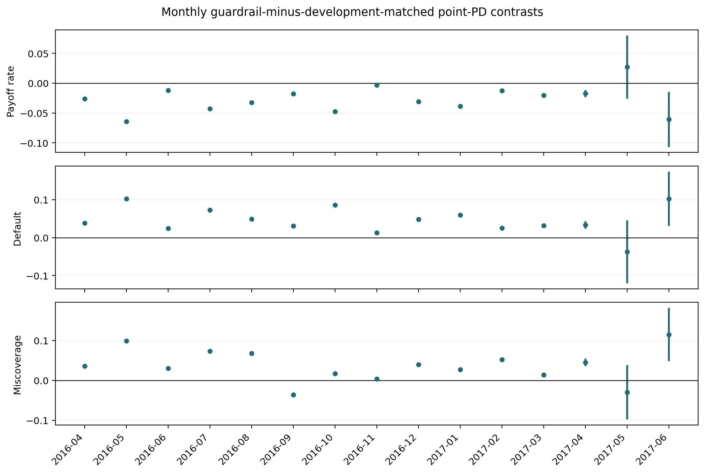
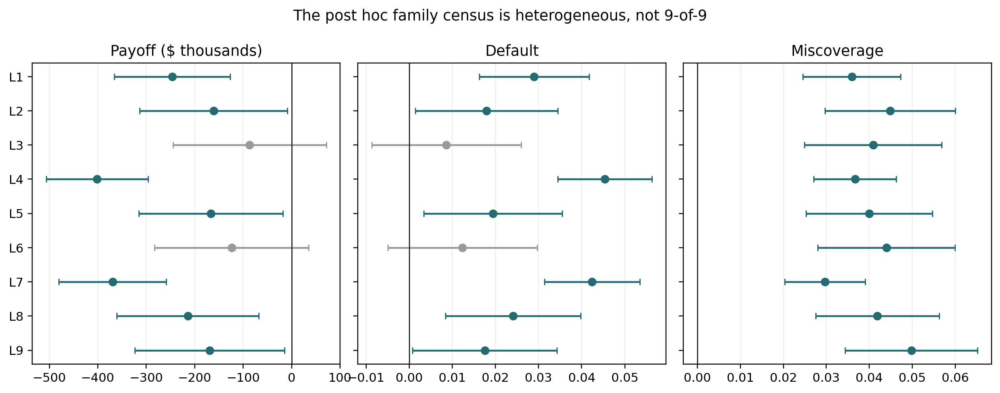

# Scope and Evidence Contract

This supplement supports one CRPTO paper and two nested evidence layers. The
maturity-safe parent fixes the data universe, model, 90%-target binary-outcome
Mondrian interval using the exact finite-sample rank, score
$q=(1-\gamma)p+\gamma u$, selected
$\gamma=0.25$, risk tolerance $\tau_q=0.17$, payoff, and April 2016--June 2017
monthly evaluation. A separate comparator audit changes none of those objects.
It evaluates point-PD caps aligned to development-funded risk.

The comparator audit was designed after the parent result was known, then
committed and tagged before the first successful persisted execution. It is a
post hoc falsification layer, not preregistration, confirmation, refitting, or
OOT policy selection. That timing boundary is part of every interpretation
below.

| Evidence | Contents | Claim boundary |
|---|---|---|
| Parent M1--M4/S1--S7 | Chronology, coverage, selection, monthly allocations, transport, and original same-threshold contrast | Establishes the maturity-safe object; same-threshold point PD is secondary after the comparator audit |
| Comparator C1--C3 | Baseline alignment, selected-policy inversion, and full 3x3 family census | Post hoc falsification; no confirmatory or family-wide 9-of-9 claim |
| Comparator CS1--CS3 | Nine development matches, development aggregates, and low/mean/high selected sensitivity | Thresholds use development data only; no OOT threshold selection |
| Comparator CS4--CS5 | Primary and selector leave-one-month-out audits | Stability diagnostics, not independent-sample inference |
| Comparator CS6--CS8 | Payoff decomposition, LGD break-even, and score geometry | Standardized payoff and exact score algebra only |
| Comparator CS9--CS11 | Transport, group exposure, and monthly sharp contrasts | Completion-specific mechanism and retrospective outcomes |
| Comparator CS12 | Heavily censored July--September 2017 extension | Stress evidence only; no directional promotion claim |

Two internal evidence manifests validate each layer's protocol identity,
summary, execution receipt, content-addressed artifacts, and generated outputs.
Their exact names and fingerprints are omitted from the review manuscript and
retained in the editor-only crosswalk.
The historical compact-v7 A35--A40 bundle remains immutable provenance but is
not evidence for an active claim.

The supplement is a defense layer, not a second paper. The reader map below
separates protocol, statistical construction, decision design, identification,
empirical mechanism, reproducibility, and historical provenance.

| Reader question | Primary location | Short answer |
|---|---|---|
| Was the candidate universe observable at decision time? | Appendix A | Yes; membership is status independent and unresolved outcomes remain |
| What exactly is conformal? | Appendix B | A split-Mondrian interval for binary snapshot default, not latent PD |
| How is the portfolio chosen? | Appendix C | One 2012H2-selected linear guardrail, then fresh monthly LPs |
| Which statements are exact? | Appendix D | Same-threshold nesting, binary geometry, sharp bounds, and transport identity |
| Why does the baseline conclusion reverse? | Appendix E | The old point cap is loose; development matching changes composition and within-group selection |
| What happens near the observation boundary? | Appendix F | Bounds widen enough to prevent a directional extension claim |
| Can the package be replayed? | Appendix G | Yes from a metadata-sanitized review archive; exact public coordinates are withheld during double-anonymous review |
| Why are older results excluded? | Appendix H | Their population, timing, payoff, or decision object differs |
| What remains unresolved? | Appendix I | Construct, temporal, decision, external, and inferential limitations |

: Reader map for the online supplement.

# Appendix A: Data, Outcome Observability, and Chronology

## A.1 Source inventory

The source is a Lending Club research snapshot dated September 30, 2020. The
editor-only and acceptance packages record its exact filename, byte count, and
SHA-256; those searchable fingerprints are omitted during double-anonymous
review. The executable inventory reads 2,925,493 rows, finds one invalid issue
date, identifies 2,060,077 36-month loans across all dates, and retains 540,121
rows in the declared blocks.

No final-status filter enters candidate membership. The inclusion rule is:

1. `issue_d` parses and lies in a predeclared block;
2. contractual `term` equals 36 months;
3. required origination-time fields satisfy deterministic cleaning rules; and
4. ID is unique and nonmissing.

The rule does not ask whether the loan eventually defaulted, paid in full,
remained current, or entered any other administrative status.

## A.2 Snapshot outcome taxonomy

The normalized target has three observable states.

| Snapshot classification | Status rule | Binary value |
|---|---|---:|
| Resolved default | equals `Default` or contains `Charged Off`, including credit-policy variants | 1 |
| Resolved nondefault | contains `Fully Paid` | 0 |
| Unresolved | every other normalized status | missing, retained |

This taxonomy is held outside the decision frame. It is a binary snapshot
endpoint, not time to default, competing risks, lifetime PD, or cash-flow
profit. The active design takes the simplest defensible route for a 36-month
binary audit: choose primary cohorts with at least 39 months of contractual age
and retain any residual unresolved state with bounds. Survival and
competing-risk models would be required for a richer event-time estimand
[@ausset2022censoring; @li2023online_loans].

## A.3 Locked blocks

| Block | First month | Last month | Rows | Defaults | Nondefaults | Unresolved |
|---|---:|---:|---:|---:|---:|---:|
| PD development | 2007-06 | 2010-12 | 17,433 | 2,377 | 15,056 | 0 |
| Probability calibration | 2011-01 | 2011-12 | 14,101 | 1,499 | 12,602 | 0 |
| Conformal fit | 2012-01 | 2012-06 | 14,967 | 2,063 | 12,904 | 0 |
| Policy development | 2012-07 | 2012-12 | 28,503 | 3,840 | 24,663 | 0 |
| Primary OOT | 2016-04 | 2017-06 | 376,890 | 57,662 | 307,842 | 11,386 |
| Censored extension | 2017-07 | 2017-09 | 88,227 | 11,867 | 47,644 | 28,716 |

: S0 chronology and outcome observability. Source: anonymous parent evidence P1.

The PD-development block is split at August 2010 into 13,592 training and 3,841
temporal-validation rows. The policy-development endpoint and primary start are
separated by 40 calendar months. Every evaluation month is solved independently
with a fresh budget; the protocol never assembles a portfolio from loans that
were not simultaneously available.

## A.4 Origination-time features

The model has 29 numeric features and 9 categorical features. Numeric features
are loan amount, contractual rate, installment, income, DTI, loan-to-income,
installment burden, revolving utilization, revolving balance-to-income,
open-account ratio, FICO midpoint, credit age, encoded employment length, open
and total accounts, revolving balance, public records, recent inquiries,
delinquency severity and recency, log income, log revolving balance, squared
loan-to-income, FICO-by-DTI, and four event indicators. Categorical features are
grade, subgrade, home ownership, purpose, verification status, rate bucket, DTI
bucket, FICO bucket, and rate-bucket-by-grade. No payment, recovery, current
balance, final status, or post-origination field is included.

## A.5 Decision/outcome isolation

The only frame accepted by the solver contains:

`id`, `issue_d`, `loan_amnt`, `purpose`, `contractual_rate`, `pd_point`,
`conformal_lower`, `conformal_upper`, and `conformal_group`.

The constructor rejects exact outcome names and any column containing
`realized`, `miscoverage`, or `outcome`. The separate outcome panel is joined by
ID after optimization with `validate="one_to_one"`. Missing or duplicate IDs
raise an exception. Focused tests also deliberately inject forbidden columns,
partial joins, path traversal, and changed artifact hashes.

# Appendix B: Statistical Components

## B.1 PD model and probability calibration

The model is a `CatBoostClassifier` with 500 iterations, learning rate 0.04,
depth 6, L2 leaf penalty 10, balanced classes, Bernoulli bootstrap with 0.8
subsample, random seed 42, and time-aware ordering. The fixed temporal
validation metrics are AUC 0.702519, Brier 0.140177, and log loss 0.443053.

A logistic Platt map is fitted to CatBoost raw margins on 2011 data. Its
coefficient is 0.8188195 and intercept is -1.4452025.

| Evaluation block | Rows | Default | AUC | Brier | Log loss | ECE-10 |
|---|---:|---:|---:|---:|---:|---:|
| 2011 before Platt | 14,101 | 0.106305 | 0.678214 | 0.132582 | 0.427106 | 0.181293 |
| 2011 after Platt | 14,101 | 0.106305 | 0.678214 | 0.091368 | 0.319284 | 0.000711 |
| Primary OOT, resolved | 365,504 | 0.157760 | 0.641688 | 0.131126 | 0.432369 | 0.049691 |
| Extension, resolved | 59,511 | 0.199409 | 0.653473 | 0.161340 | 0.514075 | 0.091100 |

The primary and extension metrics diagnose temporal shift. They do not tune the
model or trigger recalibration.

## B.2 Exact split-Mondrian recipe

On 2012H1, calibrated PD quintiles define five immutable strata. For score
$p_i$ and binary target $Y_i$, the absolute residual is $|Y_i-p_i|$. In group
$g$ with $n_g$ rows, the selected order statistic has rank

$$
k_g=\min\left\{n_g,
\max\left[1,\left\lceil(n_g+1)(1-\alpha)\right\rceil\right]
\right\},\qquad \alpha=0.10.
$$

The group residual quantiles are:

| Score group | Rows | Finite-sample rank | Residual quantile | Fit coverage |
|---:|---:|---:|---:|---:|
| 0 | 2,994 | 2,696 | 0.064507 | 0.900468 |
| 1 | 2,993 | 2,695 | 0.901480 | 0.900434 |
| 2 | 2,993 | 2,695 | 0.877262 | 0.900434 |
| 3 | 2,993 | 2,695 | 0.850263 | 0.900434 |
| 4 | 2,994 | 2,696 | 0.801022 | 0.900468 |

The interval is
$[\max(0,p_i-c_{g(i)}),\min(1,p_i+c_{g(i)})]$. The strikingly smaller group-0
quantile follows from binary residual geometry: almost all low-score
nondefaults have small residuals, while defaults are rare and large. This
produces a narrow interval for most group-0 rows, but any group-0 default with
$u_i<1$ is miscovered.

## B.3 Coverage with unresolved outcomes

For observed $Y$, coverage is point identified. For unresolved
$Y\in\{0,1\}$, we compute whether zero and one would be covered and take the
attainable minimum and maximum. The resulting all-candidate bounds are:

| Block | Rows | Resolved | Unresolved | Coverage | Mean width | $\ell=0$ | $u=1$ |
|---|---:|---:|---:|---:|---:|---:|---:|
| Conformal fit 2012H1 | 14,967 | 14,967 | 0 | 0.900448 | 0.813817 | 0.991114 | 0.222757 |
| Primary OOT | 376,890 | 365,504 | 11,386 | [0.854923, 0.879692] | 0.736564 | 0.988458 | 0.180766 |
| Censored extension | 88,227 | 59,511 | 28,716 | [0.626804, 0.892539] | 0.729054 | 0.987986 | 0.179537 |

: S2 coverage and endpoint saturation. Source: anonymous parent evidence P1.

# Appendix C: Portfolio Policy and Selection

## C.1 Coherent standardized payoff

For contractual annual rate $r_i$, snapshot default $Y_i$, calibrated PD
$p_i$, and $\lambda=0.45$,

$$
\pi_i(Y_i)=(1-Y_i)r_i-Y_i\lambda,
\qquad
\mathbb E[\pi_i\mid X_i]=(1-p_i)r_i-p_i\lambda.
$$

The implementation converts Lending Club percentage-point rates to decimals
exactly once and independently reconciles the solver objective to the dot
product of exposure and this expected payoff within $10^{-5}$ dollars. The
payoff is a standardized one-period contrast, not realized investor cash flow,
IRR, or NPV. Those richer quantities require payment timing, prepayment,
recoveries, servicing fees, and discount rates
[@serrano2016profitscoring; @lyocsa2022profit;
@djeundje2025dynamic_loan_portfolio_profitability].

## C.2 Monthly linear program

Let $z_i\in[0,1]$ be the funded fraction of listed amount $A_i$ and
$a_i=z_iA_i$. For score
$q_i(\gamma)=p_i+\gamma(u_i-p_i)$, each month solves

$$
\begin{aligned}
\max_z\;&\sum_i a_i[(1-p_i)r_i-p_i\lambda]\\
\text{s.t. }&\sum_i a_i=B,\\
&\sum_i a_iq_i(\gamma)\le\tau B,\\
&\sum_{i:purpose_i=k}a_i\le0.25B\quad\forall k,\\
&0\le z_i\le1,
\end{aligned}
$$

with $B=\$1,000,000$. HiGHS solves the continuous LP. There is no risk-cap
slack variable or penalty, endpoint cap, uncertainty penalty in the objective,
pooled menu, or post-evaluation tuning. Ordinary constraint slack is recorded
as a diagnostic.

## C.3 Development policy grid

The guardrail grid crosses three round-number risk tolerances and three upper
endpoint weights. Each row below aggregates six $1$M July--December 2012
decisions. Every candidate uses the full budget in every month. Selection
maximizes realized standardized payoff, then expected payoff and candidate ID.

| Selected | ID | $\tau$ | $\gamma$ | Expected payoff | Realized payoff | Default | Miscoverage |
|---|---|---:|---:|---:|---:|---:|---:|
| yes | linear-004 | 0.17 | 0.25 | $668,966.61 | $581,408.64 | 0.091185 | 0.136112 |
| no | linear-001 | 0.15 | 0.25 | $650,237.85 | $580,170.32 | 0.083371 | 0.132725 |
| no | linear-008 | 0.19 | 0.50 | $623,720.52 | $577,391.48 | 0.073577 | 0.133327 |
| no | linear-005 | 0.17 | 0.50 | $610,778.80 | $571,620.88 | 0.069046 | 0.131947 |
| no | linear-002 | 0.15 | 0.50 | $596,958.30 | $569,200.77 | 0.063658 | 0.129679 |
| no | linear-009 | 0.19 | 0.75 | $593,348.78 | $562,071.44 | 0.064664 | 0.131422 |
| no | linear-003 | 0.15 | 0.75 | $571,612.19 | $556,570.99 | 0.056746 | 0.125953 |
| no | linear-007 | 0.19 | 0.25 | $685,779.48 | $555,442.61 | 0.107346 | 0.148512 |
| no | linear-006 | 0.17 | 0.75 | $582,833.34 | $554,522.12 | 0.062247 | 0.129005 |

: S1a complete conformal guardrail selection grid. Source: anonymous parent
evidence P1.

The point-PD grid sets $\gamma=0$. Its $\tau=0.15$, 0.17, and 0.19 rows are
identical: expected payoff $741,668.28$, realized payoff $531,148.54$, default
0.154988, and miscoverage 0.143471. The risk cap is nonbinding, so the
development-selected point row ($\tau=0.15$) and the same-numeric-threshold row
($\tau=0.17$) generate the same primary allocations. The word *matched* is not
used for either row in the active interpretation.

The selected guardrail wins the complete six-month grid by $1,238.33 over
`linear-001`. Dropping one development month at a time selects `linear-004` in
three folds, `linear-001` in one, and `linear-008` in two. This instability is
reported without reopening the selected policy.

## C.4 Post hoc comparator-stringency protocol

Because $u_i\ge p_i$, the selected score satisfies $q_i\ge p_i$. A common
$\tau=0.17$ therefore compares nested feasible sets. The audit fixes a point-PD
cap from the selected guardrail's development allocations:

$$
\tau_p^{dev}=\frac{1}{6}\sum_{t=1}^{6}
\frac{\sum_i a^q_{it}p_i}{B}=0.06831339893217318.
$$

The monthly development-funded PD values have minimum 0.06503179389092847 and
maximum 0.07170531506384897. These three low/mean/high values form the complete
selected-policy sensitivity set. The same calculation is applied separately to
all nine guardrails, producing matched thresholds from 0.052009 to 0.073419.
Every threshold is fixed before the comparator execution; none is selected on
OOT payoff, default, or coverage.

The editor-only protocol crosswalk records the exact tag and commit. It also
records that the audit was designed after inspection of the parent result and
tagged before the first successful persisted execution. The runner consumes
the parent decision and outcome panels, verifies every parent hash, replays the
selected and same-threshold allocations with zero exposure drift, and neither
refits a model nor invokes a protected DVC stage.

# Appendix D: Exact Identities and Sharp Bounds

## D.1 Binary miscoverage identity

**Proposition S1 (binary interval geometry).** For $Y\in\{0,1\}$ and any
$[\ell,u]\subseteq[0,1]$,

$$
\mathbf 1\{Y\notin[\ell,u]\}
=\mathbf 1\{Y=0,\ell>0\}+\mathbf 1\{Y=1,u<1\}.
$$

*Proof.* If $Y=0$, the only way that zero lies outside the interval is
$\ell>0$. If $Y=1$, the only way that one lies outside is $u<1$. The cases are
disjoint and exhaust the binary support. $\square$

The identity explains why coverage and a conservative upper score can move in
opposite directions. An endpoint $u=1$ automatically covers every default but
is maximally uninformative as a ranking score. A low-risk interval with $u<1$
can be narrow and useful for ranking, yet every realized default in it is a
miscoverage.

## D.2 Sharp single-policy bounds

**Proposition S2 (additive unresolved-outcome bounds).** Fix an allocation and
let $U$ index unresolved binary outcomes. For an additive metric
$T(Y)=C+\sum_{i\in U}g_i(Y_i)$, where each $Y_i\in\{0,1\}$ is otherwise
unrestricted,

$$
T_L=C+\sum_{i\in U}\min\{g_i(0),g_i(1)\},\qquad
T_U=C+\sum_{i\in U}\max\{g_i(0),g_i(1)\}
$$

are sharp.

*Proof.* Additivity and the absence of cross-outcome restrictions allow each
unresolved outcome to attain its minimizing or maximizing state independently.
For each endpoint, the componentwise choices form one joint assignment of all
unresolved outcomes that attains that endpoint.
$\square$

For default, $g_i(0)=0$ and $g_i(1)=w_i$. For payoff,
$g_i(0)=a_ir_i$ and $g_i(1)=-a_i\lambda$. For miscoverage, the two values are
given by Proposition S1. The bound is partial identification from the observed
snapshot, not a sampling confidence interval.

## D.3 Sharp pairwise policy contrasts

For policies A and B, the same loan may receive different signed exposure
$d_i=a_i^A-a_i^B$. The realized payoff contrast over their funded union is

$$
\Delta_\pi(Y)=\sum_i d_i[(1-Y_i)r_i-Y_i\lambda].
$$

Applying Proposition S2 once to each common $Y_i$ gives the sharp pairwise
bound. Subtracting policy A's marginal lower bound from policy B's marginal
upper bound would let the same loan default in one policy and repay in the
other, producing a wider and generally unattainable interval. The code uses the
union formulation for payoff, default, and miscoverage contrasts.

**Corollary S2.1 (paired common-outcome sharpness).** If each unresolved loan
has one binary outcome shared by both policies, applying Proposition S2 to the
signed exposure difference attains the sharp lower and upper policy contrasts.
The corollary is descriptive of the two allocations on the observed menus; it
does not identify a causal effect of funding.

## D.4 Selection-transport identity

Define four weighted means of metric $m_i$:

- $M_{row}$: equal weight over candidate rows;
- $M_{exp}$: candidate loan-amount weights;
- $M_{mix}$: candidate within-stratum rates combined with funded stratum shares;
- $M_{fund}$: actual funded exposure weights.

**Proposition S3 (transport identity).** For any reference $a$,

$$
M_{fund}-a=(M_{row}-a)+(M_{exp}-M_{row})
+(M_{mix}-M_{exp})+(M_{fund}-M_{mix}).
$$

*Proof.* Add and subtract $M_{row}$, $M_{exp}$, and $M_{mix}$. All intermediate
terms cancel. $\square$

The four terms measure population departure, exposure weighting, stratum
composition, and within-stratum selection. For unresolved outcomes, S4 reports
the identity under the lower and upper extremal completions. Only the funded
endpoint is asserted to be a sharp aggregate bound; individual decomposition
terms are conditional on the chosen completion.

## D.5 Same-threshold comparator nesting

Let $\mathcal F_s(\tau)$ be the allocations satisfying the monthly LP when the
risk score is $s$, with the same budget, loan limits, purpose caps, and
objective.

**Proposition S4 (same-threshold feasible-set nesting).** If
$\gamma\in[0,1]$ and $u_i\ge p_i$ for every candidate, then

$$
q_i=(1-\gamma)p_i+\gamma u_i\ge p_i,
\qquad
\mathcal F_q(\tau)\subseteq\mathcal F_p(\tau).
$$

For a common maximization objective, the optimal values satisfy
$V_p(\tau)\ge V_q(\tau)$.

*Proof.* Nonnegative exposure preserves the pointwise inequality, so
$\sum_i a_i p_i\le\sum_i a_i q_i$. Any allocation satisfying the $q$ cap
therefore satisfies the point-PD cap at the same $\tau$. All other constraints
are identical, which proves set inclusion. Maximization over a superset cannot
have a lower optimum. $\square$

The proposition does not order realized outcomes and does not prove that the
development-funded-PD match is unique or optimal. It establishes the narrower
fact needed by the paper: the same numeric threshold fails to isolate the
effect of replacing $p$ with $q$.

# Appendix E: Primary Results and Mechanism

## E.1 Aggregate policy results

| Policy | Months | Capital | Expected payoff | Realized payoff | Default | Miscoverage | Unresolved exposure |
|---|---:|---:|---:|---:|---:|---:|---:|
| Conformal guardrail | 15 | $15M | $2,383,112.23 | [-$2,389.90, $168,250.04] | [0.292775, 0.310322] | [0.294708, 0.309589] | 0.017547 |
| Development-matched point PD | 15 | $15M | $2,374,633.05 | [$398,134.41, $570,279.93] | [0.247353, 0.265026] | [0.256624, 0.274297] | 0.017673 |
| Same-threshold point PD | 15 | $15M | $2,624,090.01 | [$177,108.53, $369,495.74] | [0.326037, 0.343428] | [0.275360, 0.290265] | 0.017392 |

: C1 selected primary aggregates. Source: anonymous comparator evidence C1.

The guardrail's exposure-weighted point score is 0.074979, effective score is
0.170000, and mean upper endpoint is 0.455062. The same-threshold point policy's
weighted PD is 0.115758, leaving cap slack 0.054242. The development-matched
point policy's weighted PD equals its cap, 0.068313. The guardrail and matched
point caps bind in all 15 months; the same-threshold point cap binds in none.

## E.2 Sharp pairwise primary contrast

The guardrail funds 1,561 unique loans. It shares 736 IDs and 48.70% of capital
with the same-threshold point policy, but 1,128 IDs and 69.79% of capital with
the development-matched point policy. Pairwise bounds use one common unresolved
outcome for every loan in each funded union.

| Guardrail minus point PD | Same numeric threshold | Development matched |
|---|---:|---:|
| Expected objective | -$240,977.78 | +$8,479.18 |
| Realized payoff | [-$322,703.79, -$58,040.34] | [-$506,587.03, -$295,967.17] |
| Realized payoff rate | [-0.021514, -0.003869] | [-0.033772, -0.019731] |
| Weighted default | [-0.046275, -0.020093] | [0.034431, 0.056287] |
| Weighted miscoverage | [0.008822, 0.029850] | [0.027093, 0.046283] |

: C2 baseline-dependent aggregate paired contrasts. Source: anonymous
comparator evidence C1.

The same-threshold baseline suggests lower guardrail default. The
development-matched baseline reverses that conclusion and favors point PD on
realized payoff, default, and miscoverage. Every contrast is retrospective and
stores `causal_interpretation=false`.

## E.3 Monthly directional audit

CS11 contains both guardrail-minus-same-threshold and
guardrail-minus-development-matched contrasts for every primary month. Against
the development-matched comparator:

| Metric | Guardrail robustly better | Guardrail robustly worse | Ambiguous |
|---|---:|---:|---:|
| Standardized payoff | 0 | 14 | 1 |
| Weighted default | 0 | 14 | 1 |
| Weighted miscoverage | 1 | 13 | 1 |

This is a directional inventory, not a multiple-testing result. The aggregate
signs also survive dropping each primary month once. Across the 15 matched
leave-one-month-out rows, the largest payoff upper endpoint is -$231,823.93,
the smallest default lower endpoint is 0.029599, and the smallest miscoverage
lower endpoint is 0.021984. The complete rows are included in anonymous
comparator evidence C1.

The selected low/mean/high development threshold set also preserves every
direction:

| Point-PD cap | Payoff difference | Default difference | Miscoverage difference |
|---:|---:|---:|---:|
| 0.065032 | [-$500,320.92, -$257,011.29] | [0.035901, 0.061313] | [0.029141, 0.051886] |
| 0.068313 | [-$506,587.03, -$295,967.17] | [0.034431, 0.056287] | [0.027093, 0.046283] |
| 0.071705 | [-$521,659.19, -$319,301.84] | [0.031470, 0.052274] | [0.024173, 0.042310] |

{#fig-s-monthly width=100%}

## E.4 Closed family census and selector stability

Every guardrail receives its own development-mean-PD point comparator. The
family table reports all nine rows and never selects an OOT winner.

| Guardrail | $\tau_q$ | $\gamma$ | Matched $\tau_p$ | Payoff worse? | Default worse? | Miscoverage worse? |
|---|---:|---:|---:|---|---|---|
| linear-001 | 0.15 | 0.25 | 0.064179 | yes | yes | yes |
| linear-002 | 0.15 | 0.50 | 0.055418 | yes | yes | yes |
| linear-003 | 0.15 | 0.75 | 0.052009 | ambiguous | ambiguous | yes |
| linear-004 | 0.17 | 0.25 | 0.068313 | yes | yes | yes |
| linear-005 | 0.17 | 0.50 | 0.057773 | yes | yes | yes |
| linear-006 | 0.17 | 0.75 | 0.053966 | ambiguous | ambiguous | yes |
| linear-007 | 0.19 | 0.25 | 0.073419 | yes | yes | yes |
| linear-008 | 0.19 | 0.50 | 0.060252 | yes | yes | yes |
| linear-009 | 0.19 | 0.75 | 0.055498 | yes | yes | yes |

: C3 complete post hoc family census. "Worse" requires the entire sharp bound to have the stated sign.

{#fig-s-family width=100%}

Payoff and default are sign-robustly worse for seven guardrails; miscoverage is
worse for all nine. Because only seven rows satisfy all three directions, the
locked 9-of-9 family claim fails. The two ambiguous rows are reported, not
removed.

Selector leave-one-month-out results reinforce the distinction between a fixed
selected-policy diagnostic and a stable family winner. The parent-selected
`linear-004` wins three folds, `linear-001` one, and `linear-008` two. No fold
result changes the promoted policy after the fact.

## E.5 Comparator-specific composition and transport

| Score group | Guardrail share | Development-matched point share | Same-threshold point share |
|---:|---:|---:|---:|
| 0 | 0.611338 | 0.499786 | 0.101627 |
| 1 | 0.130426 | 0.332935 | 0.232390 |
| 2 | 0.159965 | 0.152480 | 0.320223 |
| 3 | 0.088615 | 0.014799 | 0.241492 |
| 4 | 0.009657 | 0.000000 | 0.104268 |

: CS10 primary capital by frozen score stratum. Source: anonymous comparator
evidence C1.

The guardrail's 0.611338 group-0 share looks unusually conservative against
the loose same-threshold policy's 0.101627. The aligned point comparator also
moves heavily into group 0 and has lower weighted point PD, 0.068313 versus
0.074979. Its weighted contractual rate is 0.204369, versus 0.210113 for the
guardrail.

| Policy/metric, lower completion | Candidate row | Candidate exposure | Funded group mix | Funded | Composition term | Within-group term |
|---|---:|---:|---:|---:|---:|---:|
| Guardrail miscoverage | 0.120308 | 0.126272 | 0.123598 | 0.294708 | -0.002674 | 0.171111 |
| Matched point miscoverage | 0.120308 | 0.126272 | 0.125549 | 0.256624 | -0.000723 | 0.131075 |
| Guardrail default | 0.152994 | 0.158333 | 0.117123 | 0.292775 | -0.041210 | 0.175652 |
| Matched point default | 0.152994 | 0.158333 | 0.114858 | 0.247353 | -0.043475 | 0.132496 |

: CS9 lower-completion transport. Source: anonymous comparator evidence C1.

Under the upper completion, guardrail default has composition -0.039310 and
within-group selection +0.160906; matched point PD has -0.041489 and +0.117790.
Guardrail miscoverage has composition +0.001394 and within-group selection
+0.156535; matched point PD has +0.004535 and +0.118103. Every identity
residual is zero to floating-point precision.

The original composition benefit is thus relative to a loose comparator. After
alignment, both policies obtain favorable low-risk composition, while the
guardrail has larger within-group default and miscoverage penalties. The
coverage-transport failure remains, but the claim that conformal composition
uniquely lowers default does not.

## E.6 Payoff decomposition and LGD

Against development-matched point PD, the guardrail's expected difference is
$8,479.18: a +$53,474.88 expected-interest component and a -$44,995.70 expected
default-loss component. Its realized contrast combines +$86,171.75 of
contractual payoff, -$488,201.64 from the resolved
default-and-foregone-interest component, and an unresolved component bounded
by [-$104,557.15, $106,062.72]. These terms reconcile exactly to
[-$506,587.03, -$295,967.17].

For the fixed allocations, expected payoff breaks even at
$\lambda=0.534800$. The realized lower and upper contrast lines are already
negative at $\lambda=0$ and decrease with LGD, so neither has a break-even in
$[0,1]$. This diagnostic does not optimize a new portfolio at each LGD; it
isolates payoff accounting for the locked allocations.

# Appendix F: Censored Extension

The July--September 2017 extension contains 88,227 candidates, of which 28,716
are unresolved. It is intentionally not absorbed into the primary window.

| Policy | Expected payoff | Realized payoff | Default | Miscoverage | Unresolved exposure |
|---|---:|---:|---:|---:|---:|
| Conformal guardrail | $503,053.22 | [-$273,940.55, $190,722.63] | [0.224883, 0.459808] | [0.236558, 0.454458] | 0.234925 |
| Development-matched point PD | $500,596.02 | [-$286,122.17, $194,666.42] | [0.217747, 0.464851] | [0.224480, 0.463059] | 0.247105 |
| Same-threshold point PD | $578,010.74 | [-$253,544.25, $258,320.77] | [0.268858, 0.502833] | [0.198617, 0.388450] | 0.233975 |

: CS12 censored extension. Source: anonymous comparator evidence C1.

The extension's all-candidate coverage bound [0.626804, 0.892539] and roughly
23.4%--24.7% unresolved funded exposure prevent a sign-robust payoff or
miscoverage claim. Its value is diagnostic: it shows how rapidly
snapshot-based binary evaluation becomes weak when contractual cohorts
approach the observation boundary.

# Appendix G: Reproducibility and Artifact Lineage

## G.1 Review-stage identifiers

| Layer | Anonymous label | Review-stage evidence |
|---|---|---|
| Maturity-safe parent | P1 | Locked protocol, deterministic summary, execution receipt, processed bundle, and model/result bundle |
| Comparator audit | C1 | Post hoc locked protocol, deterministic summary, execution receipt, processed bundle, and model/result bundle |

Both receipts record clean initial and final worktrees. C1 ran for 302.16
seconds with Python 3.11.14, CatBoost 1.2.10, and highspy 1.14.0. It hashes the
deterministic summary and every versioned output. No protected stage was run
and no manifest-protected artifact was written. Exact tags, commits, hashes,
and remote coordinates live in an editor-only crosswalk and are intentionally
excluded from the double-anonymous supplement.

## G.2 Reproduction sequence

The metadata-sanitized review archive contains the environment lock, four
content-addressed P1/C1 bundles, evidence builders, focused tests, and render
tasks. A reviewer can create the locked environment, restore those bundles,
rebuild the publication evidence, run the claim gates, and render the body and
supplement without re-executing either expensive experiment.

Full experimental replay is optional and requires fresh output directories.
The runners refuse to overwrite an existing bundle, reject a dirty protocol
state, verify protocol identity, and write execution receipts only after all
outputs are complete. The evidence builders are byte-idempotent, including
deterministic PDF metadata for figures. Exact commands and relative paths are
included inside the anonymous archive rather than printed in this searchable
supplement.

## G.3 Publication outputs

The P1 builder produces 11 tabular exports and four figures. The C1 builder
produces 15 tabular exports and four figures, together with the failed 9-of-9
family gate. CSV files are the numerical interface and TeX files are raw table
exports; the manuscript uses compact presentation tables rather than shrinking
wide schemas. Full summaries and allocation parquets remain in the
content-addressed bundles. Two consecutive C1 builds reproduce all 39 file
hashes exactly.

## G.4 Build and claim gates

The release gate performs Ruff lint and format checks, Mypy over `src`,
`scripts`, and tests, advisory `ty`, the full pytest suite, protected champion
hash validation, both Quarto manuscript renders, and the official INFORMS TeX
compile. Publication tests derive anchors from the active evidence JSON and
forbid compact-v7 headline values on active surfaces. Separate anonymity tests
forbid run tags, commit hashes, DVC fingerprints, repository ownership, and
personal identifiers on reviewer-facing surfaces. The historical champion has
a separate provenance test and is never regenerated by the paper build.

# Appendix H: Historical Diagnostics and Claim Boundary

## H.1 Why the compact-v7 result is not active

The older 2018--2020 result funded 308 loans and reported a positive realized
return. It is retained for forensic replay only. It cannot support the active
paper because its candidate universe was conditioned on resolved outcomes, its
conformal recipe incorporated later labels, its optimized payoff differed from
the evaluated payoff, and one portfolio pooled future monthly menus. No number
from that comparison is relabeled as maturity-safe evidence.

The earlier A35--A40 tables and governance files remain immutable so that the
scientific correction is auditable. Active tests forbid their headline
identifier, return, default, miscoverage, endpoint, and conditional tail
quantities in the body, supplement, and official TeX.

## H.2 Earlier A1--A34 analyses

Earlier A1--A24 work includes PD diagnostics, calibration, optimization,
OCE/CVaR, SPO+, dependence, and online-style experiments. A25--A34 contain
Prosper and Freddie/Mendeley transfer studies and related sensitivity checks.
These are older frozen replication contracts. They remain useful for project
history, software regression, and hypothesis generation, but their populations,
payoffs, and policy definitions differ from the active maturity-safe protocol.
They cannot be quoted as direct replications or validations of the active
guardrail.

In particular:

- OCE/CVaR and tail-constrained variants are historical diagnostics, not
  optimized objectives in the submitted method;
- SPO+ is decision-focused context, not a component of the active pipeline;
- Prosper and Freddie/Mendeley are static transfer evidence, not active
  Lending Club certificates; and
- historical Markov-style sensitivities and endpoint budgets are not theory or
  evidence for the current paper.

This boundary keeps one paper, one method, and one claim. A new survival model,
selection-valid conformal layer, external replication, or decision-calibrated
loss would require a separately locked protocol; none is implied by the
present results.

## H.3 Active claim crosswalk

| Active statement | Evidence | Not claimed |
|---|---|---|
| Status-independent 540,121-row universe and monthly chronology | S0, protocol config, source inventory | Prospective deployment or complete event-time observation |
| 90%-target split-Mondrian recipe using exact finite-sample ranks on 2012H1 | S2, frozen group quantiles | Latent-PD confidence intervals or 90% OOT coverage |
| Selected $\tau=0.17,\gamma=0.25$ on 2012H2 | S1 | Selection-valid conformal inference |
| Same $\tau$ nests the guardrail feasible set inside point PD | Proposition S4 and C1 | A unique comparator-matching theorem |
| Same-threshold point PD is a loose secondary diagnostic | C1 cap slack 0.054242 | Equal decision stringency |
| Development match fixes $\tau_p=0.068313$ from 2012H2 | CS1--CS2 and protocol freeze | Confirmatory or causal matching |
| Guardrail has lower realized payoff after matching | C2 bound [-$506,587.03, -$295,967.17] | Cash-flow loss, IRR, or welfare effect |
| Guardrail has higher matched default | C2 bound [0.034431, 0.056287] | A causal increase or universal family direction |
| Guardrail has higher matched miscoverage | C2 bound [0.027093, 0.046283] | Impossibility for every conformal optimization method |
| Selected inversion survives low/mean/high and 15 LOMO checks | CS3--CS4 | Independent-sample hypothesis testing |
| Full family has all three directions in 7/9 pairs | C3 | A 9-of-9 result or OOT winner |
| Within-group terms algebraically account for the funded coverage departure under the ordered decomposition | CS9 and binary identity | A causal mechanism or selected-set coverage guarantee |
| Extension is inconclusive under censoring | S2 and CS12 | A negative or positive extension finding |
| Exact reproducibility of both tagged runs | receipts, hashes, DVC, tests | Reproducibility of external raw-data hosting forever |

# Appendix I: Limitations Checklist

The active limitations can also be organized as threats to validity.

| Threat family | Concrete risk | Active response | Residual limitation |
|---|---|---|---|
| Construct | Snapshot status and standardized payoff simplify loan economics | Exact labels and payoff algebra are declared | No timing, prepayment, recovery, fees, or discounting |
| Internal | Future status, labels, menus, or comparator choices could leak into a retrospective decision | Status-independent inclusion, six temporal blocks, outcome-isolated solver, explicit post hoc audit label | Comparator audit is not confirmatory or prospective |
| Statistical | Exchangeability and coverage deteriorate over time | Report candidate bounds, saturation, and monthly diagnostics | No 90% OOT or selected-set validity |
| Decision | Optimization reweights observations and score caps change feasible sets | Binding diagnostics, development match, sharp contrasts, and transport decomposition | Match aligns one moment; continuous allocations and the fixed purpose cap are not stress-tested; no unique, causal, or welfare ranking |
| External | One discontinued platform and 36-month contracts | State the application boundary and preserve full provenance | No live, cross-platform, or fair-lending conclusion |
| Reproducibility | Heavy artifacts and remote data may disappear | DVC pointers, hashes, receipt, clean-clone gate | Remote access still requires credentials and source availability |

: Threats to validity and their active controls.

The manuscript and supplement must continue to state all of the following:

1. single historical Lending Club platform;
2. 36-month contracts only;
3. snapshot binary target with unresolved administrative states;
4. standardized binary payoff rather than cash-flow return or IRR;
5. substantial temporal calibration and coverage deterioration;
6. no selected-set conformal validity;
7. no causal, prospective, or fair-lending interpretation;
8. code-locked retrospective audit rather than preregistration;
9. completion-specific transport components are not confidence bounds;
10. post hoc development matching and a fragile six-month selector;
11. continuous allocations and the fixed 25% purpose cap are not operationally
    calibrated or stress-tested; and
12. the compact-v7 and A1--A40 evidence are historical provenance only.

Any future edit that removes one of these boundaries while retaining the
headline contrasts changes the scientific claim and must fail publication
review.
