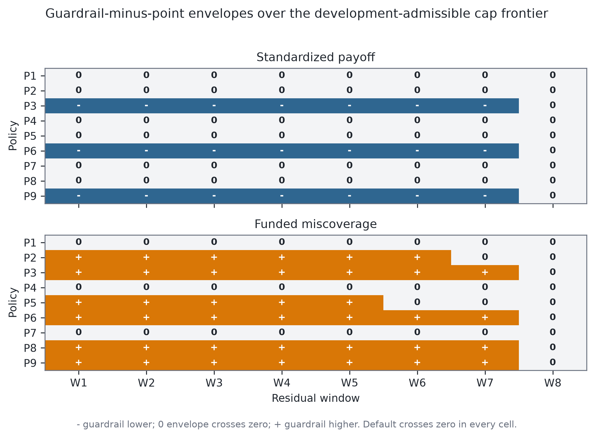

# Scope and Evidence Contract

This supplement documents one retrospective CRPTO specification audit. The
archive had been inspected during earlier project iterations. The active
protocol was committed before its complete run, but it is not a prospective
trial, preregistration, or pristine lockbox. The inferential object is the
finite Lending Club archive under the declared information, outcome, policy,
and comparator contracts.

The audit reports every eligible consecutive six-month residual window and five
protocol-locked coverage specifications. The original V4 detail retains CatBoost and
numeric logistic, while monotonic CatBoost and two WOE/IV scorecards broaden
model-class coverage checks; only the primary CatBoost enters optimization. The
decision audit reports the complete five-point gamma path, two rulers constructed
without policy-development or OOT evaluation outcomes, three interior coordinates,
and every comparator in each named support. *Evaluation-outcome-blind* means that
earlier model and conformal fitting may use historical labels, while policy
construction reads neither development nor OOT evaluation outcomes. The
nine fixed-cap policies remain a supporting exact-frontier diagnostic, not a
closed family of promotion candidates. No out-of-time (OOT) outcome selects a
learner, window, taxonomy, gamma, ruler, coordinate, policy, cap, or comparator.
Nested supports, overlapping windows, and repeated allocations are
specification paths, not independent replications or votes.

| Reader question | Location | Audit answer |
|---|---|---|
| Which loans could enter a decision? | Appendix A | Status-independent monthly menus retain unresolved outcomes |
| What does the conformal object predict? | Appendix B | The observed binary terminal label, not latent individual PD |
| Why can interval geometry change abruptly? | Appendix B | The binary residual order statistic changes around prevalence $\pi=\alpha$ |
| What is held fixed in portfolio comparisons? | Appendix C | Menu, budget, payoff, loan bounds, purpose cap, solver, and one declared ruler |
| What is exact? | Appendix D | Score-ruler algebra, C2 feasibility, binary-outcome bounds, and basis-frontier envelopes |
| Which empirical signs survive? | Appendix E | The endpoint sign changes by ruler/coordinate and no broad-support sign survives |
| What does the simulation establish? | Appendix F | A coverage mechanism only; its portfolio component is degenerate |
| Can the evidence be replayed? | Appendix G | Yes, from three hash-linked freeze/evaluation pairs and a full raw-data audit |
| What may the paper claim? | Appendix H | An identification audit, not superiority, causality, or selected-set validity |
| How does CRPTO differ from its closest methods? | Appendix I | By its frozen-score audit target, not by claiming each component as new |

: Reader map for the Online Supplement. {#tbl-s-reader-map}

# Appendix A: Data, Timing, and Outcome Observability

## A.1 Single status-independent universe

<!-- claim:data.exhaustive_status_independent_population -->
<!-- claim:endpoint.not_verified_snapshot -->

The source is the Lending Club 2007--2020Q3 public research archive. A
chunked full-file audit reads all 2,925,493 rows and 142 columns; 2,925,492 are
valid dated loans. The archive contains 2,060,077 36-month and 865,415 60-month
contracts. The single active design retains all 640,543 loans eligible under
deterministic schema, date, term, and origination-feature checks. It is an
exhaustive design population, not a sample or row cap. Candidate membership
never depends on whether the reconstructed endpoint is resolved.

The decision unit is issue month. Every OOT month receives a fresh USD 1
million budget, and a policy can allocate only to loans issued in that month.
The primary panel contains 376,890 candidates in 15 menus from April 2016
through June 2017. A July--September 2017 extension contains 88,227 candidates
and is retained only as a more heavily censored diagnostic.

| Block | Issue dates | Rows | Labels available by cutoff | Role |
|---|---:|---:|---:|---|
| PD development | 2007-06--2010-12 | 17,433 | 17,392 | model fit and temporal validation |
| Platt calibration and taxonomy | 2011-01--2011-12 | 14,101 | 14,077 | separately fitted score map and fixed edges |
| Residual pool | 2012-01--2013-01 | 49,007 | 48,857 | all eight six-month recipes |
| Policy development | 2013-02--2013-12 | 94,885 | not read | outcome-free comparator support |
| Primary OOT | 2016-04--2017-06 | 376,890 | read only after freeze | complete locked evaluation |
| Censored extension | 2017-07--2017-09 | 88,227 | read only after freeze | secondary censoring stress |

: S1 chronology and label observability. Blocks do not overlap except that the eight residual windows overlap by design. {#tbl-s-chronology}

The information cutoff for model and residual labels is March 31, 2016. The
evaluation endpoint cutoff is September 30, 2020. The distributed file is not
a verified point-in-time snapshot: 36,485 last-payment dates and 40,214
last-credit-pull dates occur after that cutoff. A charged-off residual
label is treated as available at the month-end of `last_pymnt_d` plus six
calendar months; every included residual month retains more than 99% of
terminal labels under this
rule. The minimum monthly retention is 0.992956.

The complete audit explains why the remaining archive is not exchangeable
extra training data. Forty-eight variables have negligible early support and
near-complete later support, so admitting them would change the temporal
feature contract. Label availability by the cutoff is 59,910/162,570 (36.85%)
for 2014, 28,878/283,173 (10.20%) for 2015, and 1,110/96,120 (1.15%) for
2016Q1, with zero observed bads in the last group. A resolved-only fit would
therefore select on duration. Sixty-month contracts define another horizon;
using censored cohorts coherently would require a survival or competing-risk
estimand rather than a larger binary sample.

For primary OOT, requested and funded amount differ by only USD 18,000 across
376,890 loans. The funded-to-requested ratio is 0.999996 and only about two
loans are partially funded. The optimizer nevertheless names listed loan
amount as its exposure contract rather than treating the two fields as
interchangeable by assumption.

## A.2 Endpoint taxonomy and censoring

Statuses containing `Charged Off` are positive ($Y=1$), and statuses containing
`Fully Paid` are negative ($Y=0$), only when reconstructed endpoint availability
is no later than the cutoff. Exact `Default`, every nonterminal status, and
terminal statuses becoming available later remain unresolved. The primary
panel has 364,814 resolved and 12,076 unresolved candidates. Fully Paid is
available at the month-end of `last_pymnt_d`; Charged Off is available at that
month-end plus six calendar months. The charge-off delay is a modeling
assumption, not the known operational charge-off date. Relative to V2, this
rule reclassifies 525 archive-terminal candidates after the cutoff, so
11,551 + 525 = 12,076 remain unresolved.

This endpoint is a cutoff-specific terminal classification, not a lifetime hazard.
The analysis does not assume that unresolved outcomes are missing at random.
Instead, allocations are frozen first and each unresolved binary outcome is
allowed to take either value in sharp fixed-allocation and paired-policy
bounds. This preserves the historical menu while exposing the uncertainty
that outcome filtering would conceal.

## A.3 Physical information boundary

Prediction, residual-recipe construction, policy development, comparator
support, point-frontier enumeration, and allocation freezing run without OOT
status, realized payoff, miscoverage, or another outcome-derived field. The
outcome-free phase persists 51,117 solve records and 5,001,617 funded rows. It
contains 1,872 guardrail solves: eight windows by nine policies by 26 monthly
menus, of which 11 are development and 15 are primary OOT. It also contains
1,080 OOT C2 solves: eight windows by nine policies by 15 months.

The separate two-ruler freeze contains 6,240 solves, 622,455 funded rows, 720
endpoint comparisons, 1,440 reversed-ID endpoint reruns, 288 separate GLOP
checks, and 26 objective-optimum basis diagnostics. Its dimensions are eight
windows by 26 months by five gammas by three coordinates by two rulers. It
loads no outcome column.

The separate credit-control freeze contains five score vectors for all 640,543
eligible rows, 160 residual recipes, 3,638,660 fit-audit rows, and 3,520
outcome-free geometry cells. It reproduces the two active V4 score columns
exactly and freezes monotonic CatBoost plus both WOE/IV scorecards before any
primary OOT outcome join. No control enters a portfolio solve.

Each evaluator verifies its freeze identity and every artifact descriptor
before a keyed outcome join. Exact ID alignment is required; partial or
duplicated joins fail. The resulting evidence therefore separates allocation
construction from outcomes and prevents an outcome-dependent interpretation
from changing the frozen decision rule.

# Appendix B: Prediction and Binary Conformal Geometry

## B.1 Primary learner and four protocol-locked coverage controls

The primary score is a CatBoost classifier with seed 42, 29 numeric and nine
categorical origination-time features. A Platt map fitted on 2011 raw margins
produces $p_i$. Five score strata, fixed from all status-independent 2011
scores, form the canonical Mondrian taxonomy. One-, two-, and ten-stratum
recipes are closed coverage diagnostics rather than a selection grid.

A numeric logistic regression provides the first coverage-only
control. It uses median imputation, standard scaling, class balancing, and its
own 2011 Platt map and fixed taxonomy. Three further controls use the same
temporal roles and all eligible rows:

- **Monotonic CatBoost.** Positive constraints apply to interest rate, DTI,
  loan-to-income and its square, installment burden, revolving utilization,
  revolving-balance-to-income, public records, recent inquiries, delinquency
  severity, and five adverse-history flags. Negative constraints apply to
  annual and log income, FICO, credit age, and delinquency recency. The inherited
  `recent_chargeoff` flag is constant in PD development and Platt calibration,
  so its declared positive constraint is inert in fitting.
- **Platform-signal WOE/IV.** Twenty-six fields include loan amount, interest,
  installment, income and burden ratios, revolving and bureau measures, grade,
  subgrade, home ownership, purpose, verification, interest bucket, and the
  interest-bucket-by-grade interaction.
- **Pricing-excluded application WOE/IV.** Nineteen fields retain loan amount, income, DTI,
  loan-to-income, revolving utilization and balances, FICO, credit age,
  employment length, account counts, public records, inquiries, delinquency,
  home ownership, purpose, and verification. Grade, subgrade, interest,
  installment, pricing buckets, and their interaction are excluded.

Each OptBinning process is fit on PD development only, with automatic
monotonic trend, two to eight bins, and a 5% minimum bin share
[@navaspalencia2020]. Each learner then receives its own 2011 Platt map and
taxonomy. None of the four controls enters the portfolio optimizer or is chosen
from OOT outcomes. They ask whether coverage transport is specific to model
class, unconstrained shape, or platform pricing; they are not a model-selection
contest.

The raw-feature contract records two exceptions to the 95% coverage threshold.
`mths_since_last_delinq` is structurally nullable: minimum fitting coverage is
0.336075 and primary OOT coverage is 0.528555; the frozen transformation maps
missing recency to 999. `pub_rec_bankruptcies` has minimum fitting coverage
0.921700 and complete primary OOT coverage; missing values map to no recorded
bankruptcy. Feature engineering emits observed-value indicators for audit, but
the frozen learners do not add them post hoc. These mappings are disclosed
limitations, not a missingness-robustness result.

## B.2 Credit-control prediction, IV, and temporal shift

All five scores use the same 376,890 primary candidates, of which 364,814 are
resolved and 12,076 are unresolved. All 30 model-by-role calibration
intercept/slope fits converge in 8--16 iterations. Primary OOT default prevalence
is 0.156167, versus 0.104781 on the 2011 Platt block and 0.196438 among resolved
extension loans.

| Learner | OOT AUC | Brier | ECE10 | Mean cal. error | Slope | Min lower | Max upper | Upper $<.90$ |
|---|---:|---:|---:|---:|---:|---:|---:|---:|
| CatBoost | 0.640605 | 0.129878 | 0.047215 | -0.047109 | 0.795427 | 0.842485 | 0.882597 | 8 |
| Numeric logistic | 0.642045 | 0.128846 | 0.031149 | -0.028923 | 0.543210 | 0.850031 | 0.896222 | 8 |
| Monotonic CatBoost | 0.651954 | 0.128613 | 0.041563 | -0.041264 | 0.835149 | 0.848396 | 0.886489 | 8 |
| Platform-signal WOE scorecard | 0.633066 | 0.129485 | 0.035968 | -0.035510 | 0.918655 | 0.848908 | 0.894908 | 8 |
| Pricing-excluded application WOE scorecard | 0.612939 | 0.130190 | 0.031769 | -0.029752 | 0.709836 | 0.852013 | 0.897726 | 8 |

: S2 five-model primary OOT prediction and coverage audit. Min lower and max upper form the across-window all-candidate coverage hull, not a confidence interval. {#tbl-s-credit-controls}

Every mean calibration error is negative and every slope is below one,
so all specifications underpredict later default on average and change
calibration shape. Monotonic CatBoost has descriptively higher OOT AUC than the
active score by 0.011348 and lower Brier by 0.001265. Platform WOE exceeds the
pricing-excluded application scorecard by 0.020127 AUC and has 0.000705 lower
Brier. These complete reported
contrasts diagnose model and platform-signal dependence; because they use the
audited OOT outcomes, they cannot promote a learner.

All 45 OptBinning problems report `OPTIMAL`. The most informative platform
fields are incumbent pricing and grade signals, whereas FICO and inquiries lead
the pricing-excluded application scorecard:

| Scorecard | Feature | IV | Primary OOT feature PSI |
|---|---|---:|---:|
| Platform | int_rate_bucket__grade | 0.337569 | 0.962804 |
| Platform | sub_grade | 0.319325 | 0.104275 |
| Platform | grade | 0.299544 | 0.093703 |
| Platform | int_rate | 0.278429 | 0.180056 |
| Platform | int_rate_bucket | 0.244858 | 0.146043 |
| Pricing excluded | fico_score | 0.213574 | 0.227297 |
| Pricing excluded | inq_last_6mths | 0.170864 | 0.390443 |
| Pricing excluded | purpose | 0.088878 | 0.187985 |
| Pricing excluded | rev_utilization | 0.073903 | 0.086944 |
| Pricing excluded | delinq_recency | 0.049288 | 0.130864 |

: S3 leading development IV values and development-to-primary-OOT feature PSI. IV ranks the frozen development bins; PSI is descriptive shift, not a validity test. {#tbl-s-woe-iv-psi}

| Score | Development-to-primary-OOT PSI |
|---|---:|
| CatBoost | 0.139757 |
| Numeric logistic | 0.005168 |
| Monotonic CatBoost | 0.093706 |
| Platform-signal WOE | 0.148867 |
| Pricing-excluded application WOE | 0.072332 |

: S4 score PSI under common development-decile bins. {#tbl-s-score-psi}

The largest feature PSI is 0.962804 for the price-grade interaction, followed
by verification status (0.608133), DTI (0.552263), and recent inquiries
(0.390443). Yet numeric logistic has score PSI 0.005168 and still excludes 0.90
coverage in all eight windows. PSI can reveal marginal shift, but neither low
nor high PSI is a conformal transport certificate.

## B.3 Complete residual-window specification

<!-- claim:coverage.five_models_all_windows_below_nominal -->

For each learner, window, and fixed score stratum $g$, define residuals

$$
R_i=|Y_i-p_i|.
$$

At target miscoverage $\alpha=0.10$, the finite-sample split rank is

$$
k_g=\left\lceil(n_g+1)(1-\alpha)\right\rceil,
$$

and $c_g$ is the corresponding ordered residual. The clipped interval is

$$
[\ell_i,u_i]=[\max(0,p_i-c_g),\min(1,p_i+c_g)].
$$

It predicts the observed binary outcome. It is not a confidence interval for
latent individual PD and not the convex hull of its intersection with the
binary outcome space. The latter intersection is reported separately as
empty, $\{0\}$, $\{1\}$, or $\{0,1\}$.

| Window | Residual dates | Fit rows | CatBoost fit coverage |
|---|---:|---:|---:|
| W1 | 2012-01--2012-06 | 14,948 | 0.900388 |
| W2 | 2012-02--2012-07 | 16,674 | 0.900444 |
| W3 | 2012-03--2012-08 | 19,049 | 0.900362 |
| W4 | 2012-04--2012-09 | 21,767 | 0.900262 |
| W5 | 2012-05--2012-10 | 24,270 | 0.900247 |
| W6 | 2012-06--2012-11 | 26,685 | 0.900244 |
| W7 | 2012-07--2012-12 | 28,411 | 0.900215 |
| W8 | 2012-08--2013-01 | 30,129 | 0.900229 |

: S5 complete six-month residual specification. Fit rows are the sums across the five fixed CatBoost strata. {#tbl-s-windows}

All eight windows are reported. The windows overlap, and their growing sample
sizes partly reflect platform growth. They are not independent temporal
replications.

## B.4 Candidate coverage with unresolved outcomes

Let $M_i=1\{Y_i\notin[\ell_i,u_i]\}$. Resolved coverage is computed on labeled
candidates. For each unresolved row, the evaluator computes the two attainable
values $M_i(0)$ and $M_i(1)$. The sharp all-candidate coverage interval is
$[1-n^{-1}\sum_i\max_y M_i(y),\;1-n^{-1}\sum_i\min_y M_i(y)]$. This matters
for empty, singleton, and $\{0,1\}$ sets: an unresolved outcome cannot be forced
to fail when both binary endpoints are covered, nor forced to succeed when the
set is empty.

| Window | CatBoost resolved | CatBoost all-candidate bound | Logistic resolved | Logistic all-candidate bound | CatBoost mean width |
|---|---:|---:|---:|---:|---:|
| W1 | 0.877047 | [0.854714, 0.880522] | 0.893058 | [0.871819, 0.896222] | 0.664992 |
| W2 | 0.879166 | [0.857025, 0.882597] | 0.892101 | [0.870851, 0.895277] | 0.665341 |
| W3 | 0.877735 | [0.855653, 0.881143] | 0.891819 | [0.870641, 0.894969] | 0.665320 |
| W4 | 0.874873 | [0.852570, 0.878341] | 0.888157 | [0.866664, 0.891374] | 0.665031 |
| W5 | 0.872513 | [0.849932, 0.876033] | 0.885692 | [0.863663, 0.889013] | 0.664708 |
| W6 | 0.872113 | [0.849426, 0.875669] | 0.883045 | [0.860561, 0.886468] | 0.664569 |
| W7 | 0.869481 | [0.846518, 0.873093] | 0.877428 | [0.854517, 0.880976] | 0.664154 |
| W8 | 0.865855 | [0.842485, 0.869564] | 0.873234 | [0.850031, 0.876863] | 0.500569 |

: S6 primary coverage over 376,890 candidates, including 12,076 unresolved outcomes. {#tbl-s-coverage}

Every upper endpoint is below 0.90 for both detailed V4 learners. Section B.2
shows the same eight-of-eight result for all five learner specifications. This
is a temporal transport result for the declared archive; it does not contradict
split conformal validity under exchangeability.

## B.5 Binary threshold discontinuity

<!-- claim:geometry.prevalence_sensitive_mechanism -->

For a constant score $0\le p<1/2$ and $Y\sim\mathrm{Bernoulli}(\pi)$, the
population absolute residual is $p$ with probability $1-\pi$ and $1-p$ with
probability $\pi$. Its $(1-\alpha)$ quantile is therefore

$$
c(p,\pi)=
\begin{cases}
p, & \pi\le\alpha,\\
1-p, & \pi>\alpha.
\end{cases}
$$

The discrete prediction set changes from $\{0\}$ to $\{0,1\}$ at the
prevalence threshold. This is a population proposition under a constant score,
not a proof for varying scores inside an empirical stratum.

CatBoost stratum 2 displays the corresponding diagnostic pattern:

| Window | Fit rows | Fit prevalence | Residual quantile | OOT mean width | Empty | $\{0\}$ | $\{0,1\}$ | OOT coverage bound |
|---|---:|---:|---:|---:|---:|---:|---:|---:|
| W1 | 3,249 | 0.116651 | 0.891974 | 0.987580 | 0.0000 | 0.8844 | 0.1156 | [0.847091, 0.875593] |
| W2 | 3,621 | 0.116542 | 0.892012 | 0.987614 | 0.0000 | 0.8832 | 0.1168 | [0.847331, 0.875808] |
| W3 | 4,018 | 0.113987 | 0.891609 | 0.987255 | 0.0000 | 0.8954 | 0.1046 | [0.845092, 0.873885] |
| W4 | 4,511 | 0.109953 | 0.890281 | 0.986041 | 0.0000 | 0.9347 | 0.0653 | [0.837223, 0.867357] |
| W5 | 5,001 | 0.106579 | 0.889415 | 0.985220 | 0.0000 | 0.9606 | 0.0394 | [0.832087, 0.863094] |
| W6 | 5,502 | 0.105234 | 0.889252 | 0.985063 | 0.0000 | 0.9660 | 0.0340 | [0.831189, 0.862360] |
| W7 | 5,929 | 0.101703 | 0.888435 | 0.984263 | 0.0000 | 0.9904 | 0.0096 | [0.826483, 0.858375] |
| W8 | 6,238 | 0.097147 | 0.111801 | 0.207631 | 0.0026 | 0.9974 | 0.0000 | [0.822536, 0.854707] |

: S7 CatBoost stratum-2 geometry. Set columns report candidate shares. {#tbl-s-phase}

The W7--W8 prevalence change crosses $\alpha=0.10$ and coincides with the
quantile and width change. The narrower W8 interval does not repair transport;
its stratum-2 all-candidate upper bound is 0.854707.

For any binary outcome, interval miscoverage has the exact identity

$$
M_i=1\{Y_i=0,\ell_i>0\}+1\{Y_i=1,u_i<1\}.
$$

Endpoint saturation can therefore increase coverage without improving score
ranking, and a width reduction can increase missed rare positives.

## B.6 Label-lag sensitivity

<!-- claim:timing.fit_label_crossing_retained -->

The primary recipes date a charged-off label six calendar months after the
month-end of last payment. Because the archive and six-month recipe had already
been inspected, the retrospective sensitivity protocol locked the complete
0-, 3-, 6-, 8-, and 12-month grid before its corresponding run; this is not
preregistration. The inherited rule requires more than 99% retention in every fitting month.
Scores, strata, OOT candidates, and outcomes are unchanged; only fitting-label
availability and the resulting stratum-2 residual quantile vary.

| Charged-off lag (months) | Minimum monthly retention | Passes >99% rule | W7 prevalence | W7 quantile | W8 prevalence | W8 quantile |
|---:|---:|:---:|---:|---:|---:|---:|
| 0 | 0.997116 | Yes | 0.103216 | 0.888691 | 0.099024 | 0.111870 |
| 3 | 0.996669 | Yes | 0.102914 | 0.888675 | 0.098736 | 0.111862 |
| 6 | 0.992956 | Yes | 0.101703 | 0.888435 | 0.097147 | 0.111801 |
| 8 | 0.986816 | No | 0.099730 | 0.111883 | 0.094097 | 0.111712 |
| 12 | 0.974535 | No | 0.093138 | 0.111690 | 0.087196 | 0.111504 |

: S7A retrospectively protocol-locked fit-label sensitivity. The W7--W8 threshold crossing persists for every lag satisfying the retention stop rule. {#tbl-s-label-lag}

The crossing disappears at 8 and 12 months because W7 is already below the
threshold, but those specifications fail the locked retention criterion. This
separates stability across lags satisfying the strict retention rule from sensitivity
under more aggressive label delay. It does not establish that prevalence
caused the empirical geometry change.

This family changes labels used to fit the conformal recipes. It does not vary
availability of primary OOT outcomes at the evaluation cutoff. Appendix E.2
reports that separate endpoint-availability family; the two timing axes were
not crossed factorially.

# Appendix C: Portfolio and Comparator Protocol

## C.1 Coherent plug-in objective and realized endpoint

For candidate $i$ with listed amount $L_i$, return rate $r_i$, point score
$p_i$, and LGD $\lambda=0.45$, the optimizer uses

$$
v_i=(1-p_i)r_i-p_i\lambda.
$$

The realized standardized payoff uses the algebraically coherent endpoint

$$
z_i(Y_i)=(1-Y_i)r_i-Y_i\lambda.
$$

Thus $v_i$ is the model-implied expectation of $z_i$ if $p_i$ were the true
conditional event probability. The audit does not assert that condition. The
endpoint is not investor return, IRR, NPV, welfare, or a cash-flow model; it
omits amortization, prepayment timing, recovery timing, fees, discounting, and
capital costs.

## C.2 Monthly linear program

For score $s_i$ and cap $\tau$, each monthly policy solves

$$
\begin{aligned}
\max_a\quad & \sum_i a_i v_i \\
\text{s.t.}\quad
& \sum_i a_i=B,\\
& 0\le a_i\le L_i,\\
& \sum_i a_i s_i\le \tau B,\\
& \sum_{i:g(i)=h}a_i\le0.25B\quad\text{for each purpose }h,
\end{aligned}
$$

with $B=\$1{,}000{,}000$. The point policy uses $s_i=p_i$. The guardrail uses

$$
q_i(\gamma)=(1-\gamma)p_i+\gamma u_i.
$$

The complete score path is
$\gamma\in\{0,0.25,0.50,0.75,1\}$. The frozen empirical contrast is
$\gamma=1$ minus $\gamma=0$; the three interior gamma values diagnose the path
and cannot be selected as winners.

## C.3 Two common-frontier rulers

Let $\mathcal A_t$ contain the nonrisk constraints above, let
$s(\gamma)=q(\gamma)$, and define

$$
m_{\gamma t}=B^{-1}\min_{a\in\mathcal A_t}s(\gamma)^\top a,
\quad z_t^*=\max_{a\in\mathcal A_t}v^\top a,
\quad o_{\gamma t}=B^{-1}s(\gamma)^\top a_t^*.
$$

For the primary **objective-matched ruler**, let
$z^{\min}_{\gamma t}$ denote the plug-in objective at a minimum-score
portfolio and $z_t^L=\max_\gamma z^{\min}_{\gamma t}$. At
$\rho\in\{.25,.50,.75\}$ every score minimizes funded score subject to the
same objective floor

$$
v^\top a\ge z_t^L+\rho(z_t^*-z_t^L).
$$

This matches model-implied objective sacrifice, not true expected return. For
the secondary **normalized-score ruler**, define

$$
c_{\gamma t}(\eta)=m_{\gamma t}
 +\eta(o_{\gamma t}-m_{\gamma t}),\qquad
\eta\in\{.25,.50,.75\},
$$

and maximize the plug-in objective under
$s(\gamma)^\top a\le Bc_{\gamma t}(\eta)$. This coordinate is invariant to
positive affine score units, but it does not match objective sacrifice,
default risk, or shadow price. Coordinate one reaches the common verified
plug-in optimum for every gamma and is therefore a structural null for the
endpoint allocation contrast. The evaluated three-coordinate interior grid is
finite; it is not a continuous two-ruler frontier.

## C.4 Supporting named comparators and exact support

The earlier fixed-cap grid supplies supporting comparator diagnostics:

| Policy | $\tau$ | $\gamma$ | Policy | $\tau$ | $\gamma$ | Policy | $\tau$ | $\gamma$ |
|---|---:|---:|---|---:|---:|---|---:|---:|
| P1 | 0.15 | 0.25 | P4 | 0.17 | 0.25 | P7 | 0.19 | 0.25 |
| P2 | 0.15 | 0.50 | P5 | 0.17 | 0.50 | P8 | 0.19 | 0.50 |
| P3 | 0.15 | 0.75 | P6 | 0.17 | 0.75 | P9 | 0.19 | 0.75 |

: S8 supporting fixed-cap grid. It is not a closed policy family and no policy is selected or promoted. {#tbl-s-policies}

The score and its cap jointly define a feasible decision problem. The audit
therefore declares four point-score comparison objects.

**C0: same numeric cap.** The point policy copies the guardrail's $\tau$. Since
$q_i\ge p_i$, this is a positive control for mechanical feasible-set nesting,
not a neutral baseline.

**C1: development mean.** For each window-policy pair, the point cap is the
capital-weighted mean of the guardrail allocation's point-score moments over
the eleven common February--December 2013 development menus.

**C2: contemporaneous funded-moment match.** After a guardrail allocation
$a^q$ is frozen on an OOT menu, the point cap is

$$
\tau^{C2}=\frac{\sum_i a_i^q p_i}{B}.
$$

This is outcome-free and menu-adaptive. It is useful for decomposition but is
not a deployable ex ante comparator because its cap is defined from the
guardrail allocation it evaluates.

**Exact cap frontier.** The development-admissible support for each
window-policy pair is the closed minimum--maximum interval of its eleven
monthly development point-score moments. Its global hull is
$[0.055573,0.099997]$. A secondary broad-stress support is $[0.05,0.12]$.
HiGHS basis-ranging endpoints and every named/support endpoint produce 3,067
distinct point caps. The supports are fixed without outcomes.

# Appendix D: Exact Statements and Proofs

## D.1 Positive affine cap equivalence and same-cap nesting

Suppose a score is globally $s_i=\kappa p_i+b$ with $\kappa>0$ and every feasible
portfolio fills budget $B$. Then

$$
\sum_i a_i s_i\le\tau B
\quad\Longleftrightarrow\quad
\sum_i a_i p_i\le\frac{\tau-b}{a}B.
$$

Thus a positive affine score admits an exactly translated point cap. The
empirical guardrail is not globally affine because clipping and stratum-specific
residual quantiles change its slope and intercept.

Because $u_i\ge p_i$ and $\gamma\in[0,1]$, $q_i\ge p_i$. At the same numerical
cap, every guardrail-feasible allocation is point-feasible. The point optimum
therefore weakly dominates in the shared plug-in objective. Neither statement
orders realized outcomes.

## D.2 Positive-affine invariance of normalized coordinates

Let $\widetilde s=\kappa s+b$ for $\kappa>0$. The score minimum and score of the common
plug-in optimum transform as
$m_{\widetilde s}=\kappa m_s+b$ and $o_{\widetilde s}=\kappa o_s+b$. Hence

$$
c_{\widetilde s}(\eta)=\kappa c_s(\eta)+b.
$$

Using the full-budget equality,
$\widetilde s^\top a\le Bc_{\widetilde s}(\eta)$ if and only if
$s^\top a\le Bc_s(\eta)$. The normalized ruler therefore defines the same
feasible set after a positive affine change of score units. The result does not
extend to the non-affine point-versus-upper score map and does not equalize
plug-in opportunity cost.

## D.3 C2 plug-in objective dominance

Let $a^q$ be a full-budget guardrail allocation and set
$c=p^\top a^q/B$. Then $p^\top a^q=cB$, so $a^q$ is feasible for the point LP
with cap $c$. Every nonrisk constraint and the plug-in objective are unchanged.
Consequently,

$$
V_p^*(c)\ge v^\top a^q.
$$

Across all 1,080 C2 cells, the maximum absolute funded-moment residual is
$8.33\times10^{-17}$. The minimum point-minus-guardrail plug-in objective is
$-1.46\times10^{-10}$ dollars, numerical zero within solver tolerance. This
reconciles the theorem; it does not establish realized payoff dominance.

## D.4 Sharp common-outcome bounds

<!-- claim:theory.sharp_common_outcome_bounds -->

For fixed exposure weights $w_i$ and an additive binary endpoint
$f_i(Y_i)$, each unresolved outcome may be zero or one. The fixed-policy lower
and upper bounds are

$$
\sum_{i\in R}w_i f_i(Y_i)+
\sum_{i\in U}\min_{y\in\{0,1\}}w_i f_i(y),
\qquad
\sum_{i\in R}w_i f_i(Y_i)+
\sum_{i\in U}\max_{y\in\{0,1\}}w_i f_i(y).
$$

For candidate coverage, $f_i=1-M_i$ gives the equivalent and operationally
clear form

$$
C_L=1-\frac{1}{n}\sum_i\max_y M_i(y),\qquad
C_U=1-\frac{1}{n}\sum_i\min_y M_i(y).
$$

These are not obtained by adding or subtracting the unresolved fraction from
resolved coverage; the attainable miss values depend on each prediction set.

For a paired contrast, one common unresolved $Y_i$ is optimized over the union
of loans funded by either policy. This avoids the invalid operation of assigning
different outcomes to the same unresolved loan under two policies. The bounds
are sharp for the finite archive under unrestricted binary completion. They are
not sampling confidence intervals.

## D.5 Basis-endpoint sufficiency

<!-- claim:theory.basis_endpoint_sufficiency -->

With the full-budget equality, the point-score cap appears in the LP right-hand
side. Within one optimal basis, the allocation is affine in the cap. Against a
fixed guardrail, every resolved-outcome contrast is therefore affine. For one
unresolved outcome, the sharp lower contribution is the minimum of two affine
functions and the upper contribution their maximum. The lower bound is concave
and the upper bound convex within the basis range, so adverse extrema occur at
its endpoints.

Evaluating each support endpoint and every HiGHS basis-ranging endpoint is
therefore sufficient for the exact sharp envelope over the declared support,
up to solver tolerance. Fixed-grid interpolation is not used for an exactness
claim.

For support $\mathcal C$, if $[L(c),U(c)]$ is the paired sharp contrast at cap
$c$, the declared comparator envelope is

$$
\left[\min_{c\in\mathcal C}L(c),
      \max_{c\in\mathcal C}U(c)\right].
$$

This reports whether a sign survives one named outcome-free comparator support.
It is not a causal identified set, a confidence interval, or quantification
over all conceivable comparators.

# Appendix E: Empirical Comparator Audit

## E.1 Complete two-ruler endpoint census

<!-- claim:timing.endpoint_six_month_reconciles_v3 -->
<!-- claim:timing.fit_and_endpoint_lags_not_factorial -->
<!-- claim:decision.no_selected_policy -->

Each row below summarizes one protocol-locked ruler-coordinate track over the same
eight overlapping residual recipes and fifteen OOT menus. Contrasts are
$\gamma=1$ minus $\gamma=0$. The objective-matched ruler is primary; the
normalized-score ruler is a secondary scale-invariance stress test.

| Ruler | Coordinate | Active months/window | Plug-in objective difference (USD) | Payoff bound hull (USD) | Default bound hull (pp) | Miscoverage bound hull (pp) |
|---|---:|---:|---:|---:|---:|---:|
| Objective matched | .25 | 4 | [0.00, 0.00] | [-9,134.34, 5,603.66] | [-0.0068, 0.1265] | [-0.0068, 0.1265] |
| Objective matched | .50 | 15 | [0.00, 0.00] | [-82,616.17, -27,958.37] | [0.4572, 1.0973] | [1.0154, 1.9321] |
| Objective matched | .75 | 15 | [0.00, 0.00] | [-179,484.66, 92,558.18] | [-0.4352, 2.4948] | [1.3252, 4.1848] |
| Normalized score | .25 | 15 | [425,196.46, 557,294.01] | [-626,374.61, -195,967.63] | [8.4829, 13.4246] | [8.3910, 13.7536] |
| Normalized score | .50 | 15 | [152,030.99, 226,847.97] | [-259,658.18, -54,025.82] | [3.2214, 6.5637] | [2.1070, 5.2142] |
| Normalized score | .75 | 15 | [28,263.40, 51,201.89] | [-135,781.22, 9,812.59] | [1.4392, 2.3807] | [0.3447, 1.6991] |

: S9 complete finite-grid endpoint contrast. Hulls are minimum lower and maximum upper bounds across windows, not sampling intervals. {#tbl-s-two-ruler}

Endpoint reconstruction changed only outcome observability and the resulting
sharp bounds; scores, residual recipes, rulers, coordinates, and allocations
were unchanged. The required V2--V3 reconciliation is:

| Quantity | V2 endpoint | V3 reconstructed endpoint |
|---|---:|---:|
| Primary resolved / unresolved | 365,339 / 11,551 | 364,814 / 12,076 |
| Objective-matched .25 payoff (higher/lower/cross) | 8 / 0 / 0 | 0 / 0 / 8 |
| Objective-matched .25 default (lower/higher/cross) | 8 / 0 / 0 | 0 / 0 / 8 |
| Objective-matched .25 miscoverage (lower/higher/cross) | 8 / 0 / 0 | 0 / 0 / 8 |
| Normalized .75 payoff (higher/lower/cross) | 0 / 8 / 0 | 0 / 7 / 1 |
| All 48 payoff cells (higher/lower/cross) | 8 / 33 / 7 | 0 / 32 / 16 |
| All 48 default cells (lower/higher/cross) | 8 / 33 / 7 | 0 / 33 / 15 |
| All 48 miscoverage cells (lower/higher/cross) | 8 / 40 / 0 | 0 / 40 / 8 |

: S9A endpoint-recovery direction reconciliation. V2 is immutable provenance; V3 is the active endpoint. No V2 or V3 direction is promoted. {#tbl-s-endpoint-recovery}

Objective-matched .25 is one repeated allocation contrast: every window has
the same four active months and eleven structural zeros, with allocations
identical across windows to cents. The endpoint changes 44 loan-month positions
and USD 155,937.27 of one-way turnover across USD 15 million. Under the
reconstructed endpoint, all three sharp intervals cross zero in all eight
windows. The earlier point values are attainable upper or lower endpoints, not
identified contrasts. This is one repeated allocation, not eight independent
confirmations.

At objective-matched .50, payoff is lower and default/miscoverage higher in all
eight window bounds. At .75, payoff and default cross zero in seven windows and
are adverse in W8; miscoverage is higher in all eight. Normalized .25 and .50
are adverse in all eight windows. At normalized .75, default and miscoverage
are adverse in all eight, while payoff is adverse in seven and crosses zero in
one. The plug-in objective differences show that this ruler does not equalize
opportunity cost. Across the full 48-cell census, payoff is lower in 32 and
crosses zero in 16; default is higher in 33 and crosses zero in 15;
miscoverage is higher in 40 and crosses zero in 8. These are specification
counts, not votes.

## E.2 Evaluation-endpoint availability sensitivity

The endpoint-availability sensitivity holds every score, fitted residual
recipe, ruler, coordinate, support, and allocation fixed. It changes only the
administrative lag used to decide whether a Charged Off outcome is observable
at September 30, 2020. All five retrospectively protocol-locked lags are
reported; neither coverage nor portfolio outcomes select an endpoint.

| Lag (months) | Resolved / unresolved | Coverage upper $<.90$ | Maximum upper | Payoff lower / cross | Default higher / cross | Miscoverage higher / cross |
|---:|---:|---:|---:|---:|---:|---:|
| 0 | 364,861 / 12,029 | 40 / 40 | 0.897641 | 32 / 16 | 33 / 15 | 40 / 8 |
| 3 | 364,861 / 12,029 | 40 / 40 | 0.897641 | 32 / 16 | 33 / 15 | 40 / 8 |
| 6 | 364,814 / 12,076 | 40 / 40 | 0.897726 | 32 / 16 | 33 / 15 | 40 / 8 |
| 8 | 364,570 / 12,320 | 40 / 40 | 0.898151 | 32 / 16 | 33 / 15 | 40 / 8 |
| 12 | 363,288 / 13,602 | 39 / 40 | 0.900411 | 31 / 17 | 32 / 16 | 40 / 8 |

: S9B complete nonselective evaluation-endpoint lag grid. Direction counts summarize all 48 two-ruler cells for $\gamma=1-\gamma=0$; omitted opposite and exact-zero counts are zero. {#tbl-s-endpoint-lag}

The six-month row reconciles exactly to active V3: after removing the lag
column, all 120 coverage cells, 48 two-ruler contrasts, and 648 exact-support
envelopes are value-identical. Lags 0, 3, 6, and 8 retain the active 40/40 coverage result
and the same two-ruler direction census despite different endpoint counts. At
12 months, the pricing-excluded WOE/IV scorecard in W2 has upper coverage
0.900411, leaving 39/40 cells below target. One payoff and one default cell also
move from a one-sided adverse direction to crossing zero; no opposite
one-sided direction appears.

| Lag (months) | Development payoff lower / cross | Development default cross | Development miscoverage higher / cross | Broad-support cross |
|---:|---:|---:|---:|---:|
| 0 | 6 / 66 | 72 | 27 / 45 | 216 |
| 3 | 6 / 66 | 72 | 27 / 45 | 216 |
| 6 | 6 / 66 | 72 | 27 / 45 | 216 |
| 8 | 6 / 66 | 72 | 27 / 45 | 216 |
| 12 | 0 / 72 | 72 | 26 / 46 | 216 |

: S9C complete exact-support endpoint sensitivity. Each row contains all 72 development-support cells and all 216 broad-stress cells; omitted opposite and exact-zero counts are zero. {#tbl-s-endpoint-support-lag}

Thus the broad-support nonidentification result survives every endpoint lag,
while the all-model/all-window coverage statement is not universal over the
complete lag grid. The active six-month result remains the inherited endpoint
contract, not a lag selected from these outcomes. This family must not be
combined with Appendix B.6 as if all 25 fit-label-by-endpoint combinations had
been evaluated.

## E.3 Named-comparator census

The table counts the sign of the guardrail-minus-point sharp contrast over 72
window-policy cells per rule. “Lower” and “higher” refer to the guardrail. A
crossing contains zero.

| Comparator | Metric | Lower | Crosses zero | Higher |
|---|---|---:|---:|---:|
| C0 | Payoff | 0 | 54 | 18 |
| C0 | Default | 72 | 0 | 0 |
| C0 | Miscoverage | 15 | 52 | 5 |
| C1 | Payoff | 28 | 40 | 4 |
| C1 | Default | 3 | 35 | 34 |
| C1 | Miscoverage | 3 | 24 | 45 |
| C2 | Payoff | 35 | 31 | 6 |
| C2 | Default | 7 | 58 | 7 |
| C2 | Miscoverage | 5 | 20 | 47 |

: S10 named-comparator direction census. These descriptive counts are not votes because the comparators define different feasible sets. {#tbl-s-named}

C0's uniform lower-default direction follows the same-threshold nesting design,
not a neutral economic comparison. C2 satisfies plug-in dominance but still
produces both realized-payoff signs and many unresolved contrasts. The
difference is precisely why a comparator label cannot replace an explicit
support.

## E.4 Exact support envelopes

<!-- claim:comparator.broad_support_all_cross_zero -->

Over the broad stress support $[0.05,0.12]$, every one of the 216
window-policy-metric envelopes crosses zero. Within the narrower
development-admissible support:

| Metric | Guardrail lower | Crosses zero | Guardrail higher | Total |
|---|---:|---:|---:|---:|
| Standardized payoff | 6 | 66 | 0 | 72 |
| Terminal default | 0 | 72 | 0 | 72 |
| Funded miscoverage | 0 | 45 | 27 | 72 |

: S11 exact direction counts within development-admissible support. {#tbl-s-support}

{#fig-s-envelopes width=96%}

The six lower-payoff cells occur before W8; in W8, all 27 policy-metric
envelopes cross zero. The W8 geometry change therefore removes the directions
that survive some earlier development supports. It does not prove W8 is
correct or earlier windows are false; it shows the direction is not invariant
over the complete residual specification.

Default crosses zero in all 72 development-support cells. This is stronger
than reporting disagreement between C0, C1, and C2 because it evaluates the
continuous cap support exactly. It remains scoped to the declared finite
support.

The 3,067 count refers to distinct scalar cap values; 7,297 refers to
period-specific evaluated cap rows.

The solver audit evaluates 7,297 point-cap rows across 15 periods, including
2,204 named unique cap-months. The smallest absolute nonbasic reduced cost is
$3.88\times10^{-4}$, so no evaluated basis is classified as near-tied. Of
2,941 primal-degenerate bases, reversed-order reruns produce zero tie-sensitive
rows; maximum allocation distance is $1.45\times10^{-14}$ and maximum absolute
objective difference is $1.72\times10^{-9}$. This establishes deterministic
stability at the evaluated caps, not continuous-frontier uniqueness.

## E.5 Why no policy is promoted

The empirical record does not support a winner for three separate reasons.
First, candidate coverage misses its 0.90 target before optimization for both
learners and every residual window. Second, the endpoint sign changes across
the two rulers and three coordinates. Third, named comparators disagree and
exact envelopes eliminate all broad-support directions and all W8
development-support directions. Selecting .25, one ruler, an earlier window,
one comparator, or one of the six payoff cells after seeing these results would
convert a specification audit into post-result selection.

# Appendix F: Controlled Mechanism Simulation

<!-- claim:simulation.portfolio_claim_forbidden -->

The locked factorial crosses score shift
$\{0,0.05,0.10,0.15\}$, prevalence shift
$\{0,0.025,0.05,0.10\}$, taxonomy size $\{1,2,5,10\}$, and censoring rate
$\{0,0.05,0.15\}$. Each of the 192 cells has 100 deterministic repetitions of
2,000 candidates, for 19,200 repetitions.

The coverage component reproduces the intended mechanism. In five-group,
uncensored cells at zero score shift, mean coverage is 0.9008 with no
prevalence shift and 0.8161 with a +0.10 prevalence shift. At +0.15 score shift
and no prevalence shift, mean coverage is 0.9557 because more intervals
saturate at $\{0,1\}$. These results show that prevalence and endpoint
saturation can move coverage in opposite directions; they do not model the
Lending Club data-generating process.

The portfolio component is uninformative. Its fixed 0.40 cap is almost always
nonbinding: mean same-cap allocation distance is approximately
$2.08\times10^{-6}$, mean C2 distance is $1.04\times10^{-6}$, and mean C2
objective gain is $2.46\times10^{-12}$. No portfolio claim uses this
simulation. The negative diagnostic is retained rather than retuned after
inspection.

# Appendix G: Reproducibility and Lineage

## G.1 Two-phase execution

The audit uses two immutable phases. Phase 1 produces the learner scores, 64
residual recipes, label-availability audits, outcome-free geometry, 51,117 LP
solve records, 5,001,617 funded rows, 72 development supports, and 46,005
monthly frontier records. It verifies full budgets, optimal solver status,
exact split ranks, minimum monthly label retention, C2 moment matching, and the
absence of forbidden outcome columns before writing a freeze.

A no-write evaluation smoke test found that all-null placeholder conformal
endpoint columns on the shared frontier collided with window-specific
endpoints during a dataframe merge. No outcome evaluation artifact had been
written. The active evaluator verifies and imports the Phase-1 freeze, removes
only those placeholders, reconstructs terminal-status availability at the
evaluation cutoff, and writes to a fresh immutable root. It changes no model,
score, recipe, policy, comparator, allocation, hypothesis, or stop rule.

Phase 2 contains 1,408 coverage rows, 5,112 monthly evaluations, 360 aggregate
evaluations, 221,040 paired sharp contrasts, 648 comparator envelopes, 19,200
simulation repetitions, and 192 simulation cells. The evidence builder checks
source hashes and cardinalities before producing eleven publication tables,
three figures in PNG and PDF, and one active paper-facing manifest.

## G.2 Two-ruler stopped runs and retained evaluation

The two-ruler protocol records two outcome-free stops rather than repairing
them silently. V1 used a score span under an allowed objective slack as an
exact-tie diagnostic; that span measured the slack itself and was not a valid
test of alternate optima. V1b replaced it with nonbasic reduced costs,
reversed-ID endpoint reruns, and separate GLOP checks. It then stopped
because final validation required a budget residual below USD $10^{-6}$ while
both solver wrappers accepted USD $10^{-4}$; the observed maximum was only
USD $6.366\times10^{-6}$. Neither run loaded outcomes.

V1c changed only that final budget reconciliation threshold to USD $10^{-4}$,
a relative tolerance of $10^{-10}$ on a USD 1 million budget. It froze 6,240
solves and 622,455 funded rows, then wrote an immutable freeze descriptor. The
active V3 evaluator verifies that descriptor and every source hash, reconstructs
the common outcome endpoint, and reports 720 monthly contrasts, 48 window
contrasts, 144 metric-direction cells, and no selected result.

An earlier endpoint evaluation had one client timeout while its child process
continued; a second invocation repeated the fixed calculation in memory and
stopped at the no-overwrite gate. It wrote no duplicate artifact. The active V3
run uses a new immutable root, and future runs preflight output paths before
loading the archive.

## G.3 Credit-control stops and endpoint recovery

The credit-control protocol also preserves technical stops rather than hiding
them. V1 fit the five declared learners and reached only Parquet serialization:
the OptBinning aggregate `Totals` row mixed an empty WOE string with numeric WOE
values. No freeze or OOT evaluation was written. V1b changed only the exported
aggregate representation, verified a synthetic Parquet round trip, reproduced
the two V4 score columns with maximum absolute difference zero, and froze all
five scores before OOT outcomes.

V2 completed the fixed coverage evaluation, but a BFGS diagnostic used a
tolerance stricter than necessary and reported `success=false` in 17 of 30
calibration intercept/slope fits despite finite stable estimates. The coverage
results were preserved as a technical-stop root. V2b replaced only that
diagnostic with unpenalized logistic calibration, fails on any convergence
warning, and requires exact equivalence to the V2 coverage artifact. The
resulting 3,520-row by 39-column frame has the same SHA-256, order, values, and
dtypes; all 30 fits converge in 8--16 iterations. Noncalibration metrics are
exactly equal, and maximum intercept and slope changes relative to the finite
V2 estimates are $1.21\times10^{-8}$ and $8.26\times10^{-9}$.

The active V3 evaluation imports the unchanged V1b score freeze and applies the
same reconstructed endpoint as the primary audit. Earlier evaluations remain
immutable provenance but are not needed to reproduce a paper claim. No path
executes a protected historical stage or authorizes model selection, scorecard
superiority, or a portfolio result.

## G.4 Replay contract

The replay contract requires:

1. an environment locked by `uv`;
2. immutable, hash-described outcome-free and evaluated roots tracked by twelve
   DVC pointers across V4, the two-ruler diagnostic, and credit controls;
3. a separate freeze and evaluate command with no combined shortcut;
4. exact ID alignment at the outcome join;
5. byte-identical evidence builds;
6. claim-sync tests across the manifest, body, supplement, and generated TeX;
7. full tests, lint, static typing, historical-champion validation, and a zero
   drift gate; and
8. compilation and page-level visual inspection of the body, supplement, and
   official IJDS submission PDF.

Protected historical stages and their extraction manifest are not required to
replay the active evidence and are not overwritten.

## G.5 Anonymous-review boundary

Reviewer-facing files omit exact commits, tags, hashes, repository links, and
remote coordinates because they are searchable author fingerprints. An
editor-only claim registry preserves that crosswalk. At acceptance, the code,
environment lock, evidence manifest, immutable pointers, and raw-data
reconstruction instructions can be released under the journal's data and code
policy.

# Appendix H: Claim Boundary and Limitations

<!-- claim:boundary.no_selected_set_validity -->

| Evidence object | Permitted conclusion | Not established |
|---|---|---|
| Full raw-file audit | The 640,543 active rows exhaust the declared eligible population | That all 2.9 million rows share one horizon, schema, or estimand |
| Reconstructed endpoint | 364,814 primary outcomes are resolved by the declared cutoff and 12,076 are bounded as unresolved | That the distributed file is a verified point-in-time snapshot |
| Eight windows and five learners | Under the active six-month endpoint, candidate coverage upper bounds are below 0.90 in all 40 declared cells | Universal conformal invalidity, endpoint-lag invariance, an OOT-selected winner, or future performance |
| WOE/IV, monotonic, and PSI controls | The transport result is not unique to active CatBoost or platform-pricing features | Scorecard superiority, external validity, or PSI-based coverage certification |
| Constant-score proposition and stratum-2 path | Binary residual geometry is prevalence-sensitive | Exact finite-sample explanation for varying-score strata |
| Fit-label sensitivity | The W7--W8 crossing persists at every lag passing the 99% retention rule | Invariance to arbitrarily delayed fit labels or a causal explanation |
| Evaluation-endpoint sensitivity | Coverage is below 0.90 in 40/40 cells at lags 0, 3, 6, and 8 and in 39/40 at lag 12; all broad-support envelopes cross at every lag | Lag-universal coverage failure or an endpoint selected from outcomes |
| Timing design | Fit-label and evaluation-endpoint lags are separate one-factor sensitivities | Joint or full-factorial lag robustness |
| Two rulers and three interior coordinates | Endpoint direction is not ruler- or coordinate-invariant on the declared grid | A continuous-frontier ordering or preferred gamma/ruler/coordinate |
| C0 nesting and 1,080 C2 reconciliations | Plug-in objective dominance under their stated cap constructions | Realized payoff, default, or miscoverage dominance |
| Exact declared supports | Portfolio signs depend on comparator support and residual window | Universal quantification over all comparators |
| Evaluated-cap solver audit | Allocations are deterministic to tolerance at the 7,297 evaluated rows | Continuous joint-frontier uniqueness |
| Sharp unresolved-outcome bounds | Finite-archive binary completion uncertainty is exposed | Sampling uncertainty or missing-at-random identification |
| Coverage simulation | Prevalence and endpoint saturation explain possible coverage movements | An empirical portfolio mechanism |

: S12 active claim boundary. {#tbl-s-claims}

The study uses one discontinued consumer-credit platform and accepted 36-month
loans only. It observes no counterfactual outcomes for rejected applicants.
The terminal label compresses payment paths and competing events into one
binary endpoint. Standardized payoff omits timing, recovery, fees, discounting,
and capital costs. The temporal gap does not restore exchangeability. Numeric
logistic, monotonic CatBoost, and both WOE/IV learners are coverage controls,
not four additional portfolio systems.

The raw archive also contains 60-month contracts, duration-censored cohorts,
and 48 late-schema fields. Including them would change the target or temporal
information set. The controls share one platform and their OOT differences
cannot support promotion because the same outcomes define this audit.

The archive is not a verified historical snapshot. Servicing dates after the
cutoff require a conservative reconstruction that cannot recover the missing
point-in-time extract. The six-month Charged Off delay is a modeling assumption
rather than an observed operational date. The retrospectively locked fit-label
analysis supports only lags satisfying strict greater-than-99% retention; the
separate endpoint analysis has one upper-coverage exception at 12 months. They
were not crossed factorially. Delinquency recency is structurally nullable and
bankruptcy count has partial early schema support; deterministic frozen
mappings are disclosed, but alternative missingness models are not identified.

Candidate-level coverage is not selected-set coverage. C2 matches one funded
point-score moment but neither equalizes feasible sets nor defines a deployable
counterfactual. Purpose categories and score strata are not protected classes,
so the audit is not a fair-lending assessment. The overlapping windows are not
independent evidence, and the constant-score proposition is only a mechanism
for empirical strata whose scores vary.

The two-ruler diagnostic contains three interior coordinates, not a continuous
joint frontier. Coordinate one is a structural null. Objective matching uses a
model-implied payoff, while normalized-score matching does not equalize its
opportunity cost. Eleven common development menus and fifteen OOT decisions do
not satisfy the decision-context requirements needed to import a CROMS,
inverse conformal risk-control, or decision-calibration guarantee.

The active conclusion is deliberately narrow. Binary absolute-residual
geometry can change discontinuously around the prevalence threshold; the
declared candidate-level coverage does not transport to the OOT archive for
all five learner specifications; and realized portfolio direction changes with the declared
ruler, coordinate, residual recipe, and comparator support. No selected gamma,
ruler, coordinate, policy, causal effect, prospective guarantee, selected-set
validity, Markov certificate, universal guardrail direction, or deployment
recommendation is claimed.

# Appendix I: Closest-Work Positioning

CRPTO combines established ingredients but asks a different identification
question. The matrix below records the boundary that is summarized in the main
paper; it is positioning evidence, not an empirical result or novelty claim for
credit scoring, conformal prediction, or linear programming separately.

| Literature family | Established contribution | Active CRPTO boundary |
|---|---|---|
| Credit scoring and cost-aware calibration [@lessmann2015; @yang2025costaware; @das2023creditgraph] | Probability quality and richer predictive structure | Treats a Platt-scaled default score as an input; no AUC-leadership claim |
| P2P and robust credit portfolios [@serrano2016profitscoring; @chi2019p2p; @babaei2020p2p] | Economic loan selection under risk and uncertainty | Adds binary-set geometry, outcome isolation, and comparator identification |
| Conformal robust/contextual optimization [@johnstone2021; @patel2024; @hu2026crc] | Coverage-backed uncertainty sets in optimization | Audits a frozen binary-outcome score; no inherited selected-set validity |
| Valid selection and decision-risk calibration [@hegazy2025valid_selection_conformal_sets; @bao2025croms; @yeh2025training; @zhou2026creme] | Procedures controlling model selection, operational loss, or robustness | Uses ruler sensitivity as a diagnostic; eleven development menus do not support those certificates |
| Decision-focused learning [@donti2017; @elmachtoub2022; @mandi2024] | Training predictions against downstream loss | Preserves the predictor for governance and audits a post-hoc decision layer |
| Baseline and ablation design | Holding the decision problem fixed while changing one ingredient | Shows that a shared numeric cap does not hold decision stringency fixed |

: S13 closest-work boundary for the active CRPTO contribution. {#tbl-s-closest-work}
