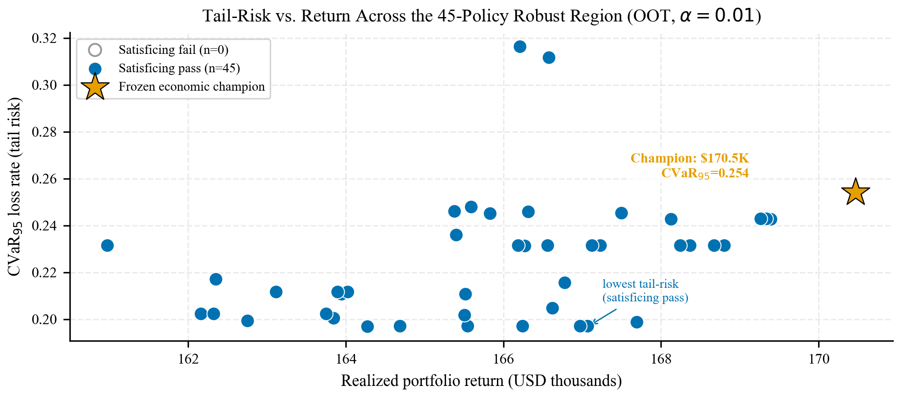
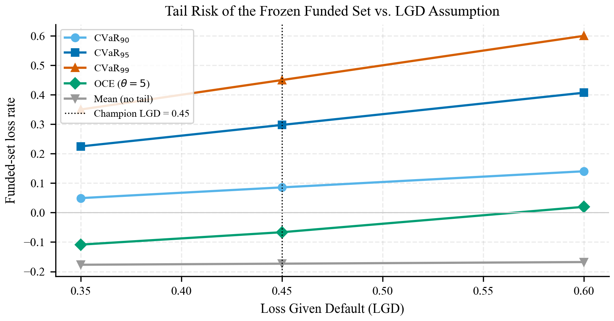
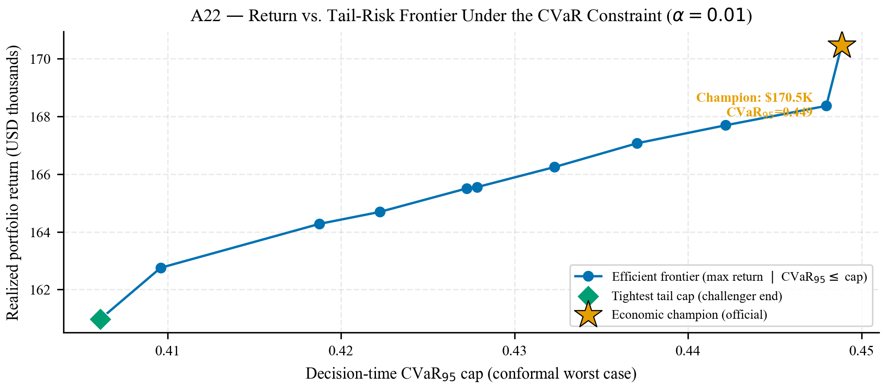
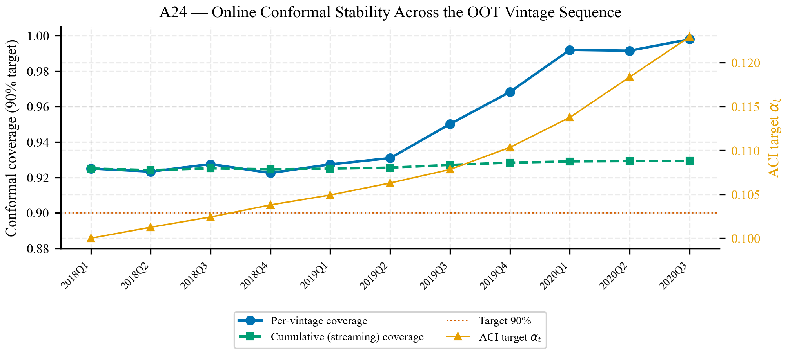

::: {.callout-note}
## Scope

This online supplement supports the IJDS submission body. It collects proof
details, robustness and external-replication tables A3--A39, reproducibility
commands, model-risk material, fairness diagnostics, and evidence lineage. It
does not introduce a hidden selection criterion or unreported claim family:
A35 is the declared finite-grid frontier consumed by the body, A36
is the regenerated funded-set grade audit for the selected body point,
and A37--A39 add selected-policy tail-risk, cluster-bound, and fixed-allocation
bootstrap diagnostics from the same selected allocation.
:::

The supplement is organized as a defense layer for the main manuscript rather
than as a second paper. Appendices A--C support the statistical and economic
claims, Appendix D records governance limits, Appendix E gives the reproduction
path, and Appendix F maps the anonymous submission files. Tables and figures are
included only when they either protect a body claim or prevent overreading of the
external and robustness evidence.

| Reader question | Where to go | What to remember |
|---|---|---|
| What is the theorem? | Appendix A | Markov under weighted funded-set validity is the body claim; stronger assumptions stay explicit. |
| Is the selected policy a singleton? | Appendix C, A35 | The frontier is finite-grid and exact, with denominators reported. |
| What does the selected policy fund? | Appendix C, A36--A39 | Composition, tail, concentration, and bootstrap are selected-allocation diagnostics. |
| Does the recipe travel? | Appendix C, A25--A34 | Prosper and Freddie/Mendeley are external economic recipe-transfer checks. |
| What can be reproduced? | Appendix E | Routine reproduction rebuilds paper surfaces from frozen evidence and excludes protected searches. |

: How to read the online supplement.

::: {.callout-important}
## Journal Strengthening Pack

Selected former P2/P3 ideas are included here when they can be evaluated from
frozen evidence: OCE/CVaR as a tail-risk diagnostic, robust satisficing as
committee-style margins, regret-auditability as the SPO+/CRPTO comparator, and
dependence-aware theory as a caveat/proposition. The multidataset layer is now
included as a frozen external economic replication on Prosper and Freddie/Mendeley:
it tests transfer of the CRPTO recipe without reopening the Lending Club
champion. Optimized OCE/CVaR objectives, full multi-distribution or online
conformal prediction, online DFL, causal CRPTO, multi-period portfolios,
production monitoring, and package extraction remain future work only.
:::

# Appendix A: Theoretical Details

The body states the CRPTO guarantee in operational terms. This appendix fixes
notation and records the exact boundary between the distribution-free claim and
the optional tightening arguments. The proof depends on Assumption 1 (weighted
funded-set validity) as a modeling premise for the selected allocation; Appendix
A does not turn the selected funded set into a universal conformal guarantee.

| Symbol | Meaning |
|---|---|
| `Y_i` | Observed default indicator or bounded loss proxy for loan `i`. |
| `p_hat_i` | Calibrated probability of default used by the decision layer. |
| `u_i(alpha)` | Upper conformal endpoint at miscoverage level `alpha`. |
| `x_i` | Funding decision or allocation weight. |
| `a_i` | Loan amount or exposure. |
| `w_i` | Normalized funded-set weight, `x_i a_i / sum_j x_j a_j`. |
| `gamma` | Robust-policy blend parameter in the optimization rule, `gamma in [0,1]`. |
| `p_tilde_i(alpha,gamma)` | Blended PD used by the optimizer, `p_hat_i + gamma (u_i - p_hat_i)`. |
| `tau` | Risk-tolerance cap the optimizer applies to the blended PD, `sum_i w_i p_tilde_i <= tau`. |
| `Gamma_CP` | Portfolio-level conformal risk metric after allocation: `sum_i w_i (u_i - p_hat_i)`, with clipping at one on the PD scale. |
| `B_u(alpha)` | Weighted upper-endpoint budget of the funded set, `sum_i w_i u_i(alpha)`; equals `tau + (1-gamma) Gamma_CP` when the cap binds. |
| `V(alpha)` | Weighted funded-set miscoverage quantity. |

Prose writes the conformal premium as $\Gamma_{\mathrm{CP}}$; tables sometimes
use the CSV label `Gamma_CP` so regenerated headers remain traceable.

For a fixed allocation, conformal coverage controls the expected interval miss
indicator under the stated exchangeability design. CRPTO converts loan-level
misses into the funded-set quantity `V(alpha)` using normalized exposure
weights. The expectation in Assumption 1 is over the exchangeable
calibration/test draw, conditional on the frozen recipe, declared partitions,
and allocation rule. The portfolio-level theorem assumes weighted funded-set
validity, `E[V(alpha)] <= alpha`, rather than claiming that marginal split
conformal automatically controls every adaptively selected subportfolio. A
Markov-style argument then gives the main conservative portfolio bound used in
the exact alpha-safe check.

## Proof of Theorem 1

The body states the result as Theorem 1 under Assumption 1 (weighted
funded-set validity). We record the full argument here.

**Setting.** The allocation $x$ is fixed before OOT labels are revealed.
Funded-set weights satisfy $w_i \geq 0$ and $\sum_i w_i = 1$. Outcomes and
endpoints live on the PD scale, $Y_i \in [0,1]$ and $u_i(\alpha) \in [0,1]$,
with miscoverage indicators $Z_i(\alpha) = \mathbf{1}\{Y_i > u_i(\alpha)\}$
and $V(\alpha) = \sum_i w_i Z_i(\alpha)$. Write
$B_u(\alpha) = \sum_i w_i u_i(\alpha)$ for the weighted upper-endpoint budget of
the funded set. The robust layer caps the $\gamma$-blended PD,
$\sum_i w_i \tilde p_i(\alpha,\gamma) \leq \tau$ with
$\tilde p_i = \hat p_i + \gamma(u_i(\alpha) - \hat p_i)$; the deterministic
identity below does not use this cap and holds for any allocation. Probabilities
and expectations are over the exchangeable calibration/test draw conditional on
the frozen recipe, partitions, and allocation rule.

**Step 1 (pointwise domination).** For every funded loan,

$$
Y_i \;\leq\; u_i(\alpha) + Z_i(\alpha).
$$

If $Z_i(\alpha) = 0$ then $Y_i \leq u_i(\alpha)$ by definition of the
indicator. If $Z_i(\alpha) = 1$ then $Y_i \leq 1 \leq u_i(\alpha) + 1$
because $u_i(\alpha) \geq 0$. Both cases give the displayed inequality.

**Step 2 (deterministic identity, Theorem 1(i)).** Taking the $w$-weighted
sum of Step 1,

$$
\sum_i w_i Y_i
  \;\leq\; \sum_i w_i u_i(\alpha) + \sum_i w_i Z_i(\alpha)
  \;=\; B_u(\alpha) + V(\alpha).
$$

This step uses no probability and no optimality: it is portfolio accounting,
valid for every realization, and it is exactly the identity verified by the
frozen exact funded-set audit.

**Step 3 (Markov, Theorem 1(ii)).** $V(\alpha)$ is a nonnegative random
variable under the stated draw, and Assumption 1 gives
$E[V(\alpha)] \leq \alpha$. Markov's
inequality yields, for every $t > 0$ [@ghosh2002],

$$
P\bigl(V(\alpha) \geq t\bigr) \;\leq\; \frac{E[V(\alpha)]}{t}
  \;\leq\; \frac{\alpha}{t}.
$$

**Step 4 (combination).** By Step 2, the event
$\{\sum_i w_i Y_i \geq B_u(\alpha) + t\}$ implies $\{V(\alpha) \geq t\}$, so

$$
P\!\left(\sum_i w_i Y_i \geq B_u(\alpha) + t\right) \;\leq\; \frac{\alpha}{t},
$$

and the choice $t = \sqrt{\alpha}$ gives the body statement:
the endpoint budget $B_u(\alpha)$ is exceeded by more than $\sqrt{\alpha}$ with
probability at most $\sqrt{\alpha}$. $\blacksquare$

**Policy-term decomposition.** The optimizer constrains the $\gamma$-blended PD,
not $B_u(\alpha)$ itself. Since
$\sum_i w_i \tilde p_i(\alpha,\gamma) = \sum_i w_i \hat p_i + \gamma\,\Gamma_{\mathrm{CP}}(\alpha)$
and $B_u(\alpha) = \sum_i w_i \hat p_i + \Gamma_{\mathrm{CP}}(\alpha)$, with
$\Gamma_{\mathrm{CP}}(\alpha) = \sum_i w_i\bigl(u_i(\alpha) - \hat p_i\bigr)$,

$$
B_u(\alpha) = \sum_i w_i \tilde p_i(\alpha,\gamma) + (1-\gamma)\,\Gamma_{\mathrm{CP}}(\alpha)
  \;\leq\; \tau + (1-\gamma)\,\Gamma_{\mathrm{CP}}(\alpha),
$$

with equality when the cap binds. The selected body point binds at
$\tau = 0.1715$ with $\gamma = 0.5475$ and
$\Gamma_{\mathrm{CP}}(0.01) = 0.162616$, so
$B_u(0.01) \leq 0.245084$ and the deterministic bound reads
$\sum_i w_i Y_i \leq 0.245084 + V(0.01) = 0.280434$. The exact audit reports
zero deterministic violation. The slack $(1-\gamma)\,\Gamma_{\mathrm{CP}}(\alpha)$ is
the part of the conformal premium the optimizer does not internalize at
$\gamma < 1$; setting $\gamma = 1$ recovers the tight endpoint cap
$B_u(\alpha) \leq \tau$.

On the promoted draw the realized weighted miscoverage is $V(0.01) = 0.035350$,
which *exceeds* the nominal $\alpha = 0.01$: the funded set under-covers relative
to the marginal conformal level (unweighted funded coverage `0.9427` at
alpha01 for the body point), as expected
for an adaptively selected subportfolio. The deterministic identity needs no
assumption and holds with wide margin; the probabilistic guarantee is therefore
read at the Markov level $V \leq \sqrt{\alpha} = 0.10$, which the realized $V$
clears, not at the nominal $\alpha$. This is why Assumption 1 is presented as a
modeling premise audited after selection, not as a property the single frozen
draw establishes. The under-coverage is structural, not a calibration-draw
effect: with $n_{\mathrm{cal}} = 237{,}584$ calibration loans, the split-conformal
conditional-coverage result [@vovk2005; @angelopoulos2023] makes the marginal
coverage Beta-distributed about $1 - \alpha$ with standard deviation
$\sqrt{\alpha(1-\alpha)/n_{\mathrm{cal}}} \approx 0.0002$ at $\alpha = 0.01$, so the
endpoints (hence $\Gamma_{\mathrm{CP}}$ and $B_u$) are essentially invariant to the
calibration draw and the residual $V$ variability is test-side and
portfolio-selection driven. A36 regenerates the row-level funded-set grade audit
from the selected allocation. A37 reprices the same selected allocation
under LGD-sensitive CVaR/OCE tail summaries, and A38 recomputes the
concentration-sensitive cluster-bound thresholds from the selected funded
weights. A39 bootstraps funded-loan contributions under the fixed final
allocation. This is an empirical interval diagnostic, not a conformal guarantee,
and it does not resample solver inputs, the PD model, calibration data, or the
policy search.

These steps leave a clean split. Theorem 1 proves the operational bound under
Assumption 1. Proposition A.1 below shows that Markov is the sharp
first-moment statement when no additional structure is asserted. Proposition
A.2 asks the next natural question: if the funded set is grouped by period,
grade, or period-grade, and dependence is allowed inside each group, what would
independence across groups buy? That cross-cluster assumption is plausible only
as an additional sensitivity condition, not as a theorem premise quietly added
to the body.

The phrase "exact funded-set certificate" has a narrow meaning throughout the
paper. It is an exact accounting audit on the frozen out-of-time funded set:
given the selected allocation weights, observed outcomes, calibrated PD values,
and conformal upper endpoints, the audit computes `V(alpha)`,
`Gamma_CP(alpha)`, and violation directly on the funded loans. It is not a new
distribution-free theorem for arbitrary adaptive portfolios and it is not an
external-dataset certificate. Its statistical interpretation still requires the
weighted funded-set validity assumption in the body; its value is that the
promoted decision is not supported by a proxy metric, a graph, or a manually
transcribed table.

| Certificate object | Computed from | What it supports | What it does not support |
|---|---|---|---|
| Exact funded-set audit | Frozen Lending Club OOT funded loans, allocations, labels, `p_hat`, and `u_i(alpha)`. | Body point `V(0.01)=0.035350`, `Gamma_CP=0.162616`, Markov cap `0.345084`, zero violation, and `8/8` alpha-grid pass. | Universal conditional coverage or live adaptive control. |
| Finite-grid frontier | 51,678 raw rows consolidated into 50,010 deduplicated semantic policies. | 27,508 all-alpha above-floor policies; terminal endpoint search `37,068/37,068` all-alpha passers. | A claim about all continuous policy values or future searches. |
| External exhaustiveness audit | Prosper all-candidate and Freddie capped/all-candidate LP solves. | The reported external LP values are not shortlist effects. | New exact funded-set certificates for Prosper or Freddie. |

: Certificate taxonomy used in the paper.

## Finite-Grid Frontier Closure (A35)

The frontier closure replaces single-policy reporting with a declared finite-grid
frontier. The declared return floor `$170,464.54` is the realized return of the
previously certified bound-aware allocation on the frozen upstream chain; the
frontier re-evaluates a pre-declared finite policy grid deterministically over
the *same* frozen PD model outputs and Mondrian conformal intervals, so promoting
the body point regenerates no upstream model, calibrator, or interval. The consolidated frontier file
deduplicates 51,678 raw rows into 50,010
semantic policies; 27,508 policies both pass the declared alpha grid and exceed
the return floor. The terminal endpoint run evaluates 37,068 policies and
296,544 exact alpha checks, with 37,068/37,068 all-alpha passers. The alpha grid
is fixed at
`{0.01, 0.03, 0.05, 0.07, 0.10, 0.12, 0.15, 0.20}`.

| Role | Return | Gamma_CP | V | Markov cap | Alpha pass |
|---|---:|---:|---:|---:|:---:|
| Minimum Markov-cap endpoint | `$170,467.27` | `0.095719` | `0.031875` | `0.273036` | `8/8` |
| Low-cap balanced endpoint | `$171,006.20` | `0.097190` | `0.031875` | `0.274789` | `8/8` |
| Highest return under cap <= `0.30` | `$173,314.04` | `0.115400` | `0.035875` | `0.294580` | `8/8` |
| Strict cap <= `0.345` body proxy | `$184,800.41` | `0.162562` | `0.035350` | `0.344996` | `8/8` |
| Body/default balanced point | `$184,832.48` | `0.162616` | `0.035350` | `0.345084` | `8/8` |
| Highest return under cap <= `0.36` | `$186,050.73` | `0.174600` | `0.037750` | `0.358685` | `8/8` |
| Max-return economic endpoint | `$223,458.14` | `0.457438` | `0.069575` | `0.510753` | `8/8` |

: Finite-grid return-bound frontier (A35). Source file:
`reports/crpto/tables/crpto_tableA35_pool93_ijds_frontier.csv`.

## Sharpness of the Distribution-Free Bound

The body keeps Markov as the headline because it is the distribution-free
first-moment statement under Assumption 1. Earlier concentration tables remain
useful as a diagnostic recipe, but they depend on the funded-loan exposure
weights of the selected allocation. After the selected-policy promotion, the paper-facing
certificate is therefore A35 plus the exact funded-set audit, with A38 providing
the regenerated cluster-bound sensitivity and A39 closing the
fixed-allocation bootstrap diagnostic. A38 confirms that the
period-grade partition has the smallest cluster-aware Hoeffding threshold among
the reported partitions, but it is still looser than Markov at the paper
threshold. The body therefore keeps the first-moment Markov statement rather
than adding unverified cross-cluster independence to the theorem.

Table A21c extends the same audit to one-sided Cantelli, Bennett and Freedman
variants [@cantelli1929; @bennett1962; @freedman1975]. At `alpha = 0.01`,
weak-variance Cantelli gives `t = 0.0661`, Bennett gives `t = 0.0722`, and
Bernstein/Freedman give `t = 0.0852` under the weaker weighted-validity variance
proxy; the stronger individual-alpha variance mode is sharper but requires an
assumption we do not assert in the theorem.

The menu also contains the row that justifies the body's choice, which we
state as a formal optimality result rather than a stylistic preference.

**Proposition A.1 (Markov-optimality under Assumption 1 alone).**
Let $V(\alpha) \in [0,1]$ satisfy only Assumption 1, $E[V(\alpha)] \le \alpha$,
with no further independence, correlation, or variance structure. Then for the
one-sided deviation event $\{V(\alpha) \ge t\}$ at the interpretability level
$\delta = \sqrt{\alpha}$, Markov's threshold $t_{\mathrm M} = \sqrt{\alpha}$
cannot be improved by any second-moment argument: the variance compatible with
Assumption 1 is at most $\sigma^2 \le \alpha(1-\alpha)$ (attained by a
Bernoulli$(\alpha)$ miscoverage profile), and the sharp one-sided Chebyshev
(Cantelli) threshold under that worst-case variance is
$t_{\mathrm C} = \alpha + 3\sigma = \alpha + 3\sqrt{\alpha(1-\alpha)} > \sqrt{\alpha}$
for $\alpha \le 0.01$ (numerically $t_{\mathrm C}=0.3085 > 0.1000 = t_{\mathrm M}$).

*Proof.* Cantelli gives $P(V \ge E[V] + k) \le \sigma^2/(\sigma^2 + k^2)$.
Setting the right side to $\delta = \sqrt{\alpha}$ and $E[V] = \alpha$ yields
$k = \sigma\sqrt{(1-\delta)/\delta}$, so
$t_{\mathrm C} = \alpha + \sigma\sqrt{(1-\sqrt\alpha)/\sqrt\alpha}$. At
$\alpha = 0.01$ this is $\sigma\sqrt{9} = 3\sigma$ above $\alpha$, i.e.
$0.01 + 3(0.0995) = 0.3085$, which exceeds $t_{\mathrm M}=\sqrt{0.01}=0.1$.
$\blacksquare$

The reading is that Markov is **not** a conservative placeholder in the body;
it is the optimal first-moment statement for the guarantee Theorem 1 actually
asserts. Every sharper row in the menu prices a specific additional assumption
(loan independence, conditional variance, or a martingale protocol), and the
selected body point clears the stated Markov check with
`V = 0.035350 <= 0.100000`.

Bennett is the closest match to the finite funded-set calculation because it
was designed for independent, non-identically distributed summands using only
the variance of the sum and component bounds. Freedman is included only as the
martingale analogue of Bernstein: it would become relevant under a pre-declared
sequential validation protocol with bounded increments and a
conditional-variance process, which is stronger than the frozen replay used
here.

The table's role is assumption pricing. The sharper rows show what a reviewer
would gain by accepting independence, variance, or martingale structure; they
are not promoted because the body theorem asserts only Assumption 1. Chebyshev
is omitted because one-sided Cantelli dominates it for this event; Azuma is
omitted because it duplicates Hoeffding numerically while adding a sequential
protocol assumption; Chernoff is omitted because its sharp threshold requires
individual miss probabilities bounded by `alpha`; and a naive union-Markov
correction over the finite policy frontier is vacuous at the paper alphas. The
tables are regenerated by
`scripts/build_concentration_bound_table.py` and
`scripts/build_bound_tightening_audit.py` from frozen funded-set weights.

## Cluster-Aware Conditional Tightening

Let clusters $g = 1,\ldots,G$ represent period, grade, or period-grade cells,
and define

$$
Z_g(\alpha)=\sum_{i\in g} w_i\mathbf{1}\{Y_i>u_i(\alpha)\},\qquad
W_g=\sum_{i\in g}w_i .
$$

Within each cluster, defaults and conformal misses may be arbitrarily
dependent. The useful structure, if one is willing to assert it, is
cross-cluster independence after conditioning on the calibration sample and the
fixed funded allocation. Among the three reported partitions, period-grade is
the most defensible compromise for a temporal credit panel: it separates
calendar cohorts while conditioning on risk grade. Period alone ignores grade
mix, and grade alone cuts across calendar dependence.

**Proposition A.2 (cluster-aware Hoeffding under cross-cluster independence).**
Let $\mathcal F$ contain the calibration sample, the frozen conformal recipe,
the declared cluster partition, and the selected funded allocation. Suppose
that, conditional on $\mathcal F$, the cluster aggregates
$Z_1(\alpha),\ldots,Z_G(\alpha)$ are independent, satisfy
$0\le Z_g(\alpha)\le W_g$, and obey conditional weighted validity
$\sum_g E[Z_g(\alpha)\mid\mathcal F]\le\alpha$ (for example, it is sufficient
that $E[Z_g(\alpha)\mid\mathcal F]\le\alpha W_g$ for every cluster). Then, for
every $\delta\in(0,1)$,

$$
P\!\left(
  V(\alpha)\ge
  \alpha + \sqrt{\frac{1}{2}\left(\sum_g W_g^2\right)\log\frac{1}{\delta}}
  \;\middle|\;\mathcal F
\right)\le\delta .
$$

*Proof.* Let $\mu=\sum_g E[Z_g(\alpha)\mid\mathcal F]\le\alpha$ and
$S_2=\sum_g W_g^2$. Hoeffding's inequality for independent bounded summands
gives

$$
P\{V(\alpha)-\mu\ge s\mid\mathcal F\}\le \exp(-2s^2/S_2).
$$

Taking $s=\sqrt{S_2\log(1/\delta)/2}$ and using $\mu\le\alpha$ gives the
displayed bound. Integrating over $\mathcal F$ gives the same unconditional
statement. $\blacksquare$

Proposition A.2 is therefore the natural complement to Proposition A.1. Under
Assumption 1 alone, A.1 shows why Markov is the sharp distribution-free claim;
under an explicit cross-cluster structure, A.2 shows exactly when a
Hoeffding-style tightening becomes available [@hoeffding1963;
@boucheron2013concentration]. At the paper level $\alpha=0.01$ with matched
tail probability $\delta=\sqrt{\alpha}=0.10$, the cluster-aware threshold is
tighter than Markov only if $\sum_g W_g^2<0.0070$. The frozen funded set is much
more concentrated: period, grade, and period-grade partitions have
$\sum_g W_g^2=0.2407$, $0.3572$, and $0.0914$, respectively, so the corresponding
thresholds are `0.5365`, `0.6512`, and `0.3344`, all looser than Markov's
`0.1000`. This proposition does not replace the main theorem; it names the
extra structure a reviewer would have to accept and makes the empirical
concentration cost transparent in A21.

# Appendix B: P1 Evidence

The first evidence block asks whether the selected policy is a fragile point
estimate. Tables A3--A11 are generated from frozen or derived evidence files and
should be read as post-selection audit evidence rather than as a new selection
protocol.

| Table | Role | Current-paper use |
|---|---|---|
| A3 nested holdout | Documents the 5K -> 25K -> 276K validation chain. | Appendix evidence against post-selection overclaiming. |
| A4 segment-period sensitivity | Checks coverage and funded-set quantities by period and grade. | Appendix robustness. |
| A5 decision-aware selector | Summarizes the CROMS-style screen across conformal candidates. | Method-defense appendix, not new training. |
| A6 synthetic shift | Stresses coverage under controlled covariate perturbations. | Robustness appendix. |
| A7 funded-set loan export | Provides row-level funded-set auditability. | Supplement only. |
| A8 funded-set composition | Summarizes grade, amount, and risk mix. | Appendix robustness. |
| A9 strict temporal holdout | Separates confirmation evidence from earlier selection decisions. | Strong appendix evidence. |
| A10 finalist exact bound evaluation | Shows exact alpha checks for conformal finalists. | Defends rank-1 selection. |
| A11 enhanced synthetic shift | Extends stress around the promoted policy. | Robustness appendix. |

These tables support the current claim that the promoted decision is not a
fragile single point. They do not turn the current paper into a new
prospective selection protocol. A fully pre-declared prospective protocol is
future journal hardening.

# Appendix C: Journal Robustness Package

Tables A12--A39 answer likely reviewer questions that are too detailed for the
25-page body. The block structure is deliberate: A12--A18 report tail, margin
and policy-family diagnostics; A19 isolates regret-auditability; A20--A24 stress
tail, dependence, multi-distribution and online interpretations; A25--A34 test
external recipe transfer; and A35--A39 close the selected-policy frontier,
composition, tail, concentration and uncertainty profile. A35 is the active
frontier consumed by the body, A36 is the selected-policy funded-set
grade audit, A37 is the selected-policy tail-risk repricing, A38 is the
selected-policy cluster-bound audit, and A39 is the selected-policy
fixed-allocation bootstrap audit. A12--A34 are diagnostic by design, except A19
also supports the body framing around regret-auditability and A25--A34 support
the external-replication defense.
A20--A34 are journal-only add-ons: A20 audits tail-risk trade-offs as a
diagnostic package; A21 makes the dependence-aware caveat numerical; A22 turns
the tail-risk diagnostic into an *active CVaR/OCE selection constraint* (a
labeled challenger, not a new promoted policy); A23--A24 stress
multi-distribution coverage and online (ACI) stability on the frozen conformal
intervals; A25--A34 cover the external economic layer by testing the same frozen
recipe and adding the cross-dataset price-of-robustness scaling readout. Table
A12 follows the standard
definitions of Conditional
Value-at-Risk [@rockafellar2000cvar] and the Optimized Certainty Equivalent
[@bental2007oce], and the non-monotonic risk-control framing behind A22 follows
[@angelopoulos2026nonmonotonic]; all are reported as post-hoc summaries of the
frozen funded set or intervals, never as a re-promoted champion.

| Evidence block | Paper status | Why it is here |
|---|---|---|
| A35 finite-grid frontier | Promoted body evidence | It is the active return-bound decision surface. |
| A36--A39 selected-policy audits | Support evidence | They describe the selected allocation without changing the selector. |
| A19 regret-auditability | Support evidence | It answers the SPO+/DFL baseline objection. |
| A25--A34 external recipe transfer | Support evidence | It answers the single-dataset objection without new certificates. |
| A20--A24 tail/source/online diagnostics | Diagnostic evidence | They price assumptions and future-work lanes without promoting new guarantees. |

: Promoted, support, and diagnostic evidence hierarchy.

| Table | Role | Scope caveat |
|---|---|---|
| A12 tail-risk OCE/CVaR diagnostics | Reprices the funded set under tail-risk summaries. | Diagnostic only; OCE/CVaR is not the optimized objective. |
| A13 satisficing margins | Expresses return, `V`, `Gamma_CP`, violation, and frontier pass as margins. | Thresholds are explanatory, not a new policy selector. |
| A14 dependency cluster diagnostics | Documents period/grade concentration for the tightening caveat. | Does not prove independence. |
| A15 leave-one-period stress | Reweights the funded set by leaving periods out. | Descriptive stress, not re-optimization. |
| A16 bootstrap funded-set metrics | Adds empirical intervals for return, defaults, `V`, and misses. | Bootstrap interval, not conformal guarantee. |
| A17 budget/LGD/cap sensitivity | Varies operating assumptions. | Segment caps are diagnostics, not solver constraints. |
| A18 policy-family robustness surface | Summarizes alpha-safe policies by bound-aware family. | Compatible leaderboard only inside the final family; A35 is the selected frontier. |
| A19 regret-auditability frontier | Compares two-stage, SPO+, and CRPTO robust on regret versus risk-control checks. | Comparator framing, not a new champion selector. |
| A20 tail-risk diagnostic audit | Ranks tail-risk alternatives by CVaR, OCE, return, and satisficing status on the legacy diagnostic surface. | Journal diagnostic machinery; A37 is the selected-allocation tail repricing. |
| A21 cluster-bound tightening | Reports cluster-aware Hoeffding thresholds by period, grade, and period-grade. | Transparent caveat; not tighter than Markov for the observed exposure concentration. |
| A22 tail-constrained re-optimization | Selects the max-return policy under a decision-time CVaR cap computed from conformal upper endpoints, tracing the return-vs-CVaR frontier. | CVaR/OCE as an active selection constraint; reports a tail-constrained challenger, not a new promoted policy. |
| A23 multi-distribution robustness | Worst-case 90% coverage by grade and grade x vintage cell on the frozen intervals. | Read-only diagnostic; the worst fine cell motivates MDCP/group-weighted as future work. |
| A24 online conformal stability | Per-vintage and cumulative coverage plus the Gibbs-Candes ACI target trajectory over the OOT vintage sequence. | Static-OOT online-control diagnostic, not a streaming validation. |
| A25 external replication gate | Applies the frozen CRPTO scoring/conformal/LP recipe to Prosper final-status loans and Freddie/Mendeley FM48. | External economic replication; not a Lending Club champion rerun and not a new exact theorem. |
| A26 external candidate sensitivity | Checks whether the robust LP objective is stable as the OOT candidate pool grows. | Candidate-pool audit; supports the claim that reported objectives are not a tiny shortlist effect. |
| A27 Freddie horizon sensitivity | Audits Freddie/Mendeley default windows and red/green groups before selecting FM48 for the external table. | Dataset-selection audit; FM48 is promoted because it clears both coverage gates and keeps positive robust LP value. |
| A28 external LP exhaustiveness | Solves Prosper all-candidate LP and Freddie caps `500k`, `1M`, and `all`. | Exhaustiveness audit; the Freddie all-candidate optimum matches the screened optimum. |
| A29 Freddie sparse Mondrian audit | Splits Freddie coverage by all groups, eligible groups, and sparse fallback groups. | Documents sparse cells; does not claim perfect conditional coverage in every tiny group. |
| A30 external metric intervals | Adds uncertainty intervals for AUC, coverage, alpha coverage, and robust objective. | Bootstrap for funded-loan contribution only; it does not resample solver inputs. |
| A31 external OOT subperiod metrics | Breaks Prosper by OOT year and Freddie by OOT quarter. | Subperiod audit; Freddie 2015Q4 alpha coverage is just below 99%. |
| A32 Prosper default-definition sensitivity | Repeats Prosper under main, defaulted-only, and chargedoff-only labels. | Default semantics audit; all three variants pass the global gates. |
| A33 Freddie segment sensitivity | Repeats Freddie FM48 for red, green, and combined groups. | Segment audit; green and combined pass alpha01, red remains a documented caveat. |
| A34 cross-dataset price of robustness | Orders the frozen external applications (Freddie green/combined/red and Prosper) by panel default rate and reports the signed price of robustness. | Positive premium under blind external application, ordered by panel default risk across four frozen external applications. |
| A35 finite-grid frontier | Declares the promoted return-bound frontier and selected body point. | Exact finite-grid policy surface, not a continuous-region optimum. |
| A36 funded-set grade audit | Regenerates the selected body allocation at `alpha = 0.01` and summarizes funded exposure by grade bucket. | Composition evidence for the selected body point, not a fairness or protected-class audit. |
| A37 selected-policy tail-risk repricing | Reprices the selected body allocation under LGD alternatives, CVaR, OCE, and decision-time tail loss. | Diagnostic risk profile of the selected point; OCE/CVaR is not the optimized objective. |
| A38 selected-policy cluster-bound audit | Recomputes period, grade, period-grade, and score-vintage concentration thresholds from selected funded weights. | Sensitivity under extra cross-cluster assumptions; Markov remains the body-level bound. |
| A39 fixed-allocation bootstrap audit | Bootstraps funded-loan contributions under the selected body allocation. | Empirical contribution interval only; solver inputs, model, calibration, and policy search are not resampled. |

## External Multi-Dataset Replication

The external layer addresses the most natural single-dataset criticism without
changing the Lending Club frontier claim. Prosper final-status loans provide a
second P2P-style consumer-credit panel with direct investment fields
[@prosperLoanData]. Freddie/Mendeley FM48 provides a mortgage-credit panel built
from Freddie Mac loan-level performance data with train/OOS/OOT splits and
multiple default windows [@freddieMacSfLoanLevel; @mushava2023classimbalance].
Home Credit was audited as a scoring/conformal source [@homeCreditDefaultRisk]
but is not promoted because it lacks a clean `exposure + return` investment
contract comparable to Lending Club, Prosper, or Freddie.

| Dataset | Rows | Default | AUC | Cov. 90% | Cov. alpha01 | OOT cand. | Robust LP |
|---|---:|---:|---:|---:|---:|---:|---:|
| Prosper final-status | `54,807` | `30.92%` | `0.7074` | `0.9205` | `0.9943` | `10,531` | `$199,419` |
| Freddie/Mendeley FM48 | `3,173,355` | `1.45%` | `0.7839` | `0.9745` | `0.9907` | `1,396,053` | `$1,291,228` |

: A25. External replication gate on the two reported economic datasets. The
source CSV is `reports/crpto/tables/crpto_tableA25_external_replication_gate.csv`.

{#fig-supp-external-replication width="88%" fig-alt="Bar chart comparing Prosper final-status and Freddie FM48 on coverage 90 percent, alpha 0.01 coverage, AUC and robust LP objective."}

Table A26 checks whether the reported external robust objectives depend on an
artificially tiny candidate pool. Prosper reaches the same robust LP objective
using all `10,531` OOT candidates. Freddie remains stable at `$1,291,228` from
the top-`50,000` through top-`250,000` candidate pools, while random pools improve
monotonically with larger caps and stay below the top-return screen. A28 then
removes the remaining shortlist concern by solving Freddie on `500,000`,
`1,000,000`, and all `1,396,053` OOT candidates; the robust and nonrobust
objectives are identical across those three solves.

{#fig-supp-external-candidate-sensitivity width="88%" fig-alt="Line chart of robust LP objective by candidate cap and sampling mode for Prosper and Freddie external replications."}

{#fig-supp-freddie-all-candidate width="88%" fig-alt="Two-panel Freddie FM48 audit showing unchanged robust and nonrobust objectives across 500k, 1M, and all candidates, plus a log-scale comparison of all OOT candidates and worst funded rank."}

| Dataset | Candidate cap | Candidates solved | Robust LP objective | Nonrobust LP objective | Funded loans | Worst funded rank |
|---|---:|---:|---:|---:|---:|---:|
| Prosper | all | `10,531` | `$199,419` | `$220,260` | `234` | `508` |
| Freddie FM48 | `500,000` | `500,000` | `$1,291,228` | `$1,305,409` | `143` | `551` |
| Freddie FM48 | `1,000,000` | `1,000,000` | `$1,291,228` | `$1,305,409` | `143` | `551` |
| Freddie FM48 | all | `1,396,053` | `$1,291,228` | `$1,305,409` | `143` | `551` |

: A28. External LP exhaustiveness. The Freddie all-candidate run funds zero
loans outside the top-250,000 screen and therefore converts the former cap
caveat into an auditable dominance certificate.

Table A27 documents why Freddie/Mendeley FM48 is the reported mortgage
replication. FM24 and FM36 are informative but miss one of the promoted gates;
FM60 keeps high 90% coverage but falls short at alpha = 0.01. FM48 is the only
Freddie horizon that clears the two conformal gates while preserving positive
economic robust value. This is a dataset-level selection audit, not a new search
over the Lending Club frontier.

A29--A33 record the extended multidataset audit layer. The most important caveat
is Freddie's sparse Mondrian behavior: across all `29` Freddie groups, tiny
groups with only `43` OOT rows drive a minimum reported coverage of `0.5`.
After requiring at least `500` calibration+test rows per group, `25` eligible
groups cover `1,396,010` OOT rows and the minimum 90% coverage rises to
`0.8854`; this is close to, but still below, the nominal 90% threshold. The
paper therefore claims global external coverage and reports group diagnostics,
not perfect conditional validity in every sparse mortgage cell.

| Audit | Main finding | Caveat |
|---|---|---|
| A29 sparse groups | Eligible Freddie groups cover `1,396,010 / 1,396,053` OOT rows; sparse groups contain only `43` OOT rows. | Minimum eligible 90% coverage is `0.8854`, so this remains diagnostic. |
| A30 intervals | Prosper AUC `0.7073` CI `[0.6956, 0.7190]`; Freddie AUC `0.7839` CI `[0.7799, 0.7878]`. | Robust-objective interval bootstraps funded-loan contributions only. |
| A31 subperiods | Prosper 2012 and 2013 both pass alpha coverage; Freddie quarters keep 90% coverage above target. | Freddie 2015Q4 alpha01 coverage is `0.9896`, just below 99%. |
| A32 Prosper defaults | Main, defaulted-only, and chargedoff-only definitions all pass 90% and alpha01 gates with positive all-candidate robust LP. | Default semantics change default rate and robust objective, so the main status definition remains declared. |
| A33 Freddie segments | Combined FM48 and green pass alpha01; all segment LPs are solved on all candidates with positive robust value. | Red passes 90% coverage but alpha01 is `0.9850`, so it is sensitivity evidence, not a promoted standalone claim. |

## Cross-Dataset Price of Robustness

A34 turns the external layer into a positive economic finding rather than a
defensive gate. Using the signed convention
$(\text{nonrobust}-\text{robust})/\text{nonrobust}$, the price of robustness is a
*positive* premium on every frozen external application and
increases with the panel default rate across the cases evaluated. This is a
pattern across two datasets (three Freddie default-window segments plus Prosper),
not a scaling law: four points are consistent with the mechanism but cannot
establish a general relationship.

| Frozen application | Panel default rate | AUC | Price of robustness |
|---|---:|---:|---:|
| Freddie FM48 (green) | `0.58%` | `0.700` | `+1.00%` |
| Freddie FM48 (combined) | `1.45%` | `0.784` | `+1.09%` |
| Freddie FM48 (red) | `2.97%` | `0.700` | `+2.37%` |
| Prosper final-status | `30.92%` | `0.707` | `+9.46%` |

: A34. Price of robustness by frozen application, ordered by panel default rate.
The source CSV is
`reports/crpto/tables/crpto_tableA34_price_of_robustness_cross_dataset.csv`.

{#fig-supp-price-scaling width="82%" fig-alt="Line chart on a log-scale x-axis showing the external price of robustness rising from +1.00 percent to +9.46 percent as the panel default rate increases."}

Two readings matter. First, the premium tracks irreducible default risk, not
discrimination: the green and red Freddie segments have nearly identical AUC but
different premiums, while their default rates differ by roughly a factor of five.
Higher default risk widens the conformal intervals, so the robust worst case
discounts more economic return. Second, the Lending Club body claim is not read
through this external price table; it is read through the exact A35
return-bound frontier. The measured headline is therefore narrow: in these
frozen external applications, the conformal robust layer costs at most a
low-double-digit premium, and CRPTO measures which regime a given panel is in.

## Reviewer Claim Checks

The table below links the paper's main claims to the evidence surface and
guardrails a reviewer can inspect. The point is not to add another result, but
to make the audit path explicit.

| Claim | Evidence | Artifact | Test or guardrail |
|---|---|---|---|
| The predictive input is a frozen calibrated PD model, not a refreshed leaderboard model. | AUC, Brier, ECE, temporal backtesting, and calibration diagnostics. | `models/pd_canonical.cbm`, `models/pd_canonical_calibrator.pkl`, paper-facing metric tables. | `EXTRACTION_MANIFEST.json` and champion validation hashes. |
| The conformal layer gives conservative OOT uncertainty on the PD scale. | 90% and 95% coverage, minimum group coverage, and grade/decile audits. | `data/processed/conformal_intervals_mondrian.parquet`. | Conformal validation status and regression tests that check metric consistency across surfaces. |
| The promoted funded set passes the exact safety bound `V <= sqrt(alpha)` (not nominal alpha-coverage). | Body point `V(alpha = 0.01) = 0.035350` (above alpha), `Gamma_CP = 0.162616`, Markov cap `0.345084`, zero violation, `8/8` alpha pass. | A35, A36, exact bound-evaluation parquet, consolidated frontier/governance JSON. | Exact-evaluation file and regression tests. |
| The result is not an isolated lucky policy. | The consolidated frontier has 50,010 deduplicated semantic policies and 27,508 all-alpha above-floor policies; terminal endpoint search has 37,068/37,068 all-alpha passers. | Table A35 and governance files. | Protected search/evaluation split; no continuous-region claim. |
| The supplement strengthens interpretation without moving the body claim. | A20--A34 challenger, dependence, tail-risk, multi-distribution, online, and external-replication diagnostics; A35 is the active frontier; A36--A39 are selected-allocation audits. | Journal robustness tables, Figures 15--25, A35--A39. | Scope caveats in each table; A37--A39 are risk-profile audits, not hidden champion selectors. |
| The frozen PD binary is a faithful paper model. | E3/E4 T1 diagnostics show negligible seed-level discrimination movement and stable expanding-window validation. | `docs/refactor/SENSITIVITY_RUN_DESIGN_2026-06.md` and Appendix E summary. | Non-promoted diagnostics only; they do not replace the champion or become routine reproduction steps. |
| The manuscript is reproducible from frozen evidence. | Tables, figures, Quarto pages, and status reports regenerate from frozen inputs. | Repository code, DVC metadata, rendered book/paper outputs. | Pre-push test and lint hooks, DVC status checks, and manifest validation before release. |

## Funded-Set Audit Card Status

The selected body point has an exact aggregate funded-set audit at
`alpha = 0.01`:

| Quantity | Value |
|---|---:|
| Funded rows at alpha01 | `314` |
| Allocated budget | `$1,000,000` |
| Realized return | `$184,832.48` |
| Weighted true default/loss proxy | `0.035350` |
| Weighted miscoverage `V` | `0.035350` |
| Funded empirical coverage | `0.9427` |
| `Gamma_CP` | `0.162616` |
| Endpoint budget upper | `0.245084` |
| Markov cap | `0.345084` |
| Exact violation | `0.000000` |

A36 regenerates the row-level funded-set audit from the selected body
allocation and closes the composition card for the live manuscript claim. The
source file is
`reports/crpto/tables/crpto_tableA36_pool93_body_funded_grade_audit.csv`.

| Grade bucket | Funded rows | Exposure share | Default rate | $V$ contribution | Mean $u_i(0.01)$ |
|---|---:|---:|---:|---:|---:|
| A-B | `2` | `0.51%` | `0.00%` | `0.00000` | `0.11070` |
| C | `85` | `28.71%` | `3.53%` | `0.00495` | `0.14456` |
| D | `174` | `59.43%` | `7.47%` | `0.02690` | `0.26042` |
| E-G | `53` | `11.35%` | `3.77%` | `0.00350` | `0.34866` |

On a binary default outcome the metric has an exact reading worth stating. A
non-default cannot miss (`y_i = 0 <= u_i`), so `V` counts only funded defaults
whose conformal endpoint does not reach the PD ceiling `u_i = 1`. The conformal
layer's role at the tight `alpha` is to inflate the worst endpoints toward one,
and `V` measures the residual default mass the endpoints did not absorb. This is
why `V` tracks the
funded default rate and exceeds `alpha = 0.01` -- a return-seeking funded set has
a base default rate well above `1%` -- and why no reweighting of the calibration
(group-weighted, localized, or multi-distribution) can drive `V` to the nominal
`alpha` without capping most funded defaults at `u_i = 1`, which would void
`Gamma_CP` and the economics. The honest guarantee is therefore the
`sqrt(alpha)` level, with the deterministic identity holding exactly.

A37 closes the tail-risk repricing caveat for the selected allocation.
At the baseline `LGD = 0.45`, the selected body point has realized return
`$184,832.48`, weighted default rate `0.035350`, realized CVaR95 loss rate
`0.276211`, and decision-time CVaR95 loss rate `0.218140`. Under the reported
LGD sensitivity grid, repriced return ranges from `$188,367.48` at `LGD = 0.35`
to `$179,529.98` at `LGD = 0.60`. These quantities profile the selected
policy's tail exposure; they do not change the body selector, which is still
the finite-grid return-bound point in A35.

| LGD | Repriced return | Realized CVaR95 | Decision-time CVaR95 | OCE theta5 realized | Markov cap |
|---:|---:|---:|---:|---:|---:|
| `0.35` | `$188,367.48` | `0.205511` | `0.149497` | `-0.118852` | `0.345084` |
| `0.45` | `$184,832.48` | `0.276211` | `0.218140` | `-0.075978` | `0.345084` |
| `0.60` | `$179,529.98` | `0.382261` | `0.321104` | `0.011384` | `0.345084` |

: A37. Selected body-point tail-risk repricing from
`reports/crpto/tables/crpto_tableA37_pool93_body_tail_risk.csv`.

A38 closes the corresponding cluster-bound caveat. At `alpha = 0.01` and
`delta = 0.10`, Markov's body threshold is `0.100000`. The tightest regenerated
cluster-aware Hoeffding threshold is period-grade at `0.281247`; period
(`0.395502`), score-vintage (`0.348546`), and grade bucket (`0.728588`) are also
looser than Markov. The empirical result supports the theorem boundary rather
than weakening it: sharper concentration language would require a less
concentrated funded set or extra assumptions not asserted by the body.

| Cluster partition | Clusters | Max exposure share | Sum exposure squared | Hoeffding threshold | Tighter than Markov |
|---|---:|---:|---:|---:|:---:|
| period | `11` | `0.185295` | `0.129083` | `0.395502` | `False` |
| grade bucket | `4` | `0.594275` | `0.448512` | `0.728588` | `False` |
| period-grade | `27` | `0.119550` | `0.063907` | `0.281247` | `False` |
| score-vintage | `20` | `0.165295` | `0.099552` | `0.348546` | `False` |

: A38. Selected body-point cluster-bound audit from
`reports/crpto/tables/crpto_tableA38_pool93_body_cluster_bound_audit.csv`.

A39 closes the final bootstrap diagnostic under the selected allocation.
It resamples funded-loan contributions for the fixed body point (`5,000` draws,
seed `20260702`). The interval is deliberately narrower in scope than a new
statistical guarantee: it does not resample solver inputs, the PD model,
calibration data, conformal intervals, or the finite policy search.

| Metric | Observed | Bootstrap mean | 2.5% | Median | 97.5% |
|---|---:|---:|---:|---:|---:|
| Return, LGD `0.45` | `$184,832.48` | `$184,623.11` | `$167,963.20` | `$185,098.41` | `$198,650.47` |
| Weighted default / `V` | `0.035350` | `0.035404` | `0.018157` | `0.034601` | `0.057193` |
| `Gamma_CP` | `0.162616` | `0.162317` | `0.137160` | `0.161384` | `0.193092` |
| Realized CVaR95 | `0.276211` | `0.270721` | `0.068928` | `0.266983` | `0.450000` |
| Decision-time CVaR95 | `0.218140` | `0.217210` | `0.205148` | `0.217709` | `0.226318` |

: A39. Fixed-allocation funded-loan contribution bootstrap from
`reports/crpto/tables/crpto_tableA39_pool93_body_bootstrap_metrics.csv`.

## Why A21--A34 Do Not Strengthen the Main Claim

A21--A34 are designed to make the paper harder to over-read. A21 shows that a
cluster-aware tightening is transparent but not sharper than Markov under the
observed exposure concentration. A23 shows where weighted, group-weighted, or
multi-distribution conformal methods would matter if CRPTO were recalibrated
under a new protocol. A24 shows that an online controller would have little to
correct on the frozen OOT vintages, but it is still a replay, not evidence from
a live stream. A25--A34 show that the same recipe clears useful gates on Prosper
and Freddie/Mendeley, that Freddie's full candidate universe has been solved,
that subperiod/definition/segment sensitivities are documented, and that the
economic cost of applying the frozen recipe is ordered by panel risk across the
four frozen external applications. They
still do not create a new exact funded-set certificate or theorem for every
external portfolio: they verify candidate-pool exhaustiveness and economic
viability under a frozen recipe, not a new post-selection conformal guarantee.
Together, these evidence files protect the IJDS claim: the submitted result is an
auditable post-hoc conformal robust credit-portfolio decision with an exact
frozen Lending Club funded-set certificate and external economic replication
evidence, not a universal conditional-coverage, cross-dataset, or
online-deployment guarantee.

## Decision-Certificate Landscape

The main manuscript positions CRPTO as an auditable post-hoc bridge, not as the
only possible conformal decision framework. The table below clarifies the
certificate landscape that motivated the journal package.

| Family | Certificate object | What CRPTO uses now | Future-work boundary |
|---|---|---|---|
| Split/Mondrian CP | Marginal or partitioned coverage of PD-scale intervals [@vovk2005; @bostrom2021; @gibbs2024]. | Upper conformal endpoint becomes the robust PD input. | Stronger conditional guarantees require new assumptions or diagnostics. |
| Data-driven robust optimization | Feasibility against an uncertainty set [@bertsimas2004; @goldfarb2003robustportfolio; @delage2010dro; @bertsimas2018datadriven]. | Budgeted robust portfolio with exact funded-set check. | New robust objectives, DRO ambiguity sets, or portfolio-selection variants would be new research lanes. |
| Conformal robustness control | Robustness probability or loss control in downstream decisions [@johnstone2021; @hu2026crc]. | Used as positioning language and audit inspiration. | Not re-promoted as a new CRPTO selector. |
| CROM/CREME/CREDO | Model or decision certificates for robust optimization [@bao2025croms; @zhou2025credo; @zhou2026creme]. | Used to motivate A20--A34 challenger and replication diagnostics. | Could become a CRPTO v2 certificate, but only with a new protocol. |
| Decision-focused learning | Regret-aware training through the optimization loss [@elmachtoub2022; @liu2021riskbounds; @schutte2024robust]. | SPO+ is a comparator in A19. | End-to-end retraining would change the frozen predictive model. |

## Scientific Upgrade Map

Several natural extensions are strong paper ideas, but only some can be used in
the current submission without becoming new claims. The distinction below is the
operating rule for revision: use frozen diagnostics to sharpen the boundary,
and reserve promoted claims for separately tagged evidence.

| Upgrade | Paper improvement available now | Why it is not promoted now | Evidence required for promotion |
|---|---|---|---|
| Tail-aware selector | Use A20--A22 and A37 to show the selected decision's tail profile and the available return-tail trade-off. | The body selector is return-bound, not CVaR/OCE. | Predeclare CVaR/OCE objective or constraint, rerun the finite policy search under a new tag, and exact-audit the selected funded set. |
| Prospective/nested selection | Use A3, A9, A35, and the declared finite-grid denominators to answer post-selection concerns. | The current frontier is a frozen retrospective audit, not a fully prospective clinical-trial-style protocol. | Freeze all selectors before a final untouched evaluation panel or a new dataset, then report the search/evaluation split as the main design. |
| Multi-distribution validity | Use A23 to show where grade, vintage, and fine-cell coverage remain strong or thin. | The intervals were not calibrated by a multi-source or group-weighted objective. | Fit a new conformal layer targeting multi-distribution or group-weighted coverage, then repeat the funded-set audit. |
| Online validity | Use A24 as an OOT vintage replay that documents whether ACI would have needed large corrections. | A replay over historical vintages is not a live sequential guarantee. | Run or simulate a predeclared sequential protocol with online alpha updates and decision-time logging. |
| Decision-focused conformal learner | Use A19 to state the regret-auditability trade-off: SPO+ owns low regret, CRPTO owns auditable funded-set controls. | The PD model is frozen and not trained through the optimizer. | Train an end-to-end learner, calibrate its decision uncertainty, and require the same funded-set certificate as CRPTO. |
| Causal decision layer | Use the discussion to note that observational credit panels support predictive/prescriptive certificates only. | No randomized or quasi-experimental assignment design is present. | Define a causal estimand, identification strategy, and policy-evaluation protocol before promotion. |

## Coverage-Validity Ladder

The table below records the validity ladder used to interpret A23--A33. The
purpose is to keep the strongest claims aligned with the available evidence.

| Level | Claim form | Supporting CRPTO evidence | Boundary |
|---|---|---|---|
| Marginal split CP | Coverage over an exchangeable evaluation population. | OOT interval audit and paper-facing validation tables. | Does not imply profile-level conditional coverage. |
| Mondrian/group CP | Coverage within declared partitions such as score deciles or grades. | Frozen Mondrian intervals and grade diagnostics. | Small grade x vintage cells can remain weak. |
| Weighted / localized coverage | Coverage under known weights or local neighborhoods [@barber2023beyond; @guan2023localized; @jonkers2024wcps]. | A23 reports where reweighting/group focus would matter. | Not fitted as a new interval method. |
| Multi-distribution validity | Coverage across multiple source distributions [@liu2024multisource; @yang2026multidistribution; @bhattacharyya2026groupweighted]. | A23 worst-cell table is a read-only stress test. | Full MDCP would need a new calibration protocol. |
| Online validity | Sequential alpha adaptation [@gibbs2021aci; @liu2026portfolio]. | A24 replays OOT vintages as a static online diagnostic. | Not evidence from a live stream. |
| External economic replication | Frozen recipe transfer to different credit products. | A25--A34 report Prosper and Freddie/Mendeley scoring, conformal, LP, exhaustiveness, sensitivity gates, and price-of-robustness scaling. | Replication evidence, not a new universal guarantee. |

## Lending-Club And P2P Predecessors

The table below anchors the empirical domain lineage. These papers narrow the novelty
claim: CRPTO is not the first Lending Club model, not the first P2P portfolio
optimizer, and not the first conformal credit-scoring application. Its claim is
the audited coupling of conformal PD uncertainty with a robust credit-portfolio
decision.

| Paper family | Domain contribution | CRPTO distinction |
|---|---|---|
| IJDS credit-risk graph learning [@das2023creditgraph]. | Shows that richer financial data structures can improve credit-rating prediction in an IJDS setting. | CRPTO keeps prediction quality as an input and moves the contribution to auditable portfolio decision control. |
| Cost-aware classifier calibration [@yang2025costaware]. | Shows that miscalibration has asymmetric downstream decision costs. | CRPTO uses calibrated PD and conformal upper endpoints as a governance-visible decision input. |
| Lending Club / fintech credit scoring [@jagtiani2019altdata; @albanesi2024credit; @zheng2026twostage]. | Measures predictive and scorecard behavior on platform or fintech lending data. | Uses the PD model as an auditable input to a decision certificate. |
| P2P investment support [@guo2016p2p; @zhao2016p2pportfolio; @babaei2020p2p]. | Combines borrower-level prediction with portfolio-style investment recommendation. | Adds conformal uncertainty and exact alpha-safe funded-set validation. |
| Profit scoring in P2P lending [@serrano2016profitscoring]. | Reframes loan selection around economic return rather than classification accuracy alone. | Adds a post-allocation risk certificate and finite-grid frontier evidence around the economic objective. |
| Robust P2P credit portfolio optimization [@chi2019p2p]. | Brings data-driven robust optimization into P2P lending. | Makes the uncertainty set conformal and traceable. |
| AI/OR digital lending optimization [@aior2025lendingclub]. | Frames Lending Club funding as multi-objective OR. | Keeps risk controls and evidence governance as first-class outputs. |
| Ordinal conformal credit scoring [@kawasumi2026ordinal]. | Applies conformal prediction to credit-score intervals. | CRPTO moves from score uncertainty to a robust portfolio decision. |

{#fig-supp-uncertainty-baselines width="90%" fig-alt="Three-panel comparison of uncertainty set methods by empirical coverage, mean interval width, and minimum grade coverage."}

{#fig-supp-spo width="90%" fig-alt="Decision regret comparison of two-stage, SPO+, and conformal robust methods, with SPO+ showing lower regret."}

{#fig-supp-regret-auditability width="82%" fig-alt="Scatter plot of regret versus verifiable risk controls, positioning SPO+ as low-regret and CRPTO robust as high-auditability."}

{#fig-supp-cqr width="90%" fig-alt="Coverage by Lending Club grade for CQR and conformal variants, used as appendix evidence rather than promoted method."}

{#fig-supp-tail-frontier width="90%" fig-alt="Scatter plot of tail risk versus realized return across a diagnostic policy surface, with lower-tail and higher-return policies marked."}

{#fig-supp-tail-lgd width="82%" fig-alt="Line chart of frozen funded-set loss rate versus LGD (0.35 to 0.60) for CVaR90, CVaR95, CVaR99, OCE and the mean; CVaR grows with LGD while OCE and the mean stay mild."}

{#fig-supp-tail-constrained width="88%" fig-alt="Upward line of realized return versus decision-time CVaR95 cap, with a high-return point and tightest tail cap marked."}

{#fig-supp-online-aci width="88%" fig-alt="Per-vintage and cumulative coverage lines above a 90% target line across eleven OOT quarters, with the ACI target alpha_t on a secondary axis rising slightly from 0.10 to 0.12."}

A19--A39 should be read as literature-aligned stress evidence. A19 places CRPTO
against the regret-driven training tradition; A20--A22 translate tail risk and
satisficing into finite-grid and tail-constrained audits without changing the
body claim; A37--A39 regenerate the selected allocation's
tail-risk, concentration, and fixed-allocation bootstrap profile; and A23--A24 show where multi-distribution and online conformal work
would enter if the project moved from a frozen historical panel to a new
protocol. A25--A34 add the
external economic replication layer on Prosper and Freddie/Mendeley, including
Freddie all-candidate exhaustiveness and negative/sparse-cell sensitivities,
while preserving the Lending Club certificate boundary. This keeps the
supplement ambitious without silently changing the submitted method.

# Appendix D: Fair Lending, MRM, And Governance

The fairness section is a model-risk diagnostic. The public Lending Club data do
not contain direct protected attributes, so the paper cannot claim statutory
fair-lending certification. Where protected attributes are unavailable, the
standard practice is to proxy them--for example via Bayesian Improved Surname
Geocoding [@cfpb2014bisg]--and to interpret machine-learning underwriting
fairness with care [@finreglab2023fairness]. The supplement reports proxy and
intersectional diagnostics to show that the selected funded set does not hide an
obvious weak segment under the available columns.

The MRM material documents intended use, out-of-scope use, model assumptions,
calibration and conformal diagnostics, challenger criteria, evidence lineage,
and escalation triggers. In the CRPTO setting, a retraining trigger is not an
automatic production process. It is a research governance event that would
require a new, separately tagged training run and a fresh drift check against the
frozen champion.

The governance boundary for the current submission is:

| Topic | Current submission | Future work only |
|---|---|---|
| Fairness | Proxy/intersectional audit on available data. | Direct protected-attribute validation if legally available. |
| Causal automated decisions | Observational credit-risk decisions are reported as predictive/prescriptive certificates only. | Experimental or causal policy evaluation would require a separate design [@fernandezloria2025observational]. |
| Monitoring | Evidence-backed guardrails and MRM triggers. | Live production dashboard. |
| Retraining | No automatic retraining; frozen paper champion. | New named run with drift report. |
| Companion | Quarto + DVC-backed evidence lineage after journal policy allows disclosure. | Streamlit/product showcase. |

# Appendix E: Reproducibility

The reviewer-facing reproduction path separates general checks from
evidence-aware validation. This structure mirrors the journal's data/code
expectation: the anonymous submission can describe a reproducible companion
without revealing author identity, and the accepted-paper package can disclose
the public repository, DVC pointers, raw-data instructions, and reproducibility
workflow. The aim is narrower than a replication market or incentive mechanism:
CRPTO uses reproducibility to make one decision certificate auditable, whereas
replication-robust analytics markets study how to allocate value across
strategic data contributors [@falconer2026replication].

**PD stability diagnostics.** Two isolated run-tag diagnostics
(`ijds-sensitivity-2026-06-14`, separate from the frozen champion) support
distributing a frozen PD binary rather than a "retrain it yourself" recipe.
Retraining the champion
configuration across three random seeds moves out-of-time AUC within a `0.0006` band,
with Brier stable to `+/- 0.0001` and ECE near `0.006`: the CatBoost
non-reproducibility is negligible at the discrimination level, so the frozen binary is
a faithful representative and the certified evidence bundle is the right reproduction
object. An expanding-window temporal walk-forward keeps internal validation AUC in
`[0.717, 0.733]`, dipping in the most recent window toward the harder post-2018
out-of-time regime. Both support the stability interpretation rather than overturning
the headline, and are reported as non-promoted T1 diagnostics, not a new champion and
not routine reproduction steps.

Minimal local checks are:

```powershell
just setup-base
just smoke
just paper-submission
```

Paper-facing output regeneration uses frozen inputs:

```powershell
just tables
just figures
just evidence
just journal-package
```

The full release-facing checklist is:

```powershell
just lint
just smoke
just validate-champion
just paper-submission
uv run pytest tests/test_publication_targets.py -q
uv run dvc status --no-updates
```

The strongest check is the validation harness: it recomputes the
promoted Mondrian conformal intervals from the frozen PD binaries and the
recorded recipe (partition edges, calibration-split seed, score scaling,
floor multipliers) and asserts exact agreement with the published interval file
(zero maximum absolute difference per loan and per Mondrian cell under the
locked dependency stack). It is opt-in because it scores the full
calibration and OOT panels:

```powershell
$env:CRPTO_RUN_CHAMPION_DRIFT = "1"
uv run pytest tests/test_models/test_conformal_mapie_drift.py -q
```

The companion tool `scripts/rebuild_test_predictions_from_frozen.py`
regenerates the canonical test-prediction surface from the same frozen
bundle and refuses to write unless the calibrated scores match the frozen
intervals exactly, which keeps the predictive and decision lineages
permanently tied together.

Artifact-aware validation additionally requires credentials for the DVC remote:

```powershell
uv run dvc status -c -r <configured-remote>
```

The following stages must not be rerun as routine reproduction steps:
`crpto.pd.champion`, `crpto.conformal.intervals`,
`crpto.conformal.validation`, `crpto.portfolio.optimization`, and especially
`crpto.portfolio.bound_exact_eval`. Paper-facing commands such as table,
figure, evidence, journal-package, manuscript, supplement, and book renders are
safe because they consume frozen inputs.

The intended accepted-paper disclosure package has four tiers:

| Tier | Contents | Reviewer/reader value |
|---|---|---|
| Code and manuscript | Python source, scripts, tests, Quarto body, supplement, and book sources. | Rebuild paper outputs and inspect methodology. |
| Frozen metadata | `EXTRACTION_MANIFEST.json`, DVC metadata, lockfile, status reports, and table/figure provenance. | Verify that claims are tied to immutable files. |
| Data access path | Raw Lending Club source instructions plus external dataset source notes; processed files through the declared DVC remote when allowed. | Reproduce or audit without committing private credentials or raw CSVs to Git. |
| Guardrails | `just smoke`, `just validate-champion`, publication target tests, and DVC status checks. | Separate safe paper reruns from protected champion/search stages. |

This disclosure plan deliberately avoids local paths, secrets, private tokens,
and author-identifying URLs in the double-anonymous packet.

# Appendix F: Submission Files

The active IJDS submission surfaces are:

| Surface | Source | Role |
|---|---|---|
| Anonymous body | `paper/CRPTO_ijds.qmd` | 25-page IJDS-style manuscript source. |
| Online supplement | `paper/supplement_ijds.qmd` | Proofs, A3--A39, MRM/fairness, reproducibility. |
| Long companion | `book/` | Public companion after acceptance or journal-approved disclosure. |
| Publication config | `configs/crpto_publication_targets.yaml` | Venue, template, anonymity, and pivot rules. |

The active handoff body is mirrored in the official INFORMS IJDS LaTeX template
with double-anonymous settings under `paper/submission/CRPTO_ijds_submission.tex`.
The title page is submitted separately, and repository or remote-storage URLs are
disclosed only according to the journal's data/code and double-anonymous policies.

# Appendix G: Body Claim Crosswalk

This crosswalk turns the supplement into a map rather than a long appendix. Each
row links a body-level claim to the appendix evidence that defends it and to the
boundary that prevents overclaiming.

| Body claim | Body location | Supplement defense | Boundary |
|---|---|---|---|
| CRPTO is a decision method, not a classifier leaderboard. | Abstract, Introduction, Closest Work. | Appendix B A3--A11, Appendix C A19, Figure 1 in the body. | Prediction quality is an input; the certified object is the funded-set decision. |
| The theorem is a Markov bound under weighted funded-set validity. | Theory. | Appendix A proof, Proposition A.1 sharpness, Proposition A.2 cluster sensitivity. | Assumption 1 is a modeling premise, not a universal conformal guarantee. |
| The promoted Lending Club point is exactly auditable. | Results, exact certificate table. | Appendix C A35--A39, funded-set audit card, governance files. | Exact means file-backed accounting on the frozen selected allocation. |
| The selected point is not a lucky singleton. | Finite-grid frontier table. | A35 finite-grid frontier plus terminal and consolidated governance denominators. | Finite declared grid, not continuous global optimality. |
| External credit panels support recipe transfer. | Multi-dataset replication protocol and results. | A25--A34 external replication, exhaustiveness, intervals, subperiod and segment sensitivity. | External evidence is economic replication, not new exact certificates. |
| Regret and auditability are different outputs. | Regret-auditability section. | A19 and Figure 15. | SPO+ owns the synthetic regret corner; CRPTO owns the audited funded-set corner. |
| Tail and concentration evidence interpret the selected point. | Tail risk and distribution robustness. | A20--A24 and A37--A39. | Tail-risk, bootstrap and online/multi-distribution rows are diagnostics, not hidden selectors. |
| Reproducibility is evidence-backed. | Reproducibility and companion. | Appendix E commands, validation harness, DVC/manifest boundary. | Routine reproduction excludes protected champion/search stages. |
