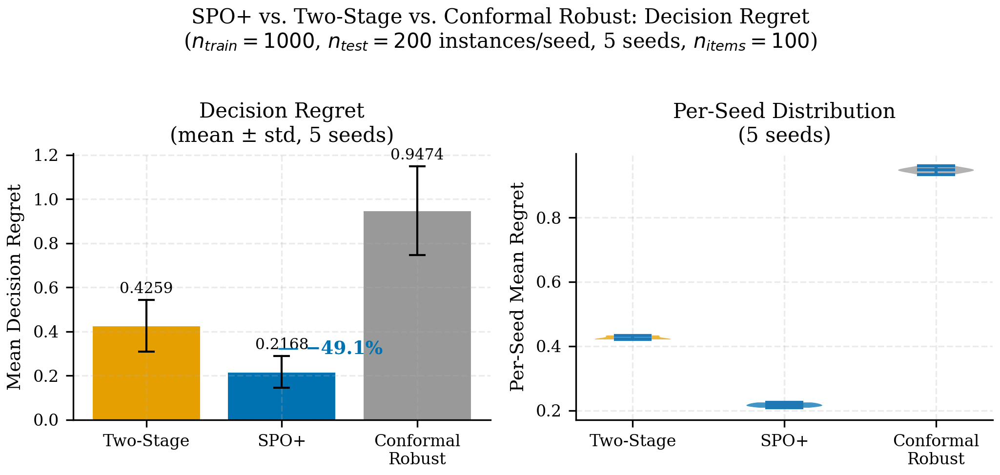
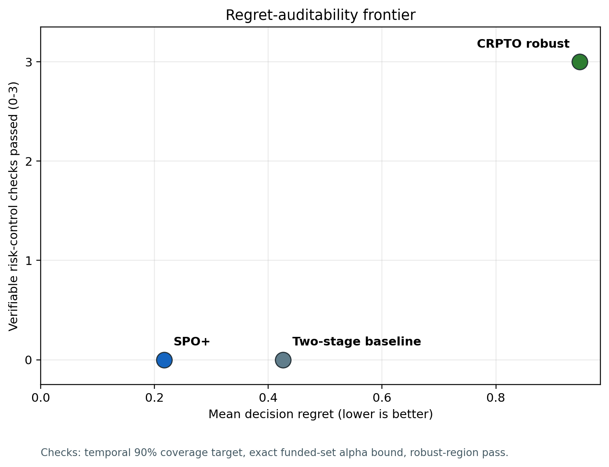
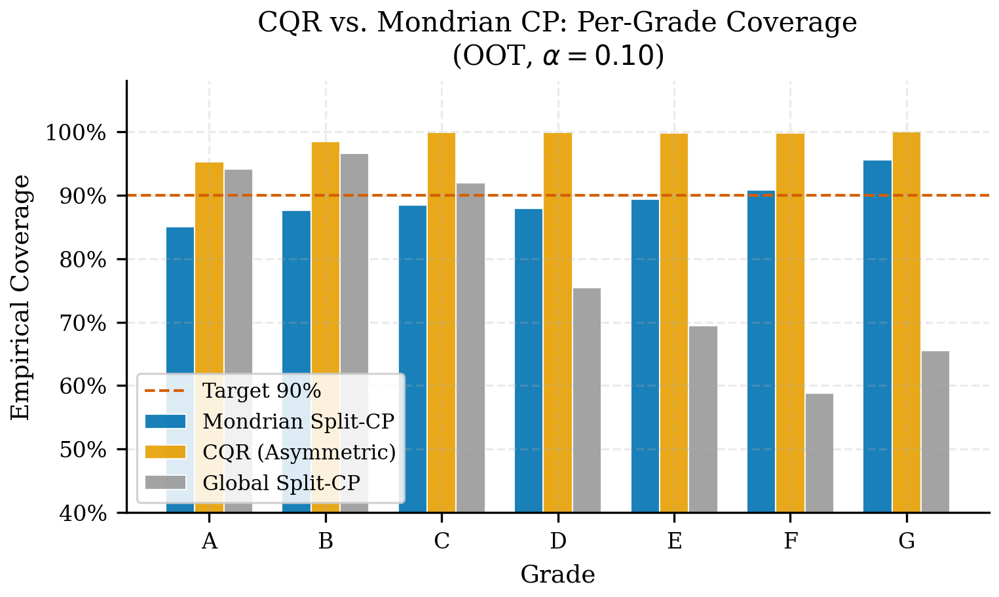

::: {.callout-note}
## Scope

This online supplement supports the IJDS submission body. It collects proof
details, robustness and external-replication tables A3--A34, reproducibility
commands, model-risk material, fairness diagnostics, and artifact lineage. It
does not introduce a new Lending Club champion, protected search rerun, hidden
selection criterion, or new claim family.
:::

::: {.callout-important}
## Journal Strengthening Pack

Selected former P2/P3 ideas are included here when they can be evaluated from
frozen artifacts: OCE/CVaR as a tail-risk diagnostic, robust satisficing as
committee-style margins, regret-auditability as the SPO+/CRPTO comparator, and
dependence-aware theory as a caveat/proposition. The multidataset layer is now
included as a frozen external economic replication on Prosper and Freddie/Mendeley:
it tests transfer of the CRPTO recipe without reopening the Lending Club
champion. Optimized OCE/CVaR objectives, full multi-distribution or online
conformal prediction, online DFL, causal CRPTO, multi-period portfolios,
production monitoring, and package extraction remain future work only.
:::

# Appendix A: Theoretical Details

The body states the CRPTO guarantee in operational terms. This appendix fixes
notation and records the exact boundary between the distribution-free claim and
the optional tightening arguments.

| Symbol | Meaning |
|---|---|
| `Y_i` | Observed default indicator or bounded loss proxy for loan `i`. |
| `p_hat_i` | Calibrated probability of default used by the decision layer. |
| `u_i(alpha)` | Upper conformal endpoint at miscoverage level `alpha`. |
| `x_i` | Funding decision or allocation weight. |
| `a_i` | Loan amount or exposure. |
| `w_i` | Normalized funded-set weight, `x_i a_i / sum_j x_j a_j`. |
| `gamma` | Robust-policy tuning parameter in the optimization rule. |
| `Gamma_CP` | Portfolio-level conformal risk metric after allocation: `sum_i w_i (u_i - p_hat_i)`, with clipping at one on the PD scale. |
| `V(alpha)` | Weighted funded-set miscoverage quantity. |

For a fixed allocation, conformal coverage controls the expected interval miss
indicator under the stated exchangeability design. CRPTO converts loan-level
misses into the funded-set quantity `V(alpha)` using normalized exposure
weights. The portfolio-level theorem assumes weighted funded-set validity,
`E[V(alpha)] <= alpha`, rather than claiming that marginal split conformal
automatically controls every adaptively selected subportfolio. A Markov-style
argument then gives the main conservative portfolio bound used in the exact
alpha-safe check.

Hoeffding/Bernstein-style tightenings are deliberately secondary. They are
reported only under additional conditional-independence assumptions because the
Lending Club evaluation is temporal and the funded set shares calibration and
selection history. The paper therefore keeps Markov as the main claim and uses
the tightening appendix as sensitivity evidence, not as a stronger theorem.

## Cluster-Aware Conditional Tightening

Let clusters `g = 1, ..., G` represent period, grade, or period-grade cells, and
let

```text
Z_g = sum_{i in g} w_i 1{Y_i > u_i(alpha)}.
```

Within each cluster, defaults and conformal misses may be arbitrarily
dependent. If, after conditioning on the calibration sample and fixed funded
allocation, the cluster aggregates are independent or conditionally
independent across `g`, then the weighted noncoverage sum admits a
cluster-level concentration bound. A Hoeffding-style version is

```text
P(V - E[V] >= t) <= exp(-2 t^2 / sum_g W_g^2),
```

where `W_g = sum_{i in g} w_i` is the cluster exposure share. This proposition
does not replace the main Markov bound because the cross-cluster assumption is
additional. Table A14 reports the relevant exposure and miscoverage
concentration so reviewers can audit where that assumption would matter.

### How much does the distribution-free bound leave on the table?

To quantify the cost of staying distribution-free, the table below contrasts the
Markov threshold used in the main theorem with Hoeffding and Bernstein
tightenings, all computed on the *real* rebaselined funded-set weights (341
positive-exposure loan rows, effective sample size
`n_eff = 1 / sum_i w_i^2 = 126.1` -- well below the loan count because exposure
is concentrated). Each column reports the threshold `t`
such that `P(V > t)` is controlled at the matched tail probability
`delta = sqrt(alpha)`.

| `alpha` | E[V] ≤ | Markov `t` | Hoeffding `t` (indep.) | Bernstein `t` (indep.) | empirical `V` |
|---:|---:|---:|---:|---:|---:|
| `0.01` | `0.01` | `0.1000` | `0.1056` | `0.0698` | `0.028875` |
| `0.05` | `0.05` | `0.2236` | `0.1271` | `0.1061` | `0.028875` |
| `0.10` | `0.10` | `0.3162` | `0.1676` | `0.1582` | `0.028875` |

: Concentration-bound comparison on the frozen funded set (Table A21b). Bernstein
is the sharpest at every level (e.g. `0.0698` vs Markov `0.1000` at
`alpha = 0.01`); Hoeffding helps at looser `alpha` but not at `0.01`, because with
concentrated exposure the effective sample size is only ~126. The frozen empirical
`V = 0.028875` sits below *all three* thresholds at every level.

Two honest readings follow. First, the tightenings are real: a second-moment
(Bernstein) argument would cut the worst-case threshold by roughly 30\% at
`alpha = 0.01`. Second, they are not free: both require the miscoverage
indicators to be independent (loan-level) or independent across clusters, which
the shared calibration sample and correlated defaults violate in general. We
therefore keep Markov as the stated guarantee and report this table only as a
sensitivity bound -- it shows what sharper concentration *would* deliver under an
assumption we decline to assert, not a tighter claim about the promoted policy.
The table is regenerated by `scripts/build_concentration_bound_table.py` from the
frozen funded-set weights.

# Appendix B: P1 Evidence

The P1 package strengthens the frozen champion without reopening search. Tables
A3--A11 are generated from frozen or derived artifacts and should be read as
post-selection audit evidence.

| Table | Role | Current-paper use |
|---|---|---|
| A3 nested holdout | Documents the 5K -> 25K -> 276K validation chain. | Appendix evidence against post-selection overclaiming. |
| A4 segment-period sensitivity | Checks coverage and funded-set quantities by period and grade. | Appendix robustness. |
| A5 decision-aware selector | Summarizes the CROMS-style screen across conformal candidates. | Method-defense appendix, not new training. |
| A6 synthetic shift | Stresses coverage under controlled covariate perturbations. | Robustness appendix. |
| A7 funded-set loan export | Provides row-level funded-set auditability. | Supplement only. |
| A8 funded-set composition | Summarizes grade, amount, and risk mix. | Appendix robustness. |
| A9 strict temporal holdout | Separates confirmation evidence from earlier selection decisions. | Strong appendix evidence. |
| A10 finalist exact bound evaluation | Shows exact alpha checks for conformal finalists. | Defends rank-1 selection. |
| A11 enhanced synthetic shift | Extends stress around the promoted policy. | Robustness appendix. |

These tables support the current claim that the promoted economic champion is
not a fragile single-point artifact. They do not turn the current paper into a
new prospective selection protocol. A fully pre-declared prospective protocol is
future journal hardening.

# Appendix C: Journal Robustness Package

Tables A12--A34 answer likely reviewer questions that are too detailed for the
25-page body. They are diagnostic by design, except A19 also supports the body
framing around regret-auditability and A25--A34 support the external-replication
defense. A20--A34 are journal-only add-ons: A20 audits a tail-satisficing
challenger; A21 makes the dependence-aware caveat numerical; A22 turns the
tail-risk diagnostic into an *active CVaR/OCE selection constraint* (a labeled
challenger, not a new champion); A23--A24 stress multi-distribution coverage and
online (ACI) stability on the frozen conformal intervals; A25--A34 cover the
external economic layer by testing the same frozen recipe and adding the
cross-dataset price-of-robustness scaling readout. Table A12 follows the standard
definitions of Conditional
Value-at-Risk [@rockafellar2000cvar] and the Optimized Certainty Equivalent
[@bental2007oce], and the non-monotonic risk-control framing behind A22 follows
[@angelopoulos2026nonmonotonic]; all are reported as post-hoc summaries of the
frozen funded set or intervals, never as a re-promoted champion.

| Table | Role | Scope caveat |
|---|---|---|
| A12 tail-risk OCE/CVaR diagnostics | Reprices the funded set under tail-risk summaries. | Diagnostic only; OCE/CVaR is not the optimized objective. |
| A13 satisficing margins | Expresses return, `V`, `Gamma_CP`, violation, and robust-region pass as margins. | Thresholds are explanatory, not a new policy selector. |
| A14 dependency cluster diagnostics | Documents period/grade concentration for the tightening caveat. | Does not prove independence. |
| A15 leave-one-period stress | Reweights the funded set by leaving periods out. | Descriptive stress, not re-optimization. |
| A16 bootstrap funded-set metrics | Adds empirical intervals for return, defaults, `V`, and misses. | Bootstrap interval, not conformal guarantee. |
| A17 budget/LGD/cap sensitivity | Varies operating assumptions. | Segment caps are diagnostics, not solver constraints. |
| A18 robust region by policy family | Summarizes alpha-safe policies by bound-aware family. | Compatible leaderboard only inside the final family. |
| A19 regret-auditability frontier | Compares two-stage, SPO+, and CRPTO robust on regret versus risk-control checks. | Comparator framing, not a new champion selector. |
| A20 tail-satisficing challenger audit | Re-solves the 45 robust-region policies and ranks them by satisficing pass, CVaR, OCE, and return. | Journal audit only; the top challenger is not promoted over the frozen champion. |
| A21 cluster-bound tightening | Reports cluster-aware Hoeffding thresholds by period, grade, and period-grade. | Transparent caveat; not tighter than Markov for the observed exposure concentration. |
| A22 tail-constrained re-optimization | Re-solves the 45 robust-region policies and selects the max-return policy under a decision-time (pd_high-based) CVaR cap, tracing the return-vs-CVaR frontier. | CVaR/OCE as an active selection constraint; reports a tail-constrained challenger, not a new champion. |
| A23 multi-distribution robustness | Worst-case 90% coverage by grade and grade x vintage cell on the frozen intervals. | Read-only diagnostic; the worst fine cell motivates MDCP/group-weighted as future work. |
| A24 online conformal stability | Per-vintage and cumulative coverage plus the Gibbs-Candes ACI target trajectory over the OOT vintage sequence. | Static-OOT online-control diagnostic, not a streaming validation. |
| A25 external replication gate | Applies the frozen CRPTO scoring/conformal/LP recipe to Prosper final-status loans and Freddie/Mendeley FM48. | External economic replication; not a Lending Club champion rerun and not a new exact theorem. |
| A26 external candidate sensitivity | Checks whether the robust LP objective is stable as the OOT candidate pool grows. | Candidate-pool audit; confirms the reported objectives are not a tiny shortlist artifact. |
| A27 Freddie horizon sensitivity | Audits Freddie/Mendeley default windows and red/green groups before selecting FM48 for the external table. | Dataset-selection audit; FM48 is promoted because it clears both coverage gates and keeps positive robust LP value. |
| A28 external LP exhaustiveness | Solves Prosper all-candidate LP and Freddie caps `500k`, `1M`, and `all`. | Exhaustiveness certificate; the Freddie all-candidate optimum matches the screened optimum. |
| A29 Freddie sparse Mondrian audit | Splits Freddie coverage by all groups, eligible groups, and sparse fallback groups. | Documents sparse cells; does not claim perfect conditional coverage in every tiny group. |
| A30 external metric intervals | Adds uncertainty intervals for AUC, coverage, alpha coverage, and robust objective. | Bootstrap for funded-loan contribution only; it does not resample solver inputs. |
| A31 external OOT subperiod metrics | Breaks Prosper by OOT year and Freddie by OOT quarter. | Subperiod audit; Freddie 2015Q4 alpha coverage is just below 99%. |
| A32 Prosper default-definition sensitivity | Repeats Prosper under main, defaulted-only, and chargedoff-only labels. | Default semantics audit; all three variants pass the global gates. |
| A33 Freddie segment sensitivity | Repeats Freddie FM48 for red, green, and combined groups. | Segment audit; green and combined pass alpha01, red remains a documented caveat. |
| A34 cross-dataset price of robustness | Orders the frozen external applications (Freddie green/combined/red and Prosper) by panel default rate and reports the signed price of robustness. | Positive premium under blind application that grows with panel default risk; the favorable Lending Club value is the selected-champion contrast. |

## External Multi-Dataset Replication

The external layer addresses the most natural single-dataset criticism without
changing the official Lending Club champion. Prosper final-status loans provide a
second P2P-style consumer-credit panel with direct investment fields
[@prosperLoanData]. Freddie/Mendeley FM48 provides a mortgage-credit panel built
from Freddie Mac loan-level performance data with train/OOS/OOT splits and
multiple default windows [@freddieMacSfLoanLevel; @mushava2023classimbalance].
Home Credit was audited as a scoring/conformal source [@homeCreditDefaultRisk]
but is not promoted because it lacks a clean `exposure + return` investment
contract comparable to Lending Club, Prosper, or Freddie.

| Dataset | Rows | Default rate | AUC | Coverage 90% | alpha = 0.01 coverage | OOT candidates | Robust LP objective |
|---|---:|---:|---:|---:|---:|---:|---:|
| Prosper final-status | `54,807` | `30.92%` | `0.7074` | `0.9205` | `0.9943` | `10,531` | `$199,419` |
| Freddie/Mendeley FM48 | `3,173,355` | `1.45%` | `0.7839` | `0.9745` | `0.9907` | `1,396,053` | `$1,291,228` |

: A25. External replication gate on the two promoted economic datasets. The
source CSV is `reports/crpto/tables/crpto_tableA25_external_replication_gate.csv`.

{#fig-supp-external-replication width="88%" fig-alt="Bar chart comparing Prosper final-status and Freddie FM48 on coverage 90 percent, alpha 0.01 coverage, AUC and robust LP objective."}

Table A26 checks whether the reported external robust objectives depend on an
artificially tiny candidate pool. Prosper reaches the same robust LP objective
using all `10,531` OOT candidates. Freddie remains stable at `$1,291,228` from
the top-`50,000` through top-`250,000` candidate pools, while random pools improve
monotonically with larger caps and stay below the top-return screen. A28 then
removes the remaining shortlist concern by solving Freddie on `500,000`,
`1,000,000`, and all `1,396,053` OOT candidates; the robust and nonrobust
objectives are identical across those three solves.

{#fig-supp-external-candidate-sensitivity width="88%" fig-alt="Line chart of robust LP objective by candidate cap and sampling mode for Prosper and Freddie external replications."}

{#fig-supp-freddie-all-candidate width="88%" fig-alt="Two-panel Freddie FM48 certificate showing unchanged robust and nonrobust objectives across 500k, 1M, and all candidates, plus a log-scale comparison of all OOT candidates and worst funded rank."}

| Dataset | Candidate cap | Candidates solved | Robust LP objective | Nonrobust LP objective | Funded loans | Worst funded rank |
|---|---:|---:|---:|---:|---:|---:|
| Prosper | all | `10,531` | `$199,419` | `$220,260` | `234` | `508` |
| Freddie FM48 | `500,000` | `500,000` | `$1,291,228` | `$1,305,409` | `143` | `551` |
| Freddie FM48 | `1,000,000` | `1,000,000` | `$1,291,228` | `$1,305,409` | `143` | `551` |
| Freddie FM48 | all | `1,396,053` | `$1,291,228` | `$1,305,409` | `143` | `551` |

: A28. External LP exhaustiveness. The Freddie all-candidate run funds zero
loans outside the top-250,000 screen and therefore converts the former cap
caveat into an auditable dominance certificate.

Table A27 documents why Freddie/Mendeley FM48 is the reported mortgage
replication. FM24 and FM36 are informative but miss one of the promoted gates;
FM60 keeps high 90% coverage but falls short at alpha = 0.01. FM48 is the only
Freddie horizon that clears the two conformal gates while preserving positive
economic robust value. This is a dataset-level selection audit, not a new search
over the Lending Club champion.

A29--A33 record the extended multidataset audit layer. The most important caveat
is Freddie's sparse Mondrian behavior: across all `29` Freddie groups, tiny
groups with only `43` OOT rows drive a minimum reported coverage of `0.5`.
After requiring at least `500` calibration+test rows per group, `25` eligible
groups cover `1,396,010` OOT rows and the minimum 90% coverage rises to
`0.8854`; this is close to, but still below, the nominal 90% threshold. The
paper therefore claims global external coverage and reports group diagnostics,
not perfect conditional validity in every sparse mortgage cell.

| Audit | Main finding | Caveat |
|---|---|---|
| A29 sparse groups | Eligible Freddie groups cover `1,396,010 / 1,396,053` OOT rows; sparse groups contain only `43` OOT rows. | Minimum eligible 90% coverage is `0.8854`, so this remains diagnostic. |
| A30 intervals | Prosper AUC `0.7073` CI `[0.6956, 0.7190]`; Freddie AUC `0.7839` CI `[0.7799, 0.7878]`. | Robust-objective interval bootstraps funded-loan contributions only. |
| A31 subperiods | Prosper 2012 and 2013 both pass alpha coverage; Freddie quarters keep 90% coverage above target. | Freddie 2015Q4 alpha01 coverage is `0.9896`, just below 99%. |
| A32 Prosper defaults | Main, defaulted-only, and chargedoff-only definitions all pass 90% and alpha01 gates with positive all-candidate robust LP. | Default semantics change default rate and robust objective, so the main status definition remains declared. |
| A33 Freddie segments | Combined FM48 and green pass alpha01; all segment LPs are solved on all candidates with positive robust value. | Red passes 90% coverage but alpha01 is `0.9850`, so it is sensitivity evidence, not a promoted standalone claim. |

## Cross-Dataset Price of Robustness

A34 turns the external layer into a positive economic finding rather than a
defensive gate. Using the same signed convention as the Lending Club champion
field, $(\text{nonrobust}-\text{robust})/\text{nonrobust}$, the price of
robustness is a *positive* premium on every frozen external application and it
increases monotonically with the panel default rate.

| Frozen application | Panel default rate | AUC | Price of robustness |
|---|---:|---:|---:|
| Freddie FM48 (green) | `0.58%` | `0.700` | `+1.00%` |
| Freddie FM48 (combined) | `1.45%` | `0.784` | `+1.09%` |
| Freddie FM48 (red) | `2.97%` | `0.700` | `+2.37%` |
| Prosper final-status | `30.92%` | `0.707` | `+9.46%` |

: A34. Price of robustness by frozen application, ordered by panel default rate.
The source CSV is
`reports/crpto/tables/crpto_tableA34_price_of_robustness_cross_dataset.csv`.

{#fig-supp-price-scaling width="82%" fig-alt="Line chart on a log-scale x-axis showing the price of robustness rising from +1.00 percent to +9.46 percent as the panel default rate increases, with Lending Club at -10.56 percent as a reference line."}

Two readings matter. First, the premium tracks irreducible default risk, not
discrimination: the `green` and `red` Freddie segments have nearly identical AUC
but different premiums, while their default rates differ by roughly a factor of
five. Higher default risk widens the conformal intervals, so the robust worst
case discounts more economic return. Second, the *selected* Lending Club champion
has a favorable signed price (`-10.56%`): bound-aware search located a robust
funded set that also wins expected return. Reporting both--a bounded positive
premium under blind application and a favorable value under selection--is more
defensible than claiming robustness is uniformly free or uniformly costly. The
headline is that robustness is never economically catastrophic in these panels:
the coverage guarantee costs at most a low-double-digit premium, and CRPTO
measures which regime a given panel is in.

## Reviewer Claim Checks

The table below links the paper's main claims to the evidence surface and
guardrails a reviewer can inspect. The point is not to add another result, but
to make the audit path explicit.

| Claim | Evidence | Artifact | Test or guardrail |
|---|---|---|---|
| The predictive input is a frozen calibrated PD artifact, not a refreshed leaderboard model. | AUC, Brier, ECE, temporal backtesting, and calibration diagnostics. | `models/pd_canonical.cbm`, `models/pd_canonical_calibrator.pkl`, paper-facing metric tables. | `EXTRACTION_MANIFEST.json` and champion validation hashes. |
| The conformal layer gives conservative OOT uncertainty on the PD scale. | 90% and 95% coverage, minimum group coverage, and grade/decile audits. | `data/processed/conformal_intervals_mondrian.parquet`. | Conformal validation status and smoke tests that check final metric synchronization. |
| The promoted funded set passes the exact alpha-safe bound. | `V(alpha = 0.01) = 0.028875`, `Gamma_CP = 0.187987`, zero violation. | `models/final_project_promotion.json`, bound-evaluation parquet, Table A13. | Rebaselined exact-evaluation artifact and final-sync regression tests. |
| The result is not an isolated lucky policy. | `45/45` policies pass in the final robust region. | Table A18 and robust-region heatmap. | Protected search/evaluation split; no rerun of the champion search in paper builds. |
| The supplement strengthens interpretation without moving the champion. | A20--A34 challenger, dependence, tail-risk, multi-distribution, online, and external-replication diagnostics. | Journal robustness tables and Figures 15--25. | Scope caveats in each table; challenger and external outputs are labeled as non-promoted diagnostics. |
| The manuscript is reproducible at the artifact level. | Tables, figures, Quarto pages, and status JSONs regenerate from frozen inputs. | Repository code, DVC metadata, rendered book/paper outputs. | Pre-push smoke/lint hooks, DVC status checks, and manifest validation before release. |

## Funded-Set Audit Card

Table A8 is intentionally more granular than the manuscript body. For reviewers
who need the short version, the promoted policy funds 341 positive-exposure loan
rows on a `$1M` budget; the canonical robust-region ledger reports `n_funded =
340` because it uses a solver-threshold count. The exposure-weighted audit below
collapses the period-by-grade table into four grade buckets. It is a diagnostic
view of the frozen funded set, not a new selector or a re-optimized policy.

| Grade bucket | Funded loans | Exposure share | Weighted default rate | `V` contribution | Mean `u_i(0.01)` |
|---|---:|---:|---:|---:|---:|
| A-B | `13` | `7.35%` | `0.00%` | `0.00000` | `0.12529` |
| C | `144` | `40.88%` | `2.86%` | `0.01168` | `0.17258` |
| D | `141` | `42.35%` | `3.94%` | `0.01370` | `0.35206` |
| E-G | `43` | `9.42%` | `4.78%` | `0.00350` | `0.52587` |

The concentration pattern is useful for interpretation: most exposure sits in
C/D loans, D contributes the largest share of the exact `V(alpha = 0.01)`, and
the high-risk E-G tail is visible but not the hidden driver of the certificate.

## Why A21--A34 Do Not Strengthen the Main Claim

A21--A34 are designed to make the paper harder to over-read. A21 shows that a
cluster-aware tightening is transparent but not sharper than Markov under the
observed exposure concentration. A23 shows where weighted, group-weighted, or
multi-distribution conformal methods would matter if CRPTO were recalibrated
under a new protocol. A24 shows that an online controller would have little to
correct on the frozen OOT vintages, but it is still a replay, not evidence from
a live stream. A25--A34 show that the same recipe clears useful gates on Prosper
and Freddie/Mendeley, that Freddie's full candidate universe has been solved,
that subperiod/definition/segment sensitivities are documented, and that the
economic cost of applying the frozen recipe scales with panel risk. They
still do not create a new exact funded-set theorem for every external portfolio.
Together, these artifacts protect the IJDS claim: the submitted result is an
auditable post-hoc conformal robust credit-portfolio decision with an exact
frozen Lending Club funded-set certificate and external economic replication
evidence, not a universal conditional-coverage, cross-dataset, or
online-deployment guarantee.

## Decision-Certificate Landscape

The main manuscript positions CRPTO as an auditable post-hoc bridge, not as the
only possible conformal decision framework. The table below clarifies the
certificate landscape that motivated the journal package.

| Family | Certificate object | What CRPTO uses now | Future-work boundary |
|---|---|---|---|
| Split/Mondrian CP | Marginal or partitioned coverage of PD-scale intervals [@vovk2005; @bostrom2021; @gibbs2024]. | Upper conformal endpoint becomes the robust PD input. | Stronger conditional guarantees require new assumptions or diagnostics. |
| Data-driven robust optimization | Feasibility against an uncertainty set [@bertsimas2004; @bertsimas2018datadriven]. | Budgeted robust portfolio with exact funded-set check. | New robust objectives or uncertainty sets would be new research lanes. |
| Conformal robustness control | Robustness probability or loss control in downstream decisions [@johnstone2021; @hu2026crc]. | Used as positioning language and audit inspiration. | Not re-promoted as a new CRPTO selector. |
| CROM/CREME/CREDO | Model or decision certificates for robust optimization [@bao2025croms; @zhou2025credo; @zhou2026creme]. | Used to motivate A20--A34 challenger and replication diagnostics. | Could become a CRPTO v2 certificate, but only with a new protocol. |
| Decision-focused learning | Regret-aware training through the optimization loss [@elmachtoub2022; @schutte2024robust]. | SPO+ is a comparator in A19. | End-to-end retraining would change the frozen predictive artifact. |

## Coverage-Validity Ladder

The table below records the validity ladder used to interpret A23--A33. The
purpose is to keep the strongest claims aligned with the available evidence.

| Level | Claim form | Supporting CRPTO evidence | Boundary |
|---|---|---|---|
| Marginal split CP | Coverage over an exchangeable evaluation population. | OOT interval audit and paper-facing validation tables. | Does not imply profile-level conditional coverage. |
| Mondrian/group CP | Coverage within declared partitions such as score deciles or grades. | Frozen Mondrian intervals and grade diagnostics. | Small grade x vintage cells can remain weak. |
| Weighted / localized coverage | Coverage under known weights or local neighborhoods [@barber2023beyond; @guan2023localized; @jonkers2024wcps]. | A23 reports where reweighting/group focus would matter. | Not fitted as a new interval method. |
| Multi-distribution validity | Coverage across multiple source distributions [@liu2024multisource; @yang2026multidistribution; @bhattacharyya2026groupweighted]. | A23 worst-cell table is a read-only stress test. | Full MDCP would need a new calibration protocol. |
| Online validity | Sequential alpha adaptation [@gibbs2021aci; @liu2026portfolio]. | A24 replays OOT vintages as a static online diagnostic. | Not evidence from a live stream. |
| External economic replication | Frozen recipe transfer to different credit products. | A25--A34 report Prosper and Freddie/Mendeley scoring, conformal, LP, exhaustiveness, sensitivity gates, and price-of-robustness scaling. | Replication evidence, not a new universal guarantee. |

## Lending-Club And P2P Predecessors

The table below anchors the empirical domain lineage. These papers narrow the novelty
claim: CRPTO is not the first Lending Club model, not the first P2P portfolio
optimizer, and not the first conformal credit-scoring application. Its claim is
the audited coupling of conformal PD uncertainty with a robust credit-portfolio
decision.

| Paper family | Domain contribution | CRPTO distinction |
|---|---|---|
| Lending Club / fintech credit scoring [@jagtiani2019altdata; @albanesi2024credit; @zheng2026twostage]. | Measures predictive and scorecard behavior on platform or fintech lending data. | Uses the PD model as an auditable input to a decision certificate. |
| P2P investment support [@guo2016p2p; @babaei2020p2p]. | Combines borrower-level prediction with portfolio-style investment recommendation. | Adds conformal uncertainty and exact alpha-safe funded-set validation. |
| Robust P2P credit portfolio optimization [@chi2019p2p]. | Brings data-driven robust optimization into P2P lending. | Makes the uncertainty set a conformal artifact with frozen lineage. |
| AI/OR digital lending optimization [@aior2025lendingclub]. | Frames Lending Club funding as multi-objective OR. | Keeps risk controls and artifact governance as first-class outputs. |
| Ordinal conformal credit scoring [@kawasumi2026ordinal]. | Applies conformal prediction to credit-score intervals. | CRPTO moves from score uncertainty to a robust portfolio decision. |

{#fig-supp-uncertainty-baselines width="90%" fig-alt="Three-panel comparison of uncertainty set methods by empirical coverage, mean interval width, and minimum grade coverage."}

{#fig-supp-spo width="90%" fig-alt="Decision regret comparison of two-stage, SPO+, and conformal robust methods, with SPO+ showing lower regret."}

{#fig-supp-regret-auditability width="82%" fig-alt="Scatter plot of regret versus verifiable risk controls, positioning SPO+ as low-regret and CRPTO robust as high-auditability."}

{#fig-supp-cqr width="90%" fig-alt="Coverage by Lending Club grade for CQR and conformal variants, used as appendix evidence rather than promoted method."}

{#fig-supp-tail-frontier width="90%" fig-alt="Scatter plot of tail risk versus realized return across 45 robust-region policies, with satisficing pass policies and frozen economic champion marked."}

{#fig-supp-tail-lgd width="82%" fig-alt="Line chart of frozen funded-set loss rate versus LGD (0.35 to 0.60) for CVaR90, CVaR95, CVaR99, OCE and the mean; CVaR grows with LGD while OCE and the mean stay mild."}

{#fig-supp-tail-constrained width="88%" fig-alt="Upward line of realized return versus decision-time CVaR95 cap; economic champion as a star at the top-right, tightest tail cap as a diamond at the bottom-left."}

{#fig-supp-online-aci width="88%" fig-alt="Per-vintage and cumulative coverage lines above a 90% target line across eleven OOT quarters, with the ACI target alpha_t on a secondary axis rising slightly from 0.10 to 0.12."}

A19--A33 should be read as literature-aligned stress evidence. A19 places CRPTO
against the regret-driven training tradition; A20--A22 translate tail risk and
satisficing into challenger audits without changing the champion; and A23--A24
show where multi-distribution and online conformal work would enter if the
project moved from a frozen historical panel to a new protocol. A25--A34 add the
external economic replication layer on Prosper and Freddie/Mendeley, including
Freddie all-candidate exhaustiveness and negative/sparse-cell sensitivities,
while preserving the Lending Club certificate boundary. This keeps the
supplement ambitious without silently changing the submitted method.

# Appendix D: Fair Lending, MRM, And Governance

The fairness section is a model-risk diagnostic. The public Lending Club data do
not contain direct protected attributes, so the paper cannot claim statutory
fair-lending certification. Where protected attributes are unavailable, the
standard practice is to proxy them--for example via Bayesian Improved Surname
Geocoding [@cfpb2014bisg]--and to interpret machine-learning underwriting
fairness with care [@finreglab2023fairness]. The supplement reports proxy and
intersectional diagnostics to show that the selected funded set does not hide an
obvious weak segment under the available columns.

The MRM material documents intended use, out-of-scope use, model assumptions,
calibration and conformal diagnostics, challenger criteria, artifact lineage,
and escalation triggers. In the CRPTO setting, a retraining trigger is not an
automatic production process. It is a research governance event that would
require a new run tag and a fresh drift report against the frozen champion.

The governance boundary for the current submission is:

| Topic | Current submission | Future work only |
|---|---|---|
| Fairness | Proxy/intersectional audit on available data. | Direct protected-attribute validation if legally available. |
| Monitoring | Artifact-backed guardrails and MRM triggers. | Live production dashboard. |
| Retraining | No automatic retraining; frozen paper champion. | New named run with drift report. |
| Companion | Quarto + DVC/DagsHub/MLflow after anonymity decision. | Streamlit/product showcase. |

# Appendix E: Reproducibility

The reviewer-facing reproduction path separates artifact-independent checks from
artifact-aware validation. Minimal local checks are:

```powershell
just setup-base
just smoke
just paper-submission
```

Paper-facing artifact regeneration uses frozen inputs:

```powershell
just tables
just figures
just evidence
just journal-package
```

The full release-facing checklist is:

```powershell
just lint
just smoke
just validate-champion
just paper-submission
uv run pytest tests/test_publication_targets.py -q
uv run dvc status --no-updates
```

Artifact-aware validation additionally requires credentials for the DVC remote:

```powershell
uv run dvc status -c -r dagshub
```

The following stages must not be rerun as routine reproduction steps:
`crpto.pd.champion`, `crpto.conformal.intervals`,
`crpto.conformal.validation`, `crpto.portfolio.optimization`, and especially
`crpto.portfolio.bound_exact_eval`. Paper-facing commands such as table,
figure, evidence, journal-package, manuscript, supplement, and book renders are
safe because they consume frozen inputs.

# Appendix F: Submission Files

The active IJDS submission surfaces are:

| Surface | Source | Role |
|---|---|---|
| Anonymous body | `paper/CRPTO_ijds.qmd` | 25-page IJDS-style manuscript source. |
| Online supplement | `paper/supplement_ijds.qmd` | Proofs, A3--A34, MRM/fairness, reproducibility. |
| Long companion | `book/` | Public companion after anonymity handling. |
| Publication config | `configs/crpto_publication_targets.yaml` | Venue, template, anonymity, and pivot rules. |

Before formal submission, the Quarto body should be converted into the official
INFORMS IJDS LaTeX template with double-anonymous settings. The title page is
submitted separately, and repository or remote-storage URLs are disclosed only
according to the journal's data/code and double-anonymous policies.
