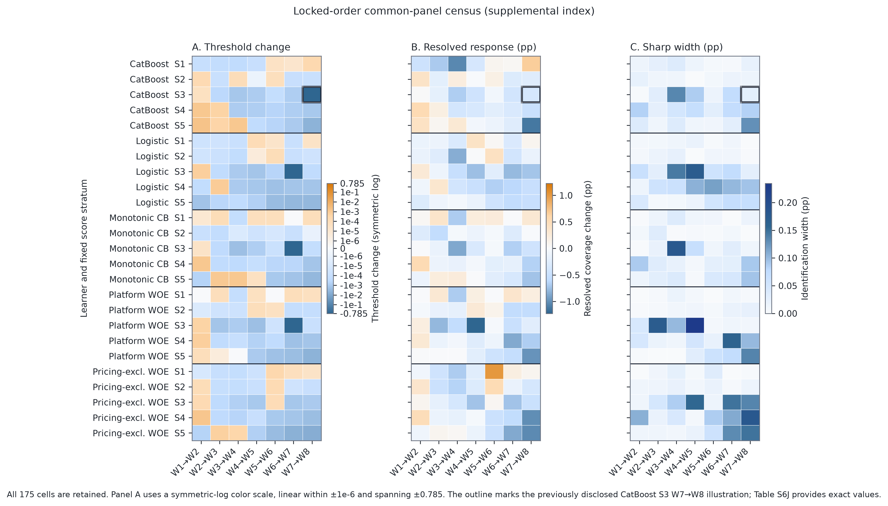
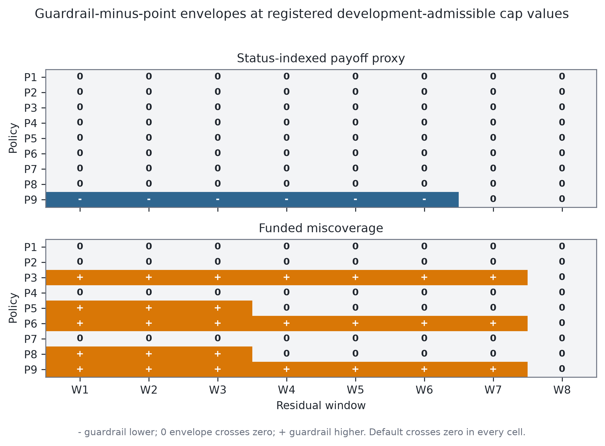

# Scope and Evidence Contract

This supplement documents one retrospective CRPTO specification audit. The
archive had been inspected during earlier project iterations. The active
protocol was committed before its complete run, but it is not a prospective
trial, preregistration, or pristine lockbox. The inferential object is the
finite Lending Club archive under the declared information, outcome, policy,
and comparator contracts.

The audit reports every eligible consecutive six-month residual window and five
protocol-locked coverage specifications. The primary detailed audit retains CatBoost and
numeric logistic, while monotonic CatBoost and two WOE/IV scorecards broaden
model-class coverage checks; only the primary CatBoost enters optimization. The
coverage record has three deliberately separate layers: sharp finite-archive
identification bounds, a retrospective joint-block combined-rank reference
diagnostic, and outcome-isolated sensitivities for timing and calibration
taxonomy. The missingness-encoding, individual-age second-origin,
label-Mondrian, and closed four-map CatBoost calibrator families are complete
sensitivities rather than selection grids. The calibrator family uses one
common uncalibrated-probability ($q_{\mathrm{raw}}$) taxonomy, reports every
map and cell, and performs no optimization; only the pre-existing Platt score
enters the separate primary portfolio analysis. The decision audit reports the
complete five-point gamma path, two rulers constructed
without policy-development or OOT evaluation outcomes, three interior coordinates,
and every comparator in each named support. *Evaluation-outcome-blind* means that
earlier model and conformal fitting may use historical labels, while policy
construction reads neither development nor OOT evaluation outcomes. The
nine fixed-cap policies remain a supporting registered-cap diagnostic, not a
closed family of promotion candidates. No out-of-time (OOT) outcome selects a
learner, window, taxonomy, gamma, ruler, coordinate, policy, cap, or comparator.
Nested supports, overlapping windows, and repeated allocations are
specification paths, not independent replications or votes.

| Reader question | Location | Audit answer |
|---|---|---|
| Which loans could enter a decision? | Appendix A | Status-independent monthly menus retain unresolved outcomes |
| What does the conformal object predict? | Appendix B | The observed binary terminal label, not latent individual PD |
| Why can interval geometry change abruptly? | Appendix B | An exact rank-count condition can switch which mirror calibration sample supplies the binary residual order statistic |
| What is held fixed in portfolio comparisons? | Appendix C | Menu, budget, payoff, loan bounds, purpose cap, solver, and one declared ruler |
| What is exact? | Appendices B and D | Mirror-order-statistic threshold geometry, the crossed-band coverage identity, score-ruler algebra, C2 feasibility, binary-outcome bounds, and the conditional within-basis endpoint lemma |
| Which empirical signs survive? | Appendix E | The endpoint sign changes by ruler/coordinate and no sign survives the finite registered cap values spanning $[0.05,0.12]$; continuous-support extrema are not computed |
| Can the evidence be replayed? | Appendix F | Yes, conditional on authorized access to the hash-identified raw and DVC inputs, using the active source registry and full raw-data audit |
| What may the paper claim? | Appendix G | Finite-archive facts and joint-block rank-reference flags at locked nominal thresholds, not significance, superiority, causality, or selected-set validity |
| How does CRPTO differ from its closest methods? | Appendix H | By its frozen-score audit target, not by claiming each component as new |

: Reader map for the Online Supplement.

# Appendix A: Data, Timing, and Outcome Observability

## A.1 Single status-independent universe

<!-- claim:data.exhaustive_status_independent_population -->
<!-- claim:endpoint.not_verified_snapshot -->

The source is a locally verified Lending Club 2007--2020Q3 research extract.
The audit establishes the local file's identity and contents, not its
acquisition history or redistribution rights. A chunked full-file audit reads
all 2,925,493 rows and 142 columns; 2,925,492 are
valid dated loans. The archive contains 2,060,077 36-month and 865,415 60-month
contracts. The single active design retains all 640,543 loans eligible under
deterministic schema, date, term, and origination-feature checks. It is an
exhaustive design population, not a sample or row cap. Candidate membership
never depends on whether the reconstructed endpoint is resolved.

The decision unit is issue month. Every OOT month receives a fresh USD 1
million budget, and a policy can allocate only to loans issued in that month.
The primary panel contains 376,890 candidates in 15 menus from April 2016
through June 2017. A July--September 2017 extension contains 88,227 candidates
and is retained only as a more heavily censored diagnostic.

| Block | Issue dates | Rows | Labels available by cutoff | Role |
|---|---:|---:|---:|---|
| PD development | 2007-06--2010-12 | 17,433 | 17,392 | model fit and temporal validation |
| Platt calibration and taxonomy | 2011-01--2011-12 | 14,101 | 14,077 | separately fitted score map and fixed edges |
| Residual pool | 2012-01--2013-01 | 49,007 | 48,857 | all eight six-month recipes |
| Policy development | 2013-02--2013-12 | 94,885 | not read | outcome-free comparator support |
| Primary OOT | 2016-04--2017-06 | 376,890 | read only after freeze | complete locked evaluation |
| Censored extension | 2017-07--2017-09 | 88,227 | read only after freeze | secondary censoring stress |

**Table S1.** Chronology and label observability. Blocks do not overlap except that the eight residual windows overlap by design.

The information cutoff for model and residual labels is March 31, 2016. The
evaluation endpoint cutoff is September 30, 2020. The distributed file is not
a verified point-in-time snapshot: 36,485 last-payment dates and 40,214
last-credit-pull dates occur after that cutoff. A charged-off residual
label is treated as available at the month-end of `last_pymnt_d` plus six
calendar months; every included residual month retains more than 99% of
terminal labels under this
rule. The minimum monthly retention is 0.992956.

The complete audit explains why the remaining archive cannot be treated as
exchangeable extra training data without further assumptions. Forty-eight variables have negligible early support and
near-complete later support, so admitting them would change the temporal
feature contract. Label availability by the cutoff is 59,910/162,570 (36.85%)
for 2014, 28,878/283,173 (10.20%) for 2015, and 1,110/96,120 (1.15%) for
2016Q1, with zero observed bads in the last group. A resolved-only fit would
therefore select on duration. Sixty-month contracts define another horizon;
using censored cohorts coherently would require a survival or competing-risk
estimand rather than a larger binary sample. Type-I conformal survival methods
require the censoring time for every unit, while general right-censoring methods
require conditional independent censoring, positivity, and nuisance-model
contracts [@candes2023survival; @gui2024adaptive]. If
prepayment prevents later default observation, it is a competing event rather
than automatically independent censoring, and calibration would concern
event-specific cumulative incidence functions [@li2023online_loans]. None of
these results retrospectively identifies the binary endpoints used here.

For primary OOT, requested and funded amount differ by only USD 18,000 across
376,890 loans. The funded-to-requested ratio is 0.999996 and only about two
loans are partially funded. The optimizer nevertheless names listed loan
amount as its exposure contract rather than treating the two fields as
interchangeable by assumption.

## A.2 Endpoint taxonomy and censoring

<!-- claim:endpoint.reason_census_partitions_candidates -->

Statuses containing `Charged Off` are positive ($Y=1$), and statuses containing
`Fully Paid` are negative ($Y=0$), only when reconstructed endpoint availability
is no later than the cutoff. Exact `Default`, every nonterminal status, and
terminal statuses becoming available later remain unresolved. The primary
panel has 364,814 resolved and 12,076 unresolved candidates. Fully Paid is
available at the month-end of `last_pymnt_d`; Charged Off is available at that
month-end plus six calendar months. The charge-off delay is a modeling
assumption, not the known operational charge-off date. The exact reason census
is:

| Reconstructed endpoint reason | Candidates | Resolved | Unresolved |
|---|---:|---:|---:|
| Fully Paid by cutoff | 307,842 | 307,842 | 0 |
| Charged Off by cutoff | 56,972 | 56,972 | 0 |
| Nonterminal or otherwise unresolved | 11,551 | 0 | 11,551 |
| Terminal after reconstructed cutoff | 47 | 0 | 47 |
| Terminal availability date missing | 478 | 0 | 478 |

**Table S1A.** Endpoint-reason partition of all 376,890 primary candidates. The last two rows sum to 525 but represent different observability failures.

This endpoint is a cutoff-specific terminal classification, not a lifetime hazard.
The analysis does not assume that unresolved outcomes are missing at random.
Instead, allocations are frozen first and each unresolved binary outcome is
allowed to take either value in sharp fixed-allocation and paired-policy
bounds. This preserves the historical menu while exposing the uncertainty
that outcome filtering would conceal.

## A.3 Physical information boundary

Prediction, residual-recipe construction, policy development, comparator
support, point-frontier enumeration, and allocation freezing run without OOT
status, status-indexed payoff, miscoverage, or another outcome-derived field. The
outcome-free phase persists 51,117 solve records and 5,001,617 funded rows. It
contains 1,872 guardrail solves: eight windows by nine policies by 26 monthly
menus, of which 11 are development and 15 are primary OOT. It also contains
1,080 OOT C2 solves: eight windows by nine policies by 15 months.

The separate two-ruler freeze contains 6,240 solves, 622,455 funded rows, 720
endpoint comparisons, 1,440 reversed-ID endpoint reruns, 288 separate GLOP
checks, and 26 objective-optimum basis diagnostics. Its dimensions are eight
windows by 26 months by five gammas by three coordinates by two rulers. It
loads no outcome column.

The separate credit-control freeze contains five score vectors for all 640,543
eligible rows, 160 residual recipes, 3,638,660 fit-audit rows, and 3,520
outcome-free geometry cells. It reproduces the CatBoost and numeric-logistic
score columns used in the detailed geometry audit exactly, and freezes
monotonic CatBoost plus both WOE/IV scorecards before any primary OOT outcome
join. No control enters a portfolio solve.

Each evaluator verifies its freeze identity and every artifact descriptor
before a keyed outcome join. Exact ID alignment is required; partial or
duplicated joins fail. The resulting evidence therefore separates allocation
construction from outcomes and prevents an outcome-dependent interpretation
from changing the frozen decision rule.

# Appendix B: Prediction and Binary Conformal Geometry

## B.1 Primary learner and four protocol-locked coverage controls

The primary score is a CatBoost classifier [@prokhorenkova2018catboost] with
seed 42, 29 numeric and nine
categorical origination-time features. A Platt map fitted on 2011 raw margins
[@platt2000] produces $p_i$. Five score strata, fixed from all status-independent 2011
scores, form the canonical Mondrian taxonomy. One-, two-, and ten-stratum
recipes are closed coverage diagnostics rather than a selection grid.
Only the four internal five-stratum cutpoints assign groups; the extreme bins
extend beyond the observed 2011 score range and therefore retain all later
valid scores.

Each learner needs a scalar score for residual construction; only the primary
CatBoost scalar also enters the portfolio LP. Platt scaling supplies that score
through a fixed logistic map fit on the separate 2011 block; its role is
architectural, not a claim of calibrator optimality.

A separate two-phase sensitivity freezes four monotone maps of the same
primary CatBoost base output on the same 14,077 availability-safe 2011 labels:
the active Platt logistic map, reused without refitting [@platt2000],
increasing isotonic regression with
clipped out-of-domain predictions [@zadrozny2002], beta calibration with the
`abm` parameterization [@kull2017], and
`VennAbers(setting="classification", precision=None)` [@vovk2014].
The scientific environment pins `betacal==1.1.0` and
`venn-abers==1.5.3`. If $p$ is the frozen Platt probability and $a,b$ are its
intercept and positive slope on the CatBoost raw margin, the common
uncalibrated CatBoost probability is reconstructed as

$$
q_{\mathrm{raw}}=
\operatorname{logit}^{-1}\!\left\{
\frac{\operatorname{logit}(p)-a}{b}
\right\}.
$$

No CatBoost model is refitted.

The four active Platt cutpoints are transformed through the same exact inverse.
They are not re-estimated as $q_{\mathrm{raw}}$ quantiles. This gives one common
five-stratum taxonomy with zero assignment changes, so method-specific ties in
isotonic or Venn--Abers predictions cannot change membership. Only residual
values may change; each window's row counts and finite-sample ranks remain
fixed. Phase A reuses Platt without refitting it, fits the other three maps, and
freezes all 160 method--window--stratum recipes before the target endpoint join. Because the
retrospective raw-file scan necessarily reads chunks containing status values
before filtering to the locked 2011 IDs, this is logical target-outcome nonuse,
not a physical lockbox. No primary-OOT outcome is retained or used in a map,
taxonomy, or recipe.

Venn--Abers returns the multiprobabilistic pair $(p_{i0},p_{i1})$. The declared
point score for this finite comparison is

$$
p_i^\prime=\frac{p_{i1}}{1-p_{i0}+p_{i1}},
$$

not the historical midpoint. The frozen artifact retains both pair components
and verifies $0\le p_{i0}\le p_i^\prime\le p_{i1}\le1$. The scalar does not
inherit the Venn multiprobability guarantee, is not a latent-PD interval, and
is not authorized as a portfolio endpoint. Phase B reports all four methods,
all eight windows, `ALL` plus all five common strata, and every unordered
method pair. It selects no map or result and runs no optimization. Neither this
sensitivity nor a calibrator name supplies temporal transport or
selected/funded-set coverage.

The executable primary specification uses 500 trees, depth 6, learning rate
0.04, `Balanced` automatic class weights, Bernoulli bootstrap with 0.80
subsampling, `has_time=true`, and a temporal validation tail comprising the
last 20% of PD-development months. These values and seed 42 are inherited from
the locked design rather than selected on downstream outcomes.

A numeric logistic regression provides the first coverage-only
control. It uses median imputation, standard scaling, class balancing, and its
own 2011 Platt map and fixed taxonomy. Three further controls use the same
temporal roles and all eligible rows:

- **Monotonic CatBoost.** Positive constraints apply to interest rate, DTI,
  loan-to-income and its square, installment burden, revolving utilization,
  revolving-balance-to-income, public records, recent inquiries, delinquency
  severity, and five adverse-history flags. Negative constraints apply to
  annual and log income, FICO, credit age, and delinquency recency. The inherited
  `recent_chargeoff` flag is constant in PD development and Platt calibration,
  so its declared positive constraint is inert in fitting.
- **Platform-signal WOE/IV.** Twenty-six fields include loan amount, interest,
  installment, income and burden ratios, revolving and bureau measures, grade,
  subgrade, home ownership, purpose, verification, interest bucket, and the
  interest-bucket-by-grade interaction.
- **Pricing-excluded application WOE/IV.** Nineteen fields retain loan amount, income, DTI,
  loan-to-income, revolving utilization and balances, FICO, credit age,
  employment length, account counts, public records, inquiries, delinquency,
  home ownership, purpose, and verification. Grade, subgrade, interest,
  installment, pricing buckets, and their interaction are excluded.

Each OptBinning process is fit on PD development only, with automatic
monotonic trend, two to eight bins, and a 5% minimum bin share
[@navaspalencia2020]. Each learner then receives its own 2011 Platt map and
taxonomy. None of the four controls enters the portfolio optimizer or is chosen
from OOT outcomes. They ask whether coverage transport is specific to model
class, unconstrained shape, or platform pricing; they are not a model-selection
contest.

| Learner | 2011 Platt-block AUC | 2011 Platt-block Brier |
|---|---:|---:|
| CatBoost | 0.676327 | 0.090206 |
| Numeric logistic | 0.656880 | 0.091000 |
| Monotonic CatBoost | 0.678091 | 0.090054 |
| Platform-signal WOE scorecard | 0.660533 | 0.090773 |
| Pricing-excluded application WOE scorecard | 0.662401 | 0.090760 |

**Table S2A.** Frozen probability-calibration-block discrimination and Brier
scores. These diagnostics describe the common 2011 role; they do not select a
learner.

| CatBoost score map | Rows | AUC | Brier | Log loss | ECE-10 | Mean IVAP pair gap |
|---|---:|---:|---:|---:|---:|---:|
| Platt | 14,077 | 0.676327 | 0.090206 | 0.316543 | 0.003273 | -- |
| Isotonic | 14,077 | 0.679767 | 0.089871 | 0.314776 | 0.000000 | -- |
| Beta (`abm`) | 14,077 | 0.676327 | 0.090205 | 0.316539 | 0.003080 | -- |
| IVAP Venn--Abers scalar | 14,077 | 0.679493 | 0.089903 | 0.315141 | 0.001685 | 0.002339 |

**Table S2C.** Complete same-sample 2011 fit diagnostics for the four frozen
CatBoost score maps. These values describe the fit block only. In particular,
isotonic ECE of zero on the same rows used to fit it is not an OOT performance
claim or a selection criterion.

The raw audit labels 30 origination fields as temporally eligible, whereas the
frozen model consumes engineered predictors rather than every eligible raw
column. Four eligible fields are deliberately absent. `initial_list_status`
and `policy_code` are constant in PD development. `acc_now_delinq` and
`delinq_amnt` have only a handful of nonzero early observations and are not
added beside the more stable delinquency history and severity features. This
is a prespecified representation choice, not a claim that the omitted fields
are unavailable or useless in another design.

The raw-feature contract records two exceptions to the 95% coverage threshold.
`mths_since_last_delinq` is structurally nullable: minimum fitting coverage is
0.336075 and primary OOT coverage is 0.528555; the frozen transformation maps
missing recency to 999. `pub_rec_bankruptcies` has minimum fitting coverage
0.921700 and complete primary OOT coverage; missing values map to no recorded
bankruptcy. Feature engineering emits observed-value indicators for audit, but
the active portfolio learner does not add them post hoc. Appendix B.7 reports
a dedicated feature-semantics-preserving encoding sensitivity for these two
fields. It does not cover every incomplete predictor, identify a missingness
mechanism, or select an encoding. In particular, `emp_length` availability
declines from 98.394% in PD development to 92.754% in primary OOT; CatBoost
retains its missing values natively, numeric logistic uses the development
median, and both WOE controls use their frozen missing-bin semantics. This is a
disclosed transport limitation rather than a new selected robustness family.

## B.2 Credit-control prediction, IV, and temporal shift

All five scores use the same 376,890 primary candidates, of which 364,814 are
resolved and 12,076 are unresolved. All 30 model-by-role calibration
intercept/slope fits converge in 8--16 iterations. Among resolved primary OOT
outcomes, default prevalence is 0.156167, versus 0.104781 on the 2011 Platt
block and 0.196438 among resolved extension loans.

AUC, Brier, ECE, and calibration fits below condition on administrative
resolution. They describe the 364,814-row resolved panel and are not unbiased
performance estimates for all 376,890 status-independent candidates.

| Learner | OOT AUC | Brier | ECE10 | Mean cal. error | Slope | Min lower | Max upper | Upper $<.90$ |
|---|---:|---:|---:|---:|---:|---:|---:|---:|
| CatBoost | 0.640605 | 0.129878 | 0.047215 | -0.047109 | 0.795427 | 0.842485 | 0.882597 | 8 |
| Numeric logistic | 0.642045 | 0.128846 | 0.031149 | -0.028923 | 0.543210 | 0.850031 | 0.896222 | 8 |
| Monotonic CatBoost | 0.651954 | 0.128613 | 0.041563 | -0.041264 | 0.835149 | 0.848396 | 0.886489 | 8 |
| Platform-signal WOE scorecard | 0.633066 | 0.129485 | 0.035968 | -0.035510 | 0.918655 | 0.848908 | 0.894908 | 8 |
| Pricing-excluded application WOE scorecard | 0.612939 | 0.130190 | 0.031769 | -0.029752 | 0.709836 | 0.852013 | 0.897726 | 8 |

**Table S2.** Five-model primary OOT prediction and coverage audit. Min lower
and max upper are extrema across eight separately sharp window-specific bounds;
their pair is a descriptive endpoint envelope, not one sharp interval for a
common window or a confidence interval.

Every mean calibration error is negative and every fitted calibration slope is
below one on the administratively resolved panel. These diagnostics condition on
resolution; they are not all-candidate calibration bounds or evidence of a
missingness mechanism. Monotonic CatBoost has descriptively higher OOT AUC than the
active score by 0.011348 and lower Brier by 0.001265. Platform WOE exceeds the
pricing-excluded application scorecard by 0.020127 AUC and has 0.000705 lower
Brier. These complete reported
contrasts diagnose model and platform-signal dependence; because they use the
audited OOT outcomes, they cannot promote a learner.

All 45 OptBinning problems report `OPTIMAL`. The most informative platform
fields are incumbent pricing and grade signals, whereas FICO and inquiries lead
the pricing-excluded application scorecard:

| Scorecard | Feature | IV | Primary OOT feature PSI |
|---|---|---:|---:|
| Platform | int_rate_bucket__grade | 0.337569 | 0.962804 |
| Platform | sub_grade | 0.319325 | 0.104275 |
| Platform | grade | 0.299544 | 0.093703 |
| Platform | int_rate | 0.278429 | 0.180056 |
| Platform | int_rate_bucket | 0.244858 | 0.146043 |
| Pricing excluded | fico_score | 0.213574 | 0.227297 |
| Pricing excluded | inq_last_6mths | 0.170864 | 0.390443 |
| Pricing excluded | purpose | 0.088878 | 0.187985 |
| Pricing excluded | rev_utilization | 0.073903 | 0.086944 |
| Pricing excluded | delinq_recency | 0.049288 | 0.130864 |

**Table S3.** Leading development IV values and development-to-primary-OOT feature PSI. IV ranks the frozen development bins; PSI is descriptive shift, not a validity test.

| Score | Development-to-primary-OOT PSI |
|---|---:|
| CatBoost | 0.139757 |
| Numeric logistic | 0.005168 |
| Monotonic CatBoost | 0.093706 |
| Platform-signal WOE | 0.148867 |
| Pricing-excluded application WOE | 0.072332 |

**Table S4.** Score PSI under common development-decile bins.

The largest feature PSI is 0.962804 for the price-grade interaction, followed
by verification status (0.608133), DTI (0.552263), and recent inquiries
(0.390443). Yet numeric logistic has score PSI 0.005168 and still excludes 0.90
coverage in all eight windows. PSI can reveal marginal shift, but neither low
nor high PSI is a conformal transport certificate.

## B.3 Complete residual-window specification

<!-- claim:coverage.five_models_all_windows_below_nominal -->

For each learner, window, and fixed score stratum $g$, define residuals

$$
R_i=|Y_i-p_i|.
$$

At target miscoverage $\alpha=0.10$, the finite-sample split rank is

$$
k_g=\left\lceil(n_g+1)(1-\alpha)\right\rceil,
$$

and, when $k_g\le n_g$, $c_g=R_{(k_g)}$ is the $k_g$-th smallest residual under
ascending order. The standard $k_g=n_g+1$ convention is $+\infty$; the active
binary implementation stores the equivalent cap $c_g=1$, which includes both
candidate labels because $p_i,Y_i\in[0,1]$. The clipped interval is

$$
[\ell_i,u_i]=[\max(0,p_i-c_g),\min(1,p_i+c_g)].
$$

It predicts the observed binary outcome. It is not a confidence interval for
latent individual PD. The interval is not constructed as the convex hull of
its intersection with the binary outcome space and does not equal that hull in
general. The latter intersection is reported separately as empty, $\{0\}$,
$\{1\}$, or $\{0,1\}$.

| Window | Residual dates | Fit rows | CatBoost fit coverage |
|---|---:|---:|---:|
| W1 | 2012-01--2012-06 | 14,948 | 0.900388 |
| W2 | 2012-02--2012-07 | 16,674 | 0.900444 |
| W3 | 2012-03--2012-08 | 19,049 | 0.900362 |
| W4 | 2012-04--2012-09 | 21,767 | 0.900262 |
| W5 | 2012-05--2012-10 | 24,270 | 0.900247 |
| W6 | 2012-06--2012-11 | 26,685 | 0.900244 |
| W7 | 2012-07--2012-12 | 28,411 | 0.900215 |
| W8 | 2012-08--2013-01 | 30,129 | 0.900229 |

**Table S5.** Complete six-month residual specification. Fit rows are the sums across the five fixed CatBoost strata.

All eight windows are reported. The windows overlap, and their growing sample
sizes partly reflect platform growth. They are not independent temporal
replications.

## B.4 Candidate coverage with unresolved outcomes

Let $M_i=1\{Y_i\notin[\ell_i,u_i]\}$. Resolved coverage is computed on labeled
candidates. For each unresolved row, the evaluator computes the two attainable
values $M_i(0)$ and $M_i(1)$. Holding $M_i(Y_i)$ fixed for $i\in R$, the sharp
all-candidate coverage interval is

$$
\left[
1-n^{-1}\left\{\sum_{i\in R}M_i(Y_i)+\sum_{i\in U}\max_y M_i(y)\right\},
1-n^{-1}\left\{\sum_{i\in R}M_i(Y_i)+\sum_{i\in U}\min_y M_i(y)\right\}
\right].
$$

This matters
for empty, singleton, and $\{0,1\}$ sets: an unresolved outcome cannot be forced
to fail when both binary endpoints are covered, nor forced to succeed when the
set is empty.

| Window | CatBoost resolved | CatBoost all-candidate bound | Logistic resolved | Logistic all-candidate bound | CatBoost mean width |
|---|---:|---:|---:|---:|---:|
| W1 | 0.877047 | [0.854714, 0.880522] | 0.893058 | [0.871819, 0.896222] | 0.664992 |
| W2 | 0.879166 | [0.857025, 0.882597] | 0.892101 | [0.870851, 0.895277] | 0.665341 |
| W3 | 0.877735 | [0.855653, 0.881143] | 0.891819 | [0.870641, 0.894969] | 0.665320 |
| W4 | 0.874873 | [0.852570, 0.878341] | 0.888157 | [0.866664, 0.891374] | 0.665031 |
| W5 | 0.872513 | [0.849932, 0.876033] | 0.885692 | [0.863663, 0.889013] | 0.664708 |
| W6 | 0.872113 | [0.849426, 0.875669] | 0.883045 | [0.860561, 0.886468] | 0.664569 |
| W7 | 0.869481 | [0.846518, 0.873093] | 0.877428 | [0.854517, 0.880976] | 0.664154 |
| W8 | 0.865855 | [0.842485, 0.869564] | 0.873234 | [0.850031, 0.876863] | 0.500569 |

**Table S6.** Primary coverage over 376,890 candidates, including 12,076 unresolved outcomes.

Every upper endpoint is below 0.90 for both detailed learners. Section B.2
shows the same eight-of-eight result for all five learner specifications. These
40 sharp exclusions are finite-archive descriptive facts. By themselves they
are neither sampling tests nor a refutation of split-conformal validity under
exchangeability. Section B.4.1 supplies a separate one-sided joint-block rank
reference with locked nominal multiplicity thresholds and no post-selection
error-control claim.

<!-- claim:coverage.closed_taxonomies_primary_below_nominal -->

Under the declared six-month Charged Off availability rule, the protocol also
froze 1-, 2-, and 10-group taxonomies rather than silently reporting only the
five-group design. Their complete primary-window summary is:

| Score | Groups | Min lower | Max upper | Windows upper $<.90$ |
|---|---:|---:|---:|---:|
| CatBoost | 1 | 0.845374 | 0.884813 | 8/8 |
| CatBoost | 2 | 0.845899 | 0.884393 | 8/8 |
| CatBoost | 5 | 0.842485 | 0.882597 | 8/8 |
| CatBoost | 10 | 0.844177 | 0.884189 | 8/8 |
| Numeric logistic | 1 | 0.850084 | 0.892356 | 8/8 |
| Numeric logistic | 2 | 0.847958 | 0.890822 | 8/8 |
| Numeric logistic | 5 | 0.850031 | 0.896222 | 8/8 |
| Numeric logistic | 10 | 0.850421 | 0.897294 | 8/8 |

**Table S6G.** Complete-grid closed-taxonomy summary over the same 376,890
primary candidates. Minima and maxima are across the eight windows; the
machine-readable table reports all 64 cells. The canonical five-stratum design
remains fixed, no alternative taxonomy is selected, and the joint-block
rank-reference result is not extended to these additional taxonomies.

<!-- claim:coverage.censored_extension_mixed_stress -->

Under the declared six-month Charged Off availability rule, the
July--September 2017 extension is substantially more censored
(59,291 resolved and 28,936 unresolved among 88,227 candidates) and gives a
mixed stress result:

| Score | Min lower | Max upper | Windows upper $<.90$ |
|---|---:|---:|---:|
| CatBoost | 0.604554 | 0.895157 | 8/8 |
| Numeric logistic | 0.613712 | 0.908928 | 2/8 |

**Table S6H.** Five-group censored-extension coverage summary. Numeric
logistic's sharp completion interval contains 0.90 in W1--W6 and lies below it
in W7--W8. The machine-readable
table reports all 16 learner-window rows. This highly unresolved extension is a
declared stress, not primary OOT evidence, an independent replication, or a
selected origin. Its sharp finite-archive bounds are not a conformal-theorem or
exchangeability test.

<!-- claim:coverage.resolved_label_diagnostic_descriptive -->

The canonical binary set is
$S_i=\{y\in\{0,1\}:|y-p_i|\le c_{g(i)}\}=[\ell_i,u_i]\cap\{0,1\}$.
The complete diagnostic below reports resolved-panel coverage stratified by the
observed label, mean set cardinality (AvgC), and all four binary-set shares.

**Table S6A. Complete five-model binary-set and resolved-label diagnostic over
all eight windows.** CB = CatBoost, Logit = numeric logistic, Mono-CB =
monotonic CatBoost, Platform-WOE = platform-signal WOE, and App-WOE =
pricing-excluded application WOE.

| Score | W | Cov. $Y=0$ | Cov. $Y=1$ | AvgC | $\{0\}$ | $\{1\}$ | Empty | Both |
|---|---:|---:|---:|---:|---:|---:|---:|---:|
| CB | W1 | 0.986867 | 0.283648 | 1.174579 | 0.800411 | 0.000000 | 0.012505 | 0.187084 |
| CB | W2 | 0.986977 | 0.296619 | 1.183942 | 0.791403 | 0.000000 | 0.012327 | 0.196269 |
| CB | W3 | 0.985116 | 0.297515 | 1.182650 | 0.789177 | 0.000000 | 0.014086 | 0.196736 |
| CB | W4 | 0.983683 | 0.286930 | 1.171156 | 0.798087 | 0.000000 | 0.015378 | 0.186535 |
| CB | W5 | 0.982998 | 0.275521 | 1.160824 | 0.807135 | 0.000000 | 0.016021 | 0.176845 |
| CB | W6 | 0.983599 | 0.269711 | 1.156828 | 0.812271 | 0.000000 | 0.015450 | 0.172278 |
| CB | W7 | 0.982982 | 0.256196 | 1.145225 | 0.822643 | 0.000000 | 0.016066 | 0.161291 |
| CB | W8 | 0.983056 | 0.232570 | 1.128128 | 0.839736 | 0.000000 | 0.016068 | 0.144196 |
| Logit | W1 | 0.991002 | 0.363828 | 1.230860 | 0.752994 | 0.000756 | 0.007695 | 0.238555 |
| Logit | W2 | 0.990547 | 0.360159 | 1.229550 | 0.753435 | 0.000767 | 0.008124 | 0.237674 |
| Logit | W3 | 0.989897 | 0.361862 | 1.230306 | 0.751447 | 0.000767 | 0.008740 | 0.239046 |
| Logit | W4 | 0.987942 | 0.348978 | 1.215381 | 0.762774 | 0.000767 | 0.010539 | 0.225920 |
| Logit | W5 | 0.988566 | 0.329829 | 1.197440 | 0.781889 | 0.000767 | 0.009953 | 0.207392 |
| Logit | W6 | 0.989374 | 0.308502 | 1.179633 | 0.801146 | 0.000775 | 0.009223 | 0.188856 |
| Logit | W7 | 0.987481 | 0.282770 | 1.157224 | 0.820016 | 0.000780 | 0.010990 | 0.168214 |
| Logit | W8 | 0.985752 | 0.265253 | 1.141975 | 0.831877 | 0.000788 | 0.012680 | 0.154655 |
| Mono-CB | W1 | 0.987721 | 0.315436 | 1.189392 | 0.788188 | 0.000000 | 0.011210 | 0.200602 |
| Mono-CB | W2 | 0.987162 | 0.320824 | 1.193279 | 0.783207 | 0.000000 | 0.011757 | 0.205036 |
| Mono-CB | W3 | 0.986467 | 0.320596 | 1.191578 | 0.783422 | 0.000000 | 0.012500 | 0.204078 |
| Mono-CB | W4 | 0.985213 | 0.310029 | 1.178965 | 0.793759 | 0.000000 | 0.013638 | 0.192603 |
| Mono-CB | W5 | 0.985330 | 0.305080 | 1.174008 | 0.798891 | 0.000000 | 0.013550 | 0.187559 |
| Mono-CB | W6 | 0.985665 | 0.298076 | 1.169299 | 0.804205 | 0.000000 | 0.013248 | 0.182547 |
| Mono-CB | W7 | 0.983940 | 0.286966 | 1.158709 | 0.811414 | 0.000000 | 0.014938 | 0.173647 |
| Mono-CB | W8 | 0.983342 | 0.267131 | 1.144273 | 0.824567 | 0.000000 | 0.015580 | 0.159853 |
| Platform-WOE | W1 | 0.990281 | 0.351980 | 1.242731 | 0.739481 | 0.000000 | 0.008894 | 0.251625 |
| Platform-WOE | W2 | 0.990219 | 0.359650 | 1.249903 | 0.732198 | 0.000000 | 0.008950 | 0.258853 |
| Platform-WOE | W3 | 0.990222 | 0.346468 | 1.236114 | 0.745950 | 0.000000 | 0.008968 | 0.245082 |
| Platform-WOE | W4 | 0.989085 | 0.337640 | 1.227162 | 0.752822 | 0.000000 | 0.010008 | 0.237170 |
| Platform-WOE | W5 | 0.989862 | 0.312048 | 1.203884 | 0.777585 | 0.000000 | 0.009265 | 0.213150 |
| Platform-WOE | W6 | 0.990096 | 0.302166 | 1.196946 | 0.784969 | 0.000000 | 0.009042 | 0.205988 |
| Platform-WOE | W7 | 0.988384 | 0.277645 | 1.175614 | 0.802789 | 0.000000 | 0.010799 | 0.186412 |
| Platform-WOE | W8 | 0.986837 | 0.250123 | 1.152846 | 0.822521 | 0.000000 | 0.012317 | 0.165162 |
| App-WOE | W1 | 0.992171 | 0.357333 | 1.260386 | 0.725116 | 0.000000 | 0.007249 | 0.267635 |
| App-WOE | W2 | 0.992714 | 0.363916 | 1.268134 | 0.718456 | 0.000000 | 0.006705 | 0.274839 |
| App-WOE | W3 | 0.991320 | 0.361669 | 1.264013 | 0.719940 | 0.000000 | 0.008024 | 0.272037 |
| App-WOE | W4 | 0.989300 | 0.355631 | 1.255051 | 0.725029 | 0.000000 | 0.009960 | 0.265011 |
| App-WOE | W5 | 0.988449 | 0.343362 | 1.243084 | 0.735424 | 0.000000 | 0.010746 | 0.253830 |
| App-WOE | W6 | 0.990645 | 0.327512 | 1.232139 | 0.750487 | 0.000000 | 0.008687 | 0.240826 |
| App-WOE | W7 | 0.990612 | 0.292372 | 1.201223 | 0.781313 | 0.000000 | 0.008732 | 0.209955 |
| App-WOE | W8 | 0.990057 | 0.250333 | 1.164568 | 0.816896 | 0.000000 | 0.009268 | 0.173836 |

OneC is the sum of the two singleton columns. The only nonzero $\{1\}$ shares
occur for numeric logistic; its W1--W8 OneC path is 0.753750, 0.754201,
0.752214, 0.763541, 0.782655, 0.801921, 0.820797, and 0.832665.

The label-stratified columns condition on administrative resolution and on the
observed class. Resolution can depend on status and timing, and the classes of
12,076 unresolved candidates are unknown. The table therefore does not
estimate all-candidate label-conditional validity, implement label-Mondrian
calibration, or establish equalized coverage or a fairness result. AvgC and
set-share columns use all 376,890 candidates; the two
label-stratified columns use only the 364,814 resolved candidates. These are
efficiency and descriptive coverage summaries, not coverage guarantees.

### B.4.1 Joint-block combined-rank reference diagnostic

<!-- claim:coverage.joint_block_rank_reference_nominal_flags -->

The 40 sharp exclusions above do not themselves test an exchangeability
assumption. A separate locked lineage therefore compares the target miss count
with a one-sided upper-tail exact combined-rank law. Fix a learner, window, and
score stratum; let $n$ be the calibration count, $m$ the target count,
$r=\lceil(n+1)(1-\alpha)\rceil$, and $q=R_{(r)}$. Conditional on the frozen
taxonomy and realized stratum membership and counts $(n,m)$, if the $n+m$ residuals are
jointly continuous and exchangeable, the number of strict target misses obeys

$$
M=\sum_{j=1}^{m}1\{R_j>q\}
\sim \operatorname{BetaBinomial}(m,n+1-r,r).
$$

This is the finite-batch empirical-coverage law of
@marques2025universal, written for the complementary strict-miss count. The
adaptations used here are deterministic tie-safe domination and the worst-case
unresolved-label completion below, not a new Beta--Binomial law.

This is a joint block-exchangeability null for the calibration residuals and
all target residuals in the stratum. It is stronger than the
calibration-plus-one-target condition sufficient for ordinary split-conformal
marginal coverage; a flag may therefore reflect target--target dependence or
heterogeneity and does not directly refute one-point validity. The rank
statement does not require treating target rows as independent conditional
Bernoulli trials. With ties, attach independent
continuous auxiliary tie breakers to all residuals and order the resulting
pairs lexicographically. The paired count $M^*$ has the law above and every
deterministic strict miss is also a lexicographic miss, so $M\le M^*$
pointwise. The same upper tail is therefore conservative under arbitrary joint
exchangeability with ties; the auxiliary variables are a proof device and do
not change the fitted sets.

For unresolved outcomes, the sharp minimum miss count is

$$
M_{g,\min}=\sum_{i\in R_g}M_i(Y_i)+
\sum_{i\in U_g}\min\{M_i(0),M_i(1)\}.
$$

Because the beta--binomial upper tail decreases with the miss count, the
reported $p_g=\Pr(M\ge M_{g,\min})$ is the supremum p-value over all binary
completions. Within each learner--window cell the five stratum p-values form
$p_{\mathrm{cell}}=\min(1,5\min_g p_g)$; Holm is then applied over the 40
dependent cells. For an ex ante fixed family of valid p-values,
Bonferroni--Holm would control FWER at 0.05 without an independence assumption.
Here the family and an exploratory flag pattern were inspected before the
diagnostic was locked, so this is post-inspection reporting and the same cutoffs are nominal
within-table thresholds, not
post-selection or study-wide FWER control.

| Learner | Meets threshold | Does not meet | Windows meeting threshold |
|---|---:|---:|---|
| CatBoost | 8 | 0 | W1--W8 |
| Numeric logistic | 4 | 4 | W5--W8 |
| Monotonic CatBoost | 8 | 0 | W1--W8 |
| Platform-signal WOE | 6 | 2 | W3--W8 |
| Pricing-excluded application WOE | 5 | 3 | W4--W8 |
| **Total** | **31** | **9** | -- |

**Table S6B (summary view).** Retrospective joint-block rank-reference threshold census.
The machine-readable S6B retains all 40 Holm-threshold rows and S6C retains all 200
stratum tails, tie counts, and sharp miss bounds. Columns prefixed `source_`
preserve calculations and field meanings from the immutable executed lineage;
`locked_nominal_` and `meets_locked_nominal_` are the active reporting names.
Neither prefix authorizes post-selection FWER or significance.

Thus 31 of 40 learner--window cell reference tail areas meet the locked nominal
reporting thresholds. The nine rows not meeting them are logistic W1--W4, platform WOE
W1--W2, and pricing-excluded WOE W1--W3. The inference "exchangeability
established by nonflag" is prohibited. All
calibration-threshold tie multiplicities are one and target equality counts
are zero, which is consistent with but does not prove continuity. The
stratum-level flags are within-cell diagnostics, not a 200-test FWER claim. A
flag identifies neither the source of departure nor failure of the usual
single-future-point conformal guarantee.

### B.4.2 Label-Mondrian retrospective sensitivity

<!-- claim:sensitivity.label_mondrian_complete_mixed -->
<!-- claim:sensitivity.label_mondrian_common_completion_gap -->

The active recipe is score-Mondrian but marginal over the label. A physically
separate outcome-free freeze also fits 400 class-specific thresholds,

$$
q_{gy}=R^{(gy)}_{(k_{gy})},\qquad
k_{gy}=\left\lceil(n_{gy}+1)(1-\alpha)\right\rceil,
$$

with $q_{gy}=+\infty$ if $k_{gy}=n_{gy}+1$. Evaluation constructs the discrete
set directly as

$$
S(p,g)=\{0:p\le q_{g0}\}\cup\{1:1-p\le q_{g1}\}.
$$

This is not generally the intersection of one symmetric interval with the
binary label space. Its standard class-conditional guarantee would require
exchangeability within every $(G,Y)$ cell, a distinct category-specific
target-period condition that this retrospective sensitivity does not establish.

| Learner | Upper $<.90$ | Crosses $.90$ | Lower $\ge.90$ |
|---|---:|---:|---:|
| CatBoost | 4 | 4 | 0 |
| Numeric logistic | 8 | 0 | 0 |
| Monotonic CatBoost | 7 | 1 | 0 |
| Platform-signal WOE | 1 | 6 | 1 |
| Pricing-excluded application WOE | 7 | 1 | 0 |
| **Total** | **27** | **12** | **1** |

**Table S6D (summary view).** Sharp marginal coverage states for the complete
40-cell label-Mondrian sensitivity. The sole lower-at-or-above cell is platform
WOE W8, with bound $[0.900074,0.907015]$; it is not promoted.

For any fixed aggregate or score-stratum reporting cell, suppress its non-label
indices. For a target class $y$, let $A_y$ and $B_y$ be covered and total
resolved class-$y$ counts, and let $U_y^0,U_y^1$ count unresolved rows that would be
missed or covered if assigned $y$. Every active cell has $B_y>0$, under which
its sharp ratio bounds are

$$
\left[\frac{A_y}{B_y+U_y^0},
\frac{A_y+U_y^1}{B_y+U_y^1}\right].
$$

For a generic cell with $B_y=0$, coverage is defined only for completions that
assign at least one row to class $y$; the extremization must exclude the empty
class rather than interpret $0/0$.

The two class endpoints may use different label completions. For each endpoint
of the class-0-minus-class-1 gap, every unresolved row is assigned only once and
that assignment is shared by both class ratios; the lower and upper gap
endpoints may themselves use different completions. Enumerating the possible
class-1 count gives the sharp extrema, whereas subtracting separately optimized
class intervals would not. All 40 aggregate gap bounds cross zero.

| Target category | Upper $<.90$ | Crosses $.90$ | Lower $\ge.90$ |
|---|---:|---:|---:|
| $Y=0$ | 72 | 29 | 99 |
| $Y=1$ | 37 | 156 | 7 |
| **All 400** | **109** | **185** | **106** |

**Table S6F (summary view).** Complete state census over the 400
learner--window--stratum--label categories. Machine-readable S6D--S6F retain
all 40 cell, 200 stratum, and 400 category rows.

Label conditioning therefore changes, but does not uniformly repair, the
transport audit. It redistributes resolved coverage from $Y=0$ to $Y=1$ and
raises AvgC from $1.128128$--$1.268134$ under the baseline to
$1.723718$--$1.785468$; $72.37$--$78.55\%$ of candidate sets contain both
labels. At the stratum level, 51 sharp gap intervals identify higher coverage
for $Y=0$, 37 identify higher coverage for $Y=1$, and 112 cross zero. The 400
category bounds are identification diagnostics, not unadjusted tests. Neither
the 12 crossing cells nor the sole lower-at-or-above cell establishes restored
exchangeability, prospective validity, or a method winner.

### B.4.3 Closed CatBoost calibrator-family sensitivity

<!-- claim:calibration.closed_family_complete_state -->

The calibrator sensitivity reconstructs the complete score vectors from the
frozen Phase-A maps and verifies their hashes before loading the primary-OOT
endpoint. It retains the same 376,890 candidates, 364,814 resolved outcomes,
12,076 unresolved outcomes, eight windows, and common five-group memberships.
The complete evaluation has

$$
4\ \text{maps}\times8\ \text{windows}\times
(1\ \text{pooled}+5\ \text{strata})=192
$$

coverage and geometry cells. The 32 pooled rows are shown below.

| Map | Window | Resolved coverage | Sharp all-candidate bound | AvgC | Empty | Both |
|---|---:|---:|---:|---:|---:|---:|
| Platt | W1 | 0.877047 | [0.854714, 0.880522] | 1.174579 | 0.012505 | 0.187084 |
| Platt | W2 | 0.879166 | [0.857025, 0.882597] | 1.183942 | 0.012327 | 0.196269 |
| Platt | W3 | 0.877735 | [0.855653, 0.881143] | 1.182650 | 0.014086 | 0.196736 |
| Platt | W4 | 0.874873 | [0.852570, 0.878341] | 1.171156 | 0.015378 | 0.186535 |
| Platt | W5 | 0.872513 | [0.849932, 0.876033] | 1.160824 | 0.016021 | 0.176845 |
| Platt | W6 | 0.872113 | [0.849426, 0.875669] | 1.156828 | 0.015450 | 0.172278 |
| Platt | W7 | 0.869481 | [0.846518, 0.873093] | 1.145225 | 0.016066 | 0.161291 |
| Platt | W8 | 0.865855 | [0.842485, 0.869564] | 1.128128 | 0.016068 | 0.144196 |
| Isotonic | W1 | 0.908858 | [0.889121, 0.911778] | 1.301703 | 0.000000 | 0.301703 |
| Isotonic | W2 | 0.924940 | [0.907047, 0.927345] | 1.385794 | 0.000000 | 0.385794 |
| Isotonic | W3 | 0.924940 | [0.907047, 0.927345] | 1.385794 | 0.000000 | 0.385794 |
| Isotonic | W4 | 0.924940 | [0.907047, 0.927345] | 1.385794 | 0.000000 | 0.385794 |
| Isotonic | W5 | 0.908858 | [0.889121, 0.911778] | 1.301703 | 0.000000 | 0.301703 |
| Isotonic | W6 | 0.908858 | [0.889121, 0.911778] | 1.301703 | 0.000000 | 0.301703 |
| Isotonic | W7 | 0.908858 | [0.889121, 0.911778] | 1.301703 | 0.000000 | 0.301703 |
| Isotonic | W8 | 0.892786 | [0.870307, 0.896222] | 1.199517 | 0.000000 | 0.199517 |
| Beta (`abm`) | W1 | 0.877047 | [0.854714, 0.880522] | 1.174579 | 0.012505 | 0.187084 |
| Beta (`abm`) | W2 | 0.879166 | [0.857025, 0.882597] | 1.183942 | 0.012327 | 0.196269 |
| Beta (`abm`) | W3 | 0.877735 | [0.855653, 0.881143] | 1.182650 | 0.014086 | 0.196736 |
| Beta (`abm`) | W4 | 0.874873 | [0.852570, 0.878341] | 1.171156 | 0.015378 | 0.186535 |
| Beta (`abm`) | W5 | 0.872513 | [0.849932, 0.876033] | 1.160824 | 0.016021 | 0.176845 |
| Beta (`abm`) | W6 | 0.872113 | [0.849426, 0.875669] | 1.156828 | 0.015450 | 0.172278 |
| Beta (`abm`) | W7 | 0.869481 | [0.846518, 0.873093] | 1.145225 | 0.016066 | 0.161291 |
| Beta (`abm`) | W8 | 0.865855 | [0.842485, 0.869564] | 1.128128 | 0.016068 | 0.144196 |
| IVAP Venn--Abers scalar | W1 | 0.908526 | [0.888747, 0.911457] | 1.300276 | 0.000000 | 0.300276 |
| IVAP Venn--Abers scalar | W2 | 0.920047 | [0.901616, 0.922609] | 1.359553 | 0.000000 | 0.359553 |
| IVAP Venn--Abers scalar | W3 | 0.920047 | [0.901616, 0.922609] | 1.359553 | 0.000000 | 0.359553 |
| IVAP Venn--Abers scalar | W4 | 0.920047 | [0.901616, 0.922609] | 1.359553 | 0.000000 | 0.359553 |
| IVAP Venn--Abers scalar | W5 | 0.908526 | [0.888747, 0.911457] | 1.300276 | 0.000000 | 0.300276 |
| IVAP Venn--Abers scalar | W6 | 0.908526 | [0.888747, 0.911457] | 1.300276 | 0.000000 | 0.300276 |
| IVAP Venn--Abers scalar | W7 | 0.908526 | [0.888747, 0.911457] | 1.300276 | 0.000000 | 0.300276 |
| IVAP Venn--Abers scalar | W8 | 0.892455 | [0.869933, 0.895901] | 1.198090 | 0.000000 | 0.198090 |

**Pooled display derived from Table S6O.** The 32 rows above are the complete
pooled slice. Machine-readable Table S6O contains all 192 pooled-plus-stratum cells, including
resolved-class descriptions, interval-width quantiles, all four binary-set
shares, fit and target score ranges, and IVAP pair-gap summaries.

Exactly 18/32 pooled upper endpoints are below 0.90: 8/8 for Platt, 8/8 for
beta, 1/8 for isotonic, and 1/8 for the IVAP scalar. For both isotonic and IVAP,
W2--W4 have lower endpoints above 0.90, W1 and W5--W7 contain 0.90, and W8 lies
below. Thus the locked result state is
`uniform_closed_family_shortfall_not_established`. It says that the Platt
shortfall is not established uniformly over this closed family under the
common taxonomy; it does not prove that true coverage depends on the map.
Platt and beta have identical aggregate set-geometry counts and coverage
estimates and bounds in all 48 pooled-plus-stratum cells, but their scalar
scores and continuous width summaries differ.

For maps $a,b$, define the loan-wise coverage difference
$d_i(y)=1\{y\in S_{ia}\}-1\{y\in S_{ib}\}$. The sharp pairwise interval uses
one completion in both terms:

$$
\left[
\frac{\sum_{i\in R}d_i(Y_i)+\sum_{i\in U}\min_y d_i(y)}{N},
\frac{\sum_{i\in R}d_i(Y_i)+\sum_{i\in U}\max_y d_i(y)}{N}
\right].
$$

Subtracting separately extremized marginal coverage bounds would not answer
this paired estimand. Machine-readable Table S6P reports all
$\binom{4}{2}\times8\times6=288$ shared-completion cells. In the eight pooled
contrasts, all isotonic-minus-Platt intervals are strictly positive (the
smallest lower and largest upper endpoints across windows are 0.026069 and
0.055019), as are all IVAP-minus-Platt intervals (corresponding extrema
0.025748 and 0.049587) and all isotonic-minus-IVAP intervals (0.000321 and
0.005431). Every Platt-minus-beta interval is exactly $[0,0]$ in all 48
pooled-plus-stratum cells. These are sharp finite-archive coverage-difference
bounds that use one loan-wise completion in both method terms, not confidence
intervals or a calibrator ranking. The 48 Platt
pooled-plus-stratum rows reconcile to the active V5 evidence with maximum
absolute difference $2.22\times10^{-16}$, below the locked $10^{-12}$
tolerance. Efficiency, same-sample fit metrics, and pairwise differences are
reported completely and cannot select a calibrator. The sensitivity propagates
no new score into the LP: the separate primary analysis already uses Platt,
while none of the three alternatives is propagated. No Venn guarantee,
temporal-validity result, selected/funded-set guarantee, or portfolio
conclusion follows.

## B.5 Exact binary threshold geometry

<!-- claim:geometry.binary_threshold_phase_characterization -->

Because $s_i(Y_i)=p_i$ when $Y_i=0$ and $1-p_i$ when $Y_i=1$, the calibration
residuals of a stratum are the multiset sum of two mirror samples,
$R=\{\!\{p_i:Y_i=0\}\!\}\uplus\{\!\{1-p_i:Y_i=1\}\!\}$, and the fitted threshold
is exactly $c=R_{(k)}$ for $k$ from the split-conformal rank rule, provided
$p_i\in[0,1]$ and $k\le n$. With $A=\#\{Y_i=0,p_i<1/2\}$ and
$B=\#\{Y_i=1,p_i>1/2\}$,

$$
c<\tfrac12\iff A+B\ge k,
\qquad
n-k=\lfloor\alpha(n+1)\rfloor-1,
$$

the second identity being exact rather than approximate. Under the calibration
condition $\max_i p_i<1/2$ this reduces to $c<1/2$ if and only if the phase
margin $m=D-(n-k)$ is nonpositive, where $D$ is the calibration default count.
When both calibration classes are nonempty, under no interleaving, if $m\le0$
the threshold is the $k$-th smallest
nondefault score; if $m\ge1$ it is $1-p^1_{[m]}$, where $p^1_{[m]}$ is the
$m$-th largest default score. In particular, $m=0$ and $m=1$ yield the maximum
nondefault score and one minus the maximum default score in their respective
calibration blocks; they are not two states of a single fixed block.

Two conditions must be kept separate. With both calibration classes nonempty,
the weaker no-interleaving condition
$\max_{Y_i=0}p_i+\max_{Y_i=1}p_i<1$ determines only which mirror sample supplies
$c$. It does not place $c$ below one half: with $n=20$, $\alpha=0.10$, eighteen
nondefaults at $p=0.10$, one nondefault at $p=0.70$ and one default at $p=0.20$,
no-interleaving holds and $D=1\le n-k=1$, yet $c=0.70$. Every statement anchored
at one half therefore requires $\max_i p_i<1/2$ on the calibration block.

Statements about a target unit require their own support condition, because
neither calibration condition constrains target scores. Covering $Y=1$ requires
$p\ge1-c$, so every realized target default is missed exactly when none reaches
that boundary. For $c<1/2$, $S=\{1\}$ exactly when $p\ge1-c$; for $c\ge1/2$,
$S=\{1\}$ exactly when $p>c$. Hence, on a finite candidate panel,
$\max_i p_i<1-c$ is an outcome-free sufficient condition for both zero
positive-class coverage and no $\{1\}$ sets in the low regime, but it is not
necessary for the former. In the frozen taxonomy the open-ended top stratum has
target scores above one half for every learner, so these conditions must be
reported per stratum rather than assumed.

Changing calibration blocks can move the threshold and the resulting set
composition sharply. Section B.5.1 accounts for the coverage response separately
through target mass crossed by any two thresholds.

CatBoost S3 (the third score stratum; internal zero-based group 2) displays the
corresponding diagnostic pattern:

| Window | Fit rows | Fit prevalence | Residual quantile | OOT mean width | Empty | $\{0\}$ | $\{0,1\}$ | OOT coverage bound |
|---|---:|---:|---:|---:|---:|---:|---:|---:|
| W1 | 3,249 | 0.116651 | 0.891974 | 0.987580 | 0.0000 | 0.8844 | 0.1156 | [0.847091, 0.875593] |
| W2 | 3,621 | 0.116542 | 0.892012 | 0.987614 | 0.0000 | 0.8832 | 0.1168 | [0.847331, 0.875808] |
| W3 | 4,018 | 0.113987 | 0.891609 | 0.987255 | 0.0000 | 0.8954 | 0.1046 | [0.845092, 0.873885] |
| W4 | 4,511 | 0.109953 | 0.890281 | 0.986041 | 0.0000 | 0.9347 | 0.0653 | [0.837223, 0.867357] |
| W5 | 5,001 | 0.106579 | 0.889415 | 0.985220 | 0.0000 | 0.9606 | 0.0394 | [0.832087, 0.863094] |
| W6 | 5,502 | 0.105234 | 0.889252 | 0.985063 | 0.0000 | 0.9660 | 0.0340 | [0.831189, 0.862360] |
| W7 | 5,929 | 0.101703 | 0.888435 | 0.984263 | 0.0000 | 0.9904 | 0.0096 | [0.826483, 0.858375] |
| W8 | 6,238 | 0.097147 | 0.111801 | 0.207631 | 0.0026 | 0.9974 | 0.0000 | [0.822536, 0.854707] |

**Table S7, Panel A.** CatBoost S3 geometry. Set columns report candidate shares.

| Window | $n$ | $D$ | $k$ | $n-k$ | $(n-k)/n$ | $m=D-(n-k)$ |
|---|---:|---:|---:|---:|---:|---:|
| W1 | 3,249 | 379 | 2,925 | 324 | 0.099723 | +55 |
| W2 | 3,621 | 422 | 3,260 | 361 | 0.099696 | +61 |
| W3 | 4,018 | 458 | 3,618 | 400 | 0.099552 | +58 |
| W4 | 4,511 | 496 | 4,061 | 450 | 0.099756 | +46 |
| W5 | 5,001 | 533 | 4,502 | 499 | 0.099780 | +34 |
| W6 | 5,502 | 579 | 4,953 | 549 | 0.099782 | +30 |
| W7 | 5,929 | 603 | 5,337 | 592 | 0.099848 | +11 |
| W8 | 6,238 | 606 | 5,616 | 622 | 0.099711 | -16 |

**Table S7, Panel B.** Complete exact finite-sample phase coordinate for the
eight reported S3 windows. Every calibration block has maximum score below one
half. The fitted rank is $k=\lceil(n+1)(1-\alpha)\rceil$; the rows are distinct
overlapping blocks, not assignments within one fixed block.

The W7--W8 prevalence change crosses the nominal $\alpha=0.10$ reference, but
the theorem-native finite coordinate is the phase-margin change from $+11$ to
$-16$, across block-specific boundary rates 0.099848 and 0.099711. Under the
observed below-half calibration support, W7's threshold is one minus the 11th
largest default score, whereas W8's is the 5,616th smallest of 5,632 nondefault
scores. This is not a unitary flip between class maxima. In W8,
$1-c=0.888199$ while every target S3 score is at most 0.111893, so no positive
label can be covered; this is a conditional finite-block consequence, not a
transport guarantee. The separately evaluated W8 S3
all-candidate upper bound is 0.854707; because subtraction of separately
extremized intervals is not a valid change bound, Section B.5.1 evaluates both
fitted thresholds on the same fixed candidate panel, optimizes over all label
assignments, and gives each unresolved loan the same label under both thresholds.

For any binary outcome, interval miscoverage has the exact identity

$$
M_i=1\{Y_i=0,\ell_i>0\}+1\{Y_i=1,u_i<1\}.
$$

Endpoint saturation can therefore increase coverage without improving score
ranking, and a width reduction can increase missed rare positives.

### B.5.1 Exact coverage change between two thresholds

<!-- claim:theory.coverage_band_identity -->
<!-- claim:coverage.common_panel_adjacent_response -->

The same identity gives exact stratum coverage,
$\operatorname{Cov}_t=(1-\pi_t)\Pr_t(p\le c\mid Y=0)+\pi_t\Pr_t(p\ge 1-c\mid Y=1)$,
where the probabilities are evaluated directly with the displayed weak
inequalities. Equivalently, if the default-score CDF is used, the second term is
$1-F_{1,t}((1-c)^-)$. This holds with no separation condition and no regime.

For any fixed target distribution and $0\le c_L<c_H\le1$, evaluating the
coverage identity at both thresholds gives

$$
\operatorname{Cov}(c_H)-\operatorname{Cov}(c_L)
=(1-\pi_t)\Pr_t\!\left(c_L<p\le c_H\mid Y=0\right)
+\pi_t\Pr_t\!\left(1-c_H\le p<1-c_L\mid Y=1\right),
$$

which is exact and nonnegative. Endpoint inclusion is asymmetric: $p=c_H$ enters
the nondefault band, $p=1-c_H$ enters the default band, and the two lower-threshold
coverage endpoints do not. The formula says the response is determined by target
mass in the crossed bands, not by $|c_H-c_L|$. It does not imply continuity: with
$c_L=.2$, $c_H=.7$, and target points $(Y,p)=(0,.4),(1,.5)$, coverage changes from
zero to one despite varying scores.

For an ordered change from a fitted threshold $c_f$ to $c_t$, including a
decrease, define the two possible label-specific changes

$$
d_i(0)=1\{p_i\le c_t\}-1\{p_i\le c_f\},\qquad
d_i(1)=1\{p_i\ge 1-c_t\}-1\{p_i\ge 1-c_f\}.
$$

If $R$ and $U$ index resolved and unresolved candidates, respectively, the
sharp all-candidate finite-archive bounds are

$$
\left[
\frac{\sum_{i\in R}d_i(Y_i)+\sum_{i\in U}\min\{d_i(0),d_i(1)\}}{N},
\frac{\sum_{i\in R}d_i(Y_i)+\sum_{i\in U}\max\{d_i(0),d_i(1)\}}{N}
\right].
$$

Every unresolved label is assigned once and shared between the from and to
coverage terms. Consequently the exact identification width is
$N^{-1}\sum_{i\in U}|d_i(1)-d_i(0)|$. For $c_t>c_f$, the resolved numerator is
the number of resolved nondefaults in $c_f<p\le c_t$ plus the number of
resolved defaults in $1-c_t\le p<1-c_f$; for $c_t<c_f$, it is the negative of
the corresponding counts with the interval endpoints reversed. These signed
crossed-band identities preserve the asymmetric endpoint conventions above.

We applied this calculation to the fixed 376,890-candidate primary panel for
every adjacent calibration-window pair, learner, and frozen five-group score
stratum: $7\times5\times5=175$ stratum transitions. Because each binary
coverage indicator is monotone in $c$, every stratum response has the sign of
$c_t-c_f$ unless no candidate changes membership. Accordingly, the 122
negative, 48 positive, and 5 exact $[0,0]$ responses are an exhaustive
consistency census rather than a substantive sign discovery; none strictly
straddles or merely touches zero. What the replay identifies is the crossed
class mass, response magnitude, and sharp width. Because the five stratum
thresholds can move in different directions, the learner aggregate need not
inherit one threshold sign. Summing integer numerators across mutually exclusive
strata before division gives 35 learner-transition responses: 31 negative, none
containing zero, and 4 positive. The full rows are machine-readable Tables
S6J--S6K; the complete fixed-order heatmap appears in Supplemental Figure S1
below.
Across the 175 cellwise bounds, the identification-width median is 0.0185
percentage points, the 90th percentile is 0.1063 points, and the maximum is
0.2346 points. These archive-inspected summaries are descriptive, not
predeclared uncertainty targets.

{width=100%}

**Figure S1.** Complete locked-order index of all 175 learner--stratum--transition
cells. Blue--orange scales in Panels A--B are centered at zero; Panel C uses a
nonnegative sequential scale. The outline marks CatBoost S3 W7--W8, selected
after inspection solely for illustration. Neither that selection nor this index
supplies an inferential comparison, regression, ranking, continuity, or joint
endpoint-attainability claim; Table S6J contains the exact cell values.

| Learner | Negative | Exactly zero | Positive | Resolved response range | Max sharp width |
|---|---:|---:|---:|---:|---:|
| Primary CatBoost | 6 | 0 | 1 | [-0.003627, 0.002119] | 0.000562 |
| Numeric logistic | 7 | 0 | 0 | [-0.005617, -0.000282] | 0.000639 |
| Monotonic CatBoost | 6 | 0 | 1 | [-0.003602, 0.000370] | 0.000578 |
| Platform WOE | 6 | 0 | 1 | [-0.005603, 0.001146] | 0.000756 |
| Pricing-excluded WOE | 6 | 0 | 1 | [-0.007034, 0.001486] | 0.001170 |

**Table S7A.** Complete pooled sign census over the seven adjacent transitions.
Ranges describe resolved-label changes on the common panel; signs classify the
sharp all-candidate bounds after each unresolved loan's label is held fixed under
both thresholds within a contrast. The
last column reports the largest sharp identification width among that learner's
seven pooled transitions.

For the CatBoost S3 comparison selected after inspection solely for illustration,
W7 and W8
use thresholds 0.888435 and 0.111801 on the same $N=79{,}047$ candidates
($R=76{,}495$, $U=2{,}552$). Among resolved candidates, 164 nondefaults and 117
defaults cross out of coverage, giving numerator $-281$ and response
$-281/76{,}495=-0.003673$. The unresolved assignments imply all-candidate
numerators $[-312,-290]$, hence the sharp response
$[-0.003947,-0.003669]$. Among the unresolved loans, 31 lie in the union of the
two signed crossed bands, 9 in their intersection, and 22 in their symmetric
difference. The intersection contributes $-1$ under either label, whereas each
symmetric-difference loan contributes either $-1$ or 0; this gives the
endpoints $-281-31=-312$ and $-281-9=-290$ and width
$22/79{,}047=0.000278$. Band overlap does not double-count a resolved loan:
its realized label selects exactly one of $d_i(0)$ or $d_i(1)$.
For this one cell, the two response endpoints happen numerically to equal the
same-side differences of the Table S7 marginal bounds (W8 lower minus W7 lower,
and W8 upper minus W7 upper). That coincidence follows from the observed
unresolved transition pattern: 22 full-to-singleton, 9 full-to-empty, and no
singleton-to-empty transitions. It does not authorize subtraction of separately
extremized intervals in another cell.

W7 and W8 are overlapping but distinct calibration blocks. Their thresholds
must not be described as a unit flip of one fixed block or through one shared
pair of calibration maxima. This replay directly identifies what changed in
coverage on the fixed archive, but not why either threshold moved, why target
scores occupied the crossed bands, or whether the response transports.
Threshold distance alone supplies no coverage bound. The census is
retrospective and descriptive; it is not preregistered confirmation, a slope or
continuity estimate, a learner/window selection exercise, a causal mechanism,
or a restoration of funded-set conformal validity.
Each interval is sharp for its cell separately. Because adjacent contrasts
overlap, no claim is made that all 350 displayed endpoints are jointly
attainable under one global vector of unresolved-label completions.

### B.5.2 Sharp outcome-free bounds for a fixed allocation

<!-- claim:theory.outcome_free_binary_set_bounds -->

Let $S_i\subseteq\{0,1\}$ be the prediction set for loan $i$, let $a_i\ge0$
be fixed allocation weights, and let $B_a=\sum_i a_i>0$. For every binary
outcome vector $Y$,

$$
\frac{\sum_i a_i\mathbf 1\{S_i=\varnothing\}}{B_a}
\le
\frac{\sum_i a_i\mathbf 1\{Y_i\notin S_i\}}{B_a}
\le
1-\frac{\sum_i a_i\mathbf 1\{S_i=\{0,1\}\}}{B_a}.
$$

The bounds are sharp without outcome restrictions. An empty set misses both
possible labels, a full set covers both, and for every singleton one can choose
the contained label to attain the lower endpoint or the excluded label to
attain the upper endpoint. These choices are loan-wise, so zero allocation and
ties cause no exception.

For an interval embedding $[\ell_i,u_i]$, the lower endpoint being positive is
not itself a funded miss: $[0.6,1]$ covers $Y_i=1$. Similarly,
$\sum_i a_i\mathbf 1\{u_i=1\}/B_a$ is the share of total allocated capital
whose induced set can cover label one. It is neither positive-class coverage
nor a conformal guarantee after allocation. Thus the result is fixed-allocation
binary-set algebra; it supplies no universal optimizer direction and no
selected-set conformal claim.

### B.5.3 Set-equivalent continuous embeddings

<!-- claim:theory.binary_set_embedding_nonidentification -->

For $0\le\ell\le u\le1$, membership of zero depends only on $\ell=0$ and
membership of one only on $u=1$. Hence

$$
\begin{aligned}
S=\varnothing&\iff \ell>0,\ u<1,&
S=\{0\}&\iff \ell=0,\ u<1,\\
S=\{1\}&\iff \ell>0,\ u=1,&
S=\{0,1\}&\iff \ell=0,\ u=1.
\end{aligned}
$$

This proves Lemma 1 and shows exactly what the binary set identifies. In the
active absolute-residual embedding, $\ell\le p\le u$. If $1\notin S$, then
$p\le u<1$ and $u^{(\theta)}=(1-\theta)u+\theta p$ remains in $[p,u]$ for
every $\theta\in[0,1]$; if $1\in S$, keep $u^{(\theta)}=1$. Thus
$[\ell,u^{(\theta)}]\cap\{0,1\}=S$ exactly and all candidate coverage
indicators are invariant, including at the endpoints. For any $\gamma>0$,
however, the downstream coefficient changes by $\gamma\theta(p-u)$ whenever
$1\notin S$ and $u>p$. Whether the LP allocation or its outcome bounds change
is empirical and must be reported over a complete outcome-free-frozen
sensitivity; the algebra alone neither proves an allocation change nor selects
a $\theta$. Appendix E.4.3 reports that separate empirical census.

The full compatible fibre is larger than the contraction used by that census.
If every interval is constrained to contain its center $p_i$ and
$0<\gamma\le1$, then

$$
q_i\in
\begin{cases}
\{p_i+\gamma(1-p_i)\},&1\in S_i,\\
[p_i,p_i+\gamma(1-p_i)),&1\notin S_i.
\end{cases}
$$

At $\gamma=0$, $q_i=p_i$. If $I=\{i:1\notin S_i\}$, the linear span of
all compatible coefficient differences is
$\operatorname{span}\{e_i:i\in I\}$. Consequently the continuous functional
is identified on the feasible-difference space $D$ for every compatible
embedding exactly when this coordinate subspace lies in $D^\perp$; otherwise
the global invariance theorem need not apply. This statement permits a decision
change but does not require one at a fixed cell.

There is also a sharp caution for naive robustification. Under rectangular
loan-wise ambiguity and $a_i\ge0$,

$$
\sup_{q\text{ compatible}}q^\top a
=\sum_i a_i\{p_i+\gamma(1-p_i)\}.
$$

For $1\notin S_i$ the endpoint is generally a supremum over an open fibre, not
an attained maximum. At $\gamma=1$ the robust coefficient is therefore one for
every loan. A full-budget cap $q^\top a\le\tau B$ is infeasible when $\tau<1$;
if cash is permitted through $\sum_i a_i\le B$, the same robust constraint
reduces to $\sum_i a_i\le\tau B$ and ceases to distinguish loans (and is
redundant at $\tau=1$). Cross-loan restrictions or an exogenous endpoint bound
below one would define a different uncertainty model. This fibre-specific
corollary is not a general theorem that nonidentified scores must change an
optimizer.

For the active score
$q_i^{(\theta)}=(1-\gamma)p_i+\gamma u_i^{(\theta)}$, the contraction has the
more explicit form

$$
q_i^{(\theta)}-q_i^{(0)}
=-\gamma\theta c_{g(i)}\mathbf1\{1\notin S_i\}.
$$

This preserves the loan-wise miss map
$m_i(y)=\mathbf1\{y\notin S_i\}$ but need not be positive-affine on the
allocation space. Consequently, for any two fully invested allocations
$a^\theta,a^0$ and every common binary outcome completion $Y$,

$$
\operatorname{MC}_{\theta}(Y)-\operatorname{MC}_{0}(Y)
=B^{-1}(a^\theta-a^0)^\top m(Y).
$$

There is no direct prediction-set term: any funded-miscoverage change comes
from reweighting an unchanged miss map. The identity supplies neither a
universal sign nor funded-set conformal validity.

### B.5.4 Marginal score and residual-distribution diagnostics

<!-- claim:transport.residual_directional_frontier_complete -->
<!-- claim:calibration.marginal_score_outcome_gap_all_five_negative -->

The residual-distribution lineage compares both maximum one-sided empirical-CDF
discrepancies for every learner, residual window, and frozen score stratum. Its
3,000 monthly rows aggregate exactly to 200 pooled rows; every pooled row also
reconciles the frozen quantile, counts, and coverage endpoints to the active V5
lineage. Over the shared binary-completion class within each cell, the four
directional extrema are those proved in Appendix D.5.1; the two endpoint
completions each attain a different pair of extrema.

| Learner | Pooled cells | Calibration-minus-target range larger | Reverse range larger | Not robustly ordered |
|---|---:|---:|---:|---:|
| CatBoost | 40 | 34 | 0 | 6 |
| Numeric logistic | 40 | 24 | 8 | 8 |
| Monotonic CatBoost | 40 | 28 | 0 | 12 |
| Platform-signal WOE | 40 | 35 | 0 | 5 |
| Pricing-excluded application WOE | 40 | 37 | 0 | 3 |
| **Total** | **200** | **158** | **8** | **34** |

**Table S6L.** Complete pooled direction census. “Larger” means that the lower
endpoint of one maximum one-sided CDF-discrepancy range strictly exceeds the
upper endpoint of the reverse range. It does not mean stochastic dominance or
that every target residual is larger. The complete 200 rows are Table S6M in
the machine-readable supplement; its 3,000 monthly antecedents give counts
2,140, 488, and 372.

The separate marginal audit uses the same 376,890 target rows for every frozen
learner. The 364,814 resolved outcomes and 12,076 unrestricted unresolved
binary outcomes identify prevalence as [0.151163, 0.183205]. Because the mean
score is fixed, subtraction gives the sharp gap directly.

| Learner | Mean score | Mean-score minus prevalence | Width |
|---|---:|---:|---:|
| CatBoost | 0.108968 | [-0.074237, -0.042196] | 0.032041 |
| Numeric logistic | 0.127230 | [-0.055975, -0.023934] | 0.032041 |
| Monotonic CatBoost | 0.114831 | [-0.068374, -0.036333] | 0.032041 |
| Platform-signal WOE | 0.120590 | [-0.062615, -0.030574] | 0.032041 |
| Pricing-excluded application WOE | 0.126402 | [-0.056802, -0.024761] | 0.032041 |

**Table S6N.** Sharp marginal mean-score--outcome-prevalence bounds. The two
prevalence endpoints are jointly attainable across learners because all five
use the same target outcome vector. The table does not provide individual or
conditional calibration, sampling uncertainty, a learner ranking, or an
explanation of the conformal-coverage result.

## B.6 Label-lag sensitivity

<!-- claim:timing.fit_label_crossing_retained -->

The primary recipes date a charged-off label six calendar months after the
month-end of last payment. Because the archive and six-month recipe had already
been inspected, the retrospective sensitivity protocol locked the complete
0-, 3-, 6-, 8-, and 12-month grid before its corresponding run; this is not
preregistration. The inherited rule requires more than 99% retention in every fitting month.
Scores, strata, OOT candidates, and outcomes are unchanged; only fitting-label
availability and the resulting residual recipes vary. The table below focuses
on S3, selected after inspection solely for illustration, rather than asserting
that other stratum quantiles are invariant.

| Charged-off lag (months) | Minimum monthly retention | Passes >99% rule | W7 prevalence | W7 quantile | W8 prevalence | W8 quantile |
|---:|---:|:---:|---:|---:|---:|---:|
| 0 | 0.997116 | Yes | 0.103216 | 0.888691 | 0.099024 | 0.111870 |
| 3 | 0.996669 | Yes | 0.102914 | 0.888675 | 0.098736 | 0.111862 |
| 6 | 0.992956 | Yes | 0.101703 | 0.888435 | 0.097147 | 0.111801 |
| 8 | 0.986816 | No | 0.099730 | 0.111883 | 0.094097 | 0.111712 |
| 12 | 0.974535 | No | 0.093138 | 0.111690 | 0.087196 | 0.111504 |

**Table S7B.** Retrospectively protocol-locked fit-label sensitivity. The W7--W8 threshold crossing persists for every lag satisfying the retention stop rule.

The crossing disappears at 8 and 12 months because W7 is already on the
low-threshold branch, below its finite phase boundary, but those specifications
fail the locked retention criterion. This
separates stability across lags satisfying the strict retention rule from sensitivity
under more aggressive label delay. It does not establish that prevalence
caused the empirical geometry change.

This family changes labels used to fit the conformal recipes. It does not vary
availability of primary OOT outcomes at the evaluation cutoff. Appendix E.2
reports that separate endpoint-availability family; the two timing axes were
not crossed factorially.

## B.7 Missingness-encoding sensitivity

<!-- claim:sensitivity.missingness_encoding_recurrence -->

The outcome-free sensitivity freezes three CatBoost specifications before the
endpoint join: the active sentinel convention, the same transformed features
plus explicit missing indicators, and native nullable numeric values. The
bankruptcy feature remains binary in every arm: observed positive counts map to
one, observed zeros to zero, and only unavailable values become null in the
native arm. The intervention is limited to `mths_since_last_delinq` and
`pub_rec_bankruptcies`; it is not a general missingness stress over all model
features, including `emp_length`. Thus the comparison changes the declared
encoding, not feature semantics.

| Encoding | OOT AUC | Brier | Lowest lower | Highest upper | Windows upper $<.90$ |
|---|---:|---:|---:|---:|---:|
| Active sentinels | 0.640605 | 0.129878 | 0.842485 | 0.882597 | 8/8 |
| Explicit missing indicators | 0.643632 | 0.129652 | 0.845507 | 0.884332 | 8/8 |
| Native nullable features | 0.644262 | 0.129533 | 0.845284 | 0.880037 | 8/8 |

**Table S7C.** Complete missingness-encoding sensitivity. OOT outcomes select neither the encoding nor the learner.

The coverage finding recurs in all 24 model-window cells. Small descriptive
differences in AUC or Brier do not promote an encoding. The exercise neither
distinguishes missing-at-random from informative missingness nor evaluates
portfolio contrasts under the alternative encodings; it does not identify a
missingness mechanism.

## B.8 Second temporal origin

<!-- claim:sensitivity.second_origin_coverage_recurrence -->

One later-origin protocol shifts the same CatBoost construction from the 2016
decision origin to 2017, using eight six-month residual windows beginning in
2013. The active individual-age lineage restricts each origin to April--June
and assigns each candidate a cutoff 39 calendar months after the end of its own
issue month. At the archive's calendar-month resolution, the six cutoffs are
July--September 2019 and July--September 2020. This is a 39-month
administrative-age match, not an exact day-level age. The 2016 origin contains
74,537 candidates (73,934 resolved and 603 unresolved); the 2017 origin
contains 77,105 (66,037 resolved and 11,068 unresolved). The main 15-month
2016 coverage estimand remains separate. The coarser parent comparison used one
quarter-end cutoff per origin, giving approximately 41/40/39 months for
April/May/June, and is retained only as provenance.

| Window | Primary-origin bound | Later-origin bound |
|---|---:|---:|
| W1 | [0.871044, 0.876867] | [0.753557, 0.875261] |
| W2 | [0.873338, 0.879120] | [0.752429, 0.874846] |
| W3 | [0.871527, 0.877323] | [0.750159, 0.873043] |
| W4 | [0.868870, 0.874613] | [0.750626, 0.873705] |
| W5 | [0.866187, 0.871956] | [0.750820, 0.873912] |
| W6 | [0.865986, 0.871809] | [0.751741, 0.874483] |
| W7 | [0.863088, 0.868978] | [0.750976, 0.874392] |
| W8 | [0.859439, 0.865543] | [0.749899, 0.874029] |

**Table S7D.** Individual-age 39-month two-origin CatBoost coverage bounds. The
later family is a retrospective recurrence, not an independent replication.

| Issue month | Cutoff | Candidates | Resolved | Unresolved | Nonterminal | Terminal after cutoff | Missing terminal date |
|---|---:|---:|---:|---:|---:|---:|---:|
| 2016-04 | 2019-07-31 | 28,106 | 27,858 | 248 | 0 | 213 | 35 |
| 2016-05 | 2019-08-31 | 21,831 | 21,659 | 172 | 0 | 144 | 28 |
| 2016-06 | 2019-09-30 | 24,600 | 24,417 | 183 | 0 | 152 | 31 |
| 2017-04 | 2020-07-31 | 21,864 | 21,348 | 516 | 448 | 38 | 30 |
| 2017-05 | 2020-08-31 | 27,456 | 24,461 | 2,995 | 2,938 | 35 | 22 |
| 2017-06 | 2020-09-30 | 27,785 | 20,228 | 7,557 | 7,502 | 13 | 42 |

**Table S7E.** Complete monthly endpoint census for the individual-age family;
the three unresolved-reason columns partition every unresolved candidate. The
machine-readable table also gives fully-paid and charged-off resolved counts.

All 16 upper bounds lie below 0.90. The 2016 and 2017 maxima are 0.879120 and
0.875261, respectively. The substantially lower later-origin lower bounds
reflect its larger unresolved fraction; they should not be read as a more
severe resolved-case coverage failure. The historical 376,890-row, 15-month
panel is explicitly rejected from this comparison. No origin is selected, and
two origins cannot establish temporal invariance or prospective performance.

## B.9 Declared fit-label scenario sensitivity

<!-- claim:sensitivity.fit_label_completion_coverage_recurrence -->
<!-- claim:geometry.fit_label_completion_crossing_not_universal -->

The active fit uses only labels observable at each fitting cutoff. There are
215 unavailable labels: 41 in PD development, 24 in Platt calibration, and 150
in conformal fitting. A separately frozen sensitivity refits the complete
CatBoost--Platt--residual pipeline under the observed-only fit and three
declared stress rules. The
evaluation outcome panel remains physically isolated until all scores and
recipes have been written.

| Completion scenario | Lowest lower | Highest upper | Windows upper $<.90$ | W7 prevalence / quantile | W8 prevalence / quantile | W7--W8 crossing |
|---|---:|---:|---:|---:|---:|:---:|
| All unavailable default | 0.849662 | 0.884669 | 8/8 | 0.105974 / 0.889212 | 0.100287 / 0.887805 | No |
| All unavailable nondefault | 0.842466 | 0.883252 | 8/8 | 0.101993 / 0.889341 | 0.093092 / 0.111002 | Yes |
| Hindsight terminal | 0.848980 | 0.884579 | 8/8 | 0.105467 / 0.889103 | 0.099809 / 0.112260 | Yes |
| Observed only | 0.842485 | 0.882594 | 8/8 | 0.101703 / 0.888435 | 0.097147 / 0.111801 | Yes |

**Table S7F.** Declared fit-label scenario sensitivity. Coverage columns summarize the eight overall candidate bounds; prevalence and quantile columns refer to CatBoost S3.

The observed-only row is the scenario that reproduces the active fitting rule,
and its highest upper endpoint differs from the active CatBoost lineage in the
sixth decimal. This is a tolerance-based reconciliation check of the fitting
recipe, not a bitwise identity or an independent second measurement. The
sensitivity refits the complete learner, calibrator, and residual pipeline
inside its own lineage, and those refits are nonlinear, so an identical fitting
rule reached by a different execution path can return a slightly different
quantile. The gap is within the registered reconciliation tolerances, far below
every reported contrast, and does not touch the 8/8 exclusion.

All 32 overall scenario-window upper bounds remain below 0.90. The
finite-archive sharp exclusion is therefore unchanged across these four
scenarios. The
geometric account is narrower: the all-default scenario leaves both W7 and W8
above the nominal 0.10 reference and removes the observed quantile crossing. Since
learner and calibration refits are nonlinear, these four scenarios are
declared stresses rather than sharp bounds over every one of the $2^{215}$ label
assignments. No scenario is selected, and the later terminal scenario is
hindsight sensitivity rather than an information-safe deployment recipe.

# Appendix C: Portfolio and Comparator Protocol

## C.1 Model-implied plug-in objective and status-indexed endpoint

For candidate $i$ with listed amount $L_i$, contractual annual rate $r_i$, point score
$p_i$, and LGD $\lambda=0.45$, the optimizer uses

$$
v_i=(1-p_i)r_i-p_i\lambda.
$$

The status-indexed standardized payoff proxy uses the algebraically coherent endpoint

$$
z_i(Y_i)=(1-Y_i)r_i-Y_i\lambda.
$$

Thus $v_i$ is the model-implied expectation of $z_i$ if $p_i$ were the true
conditional event probability. The audit does not assert that condition. The
endpoint is not investor return, IRR, NPV, welfare, or a cash-flow model; it
omits amortization, prepayment timing, recovery timing, fees, discounting, and
capital costs.

## C.2 Monthly linear program

For score $s_i$ and cap $\tau$, each monthly policy solves

$$
\begin{aligned}
\max_a\quad & \sum_i a_i v_i \\
\text{s.t.}\quad
& \sum_i a_i=B,\\
& 0\le a_i\le L_i,\\
& \sum_i a_i s_i\le \tau B,\\
& \sum_{i:\operatorname{purpose}_i=h}a_i\le0.25B
  \quad\text{for each purpose }h,
\end{aligned}
$$

with $B=\$1{,}000{,}000$. The point policy uses $s_i=p_i$. The guardrail uses

$$
q_i(\gamma)=(1-\gamma)p_i+\gamma u_i.
$$

The complete score path is
$\gamma\in\{0,0.25,0.50,0.75,1\}$. The frozen empirical contrast is
$\gamma=1$ minus $\gamma=0$; the three interior gamma values diagnose the path
and cannot be selected as winners.

## C.3 Two common-frontier rulers

Let $\mathcal A_t$ contain the nonrisk constraints above, let
$s(\gamma)=q(\gamma)$, and define

$$
m_{\gamma t}=B^{-1}\min_{a\in\mathcal A_t}s(\gamma)^\top a,
\quad z_t^*=\max_{a\in\mathcal A_t}v^\top a,
\quad o_{\gamma t}=B^{-1}s(\gamma)^\top a_t^*.
$$

For the primary **objective-matched ruler**, define the objective-efficient
point on the minimum-score face by

$$
z^{\min}_{\gamma t}
=\max\{v^\top a:a\in\mathcal A_t,\ s(\gamma)^\top a=B m_{\gamma t}\},
$$

with the registered solver tolerances, and let
$z_t^L=\max_\gamma z^{\min}_{\gamma t}$. At
$\rho\in\{.25,.50,.75\}$ every score minimizes funded score subject to the
same objective floor

$$
v^\top a\ge z_t^L+\rho(z_t^*-z_t^L).
$$

This matches model-implied objective sacrifice, not true expected return. For
the secondary **normalized-score ruler**, define

$$
c_{\gamma t}(\eta)=m_{\gamma t}
 +\eta(o_{\gamma t}-m_{\gamma t}),\qquad
\eta\in\{.25,.50,.75\},
$$

and maximize the plug-in objective under
$s(\gamma)^\top a\le Bc_{\gamma t}(\eta)$. This coordinate is invariant to
positive affine score units, but it does not match objective sacrifice,
default risk, or shadow price. Coordinate one reaches the common verified
plug-in objective value for every gamma and is therefore a structural null only
for that objective-value contrast. Allocation and status-indexed endpoint
contrasts also require a unique common optimizer or reuse of the same optimizer
by definition. The evaluated three-coordinate interior grid is finite; it is
not a continuous two-ruler frontier.

## C.4 Supporting named comparators and registered support

The earlier fixed-cap grid supplies supporting comparator diagnostics:

| Policy | $\tau$ | $\gamma$ | Policy | $\tau$ | $\gamma$ | Policy | $\tau$ | $\gamma$ |
|---|---:|---:|---|---:|---:|---|---:|---:|
| P1 | 0.15 | 0.25 | P4 | 0.17 | 0.25 | P7 | 0.19 | 0.25 |
| P2 | 0.15 | 0.50 | P5 | 0.17 | 0.50 | P8 | 0.19 | 0.50 |
| P3 | 0.15 | 0.75 | P6 | 0.17 | 0.75 | P9 | 0.19 | 0.75 |

**Table S8.** Supporting fixed-cap grid. It is not a closed policy family and no policy is selected or promoted.

The score and its cap jointly define a feasible decision problem. The audit
therefore declares four point-score comparison objects.

**C0: same numeric cap.** The point policy copies the guardrail's $\tau$. Since
$q_i\ge p_i$, this is a positive control for mechanical feasible-set nesting,
not a neutral baseline.

**C1: development mean.** For each window-policy pair, the point cap is the
capital-weighted mean of the guardrail allocation's point-score moments over
the eleven common February--December 2013 development menus.

**C2: contemporaneous funded-moment match.** After a guardrail allocation
$a^q$ is frozen on an OOT menu, the point cap is

$$
\tau^{C2}=\frac{\sum_i a_i^q p_i}{B}.
$$

This is outcome-free, menu-adaptive, and executable at decision time. Its cap is
nevertheless endogenous to the guardrail allocation it evaluates, so C2 is a
two-solve decomposition comparator. It is not a promoted operating policy, an
independently specified baseline, or a matched feasible-set counterfactual.

**Registered cap audit.** Each window-policy pair declares the closed
minimum--maximum interval of its eleven monthly development point-score moments;
their global hull is $[0.055573,0.099997]$. A secondary registered audit range is
$[0.05,0.12]$. Named range endpoints and HiGHS solver-reported range-record
values produce 3,067 distinct registered point caps. The intervals and
registered values are fixed without outcomes; the finite values are not an
exhaustive continuous path.

## C.5 Allocation granularity diagnostic

The LP permits fractional dollar exposure. To diagnose whether that relaxation
drives the reported rates, an outcome-free transformation floors each positive
baseline exposure to the nearest USD 25 lot and leaves the monthly residual as
cash. It does not redistribute cash, resolve a mixed-integer program, change a
ruler, or select a track. Both rounded and continuous outcomes are normalized
by the same committed capital, so cash remains visible rather than silently
renormalizing the rounded portfolio upward.

# Appendix D: Exact Statements and Proofs

## D.1 Combined-rank miss law and tie-safe domination

The tie-free distribution below is the exact finite-batch empirical-coverage
law of @marques2025universal, written for the complementary strict-miss count.
We reproduce the combined-rank derivation to make the parameter order explicit
and then establish the two adaptations used here: deterministic tie-safe
domination and worst-case unresolved-label completion.

Fix one pre-existing score stratum and condition on the frozen taxonomy and its
realized membership and counts $(n,m)$. Assume $r\le n$, as in every evaluated
stratum. If $r=n+1$, the standard fitted threshold is $+\infty$ and the
strict-miss count is degenerate at zero; the active binary implementation's
stored cap $1$ is equivalent for residuals in $[0,1]$. Under joint
exchangeability and continuity,
the calibration indices occupy a uniformly distributed $n$-subset of the
$n+m$ combined residual ranks. Let $r$ be the fitted calibration order and let
$M$ count target ranks above the $r$-th calibration rank. The uniform-rank
count gives

$$
\Pr(M=j)=\binom mj
\frac{\mathrm B(j+n+1-r,m-j+r)}{\mathrm B(n+1-r,r)},
\qquad j=0,\ldots,m,
$$

which is the beta--binomial distribution with parameters
$(m,n+1-r,r)$. Equivalently, the number of target ranks occurring after the
$r$-th calibration rank has the same beta--binomial urn count. This argument
uses exchangeability of the combined ranks; an i.i.d. representation is not
needed. It is nevertheless a joint-block assumption on all $m$ targets, not
merely the calibration-plus-one-target condition used for a pointwise marginal
split-conformal guarantee.

When residuals tie, augment every calibration and target residual with an
independent continuous tie breaker and order pairs lexicographically. Joint
exchangeability is preserved and the pair ranks are almost surely distinct, so
their exceedance count $M^*$ obeys the displayed law. The scalar value of the
$r$-th calibration pair remains the fitted scalar threshold $q$. If $R_j>q$,
then $(R_j,U_j)$ necessarily exceeds that pair; if $R_j=q$, it may or may not.
Consequently the deterministic strict-miss count satisfies $M_{\rm det}\le
M^*$ for every realization. Hence

$$
\Pr(M_{\rm det}\ge t)\le \Pr(M^*\ge t),
$$

so the beta--binomial upper tail is exact in the continuous case and
conservative with arbitrary ties. Finally, $M_{g,\min}$ is attained by choosing
the less adverse binary endpoint independently for each unresolved loan. Since
the upper tail is nonincreasing in its threshold, its p-value is the supremum
over all unrestricted binary completions. For an ex ante fixed family,
Bonferroni within each five-stratum cell followed by Holm over 40 cells controls
the declared familywise level without an independence assumption. Because this
family and an exploratory flag pattern were inspected before locking, the
reported cutoffs have no post-selection FWER guarantee.

## D.2 Feasible-difference score equivalence and cap consequences

<!-- claim:theory.feasible_difference_score_order_equivalence -->

Let $\mathcal A\subset\mathbb R^n$ be the fixed nonempty convex allocation set
before adding a score constraint and define

$$
D=\operatorname{span}(\mathcal A-\mathcal A).
$$

Call scores $s,t$ *order-equivalent on $\mathcal A$* when
$s^\top a\le s^\top b$ if and only if $t^\top a\le t^\top b$ for every
$a,b\in\mathcal A$.

**Theorem.** The scores are order-equivalent on $\mathcal A$ if and only if
there are $\kappa>0$ and $h\in D^\perp$ such that

$$
t=\kappa s+h.
$$

Equivalently, for any fixed $a_0\in\mathcal A$, there is a constant
$\delta=t^\top a_0-\kappa s^\top a_0$ such that
$t^\top a=\kappa s^\top a+\delta$ for every $a\in\mathcal A$.

The forward direction is immediate because
$h^\top(a-b)=0$ on $\mathcal A$. For the converse, choose $a_0$ in the
relative interior of $\mathcal A$. A sufficiently small displacement from
$a_0$ in either direction of any $d\in D$ remains in $\mathcal A$. Equality
of weak orders therefore forces the restrictions of
$d\mapsto s^\top d$ and $d\mapsto t^\top d$ to have the same kernel and sign
on $D$. If the first functional vanishes on $D$, so does the second; taking
any $\kappa>0$, for example $\kappa=1$, then gives
$t-\kappa s\in D^\perp$. Otherwise choose $d_0\in D$ with
$s^\top d_0=1$. For every $d\in D$,
$d-(s^\top d)d_0$ is in the common kernel, so

$$
t^\top d=(t^\top d_0)s^\top d.
$$

The common sign gives $\kappa=t^\top d_0>0$, and hence
$t-\kappa s\in D^\perp$.

If the affine hull is exactly the full-budget hyperplane
$\mathbf1^\top a=B$, then $D=\mathbf1^\perp$ and
$t=\kappa s+b\mathbf1$. More generally, if
$\operatorname{aff}(\mathcal A)=\{a:Ea=d\}$, then
$D^\perp=\operatorname{range}(E^\top)$. Only equalities defining the complete
affine hull belong in this global normal term; a constraint active at one
solution provides at most a local condition.

For any total-score cap $K_s$, let $K_t=\kappa K_s+\delta$. The theorem gives

$$
\mathcal A\cap\{a:s^\top a\le K_s\}
=
\mathcal A\cap\{a:t^\top a\le K_t\}.
$$

With a common full budget $B$, the corresponding per-dollar caps
$\tau_s=K_s/B$ and $\tau_t=K_t/B$ satisfy
$\tau_t=\kappa\tau_s+\delta/B$. In the full-budget special case
$t=\kappa s+b\mathbf1$, this becomes $\tau_t=\kappa\tau_s+b$ because
$\delta=bB$.

The additive-offset conclusion uses the full-budget equality. If cash is added
as a zero-score decision coordinate and loan investment may be strictly below
$B$, shifting only the loan scores by $b$ adds $b\sum_i a_i$, not one common
constant, and need not preserve portfolio order unless $b=0$ (or cash receives
the same affine shift). The floor-with-cash diagnostic must therefore not borrow
the full-budget translation mechanically.

Thus translated caps preserve the feasible set. For the optimizer corollaries,
assume that the invoked feasible sets are nonempty and the stated optima are
attained, as they are on the bounded CRPTO allocation polytope. For any common
plug-in objective floor $z$, the restrictions of the two scores to
$\mathcal A_z=\mathcal A\cap\{a:v^\top a\ge z\}$ differ only by the same positive
affine transformation, and therefore

$$
\arg\min_{a\in\mathcal A_z}s^\top a
=
\arg\min_{a\in\mathcal A_z}t^\top a.
$$

Section D.3 gives the normalized-coordinate corollary. Copying the same
numerical cap is not the required translation unless both scale and offset
make it so.

The theorem concerns portfolio functionals, not only loan rankings. On the
unit simplex, $s=(0,.6,1)$ and $t=s^2=(0,.36,1)$ rank all three loans in the
same order, but they reverse the portfolio order between $e_2$ and
$.5(e_1+e_3)$. Binary-set preservation is weaker still. Take
$p=(.3,.1,.8)$ and thresholds $c=(.3,.6,.3)$. The original intervals are
$[0,.6]$, $[0,.7]$, and $[.5,1]$; full contraction gives $[0,.3]$,
$[0,.1]$, and $[.5,1]$. Both constructions induce
$\{0\},\{0\},\{1\}$, while at $\gamma=1$ their score vectors are

$$
q^{(0)}=(.6,.7,1),\qquad
q^{(1)}=(.3,.1,1).
$$

With plug-in objective $v=(0,0,1)$, the normalized ruler at $\eta=.5$ chooses
$(.5,0,.5)$ under $q^{(0)}$ and $(0,.5,.5)$ under $q^{(1)}$. At the common
objective floor $v^\top a\ge.25$, the objective-matched score minima are
$(.75,0,.25)$ and $(0,.75,.25)$. The attained plug-in objective is unchanged
in the latter pair, but the allocation is not.

Failure of the global condition permits rather than requires a change at one
fixed cell. For arbitrary fixed total-score caps $K_s,K_t$, let
$F_s=\mathcal A\cap\{a:s^\top a\le K_s\}$ and
$F_t=\mathcal A\cap\{a:t^\top a\le K_t\}$. Invariance for every linear
objective is equivalent to $F_s=F_t$. For one declared objective $v$, only
equality of its exposed optimal faces is required. A point
$a^\star\in F_s\cap F_t$ is optimal for both problems when $v$ belongs to both
relevant normal cones. One common numerical solver output therefore proves
neither equality of faces nor optimizer uniqueness.

More precisely, use the maximization convention

$$
N_F(a)=\{w:w^\top(x-a)\le0\ \text{for every }x\in F\}.
$$

For nonempty compact polytopes $F_s,F_t$, a point $a^\star$ is optimal for the
same objective $v$ on both if and only if

$$
a^\star\in F_s\cap F_t,
\qquad
v\in N_{F_s}(a^\star)\cap N_{F_t}(a^\star).
$$

If $a^\star$ is a vertex of both polytopes and $v$ lies in the relative
interior of both normal cones, it is the unique optimizer of both. Equality of
the complete exposed optimal face instead requires one common face $G$ and
$v\in\operatorname{ri}N_{F_s}(G)\cap\operatorname{ri}N_{F_t}(G)$. The
distinction is observable even in two dimensions: for
$F_s=[0,1]^2$, $F_t=\operatorname{conv}\{(0,0),(1,0),(0,1)\}$, and $v=(1,0)$,
a solver may return $(1,0)$ for both, although the first optimum is the full
edge $\{1\}\times[0,1]$ and the second is unique. Common output certifies at
most co-optimality unless the faces and cone interiors are audited.

As a related but different use of the same geometry, Wei and Zhang characterize
co-optimal linear objectives over one common feasible set by
common-normal-cone membership [@wei2024adjustability]. Their local
co-optimality condition can explain one shared optimum; CRPTO instead fixes the
objective while its score constraint can change the feasible set, and the
result is not the global weak-order equivalence over every feasible allocation
characterized above.

Finally, because $u_i\ge p_i$ and $\gamma\in[0,1]$, $q_i\ge p_i$. At the same
numerical cap, every guardrail-feasible allocation is point-feasible. The
point optimum therefore weakly dominates in the shared plug-in objective.
Neither nesting nor the equivalence theorem orders status-indexed outcomes.

## D.3 Positive-affine invariance of normalized coordinates

Under the theorem in D.2, let the total portfolio score satisfy
$t^\top a=\kappa s^\top a+\delta$ on $\mathcal A$. The minimum total score and
the score of a common plug-in optimum transform as
$M_t=\kappa M_s+\delta$ and $O_t=\kappa O_s+\delta$. Hence

$$
K_t(\eta)
=M_t+\eta(O_t-M_t)
=\kappa K_s(\eta)+\delta.
$$

Therefore $t^\top a\le K_t(\eta)$ if and only if
$s^\top a\le K_s(\eta)$. With a full budget and
$t=\kappa s+b\mathbf1$, division by $B$ recovers the paper's per-dollar
formula $c_t(\eta)=\kappa c_s(\eta)+b$. The normalized ruler defines the same
feasible set and optimizer correspondence under a common anchor. The result
does not extend to an unverified non-affine point-versus-upper score map, to a
different allocation affine hull, or to a different anchor; it also does not
equalize plug-in opportunity cost across arbitrary scores.

## D.4 C2 plug-in objective dominance

Let $a^q$ be a full-budget guardrail allocation and set
$c=p^\top a^q/B$. Then $p^\top a^q=cB$, so $a^q$ is feasible for the point LP
with cap $c$. Every nonrisk constraint and the plug-in objective are unchanged.
Consequently,

$$
V_p^*(c)\ge v^\top a^q.
$$

Across all 1,080 C2 cells, the maximum absolute funded-moment residual is
$8.33\times10^{-17}$. The minimum point-minus-guardrail plug-in objective is
$-1.46\times10^{-10}$ dollars, numerical zero within solver tolerance. This
reconciles the theorem; it does not establish status-indexed payoff dominance.

## D.5 Sharp common-outcome bounds

<!-- claim:theory.sharp_common_outcome_bounds -->

For fixed exposure weights $w_i$ and an additive binary endpoint
$f_i(Y_i)$, each unresolved outcome may be zero or one. The fixed-policy lower
and upper bounds are

$$
\sum_{i\in R}w_i f_i(Y_i)+
\sum_{i\in U}\min_{y\in\{0,1\}}w_i f_i(y),
\qquad
\sum_{i\in R}w_i f_i(Y_i)+
\sum_{i\in U}\max_{y\in\{0,1\}}w_i f_i(y).
$$

Here and throughout, the displayed bracket is the sharp endpoint hull: each
endpoint is attainable under one admissible joint binary completion, but the
finite identified set need not fill every interior value. Sharpness is
cellwise unless joint attainability across reported cells is stated.

For candidate coverage, $f_i=1-M_i$ gives the equivalent and operationally
clear form, with observed miss indicators fixed for $i\in R$ and only
unresolved labels extremized:

$$
C_L=1-\frac{1}{n}\left\{\sum_{i\in R}M_i(Y_i)+
\sum_{i\in U}\max_{y\in\{0,1\}}M_i(y)\right\},
\qquad
C_U=1-\frac{1}{n}\left\{\sum_{i\in R}M_i(Y_i)+
\sum_{i\in U}\min_{y\in\{0,1\}}M_i(y)\right\}.
$$

These are not obtained by adding or subtracting the unresolved fraction from
resolved coverage; the attainable miss values depend on each prediction set.

For a paired contrast, one common unresolved $Y_i$ is optimized over the union
of loans funded by either policy. This avoids the invalid operation of assigning
different outcomes to the same unresolved loan under two policies. The bounds
are sharp for the finite archive under unrestricted binary completion. They are
not sampling confidence intervals.

Class-specific coverage is a ratio rather than an additive endpoint. Fix one
aggregate or score-stratum reporting cell and suppress its non-label indices.
Every active reported cell has $B_0>0$ and $B_1>0$; for a generic cell, any
class ratio is defined only for completions with a positive class denominator.
For class $y$, write $z_i=1$ when unresolved loan $i$ is assigned that class and
$c_i=C_i(y)$. Then

$$
C_y(z)=\frac{A_y+\sum_i z_i c_i}{B_y+\sum_i z_i}.
$$

Adding a missed row cannot increase this ratio and adding a covered row cannot
decrease it. Therefore the sharp lower endpoint assigns all and only the
$U_y^0$ missed rows to class $y$, while the upper endpoint assigns all and only
the $U_y^1$ covered rows, giving the bounds in Section B.4.2.

Those two extrema need not use the same completion. For the gap $C_0-C_1$,
let $z_i=1$ instead denote assignment to class 1 and fix
$m=\sum_i z_i$. Both denominators are then fixed. The gap is a constant plus
a sum of $m$ loan-wise weights,

$$
\sum_i z_i\left\{-\frac{C_i(0)}{B_0+|U|-m}
-\frac{C_i(1)}{B_1+m}\right\}.
$$

Selecting the $m$ smallest weights minimizes the gap and selecting the $m$
largest maximizes it. The exact enumeration is over

$$
\mathcal M=\{m\in\{0,\ldots,|U|\}:B_1+m>0,\ B_0+|U|-m>0\}.
$$

Because both resolved classes are nonempty in every active reporting cell,
$\mathcal M=\{0,\ldots,|U|\}$ there. The restricted formulation is the valid
generic statement and uses
one common label for every unresolved loan. This proves the reported sharp gap
bounds; subtracting two separately optimized class intervals would generally
be only an outer bound.

<!-- claim:theory.binary_identification_width -->

For any additive paired contrast with unresolved contribution $d_i(Y_i)$,
separability gives the exact width

$$
U-L=\sum_{i\in U}|d_i(1)-d_i(0)|.
$$

Let $\delta_i=a_i^A-a_i^B$. For declared positive capital normalizers
$N_A,N_B$, define $\delta_i^w=a_i^A/N_A-a_i^B/N_B$. The reported widths are
therefore

$$
\begin{aligned}
W_{\mathrm{payoff}}&=\sum_{i\in U}|\delta_i|(r_i+\lambda),\\
W_{\mathrm{payoff\ rate}}&=\sum_{i\in U}|\delta_i^w|(r_i+\lambda),\\
W_{\mathrm{default}}&=\sum_{i\in U}|\delta_i^w|,\\
W_{\mathrm{miss}}&=\sum_{i\in U}|\delta_i^w|\,|m_i(1)-m_i(0)|.
\end{aligned}
$$

The last factorization assumes both policies use the same frozen prediction-set
map $m_i(y)$, as they do in the active comparisons. With policy-specific maps,
the general width identity still holds for
$d_i(y)=a_i^A m_i^A(y)/N_A-a_i^B m_i^B(y)/N_B$, but the displayed simplification
does not follow.

The active fully invested policies set $N_A=N_B=B$. The floor-with-cash
diagnostic retains the same committed-capital denominator $B$ so that cash is
not removed by renormalization. Resolved loans contribute zero width.
Unresolved loans funded identically by both policies also contribute zero; for
miscoverage, so do unresolved loans whose prediction set gives the same miss
indicator at both binary outcomes.
Identification loss is consequently governed by exposure disagreement and
binary set geometry, not by the unresolved count alone.

### D.5.1 Directional residual-distribution frontier

<!-- claim:theory.sharp_directional_residual_frontier -->

Fix a calibration empirical CDF $F^{\mathrm{cal}}$. For unresolved target row
$i$, binary completion permits residual $p_i$ or $1-p_i$. At every threshold
$t$,

$$
1\{\min(p_i,1-p_i)\le t\}\ge
1\{|Y_i-p_i|\le t\}\ge
1\{\max(p_i,1-p_i)\le t\}.
$$

Summing this inequality with the resolved-row indicators proves the pointwise
CDF sandwich $F^-\ge F_Y\ge F^+$. The functional
$\sup_t(F^{\mathrm{cal}}-F)$ is antitone in $F$, whereas
$\sup_t(F-F^{\mathrm{cal}})$ is monotone. Substituting the two attainable CDF
envelopes therefore gives all four extrema in
the main-text directional frontier. Because empirical CDF differences change only
at observed residuals, evaluating the union of calibration and target residual
values is exact and the smallest maximizing value supplies a finite witness.
No stochastic null or asymptotic KS reference is used.

### D.5.2 Selected-count, invested-dollar, and fixed-capital estimands

<!-- claim:theory.selection_weight_covariance_identity -->

On any fixed nonempty panel, allow $a_i\ge0$, require $A=\sum_i a_i>0$, use
divisor $N$ for empirical moments, and write
$\bar a=A/N$ and $\bar m=N^{-1}\sum_i m_i$. Direct expansion gives

$$
\frac{\operatorname{Cov}_{N}(a,m)}{\bar a}
=\frac{N^{-1}\sum_i a_i m_i-\bar a\bar m}{\bar a}
=\frac{\sum_i a_i m_i}{A}-\frac{\sum_i m_i}{N}.
$$

This identity is internal to one fixed panel and one policy. If the panel is
the full candidate menu, zero exposures show exactly how candidate-average FCP
differs from funded-dollar FCP; if it is the positive support, it gives the
selected-count comparison used in the empirical tables. Candidate and funded
coverage coincide exactly only when the corresponding exposure--miss covariance
is zero. The identity does not by itself compare policies with different
supports. It proves the main-text statement and shows why count and dollar
coverage answer distinct questions. With fixed capital $B$, multiplying the
invested-dollar FCP by $A/B$ gives the decision FCP; the remaining share
$1-A/B$ is cash and has no loan-level miss. For an unresolved outcome, the
invested-dollar-minus-count FCP contribution---equivalently, the
count-minus-invested-dollar coverage contribution---has coefficient
$a_i/A-1/N$. Reversing that contrast, count-minus-invested-dollar FCP uses
$1/N-a_i/A$. Likewise, count-minus-fixed-capital FCP uses $1/N-a_i/B$, while the contrast
between two policies (A) and (B) with a common fixed-capital denominator
uses $(a_i^A-a_i^B)/B$ on their support union. Rowwise minimization and
maximization under one shared binary label then follow from Proposition 3. The
bounds are exact within a reporting cell, not jointly across overlapping
policies. The fixed-capital coverage complement is accounting notation; cash
is not itself a conformal observation.

### D.5.3 Monotone worst-catalog completion

<!-- claim:theory.monotone_catalog_completion -->

If $Y\le Y'$ coordinatewise and every fixed-policy loss obeys
$L_j(Y)\le L_j(Y')$, taking a maximum preserves the inequality:

$$
\max_j L_j(Y)\le\max_j L_j(Y').
$$

The all-zero and all-one unresolved vectors are respectively the least and
greatest elements of the binary product order, proving the main-text catalog
bound. Positive-part truncation also preserves
monotonicity. For funded binary-set miscoverage, changing an unresolved label
from zero to one changes the miss indicator by $0$ for empty or full sets, by
$+1$ for a $\{0\}$ singleton, and by $-1$ for a $\{1\}$ singleton. The last
case is why the empirical no-$\{1\}$ catalog gate is required; it is not a
generic property of conformal prediction.

## D.6 Basis-endpoint sufficiency

<!-- claim:theory.basis_endpoint_sufficiency -->

With the full-budget equality, the point-score cap appears in the LP right-hand
side. Suppose the optimal allocation is unique on a cap range, so that $a(c)$ is
single-valued. Within one optimal basis it is then affine in the cap, and against
a fixed guardrail every resolved-outcome contrast is affine. For one unresolved
outcome, the sharp lower contribution is the minimum of two affine functions and
the upper contribution their maximum. The lower bound is concave and the upper
bound convex within the range, so adverse extrema occur at its endpoints.

If an algorithm certifies an exhaustive partition of a cap interval into all
relevant ranges, and uniqueness on each, their endpoints are sufficient for the
sharp interval-wide envelope, up to solver tolerance.

Both hypotheses are stated because neither is established here, and the gap is
material rather than formal. The sharp payoff, default, and miscoverage
contributions are functionals of the allocation, whereas the registered support
audit certifies objective-side facts: for a basic upper-only row with zero dual, a
looser cap retains the incumbent optimum with the same dual certificate and the
same objective value. Under dual degeneracy the objective can remain constant
while the optimal set moves, in which case $a(c)$ is set-valued and "affine in the
cap" has no referent. The audit records primal degeneracy and retains its
scale-aware warnings precisely in order not to claim uniqueness, so this
proposition may not borrow one.

Two further limitations apply to the finite trace. Basis ranging intervals are not
the invariancy intervals of the optimal partition under degeneracy, and distinct
optimal bases at the same cap yield different reported ranges, so a union of basis
intervals is a solver-path-dependent cover rather than a partition. The probe
sequence also warm-starts from the previous basis with presolve enabled, so the
reported widths depend on the traversal order and the solver build. Accordingly
the lineage reports numerical interval coverage of one locked support at a
declared merge tolerance, and claims neither symbolic exactness, nor uniqueness,
nor an exhaustive continuous-path certificate.

For support $\mathcal C$, if $[L(c),U(c)]$ is the paired sharp contrast at cap
$c$, the declared comparator envelope is

$$
\left[\min_{c\in\mathcal C}L(c),
      \max_{c\in\mathcal C}U(c)\right].
$$

This reports whether a sign survives one named outcome-free comparator support.
It is not a causal identified set, a confidence interval, or quantification
over all conceivable comparators.

# Appendix E: Empirical Comparator Audit

## E.1 Complete two-ruler endpoint census

<!-- claim:timing.endpoint_six_month_reconciles_active -->
<!-- claim:timing.fit_and_endpoint_lags_not_factorial -->
<!-- claim:decision.no_selected_policy -->

Each row below summarizes one protocol-locked ruler-coordinate track over the same
eight overlapping residual recipes and fifteen OOT menus. Contrasts are
$\gamma=1$ minus $\gamma=0$. The objective-matched ruler is primary; the
normalized-score ruler is a secondary scale-invariance stress test.

| Ruler | Coordinate | Active months/window | Plug-in objective difference (USD) | Payoff endpoint envelope (USD) | Default endpoint envelope (pp) | Miscoverage endpoint envelope (pp) |
|---|---:|---:|---:|---:|---:|---:|
| Objective matched | .25 | 4 | [0.00, 0.00] | [-9,134.34, 5,603.66] | [-0.0068, 0.1265] | [-0.0068, 0.1265] |
| Objective matched | .50 | 15 | [0.00, 0.00] | [-82,616.17, -27,958.37] | [0.4572, 1.0973] | [1.0154, 1.9321] |
| Objective matched | .75 | 15 | [0.00, 0.00] | [-179,484.66, 92,558.18] | [-0.4352, 2.4948] | [1.3252, 4.1848] |
| Normalized score | .25 | 15 | [425,196.46, 557,294.01] | [-626,374.61, -195,967.63] | [8.4829, 13.4246] | [8.3910, 13.7536] |
| Normalized score | .50 | 15 | [152,030.99, 226,847.97] | [-259,658.18, -54,025.82] | [3.2214, 6.5637] | [2.1070, 5.2142] |
| Normalized score | .75 | 15 | [28,263.40, 51,201.89] | [-135,781.22, 9,812.59] | [1.4392, 2.3807] | [0.3447, 1.6991] |

**Table S9.** Complete finite-grid endpoint contrast. Each envelope is the
minimum lower and maximum upper endpoint across eight separately sharp
window-specific bounds. It is a finite-specification sensitivity envelope, not
one jointly sharp interval or a sampling interval.

| Ruler / coordinate | Payoff-proxy width (USD) | Default width (pp) | Miscoverage width (pp) |
|---|---:|---:|---:|
| Objective matched .25 | 14,738--14,738 | 0.1333--0.1333 | 0.1333--0.1333 |
| Objective matched .50 | 53,530--54,370 | 0.6282--0.6375 | 0.6282--0.6375 |
| Objective matched .75 | 109,550--271,562 | 1.2006--2.9246 | 1.1340--2.6459 |
| Normalized score .25 | 340,845--373,705 | 3.7599--4.1019 | 3.6399--3.9432 |
| Normalized score .50 | 146,499--198,657 | 1.5346--2.0383 | 1.5346--1.9183 |
| Normalized score .75 | 83,833--97,897 | 0.8041--0.9416 | 0.7256--0.9416 |

**Table S9A.** Exact identification-width ranges across the eight windows. Each width equals the sum of unresolved loan-wise contribution ranges in Appendix D.5.

The active evaluator changes only outcome observability and the resulting sharp
bounds; scores, residual recipes, rulers, coordinates, and allocations remain
frozen. Its five-row endpoint-reason partition appears in Table S1A. The sharp
interval width is governed by the exposure
disagreement on those unresolved loans, as shown in Appendix D.5, rather than
by treating all 12,076 cases as an undifferentiated timing count.

Objective-matched .25 is one repeated allocation contrast: every window has
the same four active months and eleven structural zeros, with allocations
identical across windows to cents. The guardrail-minus-point allocation changes 44 loan-month positions
and USD 155,937.27 of one-way turnover across USD 15 million. Under the
reconstructed endpoint, all three sharp intervals cross zero in all eight
windows. The earlier point values are attainable upper or lower endpoints, not
identified contrasts. This is one repeated allocation, not eight independent
confirmations.

At objective-matched .50, payoff is lower and default/miscoverage higher in all
eight window bounds. At .75, payoff and default cross zero in seven windows and
are adverse in W8; miscoverage is higher in all eight. Normalized .25 and .50
are adverse in all eight windows. At normalized .75, default and miscoverage
are adverse in all eight, while payoff is adverse in seven and crosses zero in
one. The plug-in objective differences show that this ruler does not equalize
opportunity cost. Across the full 48-cell census, payoff is lower in 32 and
crosses zero in 16; default is higher in 33 and crosses zero in 15;
miscoverage is higher in 40 and crosses zero in 8. These are specification
counts, not votes.

## E.2 Evaluation-endpoint availability sensitivity

The endpoint-availability sensitivity holds every score, fitted residual
recipe, ruler, coordinate, support, and allocation fixed. It changes only the
administrative lag used to decide whether a Charged Off outcome is observable
at September 30, 2020. All five retrospectively protocol-locked lags are
reported; neither coverage nor portfolio outcomes select an endpoint.

| Lag (months) | Resolved / unresolved | Coverage upper $<.90$ | Maximum upper | Payoff lower / cross | Default higher / cross | Miscoverage higher / cross |
|---:|---:|---:|---:|---:|---:|---:|
| 0 | 364,861 / 12,029 | 40 / 40 | 0.897641 | 32 / 16 | 33 / 15 | 40 / 8 |
| 3 | 364,861 / 12,029 | 40 / 40 | 0.897641 | 32 / 16 | 33 / 15 | 40 / 8 |
| 6 | 364,814 / 12,076 | 40 / 40 | 0.897726 | 32 / 16 | 33 / 15 | 40 / 8 |
| 8 | 364,570 / 12,320 | 40 / 40 | 0.898151 | 32 / 16 | 33 / 15 | 40 / 8 |
| 12 | 363,288 / 13,602 | 39 / 40 | 0.900411 | 31 / 17 | 32 / 16 | 40 / 8 |

**Table S9B.** Complete nonselective evaluation-endpoint lag grid. Direction counts summarize all 48 two-ruler cells for the endpoint contrast $\gamma=1$ minus $\gamma=0$; omitted opposite and exact-zero counts are zero.

The six-month row reconciles exactly to the active evaluation: after removing the lag
column, all 120 coverage cells, 48 two-ruler contrasts, and 648 registered-support
envelopes are value-identical. Lags 0, 3, 6, and 8 retain the active 40/40 coverage result
and the same two-ruler direction census despite different endpoint counts. At
12 months, the pricing-excluded WOE/IV scorecard in W2 has upper coverage
0.900411, leaving 39/40 cells below target. One payoff and one default cell also
move from a one-sided adverse direction to crossing zero; no opposite
one-sided direction appears.

| Lag (months) | Development payoff lower / cross | Development default cross | Development miscoverage higher / cross | Finite registered-support cross |
|---:|---:|---:|---:|---:|
| 0 | 6 / 66 | 72 | 27 / 45 | 216 |
| 3 | 6 / 66 | 72 | 27 / 45 | 216 |
| 6 | 6 / 66 | 72 | 27 / 45 | 216 |
| 8 | 6 / 66 | 72 | 27 / 45 | 216 |
| 12 | 0 / 72 | 72 | 26 / 46 | 216 |

**Table S9C.** Complete registered-cap endpoint sensitivity. Each row contains
all 72 development-support cells and all 216 endpoint envelopes over the finite
registered cap values spanning $[0.05,0.12]$; omitted opposite and exact-zero
counts are zero. These are finite-support envelopes, not continuous-support
extrema.

Thus the finite registered-cap nonidentification result survives every endpoint lag,
while the all-model/all-window coverage statement is not universal over the
complete lag grid. The active six-month result remains the declared endpoint
contract, not a lag selected from these outcomes. This family must not be
combined with Appendix B.6 as if all 25 fit-label-by-endpoint combinations had
been evaluated.

## E.3 Portfolio-structure sensitivity

<!-- claim:sensitivity.structure_no_universal_direction -->

The structural sensitivity changes three declared portfolio assumptions while
preserving the frozen scores, residual recipes, rulers, coordinates, windows,
monthly menus, and endpoint contract. It reports every element of
$\{0.5,1,2\}$ million in budget $\times\{0.20,0.25,0.30,1.00\}$ in maximum
purpose share $\times\{0.25,0.45,0.65\}$ in LGD. Allocations were constructed
without outcome columns and hash-frozen before the endpoint join; no scenario
or result was selected.

Because a common multiplier $k>0$ on every contractual rate is equivalent,
after positive rescaling, to replacing the baseline LGD by $0.45/k$, the three
LGD values also represent common relative rate scales 1.80, 1.00, and 0.6923.
This is a sensitivity of the status-indexed decision-score normalization, not
a cash-flow model.

| Metric | Adverse | Favorable | Crosses zero | Exact zero | Total |
|---|---:|---:|---:|---:|---:|
| Status-indexed payoff proxy | 740 | 223 | 709 | 56 | 1,728 |
| Terminal default | 1,072 | 133 | 467 | 56 | 1,728 |
| Funded miscoverage | 1,205 | 131 | 336 | 56 | 1,728 |

**Table S9D.** Complete structural direction census. Adverse means lower payoff or higher default/miscoverage; favorable reverses those signs. Counts cover 36 scenarios, six ruler-coordinate tracks, and eight windows.

Every scenario retains at least 17 adverse default cells and 21 adverse
miscoverage cells. Zero scenarios are favorable on all three metrics in all 48
cells, and zero are adverse on all three metrics in all 48 cells. Conversely,
26 scenarios contain at least one favorable payoff cell and 20 contain at
least one favorable default or miscoverage cell. These facts rule out both a
universal favorable ordering and its universal-adversity mirror.

The complete scenario census follows. Within each metric, entries are
adverse/favorable/crossing/exact-zero counts and sum to 48. `B` is monthly
budget in USD millions; `Cap bind` is the share of the 1,440 endpoint portfolios
per scenario in which the purpose constraint binds.

| B | Purpose cap | LGD | Pay A/F/C/Z | Default A/F/C/Z | Miss A/F/C/Z | Cap bind |
|---:|---:|---:|---:|---:|---:|---:|
| 0.5 | 0.20 | 0.25 | 16/1/31/0 | 39/1/8/0 | 39/0/9/0 | 100% |
| 0.5 | 0.20 | 0.45 | 32/8/8/0 | 32/1/15/0 | 39/1/8/0 | 100% |
| 0.5 | 0.20 | 0.65 | 31/8/1/8 | 32/8/0/8 | 32/3/5/8 | 100% |
| 0.5 | 0.25 | 0.25 | 16/8/24/0 | 24/8/16/0 | 39/0/9/0 | 100% |
| 0.5 | 0.25 | 0.45 | 30/2/8/8 | 31/1/8/8 | 23/1/16/8 | 100% |
| 0.5 | 0.25 | 0.65 | 32/0/8/8 | 32/0/8/8 | 32/0/8/8 | 100% |
| 0.5 | 0.30 | 0.25 | 17/8/23/0 | 40/1/7/0 | 40/6/2/0 | 100% |
| 0.5 | 0.30 | 0.45 | 24/1/15/8 | 31/1/8/8 | 24/8/8/8 | 100% |
| 0.5 | 0.30 | 0.65 | 31/0/9/8 | 31/0/9/8 | 32/0/8/8 | 100% |
| 0.5 | 1.00 | 0.25 | 15/8/25/0 | 25/0/23/0 | 24/8/16/0 | 0% |
| 0.5 | 1.00 | 0.45 | 30/1/9/8 | 31/1/8/8 | 30/0/10/8 | 0% |
| 0.5 | 1.00 | 0.65 | 24/8/8/8 | 24/8/8/8 | 32/0/8/8 | 0% |
| 1.0 | 0.20 | 0.25 | 1/17/30/0 | 32/15/1/0 | 32/16/0/0 | 100% |
| 1.0 | 0.20 | 0.45 | 11/8/29/0 | 25/8/15/0 | 34/8/6/0 | 100% |
| 1.0 | 0.20 | 0.65 | 33/0/15/0 | 33/0/15/0 | 40/0/8/0 | 100% |
| 1.0 | 0.25 | 0.25 | 14/15/19/0 | 24/8/16/0 | 32/15/1/0 | 100% |
| 1.0 | 0.25 | 0.45 | 32/0/16/0 | 33/0/15/0 | 40/0/8/0 | 100% |
| 1.0 | 0.25 | 0.65 | 25/0/23/0 | 38/0/10/0 | 40/0/8/0 | 100% |
| 1.0 | 0.30 | 0.25 | 28/9/11/0 | 32/8/8/0 | 32/14/2/0 | 100% |
| 1.0 | 0.30 | 0.45 | 18/8/22/0 | 32/8/8/0 | 33/8/7/0 | 100% |
| 1.0 | 0.30 | 0.65 | 31/8/9/0 | 26/8/14/0 | 32/4/12/0 | 100% |
| 1.0 | 1.00 | 0.25 | 18/8/22/0 | 24/8/16/0 | 40/8/0/0 | 0% |
| 1.0 | 1.00 | 0.45 | 16/16/16/0 | 31/16/1/0 | 24/10/14/0 | 0% |
| 1.0 | 1.00 | 0.65 | 31/8/9/0 | 24/8/16/0 | 24/3/21/0 | 0% |
| 2.0 | 0.20 | 0.25 | 0/0/48/0 | 17/0/31/0 | 26/1/21/0 | 100% |
| 2.0 | 0.20 | 0.45 | 2/0/46/0 | 22/0/26/0 | 33/0/15/0 | 100% |
| 2.0 | 0.20 | 0.65 | 24/8/16/0 | 24/0/24/0 | 32/0/16/0 | 100% |
| 2.0 | 0.25 | 0.25 | 0/9/39/0 | 32/0/16/0 | 21/1/26/0 | 100% |
| 2.0 | 0.25 | 0.45 | 9/16/23/0 | 17/0/31/0 | 32/5/11/0 | 100% |
| 2.0 | 0.25 | 0.65 | 20/0/28/0 | 32/0/16/0 | 40/0/8/0 | 100% |
| 2.0 | 0.30 | 0.25 | 16/16/16/0 | 33/8/7/0 | 32/3/13/0 | 100% |
| 2.0 | 0.30 | 0.45 | 9/8/31/0 | 31/0/17/0 | 37/0/11/0 | 100% |
| 2.0 | 0.30 | 0.65 | 31/0/17/0 | 33/0/15/0 | 48/0/0/0 | 100% |
| 2.0 | 1.00 | 0.25 | 8/8/32/0 | 32/8/8/0 | 35/8/5/0 | 0% |
| 2.0 | 1.00 | 0.45 | 32/0/16/0 | 40/0/8/0 | 40/0/8/0 | 0% |
| 2.0 | 1.00 | 0.65 | 33/8/7/0 | 33/0/15/0 | 40/0/8/0 | 0% |

**Table S9E.** Complete 36-scenario structural sensitivity. Exact zeros occur when the two endpoint allocations coincide under the declared ruler-coordinate-window cell.

Purpose caps 0.20--0.30 bind in every portfolio, whereas the 1.00 stress cap
never binds. The common-frontier constraint binds in every portfolio. Maximum
single-loan weight rounds to 0.08, 0.04, and 0.02 as the budget rises from USD
0.5 to 1 to 2 million. The grid therefore changes funded concentration rather
than relabeling an inactive parameter. Its baseline scenario reproduces the
active two-ruler bounds exactly.

## E.4 Allocation granularity diagnostic

<!-- claim:optimization.allocation_granularity_is_diagnostic -->

The USD 25 floor-with-cash rule covers the complete baseline continuous family:
1,440 monthly portfolios, 143,175 positive source exposures, and all 96
ruler-coordinate-window endpoint tracks. It changes 2,985 exposures; eight
rounded exposures become zero. Monthly residual cash ranges from USD 25 to USD
75, averaging USD 26.01.

| Diagnostic | Maximum absolute value |
|---|---:|
| Monthly cash share | 0.0000750 |
| Fifteen-month track cash share | 0.0000333 |
| Status-indexed payoff-rate perturbation | 0.000003448 |
| Default-rate perturbation | 0.000012843 |
| Miscoverage-rate perturbation | 0.000011902 |

**Table S9F.** Deterministic USD 25 allocation-granularity diagnostic. Rate differences are proportions; multiplying by 100 gives percentage points.

The largest rate change is therefore 0.001284 percentage points. The declared
floor-with-cash transformation negligibly perturbs these evaluated rates. It
does not establish adequacy or optimality of the continuous relaxation,
robustness to another rounding rule, or the outcome of a discrete
reoptimization.

### E.4.1 Worst-catalog transport

<!-- claim:decision.catalog_all_target_blocks_exceed_development -->

The catalog lineage fixes 240 policies per month before evaluation and defines
three coordinatewise nondecreasing losses: payoff shortfall, default gap, and
miscoverage excess. For each loss and month it applies the same unresolved
outcome vector to every policy before taking the catalog maximum. The empirical
no-$\{1\}$ funded-set gate needed for miscoverage monotonicity passes throughout.

| Catalog loss | Development blocks | Maximum development upper | Target blocks | Minimum target lower | Separation |
|---|---:|---:|---:|---:|---:|
| Payoff shortfall | 11 | 0.139134 | 15 | 0.153547 | 0.014413 |
| Default gap | 11 | 0.209901 | 15 | 0.219446 | 0.009545 |
| Miscoverage excess | 11 | 0.203775 | 15 | 0.210600 | 0.006825 |

**Table S9G.** Separation of every primary-OOT worst-catalog block from all
development blocks. The bounds are sharp under one common all-zero or all-one
completion within a block; the table neither compares individually selected
policies nor supplies a probability of ordering.

| Loss | Target blocks definitely exceeding every development upper | Crossing | Not exceeding |
|---|---:|---:|---:|
| Payoff shortfall | 15 | 0 | 0 |
| Default gap | 15 | 0 | 0 |
| Miscoverage excess | 15 | 0 | 0 |

**Table S9H (summary view).** Complete 45-block classification. The
machine-readable table retains each target block's exact lower and upper bound,
the 240-policy census, and its development reference. A result for the maximum
loss in the fixed catalog does not imply that every policy deteriorated, select
a policy, identify a causal effect, or establish prospective transport.

### E.4.2 Funded count, dollar, and fixed-capital estimands

<!-- claim:allocation.count_vs_dollar_coverage_gap_all_tracks -->

The estimand audit starts from the USD 25 rounded positive supports in Section
E.4 and does not reoptimize them. Its 96 rows span eight windows, two rulers,
three coordinates, and the point/full-upper score endpoints. Within each row,
one binary completion is shared by count-, invested-dollar-, and fixed-capital
functionals.

| Coverage estimand | Range of lower endpoints | Range of upper endpoints | Upper $<.90$ | Lower $<.90$ |
|---|---:|---:|---:|---:|
| Selected-position count | [0.680055, 0.894872] | [0.705679, 0.926923] | 80/96 | 96/96 |
| Invested dollars | [0.636968, 0.875324] | [0.657107, 0.910004] | 80/96 | 96/96 |
| Fixed committed capital | [0.636978, 0.875327] | [0.657117, 0.910007] | 80/96 | 96/96 |

**Table S9I (summary view).** Three sharp coverage estimands on every fixed
funded support. Count-minus-invested-dollar coverage is positive in all 96
tracks, with lower endpoints 0.008537--0.051030; count-minus-fixed-capital
coverage is also positive throughout, with lower endpoints
0.008534--0.051020. For each estimand, the remaining 16 coverage intervals cross
0.90; only 80 have upper endpoints below it. The machine-readable table contains all 96 rows,
set-composition counts, cash reconciliation, and both gap bounds.

| Full-upper minus point-score FCP | Higher | Crosses zero | Lower |
|---|---:|---:|---:|
| Selected-position count | 40 | 0 | 8 |
| Invested dollars | 40 | 8 | 0 |
| Fixed committed capital | 40 | 8 | 0 |

**Table S9J.** Complete 48-track gamma-contrast census. Coverage has the exact
opposite sign after reversing endpoints. These contrasts use the support union
and one outcome assignment per unresolved loan; they establish neither a
preferred weighting nor selected- or funded-set conformal validity, FCR control,
or a JOMI guarantee.

### E.4.3 Set-preserving continuous-embedding sensitivity

<!-- claim:allocation.set_preserving_embedding_changes_allocations -->
<!-- claim:decision.set_preserving_embedding_direction_noninvariant -->

The complete grid replaces the subunit upper endpoint by
$u^{(\theta)}=(1-\theta)u+\theta p$ while keeping every $u=1$ endpoint fixed.
It crosses five $\theta$ values with five $\gamma$ values, both rulers, three
coordinates, eight windows, and all role-period menus. The outcome-free phase
freezes allocations before the endpoint join. Allocation change is measured by
normalized exposure distance, with the protocol-locked threshold $10^{-10}$.
All 80 role--window--$\theta$ set diagnostics remain unchanged, despite a
maximum continuous-upper contraction of 0.892012.

| Ruler scope | Contrasts | Changed | Fraction changed | Maximum normalized exposure distance |
|---|---:|---:|---:|---:|
| All rulers | 11,520 | 9,659 | 0.838455 | 0.684050 |
| Objective matched | 5,760 | 3,899 | 0.676910 | 0.575863 |
| Normalized score | 5,760 | 5,760 | 1.000000 | 0.684050 |

**Table S9K.** Exact set preservation, allocation-change census, and negative
controls. The 80 set cells span both roles, eight windows, and five $\theta$
values; the machine-readable table repeats their 80/0 census and 0.892012
maximum contraction as context. All 2,880 outcome-free monthly $\gamma=0$
controls have zero exposure distance and objective difference; the separate
2,880 monthly and 192 pooled evaluation controls have zero objective and all
six endpoint differences. A changed allocation is not a better allocation, and the contrasting
change rates under the two rulers do not select a ruler or embedding.

The pooled outcome census uses one unresolved-label assignment per loan on the
funded union. For the $\theta$ family, the table excludes the exact $\gamma=0$
controls and pools all four positive $\theta$ values against $\theta=0$. For
the $\gamma$ family it compares $\gamma=1$ with $\gamma=0$ separately at each
of the five $\theta$ values. Negative and positive refer to the arithmetic
contrast shown, not to a common welfare direction.

| Contrast family | Metric | Negative | Positive | Not separated | Within tolerance | Total |
|---|---|---:|---:|---:|---:|---:|
| $\theta>0$ minus $\theta=0$, $\gamma>0$ | Standardized payoff | 128 | 338 | 230 | 72 | 768 |
| $\theta>0$ minus $\theta=0$, $\gamma>0$ | Funded default | 350 | 157 | 173 | 88 | 768 |
| $\theta>0$ minus $\theta=0$, $\gamma>0$ | Funded binary miscoverage | 340 | 259 | 81 | 88 | 768 |
| $\gamma=1$ minus $\gamma=0$, all $\theta$ | Standardized payoff | 149 | 0 | 74 | 17 | 240 |
| $\gamma=1$ minus $\gamma=0$, all $\theta$ | Funded default | 0 | 153 | 70 | 17 | 240 |
| $\gamma=1$ minus $\gamma=0$, all $\theta$ | Funded binary miscoverage | 0 | 191 | 32 | 17 | 240 |

**Table S9L.** Complete pooled direction census for both contrast families.
*Not separated* means the sharp interval contains zero beyond the declared
metric tolerance; *within tolerance* means both endpoints lie within it.
The payoff tolerance is USD $10^{-4}$ and each rate tolerance is $10^{-10}$.

Across the 576 fixed window--ruler--coordinate--positive-$\gamma$--metric
tracks, the direction category changes over the four positive $\theta$ values
in 324. Seventy-seven tracks contain both a tolerance-separated negative and
positive contrast; 96 do so under the zero-tolerance geometric sign. Equal
binary sets therefore do not imply allocation or endpoint-direction invariance
in the declared finite grid. The gamma rows happen to contain no
tolerance-separated opposite sign, but they do not establish a direction beyond
this grid or repair selected- or funded-set validity. All results are
retrospective, post-inspection, and non-confirmatory; no $\theta$, $\gamma$,
ruler, coordinate, window, or policy is selected, and cellwise sharp endpoints
are not asserted jointly attainable across overlapping tracks.

### E.4.4 Complete-candidate-hull score equivalence

<!-- claim:decision.complete_hull_score_equivalence_census -->

The global theorem in Appendix B.5.3 is evaluated on the complete candidate
menu, not on one funded support. For each of the 26 development or primary
months, the audit verifies the affine-hull identity
$\operatorname{aff}(A)=\{a:\mathbf 1^\top a=B\}$ by constructing feasible
difference witnesses under the registered loan and purpose caps. All 26 menus
pass with dimension $n-1$ for $n=6{,}011$--$28{,}106$. Candidate identities,
the 80 set-preservation rows, and closed-calibrator vector hashes replay
exactly. Twenty-six synthetic positive-affine controls pass and 26 deliberately
non-affine controls fail. No outcome or optimizer is read.

| Family and exact subset | Comparisons | Globally equivalent | Not certified equivalent |
|---|---:|---:|---:|
| V1d, $\theta=0$ | 1,040 | 1,040 | 0 |
| V1d, $\theta>0,\gamma=0$ | 832 | 832 | 0 |
| V1d, $\theta>0,\gamma>0$ | 3,328 | 0 | 3,328 |
| Closed calibrator pairs, $\gamma=0$ | 1,248 | 0 | 1,248 |
| Closed calibrator pairs, $\gamma>0$ | 4,992 | 0 | 4,992 |

**Table S9M.** Complete full-menu score-equivalence partition. The V1d
equivalences are exactly the identity controls. The minimum failed maximum-
coordinate residual is 0.045261 for V1d and 0.000813 for the calibrator family,
well above their scale-aware numerical tolerances. The cells are a deterministic
overlapping grid rather than independent replications. A failed global
certificate permits but does not force a different allocation at one fixed cap;
it does not identify different optimal faces or optimizer uniqueness. Because
calibrator maps also change the payoff coefficient, their score-only rows do not
establish full optimizer equivalence or non-equivalence.

### E.4.5 Set-native binary robust counterpart

<!-- claim:decision.set_native_robust_counterpart_complete_census -->

The set-native score is zero only for the exact singleton nondefault set and one
for the empty, singleton-default, and two-label sets. Empty sets are assigned one
as an explicit fail-closed convention. Across the 208 repeated
window--role-month menus, the exact taxonomy counts are 52,311 empty,
3,003,924 singleton nondefault, zero singleton default, and 717,965 two-label
memberships. Thus 3,003,924 candidate-window memberships receive score zero and
770,276 receive score one. These counts describe the frozen marginal sets; they
do not establish or inherit a joint-coverage guarantee for their Cartesian
product.

Phase A completes 1,248 outcome-free frontier and solver-audit cells. Its 720
primary portfolios have 78--116 positive exposures (median 92) and exhaust each
USD 1 million budget. Median unresolved exposure share is 0.0070 (maximum
0.1502), median set-risk exposure is 0.0333, and median retained plug-in
objective fraction is 0.6375. Across cells, the sharp standardized-payoff range
has medians -10,286.66 and 10,294.62; the funded-default endpoint medians are
0.349275 and 0.374225; and funded-miscoverage endpoint medians are 0.331350 and
0.359075. These are descriptive portfolio summaries, not probability bounds
induced by the marginal set coverage theorem.

Phase B compares every robust cell to all 25 V1d embedding cells at the same
window, month, ruler, and coordinate. One unresolved binary assignment is shared
loan by loan within each funded-union contrast. The complete direction
partitions are:

| Resolution | Metric | Positive | Negative | Contains zero | Total |
|---|---|---:|---:|---:|---:|
| Monthly | Standardized payoff | 5,840 | 9,853 | 2,307 | 18,000 |
| Monthly | Funded default | 13,992 | 2,462 | 1,546 | 18,000 |
| Monthly | Funded binary miscoverage | 11,947 | 4,355 | 1,698 | 18,000 |
| Pooled window | Standardized payoff | 15 | 1,065 | 120 | 1,200 |
| Pooled window | Funded default | 1,196 | 0 | 4 | 1,200 |
| Pooled window | Funded binary miscoverage | 1,009 | 120 | 71 | 1,200 |

**Table S9N (summary view).** The machine-readable 75-row table retains every
$\theta$--$\gamma$ cell and all three metrics, with monthly partitions over 720
comparisons and pooled partitions over 48 comparisons in each row. Positive
payoff is favorable, whereas positive default or miscoverage is adverse. The
pooled default comparison is positive in 45--48 of 48 cells at every fixed
$\theta$--$\gamma$ combination and never negative. No p-value is attached to
these correlated cells, and their sharp endpoints are not jointly attainable
across the grid.

The coarse score cannot distinguish loans within the dominant singleton-
nondefault class, so the plug-in payoff objective and remaining constraints
determine choices within risk-score ties. The nearly
uniform pooled default result coexists with that geometry but does not prove it
as a causal mechanism. The set-native risk coefficient removes one arbitrary
continuous lifting. It provides no evidence of temporal exchangeability and
establishes no joint product-set, selected- or funded-set, or probabilistic
robustness guarantee. No ruler, coordinate, window, embedding, policy, or result is
selected.

## E.5 Named-comparator census

The table counts the sign of the guardrail-minus-point sharp contrast over 72
window-policy cells per rule. Lower and higher refer to the guardrail. A
crossing contains zero.

| Comparator | Metric | Lower | Crosses zero | Higher |
|---|---|---:|---:|---:|
| C0 | Payoff | 0 | 54 | 18 |
| C0 | Default | 72 | 0 | 0 |
| C0 | Miscoverage | 15 | 52 | 5 |
| C1 | Payoff | 28 | 40 | 4 |
| C1 | Default | 3 | 35 | 34 |
| C1 | Miscoverage | 3 | 24 | 45 |
| C2 | Payoff | 35 | 31 | 6 |
| C2 | Default | 7 | 58 | 7 |
| C2 | Miscoverage | 5 | 20 | 47 |

**Table S10.** Named-comparator direction census. These descriptive counts are not votes because the comparators define different feasible sets.

C0's uniform lower-default direction is observed under the mechanically nested
same-threshold design; it does not follow from nesting and is not a neutral
economic comparison. C2 satisfies plug-in dominance but still
produces both status-indexed payoff signs and many unresolved contrasts. The
difference is precisely why a comparator label cannot replace an explicit
support.

## E.6 Registered-support envelopes

<!-- claim:comparator.registered_cap_values_all_include_zero -->

The audit evaluates 3,067 distinct registered cap values. In every one of the
216 window--policy--metric cells, the endpoint envelope over the evaluated
values spanning $[0.05,0.12]$ includes zero. These finite witnesses rule out a
sign robust over the whole interval, but do not compute continuous-support
extrema. Within the narrower finite development-admissible set:

| Metric | Guardrail lower | Crosses zero | Guardrail higher | Total |
|---|---:|---:|---:|---:|
| Status-indexed payoff proxy | 6 | 66 | 0 | 72 |
| Terminal default | 0 | 72 | 0 | 72 |
| Funded miscoverage | 0 | 45 | 27 | 72 |

**Table S11.** Direction counts within registered development-admissible support.

{width=96%}

**Figure S2.** Direction of the registered development-admissible comparator envelope. A minus or plus denotes a sign-robust guardrail-minus-point envelope; zero denotes an envelope containing zero. Default contains zero in all 72 cells.

The six lower-payoff cells occur before W8; in W8, all 27 policy-metric
envelopes cross zero. The W8 geometry change coincides with the disappearance
of directions that survive some earlier development supports; the registered
results do not identify it as the unique cause. They do not prove W8 is
correct or earlier windows are false; they show the direction is not invariant
over the complete residual specification.

Default crosses zero in all 72 development-support cells. This is stronger
than reporting disagreement between C0, C1, and C2 because it evaluates every
registered cap endpoint in the declared finite support. It is not an exhaustive
continuous-support result.

The 3,067 count refers to distinct scalar cap values; 7,297 refers to
period-specific evaluated cap rows.

<!-- claim:optimization.finite_rhs_coverage_without_uniqueness -->

The legacy evaluated-cap audit covers 7,297 rows across 15 periods, including
2,204 named unique cap-months. Under its absolute $10^{-7}$ screen, the smallest
absolute nonbasic reduced cost is $3.88\times10^{-4}$; 2,941 reversed-order
reruns yield zero tie-sensitive rows, maximum allocation distance
$1.45\times10^{-14}$, and maximum objective difference $1.72\times10^{-9}$.

The active complete per-solve column-and-row basis audit fresh-solves the same
7,297 rows with
HiGHS/highspy 1.15.1 (native git hash `04024d7`, simplex, presolve on, one
thread). Primal and dual feasibility tolerances are both $10^{-9}$. All
allocations reconcile to the freeze; maximum normalized L1 exposure distance is
$1.13\times10^{-14}$. HiGHS reports the risk row `upper` in 7,228 bases and
`basic` in 69. For an active upper row, its ranging pair is an upper-RHS range.
For a basic slack row with zero multiplier, the same primal--dual certificate
supports the RHS ray from current activity to the domain upper bound. Treating
that basic-row activity range as an active RHS interval is invalid and produces
66 spurious solved-cap failures.

For a structural column, the scale-aware warning screen is
$|\bar c_j|/\max_k|c_k|\le 10^{-7}+10^{-12}$. For a movable row slack, it is
$|\pi_i|/s_i\le 10^{-7}+10^{-12}$ with
$s_i=\max_k|c_k|/\max_k|A_{ik}|$; equality rows are excluded. Allocation
distance is $\lVert a-b\rVert_1/(\sum_i a_i+\sum_i b_i)$, equal to
$\lVert a-b\rVert_1/(2B)$ for two fully invested solutions, and its registered
difference threshold is $10^{-10}$. Conditional probes allow objective loss
$\max\{10^{-7},10^{-12}\max(1,|z^\star|)\}$ dollars.

After this status-aware correction, all 7,297 central intervals contain their
solved cap but leave 196 positive gaps over $[0.05,0.12]$, with maximum width
0.001477. The status-aware recovery re-solves in fresh HiGHS sessions all 196
retrospectively registered midpoint seeds. Every basis, dual-sign,
objective, feasibility, seed-containment, and
target-gap gate passes; their union leaves no gap above $10^{-10}$ in any of the
15 periods. Bilateral breakpoint paths have zero allocation
differences above $10^{-10}$ (maximum $3.08\times10^{-14}$), so the corrected
same-cap mobility cooccurrence count is zero.
At zero merge tolerance, 465 machine-precision seams remain, with maximum width
$1.67\times10^{-16}$; none remains at $10^{-15}$. This is why the coverage
statement is numerical rather than symbolic exactness.

The stricter scale-aware screen nevertheless records 13 basis warnings at eight
cap-variable targets and one midpoint warning that repeats a registered target
at both neighboring endpoints. All reduced costs retain the expected
sign. The eight conditional programs use an epsilon-near-optimal objective band
and move any one exposure by at most USD 0.962; this is not evidence of an
exactly distinct optimum. Numerical support coverage therefore passes without
promoting a numerical-uniqueness claim; the warnings prove neither numerical
nor exact nonuniqueness. No exact symbolic face, global face
diameter, allocation continuity, seam conditioning, or continuous-joint-
frontier uniqueness claim is made.

## E.7 Why no policy is promoted

The empirical record does not support a winner. First, all 40 finite-archive
candidate-coverage bounds exclude 0.90 before optimization, and 31 of 40 cell
reference tail areas meet the separate joint-block diagnostic's locked nominal
reporting thresholds. Those facts withhold a transferred conformal deployment
certificate; by themselves they do not rank policies under another estimand.
The decision-ranking evidence is instead that the endpoint sign changes across
the two rulers and three coordinates, while named comparators disagree and
endpoint envelopes over the finite registered cap values spanning
$[0.05,0.12]$ eliminate all one-sided directions without computing
continuous-support extrema, and all W8
development-support directions. Selecting .25, one ruler, an earlier window,
one comparator, or one of the six payoff cells after seeing these results would
convert a specification audit into post-result selection.

# Appendix F: Reproducibility and Active Lineage

## F.1 Two-phase execution

The active audit uses two immutable phases. Phase 1 produces learner scores,
residual recipes, label-availability audits, outcome-free geometry, LP solve
records, allocations, and comparator supports. Before writing a freeze it
verifies full budgets, solver status, split-conformal ranks, label retention,
C2 moment matching, exact IDs, and the absence of outcome columns.

Phase 2 verifies the freeze descriptors, reconstructs the endpoint panel, and
performs exact keyed joins without changing a score, recipe, support, ruler,
coordinate, or allocation. The active primary evaluation contains 1,408
coverage rows, 5,112 monthly evaluations, 360 aggregates, 221,040 paired sharp
contrasts, and 648 comparator envelopes. Separate complete families cover five
credit learners, endpoint lag, portfolio structure, missingness encoding, and
a second temporal origin. The evidence builder checks hashes, contracts, and
cardinalities before producing 43 tables, five figure families in PNG and PDF,
and one paper-facing manifest. Additional outcome-isolated families cover joint
fit-label completion, deterministic allocation granularity, marginal score and
residual-distribution diagnostics, complete-catalog transport, and funded
estimand dependence, plus the set-preserving continuous-embedding and closed
CatBoost calibrator-family sensitivities, the complete-hull score certificate,
and the set-native binary counterpart with declared empty-set fail-closure.

## F.2 Replay contract

The replay contract distinguishes two operations. **Publication replay** runs
the current builder against immutable DVC artifacts, verifies every descriptor,
and regenerates paper tables, figures, and the manifest transactionally.
**Scientific replay** checks out the recorded protocol commit for a lineage and
uses the `uv.lock` hash stored with that lineage; current source code is not
silently substituted for historical scientific code.

For the calibrator sensitivity, the exact annotated four-stage chain is
protocol P $\rightarrow$ outcome-free artifact A $\rightarrow$ evaluation lock
B $\rightarrow$ evaluated artifact C. A is the single direct child of P, B of
A, and C of B. The source registry and editor-only reproducibility crosswalk
bind the exact tags and commits; those identifiers are provenance gates, not
empirical claims.

The complete-hull lineage uses an annotated protocol commit followed by one
direct-child six-output artifact commit. The set-native lineage uses the stricter
four-state chain Phase-A protocol $P_1\rightarrow$ outcome-free artifact
$A_1\rightarrow$ hash-pinned Phase-B protocol $P_2\rightarrow$ evaluated
artifact $B_1$, with every arrow a single-parent direct-child relationship.
Neither lineage changes a protected historical artifact.

The shared contract requires:

1. a lineage-specific environment locked by `uv`;
2. immutable, hash-described outcome-free and evaluated roots tracked by 53
   DVC pointers across the primary audit, two-ruler diagnostic, credit controls,
   endpoint, structure, missingness, individual-age second-origin, fit-label
   completion, allocation-granularity, joint-block rank-reference diagnostic, and
   label-Mondrian, and policy-support optimal-face/RHS-recovery families; plus
   nine hash-described scientific Git artifact lineages: five direct-child
   bundles for the V8 common-panel response, V3I marginal gap,
   residual-distribution frontier, decision catalog, and funded-estimand audit,
   plus the set-preserving embedding's protocol-to-source-to-evaluation
   direct-child chain and the calibrator sensitivity's
   protocol-to-source-to-evaluation-lock-to-result chain, the complete-hull
   direct-child certificate, and the set-native four-stage phase chain, each
   verified against its exact registered path set;
3. a separate freeze and evaluate command with no combined shortcut;
4. exact ID alignment at the outcome join;
5. byte-identical evidence builds;
6. claim-sync tests across the manifest, body, supplement, and generated TeX;
7. full tests, lint, static typing, protected-artifact validation, and an
   active implementation/evidence drift gate; and
8. compilation and page-level visual inspection of the body, supplement, and
   official IJDS submission PDF.

Protected historical stages and their extraction manifest are not required to
replay the active evidence and are not overwritten.

## F.3 Anonymous-review boundary

At the eventual anonymous-review freeze, exact commits, tags, hashes,
repository links, and remote coordinates must move out of reviewer artifacts
because they are searchable author fingerprints; the editor-only registry
preserves that crosswalk. The current pre-freeze source retains the calibrator
chain above for scientific integration and is therefore not the final anonymous
supplement. Any release at acceptance is conditional on human confirmation of
acquisition and redistribution rights, resolution of journal-license
compatibility, and remediation of the public repository/Pages anonymity leak.
Only after those conditions are satisfied may the code, environment lock,
evidence manifest, permitted immutable pointers, and lawful reconstruction
instructions be released under the journal's data and code policy.

# Appendix G: Claim Boundary and Limitations

<!-- claim:boundary.no_selected_set_validity -->
<!-- claim:sensitivity.fit_label_completion_coverage_recurrence -->
<!-- claim:geometry.fit_label_completion_crossing_not_universal -->
<!-- claim:optimization.allocation_granularity_is_diagnostic -->
<!-- claim:coverage.joint_block_rank_reference_nominal_flags -->
<!-- claim:sensitivity.label_mondrian_complete_mixed -->
<!-- claim:sensitivity.label_mondrian_common_completion_gap -->
<!-- claim:allocation.set_preserving_embedding_changes_allocations -->
<!-- claim:decision.set_preserving_embedding_direction_noninvariant -->
<!-- claim:decision.complete_hull_score_equivalence_census -->
<!-- claim:decision.set_native_robust_counterpart_complete_census -->
<!-- claim:calibration.closed_family_complete_state -->

| Evidence object | Permitted conclusion | Not established |
|---|---|---|
| Full raw-file audit | The 640,543 active rows exhaust the declared eligible population | That all 2.9 million rows share one horizon, schema, or estimand |
| Reconstructed endpoint | 364,814 primary outcomes are resolved by the declared cutoff and 12,076 are bounded as unresolved | That the distributed file is a verified point-in-time snapshot |
| Endpoint-reason partition | The five reasons sum exactly to all 376,890 candidates, including 47 terminal-after-cutoff and 478 missing-date cases | An identified missingness mechanism or observed operational event dates |
| Eight windows and five learners | Under the active six-month endpoint, sharp candidate-coverage upper bounds are below 0.90 in all 40 declared cells | A sampling test by itself, universal conformal invalidity, endpoint-lag invariance, an OOT-selected winner, or future performance |
| Joint-block combined-rank diagnostic | After within-cell Bonferroni and Holm over 40 cells, 31 learner--window cell reference tail areas meet locked nominal reporting thresholds | Post-selection FWER control, a direct test of the usual one-future-point condition, a cause of shift, rejection of every cell or stratum, or exchangeability established by a nonflag |
| WOE/IV, monotonic, and PSI controls | The descriptive exclusion spans all five learners and nominal joint-block flags span 31 cells | Scorecard superiority, external validity, or PSI-based coverage certification |
| Label-Mondrian sensitivity | Marginal states are 27 shortfall, 12 crossing, and one at-or-above; 109/400 class-stratum categories remain shortfalls and all 40 aggregate gap bounds cross zero when each endpoint uses shared single-assignment completions | Uniform repair, class-conditional transport, a selected method, fairness, or 400 unadjusted inferential claims |
| Closed CatBoost calibrator family | Eighteen of 32 pooled upper endpoints are below 0.90 under four frozen maps and one common uncalibrated-probability ($q_{\mathrm{raw}}$) taxonomy; the other 14 prevent a uniform closed-family shortfall conclusion | A calibrator winner, true-coverage dependence, validity of the IVAP scalar, temporal transport, individual calibration, portfolio robustness, or selected/funded-set validity |
| Three missingness encodings | All 24 coverage upper bounds are below 0.90 | A missingness mechanism, encoding winner, or portfolio robustness |
| Individual-age second temporal origin | All 16 CatBoost upper bounds are below 0.90 after every candidate receives 39 months from issue-month end | Exact day-level age, independent replication, temporal invariance, prospective validation, or selection of an origin |
| Four fit-label scenarios | All 32 overall coverage upper bounds are below 0.90; the W7--W8 crossing remains in three scenarios | Sharp bounds over all label assignments, geometry invariance, or preregistration |
| Exact binary geometry | The threshold is the stated mirror-sample order statistic and, on a common fixed target distribution, a two-threshold coverage change equals crossed target mass | An archive-wide phase-table certification, a universal low-bin regime, continuity, or an identified cause of the shortfall |
| Common-panel adjacent-threshold replay | Cellwise shared-completion response bounds and crossed-band counts are exact on the fixed target panel | Preregistration, a causal mechanism, slope or continuity, a threshold-distance bound, temporal-validity transfer, a selected transition, or joint attainability across the 175 overlapping cells |
| Residual-distribution frontier | The complete 200 pooled-cell direction census is 158 calibration-minus-target ranges larger, 8 reverse ranges larger, and 34 not robustly ordered under cellwise shared completion | Stochastic dominance, a KS test or p-value, exchangeability, a transport mechanism, independent replications, or joint attainability across cells |
| Marginal score--outcome gap | All five sharp mean-score-minus-prevalence intervals are below zero on the common primary-OOT panel | Individual or conditional calibration, a sampling interval, learner ranking, a cause of conformal shortfall, or prospective validity |
| Worst-catalog temporal diagnostic | For all three losses, each of 15 target worst-catalog lower endpoints exceeds every development upper endpoint | Every policy deteriorated, an ordering probability or p-value, policy selection, a causal effect, or prospective transport |
| Funded count and exposure estimands | Count-minus-invested-dollar coverage is positive under every completion in all 96 fixed tracks; 80/96 count-coverage upper endpoints are below 0.90 and all 96 lower endpoints are below it | Funded- or selected-set conformal validity, FCR control, a JOMI guarantee, preferred weighting or policy, invested dollars equaling fixed capital, or joint sharpness across tracks |
| Fit-label sensitivity | The W7--W8 crossing persists at every lag passing the 99% retention rule | Invariance to arbitrarily delayed fit labels or a causal explanation |
| Evaluation-endpoint sensitivity | Coverage is below 0.90 in 40/40 cells at lags 0, 3, 6, and 8 and in 39/40 at lag 12; all endpoint envelopes over the finite registered cap values spanning $[0.05,0.12]$ include zero at every lag, without computing continuous-support extrema | Lag-universal coverage failure or an endpoint selected from outcomes |
| Timing design | Fit-label and evaluation-endpoint lags are separate one-factor sensitivities | Joint or full-factorial lag robustness |
| Two rulers and three interior coordinates | Endpoint direction is not ruler- or coordinate-invariant on the declared grid | A continuous-frontier ordering or preferred gamma/ruler/coordinate |
| Continuous interval embedding | Binary-outcome coverage of the embedding equals coverage of its induced binary set | A set-native optimizer, a calibrated probability magnitude for $u_i$, or an ordering of $u_i$ among loans with the same binary set |
| Feasible-difference score equivalence | Positive-affine equivalence modulo normals of the allocation affine hull is necessary and sufficient for preserving every feasible portfolio ordering | Binary-set equality or loan ranking as sufficient; mandatory change under non-equivalence; equality of optimal faces or uniqueness from one common solver output |
| Complete-hull score-equivalence census | All 26 full-budget menu hulls are certified; exactly the 1,040 theta-zero and 832 nonzero-theta gamma-zero V1d identities pass, while 0/3,328 informative V1d and 0/6,240 calibrator-pair comparisons pass | A mandatory allocation change at a fixed cap, different optimal faces, a full calibrator-optimizer comparison, optimizer uniqueness, or a selected score map |
| Set-preserving embedding allocation census | All 80 set diagnostics are unchanged; 9,659/11,520 positive-$\gamma$ monthly $\theta$ contrasts change allocation beyond $10^{-10}$. All 2,880 monthly $\gamma=0$ allocation contrasts are zero; the corresponding 2,880 monthly and 192 pooled objective/outcome contrasts are also zero | A preferred embedding, $\theta$, ruler, coordinate, or policy; allocation change inferred from the theorem alone; set-native optimization; validity repair; generalization beyond the declared finite grid |
| Set-preserving embedding direction census | Among 576 fixed four-$\theta$ tracks, 324 change tolerance category and 77 contain both separated signs; the complete metric counts appear in Table S9L | A universal favorable or adverse direction, causal or prospective effects, confirmation, independent replications, or joint attainability across overlapping tracks |
| Set-native binary robust counterpart | All 1,248 outcome-free cells and all 18,000 monthly/1,200 pooled robust-minus-V1d contrasts are retained; pooled default is positive/negative/contains-zero in 1,196/0/4 cells | Joint coverage of marginal-set products, conformal-validity repair, probabilistic robustness, preferred policy or embedding, causal mechanism, p-value, or prospective validation |
| Complete portfolio-structure grid | Every scenario retains adverse default and miscoverage cells; zero scenarios are uniformly favorable or adverse | A scenario winner, structural invariance, universal harm, or deployment guidance |
| USD 25 floor-with-cash diagnostic | Rate perturbations are at most 0.001284 percentage points in the complete baseline family | Integer optimality, discrete reoptimization, or another lot rule |
| C0 nesting and 1,080 C2 reconciliations | Plug-in objective dominance under their stated cap constructions | Status-indexed payoff, default, or miscoverage dominance |
| Registered point-cap supports | Portfolio signs depend on the finite registered comparator support and residual window | Universal quantification over all comparators or an exhaustive continuous point-cap envelope |
| Evaluated-cap solver audit | Allocations are deterministic to tolerance at the 7,297 evaluated rows | Continuous joint-frontier uniqueness |
| Sharp unresolved-outcome bounds | Finite-archive binary completion uncertainty is exposed | Sampling uncertainty or missing-at-random identification |
| Identification-width identity | Bound width decomposes exactly over unresolved exposure disagreement | Sampling uncertainty, causal uncertainty, or a missingness model |

**Table S12.** Active claim boundary.

| Archive-specific threat | Active mitigation | Residual interpretation boundary |
|---|---|---|
| Accepted-loan population | Status-independent census of every eligible accepted 36-month loan | No rejected-applicant outcomes, reject inference, approval effect, or applicant-population validity |
| Endogenous platform signals | Investor-timestamp observability and separate application-only WOE control | Grade, subgrade, rate, and installment encode historical underwriting/pricing policy and may not transport |
| Servicing extract is not point in time | Declared cutoff, endpoint reconstruction, and sharp unresolved-outcome bounds | Reconstructed availability is not an observed historical snapshot or operational event log |
| Schema, missingness, and population drift | Frozen feature contract, two alternative encodings, monthly PSI and schema audit | Descriptive drift is not an exchangeability test or a missingness mechanism |
| Coarsened outcome and payoff | Fixed terminal binary endpoint and standardized status-indexed payoff proxy | No cash-flow timing, prepayment, recovery, fee, discounting, or competing-risk estimand |
| Provenance and use rights | Local file identity and evidence hashes are verified | Acquisition history, redistribution rights, journal-license compatibility, and anonymous-repository remediation require human confirmation |

**Table S12A.** Archive-specific threats, mitigations, and residual claim boundaries.

## G.1 Prospective designs that would answer different questions

The following designs are future contracts, not reanalyses authorized on the
inspected archive.

| Target estimand | First viable design | Required validity bridge | Stop condition |
|---|---|---|---|
| Marginal coverage of one future loan | Freeze chronology, score, taxonomy, temporal weights, and one nonexchangeable-conformal theorem before the target outcome | An external, independent, or design-based upper bound on the theorem's swap, decoupling, or dependence penalty, with any confidence-bound failure probability propagated | The penalty is unbounded, postselected, or vacuous, or its estimation failure probability is omitted; current KS-like distances, PSI, rolling origins, and joint-block flags cannot substitute for it |
| Selection-conditional coverage and FCR | JOMI with exactly $K$ selected loans and equal exposure $B/K$ [@jin2025focal] | Same-population exchangeability or a proved replacement, permutation-equivariant selection, disjoint policy construction and final calibration, and complete reference sets | Calibration-row permutations or irrelevant ID reversals change the rule, reference sets are too small, or historical target outcomes influence the policy |
| Expected fractional exposure-weighted FCP | Exactly $K$ positive exposures, $A=\sum_j a_j>0$, and a predeclared hard concentration bound $a_i/A\le\kappa/K$ | Count FCR calibrated at $\alpha/\kappa$, using the deterministic inequality $\operatorname{FCP}^{\$}\le\kappa\operatorname{FCP}^{N}$ | $\kappa$ is selected post hoc, the portfolio denominator is ambiguous, the bound is written relative to $B$ while cash makes $A<B$, or the adjusted sets are uninformative |
| Next-month portfolio decision risk | Complete issue month as the sampling unit, complete eligible endpoints, bounded loss, and a policy family frozen before risk calibration | Classical CRC for an exchangeable monotone family with its finite-sample safe-terminal correction; stability-based CRC for a symmetric non-monotone algorithm only with a valid nonvacuous stability certificate; or LTT for a finite reoptimized catalog evaluated on valid contexts [@angelopoulos2024risk; @angelopoulos2026nonmonotonic; @angelopoulos2025ltt] | Too few valid blocks, temporal assumptions fail, an eligible endpoint is incomplete, the classical CRC correction, non-monotone stability/reference-risk margin, or LTT multiplicity contract fails, or a favorable policy is selected after outcomes |

In the first row, *temporal weights* means the sampling weights required by a
named nonexchangeable or covariate-shift conformal theorem
[@barber2023beyond; @tibshirani2019covshift]. They must be frozen without
target labels and accompanied by the theorem's discrepancy or likelihood-ratio
contract. They are not the optimized dollar exposures in the third row.

These routes control different objects. Expected FCR is not a
high-probability bound on one realized portfolio, a block-loss guarantee is not
loan-level coverage, and residual cash changes the fixed-capital versus
invested-capital denominator. Predictive programming, multi-variable
prediction-set design, and catalog-uniform decision calibration remain
additional designs under their own independent-calibration and sampling
contracts [@zhao2024cpp; @lutzow2026mcp;
@shekhar2026decision_calibrated_pacing].

The study uses one discontinued consumer-credit platform and accepted 36-month
loans only. It observes no outcomes for rejected applicants and therefore no
approval or reject-inference counterfactuals.
The terminal label compresses payment paths and competing events into one
binary endpoint. The status-indexed payoff proxy omits timing, recovery, fees,
discounting,
and capital costs. The temporal gap does not restore exchangeability. Numeric
logistic, monotonic CatBoost, and both WOE/IV learners are coverage controls,
not four additional portfolio systems.

The raw archive also contains 60-month contracts, duration-censored cohorts,
and 48 late-schema fields. Including them would change the target or temporal
information set. The controls share one platform and their OOT differences
cannot support promotion because the same outcomes define this audit.

Platform grade, subgrade, rate, and installment are observable at the investor
timestamp but endogenous to historical underwriting and pricing policy; the
active contract excludes known post-origin servicing variables, so this is a
policy-portability limit rather than a claim of post-origin leakage.

The archive is not a verified historical snapshot. Servicing dates after the
cutoff require a conservative reconstruction that cannot recover the missing
point-in-time extract. The six-month Charged Off delay is a modeling assumption
rather than an observed operational date. The retrospectively locked fit-label
analysis supports only lags satisfying strict greater-than-99% retention; the
separate endpoint analysis has one upper-coverage exception at 12 months. They
were not crossed factorially. Delinquency recency is structurally nullable and
bankruptcy count has partial early schema support; deterministic frozen
mappings and two alternative encodings are evaluated, but the missingness
mechanism is not identified. The second origin remains a retrospective
recurrence from the same platform, not prospective validation.

The combined-rank diagnostic was locked only after the archive, the 40 sharp
exclusions, and an exploratory flag pattern had been inspected. Its Holm
cutoffs are nominal reporting thresholds, not post-selection or study-wide
FWER control. A nonflag in nine cells does not verify the assumption, and a
flag of the stronger joint-block null does not directly refute the usual
one-future-point condition. Label-Mondrian requires exchangeability within each score-stratum
and class, which is not established, and its much larger two-label sets expose
a material efficiency cost.

The observed-only fit and three declared stress rules retain the coverage
conclusion but not one common geometric path. The all-default scenario removes
the W7--W8 crossing, and the four nonlinear refits are not exhaustive over
every missing-label assignment. The declared USD 25 floor-with-cash
transformation changes 2,985 positive exposures and shifts the evaluated rates
by at most 0.001284 percentage points; it does not reoptimize or define a
mixed-integer policy.

Candidate-level coverage is not selected-set coverage. C2 matches one funded
point-score moment but neither equalizes feasible sets nor defines an
independently specified counterfactual. Purpose categories and score strata are not protected classes,
so the audit is not a fair-lending assessment. The overlapping windows are not
independent evidence. Exact mirror-sample geometry identifies each frozen
threshold, while the two-threshold identity accounts for coverage changes through
crossed target mass; neither is a universal low-bin or transport result.

The two-ruler diagnostic contains three interior coordinates, not a continuous
joint frontier. Coordinate one is a structural null only for the plug-in
objective-value contrast; allocation and outcome contrasts require uniqueness
or reuse of the same optimizer. Objective matching uses a
model-implied payoff, while normalized-score matching does not equalize its
opportunity cost. These are coupled chronological contexts without an
independent selection/recalibration split, complete decision outcomes, or a
compatible iid/exchangeability contract. They therefore do not satisfy the
conditions needed to import a CROMS, inverse conformal risk-control, or
decision-calibration guarantee.

The active conclusion is deliberately narrow. In the CatBoost stratum selected
after inspection solely for illustration,
the fitted threshold and binary-set composition change sharply across the final
two calibration blocks, but that path is not invariant to every fit-label completion and
does not generalize to all score bins. All 40 sharp
finite-archive coverage bounds exclude 0.90; 31 of 40 joint-block cell reference
tail areas meet the separate diagnostic's locked nominal reporting thresholds without a post-selection FWER
claim; and label conditioning
produces a mixed, less efficient sensitivity rather than a uniform repair.
Status-indexed portfolio direction changes with the declared ruler,
coordinate, residual recipe, and registered comparator support. No selected
gamma, ruler, coordinate, policy, causal effect, prospective guarantee,
selected-set validity, exhaustive continuous point-cap certificate, Markov
certificate, universal guardrail direction, or deployment
recommendation is claimed.

# Appendix H: Closest-Work Positioning

CRPTO combines established ingredients but asks a different identification
question. The matrix below records the boundary that is summarized in the main
paper; it is positioning evidence, not an empirical result or novelty claim for
credit scoring, conformal prediction, or linear programming separately.

| Literature family | Established contribution | Active CRPTO boundary |
|---|---|---|
| Finite-batch and sample-conditional split conformal [@marques2025universal; @duchi2025sampleconditional] | Exact Beta--Binomial empirical-coverage law for a shared threshold, and high-probability sample-/group-conditional guarantees under iid sampling | Uses the complementary law only as a stronger joint-block retrospective reference with tie-safe domination and unresolved completion; the chronological archive does not inherit iid sample-conditional guarantees |
| Probability scaling, beta calibration, and Venn--Abers prediction [@platt2000; @zadrozny2002; @kull2017; @vovk2014] | Logistic, isotonic, and beta probability maps plus a distinct multiprobabilistic calibration construction under their respective sampling contracts | Reports a closed four-map CatBoost sensitivity under one common uncalibrated-probability ($q_{\mathrm{raw}}$) taxonomy: 18/32 pooled upper endpoints are below 0.90, so a uniform family-wide shortfall is not established. It selects no map, transfers no Venn guarantee to $p^\prime$, and runs no alternative-map portfolio optimization |
| Covariate-shift weighted conformal prediction [@tibshirani2019covshift] | Reweights calibration examples by a source-to-target likelihood ratio to obtain marginal target-distribution coverage under an invariant conditional outcome law | The active design neither prespecifies nor validates the required ratio and conditional-invariance ingredients; LP exposure weights and date decay are not conformal sampling weights |
| Credit scoring and cost-aware calibration [@lessmann2015; @yang2025costaware; @das2023creditgraph] | Probability quality and richer predictive structure | Treats a Platt-scaled default score as an input; no AUC-leadership claim |
| P2P and robust credit portfolios [@serrano2016profitscoring; @chi2019p2p; @babaei2020p2p] | Economic loan selection under risk and uncertainty | Adds binary-set geometry, outcome isolation, and comparator identification |
| Classwise and nonexchangeable conformal prediction [@ding2023; @oliveira2024split; @gibbs2024online] | Label-category calibration and guarantees under explicit discrepancy, dependence, concentration, or feedback designs | Audits a retrospective label-Mondrian sensitivity but establishes neither within-class temporal exchangeability nor an online-feedback guarantee |
| Joint-batch and dependent-sequence conformal prediction [@gazin2025batch; @barber2026timeseries] | Joint label-vector sets under iid sampling and, for the paper's symmetric combining rules, class-conditional sampling; plus sharp coverage-loss bounds for stationary beta-mixing sequences | The combined-rank statistic is a diagnostic rather than a joint batch prediction set; issue-month menus do not identify a stationary sequence or mixing coefficient |
| Censoring-aware and competing-risk prediction [@candes2023survival; @gui2024adaptive; @li2023online_loans] | Lower prediction bounds for time-to-event outcomes under explicit censoring contracts, and event-specific default/prepayment modeling | Uses a partially identified terminal binary label; it has neither exact event/censoring times nor a competing-risk estimand, overlap audit, or funded-set guarantee |
| Conformal portfolio and contextual optimization [@kato2025; @sun2024ptc; @johnstone2021; @patel2024; @hu2026crc] | Per-candidate conformal intervals used to rank portfolios, conformal or coverage-calibrated uncertainty sets for contextual robust optimization, and direct decision-risk or robustness calibration | Audits a frozen binary credit score, endpoint reconstruction, and matched comparators; no post-selection asset-return, contextual-LP, or selected-set guarantee is inherited |
| Selection-conditional coverage and false-coverage-rate control [@jin2025focal; @gazin2025informative] | Validity targets tailored to black-box or informative selection under their own reference-set and multiplicity contracts | Candidate-level coverage is not transferred to budget-selected loans; neither procedure is implemented by the monthly optimizer |
| Chance-constrained conformal predictive programming [@zhao2024cpp] | Calibrates a constraint-function quantile; its general a-posteriori guarantee uses a second i.i.d. calibration sample and covers an offset event | CRPTO inserts a prediction-set endpoint as an LP coefficient; no funded-set, zero-threshold, or temporal-transport certificate transfers |
| Decision-optimal and counterfactual prediction sets [@wang2026optimal_decision_prediction_sets; @zheng2026counterfactual_decision_sets] | Couple set construction or coverage to an explicit downstream loss or induced action | Audits an observational accepted-loan archive; no counterfactual funding effect or policy-coupled validity |
| Utility-directed and learned decision-aware conformal sets [@cortesgomez2025utility; @yeh2026; @chen2026polyhedral_conformal_ro] | Incorporate downstream utility into classification-set construction, or learn conditional/polyhedral uncertainty-set geometry against robust decision loss with their own calibration or independent recalibration contracts | Freezes one binary-set lifting instead of learning the predictive object; it lacks those design/recalibration splits and inherits none of their downstream robustness guarantees |

**Table S13A.** Closest-work boundary for predictive, transport, and selection
methods.

| Literature family | Established contribution | Active CRPTO boundary |
|---|---|---|
| Multi-variable conformal set design [@lutzow2026mcp] | Jointly optimizes prediction-set shape and calibration through scenario optimization; RemMCP provides expected coverage under exchangeability and optimizer regularity, with a dimension-dependent calibration cost | MCP adds an explicit set-design objective and a new algorithm; CRPTO instead audits the endpoint of a fixed binary set and inherits no MCP certificate for temporal transport or the selected credit portfolio |
| Catalog-uniform decision-calibrated conformal pacing [@shekhar2026decision_calibrated_pacing] | Calibrates the support function of forecast errors over a finite policy-sensitivity catalog and selects a robust pacing policy under exchangeable blocks, affine effects, and simultaneous catalog-wide uncertainty contracts | Their method uses neither a binary label set nor a set-equivalent per-loan endpoint; CRPTO's chronological archive does not establish those contracts and inherits no selected-policy or funded-loan coverage guarantee |
| Valid selection and decision-risk calibration [@hegazy2025valid_selection_conformal_sets; @bao2025croms; @yeh2025training; @zhou2026creme] | Stability for selection among conformal sets (Hegazy et al.), conformal-risk model selection in CRO (Bao et al.), optimized-certainty-equivalent/tail-risk training (Yeh et al.), and expected miscoverage--regret assessment with split recalibration after selection (Zhou and Zhu) | Uses ruler sensitivity as a diagnostic; its coupled chronological contexts lack an independent selection/recalibration split, complete decision outcomes, and a compatible iid/exchangeability contract |
| Decision calibration [@zhao2021decisioncalibration; @shekhar2026decision_calibrated_pacing] | Makes predictions indistinguishable to a declared decision class, or calibrates policy impacts uniformly over a finite catalog under its own block assumptions | Probability, conformal, and risk calibration in CRPTO are different objects; no decision-indistinguishability or catalog-uniform certificate is inherited |
| Decision-focused learning with uncertain constraints [@donti2017; @elmachtoub2022; @liu2021riskbounds; @schutte2024robust; @im2025spor; @mandi2024] | Trains predictions or robust surrogates against downstream decision loss; SPO-RC adds feasibility-sensitive learning with contextual uncertainty sets for uncertain constraints | Preserves the predictor for governance and audits a post-hoc decision layer; it claims neither regret/Fisher consistency nor the SPO-RC constraint guarantee |
| Decision-value attribution [@ziliaskopoulos2026dva] | Uses Shapley games to attribute realized or predicted downstream decision value to information sources, operational design parameters, and their interactions in a fixed prediction--optimization system | CRPTO does not attribute value to features; it certifies score-order equivalence, comparator support, and sharp outcome direction for declared pipeline variants |
| Smart PtRO and learned predictive ambiguity sets [@caunhye2026smartptro; @guo2026lpas] | Recent preprints learn against covariate perturbations or produce contextual scenario distributions and Wasserstein radii using decision loss and calibration objectives | These are prospective algorithmic redesigns under different perturbation/data contracts; CRPTO's nonempty-set worst-label rule with declared empty-set fail-closure is a retrospective marginal-set audit and inherits neither certificate nor reported performance |
| CRPTO comparator-design principle | Holding the decision problem fixed while changing one ingredient | Shows that a shared numeric cap does not hold decision stringency fixed |

**Table S13B.** Closest-work boundary for decision-oriented neighboring methods
and comparator design.
